# Traceability Dashboard

Generated by `make graph`. Do not edit between the markers.

<!-- trace:begin -->
## Coverage

| Requirement | Type | Phase | Status | Specs | Tests | Code |
|---|---|---|---|---|---|---|
| [[REQ-API-001]] | work-package | - | planned | 1 | 30 | 7 |
| [[REQ-BIAS-001]] | constraint | - | draft | 0 | 0 | 0 |
| [[REQ-BIAS-002]] | constraint | - | draft | 0 | 0 | 0 |
| [[REQ-BIAS-003]] | constraint | - | draft | 0 | 0 | 0 |
| [[REQ-BIAS-004]] | constraint | - | draft | 0 | 0 | 0 |
| [[REQ-BIAS-005]] | constraint | - | draft | 0 | 0 | 0 |
| [[REQ-BIAS-006]] | constraint | - | draft | 0 | 0 | 0 |
| [[REQ-BIAS-007]] | constraint | - | draft | 0 | 0 | 0 |
| [[REQ-BIAS-008]] | constraint | - | draft | 0 | 0 | 0 |
| [[REQ-BIAS-009]] | constraint | - | draft | 0 | 0 | 0 |
| [[REQ-BIAS-010]] | constraint | - | draft | 0 | 0 | 0 |
| [[REQ-BIAS-011]] | constraint | - | draft | 0 | 0 | 0 |
| [[REQ-EXP-001]] | experiment | - | draft | 0 | 0 | 0 |
| [[REQ-EXP-002]] | experiment | - | draft | 0 | 0 | 0 |
| [[REQ-EXP-003]] | experiment | - | draft | 0 | 0 | 0 |
| [[REQ-EXP-004]] | experiment | - | draft | 0 | 0 | 0 |
| [[REQ-EXP-005]] | experiment | - | draft | 0 | 0 | 0 |
| [[REQ-EXP-006]] | experiment | - | draft | 0 | 0 | 0 |
| [[REQ-EXP-007]] | experiment | - | draft | 0 | 0 | 0 |
| [[REQ-EXP-008]] | experiment | - | draft | 0 | 0 | 0 |
| [[REQ-EXP-009]] | experiment | - | draft | 0 | 0 | 0 |
| [[REQ-EXP-010]] | experiment | - | draft | 0 | 0 | 0 |
| [[REQ-EXP-011]] | experiment | - | draft | 0 | 0 | 0 |
| [[REQ-EXP-012]] | experiment | - | draft | 0 | 0 | 0 |
| [[REQ-EXP-013]] | experiment | - | draft | 0 | 0 | 0 |
| [[REQ-EXP-014]] | experiment | - | draft | 0 | 0 | 0 |
| [[REQ-EXP-015]] | experiment | - | draft | 0 | 0 | 0 |
| [[REQ-EXP-016]] | experiment | - | draft | 0 | 0 | 0 |
| [[REQ-EXP-017]] | experiment | - | draft | 0 | 0 | 0 |
| [[REQ-INFRA-001]] | infrastructure | - | implemented | 1 | 6 | 8 |
| [[REQ-INFRA-002]] | infrastructure | - | implemented | 1 | 4 | 1 |
| [[REQ-NRT-A]] | constraint | - | draft | 0 | 0 | 0 |
| [[REQ-NRT-B]] | constraint | - | draft | 0 | 0 | 0 |
| [[REQ-NRT-C]] | constraint | - | draft | 0 | 0 | 0 |
| [[REQ-NRT-D]] | constraint | - | draft | 0 | 0 | 0 |
| [[REQ-NRT-E]] | constraint | - | draft | 0 | 0 | 0 |
| [[REQ-NRT-F]] | constraint | - | draft | 0 | 0 | 0 |
| [[REQ-PHASE-0]] | phase | 0 | draft | 0 | 0 | 0 |
| [[REQ-PHASE-1]] | phase | 1 | draft | 0 | 0 | 0 |
| [[REQ-PHASE-1A]] | phase | 1A | draft | 0 | 0 | 0 |
| [[REQ-PHASE-2]] | phase | 2 | draft | 0 | 0 | 0 |
| [[REQ-PHASE-3]] | phase | 3 | draft | 0 | 0 | 0 |
| [[REQ-PHASE-4]] | phase | 4 | draft | 0 | 0 | 0 |
| [[REQ-PHASE-5]] | phase | 5 | draft | 0 | 0 | 0 |
| [[REQ-PHASE-6]] | phase | 6 | draft | 0 | 0 | 0 |
| [[REQ-PHASE-7]] | phase | 7 | draft | 0 | 0 | 0 |
| [[REQ-PHASE-7A]] | phase | 7A | draft | 0 | 0 | 0 |
| [[REQ-PHASE-8]] | phase | 8 | draft | 0 | 0 | 0 |
| [[REQ-PRIN-001]] | constraint | - | draft | 0 | 0 | 0 |
| [[REQ-PRIN-002]] | constraint | - | draft | 0 | 0 | 0 |
| [[REQ-PRIN-003]] | constraint | - | draft | 0 | 0 | 0 |
| [[REQ-PRIN-004]] | constraint | - | draft | 0 | 0 | 0 |
| [[REQ-PRIN-005]] | constraint | - | draft | 0 | 0 | 0 |
| [[REQ-PRIN-006]] | constraint | - | draft | 0 | 0 | 0 |
| [[REQ-PRIN-007]] | constraint | - | draft | 0 | 0 | 0 |
| [[REQ-PRIN-008]] | constraint | - | implemented | 1 | 2 | 1 |
| [[REQ-PRIN-009]] | constraint | - | draft | 0 | 0 | 0 |
| [[REQ-PRIN-010]] | constraint | - | draft | 0 | 0 | 0 |
| [[REQ-PRIN-011]] | constraint | - | draft | 0 | 0 | 0 |
| [[REQ-PRIN-012]] | constraint | - | draft | 0 | 0 | 0 |
| [[REQ-PRIN-013]] | constraint | - | draft | 0 | 0 | 0 |
| [[REQ-PRIN-014]] | constraint | - | draft | 0 | 0 | 0 |
| [[REQ-US-001]] | user-story | - | draft | 0 | 0 | 0 |
| [[REQ-US-002]] | user-story | - | draft | 0 | 0 | 0 |
| [[REQ-US-003]] | user-story | - | draft | 0 | 0 | 0 |
| [[REQ-US-004]] | user-story | - | draft | 0 | 0 | 0 |
| [[REQ-US-005]] | user-story | - | draft | 0 | 0 | 0 |
| [[REQ-US-006]] | user-story | - | draft | 0 | 0 | 0 |
| [[REQ-US-007]] | user-story | - | draft | 0 | 0 | 0 |
| [[REQ-WP-001]] | work-package | - | implemented | 1 | 2 | 2 |
| [[REQ-WP-002]] | work-package | - | implemented | 1 | 30 | 8 |
| [[REQ-WP-003]] | work-package | - | implemented | 1 | 19 | 5 |
| [[REQ-WP-004]] | work-package | - | implemented | 1 | 25 | 3 |
| [[REQ-WP-005]] | work-package | - | implemented | 1 | 9 | 3 |
| [[REQ-WP-006]] | work-package | - | implemented | 1 | 20 | 4 |
| [[REQ-WP-007]] | work-package | - | implemented | 1 | 16 | 4 |
| [[REQ-WP-008]] | work-package | - | implemented | 1 | 33 | 6 |
| [[REQ-WP-009]] | work-package | - | planned | 1 | 2 | 3 |
| [[REQ-WP-010]] | work-package | - | implemented | 1 | 16 | 3 |
| [[REQ-WP-011]] | work-package | - | implemented | 1 | 52 | 6 |
| [[REQ-WP-012]] | work-package | - | draft | 0 | 0 | 0 |
| [[REQ-WP-013]] | work-package | - | draft | 0 | 0 | 0 |
| [[REQ-WP-014]] | work-package | - | draft | 0 | 0 | 0 |
| [[REQ-WP-015]] | work-package | - | draft | 0 | 0 | 0 |
| [[REQ-WP-016]] | work-package | - | draft | 0 | 0 | 0 |
| [[REQ-WP-017]] | work-package | - | draft | 0 | 0 | 0 |
| [[REQ-WP-018]] | work-package | - | draft | 0 | 0 | 0 |
| [[REQ-WP-019]] | work-package | - | draft | 0 | 0 | 0 |
| [[REQ-WP-020]] | work-package | - | draft | 0 | 0 | 0 |

## Violations

No violations.

## Graph

### All requirements

Every node currently in the graph, regardless of `phase:` -- the only view below that includes a requirement whose phase is unset, and anything linked only to one. `DERIVED_FROM` edges (every requirement points back to the PRD) are omitted here: with ~100 requirements they are most of the edges in this view and carry no information beyond "this is a requirement" -- they still render in each per-phase diagram below, where the smaller edge count keeps them legible.

```mermaid
graph LR
  _github_workflows_ci_yml[".github/workflows/ci.yml"]
  apps_web_src_App_tsx["apps/web/src/App.tsx"]
  apps_web_src___tests___scaffold_test_tsx["apps/web/src/__tests__/scaffold.test.tsx"]
  apps_web_src_test_setup_ts["apps/web/src/test-setup.ts"]
  apps_web_vite_config_ts["apps/web/vite.config.ts"]
  src_channelflow___init___py["src/channelflow/__init__.py"]
  src_channelflow_alerting___init___py["src/channelflow/alerting/__init__.py"]
  src_channelflow_alerting_dedupe_py["src/channelflow/alerting/dedupe.py"]
  src_channelflow_alerting_dispatch_py["src/channelflow/alerting/dispatch.py"]
  src_channelflow_alerting_gate_py["src/channelflow/alerting/gate.py"]
  src_channelflow_alerting_models_py["src/channelflow/alerting/models.py"]
  src_channelflow_alerting_render_py["src/channelflow/alerting/render.py"]
  src_channelflow_api___init___py["src/channelflow/api/__init__.py"]
  src_channelflow_api_app_py["src/channelflow/api/app.py"]
  src_channelflow_api_channels_py["src/channelflow/api/channels.py"]
  src_channelflow_api_repositories_py["src/channelflow/api/repositories.py"]
  src_channelflow_api_routes_py["src/channelflow/api/routes.py"]
  src_channelflow_api_schemas_py["src/channelflow/api/schemas.py"]
  src_channelflow_api_ws_py["src/channelflow/api/ws.py"]
  src_channelflow_backtest___init___py["src/channelflow/backtest/__init__.py"]
  src_channelflow_backtest_report_py["src/channelflow/backtest/report.py"]
  src_channelflow_backtest_runner_py["src/channelflow/backtest/runner.py"]
  src_channelflow_bars___init___py["src/channelflow/bars/__init__.py"]
  src_channelflow_bars_builder_py["src/channelflow/bars/builder.py"]
  src_channelflow_bars_models_py["src/channelflow/bars/models.py"]
  src_channelflow_book___init___py["src/channelflow/book/__init__.py"]
  src_channelflow_book_book_py["src/channelflow/book/book.py"]
  src_channelflow_book_service_py["src/channelflow/book/service.py"]
  src_channelflow_channels___init___py["src/channelflow/channels/__init__.py"]
  src_channelflow_channels_models_py["src/channelflow/channels/models.py"]
  src_channelflow_channels_quality_py["src/channelflow/channels/quality.py"]
  src_channelflow_channels_rolling_ols_py["src/channelflow/channels/rolling_ols.py"]
  src_channelflow_connectors_binance___init___py["src/channelflow/connectors/binance/__init__.py"]
  src_channelflow_connectors_binance_normalize_py["src/channelflow/connectors/binance/normalize.py"]
  src_channelflow_connectors_binance_session_py["src/channelflow/connectors/binance/session.py"]
  src_channelflow_domain___init___py["src/channelflow/domain/__init__.py"]
  src_channelflow_domain_book_py["src/channelflow/domain/book.py"]
  src_channelflow_domain_defi_py["src/channelflow/domain/defi.py"]
  src_channelflow_domain_derivatives_py["src/channelflow/domain/derivatives.py"]
  src_channelflow_domain_meta_py["src/channelflow/domain/meta.py"]
  src_channelflow_domain_serialization_py["src/channelflow/domain/serialization.py"]
  src_channelflow_domain_trades_py["src/channelflow/domain/trades.py"]
  src_channelflow_features___init___py["src/channelflow/features/__init__.py"]
  src_channelflow_features_flow_py["src/channelflow/features/flow.py"]
  src_channelflow_features_instant_py["src/channelflow/features/instant.py"]
  src_channelflow_features_ofi_py["src/channelflow/features/ofi.py"]
  src_channelflow_features_registry_py["src/channelflow/features/registry.py"]
  src_channelflow_features_walls_py["src/channelflow/features/walls.py"]
  src_channelflow_signals___init___py["src/channelflow/signals/__init__.py"]
  src_channelflow_signals_machine_py["src/channelflow/signals/machine.py"]
  src_channelflow_signals_models_py["src/channelflow/signals/models.py"]
  src_channelflow_signals_rejection_py["src/channelflow/signals/rejection.py"]
  tools_record_binance_capture_py["tools/record/binance_capture.py"]
  tools_trace_cli_py["tools/trace/cli.py"]
  tools_trace_collect_py["tools/trace/collect.py"]
  tools_trace_dashboard_py["tools/trace/dashboard.py"]
  tools_trace_frontmatter_py["tools/trace/frontmatter.py"]
  tools_trace_graph_py["tools/trace/graph.py"]
  tools_trace_model_py["tools/trace/model.py"]
  tools_trace_pytest_plugin_py["tools/trace/pytest_plugin.py"]
  tools_trace_validate_py["tools/trace/validate.py"]
  ADR_001["ADR-001: Graphify provides semantic search, not traceability"]
  ADR_002["ADR-002: Drop ClickHouse; adopt the PRD's target storage profile from the start"]
  ADR_003["ADR-003: Canonical events embed EventMeta and use Decimal for every monetary quantity"]
  ADR_004["ADR-004: Write a native Binance connector, and test it against recorded traffic"]
  ADR_005["ADR-005: A finalized bar is never amended; late trades are dropped and counted"]
  ADR_006["ADR-006: Decimal precision is set explicitly at import, not left at Python's default"]
  ADR_007["ADR-007: Definitions the PRD leaves open for the channel baseline"]
  ADR_008["ADR-008: One signal lifecycle vocabulary, and WP-007's scope is families A to D"]
  ADR_009["ADR-009: Backtest v1 reports signal quality, not returns"]
  ADR_010["ADR-010: A confirmed candidate holds the machine until an outcome definition exists"]
  ADR_011["ADR-011: Depth-at-bps is measured from the mid price, and refuses when there is none"]
  ADR_012["ADR-012: The book service is venue-agnostic, does no I/O, and has no clock"]
  ADR_013["ADR-013: CVD-price divergence is not built until it has a definition"]
  ADR_014["ADR-014: A wall's size decrease is executed up to what traded there, cancelled beyond it"]
  ADR_015["ADR-015: The feature registry is built with the first features, and it is a gate"]
  ADR_016["ADR-016: An alert carries the sections it has data for, and no severity"]
  ADR_017["ADR-017: A signal id is derived from the candidate, never generated"]
  ADR_018["ADR-018: The alerter has no transport and no clock; backoff is a pure policy"]
  ADR_019["ADR-019: The API reads through a repository port, not a database"]
  ADR_020["ADR-020: AS-SEEN-THEN is the default everywhere, and the mode is always visible"]
  ADR_021["ADR-021: The frontend is gated in CI, not in the pre-commit hook"]
  OUT_2026_09_07_implement_ci_full_gate["OUT-2026-09-07-implement-ci-full-gate"]
  OUT_2026_09_07_implement_domain_model["OUT-2026-09-07-implement-domain-model"]
  OUT_2026_09_07_implement_project_bootstrap["OUT-2026-09-07-implement-project-bootstrap"]
  OUT_2026_09_07_implement_traceability_tooling["OUT-2026-09-07-implement-traceability-tooling"]
  OUT_2026_09_07_plan_ci_full_gate["OUT-2026-09-07-plan-ci-full-gate"]
  OUT_2026_09_07_plan_domain_model["OUT-2026-09-07-plan-domain-model"]
  OUT_2026_09_07_plan_project_bootstrap["OUT-2026-09-07-plan-project-bootstrap"]
  OUT_2026_09_07_plan_traceability_tooling["OUT-2026-09-07-plan-traceability-tooling"]
  OUT_2026_09_07_spec_ci_full_gate["OUT-2026-09-07-spec-ci-full-gate"]
  OUT_2026_09_07_spec_domain_model["OUT-2026-09-07-spec-domain-model"]
  OUT_2026_09_07_spec_project_bootstrap["OUT-2026-09-07-spec-project-bootstrap"]
  OUT_2026_09_07_spec_traceability_tooling["OUT-2026-09-07-spec-traceability-tooling"]
  OUT_2026_09_07_tasks_ci_full_gate["OUT-2026-09-07-tasks-ci-full-gate"]
  OUT_2026_09_07_tasks_domain_model["OUT-2026-09-07-tasks-domain-model"]
  OUT_2026_09_07_tasks_project_bootstrap["OUT-2026-09-07-tasks-project-bootstrap"]
  OUT_2026_09_07_tasks_traceability_tooling["OUT-2026-09-07-tasks-traceability-tooling"]
  OUT_2026_09_08_implement_backtest_v1["OUT-2026-09-08-implement-backtest-v1"]
  OUT_2026_09_08_implement_bar_aggregation["OUT-2026-09-08-implement-bar-aggregation"]
  OUT_2026_09_08_implement_binance_connector["OUT-2026-09-08-implement-binance-connector"]
  OUT_2026_09_08_implement_channel_baseline["OUT-2026-09-08-implement-channel-baseline"]
  OUT_2026_09_08_implement_ofi_lob_features["OUT-2026-09-08-implement-ofi-lob-features"]
  OUT_2026_09_08_implement_order_book_service["OUT-2026-09-08-implement-order-book-service"]
  OUT_2026_09_08_implement_signal_state_machine["OUT-2026-09-08-implement-signal-state-machine"]
  OUT_2026_09_08_implement_telegram_alerting["OUT-2026-09-08-implement-telegram-alerting"]
  OUT_2026_09_08_implement_trace_apps_root["OUT-2026-09-08-implement-trace-apps-root"]
  OUT_2026_09_08_implement_trace_rule_r8["OUT-2026-09-08-implement-trace-rule-r8"]
  OUT_2026_09_08_plan_backtest_v1["OUT-2026-09-08-plan-backtest-v1"]
  OUT_2026_09_08_plan_bar_aggregation["OUT-2026-09-08-plan-bar-aggregation"]
  OUT_2026_09_08_plan_binance_connector["OUT-2026-09-08-plan-binance-connector"]
  OUT_2026_09_08_plan_channel_baseline["OUT-2026-09-08-plan-channel-baseline"]
  OUT_2026_09_08_plan_chart_and_read_api["OUT-2026-09-08-plan-chart-and-read-api"]
  OUT_2026_09_08_plan_ofi_lob_features["OUT-2026-09-08-plan-ofi-lob-features"]
  OUT_2026_09_08_plan_order_book_service["OUT-2026-09-08-plan-order-book-service"]
  OUT_2026_09_08_plan_signal_state_machine["OUT-2026-09-08-plan-signal-state-machine"]
  OUT_2026_09_08_plan_telegram_alerting["OUT-2026-09-08-plan-telegram-alerting"]
  OUT_2026_09_08_requirement_read_api["OUT-2026-09-08-requirement-read-api"]
  OUT_2026_09_08_spec_backtest_v1["OUT-2026-09-08-spec-backtest-v1"]
  OUT_2026_09_08_spec_bar_aggregation["OUT-2026-09-08-spec-bar-aggregation"]
  OUT_2026_09_08_spec_binance_connector["OUT-2026-09-08-spec-binance-connector"]
  OUT_2026_09_08_spec_channel_baseline["OUT-2026-09-08-spec-channel-baseline"]
  OUT_2026_09_08_spec_chart_and_read_api["OUT-2026-09-08-spec-chart-and-read-api"]
  OUT_2026_09_08_spec_ofi_lob_features["OUT-2026-09-08-spec-ofi-lob-features"]
  OUT_2026_09_08_spec_order_book_service["OUT-2026-09-08-spec-order-book-service"]
  OUT_2026_09_08_spec_signal_state_machine["OUT-2026-09-08-spec-signal-state-machine"]
  OUT_2026_09_08_spec_telegram_alerting["OUT-2026-09-08-spec-telegram-alerting"]
  OUT_2026_09_08_tasks_backtest_v1["OUT-2026-09-08-tasks-backtest-v1"]
  OUT_2026_09_08_tasks_bar_aggregation["OUT-2026-09-08-tasks-bar-aggregation"]
  OUT_2026_09_08_tasks_binance_connector["OUT-2026-09-08-tasks-binance-connector"]
  OUT_2026_09_08_tasks_channel_baseline["OUT-2026-09-08-tasks-channel-baseline"]
  OUT_2026_09_08_tasks_chart_and_read_api["OUT-2026-09-08-tasks-chart-and-read-api"]
  OUT_2026_09_08_tasks_ofi_lob_features["OUT-2026-09-08-tasks-ofi-lob-features"]
  OUT_2026_09_08_tasks_order_book_service["OUT-2026-09-08-tasks-order-book-service"]
  OUT_2026_09_08_tasks_signal_state_machine["OUT-2026-09-08-tasks-signal-state-machine"]
  OUT_2026_09_08_tasks_telegram_alerting["OUT-2026-09-08-tasks-telegram-alerting"]
  PRD["PRD: ChannelFlow PRD"]
  REQ_API_001["REQ-API-001: Read API for bars, channel snapshots, signals and live updates"]
  REQ_BIAS_001["REQ-BIAS-001: No random train/test primary split."]
  REQ_BIAS_002["REQ-BIAS-002: No centered moving filters in live features."]
  REQ_BIAS_003["REQ-BIAS-003: No pivot that requires future bars unless the feature availability time is shifted to confirmation time."]
  REQ_BIAS_004["REQ-BIAS-004: No using final daily high/low before daily close."]
  REQ_BIAS_005["REQ-BIAS-005: No using current funding settlement before it becomes known."]
  REQ_BIAS_006["REQ-BIAS-006: No using later corrected/reconstructed DEX state as if known earlier unless audit semantics explicitly allow it."]
  REQ_BIAS_007["REQ-BIAS-007: No survivor-only universe without point-in-time listing history."]
  REQ_BIAS_008["REQ-BIAS-008: No using current top-volume coin list for historical universe backtest without point-in-time universe reconstruction."]
  REQ_BIAS_009["REQ-BIAS-009: Fees/slippage must be included in economic evaluation."]
  REQ_BIAS_010["REQ-BIAS-010: Optimize parameters on train/validation; locked test remains untouched."]
  REQ_BIAS_011["REQ-BIAS-011: Store all discarded experiment variants to reduce silent cherry-picking."]
  REQ_EXP_001["REQ-EXP-001: Channel model comparison"]
  REQ_EXP_002["REQ-EXP-002: Lookback sensitivity"]
  REQ_EXP_003["REQ-EXP-003: Rejection detector"]
  REQ_EXP_004["REQ-EXP-004: OFI incremental value"]
  REQ_EXP_005["REQ-EXP-005: Volume profile confluence"]
  REQ_EXP_006["REQ-EXP-006: Derivatives context"]
  REQ_EXP_007["REQ-EXP-007: DEX incremental value"]
  REQ_EXP_008["REQ-EXP-008: GMDH vs baselines"]
  REQ_EXP_009["REQ-EXP-009: Forecast corridor calibration"]
  REQ_EXP_010["REQ-EXP-010: Cross-venue lead/lag"]
  REQ_EXP_011["REQ-EXP-011: Structural extremum detector"]
  REQ_EXP_012["REQ-EXP-012: Causal derivative turning points"]
  REQ_EXP_013["REQ-EXP-013: GMDH derivative extrema"]
  REQ_EXP_014["REQ-EXP-014: Order-flow exhaustion around extrema"]
  REQ_EXP_015["REQ-EXP-015: Derivatives/DeFi confluence at turning points"]
  REQ_EXP_016["REQ-EXP-016: Multi-scale extrema"]
  REQ_EXP_017["REQ-EXP-017: Adaptive stop-management policy"]
  REQ_INFRA_001["REQ-INFRA-001: Deterministic traceability graph with a coverage validator"]
  REQ_INFRA_002["REQ-INFRA-002: Continuous integration runs the full gate with the dev stack provisioned"]
  REQ_NRT_A["REQ-NRT-A: future-bar invariance"]
  REQ_NRT_B["REQ-NRT-B: candidate chronology"]
  REQ_NRT_C["REQ-NRT-C: confirmation legality"]
  REQ_NRT_D["REQ-NRT-D: centered filter prohibition"]
  REQ_NRT_E["REQ-NRT-E: replay parity"]
  REQ_NRT_F["REQ-NRT-F: GMDH derivative root stability"]
  REQ_PHASE_0["REQ-PHASE-0: Repository + correctness skeleton"]
  REQ_PHASE_1["REQ-PHASE-1: CEX channel MVP"]
  REQ_PHASE_1A["REQ-PHASE-1A: Extremum baseline"]
  REQ_PHASE_2["REQ-PHASE-2: CEX microstructure"]
  REQ_PHASE_3["REQ-PHASE-3: Derivatives"]
  REQ_PHASE_4["REQ-PHASE-4: DeFi ingestion + AMM market structure"]
  REQ_PHASE_5["REQ-PHASE-5: Cross-venue"]
  REQ_PHASE_6["REQ-PHASE-6: Research-grade validation"]
  REQ_PHASE_7["REQ-PHASE-7: ML/GMDH"]
  REQ_PHASE_7A["REQ-PHASE-7A: Adaptive position / stop management (shadow → paper)"]
  REQ_PHASE_8["REQ-PHASE-8: Production hardening"]
  REQ_PRIN_001["REQ-PRIN-001: Implement the system incrementally, by phases and by the acceptance criteria in this PRD."]
  REQ_PRIN_002["REQ-PRIN-002: Do not introduce future leakage, look-ahead, or repainting even if it improves the backtest."]
  REQ_PRIN_003["REQ-PRIN-003: All indicators/features at timestamp `t` must use only data with `event_time <= t`, and only values that were actually available in real time at the moment the decision was made."]
  REQ_PRIN_004["REQ-PRIN-004: Distinguish `event_time`, `exchange_time`, `block_time`, `ingest_time`, `bar_open_time`, `bar_close_time`."]
  REQ_PRIN_005["REQ-PRIN-005: Do not rewrite historical channel snapshots or signal snapshots after they are finalized."]
  REQ_PRIN_006["REQ-PRIN-006: Add any ML/GMDH model only after strong deterministic baselines and leakage tests exist."]
  REQ_PRIN_007["REQ-PRIN-007: Any signal with a probabilistic score must have calibration metrics, not just accuracy."]
  REQ_PRIN_008["REQ-PRIN-008: Every feature must have a description of its semantics, unit of measurement, cadence, source, freshness, and leakage policy."]
  REQ_PRIN_009["REQ-PRIN-009: Code must be testable, deterministic in backtest mode, and as identical as possible between live and replay."]
  REQ_PRIN_010["REQ-PRIN-010: New exchange/DEX connectors must implement a shared canonical interface."]
  REQ_PRIN_011["REQ-PRIN-011: In Phase 1-3 the system must not automatically open positions. It only produces signals and alerts."]
  REQ_PRIN_012["REQ-PRIN-012: All numeric thresholds must be configurable; hard-coded trading thresholds are forbidden, except in test fixtures."]
  REQ_PRIN_013["REQ-PRIN-013: All backtest/research results must be reproducible from a versioned dataset + config + code commit hash + model artifact hash."]
  REQ_PRIN_014["REQ-PRIN-014: Before optimizing for performance -- correctness, replay parity, and data integrity."]
  REQ_US_001["REQ-US-001: Scan markets"]
  REQ_US_002["REQ-US-002: Open exact chart state"]
  REQ_US_003["REQ-US-003: Verify non-repainting"]
  REQ_US_004["REQ-US-004: Explain setup"]
  REQ_US_005["REQ-US-005: Backtest a setup family"]
  REQ_US_006["REQ-US-006: Compare feature families"]
  REQ_US_007["REQ-US-007: Train ML/GMDH only on point-in-time features"]
  REQ_WP_001["REQ-WP-001: Project bootstrap"]
  REQ_WP_002["REQ-WP-002: Domain model"]
  REQ_WP_003["REQ-WP-003: Binance connector"]
  REQ_WP_004["REQ-WP-004: Order book service"]
  REQ_WP_005["REQ-WP-005: Bar aggregation"]
  REQ_WP_006["REQ-WP-006: Channel baseline"]
  REQ_WP_007["REQ-WP-007: Signal state machine"]
  REQ_WP_008["REQ-WP-008: Telegram"]
  REQ_WP_009["REQ-WP-009: Chart"]
  REQ_WP_010["REQ-WP-010: Backtest v1"]
  REQ_WP_011["REQ-WP-011: OFI/LOB features"]
  REQ_WP_012["REQ-WP-012: Volume profile"]
  REQ_WP_013["REQ-WP-013: Derivatives"]
  REQ_WP_014["REQ-WP-014: EVM connector"]
  REQ_WP_015["REQ-WP-015: Uniswap v3 adapter"]
  REQ_WP_016["REQ-WP-016: Cross-venue"]
  REQ_WP_017["REQ-WP-017: PIT dataset"]
  REQ_WP_018["REQ-WP-018: GMDH"]
  REQ_WP_019["REQ-WP-019: Price extrema / turning points"]
  REQ_WP_020["REQ-WP-020: Adaptive stop management"]
  SPEC_001_traceability_tooling["SPEC-001-traceability-tooling"]
  SPEC_002_project_bootstrap["SPEC-002-project-bootstrap"]
  SPEC_003_ci_full_gate["SPEC-003-ci-full-gate"]
  SPEC_004_domain_model["SPEC-004-domain-model"]
  SPEC_005_binance_connector["SPEC-005-binance-connector"]
  SPEC_006_bar_aggregation["SPEC-006-bar-aggregation"]
  SPEC_007_channel_baseline["SPEC-007-channel-baseline"]
  SPEC_008_signal_state_machine["SPEC-008-signal-state-machine"]
  SPEC_009_backtest_v1["SPEC-009-backtest-v1"]
  SPEC_010_order_book_service["SPEC-010-order-book-service"]
  SPEC_011_ofi_lob_features["SPEC-011-ofi-lob-features"]
  SPEC_012_telegram_alerting["SPEC-012-telegram-alerting"]
  SPEC_013_chart_and_read_api["SPEC-013-chart-and-read-api"]
  tests_integration_test_dev_stack_py__test_object_store_lists_buckets["tests/integration/test_dev_stack.py::test_object_store_lists_buckets"]
  tests_integration_test_dev_stack_py__test_postgres_answers_a_query["tests/integration/test_dev_stack.py::test_postgres_answers_a_query"]
  tests_tools_gates_test_two_gates_py__test_no_check_is_absent_from_both_gates["tests/tools/gates/test_two_gates.py::test_no_check_is_absent_from_both_gates"]
  tests_tools_gates_test_two_gates_py__test_the_fast_gate_deselects_exactly_the_integration_tests["tests/tools/gates/test_two_gates.py::test_the_fast_gate_deselects_exactly_the_integration_tests"]
  tests_tools_gates_test_two_gates_py__test_the_workflow_runs_every_check_of_the_full_gate["tests/tools/gates/test_two_gates.py::test_the_workflow_runs_every_check_of_the_full_gate"]
  tests_tools_gates_test_two_gates_py__test_the_workflow_runs_the_full_suite_not_the_fast_one["tests/tools/gates/test_two_gates.py::test_the_workflow_runs_the_full_suite_not_the_fast_one"]
  tests_tools_trace_test_cli_py__test_validate_exits_one_and_names_the_rule["tests/tools/trace/test_cli.py::test_validate_exits_one_and_names_the_rule"]
  tests_tools_trace_test_dashboard_py__test_update_requirement_notes_is_idempotent["tests/tools/trace/test_dashboard.py::test_update_requirement_notes_is_idempotent"]
  tests_tools_trace_test_graph_py__test_build_graph_wires_every_edge_kind["tests/tools/trace/test_graph.py::test_build_graph_wires_every_edge_kind"]
  tests_tools_trace_test_pytest_plugin_py__test_parametrized_tests_are_recorded_once_per_case["tests/tools/trace/test_pytest_plugin.py::test_parametrized_tests_are_recorded_once_per_case"]
  tests_tools_trace_test_validate_py__test_r5_fails_for_a_planned_hard_gated_constraint_without_a_test["tests/tools/trace/test_validate.py::test_r5_fails_for_a_planned_hard_gated_constraint_without_a_test"]
  tests_tools_trace_test_vault_hard_gated_py__test_every_bias_requirement_is_hard_gated["tests/tools/trace/test_vault_hard_gated.py::test_every_bias_requirement_is_hard_gated"]
  tests_unit_alerting_test_dedupe_py__test_a_cooldown_plus_a_new_touch_allows_a_new_alert["tests/unit/alerting/test_dedupe.py::test_a_cooldown_plus_a_new_touch_allows_a_new_alert"]
  tests_unit_alerting_test_dedupe_py__test_a_new_touch_before_the_cooldown_is_refused["tests/unit/alerting/test_dedupe.py::test_a_new_touch_before_the_cooldown_is_refused"]
  tests_unit_alerting_test_dedupe_py__test_a_phase_change_allows_a_new_alert["tests/unit/alerting/test_dedupe.py::test_a_phase_change_allows_a_new_alert"]
  tests_unit_alerting_test_dedupe_py__test_an_elapsed_cooldown_alone_does_not_allow_a_new_alert["tests/unit/alerting/test_dedupe.py::test_an_elapsed_cooldown_alone_does_not_allow_a_new_alert"]
  tests_unit_alerting_test_dedupe_py__test_the_cooldown_is_configurable["tests/unit/alerting/test_dedupe.py::test_the_cooldown_is_configurable"]
  tests_unit_alerting_test_dedupe_py__test_the_first_alert_for_a_setup_is_allowed["tests/unit/alerting/test_dedupe.py::test_the_first_alert_for_a_setup_is_allowed"]
  tests_unit_alerting_test_dedupe_py__test_the_same_state_offered_again_is_refused["tests/unit/alerting/test_dedupe.py::test_the_same_state_offered_again_is_refused"]
  tests_unit_alerting_test_dedupe_py__test_two_symbols_do_not_suppress_each_other["tests/unit/alerting/test_dedupe.py::test_two_symbols_do_not_suppress_each_other"]
  tests_unit_alerting_test_dispatch_py__test_a_first_time_success_is_delivered_and_audited["tests/unit/alerting/test_dispatch.py::test_a_first_time_success_is_delivered_and_audited"]
  tests_unit_alerting_test_dispatch_py__test_a_throwing_transport_never_reaches_the_caller["tests/unit/alerting/test_dispatch.py::test_a_throwing_transport_never_reaches_the_caller"]
  tests_unit_alerting_test_dispatch_py__test_a_transport_failing_twice_delivers_on_the_third_attempt["tests/unit/alerting/test_dispatch.py::test_a_transport_failing_twice_delivers_on_the_third_attempt"]
  tests_unit_alerting_test_dispatch_py__test_a_transport_that_always_fails_dead_letters["tests/unit/alerting/test_dispatch.py::test_a_transport_that_always_fails_dead_letters"]
  tests_unit_alerting_test_dispatch_py__test_an_unexpected_response_is_treated_as_a_failure["tests/unit/alerting/test_dispatch.py::test_an_unexpected_response_is_treated_as_a_failure"]
  tests_unit_alerting_test_dispatch_py__test_backoff_delays_strictly_increase["tests/unit/alerting/test_dispatch.py::test_backoff_delays_strictly_increase"]
  tests_unit_alerting_test_dispatch_py__test_the_engine_keeps_going_after_a_dead_letter["tests/unit/alerting/test_dispatch.py::test_the_engine_keeps_going_after_a_dead_letter"]
  tests_unit_alerting_test_dispatch_py__test_the_message_and_the_link_both_reach_the_transport["tests/unit/alerting/test_dispatch.py::test_the_message_and_the_link_both_reach_the_transport"]
  tests_unit_alerting_test_render_py__test_a_section_with_no_data_is_absent_by_heading["tests/unit/alerting/test_render.py::test_a_section_with_no_data_is_absent_by_heading"]
  tests_unit_alerting_test_render_py__test_an_alert_without_a_chart_base_is_refused["tests/unit/alerting/test_render.py::test_an_alert_without_a_chart_base_is_refused"]
  tests_unit_alerting_test_render_py__test_no_placeholder_is_substituted_for_a_missing_block["tests/unit/alerting/test_render.py::test_no_placeholder_is_substituted_for_a_missing_block"]
  tests_unit_alerting_test_render_py__test_rendering_is_deterministic["tests/unit/alerting/test_render.py::test_rendering_is_deterministic"]
  tests_unit_alerting_test_render_py__test_the_chart_host_is_configured_not_hard_coded["tests/unit/alerting/test_render.py::test_the_chart_host_is_configured_not_hard_coded"]
  tests_unit_alerting_test_render_py__test_the_deep_link_follows_the_documented_format["tests/unit/alerting/test_render.py::test_the_deep_link_follows_the_documented_format"]
  tests_unit_alerting_test_render_py__test_the_full_message_matches_expected_output["tests/unit/alerting/test_render.py::test_the_full_message_matches_expected_output"]
  tests_unit_alerting_test_render_py__test_the_signal_id_differs_for_a_different_candidate["tests/unit/alerting/test_render.py::test_the_signal_id_differs_for_a_different_candidate"]
  tests_unit_alerting_test_render_py__test_the_signal_id_is_the_same_for_the_same_candidate["tests/unit/alerting/test_render.py::test_the_signal_id_is_the_same_for_the_same_candidate"]
  tests_unit_alerting_test_render_py__test_the_signal_id_is_uuid_shaped["tests/unit/alerting/test_render.py::test_the_signal_id_is_uuid_shaped"]
  tests_unit_alerting_test_safety_py__test_a_fresh_book_lets_the_alert_through["tests/unit/alerting/test_safety.py::test_a_fresh_book_lets_the_alert_through"]
  tests_unit_alerting_test_safety_py__test_a_stale_book_suppresses_the_alert["tests/unit/alerting/test_safety.py::test_a_stale_book_suppresses_the_alert"]
  tests_unit_alerting_test_safety_py__test_a_suppression_is_visible_in_the_audit["tests/unit/alerting/test_safety.py::test_a_suppression_is_visible_in_the_audit"]
  tests_unit_alerting_test_safety_py__test_an_invalid_book_suppresses_the_alert["tests/unit/alerting/test_safety.py::test_an_invalid_book_suppresses_the_alert"]
  tests_unit_alerting_test_safety_py__test_no_credential_appears_in_the_package_or_in_a_message["tests/unit/alerting/test_safety.py::test_no_credential_appears_in_the_package_or_in_a_message"]
  tests_unit_alerting_test_safety_py__test_the_alerting_package_has_no_clock_and_no_http_client["tests/unit/alerting/test_safety.py::test_the_alerting_package_has_no_clock_and_no_http_client"]
  tests_unit_alerting_test_safety_py__test_the_tolerance_is_configurable["tests/unit/alerting/test_safety.py::test_the_tolerance_is_configurable"]
  tests_unit_api_test_channel_modes_py__test_a_refit_without_enough_history_is_refused["tests/unit/api/test_channel_modes.py::test_a_refit_without_enough_history_is_refused"]
  tests_unit_api_test_channel_modes_py__test_a_snapshot_taken_after_the_instant_is_not_returned["tests/unit/api/test_channel_modes.py::test_a_snapshot_taken_after_the_instant_is_not_returned"]
  tests_unit_api_test_channel_modes_py__test_as_seen_then_is_never_reconstructed_after_the_fact["tests/unit/api/test_channel_modes.py::test_as_seen_then_is_never_reconstructed_after_the_fact"]
  tests_unit_api_test_channel_modes_py__test_as_seen_then_returns_the_stored_snapshot_unchanged["tests/unit/api/test_channel_modes.py::test_as_seen_then_returns_the_stored_snapshot_unchanged"]
  tests_unit_api_test_channel_modes_py__test_the_parameter_defaults_to_as_seen_then["tests/unit/api/test_channel_modes.py::test_the_parameter_defaults_to_as_seen_then"]
  tests_unit_api_test_channel_modes_py__test_the_refit_cannot_see_past_the_requested_instant["tests/unit/api/test_channel_modes.py::test_the_refit_cannot_see_past_the_requested_instant"]
  tests_unit_api_test_channel_modes_py__test_the_two_modes_disagree_and_that_is_the_point["tests/unit/api/test_channel_modes.py::test_the_two_modes_disagree_and_that_is_the_point"]
  tests_unit_api_test_reads_py__test_a_feature_snapshot_is_served["tests/unit/api/test_reads.py::test_a_feature_snapshot_is_served"]
  tests_unit_api_test_reads_py__test_a_feature_time_series_is_served["tests/unit/api/test_reads.py::test_a_feature_time_series_is_served"]
  tests_unit_api_test_reads_py__test_a_limit_returns_the_most_recent_bars["tests/unit/api/test_reads.py::test_a_limit_returns_the_most_recent_bars"]
  tests_unit_api_test_reads_py__test_a_signal_detail_separates_the_later_outcome["tests/unit/api/test_reads.py::test_a_signal_detail_separates_the_later_outcome"]
  tests_unit_api_test_reads_py__test_an_unknown_signal_is_a_not_found["tests/unit/api/test_reads.py::test_an_unknown_signal_is_a_not_found"]
  tests_unit_api_test_reads_py__test_an_unknown_symbol_returns_an_empty_result["tests/unit/api/test_reads.py::test_an_unknown_symbol_returns_an_empty_result"]
  tests_unit_api_test_reads_py__test_bars_are_served_in_event_time_order["tests/unit/api/test_reads.py::test_bars_are_served_in_event_time_order"]
  tests_unit_api_test_reads_py__test_bars_honour_the_time_range["tests/unit/api/test_reads.py::test_bars_honour_the_time_range"]
  tests_unit_api_test_reads_py__test_markets_are_served["tests/unit/api/test_reads.py::test_markets_are_served"]
  tests_unit_api_test_reads_py__test_markets_filter_by_market_type["tests/unit/api/test_reads.py::test_markets_filter_by_market_type"]
  tests_unit_api_test_reads_py__test_markets_filter_by_venue["tests/unit/api/test_reads.py::test_markets_filter_by_venue"]
  tests_unit_api_test_reads_py__test_signals_are_served_and_filtered["tests/unit/api/test_reads.py::test_signals_are_served_and_filtered"]
  tests_unit_api_test_reads_py__test_signals_filter_by_time_range["tests/unit/api/test_reads.py::test_signals_filter_by_time_range"]
  tests_unit_api_test_ws_py__test_a_malformed_message_is_answered_not_fatal_not_json_at_all_not_JSON_["tests/unit/api/test_ws.py::test_a_malformed_message_is_answered_not_fatal(not json at all-not JSON)"]
  tests_unit_api_test_ws_py__test_a_malformed_message_is_answered_not_fatal___op____subscribe____venue____b____symbol____s____timeframe____1m____channels_____bras____unknown_channel_["tests/unit/api/test_ws.py::test_a_malformed_message_is_answered_not_fatal({'op': 'subscribe', 'venue': 'b', 'symbol': 's', 'timeframe': '1m', 'channels': ('bras')}-unknown channel)"]
  tests_unit_api_test_ws_py__test_a_malformed_message_is_answered_not_fatal___op____subscribe____venue____b____symbol____s____timeframe____1m____channels_______non_empty_list_["tests/unit/api/test_ws.py::test_a_malformed_message_is_answered_not_fatal({'op': 'subscribe', 'venue': 'b', 'symbol': 's', 'timeframe': '1m', 'channels': ()}-non-empty list)"]
  tests_unit_api_test_ws_py__test_a_malformed_message_is_answered_not_fatal___op____subscribe____venue____binance___missing_field_["tests/unit/api/test_ws.py::test_a_malformed_message_is_answered_not_fatal({'op': 'subscribe', 'venue': 'binance'}-missing field)"]
  tests_unit_api_test_ws_py__test_a_malformed_message_is_answered_not_fatal___op____unsubscribe___unsupported_op_["tests/unit/api/test_ws.py::test_a_malformed_message_is_answered_not_fatal({'op': 'unsubscribe'}-unsupported op)"]
  tests_unit_api_test_ws_py__test_a_published_update_reaches_the_subscriber["tests/unit/api/test_ws.py::test_a_published_update_reaches_the_subscriber"]
  tests_unit_api_test_ws_py__test_an_update_nobody_subscribed_to_reaches_nobody["tests/unit/api/test_ws.py::test_an_update_nobody_subscribed_to_reaches_nobody"]
  tests_unit_api_test_ws_py__test_another_symbol_is_not_delivered["tests/unit/api/test_ws.py::test_another_symbol_is_not_delivered"]
  tests_unit_api_test_ws_py__test_only_subscribed_channels_are_delivered["tests/unit/api/test_ws.py::test_only_subscribed_channels_are_delivered"]
  tests_unit_api_test_ws_py__test_the_documented_subscribe_message_is_accepted["tests/unit/api/test_ws.py::test_the_documented_subscribe_message_is_accepted"]
  tests_unit_backtest_test_parity_py__test_parity_covers_a_full_lifecycle_not_just_openings["tests/unit/backtest/test_parity.py::test_parity_covers_a_full_lifecycle_not_just_openings"]
  tests_unit_backtest_test_parity_py__test_replay_matches_the_live_engine_transition_for_transition["tests/unit/backtest/test_parity.py::test_replay_matches_the_live_engine_transition_for_transition"]
  tests_unit_backtest_test_report_py__test_an_empty_run_reports_zeroes_rather_than_dividing_by_them["tests/unit/backtest/test_report.py::test_an_empty_run_reports_zeroes_rather_than_dividing_by_them"]
  tests_unit_backtest_test_report_py__test_bars_without_enough_history_are_reported_as_skipped["tests/unit/backtest/test_report.py::test_bars_without_enough_history_are_reported_as_skipped"]
  tests_unit_backtest_test_report_py__test_candidates_are_counted_by_direction_and_boundary["tests/unit/backtest/test_report.py::test_candidates_are_counted_by_direction_and_boundary"]
  tests_unit_backtest_test_report_py__test_the_confirmation_rate_and_terminal_reasons_are_reported["tests/unit/backtest/test_report.py::test_the_confirmation_rate_and_terminal_reasons_are_reported"]
  tests_unit_backtest_test_report_py__test_the_report_cannot_be_edited_after_the_fact["tests/unit/backtest/test_report.py::test_the_report_cannot_be_edited_after_the_fact"]
  tests_unit_backtest_test_report_py__test_the_report_carries_no_economic_metric["tests/unit/backtest/test_report.py::test_the_report_carries_no_economic_metric"]
  tests_unit_backtest_test_report_py__test_the_report_covers_the_bars_event_time_range["tests/unit/backtest/test_report.py::test_the_report_covers_the_bars_event_time_range"]
  tests_unit_backtest_test_report_py__test_two_configurations_give_different_reports_and_each_names_its_own["tests/unit/backtest/test_report.py::test_two_configurations_give_different_reports_and_each_names_its_own"]
  tests_unit_backtest_test_virtual_clock_py__test_a_run_does_not_disturb_the_machine_it_was_given["tests/unit/backtest/test_virtual_clock.py::test_a_run_does_not_disturb_the_machine_it_was_given"]
  tests_unit_backtest_test_virtual_clock_py__test_bars_are_replayed_in_event_time_order["tests/unit/backtest/test_virtual_clock.py::test_bars_are_replayed_in_event_time_order"]
  tests_unit_backtest_test_virtual_clock_py__test_the_backtest_cannot_consult_a_clock["tests/unit/backtest/test_virtual_clock.py::test_the_backtest_cannot_consult_a_clock"]
  tests_unit_backtest_test_virtual_clock_py__test_the_runner_never_shows_the_channel_a_future_bar["tests/unit/backtest/test_virtual_clock.py::test_the_runner_never_shows_the_channel_a_future_bar"]
  tests_unit_backtest_test_virtual_clock_py__test_two_runs_over_the_same_bars_are_identical["tests/unit/backtest/test_virtual_clock.py::test_two_runs_over_the_same_bars_are_identical"]
  tests_unit_backtest_test_virtual_clock_py__test_unfinalized_bars_are_not_replayed["tests/unit/backtest/test_virtual_clock.py::test_unfinalized_bars_are_not_replayed"]
  tests_unit_bars_test_bar_fields_py__test_a_bar_carries_every_field_prd_section_12_lists["tests/unit/bars/test_bar_fields.py::test_a_bar_carries_every_field_prd_section_12_lists"]
  tests_unit_bars_test_bar_fields_py__test_open_and_close_follow_event_time_not_arrival["tests/unit/bars/test_bar_fields.py::test_open_and_close_follow_event_time_not_arrival"]
  tests_unit_bars_test_bar_fields_py__test_vwap_is_exact_for_a_price_beyond_double_precision["tests/unit/bars/test_bar_fields.py::test_vwap_is_exact_for_a_price_beyond_double_precision"]
  tests_unit_bars_test_determinism_py__test_shuffled_trades_produce_identical_bars["tests/unit/bars/test_determinism.py::test_shuffled_trades_produce_identical_bars"]
  tests_unit_bars_test_determinism_py__test_the_builder_cannot_consult_a_clock["tests/unit/bars/test_determinism.py::test_the_builder_cannot_consult_a_clock"]
  tests_unit_bars_test_finalization_py__test_a_trade_for_a_finalized_bar_is_discarded_and_counted["tests/unit/bars/test_finalization.py::test_a_trade_for_a_finalized_bar_is_discarded_and_counted"]
  tests_unit_bars_test_finalization_py__test_a_trade_inside_the_grace_period_is_included["tests/unit/bars/test_finalization.py::test_a_trade_inside_the_grace_period_is_included"]
  tests_unit_bars_test_finalization_py__test_a_watermark_jump_finalizes_every_window_in_order["tests/unit/bars/test_finalization.py::test_a_watermark_jump_finalizes_every_window_in_order"]
  tests_unit_bars_test_finalization_py__test_a_window_with_no_trades_produces_no_bar["tests/unit/bars/test_finalization.py::test_a_window_with_no_trades_produces_no_bar"]
  tests_unit_book_test_bootstrap_py__test_a_buffer_that_does_not_reach_the_snapshot_fails_bootstrap["tests/unit/book/test_bootstrap.py::test_a_buffer_that_does_not_reach_the_snapshot_fails_bootstrap"]
  tests_unit_book_test_bootstrap_py__test_a_service_that_has_not_bootstrapped_refuses_every_read["tests/unit/book/test_bootstrap.py::test_a_service_that_has_not_bootstrapped_refuses_every_read"]
  tests_unit_book_test_bootstrap_py__test_a_snapshot_newer_than_every_buffered_delta_bootstraps_on_its_own["tests/unit/book/test_bootstrap.py::test_a_snapshot_newer_than_every_buffered_delta_bootstraps_on_its_own"]
  tests_unit_book_test_bootstrap_py__test_bootstrap_equals_applying_only_the_deltas_after_the_snapshot["tests/unit/book/test_bootstrap.py::test_bootstrap_equals_applying_only_the_deltas_after_the_snapshot"]
  tests_unit_book_test_bootstrap_py__test_deltas_arriving_after_bootstrap_apply_directly["tests/unit/book/test_bootstrap.py::test_deltas_arriving_after_bootstrap_apply_directly"]
  tests_unit_book_test_health_py__test_health_is_reported_at_every_stage_of_the_lifecycle["tests/unit/book/test_health.py::test_health_is_reported_at_every_stage_of_the_lifecycle"]
  tests_unit_book_test_health_py__test_staleness_is_not_reported_when_it_was_not_asked_for["tests/unit/book/test_health.py::test_staleness_is_not_reported_when_it_was_not_asked_for"]
  tests_unit_book_test_health_py__test_staleness_is_the_distance_from_the_last_applied_event["tests/unit/book/test_health.py::test_staleness_is_the_distance_from_the_last_applied_event"]
  tests_unit_book_test_health_py__test_staleness_is_zero_rather_than_negative_when_asked_about_the_past["tests/unit/book/test_health.py::test_staleness_is_zero_rather_than_negative_when_asked_about_the_past"]
  tests_unit_book_test_health_py__test_the_book_package_cannot_consult_a_clock["tests/unit/book/test_health.py::test_the_book_package_cannot_consult_a_clock"]
  tests_unit_book_test_health_py__test_the_same_stream_twice_gives_the_same_book_and_the_same_health["tests/unit/book/test_health.py::test_the_same_stream_twice_gives_the_same_book_and_the_same_health"]
  tests_unit_book_test_reads_py__test_a_short_side_returns_what_exists["tests/unit/book/test_reads.py::test_a_short_side_returns_what_exists"]
  tests_unit_book_test_reads_py__test_an_empty_side_has_zero_depth_when_a_mid_still_exists["tests/unit/book/test_reads.py::test_an_empty_side_has_zero_depth_when_a_mid_still_exists"]
  tests_unit_book_test_reads_py__test_depth_is_measured_from_the_mid_and_not_from_each_side["tests/unit/book/test_reads.py::test_depth_is_measured_from_the_mid_and_not_from_each_side"]
  tests_unit_book_test_reads_py__test_depth_refuses_when_one_side_is_empty["tests/unit/book/test_reads.py::test_depth_refuses_when_one_side_is_empty"]
  tests_unit_book_test_reads_py__test_depth_within_bps_counts_from_the_mid["tests/unit/book/test_reads.py::test_depth_within_bps_counts_from_the_mid"]
  tests_unit_book_test_reads_py__test_top_n_is_ordered_from_the_touch_outward["tests/unit/book/test_reads.py::test_top_n_is_ordered_from_the_touch_outward"]
  tests_unit_book_test_sequence_py__test_a_buffer_with_its_own_gap_fails_the_bootstrap["tests/unit/book/test_sequence.py::test_a_buffer_with_its_own_gap_fails_the_bootstrap"]
  tests_unit_book_test_sequence_py__test_a_delta_that_breaks_the_sequence_changes_nothing["tests/unit/book/test_sequence.py::test_a_delta_that_breaks_the_sequence_changes_nothing"]
  tests_unit_book_test_sequence_py__test_a_delta_with_no_sequence_range_is_refused["tests/unit/book/test_sequence.py::test_a_delta_with_no_sequence_range_is_refused"]
  tests_unit_book_test_sequence_py__test_a_fresh_snapshot_rebuilds_the_book_and_the_gap_survives["tests/unit/book/test_sequence.py::test_a_fresh_snapshot_rebuilds_the_book_and_the_gap_survives"]
  tests_unit_book_test_sequence_py__test_a_gap_is_counted_once_and_reported["tests/unit/book/test_sequence.py::test_a_gap_is_counted_once_and_reported"]
  tests_unit_book_test_sequence_py__test_an_obsolete_delta_is_discarded_rather_than_counted_as_a_gap["tests/unit/book/test_sequence.py::test_an_obsolete_delta_is_discarded_rather_than_counted_as_a_gap"]
  tests_unit_book_test_sequence_py__test_every_read_refuses_after_a_gap["tests/unit/book/test_sequence.py::test_every_read_refuses_after_a_gap"]
  tests_unit_book_test_sequence_py__test_gaps_accumulate_across_rebuilds["tests/unit/book/test_sequence.py::test_gaps_accumulate_across_rebuilds"]
  tests_unit_channels_test_fit_py__test_a_constructed_slope_is_recovered["tests/unit/channels/test_fit.py::test_a_constructed_slope_is_recovered"]
  tests_unit_channels_test_fit_py__test_a_flat_series_collapses_the_bands_without_dividing_by_zero["tests/unit/channels/test_fit.py::test_a_flat_series_collapses_the_bands_without_dividing_by_zero"]
  tests_unit_channels_test_fit_py__test_a_non_positive_close_refuses_and_names_the_bar["tests/unit/channels/test_fit.py::test_a_non_positive_close_refuses_and_names_the_bar"]
  tests_unit_channels_test_fit_py__test_bands_sit_at_the_configured_residual_quantiles["tests/unit/channels/test_fit.py::test_bands_sit_at_the_configured_residual_quantiles"]
  tests_unit_channels_test_fit_py__test_input_order_does_not_change_the_fit["tests/unit/channels/test_fit.py::test_input_order_does_not_change_the_fit"]
  tests_unit_channels_test_fit_py__test_insufficient_history_refuses_and_says_so["tests/unit/channels/test_fit.py::test_insufficient_history_refuses_and_says_so"]
  tests_unit_channels_test_fit_py__test_the_centre_is_the_exponential_of_the_fitted_line_not_a_mean["tests/unit/channels/test_fit.py::test_the_centre_is_the_exponential_of_the_fitted_line_not_a_mean"]
  tests_unit_channels_test_fit_py__test_the_same_shape_at_different_price_levels_gives_the_same_slope["tests/unit/channels/test_fit.py::test_the_same_shape_at_different_price_levels_gives_the_same_slope"]
  tests_unit_channels_test_fit_py__test_the_snapshot_carries_its_model_identity["tests/unit/channels/test_fit.py::test_the_snapshot_carries_its_model_identity"]
  tests_unit_channels_test_fit_py__test_two_fits_over_the_same_data_are_identical["tests/unit/channels/test_fit.py::test_two_fits_over_the_same_data_are_identical"]
  tests_unit_channels_test_no_lookahead_py__test_appending_future_bars_does_not_change_a_past_snapshot["tests/unit/channels/test_no_lookahead.py::test_appending_future_bars_does_not_change_a_past_snapshot"]
  tests_unit_channels_test_no_lookahead_py__test_bars_after_as_of_are_excluded_not_trusted["tests/unit/channels/test_no_lookahead.py::test_bars_after_as_of_are_excluded_not_trusted"]
  tests_unit_channels_test_no_lookahead_py__test_the_hard_invariant_holds["tests/unit/channels/test_no_lookahead.py::test_the_hard_invariant_holds"]
  tests_unit_channels_test_no_lookahead_py__test_unfinalized_bars_are_excluded["tests/unit/channels/test_no_lookahead.py::test_unfinalized_bars_are_excluded"]
  tests_unit_channels_test_quality_py__test_a_clean_trend_outscores_noise["tests/unit/channels/test_quality.py::test_a_clean_trend_outscores_noise"]
  tests_unit_channels_test_quality_py__test_coverage_is_near_the_configured_band_width["tests/unit/channels/test_quality.py::test_coverage_is_near_the_configured_band_width"]
  tests_unit_channels_test_quality_py__test_the_score_names_what_produced_it["tests/unit/channels/test_quality.py::test_the_score_names_what_produced_it"]
  tests_unit_channels_test_quality_py__test_the_score_stays_in_range["tests/unit/channels/test_quality.py::test_the_score_stays_in_range"]
  tests_unit_channels_test_quality_py__test_unavailable_submetrics_are_omitted_not_defaulted["tests/unit/channels/test_quality.py::test_unavailable_submetrics_are_omitted_not_defaulted"]
  tests_unit_channels_test_quality_py__test_weights_are_configurable["tests/unit/channels/test_quality.py::test_weights_are_configurable"]
  tests_unit_connectors_binance_test_normalize_py__test_a_depth_update_becomes_a_book_delta["tests/unit/connectors/binance/test_normalize.py::test_a_depth_update_becomes_a_book_delta"]
  tests_unit_connectors_binance_test_normalize_py__test_a_missing_field_raises_and_names_it["tests/unit/connectors/binance/test_normalize.py::test_a_missing_field_raises_and_names_it"]
  tests_unit_connectors_binance_test_normalize_py__test_a_price_keeps_every_digit_the_venue_sent["tests/unit/connectors/binance/test_normalize.py::test_a_price_keeps_every_digit_the_venue_sent"]
  tests_unit_connectors_binance_test_normalize_py__test_a_rest_snapshot_becomes_a_book_snapshot["tests/unit/connectors/binance/test_normalize.py::test_a_rest_snapshot_becomes_a_book_snapshot"]
  tests_unit_connectors_binance_test_normalize_py__test_a_venue_millisecond_becomes_exact_nanoseconds["tests/unit/connectors/binance/test_normalize.py::test_a_venue_millisecond_becomes_exact_nanoseconds"]
  tests_unit_connectors_binance_test_normalize_py__test_an_aggregate_trade_becomes_a_trade_event["tests/unit/connectors/binance/test_normalize.py::test_an_aggregate_trade_becomes_a_trade_event"]
  tests_unit_connectors_binance_test_normalize_py__test_derivatives_state_comes_from_premium_index_and_open_interest["tests/unit/connectors/binance/test_normalize.py::test_derivatives_state_comes_from_premium_index_and_open_interest"]
  tests_unit_connectors_binance_test_normalize_py__test_every_recorded_trade_normalizes["tests/unit/connectors/binance/test_normalize.py::test_every_recorded_trade_normalizes"]
  tests_unit_connectors_binance_test_normalize_py__test_the_venue_clock_and_our_clock_stay_apart["tests/unit/connectors/binance/test_normalize.py::test_the_venue_clock_and_our_clock_stay_apart"]
  tests_unit_connectors_binance_test_orderbook_py__test_a_missing_delta_makes_the_book_admit_it_is_broken["tests/unit/connectors/binance/test_orderbook.py::test_a_missing_delta_makes_the_book_admit_it_is_broken"]
  tests_unit_connectors_binance_test_orderbook_py__test_a_zero_quantity_level_removes_the_rung["tests/unit/connectors/binance/test_orderbook.py::test_a_zero_quantity_level_removes_the_rung"]
  tests_unit_connectors_binance_test_orderbook_py__test_an_invalid_book_refuses_to_supply_state["tests/unit/connectors/binance/test_orderbook.py::test_an_invalid_book_refuses_to_supply_state"]
  tests_unit_connectors_binance_test_orderbook_py__test_deltas_older_than_the_snapshot_are_discarded["tests/unit/connectors/binance/test_orderbook.py::test_deltas_older_than_the_snapshot_are_discarded"]
  tests_unit_connectors_binance_test_orderbook_py__test_the_recorded_sequence_leaves_the_book_valid["tests/unit/connectors/binance/test_orderbook.py::test_the_recorded_sequence_leaves_the_book_valid"]
  tests_unit_connectors_binance_test_session_py__test_a_ping_is_answered["tests/unit/connectors/binance/test_session.py::test_a_ping_is_answered"]
  tests_unit_connectors_binance_test_session_py__test_a_reconnect_demands_a_fresh_snapshot["tests/unit/connectors/binance/test_session.py::test_a_reconnect_demands_a_fresh_snapshot"]
  tests_unit_connectors_binance_test_session_py__test_each_failure_kind_is_counted["tests/unit/connectors/binance/test_session.py::test_each_failure_kind_is_counted"]
  tests_unit_connectors_binance_test_session_py__test_it_reconnects_before_the_venue_closes_the_stream["tests/unit/connectors/binance/test_session.py::test_it_reconnects_before_the_venue_closes_the_stream"]
  tests_unit_connectors_binance_test_session_py__test_the_stream_set_is_configurable["tests/unit/connectors/binance/test_session.py::test_the_stream_set_is_configurable"]
  tests_unit_domain_test_fixtures_py__test_every_kind_round_trips_book_delta_["tests/unit/domain/test_fixtures.py::test_every_kind_round_trips(book_delta)"]
  tests_unit_domain_test_fixtures_py__test_every_kind_round_trips_book_snapshot_["tests/unit/domain/test_fixtures.py::test_every_kind_round_trips(book_snapshot)"]
  tests_unit_domain_test_fixtures_py__test_every_kind_round_trips_derivatives_state_["tests/unit/domain/test_fixtures.py::test_every_kind_round_trips(derivatives_state)"]
  tests_unit_domain_test_fixtures_py__test_every_kind_round_trips_dex_liquidity_["tests/unit/domain/test_fixtures.py::test_every_kind_round_trips(dex_liquidity)"]
  tests_unit_domain_test_fixtures_py__test_every_kind_round_trips_dex_swap_["tests/unit/domain/test_fixtures.py::test_every_kind_round_trips(dex_swap)"]
  tests_unit_domain_test_fixtures_py__test_every_kind_round_trips_liquidation_["tests/unit/domain/test_fixtures.py::test_every_kind_round_trips(liquidation)"]
  tests_unit_domain_test_fixtures_py__test_every_kind_round_trips_trade_["tests/unit/domain/test_fixtures.py::test_every_kind_round_trips(trade)"]
  tests_unit_domain_test_fixtures_py__test_serialization_matches_the_committed_fixture_book_delta_["tests/unit/domain/test_fixtures.py::test_serialization_matches_the_committed_fixture(book_delta)"]
  tests_unit_domain_test_fixtures_py__test_serialization_matches_the_committed_fixture_book_snapshot_["tests/unit/domain/test_fixtures.py::test_serialization_matches_the_committed_fixture(book_snapshot)"]
  tests_unit_domain_test_fixtures_py__test_serialization_matches_the_committed_fixture_derivatives_state_["tests/unit/domain/test_fixtures.py::test_serialization_matches_the_committed_fixture(derivatives_state)"]
  tests_unit_domain_test_fixtures_py__test_serialization_matches_the_committed_fixture_dex_liquidity_["tests/unit/domain/test_fixtures.py::test_serialization_matches_the_committed_fixture(dex_liquidity)"]
  tests_unit_domain_test_fixtures_py__test_serialization_matches_the_committed_fixture_dex_swap_["tests/unit/domain/test_fixtures.py::test_serialization_matches_the_committed_fixture(dex_swap)"]
  tests_unit_domain_test_fixtures_py__test_serialization_matches_the_committed_fixture_liquidation_["tests/unit/domain/test_fixtures.py::test_serialization_matches_the_committed_fixture(liquidation)"]
  tests_unit_domain_test_fixtures_py__test_serialization_matches_the_committed_fixture_trade_["tests/unit/domain/test_fixtures.py::test_serialization_matches_the_committed_fixture(trade)"]
  tests_unit_domain_test_identity_py__test_a_dex_log_is_identified_by_chain_tx_and_log_index["tests/unit/domain/test_identity.py::test_a_dex_log_is_identified_by_chain_tx_and_log_index"]
  tests_unit_domain_test_identity_py__test_a_different_trade_id_is_a_different_identity["tests/unit/domain/test_identity.py::test_a_different_trade_id_is_a_different_identity"]
  tests_unit_domain_test_identity_py__test_the_same_trade_received_twice_has_one_identity["tests/unit/domain/test_identity.py::test_the_same_trade_received_twice_has_one_identity"]
  tests_unit_domain_test_precision_policy_py__test_a_venue_price_times_a_quantity_keeps_every_digit["tests/unit/domain/test_precision_policy.py::test_a_venue_price_times_a_quantity_keeps_every_digit"]
  tests_unit_domain_test_precision_policy_py__test_division_is_still_not_claimed_to_be_exact["tests/unit/domain/test_precision_policy.py::test_division_is_still_not_claimed_to_be_exact"]
  tests_unit_domain_test_precision_policy_py__test_the_precision_policy_is_applied_on_import["tests/unit/domain/test_precision_policy.py::test_the_precision_policy_is_applied_on_import"]
  tests_unit_domain_test_round_trip_py__test_a_decimal_beyond_double_precision_survives["tests/unit/domain/test_round_trip.py::test_a_decimal_beyond_double_precision_survives"]
  tests_unit_domain_test_round_trip_py__test_a_nanosecond_timestamp_survives_a_double_parsing_consumer["tests/unit/domain/test_round_trip.py::test_a_nanosecond_timestamp_survives_a_double_parsing_consumer"]
  tests_unit_domain_test_round_trip_py__test_event_meta_round_trips_exactly["tests/unit/domain/test_round_trip.py::test_event_meta_round_trips_exactly"]
  tests_unit_domain_test_round_trip_py__test_serializing_twice_is_byte_identical["tests/unit/domain/test_round_trip.py::test_serializing_twice_is_byte_identical"]
  tests_unit_domain_test_validation_py__test_a_book_level_may_have_zero_quantity["tests/unit/domain/test_validation.py::test_a_book_level_may_have_zero_quantity"]
  tests_unit_domain_test_validation_py__test_a_constructed_event_cannot_be_mutated["tests/unit/domain/test_validation.py::test_a_constructed_event_cannot_be_mutated"]
  tests_unit_domain_test_validation_py__test_a_negative_trade_price_is_rejected["tests/unit/domain/test_validation.py::test_a_negative_trade_price_is_rejected"]
  tests_unit_domain_test_validation_py__test_an_aggressor_side_outside_the_permitted_set_is_rejected["tests/unit/domain/test_validation.py::test_an_aggressor_side_outside_the_permitted_set_is_rejected"]
  tests_unit_domain_test_validation_py__test_an_unknown_field_is_rejected["tests/unit/domain/test_validation.py::test_an_unknown_field_is_rejected"]
  tests_unit_domain_test_validation_py__test_omitting_ingest_time_is_rejected_and_the_field_is_named["tests/unit/domain/test_validation.py::test_omitting_ingest_time_is_rejected_and_the_field_is_named"]
  tests_unit_features_test_flow_py__test_a_window_with_no_volume_has_no_normalized_delta["tests/unit/features/test_flow.py::test_a_window_with_no_volume_has_no_normalized_delta"]
  tests_unit_features_test_flow_py__test_acceleration_compares_a_window_with_the_one_before_it["tests/unit/features/test_flow.py::test_acceleration_compares_a_window_with_the_one_before_it"]
  tests_unit_features_test_flow_py__test_an_unknown_aggressor_counts_as_volume_and_as_neither_side["tests/unit/features/test_flow.py::test_an_unknown_aggressor_counts_as_volume_and_as_neither_side"]
  tests_unit_features_test_flow_py__test_cumulative_delta_is_the_running_sum["tests/unit/features/test_flow.py::test_cumulative_delta_is_the_running_sum"]
  tests_unit_features_test_flow_py__test_delta_is_buy_notional_minus_sell_notional["tests/unit/features/test_flow.py::test_delta_is_buy_notional_minus_sell_notional"]
  tests_unit_features_test_flow_py__test_no_divergence_feature_is_exposed["tests/unit/features/test_flow.py::test_no_divergence_feature_is_exposed"]
  tests_unit_features_test_flow_py__test_normalized_delta_is_delta_over_the_window_volume["tests/unit/features/test_flow.py::test_normalized_delta_is_delta_over_the_window_volume"]
  tests_unit_features_test_flow_py__test_the_cvd_slope_is_the_change_across_the_window_per_second["tests/unit/features/test_flow.py::test_the_cvd_slope_is_the_change_across_the_window_per_second"]
  tests_unit_features_test_flow_py__test_trades_must_arrive_in_event_time_order["tests/unit/features/test_flow.py::test_trades_must_arrive_in_event_time_order"]
  tests_unit_features_test_instant_py__test_a_band_imbalance_reflects_lopsided_depth["tests/unit/features/test_instant.py::test_a_band_imbalance_reflects_lopsided_depth"]
  tests_unit_features_test_instant_py__test_depth_imbalance_deepens_as_more_levels_are_counted["tests/unit/features/test_instant.py::test_depth_imbalance_deepens_as_more_levels_are_counted"]
  tests_unit_features_test_instant_py__test_depth_imbalance_over_a_symmetric_book_is_zero_1_0_0_["tests/unit/features/test_instant.py::test_depth_imbalance_over_a_symmetric_book_is_zero(1-0.0)"]
  tests_unit_features_test_instant_py__test_depth_imbalance_over_a_symmetric_book_is_zero_2_0_0_["tests/unit/features/test_instant.py::test_depth_imbalance_over_a_symmetric_book_is_zero(2-0.0)"]
  tests_unit_features_test_instant_py__test_depth_imbalance_over_a_symmetric_book_is_zero_4_0_0_["tests/unit/features/test_instant.py::test_depth_imbalance_over_a_symmetric_book_is_zero(4-0.0)"]
  tests_unit_features_test_instant_py__test_depth_imbalance_over_basis_point_bands["tests/unit/features/test_instant.py::test_depth_imbalance_over_basis_point_bands"]
  tests_unit_features_test_instant_py__test_every_instant_feature_refuses_an_invalid_book["tests/unit/features/test_instant.py::test_every_instant_feature_refuses_an_invalid_book"]
  tests_unit_features_test_instant_py__test_queue_imbalance_at_the_touch["tests/unit/features/test_instant.py::test_queue_imbalance_at_the_touch"]
  tests_unit_features_test_instant_py__test_queue_imbalance_is_zero_when_the_queues_match["tests/unit/features/test_instant.py::test_queue_imbalance_is_zero_when_the_queues_match"]
  tests_unit_features_test_instant_py__test_queue_imbalance_refuses_an_empty_side["tests/unit/features/test_instant.py::test_queue_imbalance_refuses_an_empty_side"]
  tests_unit_features_test_instant_py__test_queue_imbalance_refuses_two_zero_sized_touches["tests/unit/features/test_instant.py::test_queue_imbalance_refuses_two_zero_sized_touches"]
  tests_unit_features_test_instant_py__test_the_microprice_equals_the_mid_when_the_queues_match["tests/unit/features/test_instant.py::test_the_microprice_equals_the_mid_when_the_queues_match"]
  tests_unit_features_test_instant_py__test_the_microprice_leans_away_from_the_larger_queue["tests/unit/features/test_instant.py::test_the_microprice_leans_away_from_the_larger_queue"]
  tests_unit_features_test_instant_py__test_the_microprice_mid_spread_is_reported_in_basis_points["tests/unit/features/test_instant.py::test_the_microprice_mid_spread_is_reported_in_basis_points"]
  tests_unit_features_test_ofi_py__test_a_falling_bid_price_removes_the_old_size["tests/unit/features/test_ofi.py::test_a_falling_bid_price_removes_the_old_size"]
  tests_unit_features_test_ofi_py__test_a_rising_ask_price_adds_back_the_old_size["tests/unit/features/test_ofi.py::test_a_rising_ask_price_adds_back_the_old_size"]
  tests_unit_features_test_ofi_py__test_a_rising_bid_price_contributes_its_whole_new_size["tests/unit/features/test_ofi.py::test_a_rising_bid_price_contributes_its_whole_new_size"]
  tests_unit_features_test_ofi_py__test_a_window_sums_the_increments_inside_it["tests/unit/features/test_ofi.py::test_a_window_sums_the_increments_inside_it"]
  tests_unit_features_test_ofi_py__test_an_empty_window_is_distinguishable_from_a_balanced_one["tests/unit/features/test_ofi.py::test_an_empty_window_is_distinguishable_from_a_balanced_one"]
  tests_unit_features_test_ofi_py__test_an_unchanged_bid_price_contributes_the_size_change["tests/unit/features/test_ofi.py::test_an_unchanged_bid_price_contributes_the_size_change"]
  tests_unit_features_test_ofi_py__test_both_sides_combine_in_one_increment["tests/unit/features/test_ofi.py::test_both_sides_combine_in_one_increment"]
  tests_unit_features_test_ofi_py__test_every_prd_window_length_is_available["tests/unit/features/test_ofi.py::test_every_prd_window_length_is_available"]
  tests_unit_features_test_ofi_py__test_no_increment_is_computed_across_a_gap["tests/unit/features/test_ofi.py::test_no_increment_is_computed_across_a_gap"]
  tests_unit_features_test_ofi_py__test_observations_must_arrive_in_event_time_order["tests/unit/features/test_ofi.py::test_observations_must_arrive_in_event_time_order"]
  tests_unit_features_test_ofi_py__test_the_ask_side_enters_with_the_opposite_sign["tests/unit/features/test_ofi.py::test_the_ask_side_enters_with_the_opposite_sign"]
  tests_unit_features_test_ofi_py__test_the_first_observation_produces_no_increment["tests/unit/features/test_ofi.py::test_the_first_observation_produces_no_increment"]
  tests_unit_features_test_registry_py__test_a_name_matches_its_key["tests/unit/features/test_registry.py::test_a_name_matches_its_key"]
  tests_unit_features_test_registry_py__test_a_registration_cannot_be_edited_after_the_fact["tests/unit/features/test_registry.py::test_a_registration_cannot_be_edited_after_the_fact"]
  tests_unit_features_test_registry_py__test_a_registration_states_point_in_time_safety_explicitly["tests/unit/features/test_registry.py::test_a_registration_states_point_in_time_safety_explicitly"]
  tests_unit_features_test_registry_py__test_every_exposed_feature_is_registered["tests/unit/features/test_registry.py::test_every_exposed_feature_is_registered"]
  tests_unit_features_test_registry_py__test_no_required_field_is_blank["tests/unit/features/test_registry.py::test_no_required_field_is_blank"]
  tests_unit_features_test_registry_py__test_the_features_package_cannot_consult_a_clock["tests/unit/features/test_registry.py::test_the_features_package_cannot_consult_a_clock"]
  tests_unit_features_test_registry_py__test_the_registry_is_not_empty["tests/unit/features/test_registry.py::test_the_registry_is_not_empty"]
  tests_unit_features_test_walls_py__test_a_decrease_matched_by_trades_is_recorded_as_executed["tests/unit/features/test_walls.py::test_a_decrease_matched_by_trades_is_recorded_as_executed"]
  tests_unit_features_test_walls_py__test_a_decrease_with_no_trades_is_recorded_as_cancelled["tests/unit/features/test_walls.py::test_a_decrease_with_no_trades_is_recorded_as_cancelled"]
  tests_unit_features_test_walls_py__test_a_finished_wall_is_kept_and_never_rewritten["tests/unit/features/test_walls.py::test_a_finished_wall_is_kept_and_never_rewritten"]
  tests_unit_features_test_walls_py__test_a_level_far_larger_than_its_neighbours_becomes_a_wall["tests/unit/features/test_walls.py::test_a_level_far_larger_than_its_neighbours_becomes_a_wall"]
  tests_unit_features_test_walls_py__test_a_wall_that_grows_again_is_a_refill_not_a_new_wall["tests/unit/features/test_walls.py::test_a_wall_that_grows_again_is_a_refill_not_a_new_wall"]
  tests_unit_features_test_walls_py__test_an_ordinary_level_is_not_a_wall["tests/unit/features/test_walls.py::test_an_ordinary_level_is_not_a_wall"]
  tests_unit_features_test_walls_py__test_executed_never_exceeds_what_actually_traded_there["tests/unit/features/test_walls.py::test_executed_never_exceeds_what_actually_traded_there"]
  tests_unit_features_test_walls_py__test_persistence_is_measured_in_event_time["tests/unit/features/test_walls.py::test_persistence_is_measured_in_event_time"]
  tests_unit_features_test_walls_py__test_the_anomaly_threshold_is_configurable["tests/unit/features/test_walls.py::test_the_anomaly_threshold_is_configurable"]
  tests_unit_features_test_walls_py__test_trades_at_another_price_are_not_attributed_to_this_wall["tests/unit/features/test_walls.py::test_trades_at_another_price_are_not_attributed_to_this_wall"]
  tests_unit_signals_test_lifecycle_py__test_a_long_setup_opens_at_the_lower_boundary["tests/unit/signals/test_lifecycle.py::test_a_long_setup_opens_at_the_lower_boundary"]
  tests_unit_signals_test_lifecycle_py__test_an_illegal_move_is_refused_rather_than_performed["tests/unit/signals/test_lifecycle.py::test_an_illegal_move_is_refused_rather_than_performed"]
  tests_unit_signals_test_lifecycle_py__test_approach_touch_reject_confirm_is_the_path["tests/unit/signals/test_lifecycle.py::test_approach_touch_reject_confirm_is_the_path"]
  tests_unit_signals_test_lifecycle_py__test_no_transition_skips_a_step["tests/unit/signals/test_lifecycle.py::test_no_transition_skips_a_step"]
  tests_unit_signals_test_lifecycle_py__test_price_outside_every_zone_opens_nothing["tests/unit/signals/test_lifecycle.py::test_price_outside_every_zone_opens_nothing"]
  tests_unit_signals_test_lifecycle_py__test_the_same_bars_twice_give_identical_paths_and_records["tests/unit/signals/test_lifecycle.py::test_the_same_bars_twice_give_identical_paths_and_records"]
  tests_unit_signals_test_preconditions_py__test_a_channel_whose_slope_opposes_the_direction_opens_nothing["tests/unit/signals/test_preconditions.py::test_a_channel_whose_slope_opposes_the_direction_opens_nothing"]
  tests_unit_signals_test_preconditions_py__test_a_close_beyond_the_outer_tolerance_invalidates["tests/unit/signals/test_preconditions.py::test_a_close_beyond_the_outer_tolerance_invalidates"]
  tests_unit_signals_test_preconditions_py__test_a_low_quality_channel_opens_nothing["tests/unit/signals/test_preconditions.py::test_a_low_quality_channel_opens_nothing"]
  tests_unit_signals_test_preconditions_py__test_no_channel_means_nothing_opens_and_nothing_advances["tests/unit/signals/test_preconditions.py::test_no_channel_means_nothing_opens_and_nothing_advances"]
  tests_unit_signals_test_preconditions_py__test_quality_collapse_invalidates_with_a_recorded_reason["tests/unit/signals/test_preconditions.py::test_quality_collapse_invalidates_with_a_recorded_reason"]
  tests_unit_signals_test_preconditions_py__test_the_same_price_action_opens_under_a_supporting_channel["tests/unit/signals/test_preconditions.py::test_the_same_price_action_opens_under_a_supporting_channel"]
  tests_unit_signals_test_termination_py__test_a_candidate_expires_after_the_configured_bars["tests/unit/signals/test_termination.py::test_a_candidate_expires_after_the_configured_bars"]
  tests_unit_signals_test_termination_py__test_a_confirmed_candidate_does_not_expire["tests/unit/signals/test_termination.py::test_a_confirmed_candidate_does_not_expire"]
  tests_unit_signals_test_termination_py__test_a_second_detector_registers_without_touching_the_machine["tests/unit/signals/test_termination.py::test_a_second_detector_registers_without_touching_the_machine"]
  tests_unit_signals_test_termination_py__test_an_expired_candidate_does_not_revive["tests/unit/signals/test_termination.py::test_an_expired_candidate_does_not_revive"]
  ADR_002 -.->|DECIDES| REQ_PHASE_0
  ADR_002 -.->|DECIDES| REQ_WP_001
  ADR_003 -.->|DECIDES| REQ_WP_002
  ADR_004 -.->|DECIDES| REQ_WP_003
  ADR_005 -.->|DECIDES| REQ_WP_005
  ADR_006 -.->|DECIDES| REQ_WP_002
  ADR_006 -.->|DECIDES| REQ_WP_005
  ADR_007 -.->|DECIDES| REQ_WP_006
  ADR_008 -.->|DECIDES| REQ_WP_007
  ADR_009 -.->|DECIDES| REQ_WP_010
  ADR_010 -.->|DECIDES| REQ_WP_007
  ADR_010 -.->|DECIDES| REQ_WP_010
  ADR_011 -.->|DECIDES| REQ_WP_004
  ADR_012 -.->|DECIDES| REQ_WP_004
  ADR_013 -.->|DECIDES| REQ_WP_011
  ADR_014 -.->|DECIDES| REQ_WP_011
  ADR_015 -.->|DECIDES| REQ_PRIN_008
  ADR_015 -.->|DECIDES| REQ_WP_011
  ADR_016 -.->|DECIDES| REQ_WP_008
  ADR_017 -.->|DECIDES| REQ_WP_008
  ADR_018 -.->|DECIDES| REQ_WP_008
  ADR_019 -.->|DECIDES| REQ_API_001
  ADR_019 -.->|DECIDES| REQ_WP_009
  ADR_020 -.->|DECIDES| REQ_API_001
  ADR_020 -.->|DECIDES| REQ_WP_009
  ADR_021 -.->|DECIDES| REQ_INFRA_002
  ADR_021 -.->|DECIDES| REQ_WP_009
  REQ_API_001 -->|DEPENDS_ON| REQ_WP_005
  REQ_API_001 -->|DEPENDS_ON| REQ_WP_006
  REQ_API_001 -->|DEPENDS_ON| REQ_WP_007
  REQ_INFRA_002 -->|DEPENDS_ON| REQ_INFRA_001
  REQ_INFRA_002 -->|DEPENDS_ON| REQ_WP_001
  REQ_PHASE_1 -->|DEPENDS_ON| REQ_PHASE_0
  REQ_PHASE_1A -->|DEPENDS_ON| REQ_PHASE_1
  REQ_PHASE_2 -->|DEPENDS_ON| REQ_PHASE_1A
  REQ_PHASE_3 -->|DEPENDS_ON| REQ_PHASE_2
  REQ_PHASE_4 -->|DEPENDS_ON| REQ_PHASE_3
  REQ_PHASE_5 -->|DEPENDS_ON| REQ_PHASE_4
  REQ_PHASE_6 -->|DEPENDS_ON| REQ_PHASE_5
  REQ_PHASE_7 -->|DEPENDS_ON| REQ_PHASE_6
  REQ_PHASE_7A -->|DEPENDS_ON| REQ_PHASE_7
  REQ_PHASE_8 -->|DEPENDS_ON| REQ_PHASE_7A
  REQ_WP_003 -->|DEPENDS_ON| REQ_WP_002
  REQ_WP_004 -->|DEPENDS_ON| REQ_WP_003
  REQ_WP_005 -->|DEPENDS_ON| REQ_WP_002
  REQ_WP_005 -->|DEPENDS_ON| REQ_WP_003
  REQ_WP_006 -->|DEPENDS_ON| REQ_WP_005
  REQ_WP_007 -->|DEPENDS_ON| REQ_WP_006
  REQ_WP_008 -->|DEPENDS_ON| REQ_WP_007
  REQ_WP_009 -->|DEPENDS_ON| REQ_API_001
  REQ_WP_009 -->|DEPENDS_ON| REQ_WP_005
  REQ_WP_009 -->|DEPENDS_ON| REQ_WP_006
  REQ_WP_009 -->|DEPENDS_ON| REQ_WP_007
  REQ_WP_010 -->|DEPENDS_ON| REQ_WP_005
  REQ_WP_010 -->|DEPENDS_ON| REQ_WP_006
  REQ_WP_010 -->|DEPENDS_ON| REQ_WP_007
  REQ_WP_011 -->|DEPENDS_ON| REQ_WP_004
  REQ_WP_011 -->|DEPENDS_ON| REQ_WP_005
  REQ_WP_012 -->|DEPENDS_ON| REQ_WP_003
  REQ_WP_012 -->|DEPENDS_ON| REQ_WP_009
  REQ_WP_013 -->|DEPENDS_ON| REQ_WP_003
  REQ_WP_015 -->|DEPENDS_ON| REQ_WP_014
  REQ_WP_018 -->|DEPENDS_ON| REQ_WP_017
  REQ_WP_020 -->|DEPENDS_ON| REQ_WP_006
  REQ_WP_020 -->|DEPENDS_ON| REQ_WP_011
  REQ_WP_020 -->|DEPENDS_ON| REQ_WP_013
  REQ_WP_020 -->|DEPENDS_ON| REQ_WP_019
  _github_workflows_ci_yml -->|IMPLEMENTS| REQ_INFRA_002
  apps_web_src_App_tsx -->|IMPLEMENTS| REQ_WP_001
  apps_web_src___tests___scaffold_test_tsx -->|IMPLEMENTS| REQ_WP_009
  apps_web_src_test_setup_ts -->|IMPLEMENTS| REQ_WP_009
  apps_web_vite_config_ts -->|IMPLEMENTS| REQ_WP_009
  src_channelflow___init___py -->|IMPLEMENTS| REQ_WP_001
  src_channelflow___init___py -->|IMPLEMENTS| REQ_WP_002
  src_channelflow_alerting___init___py -->|IMPLEMENTS| REQ_WP_008
  src_channelflow_alerting_dedupe_py -->|IMPLEMENTS| REQ_WP_008
  src_channelflow_alerting_dispatch_py -->|IMPLEMENTS| REQ_WP_008
  src_channelflow_alerting_gate_py -->|IMPLEMENTS| REQ_WP_008
  src_channelflow_alerting_models_py -->|IMPLEMENTS| REQ_WP_008
  src_channelflow_alerting_render_py -->|IMPLEMENTS| REQ_WP_008
  src_channelflow_api___init___py -->|IMPLEMENTS| REQ_API_001
  src_channelflow_api_app_py -->|IMPLEMENTS| REQ_API_001
  src_channelflow_api_channels_py -->|IMPLEMENTS| REQ_API_001
  src_channelflow_api_repositories_py -->|IMPLEMENTS| REQ_API_001
  src_channelflow_api_routes_py -->|IMPLEMENTS| REQ_API_001
  src_channelflow_api_schemas_py -->|IMPLEMENTS| REQ_API_001
  src_channelflow_api_ws_py -->|IMPLEMENTS| REQ_API_001
  src_channelflow_backtest___init___py -->|IMPLEMENTS| REQ_WP_010
  src_channelflow_backtest_report_py -->|IMPLEMENTS| REQ_WP_010
  src_channelflow_backtest_runner_py -->|IMPLEMENTS| REQ_WP_010
  src_channelflow_bars___init___py -->|IMPLEMENTS| REQ_WP_005
  src_channelflow_bars_builder_py -->|IMPLEMENTS| REQ_WP_005
  src_channelflow_bars_models_py -->|IMPLEMENTS| REQ_WP_005
  src_channelflow_book___init___py -->|IMPLEMENTS| REQ_WP_004
  src_channelflow_book_book_py -->|IMPLEMENTS| REQ_WP_003
  src_channelflow_book_book_py -->|IMPLEMENTS| REQ_WP_004
  src_channelflow_book_service_py -->|IMPLEMENTS| REQ_WP_004
  src_channelflow_channels___init___py -->|IMPLEMENTS| REQ_WP_006
  src_channelflow_channels_models_py -->|IMPLEMENTS| REQ_WP_006
  src_channelflow_channels_quality_py -->|IMPLEMENTS| REQ_WP_006
  src_channelflow_channels_rolling_ols_py -->|IMPLEMENTS| REQ_WP_006
  src_channelflow_connectors_binance___init___py -->|IMPLEMENTS| REQ_WP_003
  src_channelflow_connectors_binance_normalize_py -->|IMPLEMENTS| REQ_WP_003
  src_channelflow_connectors_binance_session_py -->|IMPLEMENTS| REQ_WP_003
  src_channelflow_domain___init___py -->|IMPLEMENTS| REQ_WP_002
  src_channelflow_domain_book_py -->|IMPLEMENTS| REQ_WP_002
  src_channelflow_domain_defi_py -->|IMPLEMENTS| REQ_WP_002
  src_channelflow_domain_derivatives_py -->|IMPLEMENTS| REQ_WP_002
  src_channelflow_domain_meta_py -->|IMPLEMENTS| REQ_WP_002
  src_channelflow_domain_serialization_py -->|IMPLEMENTS| REQ_WP_002
  src_channelflow_domain_trades_py -->|IMPLEMENTS| REQ_WP_002
  src_channelflow_features___init___py -->|IMPLEMENTS| REQ_WP_011
  src_channelflow_features_flow_py -->|IMPLEMENTS| REQ_WP_011
  src_channelflow_features_instant_py -->|IMPLEMENTS| REQ_WP_011
  src_channelflow_features_ofi_py -->|IMPLEMENTS| REQ_WP_011
  src_channelflow_features_registry_py -->|IMPLEMENTS| REQ_PRIN_008
  src_channelflow_features_registry_py -->|IMPLEMENTS| REQ_WP_011
  src_channelflow_features_walls_py -->|IMPLEMENTS| REQ_WP_011
  src_channelflow_signals___init___py -->|IMPLEMENTS| REQ_WP_007
  src_channelflow_signals_machine_py -->|IMPLEMENTS| REQ_WP_007
  src_channelflow_signals_models_py -->|IMPLEMENTS| REQ_WP_007
  src_channelflow_signals_rejection_py -->|IMPLEMENTS| REQ_WP_007
  tools_record_binance_capture_py -->|IMPLEMENTS| REQ_WP_003
  tools_trace_cli_py -->|IMPLEMENTS| REQ_INFRA_001
  tools_trace_collect_py -->|IMPLEMENTS| REQ_INFRA_001
  tools_trace_dashboard_py -->|IMPLEMENTS| REQ_INFRA_001
  tools_trace_frontmatter_py -->|IMPLEMENTS| REQ_INFRA_001
  tools_trace_graph_py -->|IMPLEMENTS| REQ_INFRA_001
  tools_trace_model_py -->|IMPLEMENTS| REQ_INFRA_001
  tools_trace_pytest_plugin_py -->|IMPLEMENTS| REQ_INFRA_001
  tools_trace_validate_py -->|IMPLEMENTS| REQ_INFRA_001
  OUT_2026_09_07_implement_ci_full_gate -.->|RECORDS| REQ_INFRA_002
  OUT_2026_09_07_implement_domain_model -.->|RECORDS| REQ_WP_002
  OUT_2026_09_07_implement_project_bootstrap -.->|RECORDS| REQ_WP_001
  OUT_2026_09_07_implement_traceability_tooling -.->|RECORDS| REQ_INFRA_001
  OUT_2026_09_07_plan_ci_full_gate -.->|RECORDS| REQ_INFRA_002
  OUT_2026_09_07_plan_domain_model -.->|RECORDS| REQ_WP_002
  OUT_2026_09_07_plan_project_bootstrap -.->|RECORDS| REQ_WP_001
  OUT_2026_09_07_plan_traceability_tooling -.->|RECORDS| REQ_INFRA_001
  OUT_2026_09_07_spec_ci_full_gate -.->|RECORDS| REQ_INFRA_002
  OUT_2026_09_07_spec_domain_model -.->|RECORDS| REQ_WP_002
  OUT_2026_09_07_spec_project_bootstrap -.->|RECORDS| REQ_WP_001
  OUT_2026_09_07_spec_traceability_tooling -.->|RECORDS| REQ_INFRA_001
  OUT_2026_09_07_tasks_ci_full_gate -.->|RECORDS| REQ_INFRA_002
  OUT_2026_09_07_tasks_domain_model -.->|RECORDS| REQ_WP_002
  OUT_2026_09_07_tasks_project_bootstrap -.->|RECORDS| REQ_WP_001
  OUT_2026_09_07_tasks_traceability_tooling -.->|RECORDS| REQ_INFRA_001
  OUT_2026_09_08_implement_backtest_v1 -.->|RECORDS| REQ_WP_010
  OUT_2026_09_08_implement_bar_aggregation -.->|RECORDS| REQ_WP_005
  OUT_2026_09_08_implement_binance_connector -.->|RECORDS| REQ_WP_003
  OUT_2026_09_08_implement_channel_baseline -.->|RECORDS| REQ_WP_006
  OUT_2026_09_08_implement_ofi_lob_features -.->|RECORDS| REQ_PRIN_008
  OUT_2026_09_08_implement_ofi_lob_features -.->|RECORDS| REQ_WP_011
  OUT_2026_09_08_implement_order_book_service -.->|RECORDS| REQ_WP_004
  OUT_2026_09_08_implement_signal_state_machine -.->|RECORDS| REQ_WP_007
  OUT_2026_09_08_implement_telegram_alerting -.->|RECORDS| REQ_WP_008
  OUT_2026_09_08_implement_trace_apps_root -.->|RECORDS| REQ_INFRA_001
  OUT_2026_09_08_implement_trace_apps_root -.->|RECORDS| REQ_WP_001
  OUT_2026_09_08_implement_trace_rule_r8 -.->|RECORDS| REQ_INFRA_001
  OUT_2026_09_08_implement_trace_rule_r8 -.->|RECORDS| REQ_INFRA_002
  OUT_2026_09_08_plan_backtest_v1 -.->|RECORDS| REQ_WP_010
  OUT_2026_09_08_plan_bar_aggregation -.->|RECORDS| REQ_WP_005
  OUT_2026_09_08_plan_binance_connector -.->|RECORDS| REQ_WP_003
  OUT_2026_09_08_plan_channel_baseline -.->|RECORDS| REQ_WP_006
  OUT_2026_09_08_plan_chart_and_read_api -.->|RECORDS| REQ_API_001
  OUT_2026_09_08_plan_chart_and_read_api -.->|RECORDS| REQ_WP_009
  OUT_2026_09_08_plan_ofi_lob_features -.->|RECORDS| REQ_PRIN_008
  OUT_2026_09_08_plan_ofi_lob_features -.->|RECORDS| REQ_WP_011
  OUT_2026_09_08_plan_order_book_service -.->|RECORDS| REQ_WP_004
  OUT_2026_09_08_plan_signal_state_machine -.->|RECORDS| REQ_WP_007
  OUT_2026_09_08_plan_telegram_alerting -.->|RECORDS| REQ_WP_008
  OUT_2026_09_08_requirement_read_api -.->|RECORDS| REQ_API_001
  OUT_2026_09_08_spec_backtest_v1 -.->|RECORDS| REQ_WP_010
  OUT_2026_09_08_spec_bar_aggregation -.->|RECORDS| REQ_WP_005
  OUT_2026_09_08_spec_binance_connector -.->|RECORDS| REQ_WP_003
  OUT_2026_09_08_spec_channel_baseline -.->|RECORDS| REQ_WP_006
  OUT_2026_09_08_spec_chart_and_read_api -.->|RECORDS| REQ_API_001
  OUT_2026_09_08_spec_chart_and_read_api -.->|RECORDS| REQ_WP_009
  OUT_2026_09_08_spec_ofi_lob_features -.->|RECORDS| REQ_PRIN_008
  OUT_2026_09_08_spec_ofi_lob_features -.->|RECORDS| REQ_WP_011
  OUT_2026_09_08_spec_order_book_service -.->|RECORDS| REQ_WP_004
  OUT_2026_09_08_spec_signal_state_machine -.->|RECORDS| REQ_WP_007
  OUT_2026_09_08_spec_telegram_alerting -.->|RECORDS| REQ_WP_008
  OUT_2026_09_08_tasks_backtest_v1 -.->|RECORDS| REQ_WP_010
  OUT_2026_09_08_tasks_bar_aggregation -.->|RECORDS| REQ_WP_005
  OUT_2026_09_08_tasks_binance_connector -.->|RECORDS| REQ_WP_003
  OUT_2026_09_08_tasks_channel_baseline -.->|RECORDS| REQ_WP_006
  OUT_2026_09_08_tasks_chart_and_read_api -.->|RECORDS| REQ_API_001
  OUT_2026_09_08_tasks_chart_and_read_api -.->|RECORDS| REQ_WP_009
  OUT_2026_09_08_tasks_ofi_lob_features -.->|RECORDS| REQ_PRIN_008
  OUT_2026_09_08_tasks_ofi_lob_features -.->|RECORDS| REQ_WP_011
  OUT_2026_09_08_tasks_order_book_service -.->|RECORDS| REQ_WP_004
  OUT_2026_09_08_tasks_signal_state_machine -.->|RECORDS| REQ_WP_007
  OUT_2026_09_08_tasks_telegram_alerting -.->|RECORDS| REQ_WP_008
  SPEC_001_traceability_tooling ==>|SPECIFIES| REQ_INFRA_001
  SPEC_002_project_bootstrap ==>|SPECIFIES| REQ_WP_001
  SPEC_003_ci_full_gate ==>|SPECIFIES| REQ_INFRA_002
  SPEC_004_domain_model ==>|SPECIFIES| REQ_WP_002
  SPEC_005_binance_connector ==>|SPECIFIES| REQ_WP_003
  SPEC_006_bar_aggregation ==>|SPECIFIES| REQ_WP_005
  SPEC_007_channel_baseline ==>|SPECIFIES| REQ_WP_006
  SPEC_008_signal_state_machine ==>|SPECIFIES| REQ_WP_007
  SPEC_009_backtest_v1 ==>|SPECIFIES| REQ_WP_010
  SPEC_010_order_book_service ==>|SPECIFIES| REQ_WP_004
  SPEC_011_ofi_lob_features ==>|SPECIFIES| REQ_PRIN_008
  SPEC_011_ofi_lob_features ==>|SPECIFIES| REQ_WP_011
  SPEC_012_telegram_alerting ==>|SPECIFIES| REQ_WP_008
  SPEC_013_chart_and_read_api ==>|SPECIFIES| REQ_API_001
  SPEC_013_chart_and_read_api ==>|SPECIFIES| REQ_WP_009
  tests_integration_test_dev_stack_py__test_object_store_lists_buckets -->|VERIFIES| REQ_WP_001
  tests_integration_test_dev_stack_py__test_postgres_answers_a_query -->|VERIFIES| REQ_WP_001
  tests_tools_gates_test_two_gates_py__test_no_check_is_absent_from_both_gates -->|VERIFIES| REQ_INFRA_002
  tests_tools_gates_test_two_gates_py__test_the_fast_gate_deselects_exactly_the_integration_tests -->|VERIFIES| REQ_INFRA_002
  tests_tools_gates_test_two_gates_py__test_the_workflow_runs_every_check_of_the_full_gate -->|VERIFIES| REQ_INFRA_002
  tests_tools_gates_test_two_gates_py__test_the_workflow_runs_the_full_suite_not_the_fast_one -->|VERIFIES| REQ_INFRA_002
  tests_tools_trace_test_cli_py__test_validate_exits_one_and_names_the_rule -->|VERIFIES| REQ_INFRA_001
  tests_tools_trace_test_dashboard_py__test_update_requirement_notes_is_idempotent -->|VERIFIES| REQ_INFRA_001
  tests_tools_trace_test_graph_py__test_build_graph_wires_every_edge_kind -->|VERIFIES| REQ_INFRA_001
  tests_tools_trace_test_pytest_plugin_py__test_parametrized_tests_are_recorded_once_per_case -->|VERIFIES| REQ_INFRA_001
  tests_tools_trace_test_validate_py__test_r5_fails_for_a_planned_hard_gated_constraint_without_a_test -->|VERIFIES| REQ_INFRA_001
  tests_tools_trace_test_vault_hard_gated_py__test_every_bias_requirement_is_hard_gated -->|VERIFIES| REQ_INFRA_001
  tests_unit_alerting_test_dedupe_py__test_a_cooldown_plus_a_new_touch_allows_a_new_alert -->|VERIFIES| REQ_WP_008
  tests_unit_alerting_test_dedupe_py__test_a_new_touch_before_the_cooldown_is_refused -->|VERIFIES| REQ_WP_008
  tests_unit_alerting_test_dedupe_py__test_a_phase_change_allows_a_new_alert -->|VERIFIES| REQ_WP_008
  tests_unit_alerting_test_dedupe_py__test_an_elapsed_cooldown_alone_does_not_allow_a_new_alert -->|VERIFIES| REQ_WP_008
  tests_unit_alerting_test_dedupe_py__test_the_cooldown_is_configurable -->|VERIFIES| REQ_WP_008
  tests_unit_alerting_test_dedupe_py__test_the_first_alert_for_a_setup_is_allowed -->|VERIFIES| REQ_WP_008
  tests_unit_alerting_test_dedupe_py__test_the_same_state_offered_again_is_refused -->|VERIFIES| REQ_WP_008
  tests_unit_alerting_test_dedupe_py__test_two_symbols_do_not_suppress_each_other -->|VERIFIES| REQ_WP_008
  tests_unit_alerting_test_dispatch_py__test_a_first_time_success_is_delivered_and_audited -->|VERIFIES| REQ_WP_008
  tests_unit_alerting_test_dispatch_py__test_a_throwing_transport_never_reaches_the_caller -->|VERIFIES| REQ_WP_008
  tests_unit_alerting_test_dispatch_py__test_a_transport_failing_twice_delivers_on_the_third_attempt -->|VERIFIES| REQ_WP_008
  tests_unit_alerting_test_dispatch_py__test_a_transport_that_always_fails_dead_letters -->|VERIFIES| REQ_WP_008
  tests_unit_alerting_test_dispatch_py__test_an_unexpected_response_is_treated_as_a_failure -->|VERIFIES| REQ_WP_008
  tests_unit_alerting_test_dispatch_py__test_backoff_delays_strictly_increase -->|VERIFIES| REQ_WP_008
  tests_unit_alerting_test_dispatch_py__test_the_engine_keeps_going_after_a_dead_letter -->|VERIFIES| REQ_WP_008
  tests_unit_alerting_test_dispatch_py__test_the_message_and_the_link_both_reach_the_transport -->|VERIFIES| REQ_WP_008
  tests_unit_alerting_test_render_py__test_a_section_with_no_data_is_absent_by_heading -->|VERIFIES| REQ_WP_008
  tests_unit_alerting_test_render_py__test_an_alert_without_a_chart_base_is_refused -->|VERIFIES| REQ_WP_008
  tests_unit_alerting_test_render_py__test_no_placeholder_is_substituted_for_a_missing_block -->|VERIFIES| REQ_WP_008
  tests_unit_alerting_test_render_py__test_rendering_is_deterministic -->|VERIFIES| REQ_WP_008
  tests_unit_alerting_test_render_py__test_the_chart_host_is_configured_not_hard_coded -->|VERIFIES| REQ_WP_008
  tests_unit_alerting_test_render_py__test_the_deep_link_follows_the_documented_format -->|VERIFIES| REQ_WP_008
  tests_unit_alerting_test_render_py__test_the_full_message_matches_expected_output -->|VERIFIES| REQ_WP_008
  tests_unit_alerting_test_render_py__test_the_signal_id_differs_for_a_different_candidate -->|VERIFIES| REQ_WP_008
  tests_unit_alerting_test_render_py__test_the_signal_id_is_the_same_for_the_same_candidate -->|VERIFIES| REQ_WP_008
  tests_unit_alerting_test_render_py__test_the_signal_id_is_uuid_shaped -->|VERIFIES| REQ_WP_008
  tests_unit_alerting_test_safety_py__test_a_fresh_book_lets_the_alert_through -->|VERIFIES| REQ_WP_008
  tests_unit_alerting_test_safety_py__test_a_stale_book_suppresses_the_alert -->|VERIFIES| REQ_WP_008
  tests_unit_alerting_test_safety_py__test_a_suppression_is_visible_in_the_audit -->|VERIFIES| REQ_WP_008
  tests_unit_alerting_test_safety_py__test_an_invalid_book_suppresses_the_alert -->|VERIFIES| REQ_WP_008
  tests_unit_alerting_test_safety_py__test_no_credential_appears_in_the_package_or_in_a_message -->|VERIFIES| REQ_WP_008
  tests_unit_alerting_test_safety_py__test_the_alerting_package_has_no_clock_and_no_http_client -->|VERIFIES| REQ_WP_008
  tests_unit_alerting_test_safety_py__test_the_tolerance_is_configurable -->|VERIFIES| REQ_WP_008
  tests_unit_api_test_channel_modes_py__test_a_refit_without_enough_history_is_refused -->|VERIFIES| REQ_API_001
  tests_unit_api_test_channel_modes_py__test_a_snapshot_taken_after_the_instant_is_not_returned -->|VERIFIES| REQ_API_001
  tests_unit_api_test_channel_modes_py__test_as_seen_then_is_never_reconstructed_after_the_fact -->|VERIFIES| REQ_API_001
  tests_unit_api_test_channel_modes_py__test_as_seen_then_returns_the_stored_snapshot_unchanged -->|VERIFIES| REQ_API_001
  tests_unit_api_test_channel_modes_py__test_the_parameter_defaults_to_as_seen_then -->|VERIFIES| REQ_API_001
  tests_unit_api_test_channel_modes_py__test_the_parameter_defaults_to_as_seen_then -->|VERIFIES| REQ_WP_009
  tests_unit_api_test_channel_modes_py__test_the_refit_cannot_see_past_the_requested_instant -->|VERIFIES| REQ_API_001
  tests_unit_api_test_channel_modes_py__test_the_two_modes_disagree_and_that_is_the_point -->|VERIFIES| REQ_API_001
  tests_unit_api_test_channel_modes_py__test_the_two_modes_disagree_and_that_is_the_point -->|VERIFIES| REQ_WP_009
  tests_unit_api_test_reads_py__test_a_feature_snapshot_is_served -->|VERIFIES| REQ_API_001
  tests_unit_api_test_reads_py__test_a_feature_time_series_is_served -->|VERIFIES| REQ_API_001
  tests_unit_api_test_reads_py__test_a_limit_returns_the_most_recent_bars -->|VERIFIES| REQ_API_001
  tests_unit_api_test_reads_py__test_a_signal_detail_separates_the_later_outcome -->|VERIFIES| REQ_API_001
  tests_unit_api_test_reads_py__test_an_unknown_signal_is_a_not_found -->|VERIFIES| REQ_API_001
  tests_unit_api_test_reads_py__test_an_unknown_symbol_returns_an_empty_result -->|VERIFIES| REQ_API_001
  tests_unit_api_test_reads_py__test_bars_are_served_in_event_time_order -->|VERIFIES| REQ_API_001
  tests_unit_api_test_reads_py__test_bars_honour_the_time_range -->|VERIFIES| REQ_API_001
  tests_unit_api_test_reads_py__test_markets_are_served -->|VERIFIES| REQ_API_001
  tests_unit_api_test_reads_py__test_markets_filter_by_market_type -->|VERIFIES| REQ_API_001
  tests_unit_api_test_reads_py__test_markets_filter_by_venue -->|VERIFIES| REQ_API_001
  tests_unit_api_test_reads_py__test_signals_are_served_and_filtered -->|VERIFIES| REQ_API_001
  tests_unit_api_test_reads_py__test_signals_filter_by_time_range -->|VERIFIES| REQ_API_001
  tests_unit_api_test_ws_py__test_a_malformed_message_is_answered_not_fatal_not_json_at_all_not_JSON_ -->|VERIFIES| REQ_API_001
  tests_unit_api_test_ws_py__test_a_malformed_message_is_answered_not_fatal___op____subscribe____venue____b____symbol____s____timeframe____1m____channels_____bras____unknown_channel_ -->|VERIFIES| REQ_API_001
  tests_unit_api_test_ws_py__test_a_malformed_message_is_answered_not_fatal___op____subscribe____venue____b____symbol____s____timeframe____1m____channels_______non_empty_list_ -->|VERIFIES| REQ_API_001
  tests_unit_api_test_ws_py__test_a_malformed_message_is_answered_not_fatal___op____subscribe____venue____binance___missing_field_ -->|VERIFIES| REQ_API_001
  tests_unit_api_test_ws_py__test_a_malformed_message_is_answered_not_fatal___op____unsubscribe___unsupported_op_ -->|VERIFIES| REQ_API_001
  tests_unit_api_test_ws_py__test_a_published_update_reaches_the_subscriber -->|VERIFIES| REQ_API_001
  tests_unit_api_test_ws_py__test_an_update_nobody_subscribed_to_reaches_nobody -->|VERIFIES| REQ_API_001
  tests_unit_api_test_ws_py__test_another_symbol_is_not_delivered -->|VERIFIES| REQ_API_001
  tests_unit_api_test_ws_py__test_only_subscribed_channels_are_delivered -->|VERIFIES| REQ_API_001
  tests_unit_api_test_ws_py__test_the_documented_subscribe_message_is_accepted -->|VERIFIES| REQ_API_001
  tests_unit_backtest_test_parity_py__test_parity_covers_a_full_lifecycle_not_just_openings -->|VERIFIES| REQ_WP_010
  tests_unit_backtest_test_parity_py__test_replay_matches_the_live_engine_transition_for_transition -->|VERIFIES| REQ_WP_010
  tests_unit_backtest_test_report_py__test_an_empty_run_reports_zeroes_rather_than_dividing_by_them -->|VERIFIES| REQ_WP_010
  tests_unit_backtest_test_report_py__test_bars_without_enough_history_are_reported_as_skipped -->|VERIFIES| REQ_WP_010
  tests_unit_backtest_test_report_py__test_candidates_are_counted_by_direction_and_boundary -->|VERIFIES| REQ_WP_010
  tests_unit_backtest_test_report_py__test_the_confirmation_rate_and_terminal_reasons_are_reported -->|VERIFIES| REQ_WP_010
  tests_unit_backtest_test_report_py__test_the_report_cannot_be_edited_after_the_fact -->|VERIFIES| REQ_WP_010
  tests_unit_backtest_test_report_py__test_the_report_carries_no_economic_metric -->|VERIFIES| REQ_WP_010
  tests_unit_backtest_test_report_py__test_the_report_covers_the_bars_event_time_range -->|VERIFIES| REQ_WP_010
  tests_unit_backtest_test_report_py__test_two_configurations_give_different_reports_and_each_names_its_own -->|VERIFIES| REQ_WP_010
  tests_unit_backtest_test_virtual_clock_py__test_a_run_does_not_disturb_the_machine_it_was_given -->|VERIFIES| REQ_WP_010
  tests_unit_backtest_test_virtual_clock_py__test_bars_are_replayed_in_event_time_order -->|VERIFIES| REQ_WP_010
  tests_unit_backtest_test_virtual_clock_py__test_the_backtest_cannot_consult_a_clock -->|VERIFIES| REQ_WP_010
  tests_unit_backtest_test_virtual_clock_py__test_the_runner_never_shows_the_channel_a_future_bar -->|VERIFIES| REQ_WP_010
  tests_unit_backtest_test_virtual_clock_py__test_two_runs_over_the_same_bars_are_identical -->|VERIFIES| REQ_WP_010
  tests_unit_backtest_test_virtual_clock_py__test_unfinalized_bars_are_not_replayed -->|VERIFIES| REQ_WP_010
  tests_unit_bars_test_bar_fields_py__test_a_bar_carries_every_field_prd_section_12_lists -->|VERIFIES| REQ_WP_005
  tests_unit_bars_test_bar_fields_py__test_open_and_close_follow_event_time_not_arrival -->|VERIFIES| REQ_WP_005
  tests_unit_bars_test_bar_fields_py__test_vwap_is_exact_for_a_price_beyond_double_precision -->|VERIFIES| REQ_WP_005
  tests_unit_bars_test_determinism_py__test_shuffled_trades_produce_identical_bars -->|VERIFIES| REQ_WP_005
  tests_unit_bars_test_determinism_py__test_the_builder_cannot_consult_a_clock -->|VERIFIES| REQ_WP_005
  tests_unit_bars_test_finalization_py__test_a_trade_for_a_finalized_bar_is_discarded_and_counted -->|VERIFIES| REQ_WP_005
  tests_unit_bars_test_finalization_py__test_a_trade_inside_the_grace_period_is_included -->|VERIFIES| REQ_WP_005
  tests_unit_bars_test_finalization_py__test_a_watermark_jump_finalizes_every_window_in_order -->|VERIFIES| REQ_WP_005
  tests_unit_bars_test_finalization_py__test_a_window_with_no_trades_produces_no_bar -->|VERIFIES| REQ_WP_005
  tests_unit_book_test_bootstrap_py__test_a_buffer_that_does_not_reach_the_snapshot_fails_bootstrap -->|VERIFIES| REQ_WP_004
  tests_unit_book_test_bootstrap_py__test_a_service_that_has_not_bootstrapped_refuses_every_read -->|VERIFIES| REQ_WP_004
  tests_unit_book_test_bootstrap_py__test_a_snapshot_newer_than_every_buffered_delta_bootstraps_on_its_own -->|VERIFIES| REQ_WP_004
  tests_unit_book_test_bootstrap_py__test_bootstrap_equals_applying_only_the_deltas_after_the_snapshot -->|VERIFIES| REQ_WP_004
  tests_unit_book_test_bootstrap_py__test_deltas_arriving_after_bootstrap_apply_directly -->|VERIFIES| REQ_WP_004
  tests_unit_book_test_health_py__test_health_is_reported_at_every_stage_of_the_lifecycle -->|VERIFIES| REQ_WP_004
  tests_unit_book_test_health_py__test_staleness_is_not_reported_when_it_was_not_asked_for -->|VERIFIES| REQ_WP_004
  tests_unit_book_test_health_py__test_staleness_is_the_distance_from_the_last_applied_event -->|VERIFIES| REQ_WP_004
  tests_unit_book_test_health_py__test_staleness_is_zero_rather_than_negative_when_asked_about_the_past -->|VERIFIES| REQ_WP_004
  tests_unit_book_test_health_py__test_the_book_package_cannot_consult_a_clock -->|VERIFIES| REQ_WP_004
  tests_unit_book_test_health_py__test_the_same_stream_twice_gives_the_same_book_and_the_same_health -->|VERIFIES| REQ_WP_004
  tests_unit_book_test_reads_py__test_a_short_side_returns_what_exists -->|VERIFIES| REQ_WP_004
  tests_unit_book_test_reads_py__test_an_empty_side_has_zero_depth_when_a_mid_still_exists -->|VERIFIES| REQ_WP_004
  tests_unit_book_test_reads_py__test_depth_is_measured_from_the_mid_and_not_from_each_side -->|VERIFIES| REQ_WP_004
  tests_unit_book_test_reads_py__test_depth_refuses_when_one_side_is_empty -->|VERIFIES| REQ_WP_004
  tests_unit_book_test_reads_py__test_depth_within_bps_counts_from_the_mid -->|VERIFIES| REQ_WP_004
  tests_unit_book_test_reads_py__test_top_n_is_ordered_from_the_touch_outward -->|VERIFIES| REQ_WP_004
  tests_unit_book_test_sequence_py__test_a_buffer_with_its_own_gap_fails_the_bootstrap -->|VERIFIES| REQ_WP_004
  tests_unit_book_test_sequence_py__test_a_delta_that_breaks_the_sequence_changes_nothing -->|VERIFIES| REQ_WP_004
  tests_unit_book_test_sequence_py__test_a_delta_with_no_sequence_range_is_refused -->|VERIFIES| REQ_WP_004
  tests_unit_book_test_sequence_py__test_a_fresh_snapshot_rebuilds_the_book_and_the_gap_survives -->|VERIFIES| REQ_WP_004
  tests_unit_book_test_sequence_py__test_a_gap_is_counted_once_and_reported -->|VERIFIES| REQ_WP_004
  tests_unit_book_test_sequence_py__test_an_obsolete_delta_is_discarded_rather_than_counted_as_a_gap -->|VERIFIES| REQ_WP_004
  tests_unit_book_test_sequence_py__test_every_read_refuses_after_a_gap -->|VERIFIES| REQ_WP_004
  tests_unit_book_test_sequence_py__test_gaps_accumulate_across_rebuilds -->|VERIFIES| REQ_WP_004
  tests_unit_channels_test_fit_py__test_a_constructed_slope_is_recovered -->|VERIFIES| REQ_WP_006
  tests_unit_channels_test_fit_py__test_a_flat_series_collapses_the_bands_without_dividing_by_zero -->|VERIFIES| REQ_WP_006
  tests_unit_channels_test_fit_py__test_a_non_positive_close_refuses_and_names_the_bar -->|VERIFIES| REQ_WP_006
  tests_unit_channels_test_fit_py__test_bands_sit_at_the_configured_residual_quantiles -->|VERIFIES| REQ_WP_006
  tests_unit_channels_test_fit_py__test_input_order_does_not_change_the_fit -->|VERIFIES| REQ_WP_006
  tests_unit_channels_test_fit_py__test_insufficient_history_refuses_and_says_so -->|VERIFIES| REQ_WP_006
  tests_unit_channels_test_fit_py__test_the_centre_is_the_exponential_of_the_fitted_line_not_a_mean -->|VERIFIES| REQ_WP_006
  tests_unit_channels_test_fit_py__test_the_same_shape_at_different_price_levels_gives_the_same_slope -->|VERIFIES| REQ_WP_006
  tests_unit_channels_test_fit_py__test_the_snapshot_carries_its_model_identity -->|VERIFIES| REQ_WP_006
  tests_unit_channels_test_fit_py__test_two_fits_over_the_same_data_are_identical -->|VERIFIES| REQ_WP_006
  tests_unit_channels_test_no_lookahead_py__test_appending_future_bars_does_not_change_a_past_snapshot -->|VERIFIES| REQ_WP_006
  tests_unit_channels_test_no_lookahead_py__test_bars_after_as_of_are_excluded_not_trusted -->|VERIFIES| REQ_WP_006
  tests_unit_channels_test_no_lookahead_py__test_the_hard_invariant_holds -->|VERIFIES| REQ_WP_006
  tests_unit_channels_test_no_lookahead_py__test_unfinalized_bars_are_excluded -->|VERIFIES| REQ_WP_006
  tests_unit_channels_test_quality_py__test_a_clean_trend_outscores_noise -->|VERIFIES| REQ_WP_006
  tests_unit_channels_test_quality_py__test_coverage_is_near_the_configured_band_width -->|VERIFIES| REQ_WP_006
  tests_unit_channels_test_quality_py__test_the_score_names_what_produced_it -->|VERIFIES| REQ_WP_006
  tests_unit_channels_test_quality_py__test_the_score_stays_in_range -->|VERIFIES| REQ_WP_006
  tests_unit_channels_test_quality_py__test_unavailable_submetrics_are_omitted_not_defaulted -->|VERIFIES| REQ_WP_006
  tests_unit_channels_test_quality_py__test_weights_are_configurable -->|VERIFIES| REQ_WP_006
  tests_unit_connectors_binance_test_normalize_py__test_a_depth_update_becomes_a_book_delta -->|VERIFIES| REQ_WP_003
  tests_unit_connectors_binance_test_normalize_py__test_a_missing_field_raises_and_names_it -->|VERIFIES| REQ_WP_003
  tests_unit_connectors_binance_test_normalize_py__test_a_price_keeps_every_digit_the_venue_sent -->|VERIFIES| REQ_WP_003
  tests_unit_connectors_binance_test_normalize_py__test_a_rest_snapshot_becomes_a_book_snapshot -->|VERIFIES| REQ_WP_003
  tests_unit_connectors_binance_test_normalize_py__test_a_venue_millisecond_becomes_exact_nanoseconds -->|VERIFIES| REQ_WP_003
  tests_unit_connectors_binance_test_normalize_py__test_an_aggregate_trade_becomes_a_trade_event -->|VERIFIES| REQ_WP_003
  tests_unit_connectors_binance_test_normalize_py__test_derivatives_state_comes_from_premium_index_and_open_interest -->|VERIFIES| REQ_WP_003
  tests_unit_connectors_binance_test_normalize_py__test_every_recorded_trade_normalizes -->|VERIFIES| REQ_WP_003
  tests_unit_connectors_binance_test_normalize_py__test_the_venue_clock_and_our_clock_stay_apart -->|VERIFIES| REQ_WP_003
  tests_unit_connectors_binance_test_orderbook_py__test_a_missing_delta_makes_the_book_admit_it_is_broken -->|VERIFIES| REQ_WP_003
  tests_unit_connectors_binance_test_orderbook_py__test_a_zero_quantity_level_removes_the_rung -->|VERIFIES| REQ_WP_003
  tests_unit_connectors_binance_test_orderbook_py__test_an_invalid_book_refuses_to_supply_state -->|VERIFIES| REQ_WP_003
  tests_unit_connectors_binance_test_orderbook_py__test_deltas_older_than_the_snapshot_are_discarded -->|VERIFIES| REQ_WP_003
  tests_unit_connectors_binance_test_orderbook_py__test_the_recorded_sequence_leaves_the_book_valid -->|VERIFIES| REQ_WP_003
  tests_unit_connectors_binance_test_session_py__test_a_ping_is_answered -->|VERIFIES| REQ_WP_003
  tests_unit_connectors_binance_test_session_py__test_a_reconnect_demands_a_fresh_snapshot -->|VERIFIES| REQ_WP_003
  tests_unit_connectors_binance_test_session_py__test_each_failure_kind_is_counted -->|VERIFIES| REQ_WP_003
  tests_unit_connectors_binance_test_session_py__test_it_reconnects_before_the_venue_closes_the_stream -->|VERIFIES| REQ_WP_003
  tests_unit_connectors_binance_test_session_py__test_the_stream_set_is_configurable -->|VERIFIES| REQ_WP_003
  tests_unit_domain_test_fixtures_py__test_every_kind_round_trips_book_delta_ -->|VERIFIES| REQ_WP_002
  tests_unit_domain_test_fixtures_py__test_every_kind_round_trips_book_snapshot_ -->|VERIFIES| REQ_WP_002
  tests_unit_domain_test_fixtures_py__test_every_kind_round_trips_derivatives_state_ -->|VERIFIES| REQ_WP_002
  tests_unit_domain_test_fixtures_py__test_every_kind_round_trips_dex_liquidity_ -->|VERIFIES| REQ_WP_002
  tests_unit_domain_test_fixtures_py__test_every_kind_round_trips_dex_swap_ -->|VERIFIES| REQ_WP_002
  tests_unit_domain_test_fixtures_py__test_every_kind_round_trips_liquidation_ -->|VERIFIES| REQ_WP_002
  tests_unit_domain_test_fixtures_py__test_every_kind_round_trips_trade_ -->|VERIFIES| REQ_WP_002
  tests_unit_domain_test_fixtures_py__test_serialization_matches_the_committed_fixture_book_delta_ -->|VERIFIES| REQ_WP_002
  tests_unit_domain_test_fixtures_py__test_serialization_matches_the_committed_fixture_book_snapshot_ -->|VERIFIES| REQ_WP_002
  tests_unit_domain_test_fixtures_py__test_serialization_matches_the_committed_fixture_derivatives_state_ -->|VERIFIES| REQ_WP_002
  tests_unit_domain_test_fixtures_py__test_serialization_matches_the_committed_fixture_dex_liquidity_ -->|VERIFIES| REQ_WP_002
  tests_unit_domain_test_fixtures_py__test_serialization_matches_the_committed_fixture_dex_swap_ -->|VERIFIES| REQ_WP_002
  tests_unit_domain_test_fixtures_py__test_serialization_matches_the_committed_fixture_liquidation_ -->|VERIFIES| REQ_WP_002
  tests_unit_domain_test_fixtures_py__test_serialization_matches_the_committed_fixture_trade_ -->|VERIFIES| REQ_WP_002
  tests_unit_domain_test_identity_py__test_a_dex_log_is_identified_by_chain_tx_and_log_index -->|VERIFIES| REQ_WP_002
  tests_unit_domain_test_identity_py__test_a_different_trade_id_is_a_different_identity -->|VERIFIES| REQ_WP_002
  tests_unit_domain_test_identity_py__test_the_same_trade_received_twice_has_one_identity -->|VERIFIES| REQ_WP_002
  tests_unit_domain_test_precision_policy_py__test_a_venue_price_times_a_quantity_keeps_every_digit -->|VERIFIES| REQ_WP_002
  tests_unit_domain_test_precision_policy_py__test_division_is_still_not_claimed_to_be_exact -->|VERIFIES| REQ_WP_002
  tests_unit_domain_test_precision_policy_py__test_the_precision_policy_is_applied_on_import -->|VERIFIES| REQ_WP_002
  tests_unit_domain_test_round_trip_py__test_a_decimal_beyond_double_precision_survives -->|VERIFIES| REQ_WP_002
  tests_unit_domain_test_round_trip_py__test_a_nanosecond_timestamp_survives_a_double_parsing_consumer -->|VERIFIES| REQ_WP_002
  tests_unit_domain_test_round_trip_py__test_event_meta_round_trips_exactly -->|VERIFIES| REQ_WP_002
  tests_unit_domain_test_round_trip_py__test_serializing_twice_is_byte_identical -->|VERIFIES| REQ_WP_002
  tests_unit_domain_test_validation_py__test_a_book_level_may_have_zero_quantity -->|VERIFIES| REQ_WP_002
  tests_unit_domain_test_validation_py__test_a_constructed_event_cannot_be_mutated -->|VERIFIES| REQ_WP_002
  tests_unit_domain_test_validation_py__test_a_negative_trade_price_is_rejected -->|VERIFIES| REQ_WP_002
  tests_unit_domain_test_validation_py__test_an_aggressor_side_outside_the_permitted_set_is_rejected -->|VERIFIES| REQ_WP_002
  tests_unit_domain_test_validation_py__test_an_unknown_field_is_rejected -->|VERIFIES| REQ_WP_002
  tests_unit_domain_test_validation_py__test_omitting_ingest_time_is_rejected_and_the_field_is_named -->|VERIFIES| REQ_WP_002
  tests_unit_features_test_flow_py__test_a_window_with_no_volume_has_no_normalized_delta -->|VERIFIES| REQ_WP_011
  tests_unit_features_test_flow_py__test_acceleration_compares_a_window_with_the_one_before_it -->|VERIFIES| REQ_WP_011
  tests_unit_features_test_flow_py__test_an_unknown_aggressor_counts_as_volume_and_as_neither_side -->|VERIFIES| REQ_WP_011
  tests_unit_features_test_flow_py__test_cumulative_delta_is_the_running_sum -->|VERIFIES| REQ_WP_011
  tests_unit_features_test_flow_py__test_delta_is_buy_notional_minus_sell_notional -->|VERIFIES| REQ_WP_011
  tests_unit_features_test_flow_py__test_no_divergence_feature_is_exposed -->|VERIFIES| REQ_WP_011
  tests_unit_features_test_flow_py__test_normalized_delta_is_delta_over_the_window_volume -->|VERIFIES| REQ_WP_011
  tests_unit_features_test_flow_py__test_the_cvd_slope_is_the_change_across_the_window_per_second -->|VERIFIES| REQ_WP_011
  tests_unit_features_test_flow_py__test_trades_must_arrive_in_event_time_order -->|VERIFIES| REQ_WP_011
  tests_unit_features_test_instant_py__test_a_band_imbalance_reflects_lopsided_depth -->|VERIFIES| REQ_WP_011
  tests_unit_features_test_instant_py__test_depth_imbalance_deepens_as_more_levels_are_counted -->|VERIFIES| REQ_WP_011
  tests_unit_features_test_instant_py__test_depth_imbalance_over_a_symmetric_book_is_zero_1_0_0_ -->|VERIFIES| REQ_WP_011
  tests_unit_features_test_instant_py__test_depth_imbalance_over_a_symmetric_book_is_zero_2_0_0_ -->|VERIFIES| REQ_WP_011
  tests_unit_features_test_instant_py__test_depth_imbalance_over_a_symmetric_book_is_zero_4_0_0_ -->|VERIFIES| REQ_WP_011
  tests_unit_features_test_instant_py__test_depth_imbalance_over_basis_point_bands -->|VERIFIES| REQ_WP_011
  tests_unit_features_test_instant_py__test_every_instant_feature_refuses_an_invalid_book -->|VERIFIES| REQ_WP_011
  tests_unit_features_test_instant_py__test_queue_imbalance_at_the_touch -->|VERIFIES| REQ_WP_011
  tests_unit_features_test_instant_py__test_queue_imbalance_is_zero_when_the_queues_match -->|VERIFIES| REQ_WP_011
  tests_unit_features_test_instant_py__test_queue_imbalance_refuses_an_empty_side -->|VERIFIES| REQ_WP_011
  tests_unit_features_test_instant_py__test_queue_imbalance_refuses_two_zero_sized_touches -->|VERIFIES| REQ_WP_011
  tests_unit_features_test_instant_py__test_the_microprice_equals_the_mid_when_the_queues_match -->|VERIFIES| REQ_WP_011
  tests_unit_features_test_instant_py__test_the_microprice_leans_away_from_the_larger_queue -->|VERIFIES| REQ_WP_011
  tests_unit_features_test_instant_py__test_the_microprice_mid_spread_is_reported_in_basis_points -->|VERIFIES| REQ_WP_011
  tests_unit_features_test_ofi_py__test_a_falling_bid_price_removes_the_old_size -->|VERIFIES| REQ_WP_011
  tests_unit_features_test_ofi_py__test_a_rising_ask_price_adds_back_the_old_size -->|VERIFIES| REQ_WP_011
  tests_unit_features_test_ofi_py__test_a_rising_bid_price_contributes_its_whole_new_size -->|VERIFIES| REQ_WP_011
  tests_unit_features_test_ofi_py__test_a_window_sums_the_increments_inside_it -->|VERIFIES| REQ_WP_011
  tests_unit_features_test_ofi_py__test_an_empty_window_is_distinguishable_from_a_balanced_one -->|VERIFIES| REQ_WP_011
  tests_unit_features_test_ofi_py__test_an_unchanged_bid_price_contributes_the_size_change -->|VERIFIES| REQ_WP_011
  tests_unit_features_test_ofi_py__test_both_sides_combine_in_one_increment -->|VERIFIES| REQ_WP_011
  tests_unit_features_test_ofi_py__test_every_prd_window_length_is_available -->|VERIFIES| REQ_WP_011
  tests_unit_features_test_ofi_py__test_no_increment_is_computed_across_a_gap -->|VERIFIES| REQ_WP_011
  tests_unit_features_test_ofi_py__test_observations_must_arrive_in_event_time_order -->|VERIFIES| REQ_WP_011
  tests_unit_features_test_ofi_py__test_the_ask_side_enters_with_the_opposite_sign -->|VERIFIES| REQ_WP_011
  tests_unit_features_test_ofi_py__test_the_first_observation_produces_no_increment -->|VERIFIES| REQ_WP_011
  tests_unit_features_test_registry_py__test_a_name_matches_its_key -->|VERIFIES| REQ_WP_011
  tests_unit_features_test_registry_py__test_a_registration_cannot_be_edited_after_the_fact -->|VERIFIES| REQ_WP_011
  tests_unit_features_test_registry_py__test_a_registration_states_point_in_time_safety_explicitly -->|VERIFIES| REQ_WP_011
  tests_unit_features_test_registry_py__test_every_exposed_feature_is_registered -->|VERIFIES| REQ_PRIN_008
  tests_unit_features_test_registry_py__test_every_exposed_feature_is_registered -->|VERIFIES| REQ_WP_011
  tests_unit_features_test_registry_py__test_no_required_field_is_blank -->|VERIFIES| REQ_PRIN_008
  tests_unit_features_test_registry_py__test_no_required_field_is_blank -->|VERIFIES| REQ_WP_011
  tests_unit_features_test_registry_py__test_the_features_package_cannot_consult_a_clock -->|VERIFIES| REQ_WP_011
  tests_unit_features_test_registry_py__test_the_registry_is_not_empty -->|VERIFIES| REQ_WP_011
  tests_unit_features_test_walls_py__test_a_decrease_matched_by_trades_is_recorded_as_executed -->|VERIFIES| REQ_WP_011
  tests_unit_features_test_walls_py__test_a_decrease_with_no_trades_is_recorded_as_cancelled -->|VERIFIES| REQ_WP_011
  tests_unit_features_test_walls_py__test_a_finished_wall_is_kept_and_never_rewritten -->|VERIFIES| REQ_WP_011
  tests_unit_features_test_walls_py__test_a_level_far_larger_than_its_neighbours_becomes_a_wall -->|VERIFIES| REQ_WP_011
  tests_unit_features_test_walls_py__test_a_wall_that_grows_again_is_a_refill_not_a_new_wall -->|VERIFIES| REQ_WP_011
  tests_unit_features_test_walls_py__test_an_ordinary_level_is_not_a_wall -->|VERIFIES| REQ_WP_011
  tests_unit_features_test_walls_py__test_executed_never_exceeds_what_actually_traded_there -->|VERIFIES| REQ_WP_011
  tests_unit_features_test_walls_py__test_persistence_is_measured_in_event_time -->|VERIFIES| REQ_WP_011
  tests_unit_features_test_walls_py__test_the_anomaly_threshold_is_configurable -->|VERIFIES| REQ_WP_011
  tests_unit_features_test_walls_py__test_trades_at_another_price_are_not_attributed_to_this_wall -->|VERIFIES| REQ_WP_011
  tests_unit_signals_test_lifecycle_py__test_a_long_setup_opens_at_the_lower_boundary -->|VERIFIES| REQ_WP_007
  tests_unit_signals_test_lifecycle_py__test_an_illegal_move_is_refused_rather_than_performed -->|VERIFIES| REQ_WP_007
  tests_unit_signals_test_lifecycle_py__test_approach_touch_reject_confirm_is_the_path -->|VERIFIES| REQ_WP_007
  tests_unit_signals_test_lifecycle_py__test_no_transition_skips_a_step -->|VERIFIES| REQ_WP_007
  tests_unit_signals_test_lifecycle_py__test_price_outside_every_zone_opens_nothing -->|VERIFIES| REQ_WP_007
  tests_unit_signals_test_lifecycle_py__test_the_same_bars_twice_give_identical_paths_and_records -->|VERIFIES| REQ_WP_007
  tests_unit_signals_test_preconditions_py__test_a_channel_whose_slope_opposes_the_direction_opens_nothing -->|VERIFIES| REQ_WP_007
  tests_unit_signals_test_preconditions_py__test_a_close_beyond_the_outer_tolerance_invalidates -->|VERIFIES| REQ_WP_007
  tests_unit_signals_test_preconditions_py__test_a_low_quality_channel_opens_nothing -->|VERIFIES| REQ_WP_007
  tests_unit_signals_test_preconditions_py__test_no_channel_means_nothing_opens_and_nothing_advances -->|VERIFIES| REQ_WP_007
  tests_unit_signals_test_preconditions_py__test_quality_collapse_invalidates_with_a_recorded_reason -->|VERIFIES| REQ_WP_007
  tests_unit_signals_test_preconditions_py__test_the_same_price_action_opens_under_a_supporting_channel -->|VERIFIES| REQ_WP_007
  tests_unit_signals_test_termination_py__test_a_candidate_expires_after_the_configured_bars -->|VERIFIES| REQ_WP_007
  tests_unit_signals_test_termination_py__test_a_confirmed_candidate_does_not_expire -->|VERIFIES| REQ_WP_007
  tests_unit_signals_test_termination_py__test_a_second_detector_registers_without_touching_the_machine -->|VERIFIES| REQ_WP_007
  tests_unit_signals_test_termination_py__test_an_expired_candidate_does_not_revive -->|VERIFIES| REQ_WP_007
```


### Phase 0

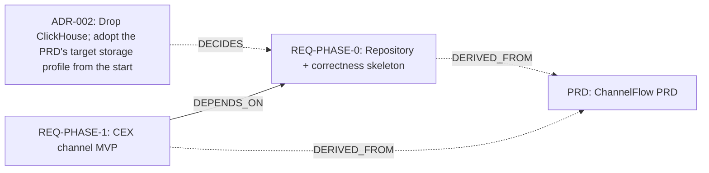


### Phase 1

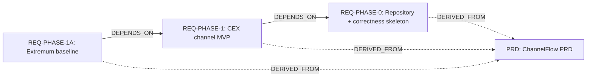


### Phase 1A

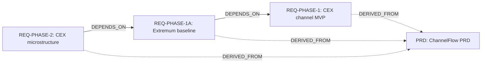


### Phase 2

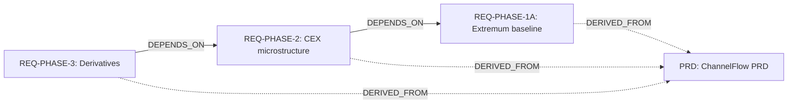


### Phase 3

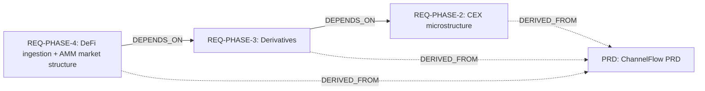


### Phase 4

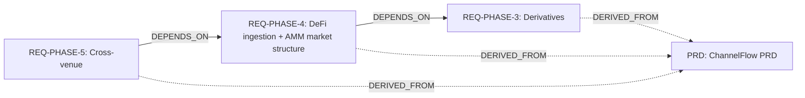


### Phase 5

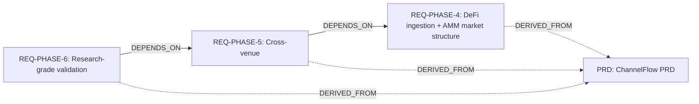


### Phase 6

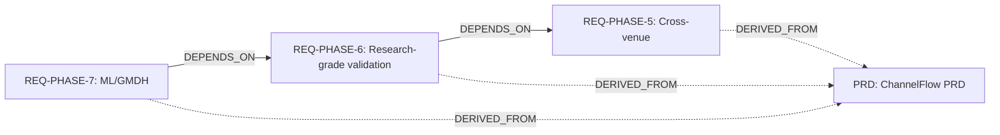


### Phase 7

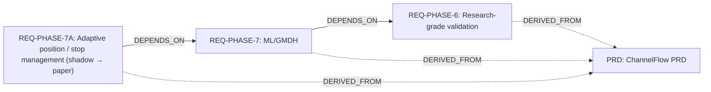


### Phase 7A

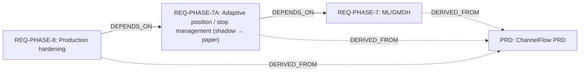


### Phase 8

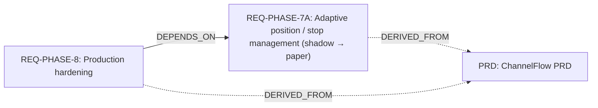
<!-- trace:end -->
