# Traceability Dashboard

Generated by `make graph`. Do not edit between the markers.

<!-- trace:begin -->
## Coverage

| Requirement | Type | Phase | Status | Specs | Tests | Code |
|---|---|---|---|---|---|---|
| [[REQ-BIAS-001]] | constraint | - | draft | 0 | 0 | 0 |
| [[REQ-BIAS-002]] | constraint | - | draft | 0 | 0 | 0 |
| [[REQ-BIAS-003]] | constraint | - | draft | 0 | 0 | 0 |
| [[REQ-BIAS-004]] | constraint | - | draft | 0 | 0 | 0 |
| [[REQ-BIAS-005]] | constraint | - | draft | 0 | 0 | 0 |
| [[REQ-BIAS-006]] | constraint | - | draft | 0 | 0 | 0 |
| [[REQ-BIAS-007]] | constraint | - | draft | 0 | 0 | 0 |
| [[REQ-BIAS-008]] | constraint | - | draft | 0 | 0 | 0 |
| [[REQ-BIAS-009]] | constraint | - | draft | 0 | 0 | 0 |
| [[REQ-BIAS-010]] | constraint | - | draft | 0 | 0 | 0 |
| [[REQ-BIAS-011]] | constraint | - | draft | 0 | 0 | 0 |
| [[REQ-EXP-001]] | experiment | - | draft | 0 | 0 | 0 |
| [[REQ-EXP-002]] | experiment | - | draft | 0 | 0 | 0 |
| [[REQ-EXP-003]] | experiment | - | draft | 0 | 0 | 0 |
| [[REQ-EXP-004]] | experiment | - | draft | 0 | 0 | 0 |
| [[REQ-EXP-005]] | experiment | - | draft | 0 | 0 | 0 |
| [[REQ-EXP-006]] | experiment | - | draft | 0 | 0 | 0 |
| [[REQ-EXP-007]] | experiment | - | draft | 0 | 0 | 0 |
| [[REQ-EXP-008]] | experiment | - | draft | 0 | 0 | 0 |
| [[REQ-EXP-009]] | experiment | - | draft | 0 | 0 | 0 |
| [[REQ-EXP-010]] | experiment | - | draft | 0 | 0 | 0 |
| [[REQ-EXP-011]] | experiment | - | draft | 0 | 0 | 0 |
| [[REQ-EXP-012]] | experiment | - | draft | 0 | 0 | 0 |
| [[REQ-EXP-013]] | experiment | - | draft | 0 | 0 | 0 |
| [[REQ-EXP-014]] | experiment | - | draft | 0 | 0 | 0 |
| [[REQ-EXP-015]] | experiment | - | draft | 0 | 0 | 0 |
| [[REQ-EXP-016]] | experiment | - | draft | 0 | 0 | 0 |
| [[REQ-EXP-017]] | experiment | - | draft | 0 | 0 | 0 |
| [[REQ-INFRA-001]] | infrastructure | - | implemented | 1 | 6 | 8 |
| [[REQ-NRT-A]] | constraint | - | draft | 0 | 0 | 0 |
| [[REQ-NRT-B]] | constraint | - | draft | 0 | 0 | 0 |
| [[REQ-NRT-C]] | constraint | - | draft | 0 | 0 | 0 |
| [[REQ-NRT-D]] | constraint | - | draft | 0 | 0 | 0 |
| [[REQ-NRT-E]] | constraint | - | draft | 0 | 0 | 0 |
| [[REQ-NRT-F]] | constraint | - | draft | 0 | 0 | 0 |
| [[REQ-PHASE-0]] | phase | 0 | draft | 0 | 0 | 0 |
| [[REQ-PHASE-1]] | phase | 1 | draft | 0 | 0 | 0 |
| [[REQ-PHASE-1A]] | phase | 1A | draft | 0 | 0 | 0 |
| [[REQ-PHASE-2]] | phase | 2 | draft | 0 | 0 | 0 |
| [[REQ-PHASE-3]] | phase | 3 | draft | 0 | 0 | 0 |
| [[REQ-PHASE-4]] | phase | 4 | draft | 0 | 0 | 0 |
| [[REQ-PHASE-5]] | phase | 5 | draft | 0 | 0 | 0 |
| [[REQ-PHASE-6]] | phase | 6 | draft | 0 | 0 | 0 |
| [[REQ-PHASE-7]] | phase | 7 | draft | 0 | 0 | 0 |
| [[REQ-PHASE-7A]] | phase | 7A | draft | 0 | 0 | 0 |
| [[REQ-PHASE-8]] | phase | 8 | draft | 0 | 0 | 0 |
| [[REQ-PRIN-001]] | constraint | - | draft | 0 | 0 | 0 |
| [[REQ-PRIN-002]] | constraint | - | draft | 0 | 0 | 0 |
| [[REQ-PRIN-003]] | constraint | - | draft | 0 | 0 | 0 |
| [[REQ-PRIN-004]] | constraint | - | draft | 0 | 0 | 0 |
| [[REQ-PRIN-005]] | constraint | - | draft | 0 | 0 | 0 |
| [[REQ-PRIN-006]] | constraint | - | draft | 0 | 0 | 0 |
| [[REQ-PRIN-007]] | constraint | - | draft | 0 | 0 | 0 |
| [[REQ-PRIN-008]] | constraint | - | draft | 0 | 0 | 0 |
| [[REQ-PRIN-009]] | constraint | - | draft | 0 | 0 | 0 |
| [[REQ-PRIN-010]] | constraint | - | draft | 0 | 0 | 0 |
| [[REQ-PRIN-011]] | constraint | - | draft | 0 | 0 | 0 |
| [[REQ-PRIN-012]] | constraint | - | draft | 0 | 0 | 0 |
| [[REQ-PRIN-013]] | constraint | - | draft | 0 | 0 | 0 |
| [[REQ-PRIN-014]] | constraint | - | draft | 0 | 0 | 0 |
| [[REQ-US-001]] | user-story | - | draft | 0 | 0 | 0 |
| [[REQ-US-002]] | user-story | - | draft | 0 | 0 | 0 |
| [[REQ-US-003]] | user-story | - | draft | 0 | 0 | 0 |
| [[REQ-US-004]] | user-story | - | draft | 0 | 0 | 0 |
| [[REQ-US-005]] | user-story | - | draft | 0 | 0 | 0 |
| [[REQ-US-006]] | user-story | - | draft | 0 | 0 | 0 |
| [[REQ-US-007]] | user-story | - | draft | 0 | 0 | 0 |
| [[REQ-WP-001]] | work-package | - | draft | 0 | 0 | 0 |
| [[REQ-WP-002]] | work-package | - | draft | 0 | 0 | 0 |
| [[REQ-WP-003]] | work-package | - | draft | 0 | 0 | 0 |
| [[REQ-WP-004]] | work-package | - | draft | 0 | 0 | 0 |
| [[REQ-WP-005]] | work-package | - | draft | 0 | 0 | 0 |
| [[REQ-WP-006]] | work-package | - | draft | 0 | 0 | 0 |
| [[REQ-WP-007]] | work-package | - | draft | 0 | 0 | 0 |
| [[REQ-WP-008]] | work-package | - | draft | 0 | 0 | 0 |
| [[REQ-WP-009]] | work-package | - | draft | 0 | 0 | 0 |
| [[REQ-WP-010]] | work-package | - | draft | 0 | 0 | 0 |
| [[REQ-WP-011]] | work-package | - | draft | 0 | 0 | 0 |
| [[REQ-WP-012]] | work-package | - | draft | 0 | 0 | 0 |
| [[REQ-WP-013]] | work-package | - | draft | 0 | 0 | 0 |
| [[REQ-WP-014]] | work-package | - | draft | 0 | 0 | 0 |
| [[REQ-WP-015]] | work-package | - | draft | 0 | 0 | 0 |
| [[REQ-WP-016]] | work-package | - | draft | 0 | 0 | 0 |
| [[REQ-WP-017]] | work-package | - | draft | 0 | 0 | 0 |
| [[REQ-WP-018]] | work-package | - | draft | 0 | 0 | 0 |
| [[REQ-WP-019]] | work-package | - | draft | 0 | 0 | 0 |
| [[REQ-WP-020]] | work-package | - | draft | 0 | 0 | 0 |

## Violations

No violations.

## Graph

### All requirements

Every node currently in the graph, regardless of `phase:` -- the only view below that includes a requirement whose phase is unset, and anything linked only to one. `DERIVED_FROM` edges (every requirement points back to the PRD) are omitted here: with ~100 requirements they are most of the edges in this view and carry no information beyond "this is a requirement" -- they still render in each per-phase diagram below, where the smaller edge count keeps them legible.

```mermaid
graph LR
  tools_trace_cli_py["tools/trace/cli.py"]
  tools_trace_collect_py["tools/trace/collect.py"]
  tools_trace_dashboard_py["tools/trace/dashboard.py"]
  tools_trace_frontmatter_py["tools/trace/frontmatter.py"]
  tools_trace_graph_py["tools/trace/graph.py"]
  tools_trace_model_py["tools/trace/model.py"]
  tools_trace_pytest_plugin_py["tools/trace/pytest_plugin.py"]
  tools_trace_validate_py["tools/trace/validate.py"]
  ADR_001["ADR-001: Graphify provides semantic search, not traceability"]
  ADR_002["ADR-002: Drop ClickHouse; adopt the PRD's target storage profile from the start"]
  OUT_2026_09_07_implement_traceability_tooling["OUT-2026-09-07-implement-traceability-tooling"]
  OUT_2026_09_07_plan_traceability_tooling["OUT-2026-09-07-plan-traceability-tooling"]
  OUT_2026_09_07_spec_traceability_tooling["OUT-2026-09-07-spec-traceability-tooling"]
  OUT_2026_09_07_tasks_traceability_tooling["OUT-2026-09-07-tasks-traceability-tooling"]
  PRD["PRD: ChannelFlow PRD"]
  REQ_BIAS_001["REQ-BIAS-001: No random train/test primary split."]
  REQ_BIAS_002["REQ-BIAS-002: No centered moving filters in live features."]
  REQ_BIAS_003["REQ-BIAS-003: No pivot that requires future bars unless the feature availability time is shifted to confirmation time."]
  REQ_BIAS_004["REQ-BIAS-004: No using final daily high/low before daily close."]
  REQ_BIAS_005["REQ-BIAS-005: No using current funding settlement before it becomes known."]
  REQ_BIAS_006["REQ-BIAS-006: No using later corrected/reconstructed DEX state as if known earlier unless audit semantics explicitly allow it."]
  REQ_BIAS_007["REQ-BIAS-007: No survivor-only universe without point-in-time listing history."]
  REQ_BIAS_008["REQ-BIAS-008: No using current top-volume coin list for historical universe backtest without point-in-time universe reconstruction."]
  REQ_BIAS_009["REQ-BIAS-009: Fees/slippage must be included in economic evaluation."]
  REQ_BIAS_010["REQ-BIAS-010: Optimize parameters on train/validation; locked test remains untouched."]
  REQ_BIAS_011["REQ-BIAS-011: Store all discarded experiment variants to reduce silent cherry-picking."]
  REQ_EXP_001["REQ-EXP-001: Channel model comparison"]
  REQ_EXP_002["REQ-EXP-002: Lookback sensitivity"]
  REQ_EXP_003["REQ-EXP-003: Rejection detector"]
  REQ_EXP_004["REQ-EXP-004: OFI incremental value"]
  REQ_EXP_005["REQ-EXP-005: Volume profile confluence"]
  REQ_EXP_006["REQ-EXP-006: Derivatives context"]
  REQ_EXP_007["REQ-EXP-007: DEX incremental value"]
  REQ_EXP_008["REQ-EXP-008: GMDH vs baselines"]
  REQ_EXP_009["REQ-EXP-009: Forecast corridor calibration"]
  REQ_EXP_010["REQ-EXP-010: Cross-venue lead/lag"]
  REQ_EXP_011["REQ-EXP-011: Structural extremum detector"]
  REQ_EXP_012["REQ-EXP-012: Causal derivative turning points"]
  REQ_EXP_013["REQ-EXP-013: GMDH derivative extrema"]
  REQ_EXP_014["REQ-EXP-014: Order-flow exhaustion around extrema"]
  REQ_EXP_015["REQ-EXP-015: Derivatives/DeFi confluence at turning points"]
  REQ_EXP_016["REQ-EXP-016: Multi-scale extrema"]
  REQ_EXP_017["REQ-EXP-017: Adaptive stop-management policy"]
  REQ_INFRA_001["REQ-INFRA-001: Deterministic traceability graph with a coverage validator"]
  REQ_NRT_A["REQ-NRT-A: future-bar invariance"]
  REQ_NRT_B["REQ-NRT-B: candidate chronology"]
  REQ_NRT_C["REQ-NRT-C: confirmation legality"]
  REQ_NRT_D["REQ-NRT-D: centered filter prohibition"]
  REQ_NRT_E["REQ-NRT-E: replay parity"]
  REQ_NRT_F["REQ-NRT-F: GMDH derivative root stability"]
  REQ_PHASE_0["REQ-PHASE-0: Repository + correctness skeleton"]
  REQ_PHASE_1["REQ-PHASE-1: CEX channel MVP"]
  REQ_PHASE_1A["REQ-PHASE-1A: Extremum baseline"]
  REQ_PHASE_2["REQ-PHASE-2: CEX microstructure"]
  REQ_PHASE_3["REQ-PHASE-3: Derivatives"]
  REQ_PHASE_4["REQ-PHASE-4: DeFi ingestion + AMM market structure"]
  REQ_PHASE_5["REQ-PHASE-5: Cross-venue"]
  REQ_PHASE_6["REQ-PHASE-6: Research-grade validation"]
  REQ_PHASE_7["REQ-PHASE-7: ML/GMDH"]
  REQ_PHASE_7A["REQ-PHASE-7A: Adaptive position / stop management (shadow → paper)"]
  REQ_PHASE_8["REQ-PHASE-8: Production hardening"]
  REQ_PRIN_001["REQ-PRIN-001: Implement the system incrementally, by phases and by the acceptance criteria in this PRD."]
  REQ_PRIN_002["REQ-PRIN-002: Do not introduce future leakage, look-ahead, or repainting even if it improves the backtest."]
  REQ_PRIN_003["REQ-PRIN-003: All indicators/features at timestamp `t` must use only data with `event_time <= t`, and only values that were actually available in real time at the moment the decision was made."]
  REQ_PRIN_004["REQ-PRIN-004: Distinguish `event_time`, `exchange_time`, `block_time`, `ingest_time`, `bar_open_time`, `bar_close_time`."]
  REQ_PRIN_005["REQ-PRIN-005: Do not rewrite historical channel snapshots or signal snapshots after they are finalized."]
  REQ_PRIN_006["REQ-PRIN-006: Add any ML/GMDH model only after strong deterministic baselines and leakage tests exist."]
  REQ_PRIN_007["REQ-PRIN-007: Any signal with a probabilistic score must have calibration metrics, not just accuracy."]
  REQ_PRIN_008["REQ-PRIN-008: Every feature must have a description of its semantics, unit of measurement, cadence, source, freshness, and leakage policy."]
  REQ_PRIN_009["REQ-PRIN-009: Code must be testable, deterministic in backtest mode, and as identical as possible between live and replay."]
  REQ_PRIN_010["REQ-PRIN-010: New exchange/DEX connectors must implement a shared canonical interface."]
  REQ_PRIN_011["REQ-PRIN-011: In Phase 1-3 the system must not automatically open positions. It only produces signals and alerts."]
  REQ_PRIN_012["REQ-PRIN-012: All numeric thresholds must be configurable; hard-coded trading thresholds are forbidden, except in test fixtures."]
  REQ_PRIN_013["REQ-PRIN-013: All backtest/research results must be reproducible from a versioned dataset + config + code commit hash + model artifact hash."]
  REQ_PRIN_014["REQ-PRIN-014: Before optimizing for performance -- correctness, replay parity, and data integrity."]
  REQ_US_001["REQ-US-001: Scan markets"]
  REQ_US_002["REQ-US-002: Open exact chart state"]
  REQ_US_003["REQ-US-003: Verify non-repainting"]
  REQ_US_004["REQ-US-004: Explain setup"]
  REQ_US_005["REQ-US-005: Backtest a setup family"]
  REQ_US_006["REQ-US-006: Compare feature families"]
  REQ_US_007["REQ-US-007: Train ML/GMDH only on point-in-time features"]
  REQ_WP_001["REQ-WP-001: Project bootstrap"]
  REQ_WP_002["REQ-WP-002: Domain model"]
  REQ_WP_003["REQ-WP-003: Binance connector"]
  REQ_WP_004["REQ-WP-004: Order book service"]
  REQ_WP_005["REQ-WP-005: Bar aggregation"]
  REQ_WP_006["REQ-WP-006: Channel baseline"]
  REQ_WP_007["REQ-WP-007: Signal state machine"]
  REQ_WP_008["REQ-WP-008: Telegram"]
  REQ_WP_009["REQ-WP-009: Chart"]
  REQ_WP_010["REQ-WP-010: Backtest v1"]
  REQ_WP_011["REQ-WP-011: OFI/LOB features"]
  REQ_WP_012["REQ-WP-012: Volume profile"]
  REQ_WP_013["REQ-WP-013: Derivatives"]
  REQ_WP_014["REQ-WP-014: EVM connector"]
  REQ_WP_015["REQ-WP-015: Uniswap v3 adapter"]
  REQ_WP_016["REQ-WP-016: Cross-venue"]
  REQ_WP_017["REQ-WP-017: PIT dataset"]
  REQ_WP_018["REQ-WP-018: GMDH"]
  REQ_WP_019["REQ-WP-019: Price extrema / turning points"]
  REQ_WP_020["REQ-WP-020: Adaptive stop management"]
  SPEC_001_traceability_tooling["SPEC-001-traceability-tooling"]
  tests_tools_trace_test_cli_py__test_validate_exits_one_and_names_the_rule["tests/tools/trace/test_cli.py::test_validate_exits_one_and_names_the_rule"]
  tests_tools_trace_test_dashboard_py__test_update_requirement_notes_is_idempotent["tests/tools/trace/test_dashboard.py::test_update_requirement_notes_is_idempotent"]
  tests_tools_trace_test_graph_py__test_build_graph_wires_every_edge_kind["tests/tools/trace/test_graph.py::test_build_graph_wires_every_edge_kind"]
  tests_tools_trace_test_pytest_plugin_py__test_parametrized_tests_are_recorded_once_per_case["tests/tools/trace/test_pytest_plugin.py::test_parametrized_tests_are_recorded_once_per_case"]
  tests_tools_trace_test_validate_py__test_r5_fails_for_a_planned_hard_gated_constraint_without_a_test["tests/tools/trace/test_validate.py::test_r5_fails_for_a_planned_hard_gated_constraint_without_a_test"]
  tests_tools_trace_test_vault_hard_gated_py__test_every_bias_requirement_is_hard_gated["tests/tools/trace/test_vault_hard_gated.py::test_every_bias_requirement_is_hard_gated"]
  ADR_002 -.->|DECIDES| REQ_PHASE_0
  ADR_002 -.->|DECIDES| REQ_WP_001
  REQ_PHASE_1 -->|DEPENDS_ON| REQ_PHASE_0
  REQ_PHASE_1A -->|DEPENDS_ON| REQ_PHASE_1
  REQ_PHASE_2 -->|DEPENDS_ON| REQ_PHASE_1A
  REQ_PHASE_3 -->|DEPENDS_ON| REQ_PHASE_2
  REQ_PHASE_4 -->|DEPENDS_ON| REQ_PHASE_3
  REQ_PHASE_5 -->|DEPENDS_ON| REQ_PHASE_4
  REQ_PHASE_6 -->|DEPENDS_ON| REQ_PHASE_5
  REQ_PHASE_7 -->|DEPENDS_ON| REQ_PHASE_6
  REQ_PHASE_7A -->|DEPENDS_ON| REQ_PHASE_7
  REQ_PHASE_8 -->|DEPENDS_ON| REQ_PHASE_7A
  REQ_WP_004 -->|DEPENDS_ON| REQ_WP_003
  REQ_WP_006 -->|DEPENDS_ON| REQ_WP_005
  REQ_WP_007 -->|DEPENDS_ON| REQ_WP_006
  REQ_WP_008 -->|DEPENDS_ON| REQ_WP_007
  REQ_WP_009 -->|DEPENDS_ON| REQ_WP_005
  REQ_WP_009 -->|DEPENDS_ON| REQ_WP_006
  REQ_WP_009 -->|DEPENDS_ON| REQ_WP_007
  REQ_WP_010 -->|DEPENDS_ON| REQ_WP_005
  REQ_WP_010 -->|DEPENDS_ON| REQ_WP_007
  REQ_WP_011 -->|DEPENDS_ON| REQ_WP_004
  REQ_WP_011 -->|DEPENDS_ON| REQ_WP_005
  REQ_WP_012 -->|DEPENDS_ON| REQ_WP_003
  REQ_WP_012 -->|DEPENDS_ON| REQ_WP_009
  REQ_WP_013 -->|DEPENDS_ON| REQ_WP_003
  REQ_WP_015 -->|DEPENDS_ON| REQ_WP_014
  REQ_WP_018 -->|DEPENDS_ON| REQ_WP_017
  REQ_WP_020 -->|DEPENDS_ON| REQ_WP_006
  REQ_WP_020 -->|DEPENDS_ON| REQ_WP_011
  REQ_WP_020 -->|DEPENDS_ON| REQ_WP_013
  REQ_WP_020 -->|DEPENDS_ON| REQ_WP_019
  tools_trace_cli_py -->|IMPLEMENTS| REQ_INFRA_001
  tools_trace_collect_py -->|IMPLEMENTS| REQ_INFRA_001
  tools_trace_dashboard_py -->|IMPLEMENTS| REQ_INFRA_001
  tools_trace_frontmatter_py -->|IMPLEMENTS| REQ_INFRA_001
  tools_trace_graph_py -->|IMPLEMENTS| REQ_INFRA_001
  tools_trace_model_py -->|IMPLEMENTS| REQ_INFRA_001
  tools_trace_pytest_plugin_py -->|IMPLEMENTS| REQ_INFRA_001
  tools_trace_validate_py -->|IMPLEMENTS| REQ_INFRA_001
  OUT_2026_09_07_implement_traceability_tooling -.->|RECORDS| REQ_INFRA_001
  OUT_2026_09_07_plan_traceability_tooling -.->|RECORDS| REQ_INFRA_001
  OUT_2026_09_07_spec_traceability_tooling -.->|RECORDS| REQ_INFRA_001
  OUT_2026_09_07_tasks_traceability_tooling -.->|RECORDS| REQ_INFRA_001
  SPEC_001_traceability_tooling ==>|SPECIFIES| REQ_INFRA_001
  tests_tools_trace_test_cli_py__test_validate_exits_one_and_names_the_rule -->|VERIFIES| REQ_INFRA_001
  tests_tools_trace_test_dashboard_py__test_update_requirement_notes_is_idempotent -->|VERIFIES| REQ_INFRA_001
  tests_tools_trace_test_graph_py__test_build_graph_wires_every_edge_kind -->|VERIFIES| REQ_INFRA_001
  tests_tools_trace_test_pytest_plugin_py__test_parametrized_tests_are_recorded_once_per_case -->|VERIFIES| REQ_INFRA_001
  tests_tools_trace_test_validate_py__test_r5_fails_for_a_planned_hard_gated_constraint_without_a_test -->|VERIFIES| REQ_INFRA_001
  tests_tools_trace_test_vault_hard_gated_py__test_every_bias_requirement_is_hard_gated -->|VERIFIES| REQ_INFRA_001
```

### Phase 0

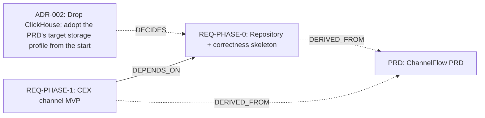

### Phase 1

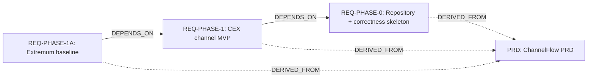

### Phase 1A

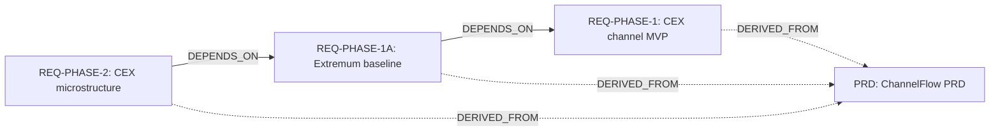

### Phase 2

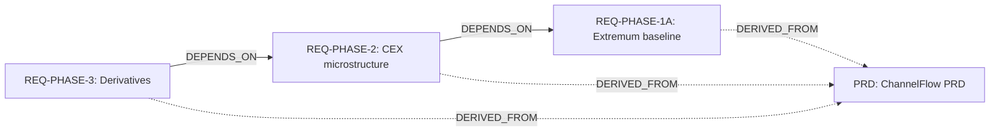

### Phase 3

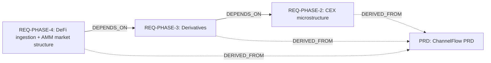

### Phase 4

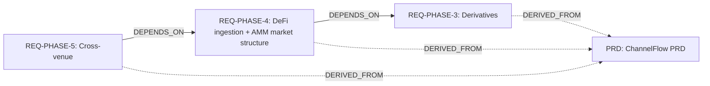

### Phase 5

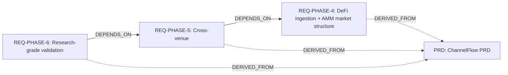

### Phase 6

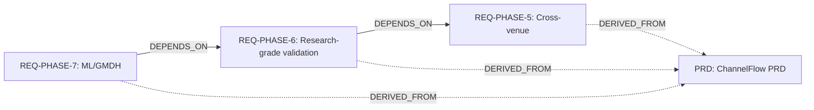

### Phase 7

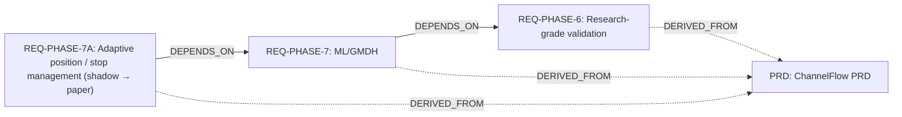

### Phase 7A

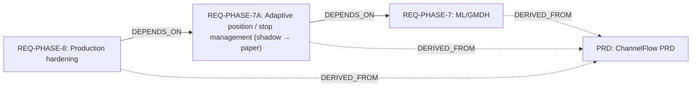

### Phase 8

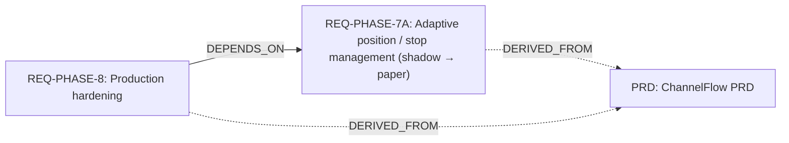
<!-- trace:end -->
