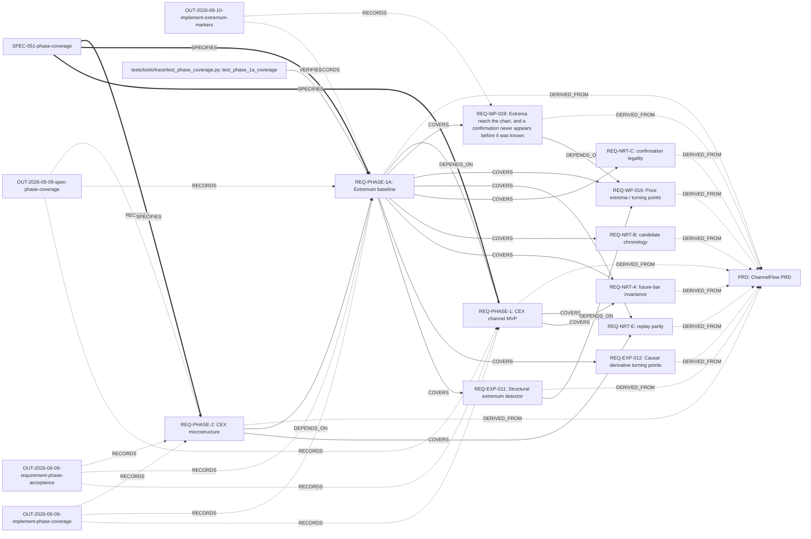
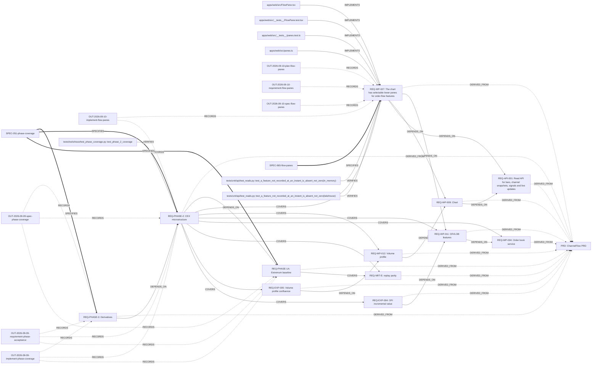
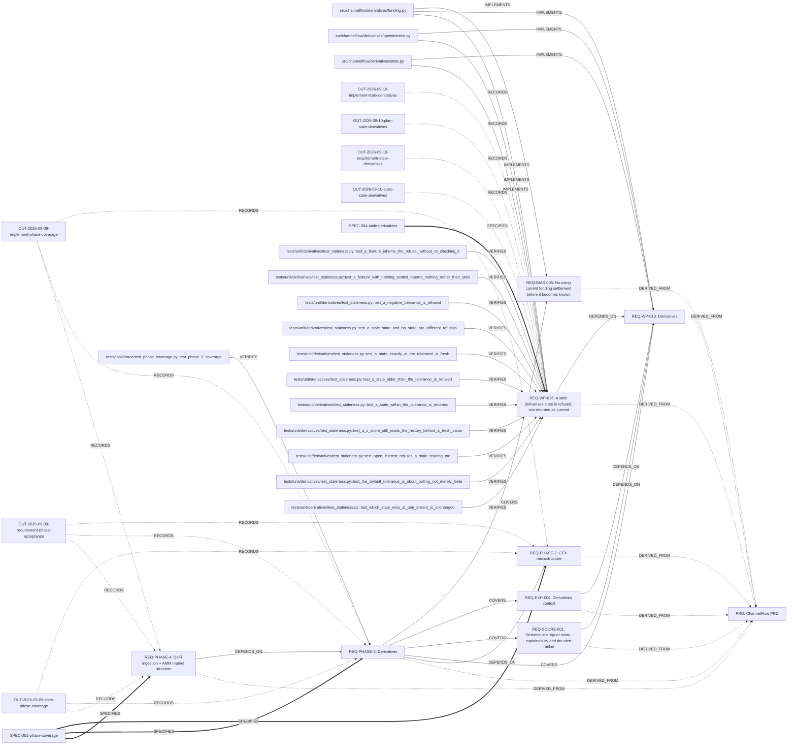
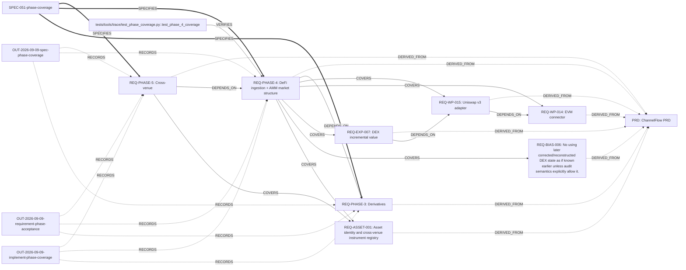
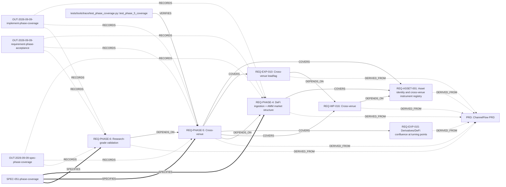
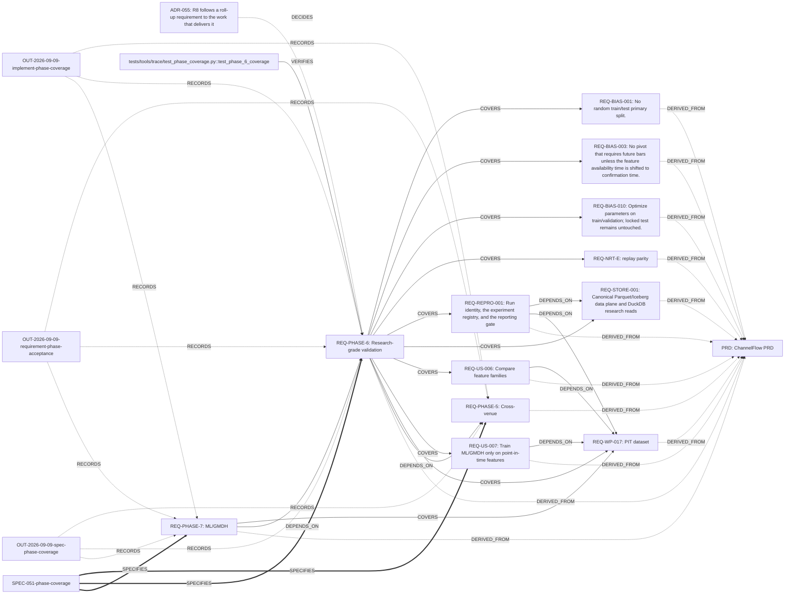
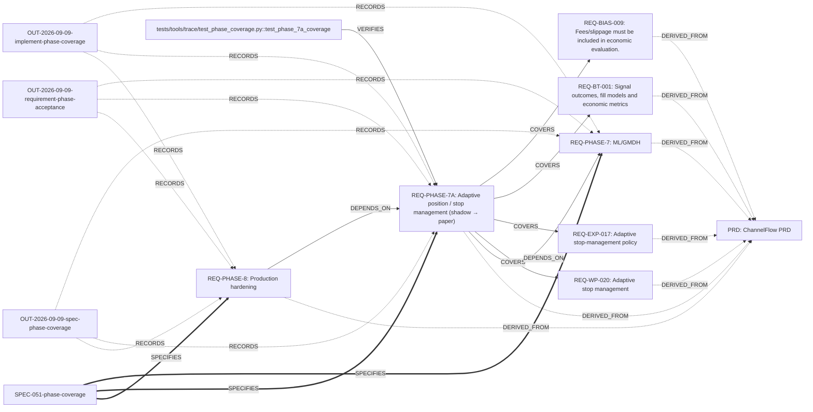
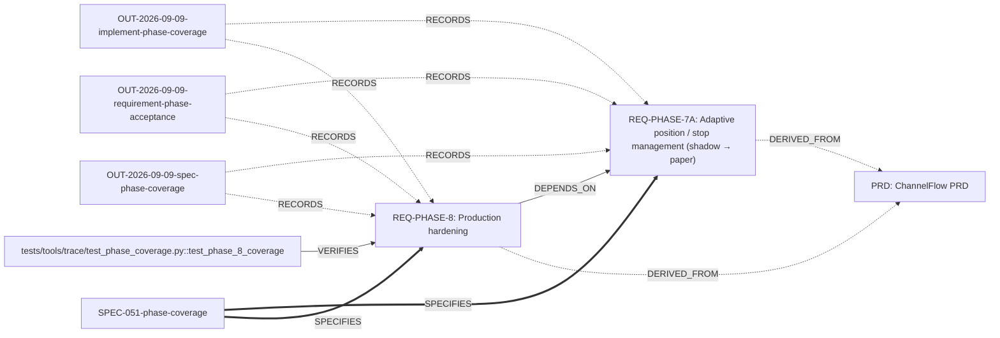

# Traceability Dashboard

Generated by `make graph`. Do not edit between the markers.

<!-- trace:begin -->
## Coverage

| Requirement | Type | Phase | Status | Specs | Tests | Code |
|---|---|---|---|---|---|---|
| [[REQ-API-001]] | work-package | - | implemented | 1 | 53 | 8 |
| [[REQ-ASSET-001]] | work-package | - | implemented | 1 | 25 | 3 |
| [[REQ-BIAS-001]] | constraint | - | implemented | 1 | 2 | 2 |
| [[REQ-BIAS-002]] | constraint | - | implemented | 1 | 8 | 2 |
| [[REQ-BIAS-003]] | constraint | - | implemented | 1 | 3 | 2 |
| [[REQ-BIAS-004]] | constraint | - | implemented | 1 | 1 | 2 |
| [[REQ-BIAS-005]] | constraint | - | implemented | 1 | 2 | 1 |
| [[REQ-BIAS-006]] | constraint | - | implemented | 1 | 2 | 1 |
| [[REQ-BIAS-007]] | constraint | - | implemented | 1 | 2 | 1 |
| [[REQ-BIAS-008]] | constraint | - | implemented | 1 | 2 | 1 |
| [[REQ-BIAS-009]] | constraint | - | implemented | 1 | 2 | 1 |
| [[REQ-BIAS-010]] | constraint | - | implemented | 1 | 1 | 1 |
| [[REQ-BIAS-011]] | constraint | - | implemented | 2 | 53 | 5 |
| [[REQ-BT-001]] | work-package | - | implemented | 1 | 26 | 4 |
| [[REQ-CHAN-001]] | work-package | - | implemented | 1 | 24 | 5 |
| [[REQ-EXP-001]] | experiment | - | implemented | 1 | 16 | 3 |
| [[REQ-EXP-002]] | experiment | - | implemented | 1 | 14 | 2 |
| [[REQ-EXP-003]] | experiment | - | implemented | 1 | 20 | 4 |
| [[REQ-EXP-004]] | experiment | - | implemented | 1 | 12 | 4 |
| [[REQ-EXP-005]] | experiment | - | implemented | 1 | 14 | 2 |
| [[REQ-EXP-006]] | experiment | - | implemented | 1 | 12 | 2 |
| [[REQ-EXP-007]] | experiment | - | implemented | 1 | 9 | 3 |
| [[REQ-EXP-008]] | experiment | - | implemented | 1 | 19 | 5 |
| [[REQ-EXP-009]] | experiment | - | implemented | 1 | 13 | 2 |
| [[REQ-EXP-010]] | experiment | - | implemented | 1 | 16 | 2 |
| [[REQ-EXP-011]] | experiment | - | implemented | 1 | 17 | 3 |
| [[REQ-EXP-012]] | experiment | - | implemented | 1 | 12 | 2 |
| [[REQ-EXP-013]] | experiment | - | implemented | 1 | 16 | 2 |
| [[REQ-EXP-014]] | experiment | - | implemented | 1 | 17 | 2 |
| [[REQ-EXP-015]] | experiment | - | implemented | 1 | 15 | 2 |
| [[REQ-EXP-016]] | experiment | - | implemented | 1 | 17 | 2 |
| [[REQ-EXP-017]] | experiment | - | implemented | 1 | 19 | 2 |
| [[REQ-INFRA-001]] | infrastructure | - | implemented | 1 | 8 | 8 |
| [[REQ-INFRA-002]] | infrastructure | - | implemented | 1 | 4 | 1 |
| [[REQ-INFRA-003]] | infrastructure | 0 | implemented | 1 | 12 | 2 |
| [[REQ-NRT-A]] | constraint | - | implemented | 1 | 3 | 1 |
| [[REQ-NRT-B]] | constraint | - | implemented | 1 | 2 | 1 |
| [[REQ-NRT-C]] | constraint | - | implemented | 1 | 5 | 2 |
| [[REQ-NRT-D]] | constraint | - | implemented | 1 | 4 | 2 |
| [[REQ-NRT-E]] | constraint | - | implemented | 1 | 3 | 1 |
| [[REQ-NRT-F]] | constraint | - | implemented | 1 | 13 | 1 |
| [[REQ-PHASE-0]] | phase | 0 | implemented | 1 | 1 | 0 |
| [[REQ-PHASE-1]] | phase | 1 | implemented | 1 | 1 | 0 |
| [[REQ-PHASE-1A]] | phase | 1A | implemented | 1 | 1 | 0 |
| [[REQ-PHASE-2]] | phase | 2 | implemented | 1 | 1 | 0 |
| [[REQ-PHASE-3]] | phase | 3 | planned | 1 | 1 | 0 |
| [[REQ-PHASE-4]] | phase | 4 | planned | 1 | 1 | 0 |
| [[REQ-PHASE-5]] | phase | 5 | planned | 1 | 1 | 0 |
| [[REQ-PHASE-6]] | phase | 6 | implemented | 1 | 1 | 0 |
| [[REQ-PHASE-7]] | phase | 7 | implemented | 1 | 1 | 0 |
| [[REQ-PHASE-7A]] | phase | 7A | planned | 1 | 1 | 0 |
| [[REQ-PHASE-8]] | phase | 8 | planned | 1 | 1 | 0 |
| [[REQ-PIPE-001]] | work-package | - | implemented | 1 | 20 | 2 |
| [[REQ-PRIN-001]] | constraint | - | draft | 0 | 0 | 0 |
| [[REQ-PRIN-002]] | constraint | - | draft | 0 | 0 | 0 |
| [[REQ-PRIN-003]] | constraint | - | draft | 0 | 0 | 0 |
| [[REQ-PRIN-004]] | constraint | - | draft | 0 | 0 | 0 |
| [[REQ-PRIN-005]] | constraint | - | draft | 0 | 0 | 0 |
| [[REQ-PRIN-006]] | constraint | - | draft | 0 | 0 | 0 |
| [[REQ-PRIN-007]] | constraint | - | draft | 0 | 0 | 0 |
| [[REQ-PRIN-008]] | constraint | - | implemented | 1 | 7 | 4 |
| [[REQ-PRIN-009]] | constraint | - | draft | 0 | 0 | 0 |
| [[REQ-PRIN-010]] | constraint | - | draft | 0 | 0 | 0 |
| [[REQ-PRIN-011]] | constraint | - | draft | 0 | 0 | 0 |
| [[REQ-PRIN-012]] | constraint | - | draft | 0 | 0 | 0 |
| [[REQ-PRIN-013]] | constraint | - | draft | 0 | 0 | 0 |
| [[REQ-PRIN-014]] | constraint | - | draft | 0 | 0 | 0 |
| [[REQ-REPRO-001]] | work-package | - | implemented | 1 | 37 | 5 |
| [[REQ-SCORE-001]] | work-package | - | implemented | 1 | 32 | 5 |
| [[REQ-STORE-001]] | work-package | - | implemented | 1 | 94 | 6 |
| [[REQ-STORE-002]] | work-package | - | implemented | 1 | 39 | 5 |
| [[REQ-TBL-001]] | work-package | - | implemented | 1 | 13 | 2 |
| [[REQ-US-001]] | user-story | - | implemented | 1 | 12 | 4 |
| [[REQ-US-002]] | user-story | - | implemented | 1 | 6 | 7 |
| [[REQ-US-003]] | user-story | - | implemented | 1 | 13 | 3 |
| [[REQ-US-004]] | user-story | - | implemented | 1 | 8 | 5 |
| [[REQ-US-005]] | user-story | - | implemented | 1 | 14 | 4 |
| [[REQ-US-006]] | user-story | - | implemented | 1 | 13 | 2 |
| [[REQ-US-007]] | user-story | - | implemented | 1 | 9 | 5 |
| [[REQ-WP-001]] | work-package | - | implemented | 1 | 2 | 3 |
| [[REQ-WP-002]] | work-package | - | implemented | 1 | 30 | 8 |
| [[REQ-WP-003]] | work-package | - | implemented | 1 | 19 | 6 |
| [[REQ-WP-004]] | work-package | - | implemented | 1 | 25 | 3 |
| [[REQ-WP-005]] | work-package | - | implemented | 1 | 9 | 3 |
| [[REQ-WP-006]] | work-package | - | implemented | 1 | 20 | 5 |
| [[REQ-WP-007]] | work-package | - | implemented | 1 | 16 | 4 |
| [[REQ-WP-008]] | work-package | - | implemented | 1 | 33 | 6 |
| [[REQ-WP-009]] | work-package | - | implemented | 1 | 2 | 15 |
| [[REQ-WP-010]] | work-package | - | implemented | 1 | 16 | 3 |
| [[REQ-WP-011]] | work-package | - | implemented | 1 | 52 | 6 |
| [[REQ-WP-012]] | work-package | - | implemented | 1 | 26 | 6 |
| [[REQ-WP-013]] | work-package | - | implemented | 1 | 37 | 6 |
| [[REQ-WP-014]] | work-package | - | implemented | 1 | 27 | 5 |
| [[REQ-WP-015]] | work-package | - | implemented | 1 | 42 | 5 |
| [[REQ-WP-016]] | work-package | - | implemented | 1 | 36 | 5 |
| [[REQ-WP-017]] | work-package | - | implemented | 1 | 37 | 7 |
| [[REQ-WP-018]] | work-package | - | implemented | 1 | 21 | 6 |
| [[REQ-WP-019]] | work-package | - | implemented | 2 | 59 | 12 |
| [[REQ-WP-020]] | work-package | - | implemented | 1 | 35 | 4 |
| [[REQ-WP-021]] | work-package | 1 | implemented | 1 | 31 | 2 |
| [[REQ-WP-022]] | work-package | 7 | implemented | 1 | 29 | 1 |
| [[REQ-WP-023]] | work-package | 7 | implemented | 1 | 10 | 1 |
| [[REQ-WP-024]] | work-package | - | implemented | 1 | 18 | 1 |
| [[REQ-WP-026]] | work-package | 3 | implemented | 1 | 11 | 3 |
| [[REQ-WP-027]] | work-package | 2 | implemented | 1 | 2 | 4 |
| [[REQ-WP-028]] | work-package | 1 | implemented | 1 | 21 | 3 |
| [[REQ-WP-029]] | work-package | 1 | specified | 1 | 0 | 0 |

## Violations

No violations.

## Graph

### All requirements

Every node currently in the graph, regardless of `phase:` -- the only view below that includes a requirement whose phase is unset, and anything linked only to one. `DERIVED_FROM` edges (every requirement points back to the PRD) are omitted here: with ~100 requirements they are most of the edges in this view and carry no information beyond "this is a requirement" -- they still render in each per-phase diagram below, where the smaller edge count keeps them legible.

```mermaid
graph LR
  _github_workflows_ci_yml[".github/workflows/ci.yml"]
  apps_web_src_App_tsx["apps/web/src/App.tsx"]
  apps_web_src_ChannelMode_tsx["apps/web/src/ChannelMode.tsx"]
  apps_web_src_Chart_tsx["apps/web/src/Chart.tsx"]
  apps_web_src_Explanation_tsx["apps/web/src/Explanation.tsx"]
  apps_web_src_FlowPane_tsx["apps/web/src/FlowPane.tsx"]
  apps_web_src_LoadState_tsx["apps/web/src/LoadState.tsx"]
  apps_web_src___tests___ChannelMode_test_tsx["apps/web/src/__tests__/ChannelMode.test.tsx"]
  apps_web_src___tests___Chart_test_tsx["apps/web/src/__tests__/Chart.test.tsx"]
  apps_web_src___tests___Explanation_test_tsx["apps/web/src/__tests__/Explanation.test.tsx"]
  apps_web_src___tests___FlowPane_test_tsx["apps/web/src/__tests__/FlowPane.test.tsx"]
  apps_web_src___tests___LoadState_test_tsx["apps/web/src/__tests__/LoadState.test.tsx"]
  apps_web_src___tests___deepLinkOverlays_test_tsx["apps/web/src/__tests__/deepLinkOverlays.test.tsx"]
  apps_web_src___tests___extrema_test_ts["apps/web/src/__tests__/extrema.test.ts"]
  apps_web_src___tests___overlays_test_ts["apps/web/src/__tests__/overlays.test.ts"]
  apps_web_src___tests___panes_test_ts["apps/web/src/__tests__/panes.test.ts"]
  apps_web_src___tests___scaffold_test_tsx["apps/web/src/__tests__/scaffold.test.tsx"]
  apps_web_src___tests___volumeProfile_test_ts["apps/web/src/__tests__/volumeProfile.test.ts"]
  apps_web_src_api_ts["apps/web/src/api.ts"]
  apps_web_src_deepLink_ts["apps/web/src/deepLink.ts"]
  apps_web_src_extrema_ts["apps/web/src/extrema.ts"]
  apps_web_src_main_tsx["apps/web/src/main.tsx"]
  apps_web_src_overlays_ts["apps/web/src/overlays.ts"]
  apps_web_src_panes_ts["apps/web/src/panes.ts"]
  apps_web_src_series_ts["apps/web/src/series.ts"]
  apps_web_src_test_setup_ts["apps/web/src/test-setup.ts"]
  apps_web_src_types_ts["apps/web/src/types.ts"]
  apps_web_src_vite_env_d_ts["apps/web/src/vite-env.d.ts"]
  apps_web_src_volumeProfile_ts["apps/web/src/volumeProfile.ts"]
  apps_web_vite_config_ts["apps/web/vite.config.ts"]
  src_channelflow___init___py["src/channelflow/__init__.py"]
  src_channelflow_alerting___init___py["src/channelflow/alerting/__init__.py"]
  src_channelflow_alerting_dedupe_py["src/channelflow/alerting/dedupe.py"]
  src_channelflow_alerting_dispatch_py["src/channelflow/alerting/dispatch.py"]
  src_channelflow_alerting_gate_py["src/channelflow/alerting/gate.py"]
  src_channelflow_alerting_models_py["src/channelflow/alerting/models.py"]
  src_channelflow_alerting_overlays_py["src/channelflow/alerting/overlays.py"]
  src_channelflow_alerting_render_py["src/channelflow/alerting/render.py"]
  src_channelflow_api___init___py["src/channelflow/api/__init__.py"]
  src_channelflow_api_app_py["src/channelflow/api/app.py"]
  src_channelflow_api_channels_py["src/channelflow/api/channels.py"]
  src_channelflow_api_comparison_py["src/channelflow/api/comparison.py"]
  src_channelflow_api_lakehouse_repository_py["src/channelflow/api/lakehouse_repository.py"]
  src_channelflow_api_ranking_py["src/channelflow/api/ranking.py"]
  src_channelflow_api_repositories_py["src/channelflow/api/repositories.py"]
  src_channelflow_api_routes_py["src/channelflow/api/routes.py"]
  src_channelflow_api_schemas_py["src/channelflow/api/schemas.py"]
  src_channelflow_api_ws_py["src/channelflow/api/ws.py"]
  src_channelflow_assets___init___py["src/channelflow/assets/__init__.py"]
  src_channelflow_assets_models_py["src/channelflow/assets/models.py"]
  src_channelflow_assets_registry_py["src/channelflow/assets/registry.py"]
  src_channelflow_backtest___init___py["src/channelflow/backtest/__init__.py"]
  src_channelflow_backtest_economics_py["src/channelflow/backtest/economics.py"]
  src_channelflow_backtest_families_py["src/channelflow/backtest/families.py"]
  src_channelflow_backtest_fills_py["src/channelflow/backtest/fills.py"]
  src_channelflow_backtest_outcomes_py["src/channelflow/backtest/outcomes.py"]
  src_channelflow_backtest_report_py["src/channelflow/backtest/report.py"]
  src_channelflow_backtest_runner_py["src/channelflow/backtest/runner.py"]
  src_channelflow_bars___init___py["src/channelflow/bars/__init__.py"]
  src_channelflow_bars_builder_py["src/channelflow/bars/builder.py"]
  src_channelflow_bars_models_py["src/channelflow/bars/models.py"]
  src_channelflow_book___init___py["src/channelflow/book/__init__.py"]
  src_channelflow_book_book_py["src/channelflow/book/book.py"]
  src_channelflow_book_service_py["src/channelflow/book/service.py"]
  src_channelflow_bus_py["src/channelflow/bus.py"]
  src_channelflow_chain___init___py["src/channelflow/chain/__init__.py"]
  src_channelflow_chain_decoders_py["src/channelflow/chain/decoders.py"]
  src_channelflow_chain_ledger_py["src/channelflow/chain/ledger.py"]
  src_channelflow_chain_providers_py["src/channelflow/chain/providers.py"]
  src_channelflow_chain_records_py["src/channelflow/chain/records.py"]
  src_channelflow_channels___init___py["src/channelflow/channels/__init__.py"]
  src_channelflow_channels_features_py["src/channelflow/channels/features.py"]
  src_channelflow_channels_huber_py["src/channelflow/channels/huber.py"]
  src_channelflow_channels_kalman_py["src/channelflow/channels/kalman.py"]
  src_channelflow_channels_models_py["src/channelflow/channels/models.py"]
  src_channelflow_channels_quality_py["src/channelflow/channels/quality.py"]
  src_channelflow_channels_quantile_py["src/channelflow/channels/quantile.py"]
  src_channelflow_channels_rolling_ols_py["src/channelflow/channels/rolling_ols.py"]
  src_channelflow_channels_window_py["src/channelflow/channels/window.py"]
  src_channelflow_connectors_binance___init___py["src/channelflow/connectors/binance/__init__.py"]
  src_channelflow_connectors_binance_instruments_py["src/channelflow/connectors/binance/instruments.py"]
  src_channelflow_connectors_binance_normalize_py["src/channelflow/connectors/binance/normalize.py"]
  src_channelflow_connectors_binance_session_py["src/channelflow/connectors/binance/session.py"]
  src_channelflow_crossvenue___init___py["src/channelflow/crossvenue/__init__.py"]
  src_channelflow_crossvenue_consensus_py["src/channelflow/crossvenue/consensus.py"]
  src_channelflow_crossvenue_fragmentation_py["src/channelflow/crossvenue/fragmentation.py"]
  src_channelflow_crossvenue_leadlag_py["src/channelflow/crossvenue/leadlag.py"]
  src_channelflow_crossvenue_models_py["src/channelflow/crossvenue/models.py"]
  src_channelflow_dataset___init___py["src/channelflow/dataset/__init__.py"]
  src_channelflow_dataset_certified_py["src/channelflow/dataset/certified.py"]
  src_channelflow_dataset_folds_py["src/channelflow/dataset/folds.py"]
  src_channelflow_dataset_join_py["src/channelflow/dataset/join.py"]
  src_channelflow_dataset_labels_py["src/channelflow/dataset/labels.py"]
  src_channelflow_dataset_leakage_py["src/channelflow/dataset/leakage.py"]
  src_channelflow_dataset_models_py["src/channelflow/dataset/models.py"]
  src_channelflow_derivatives___init___py["src/channelflow/derivatives/__init__.py"]
  src_channelflow_derivatives_funding_py["src/channelflow/derivatives/funding.py"]
  src_channelflow_derivatives_liquidations_py["src/channelflow/derivatives/liquidations.py"]
  src_channelflow_derivatives_openinterest_py["src/channelflow/derivatives/openinterest.py"]
  src_channelflow_derivatives_registry_entries_py["src/channelflow/derivatives/registry_entries.py"]
  src_channelflow_derivatives_state_py["src/channelflow/derivatives/state.py"]
  src_channelflow_dex___init___py["src/channelflow/dex/__init__.py"]
  src_channelflow_dex_depth_py["src/channelflow/dex/depth.py"]
  src_channelflow_dex_events_py["src/channelflow/dex/events.py"]
  src_channelflow_dex_math_py["src/channelflow/dex/math.py"]
  src_channelflow_dex_pool_py["src/channelflow/dex/pool.py"]
  src_channelflow_domain___init___py["src/channelflow/domain/__init__.py"]
  src_channelflow_domain_book_py["src/channelflow/domain/book.py"]
  src_channelflow_domain_defi_py["src/channelflow/domain/defi.py"]
  src_channelflow_domain_derivatives_py["src/channelflow/domain/derivatives.py"]
  src_channelflow_domain_instrument_py["src/channelflow/domain/instrument.py"]
  src_channelflow_domain_meta_py["src/channelflow/domain/meta.py"]
  src_channelflow_domain_serialization_py["src/channelflow/domain/serialization.py"]
  src_channelflow_domain_trades_py["src/channelflow/domain/trades.py"]
  src_channelflow_events_py["src/channelflow/events.py"]
  src_channelflow_experiments___init___py["src/channelflow/experiments/__init__.py"]
  src_channelflow_experiments_fields_py["src/channelflow/experiments/fields.py"]
  src_channelflow_experiments_hashing_py["src/channelflow/experiments/hashing.py"]
  src_channelflow_experiments_identity_py["src/channelflow/experiments/identity.py"]
  src_channelflow_experiments_registry_py["src/channelflow/experiments/registry.py"]
  src_channelflow_experiments_report_py["src/channelflow/experiments/report.py"]
  src_channelflow_extrema___init___py["src/channelflow/extrema/__init__.py"]
  src_channelflow_extrema_causality_py["src/channelflow/extrema/causality.py"]
  src_channelflow_extrema_detector_py["src/channelflow/extrema/detector.py"]
  src_channelflow_extrema_models_py["src/channelflow/extrema/models.py"]
  src_channelflow_extrema_prominence_py["src/channelflow/extrema/prominence.py"]
  src_channelflow_extrema_thresholds_py["src/channelflow/extrema/thresholds.py"]
  src_channelflow_features___init___py["src/channelflow/features/__init__.py"]
  src_channelflow_features_flow_py["src/channelflow/features/flow.py"]
  src_channelflow_features_instant_py["src/channelflow/features/instant.py"]
  src_channelflow_features_ofi_py["src/channelflow/features/ofi.py"]
  src_channelflow_features_registry_py["src/channelflow/features/registry.py"]
  src_channelflow_features_walls_py["src/channelflow/features/walls.py"]
  src_channelflow_lakehouse___init___py["src/channelflow/lakehouse/__init__.py"]
  src_channelflow_lakehouse_research_py["src/channelflow/lakehouse/research.py"]
  src_channelflow_lakehouse_schema_py["src/channelflow/lakehouse/schema.py"]
  src_channelflow_lakehouse_snapshot_py["src/channelflow/lakehouse/snapshot.py"]
  src_channelflow_lakehouse_store_py["src/channelflow/lakehouse/store.py"]
  src_channelflow_lakehouse_table_py["src/channelflow/lakehouse/table.py"]
  src_channelflow_models___init___py["src/channelflow/models/__init__.py"]
  src_channelflow_models_base_py["src/channelflow/models/base.py"]
  src_channelflow_models_boosting_py["src/channelflow/models/boosting.py"]
  src_channelflow_models_gmdh_py["src/channelflow/models/gmdh.py"]
  src_channelflow_models_metrics_py["src/channelflow/models/metrics.py"]
  src_channelflow_models_registry_py["src/channelflow/models/registry.py"]
  src_channelflow_models_regularized_py["src/channelflow/models/regularized.py"]
  src_channelflow_models_report_py["src/channelflow/models/report.py"]
  src_channelflow_pipeline___init___py["src/channelflow/pipeline/__init__.py"]
  src_channelflow_pipeline_replay_py["src/channelflow/pipeline/replay.py"]
  src_channelflow_pipeline_study_py["src/channelflow/pipeline/study.py"]
  src_channelflow_research___init___py["src/channelflow/research/__init__.py"]
  src_channelflow_research_ablation_py["src/channelflow/research/ablation.py"]
  src_channelflow_research_channel_comparison_py["src/channelflow/research/channel_comparison.py"]
  src_channelflow_research_corridor_calibration_py["src/channelflow/research/corridor_calibration.py"]
  src_channelflow_research_cumulative_py["src/channelflow/research/cumulative.py"]
  src_channelflow_research_defi_confluence_py["src/channelflow/research/defi_confluence.py"]
  src_channelflow_research_derivative_turning_py["src/channelflow/research/derivative_turning.py"]
  src_channelflow_research_derivatives_context_py["src/channelflow/research/derivatives_context.py"]
  src_channelflow_research_detector_comparison_py["src/channelflow/research/detector_comparison.py"]
  src_channelflow_research_dex_incremental_py["src/channelflow/research/dex_incremental.py"]
  src_channelflow_research_exhaustion_py["src/channelflow/research/exhaustion.py"]
  src_channelflow_research_extremum_detectors_py["src/channelflow/research/extremum_detectors.py"]
  src_channelflow_research_gmdh_extrema_py["src/channelflow/research/gmdh_extrema.py"]
  src_channelflow_research_lead_lag_value_py["src/channelflow/research/lead_lag_value.py"]
  src_channelflow_research_lookback_sensitivity_py["src/channelflow/research/lookback_sensitivity.py"]
  src_channelflow_research_multi_scale_py["src/channelflow/research/multi_scale.py"]
  src_channelflow_research_ofi_incremental_py["src/channelflow/research/ofi_incremental.py"]
  src_channelflow_research_stop_policies_py["src/channelflow/research/stop_policies.py"]
  src_channelflow_research_volume_confluence_py["src/channelflow/research/volume_confluence.py"]
  src_channelflow_scoring___init___py["src/channelflow/scoring/__init__.py"]
  src_channelflow_scoring_explain_py["src/channelflow/scoring/explain.py"]
  src_channelflow_scoring_groups_py["src/channelflow/scoring/groups.py"]
  src_channelflow_scoring_ranker_py["src/channelflow/scoring/ranker.py"]
  src_channelflow_scoring_score_py["src/channelflow/scoring/score.py"]
  src_channelflow_signals___init___py["src/channelflow/signals/__init__.py"]
  src_channelflow_signals_machine_py["src/channelflow/signals/machine.py"]
  src_channelflow_signals_models_py["src/channelflow/signals/models.py"]
  src_channelflow_signals_rejection_py["src/channelflow/signals/rejection.py"]
  src_channelflow_stops___init___py["src/channelflow/stops/__init__.py"]
  src_channelflow_stops_models_py["src/channelflow/stops/models.py"]
  src_channelflow_stops_policy_py["src/channelflow/stops/policy.py"]
  src_channelflow_stops_replay_py["src/channelflow/stops/replay.py"]
  src_channelflow_tables___init___py["src/channelflow/tables/__init__.py"]
  src_channelflow_tables_bars_py["src/channelflow/tables/bars.py"]
  src_channelflow_tables_channels_py["src/channelflow/tables/channels.py"]
  src_channelflow_tables_extrema_py["src/channelflow/tables/extrema.py"]
  src_channelflow_tables_features_py["src/channelflow/tables/features.py"]
  src_channelflow_tables_rows_py["src/channelflow/tables/rows.py"]
  src_channelflow_tables_signals_py["src/channelflow/tables/signals.py"]
  src_channelflow_turning___init___py["src/channelflow/turning/__init__.py"]
  src_channelflow_turning_direct_py["src/channelflow/turning/direct.py"]
  src_channelflow_turning_experiment_py["src/channelflow/turning/experiment.py"]
  src_channelflow_turning_path_py["src/channelflow/turning/path.py"]
  src_channelflow_turning_roots_py["src/channelflow/turning/roots.py"]
  src_channelflow_volume___init___py["src/channelflow/volume/__init__.py"]
  src_channelflow_volume_nodes_py["src/channelflow/volume/nodes.py"]
  src_channelflow_volume_profile_py["src/channelflow/volume/profile.py"]
  src_channelflow_volume_shape_py["src/channelflow/volume/shape.py"]
  tools_record_binance_capture_py["tools/record/binance_capture.py"]
  tools_trace_cli_py["tools/trace/cli.py"]
  tools_trace_collect_py["tools/trace/collect.py"]
  tools_trace_dashboard_py["tools/trace/dashboard.py"]
  tools_trace_frontmatter_py["tools/trace/frontmatter.py"]
  tools_trace_graph_py["tools/trace/graph.py"]
  tools_trace_model_py["tools/trace/model.py"]
  tools_trace_pytest_plugin_py["tools/trace/pytest_plugin.py"]
  tools_trace_validate_py["tools/trace/validate.py"]
  ADR_001["ADR-001: Graphify provides semantic search, not traceability"]
  ADR_002["ADR-002: Drop ClickHouse; adopt the PRD's target storage profile from the start"]
  ADR_003["ADR-003: Canonical events embed EventMeta and use Decimal for every monetary quantity"]
  ADR_004["ADR-004: Write a native Binance connector, and test it against recorded traffic"]
  ADR_005["ADR-005: A finalized bar is never amended; late trades are dropped and counted"]
  ADR_006["ADR-006: Decimal precision is set explicitly at import, not left at Python's default"]
  ADR_007["ADR-007: Definitions the PRD leaves open for the channel baseline"]
  ADR_008["ADR-008: One signal lifecycle vocabulary, and WP-007's scope is families A to D"]
  ADR_009["ADR-009: Backtest v1 reports signal quality, not returns"]
  ADR_010["ADR-010: A confirmed candidate holds the machine until an outcome definition exists"]
  ADR_011["ADR-011: Depth-at-bps is measured from the mid price, and refuses when there is none"]
  ADR_012["ADR-012: The book service is venue-agnostic, does no I/O, and has no clock"]
  ADR_013["ADR-013: CVD-price divergence is not built until it has a definition"]
  ADR_014["ADR-014: A wall's size decrease is executed up to what traded there, cancelled beyond it"]
  ADR_015["ADR-015: The feature registry is built with the first features, and it is a gate"]
  ADR_016["ADR-016: An alert carries the sections it has data for, and no severity"]
  ADR_017["ADR-017: A signal id is derived from the candidate, never generated"]
  ADR_018["ADR-018: The alerter has no transport and no clock; backoff is a pure policy"]
  ADR_019["ADR-019: The API reads through a repository port, not a database"]
  ADR_020["ADR-020: AS-SEEN-THEN is the default everywhere, and the mode is always visible"]
  ADR_021["ADR-021: The frontend is gated in CI, not in the pre-commit hook"]
  ADR_022["ADR-022: A transform declares whether it looks forward, and the engine refuses the ones that do"]
  ADR_023["ADR-023: REQ-WP-019 stops at `tested`; two of its acceptance criteria need unbuilt subsystems"]
  ADR_024["ADR-024: Six of PRD §41's eleven anti-bias rules get a home; five do not"]
  ADR_025["ADR-025: A leakage check that passes over no rows is a failure"]
  ADR_026["ADR-026: A z-score refuses rather than returning zero"]
  ADR_027["ADR-027: The price/OI regime is a label, and this package does not act on it"]
  ADR_028["ADR-028: The value area expands from the point of control, taking the larger neighbour"]
  ADR_029["ADR-029: Baselines are the base rate and logistic regression; tree ensembles are named as not run"]
  ADR_030["ADR-030: The external criterion is a separate split, and overlapping splits are refused"]
  ADR_031["ADR-031: Fees and modelled slippage enter the R accounting, closing PRD §41 rule 9"]
  ADR_032["ADR-032: A hold is a proposal, and carries an anchor and a reason like any other"]
  ADR_033["ADR-033: A reorg orphans a record; it never edits or deletes one"]
  ADR_034["ADR-034: An unrecognised contract fails closed for decoding and open for raw retention"]
  ADR_035["ADR-035: Pool state is rebuilt in canonical log order, and a duplicate log is refused"]
  ADR_036["ADR-036: An unreachable price returns a refusal, never a number"]
  ADR_037["ADR-037: Optional registry fields are three-state; absent is not an answer"]
  ADR_038["ADR-038: Identity is declared, never inferred — including by ticker"]
  ADR_039["ADR-039: Executable cost is a supplied quote; the engine compares, it does not price"]
  ADR_040["ADR-040: Lead-lag declares itself research-only, and a test keeps the signal path clear"]
  ADR_041["ADR-041: Root stability is assessed over a deterministic lattice, not a bootstrap"]
  ADR_042["ADR-042: `NO_EDGE` is a return value, never an exception"]
  ADR_043["ADR-043: REQ-WP-019 reaches `implemented`; ADR-023's hold is lifted"]
  ADR_044["ADR-044: A missing family leaves the denominator; the confidence carries the downgrade"]
  ADR_045["ADR-045: A partly-readable overlay list is discarded whole, and the fallback is stated"]
  ADR_046["ADR-046: The repaint comparison sees the future on purpose, states how much, and stays off the signal path"]
  ADR_047["ADR-047: The quantile channel is solved exactly, not descended"]
  ADR_048["ADR-048: Economic metrics return, and cannot be computed without costs"]
  ADR_049["ADR-049: EXP-001's metric definitions, and why cost is an operation count"]
  ADR_050["ADR-050: The regularized and tree baselines are built, with their choices declared"]
  ADR_051["ADR-051: EXP-013's aggregates take the denominator the metric is about"]
  ADR_052["ADR-052: The stop replay records the walk, and the freeze finally fires in it"]
  ADR_053["ADR-053: A dataset's identity is a hash of its rows, not of its files"]
  ADR_054["ADR-054: Anti-bias rule 11 gets a home, and the reporting gate is what enforces it"]
  ADR_055["ADR-055: R8 follows a roll-up requirement to the work that delivers it"]
  ADR_056["ADR-056: A writer to an append-only plane is idempotent per series, or it is wrong"]
  ADR_058["ADR-058: The non-overlap rule belongs to a single split, not to every run"]
  OUT_2026_09_07_implement_ci_full_gate["OUT-2026-09-07-implement-ci-full-gate"]
  OUT_2026_09_07_implement_domain_model["OUT-2026-09-07-implement-domain-model"]
  OUT_2026_09_07_implement_project_bootstrap["OUT-2026-09-07-implement-project-bootstrap"]
  OUT_2026_09_07_implement_traceability_tooling["OUT-2026-09-07-implement-traceability-tooling"]
  OUT_2026_09_07_plan_ci_full_gate["OUT-2026-09-07-plan-ci-full-gate"]
  OUT_2026_09_07_plan_domain_model["OUT-2026-09-07-plan-domain-model"]
  OUT_2026_09_07_plan_project_bootstrap["OUT-2026-09-07-plan-project-bootstrap"]
  OUT_2026_09_07_plan_traceability_tooling["OUT-2026-09-07-plan-traceability-tooling"]
  OUT_2026_09_07_spec_ci_full_gate["OUT-2026-09-07-spec-ci-full-gate"]
  OUT_2026_09_07_spec_domain_model["OUT-2026-09-07-spec-domain-model"]
  OUT_2026_09_07_spec_project_bootstrap["OUT-2026-09-07-spec-project-bootstrap"]
  OUT_2026_09_07_spec_traceability_tooling["OUT-2026-09-07-spec-traceability-tooling"]
  OUT_2026_09_07_tasks_ci_full_gate["OUT-2026-09-07-tasks-ci-full-gate"]
  OUT_2026_09_07_tasks_domain_model["OUT-2026-09-07-tasks-domain-model"]
  OUT_2026_09_07_tasks_project_bootstrap["OUT-2026-09-07-tasks-project-bootstrap"]
  OUT_2026_09_07_tasks_traceability_tooling["OUT-2026-09-07-tasks-traceability-tooling"]
  OUT_2026_09_08_implement_adaptive_stops["OUT-2026-09-08-implement-adaptive-stops"]
  OUT_2026_09_08_implement_asset_registry["OUT-2026-09-08-implement-asset-registry"]
  OUT_2026_09_08_implement_backtest_v1["OUT-2026-09-08-implement-backtest-v1"]
  OUT_2026_09_08_implement_bar_aggregation["OUT-2026-09-08-implement-bar-aggregation"]
  OUT_2026_09_08_implement_binance_connector["OUT-2026-09-08-implement-binance-connector"]
  OUT_2026_09_08_implement_channel_baseline["OUT-2026-09-08-implement-channel-baseline"]
  OUT_2026_09_08_implement_chart_and_read_api["OUT-2026-09-08-implement-chart-and-read-api"]
  OUT_2026_09_08_implement_cross_venue["OUT-2026-09-08-implement-cross-venue"]
  OUT_2026_09_08_implement_derivatives["OUT-2026-09-08-implement-derivatives"]
  OUT_2026_09_08_implement_evm_connector["OUT-2026-09-08-implement-evm-connector"]
  OUT_2026_09_08_implement_gmdh["OUT-2026-09-08-implement-gmdh"]
  OUT_2026_09_08_implement_ofi_lob_features["OUT-2026-09-08-implement-ofi-lob-features"]
  OUT_2026_09_08_implement_order_book_service["OUT-2026-09-08-implement-order-book-service"]
  OUT_2026_09_08_implement_pit_dataset["OUT-2026-09-08-implement-pit-dataset"]
  OUT_2026_09_08_implement_signal_state_machine["OUT-2026-09-08-implement-signal-state-machine"]
  OUT_2026_09_08_implement_telegram_alerting["OUT-2026-09-08-implement-telegram-alerting"]
  OUT_2026_09_08_implement_trace_apps_root["OUT-2026-09-08-implement-trace-apps-root"]
  OUT_2026_09_08_implement_trace_rule_r8["OUT-2026-09-08-implement-trace-rule-r8"]
  OUT_2026_09_08_implement_turning_derivative["OUT-2026-09-08-implement-turning-derivative"]
  OUT_2026_09_08_implement_turning_points["OUT-2026-09-08-implement-turning-points"]
  OUT_2026_09_08_implement_uniswap_v3["OUT-2026-09-08-implement-uniswap-v3"]
  OUT_2026_09_08_implement_volume_profile["OUT-2026-09-08-implement-volume-profile"]
  OUT_2026_09_08_plan_asset_registry["OUT-2026-09-08-plan-asset-registry"]
  OUT_2026_09_08_plan_backtest_v1["OUT-2026-09-08-plan-backtest-v1"]
  OUT_2026_09_08_plan_bar_aggregation["OUT-2026-09-08-plan-bar-aggregation"]
  OUT_2026_09_08_plan_binance_connector["OUT-2026-09-08-plan-binance-connector"]
  OUT_2026_09_08_plan_channel_baseline["OUT-2026-09-08-plan-channel-baseline"]
  OUT_2026_09_08_plan_chart_and_read_api["OUT-2026-09-08-plan-chart-and-read-api"]
  OUT_2026_09_08_plan_cross_venue["OUT-2026-09-08-plan-cross-venue"]
  OUT_2026_09_08_plan_derivatives["OUT-2026-09-08-plan-derivatives"]
  OUT_2026_09_08_plan_evm_connector["OUT-2026-09-08-plan-evm-connector"]
  OUT_2026_09_08_plan_ofi_lob_features["OUT-2026-09-08-plan-ofi-lob-features"]
  OUT_2026_09_08_plan_order_book_service["OUT-2026-09-08-plan-order-book-service"]
  OUT_2026_09_08_plan_pit_dataset["OUT-2026-09-08-plan-pit-dataset"]
  OUT_2026_09_08_plan_signal_state_machine["OUT-2026-09-08-plan-signal-state-machine"]
  OUT_2026_09_08_plan_telegram_alerting["OUT-2026-09-08-plan-telegram-alerting"]
  OUT_2026_09_08_plan_turning_derivative["OUT-2026-09-08-plan-turning-derivative"]
  OUT_2026_09_08_plan_turning_points["OUT-2026-09-08-plan-turning-points"]
  OUT_2026_09_08_plan_uniswap_v3["OUT-2026-09-08-plan-uniswap-v3"]
  OUT_2026_09_08_requirement_cross_venue_acceptance["OUT-2026-09-08-requirement-cross-venue-acceptance"]
  OUT_2026_09_08_requirement_read_api["OUT-2026-09-08-requirement-read-api"]
  OUT_2026_09_08_spec_adaptive_stops["OUT-2026-09-08-spec-adaptive-stops"]
  OUT_2026_09_08_spec_asset_registry["OUT-2026-09-08-spec-asset-registry"]
  OUT_2026_09_08_spec_backtest_v1["OUT-2026-09-08-spec-backtest-v1"]
  OUT_2026_09_08_spec_bar_aggregation["OUT-2026-09-08-spec-bar-aggregation"]
  OUT_2026_09_08_spec_binance_connector["OUT-2026-09-08-spec-binance-connector"]
  OUT_2026_09_08_spec_channel_baseline["OUT-2026-09-08-spec-channel-baseline"]
  OUT_2026_09_08_spec_chart_and_read_api["OUT-2026-09-08-spec-chart-and-read-api"]
  OUT_2026_09_08_spec_cross_venue["OUT-2026-09-08-spec-cross-venue"]
  OUT_2026_09_08_spec_derivatives["OUT-2026-09-08-spec-derivatives"]
  OUT_2026_09_08_spec_evm_connector["OUT-2026-09-08-spec-evm-connector"]
  OUT_2026_09_08_spec_gmdh["OUT-2026-09-08-spec-gmdh"]
  OUT_2026_09_08_spec_ofi_lob_features["OUT-2026-09-08-spec-ofi-lob-features"]
  OUT_2026_09_08_spec_order_book_service["OUT-2026-09-08-spec-order-book-service"]
  OUT_2026_09_08_spec_pit_dataset["OUT-2026-09-08-spec-pit-dataset"]
  OUT_2026_09_08_spec_signal_state_machine["OUT-2026-09-08-spec-signal-state-machine"]
  OUT_2026_09_08_spec_telegram_alerting["OUT-2026-09-08-spec-telegram-alerting"]
  OUT_2026_09_08_spec_turning_derivative["OUT-2026-09-08-spec-turning-derivative"]
  OUT_2026_09_08_spec_turning_points["OUT-2026-09-08-spec-turning-points"]
  OUT_2026_09_08_spec_uniswap_v3["OUT-2026-09-08-spec-uniswap-v3"]
  OUT_2026_09_08_spec_volume_profile["OUT-2026-09-08-spec-volume-profile"]
  OUT_2026_09_08_tasks_backtest_v1["OUT-2026-09-08-tasks-backtest-v1"]
  OUT_2026_09_08_tasks_bar_aggregation["OUT-2026-09-08-tasks-bar-aggregation"]
  OUT_2026_09_08_tasks_binance_connector["OUT-2026-09-08-tasks-binance-connector"]
  OUT_2026_09_08_tasks_channel_baseline["OUT-2026-09-08-tasks-channel-baseline"]
  OUT_2026_09_08_tasks_chart_and_read_api["OUT-2026-09-08-tasks-chart-and-read-api"]
  OUT_2026_09_08_tasks_ofi_lob_features["OUT-2026-09-08-tasks-ofi-lob-features"]
  OUT_2026_09_08_tasks_order_book_service["OUT-2026-09-08-tasks-order-book-service"]
  OUT_2026_09_08_tasks_pit_dataset["OUT-2026-09-08-tasks-pit-dataset"]
  OUT_2026_09_08_tasks_signal_state_machine["OUT-2026-09-08-tasks-signal-state-machine"]
  OUT_2026_09_08_tasks_telegram_alerting["OUT-2026-09-08-tasks-telegram-alerting"]
  OUT_2026_09_08_tasks_turning_points["OUT-2026-09-08-tasks-turning-points"]
  OUT_2026_09_09_fix_replay_idempotence["OUT-2026-09-09-fix-replay-idempotence"]
  OUT_2026_09_09_implement_ablation["OUT-2026-09-09-implement-ablation"]
  OUT_2026_09_09_implement_bars_table["OUT-2026-09-09-implement-bars-table"]
  OUT_2026_09_09_implement_canonical_data_plane["OUT-2026-09-09-implement-canonical-data-plane"]
  OUT_2026_09_09_implement_channel_baselines["OUT-2026-09-09-implement-channel-baselines"]
  OUT_2026_09_09_implement_channel_comparison["OUT-2026-09-09-implement-channel-comparison"]
  OUT_2026_09_09_implement_corridor_calibration["OUT-2026-09-09-implement-corridor-calibration"]
  OUT_2026_09_09_implement_deep_link_overlays["OUT-2026-09-09-implement-deep-link-overlays"]
  OUT_2026_09_09_implement_defi_confluence["OUT-2026-09-09-implement-defi-confluence"]
  OUT_2026_09_09_implement_derivative_turning["OUT-2026-09-09-implement-derivative-turning"]
  OUT_2026_09_09_implement_derivatives_context["OUT-2026-09-09-implement-derivatives-context"]
  OUT_2026_09_09_implement_detector_comparison["OUT-2026-09-09-implement-detector-comparison"]
  OUT_2026_09_09_implement_dex_incremental["OUT-2026-09-09-implement-dex-incremental"]
  OUT_2026_09_09_implement_experiment_registry["OUT-2026-09-09-implement-experiment-registry"]
  OUT_2026_09_09_implement_extremum_detectors["OUT-2026-09-09-implement-extremum-detectors"]
  OUT_2026_09_09_implement_gmdh_extrema["OUT-2026-09-09-implement-gmdh-extrema"]
  OUT_2026_09_09_implement_gmdh_vs_baselines["OUT-2026-09-09-implement-gmdh-vs-baselines"]
  OUT_2026_09_09_implement_lakehouse_repository["OUT-2026-09-09-implement-lakehouse-repository"]
  OUT_2026_09_09_implement_lead_lag_value["OUT-2026-09-09-implement-lead-lag-value"]
  OUT_2026_09_09_implement_lookback_sensitivity["OUT-2026-09-09-implement-lookback-sensitivity"]
  OUT_2026_09_09_implement_multi_scale_extrema["OUT-2026-09-09-implement-multi-scale-extrema"]
  OUT_2026_09_09_implement_ofi_incremental["OUT-2026-09-09-implement-ofi-incremental"]
  OUT_2026_09_09_implement_order_flow_exhaustion["OUT-2026-09-09-implement-order-flow-exhaustion"]
  OUT_2026_09_09_implement_outcomes_economics["OUT-2026-09-09-implement-outcomes-economics"]
  OUT_2026_09_09_implement_phase_coverage["OUT-2026-09-09-implement-phase-coverage"]
  OUT_2026_09_09_implement_repaint_comparison["OUT-2026-09-09-implement-repaint-comparison"]
  OUT_2026_09_09_implement_replay_recorder["OUT-2026-09-09-implement-replay-recorder"]
  OUT_2026_09_09_implement_scored_markets["OUT-2026-09-09-implement-scored-markets"]
  OUT_2026_09_09_implement_setup_families["OUT-2026-09-09-implement-setup-families"]
  OUT_2026_09_09_implement_signal_scoring["OUT-2026-09-09-implement-signal-scoring"]
  OUT_2026_09_09_implement_stop_policy_comparison["OUT-2026-09-09-implement-stop-policy-comparison"]
  OUT_2026_09_09_implement_training_gate["OUT-2026-09-09-implement-training-gate"]
  OUT_2026_09_09_implement_volume_confluence["OUT-2026-09-09-implement-volume-confluence"]
  OUT_2026_09_09_plan_ablation["OUT-2026-09-09-plan-ablation"]
  OUT_2026_09_09_plan_bars_table["OUT-2026-09-09-plan-bars-table"]
  OUT_2026_09_09_plan_canonical_data_plane["OUT-2026-09-09-plan-canonical-data-plane"]
  OUT_2026_09_09_plan_channel_baselines["OUT-2026-09-09-plan-channel-baselines"]
  OUT_2026_09_09_plan_channel_comparison["OUT-2026-09-09-plan-channel-comparison"]
  OUT_2026_09_09_plan_corridor_calibration["OUT-2026-09-09-plan-corridor-calibration"]
  OUT_2026_09_09_plan_deep_link_overlays["OUT-2026-09-09-plan-deep-link-overlays"]
  OUT_2026_09_09_plan_defi_confluence["OUT-2026-09-09-plan-defi-confluence"]
  OUT_2026_09_09_plan_derivative_turning["OUT-2026-09-09-plan-derivative-turning"]
  OUT_2026_09_09_plan_derivatives_context["OUT-2026-09-09-plan-derivatives-context"]
  OUT_2026_09_09_plan_detector_comparison["OUT-2026-09-09-plan-detector-comparison"]
  OUT_2026_09_09_plan_dex_incremental["OUT-2026-09-09-plan-dex-incremental"]
  OUT_2026_09_09_plan_experiment_registry["OUT-2026-09-09-plan-experiment-registry"]
  OUT_2026_09_09_plan_extremum_detectors["OUT-2026-09-09-plan-extremum-detectors"]
  OUT_2026_09_09_plan_gmdh_extrema["OUT-2026-09-09-plan-gmdh-extrema"]
  OUT_2026_09_09_plan_gmdh_vs_baselines["OUT-2026-09-09-plan-gmdh-vs-baselines"]
  OUT_2026_09_09_plan_lakehouse_repository["OUT-2026-09-09-plan-lakehouse-repository"]
  OUT_2026_09_09_plan_lead_lag_value["OUT-2026-09-09-plan-lead-lag-value"]
  OUT_2026_09_09_plan_lookback_sensitivity["OUT-2026-09-09-plan-lookback-sensitivity"]
  OUT_2026_09_09_plan_multi_scale_extrema["OUT-2026-09-09-plan-multi-scale-extrema"]
  OUT_2026_09_09_plan_ofi_incremental["OUT-2026-09-09-plan-ofi-incremental"]
  OUT_2026_09_09_plan_order_flow_exhaustion["OUT-2026-09-09-plan-order-flow-exhaustion"]
  OUT_2026_09_09_plan_outcomes_economics["OUT-2026-09-09-plan-outcomes-economics"]
  OUT_2026_09_09_plan_repaint_comparison["OUT-2026-09-09-plan-repaint-comparison"]
  OUT_2026_09_09_plan_replay_recorder["OUT-2026-09-09-plan-replay-recorder"]
  OUT_2026_09_09_plan_scored_markets["OUT-2026-09-09-plan-scored-markets"]
  OUT_2026_09_09_plan_setup_families["OUT-2026-09-09-plan-setup-families"]
  OUT_2026_09_09_plan_signal_scoring["OUT-2026-09-09-plan-signal-scoring"]
  OUT_2026_09_09_plan_stop_policy_comparison["OUT-2026-09-09-plan-stop-policy-comparison"]
  OUT_2026_09_09_plan_training_gate["OUT-2026-09-09-plan-training-gate"]
  OUT_2026_09_09_plan_volume_confluence["OUT-2026-09-09-plan-volume-confluence"]
  OUT_2026_09_09_requirement_bars_table["OUT-2026-09-09-requirement-bars-table"]
  OUT_2026_09_09_requirement_canonical_data_plane["OUT-2026-09-09-requirement-canonical-data-plane"]
  OUT_2026_09_09_requirement_experiment_registry["OUT-2026-09-09-requirement-experiment-registry"]
  OUT_2026_09_09_requirement_lakehouse_repository["OUT-2026-09-09-requirement-lakehouse-repository"]
  OUT_2026_09_09_requirement_phase_acceptance["OUT-2026-09-09-requirement-phase-acceptance"]
  OUT_2026_09_09_requirement_replay_recorder["OUT-2026-09-09-requirement-replay-recorder"]
  OUT_2026_09_09_spec_ablation["OUT-2026-09-09-spec-ablation"]
  OUT_2026_09_09_spec_bars_table["OUT-2026-09-09-spec-bars-table"]
  OUT_2026_09_09_spec_canonical_data_plane["OUT-2026-09-09-spec-canonical-data-plane"]
  OUT_2026_09_09_spec_channel_baselines["OUT-2026-09-09-spec-channel-baselines"]
  OUT_2026_09_09_spec_channel_comparison["OUT-2026-09-09-spec-channel-comparison"]
  OUT_2026_09_09_spec_corridor_calibration["OUT-2026-09-09-spec-corridor-calibration"]
  OUT_2026_09_09_spec_deep_link_overlays["OUT-2026-09-09-spec-deep-link-overlays"]
  OUT_2026_09_09_spec_defi_confluence["OUT-2026-09-09-spec-defi-confluence"]
  OUT_2026_09_09_spec_derivative_turning["OUT-2026-09-09-spec-derivative-turning"]
  OUT_2026_09_09_spec_derivatives_context["OUT-2026-09-09-spec-derivatives-context"]
  OUT_2026_09_09_spec_detector_comparison["OUT-2026-09-09-spec-detector-comparison"]
  OUT_2026_09_09_spec_dex_incremental["OUT-2026-09-09-spec-dex-incremental"]
  OUT_2026_09_09_spec_experiment_registry["OUT-2026-09-09-spec-experiment-registry"]
  OUT_2026_09_09_spec_extremum_detectors["OUT-2026-09-09-spec-extremum-detectors"]
  OUT_2026_09_09_spec_gmdh_extrema["OUT-2026-09-09-spec-gmdh-extrema"]
  OUT_2026_09_09_spec_gmdh_vs_baselines["OUT-2026-09-09-spec-gmdh-vs-baselines"]
  OUT_2026_09_09_spec_lakehouse_repository["OUT-2026-09-09-spec-lakehouse-repository"]
  OUT_2026_09_09_spec_lead_lag_value["OUT-2026-09-09-spec-lead-lag-value"]
  OUT_2026_09_09_spec_lookback_sensitivity["OUT-2026-09-09-spec-lookback-sensitivity"]
  OUT_2026_09_09_spec_multi_scale_extrema["OUT-2026-09-09-spec-multi-scale-extrema"]
  OUT_2026_09_09_spec_ofi_incremental["OUT-2026-09-09-spec-ofi-incremental"]
  OUT_2026_09_09_spec_order_flow_exhaustion["OUT-2026-09-09-spec-order-flow-exhaustion"]
  OUT_2026_09_09_spec_outcomes_economics["OUT-2026-09-09-spec-outcomes-economics"]
  OUT_2026_09_09_spec_phase_coverage["OUT-2026-09-09-spec-phase-coverage"]
  OUT_2026_09_09_spec_repaint_comparison["OUT-2026-09-09-spec-repaint-comparison"]
  OUT_2026_09_09_spec_replay_recorder["OUT-2026-09-09-spec-replay-recorder"]
  OUT_2026_09_09_spec_scored_markets["OUT-2026-09-09-spec-scored-markets"]
  OUT_2026_09_09_spec_setup_families["OUT-2026-09-09-spec-setup-families"]
  OUT_2026_09_09_spec_signal_scoring["OUT-2026-09-09-spec-signal-scoring"]
  OUT_2026_09_09_spec_stop_policy_comparison["OUT-2026-09-09-spec-stop-policy-comparison"]
  OUT_2026_09_09_spec_training_gate["OUT-2026-09-09-spec-training-gate"]
  OUT_2026_09_09_spec_volume_confluence["OUT-2026-09-09-spec-volume-confluence"]
  OUT_2026_09_10_fix_validation_regime["OUT-2026-09-10-fix-validation-regime"]
  OUT_2026_09_10_implement_calibration_by_horizon["OUT-2026-09-10-implement-calibration-by-horizon"]
  OUT_2026_09_10_implement_event_bus["OUT-2026-09-10-implement-event-bus"]
  OUT_2026_09_10_implement_experiment_gate_adoption["OUT-2026-09-10-implement-experiment-gate-adoption"]
  OUT_2026_09_10_implement_extremum_markers["OUT-2026-09-10-implement-extremum-markers"]
  OUT_2026_09_10_implement_flow_panes["OUT-2026-09-10-implement-flow-panes"]
  OUT_2026_09_10_implement_instrument_metadata["OUT-2026-09-10-implement-instrument-metadata"]
  OUT_2026_09_10_implement_live_causality["OUT-2026-09-10-implement-live-causality"]
  OUT_2026_09_10_implement_model_registry["OUT-2026-09-10-implement-model-registry"]
  OUT_2026_09_10_implement_research_run["OUT-2026-09-10-implement-research-run"]
  OUT_2026_09_10_implement_stale_derivatives["OUT-2026-09-10-implement-stale-derivatives"]
  OUT_2026_09_10_plan_calibration_by_horizon["OUT-2026-09-10-plan-calibration-by-horizon"]
  OUT_2026_09_10_plan_event_bus["OUT-2026-09-10-plan-event-bus"]
  OUT_2026_09_10_plan_experiment_gate_adoption["OUT-2026-09-10-plan-experiment-gate-adoption"]
  OUT_2026_09_10_plan_extremum_markers["OUT-2026-09-10-plan-extremum-markers"]
  OUT_2026_09_10_plan_flow_panes["OUT-2026-09-10-plan-flow-panes"]
  OUT_2026_09_10_plan_instrument_metadata["OUT-2026-09-10-plan-instrument-metadata"]
  OUT_2026_09_10_plan_live_causality["OUT-2026-09-10-plan-live-causality"]
  OUT_2026_09_10_plan_model_registry["OUT-2026-09-10-plan-model-registry"]
  OUT_2026_09_10_plan_research_run["OUT-2026-09-10-plan-research-run"]
  OUT_2026_09_10_plan_stale_derivatives["OUT-2026-09-10-plan-stale-derivatives"]
  OUT_2026_09_10_requirement_calibration_by_horizon["OUT-2026-09-10-requirement-calibration-by-horizon"]
  OUT_2026_09_10_requirement_event_bus["OUT-2026-09-10-requirement-event-bus"]
  OUT_2026_09_10_requirement_extremum_markers["OUT-2026-09-10-requirement-extremum-markers"]
  OUT_2026_09_10_requirement_flow_panes["OUT-2026-09-10-requirement-flow-panes"]
  OUT_2026_09_10_requirement_instrument_metadata["OUT-2026-09-10-requirement-instrument-metadata"]
  OUT_2026_09_10_requirement_model_registry["OUT-2026-09-10-requirement-model-registry"]
  OUT_2026_09_10_requirement_record_extrema["OUT-2026-09-10-requirement-record-extrema"]
  OUT_2026_09_10_requirement_research_run["OUT-2026-09-10-requirement-research-run"]
  OUT_2026_09_10_requirement_stale_derivatives["OUT-2026-09-10-requirement-stale-derivatives"]
  OUT_2026_09_10_spec_calibration_by_horizon["OUT-2026-09-10-spec-calibration-by-horizon"]
  OUT_2026_09_10_spec_event_bus["OUT-2026-09-10-spec-event-bus"]
  OUT_2026_09_10_spec_experiment_gate_adoption["OUT-2026-09-10-spec-experiment-gate-adoption"]
  OUT_2026_09_10_spec_extremum_markers["OUT-2026-09-10-spec-extremum-markers"]
  OUT_2026_09_10_spec_flow_panes["OUT-2026-09-10-spec-flow-panes"]
  OUT_2026_09_10_spec_instrument_metadata["OUT-2026-09-10-spec-instrument-metadata"]
  OUT_2026_09_10_spec_live_causality["OUT-2026-09-10-spec-live-causality"]
  OUT_2026_09_10_spec_model_registry["OUT-2026-09-10-spec-model-registry"]
  OUT_2026_09_10_spec_record_extrema["OUT-2026-09-10-spec-record-extrema"]
  OUT_2026_09_10_spec_research_run["OUT-2026-09-10-spec-research-run"]
  OUT_2026_09_10_spec_stale_derivatives["OUT-2026-09-10-spec-stale-derivatives"]
  PRD["PRD: ChannelFlow PRD"]
  REQ_API_001["REQ-API-001: Read API for bars, channel snapshots, signals and live updates"]
  REQ_ASSET_001["REQ-ASSET-001: Asset identity and cross-venue instrument registry"]
  REQ_BIAS_001["REQ-BIAS-001: No random train/test primary split."]
  REQ_BIAS_002["REQ-BIAS-002: No centered moving filters in live features."]
  REQ_BIAS_003["REQ-BIAS-003: No pivot that requires future bars unless the feature availability time is shifted to confirmation time."]
  REQ_BIAS_004["REQ-BIAS-004: No using final daily high/low before daily close."]
  REQ_BIAS_005["REQ-BIAS-005: No using current funding settlement before it becomes known."]
  REQ_BIAS_006["REQ-BIAS-006: No using later corrected/reconstructed DEX state as if known earlier unless audit semantics explicitly allow it."]
  REQ_BIAS_007["REQ-BIAS-007: No survivor-only universe without point-in-time listing history."]
  REQ_BIAS_008["REQ-BIAS-008: No using current top-volume coin list for historical universe backtest without point-in-time universe reconstruction."]
  REQ_BIAS_009["REQ-BIAS-009: Fees/slippage must be included in economic evaluation."]
  REQ_BIAS_010["REQ-BIAS-010: Optimize parameters on train/validation; locked test remains untouched."]
  REQ_BIAS_011["REQ-BIAS-011: Store all discarded experiment variants to reduce silent cherry-picking."]
  REQ_BT_001["REQ-BT-001: Signal outcomes, fill models and economic metrics"]
  REQ_CHAN_001["REQ-CHAN-001: Channel baselines B, C and D — robust, quantile and Kalman"]
  REQ_EXP_001["REQ-EXP-001: Channel model comparison"]
  REQ_EXP_002["REQ-EXP-002: Lookback sensitivity"]
  REQ_EXP_003["REQ-EXP-003: Rejection detector"]
  REQ_EXP_004["REQ-EXP-004: OFI incremental value"]
  REQ_EXP_005["REQ-EXP-005: Volume profile confluence"]
  REQ_EXP_006["REQ-EXP-006: Derivatives context"]
  REQ_EXP_007["REQ-EXP-007: DEX incremental value"]
  REQ_EXP_008["REQ-EXP-008: GMDH vs baselines"]
  REQ_EXP_009["REQ-EXP-009: Forecast corridor calibration"]
  REQ_EXP_010["REQ-EXP-010: Cross-venue lead/lag"]
  REQ_EXP_011["REQ-EXP-011: Structural extremum detector"]
  REQ_EXP_012["REQ-EXP-012: Causal derivative turning points"]
  REQ_EXP_013["REQ-EXP-013: GMDH derivative extrema"]
  REQ_EXP_014["REQ-EXP-014: Order-flow exhaustion around extrema"]
  REQ_EXP_015["REQ-EXP-015: Derivatives/DeFi confluence at turning points"]
  REQ_EXP_016["REQ-EXP-016: Multi-scale extrema"]
  REQ_EXP_017["REQ-EXP-017: Adaptive stop-management policy"]
  REQ_INFRA_001["REQ-INFRA-001: Deterministic traceability graph with a coverage validator"]
  REQ_INFRA_002["REQ-INFRA-002: Continuous integration runs the full gate with the dev stack provisioned"]
  REQ_INFRA_003["REQ-INFRA-003: One event bus carries what the producers produce to whoever consumes it"]
  REQ_NRT_A["REQ-NRT-A: future-bar invariance"]
  REQ_NRT_B["REQ-NRT-B: candidate chronology"]
  REQ_NRT_C["REQ-NRT-C: confirmation legality"]
  REQ_NRT_D["REQ-NRT-D: centered filter prohibition"]
  REQ_NRT_E["REQ-NRT-E: replay parity"]
  REQ_NRT_F["REQ-NRT-F: GMDH derivative root stability"]
  REQ_PHASE_0["REQ-PHASE-0: Repository + correctness skeleton"]
  REQ_PHASE_1["REQ-PHASE-1: CEX channel MVP"]
  REQ_PHASE_1A["REQ-PHASE-1A: Extremum baseline"]
  REQ_PHASE_2["REQ-PHASE-2: CEX microstructure"]
  REQ_PHASE_3["REQ-PHASE-3: Derivatives"]
  REQ_PHASE_4["REQ-PHASE-4: DeFi ingestion + AMM market structure"]
  REQ_PHASE_5["REQ-PHASE-5: Cross-venue"]
  REQ_PHASE_6["REQ-PHASE-6: Research-grade validation"]
  REQ_PHASE_7["REQ-PHASE-7: ML/GMDH"]
  REQ_PHASE_7A["REQ-PHASE-7A: Adaptive position / stop management (shadow → paper)"]
  REQ_PHASE_8["REQ-PHASE-8: Production hardening"]
  REQ_PIPE_001["REQ-PIPE-001: A replay writes what it produced to the canonical plane"]
  REQ_PRIN_001["REQ-PRIN-001: Implement the system incrementally, by phases and by the acceptance criteria in this PRD."]
  REQ_PRIN_002["REQ-PRIN-002: Do not introduce future leakage, look-ahead, or repainting even if it improves the backtest."]
  REQ_PRIN_003["REQ-PRIN-003: All indicators/features at timestamp `t` must use only data with `event_time <= t`, and only values that were actually available in real time at the moment the decision was made."]
  REQ_PRIN_004["REQ-PRIN-004: Distinguish `event_time`, `exchange_time`, `block_time`, `ingest_time`, `bar_open_time`, `bar_close_time`."]
  REQ_PRIN_005["REQ-PRIN-005: Do not rewrite historical channel snapshots or signal snapshots after they are finalized."]
  REQ_PRIN_006["REQ-PRIN-006: Add any ML/GMDH model only after strong deterministic baselines and leakage tests exist."]
  REQ_PRIN_007["REQ-PRIN-007: Any signal with a probabilistic score must have calibration metrics, not just accuracy."]
  REQ_PRIN_008["REQ-PRIN-008: Every feature must have a description of its semantics, unit of measurement, cadence, source, freshness, and leakage policy."]
  REQ_PRIN_009["REQ-PRIN-009: Code must be testable, deterministic in backtest mode, and as identical as possible between live and replay."]
  REQ_PRIN_010["REQ-PRIN-010: New exchange/DEX connectors must implement a shared canonical interface."]
  REQ_PRIN_011["REQ-PRIN-011: In Phase 1-3 the system must not automatically open positions. It only produces signals and alerts."]
  REQ_PRIN_012["REQ-PRIN-012: All numeric thresholds must be configurable; hard-coded trading thresholds are forbidden, except in test fixtures."]
  REQ_PRIN_013["REQ-PRIN-013: All backtest/research results must be reproducible from a versioned dataset + config + code commit hash + model artifact hash."]
  REQ_PRIN_014["REQ-PRIN-014: Before optimizing for performance -- correctness, replay parity, and data integrity."]
  REQ_REPRO_001["REQ-REPRO-001: Run identity, the experiment registry, and the reporting gate"]
  REQ_SCORE_001["REQ-SCORE-001: Deterministic signal score, explainability and the alert ranker"]
  REQ_STORE_001["REQ-STORE-001: Canonical Parquet/Iceberg data plane and DuckDB research reads"]
  REQ_STORE_002["REQ-STORE-002: The API's reads, served from the canonical plane"]
  REQ_TBL_001["REQ-TBL-001: The `bars` canonical table, written by the bar builder"]
  REQ_US_001["REQ-US-001: Scan markets"]
  REQ_US_002["REQ-US-002: Open exact chart state"]
  REQ_US_003["REQ-US-003: Verify non-repainting"]
  REQ_US_004["REQ-US-004: Explain setup"]
  REQ_US_005["REQ-US-005: Backtest a setup family"]
  REQ_US_006["REQ-US-006: Compare feature families"]
  REQ_US_007["REQ-US-007: Train ML/GMDH only on point-in-time features"]
  REQ_WP_001["REQ-WP-001: Project bootstrap"]
  REQ_WP_002["REQ-WP-002: Domain model"]
  REQ_WP_003["REQ-WP-003: Binance connector"]
  REQ_WP_004["REQ-WP-004: Order book service"]
  REQ_WP_005["REQ-WP-005: Bar aggregation"]
  REQ_WP_006["REQ-WP-006: Channel baseline"]
  REQ_WP_007["REQ-WP-007: Signal state machine"]
  REQ_WP_008["REQ-WP-008: Telegram"]
  REQ_WP_009["REQ-WP-009: Chart"]
  REQ_WP_010["REQ-WP-010: Backtest v1"]
  REQ_WP_011["REQ-WP-011: OFI/LOB features"]
  REQ_WP_012["REQ-WP-012: Volume profile"]
  REQ_WP_013["REQ-WP-013: Derivatives"]
  REQ_WP_014["REQ-WP-014: EVM connector"]
  REQ_WP_015["REQ-WP-015: Uniswap v3 adapter"]
  REQ_WP_016["REQ-WP-016: Cross-venue"]
  REQ_WP_017["REQ-WP-017: PIT dataset"]
  REQ_WP_018["REQ-WP-018: GMDH"]
  REQ_WP_019["REQ-WP-019: Price extrema / turning points"]
  REQ_WP_020["REQ-WP-020: Adaptive stop management"]
  REQ_WP_021["REQ-WP-021: An instrument's trading rules are ingested, stored and served"]
  REQ_WP_022["REQ-WP-022: A fitted model is registered, hashed and citable"]
  REQ_WP_023["REQ-WP-023: Turning-point probabilities are calibrated per horizon, not in aggregate"]
  REQ_WP_024["REQ-WP-024: One research run produces a result that is reproducible and reportable"]
  REQ_WP_026["REQ-WP-026: A stale derivatives state is refused, not returned as current"]
  REQ_WP_027["REQ-WP-027: The chart has selectable lower panes for order-flow features"]
  REQ_WP_028["REQ-WP-028: Extrema reach the chart, and a confirmation never appears before it was known"]
  REQ_WP_029["REQ-WP-029: A replay records the extrema it detected"]
  SPEC_001_traceability_tooling["SPEC-001-traceability-tooling"]
  SPEC_002_project_bootstrap["SPEC-002-project-bootstrap"]
  SPEC_003_ci_full_gate["SPEC-003-ci-full-gate"]
  SPEC_004_domain_model["SPEC-004-domain-model"]
  SPEC_005_binance_connector["SPEC-005-binance-connector"]
  SPEC_006_bar_aggregation["SPEC-006-bar-aggregation"]
  SPEC_007_channel_baseline["SPEC-007-channel-baseline"]
  SPEC_008_signal_state_machine["SPEC-008-signal-state-machine"]
  SPEC_009_backtest_v1["SPEC-009-backtest-v1"]
  SPEC_010_order_book_service["SPEC-010-order-book-service"]
  SPEC_011_ofi_lob_features["SPEC-011-ofi-lob-features"]
  SPEC_012_telegram_alerting["SPEC-012-telegram-alerting"]
  SPEC_013_chart_and_read_api["SPEC-013-chart-and-read-api"]
  SPEC_014_turning_points["SPEC-014-turning-points"]
  SPEC_015_pit_dataset["SPEC-015-pit-dataset"]
  SPEC_016_derivatives["SPEC-016-derivatives"]
  SPEC_017_volume_profile["SPEC-017-volume-profile"]
  SPEC_018_gmdh["SPEC-018-gmdh"]
  SPEC_019_adaptive_stops["SPEC-019-adaptive-stops"]
  SPEC_020_evm_connector["SPEC-020-evm-connector"]
  SPEC_021_uniswap_v3["SPEC-021-uniswap-v3"]
  SPEC_022_asset_registry["SPEC-022-asset-registry"]
  SPEC_023_cross_venue["SPEC-023-cross-venue"]
  SPEC_024_turning_derivative["SPEC-024-turning-derivative"]
  SPEC_025_signal_scoring["SPEC-025-signal-scoring"]
  SPEC_026_scored_markets["SPEC-026-scored-markets"]
  SPEC_027_deep_link_overlays["SPEC-027-deep-link-overlays"]
  SPEC_028_repaint_comparison["SPEC-028-repaint-comparison"]
  SPEC_029_setup_families["SPEC-029-setup-families"]
  SPEC_030_ablation["SPEC-030-ablation"]
  SPEC_031_training_gate["SPEC-031-training-gate"]
  SPEC_032_channel_baselines["SPEC-032-channel-baselines"]
  SPEC_033_outcomes_economics["SPEC-033-outcomes-economics"]
  SPEC_034_channel_comparison["SPEC-034-channel-comparison"]
  SPEC_035_lookback_sensitivity["SPEC-035-lookback-sensitivity"]
  SPEC_036_detector_comparison["SPEC-036-detector-comparison"]
  SPEC_037_ofi_incremental["SPEC-037-ofi-incremental"]
  SPEC_038_volume_confluence["SPEC-038-volume-confluence"]
  SPEC_039_derivatives_context["SPEC-039-derivatives-context"]
  SPEC_040_dex_incremental["SPEC-040-dex-incremental"]
  SPEC_041_gmdh_vs_baselines["SPEC-041-gmdh-vs-baselines"]
  SPEC_042_corridor_calibration["SPEC-042-corridor-calibration"]
  SPEC_043_lead_lag_value["SPEC-043-lead-lag-value"]
  SPEC_044_extremum_detectors["SPEC-044-extremum-detectors"]
  SPEC_045_derivative_turning["SPEC-045-derivative-turning"]
  SPEC_046_gmdh_extrema["SPEC-046-gmdh-extrema"]
  SPEC_047_order_flow_exhaustion["SPEC-047-order-flow-exhaustion"]
  SPEC_048_defi_confluence["SPEC-048-defi-confluence"]
  SPEC_049_multi_scale_extrema["SPEC-049-multi-scale-extrema"]
  SPEC_050_stop_policy_comparison["SPEC-050-stop-policy-comparison"]
  SPEC_051_phase_coverage["SPEC-051-phase-coverage"]
  SPEC_052_canonical_data_plane["SPEC-052-canonical-data-plane"]
  SPEC_053_experiment_registry["SPEC-053-experiment-registry"]
  SPEC_054_bars_table["SPEC-054-bars-table"]
  SPEC_055_lakehouse_repository["SPEC-055-lakehouse-repository"]
  SPEC_056_replay_recorder["SPEC-056-replay-recorder"]
  SPEC_057_experiment_gate_adoption["SPEC-057-experiment-gate-adoption"]
  SPEC_058_live_causality["SPEC-058-live-causality"]
  SPEC_059_event_bus["SPEC-059-event-bus"]
  SPEC_060_instrument_metadata["SPEC-060-instrument-metadata"]
  SPEC_061_model_registry["SPEC-061-model-registry"]
  SPEC_062_calibration_by_horizon["SPEC-062-calibration-by-horizon"]
  SPEC_063_research_run["SPEC-063-research-run"]
  SPEC_064_stale_derivatives["SPEC-064-stale-derivatives"]
  SPEC_065_flow_panes["SPEC-065-flow-panes"]
  SPEC_066_extremum_markers["SPEC-066-extremum-markers"]
  SPEC_067_record_extrema["SPEC-067-record-extrema"]
  tests_integration_test_dev_stack_py__test_object_store_lists_buckets["tests/integration/test_dev_stack.py::test_object_store_lists_buckets"]
  tests_integration_test_dev_stack_py__test_postgres_answers_a_query["tests/integration/test_dev_stack.py::test_postgres_answers_a_query"]
  tests_integration_test_lakehouse_on_minio_py__test_a_listing_from_a_real_store_orders_manifest_versions["tests/integration/test_lakehouse_on_minio.py::test_a_listing_from_a_real_store_orders_manifest_versions"]
  tests_integration_test_lakehouse_on_minio_py__test_a_table_commits_reads_and_time_travels_on_a_real_object_store["tests/integration/test_lakehouse_on_minio.py::test_a_table_commits_reads_and_time_travels_on_a_real_object_store"]
  tests_integration_test_lakehouse_on_minio_py__test_duckdb_queries_an_extract_from_a_real_store["tests/integration/test_lakehouse_on_minio.py::test_duckdb_queries_an_extract_from_a_real_store"]
  tests_integration_test_lakehouse_on_minio_py__test_the_backend_really_refuses_a_second_write_to_the_same_key["tests/integration/test_lakehouse_on_minio.py::test_the_backend_really_refuses_a_second_write_to_the_same_key"]
  tests_tools_gates_test_two_gates_py__test_no_check_is_absent_from_both_gates["tests/tools/gates/test_two_gates.py::test_no_check_is_absent_from_both_gates"]
  tests_tools_gates_test_two_gates_py__test_the_fast_gate_deselects_exactly_the_integration_tests["tests/tools/gates/test_two_gates.py::test_the_fast_gate_deselects_exactly_the_integration_tests"]
  tests_tools_gates_test_two_gates_py__test_the_workflow_runs_every_check_of_the_full_gate["tests/tools/gates/test_two_gates.py::test_the_workflow_runs_every_check_of_the_full_gate"]
  tests_tools_gates_test_two_gates_py__test_the_workflow_runs_the_full_suite_not_the_fast_one["tests/tools/gates/test_two_gates.py::test_the_workflow_runs_the_full_suite_not_the_fast_one"]
  tests_tools_trace_test_cli_py__test_validate_exits_one_and_names_the_rule["tests/tools/trace/test_cli.py::test_validate_exits_one_and_names_the_rule"]
  tests_tools_trace_test_dashboard_py__test_update_requirement_notes_is_idempotent["tests/tools/trace/test_dashboard.py::test_update_requirement_notes_is_idempotent"]
  tests_tools_trace_test_graph_py__test_build_graph_wires_every_edge_kind["tests/tools/trace/test_graph.py::test_build_graph_wires_every_edge_kind"]
  tests_tools_trace_test_phase_coverage_py__test_every_phase_note_is_checked_by_one_of_these_tests["tests/tools/trace/test_phase_coverage.py::test_every_phase_note_is_checked_by_one_of_these_tests"]
  tests_tools_trace_test_phase_coverage_py__test_no_requirement_note_still_carries_the_unspecified_marker["tests/tools/trace/test_phase_coverage.py::test_no_requirement_note_still_carries_the_unspecified_marker"]
  tests_tools_trace_test_phase_coverage_py__test_phase_0_coverage["tests/tools/trace/test_phase_coverage.py::test_phase_0_coverage"]
  tests_tools_trace_test_phase_coverage_py__test_phase_1_coverage["tests/tools/trace/test_phase_coverage.py::test_phase_1_coverage"]
  tests_tools_trace_test_phase_coverage_py__test_phase_1a_coverage["tests/tools/trace/test_phase_coverage.py::test_phase_1a_coverage"]
  tests_tools_trace_test_phase_coverage_py__test_phase_2_coverage["tests/tools/trace/test_phase_coverage.py::test_phase_2_coverage"]
  tests_tools_trace_test_phase_coverage_py__test_phase_3_coverage["tests/tools/trace/test_phase_coverage.py::test_phase_3_coverage"]
  tests_tools_trace_test_phase_coverage_py__test_phase_4_coverage["tests/tools/trace/test_phase_coverage.py::test_phase_4_coverage"]
  tests_tools_trace_test_phase_coverage_py__test_phase_5_coverage["tests/tools/trace/test_phase_coverage.py::test_phase_5_coverage"]
  tests_tools_trace_test_phase_coverage_py__test_phase_6_coverage["tests/tools/trace/test_phase_coverage.py::test_phase_6_coverage"]
  tests_tools_trace_test_phase_coverage_py__test_phase_7_coverage["tests/tools/trace/test_phase_coverage.py::test_phase_7_coverage"]
  tests_tools_trace_test_phase_coverage_py__test_phase_7a_coverage["tests/tools/trace/test_phase_coverage.py::test_phase_7a_coverage"]
  tests_tools_trace_test_phase_coverage_py__test_phase_8_coverage["tests/tools/trace/test_phase_coverage.py::test_phase_8_coverage"]
  tests_tools_trace_test_pytest_plugin_py__test_parametrized_tests_are_recorded_once_per_case["tests/tools/trace/test_pytest_plugin.py::test_parametrized_tests_are_recorded_once_per_case"]
  tests_tools_trace_test_validate_py__test_r5_fails_for_a_planned_hard_gated_constraint_without_a_test["tests/tools/trace/test_validate.py::test_r5_fails_for_a_planned_hard_gated_constraint_without_a_test"]
  tests_tools_trace_test_vault_hard_gated_py__test_every_bias_requirement_is_hard_gated["tests/tools/trace/test_vault_hard_gated.py::test_every_bias_requirement_is_hard_gated"]
  tests_unit_alerting_test_dedupe_py__test_a_cooldown_plus_a_new_touch_allows_a_new_alert["tests/unit/alerting/test_dedupe.py::test_a_cooldown_plus_a_new_touch_allows_a_new_alert"]
  tests_unit_alerting_test_dedupe_py__test_a_new_touch_before_the_cooldown_is_refused["tests/unit/alerting/test_dedupe.py::test_a_new_touch_before_the_cooldown_is_refused"]
  tests_unit_alerting_test_dedupe_py__test_a_phase_change_allows_a_new_alert["tests/unit/alerting/test_dedupe.py::test_a_phase_change_allows_a_new_alert"]
  tests_unit_alerting_test_dedupe_py__test_an_elapsed_cooldown_alone_does_not_allow_a_new_alert["tests/unit/alerting/test_dedupe.py::test_an_elapsed_cooldown_alone_does_not_allow_a_new_alert"]
  tests_unit_alerting_test_dedupe_py__test_the_cooldown_is_configurable["tests/unit/alerting/test_dedupe.py::test_the_cooldown_is_configurable"]
  tests_unit_alerting_test_dedupe_py__test_the_first_alert_for_a_setup_is_allowed["tests/unit/alerting/test_dedupe.py::test_the_first_alert_for_a_setup_is_allowed"]
  tests_unit_alerting_test_dedupe_py__test_the_same_state_offered_again_is_refused["tests/unit/alerting/test_dedupe.py::test_the_same_state_offered_again_is_refused"]
  tests_unit_alerting_test_dedupe_py__test_two_symbols_do_not_suppress_each_other["tests/unit/alerting/test_dedupe.py::test_two_symbols_do_not_suppress_each_other"]
  tests_unit_alerting_test_deep_link_overlays_py__test_an_alert_declaring_nothing_omits_the_parameter["tests/unit/alerting/test_deep_link_overlays.py::test_an_alert_declaring_nothing_omits_the_parameter"]
  tests_unit_alerting_test_deep_link_overlays_py__test_an_overlay_the_prd_does_not_list_is_refused["tests/unit/alerting/test_deep_link_overlays.py::test_an_overlay_the_prd_does_not_list_is_refused"]
  tests_unit_alerting_test_deep_link_overlays_py__test_the_instant_and_the_signal_id_are_still_in_the_link["tests/unit/alerting/test_deep_link_overlays.py::test_the_instant_and_the_signal_id_are_still_in_the_link"]
  tests_unit_alerting_test_deep_link_overlays_py__test_the_link_names_the_overlays_that_were_active["tests/unit/alerting/test_deep_link_overlays.py::test_the_link_names_the_overlays_that_were_active"]
  tests_unit_alerting_test_deep_link_overlays_py__test_the_overlay_order_is_stable["tests/unit/alerting/test_deep_link_overlays.py::test_the_overlay_order_is_stable"]
  tests_unit_alerting_test_deep_link_overlays_py__test_the_overlay_vocabulary_is_the_prds_own_list["tests/unit/alerting/test_deep_link_overlays.py::test_the_overlay_vocabulary_is_the_prds_own_list"]
  tests_unit_alerting_test_dispatch_py__test_a_first_time_success_is_delivered_and_audited["tests/unit/alerting/test_dispatch.py::test_a_first_time_success_is_delivered_and_audited"]
  tests_unit_alerting_test_dispatch_py__test_a_throwing_transport_never_reaches_the_caller["tests/unit/alerting/test_dispatch.py::test_a_throwing_transport_never_reaches_the_caller"]
  tests_unit_alerting_test_dispatch_py__test_a_transport_failing_twice_delivers_on_the_third_attempt["tests/unit/alerting/test_dispatch.py::test_a_transport_failing_twice_delivers_on_the_third_attempt"]
  tests_unit_alerting_test_dispatch_py__test_a_transport_that_always_fails_dead_letters["tests/unit/alerting/test_dispatch.py::test_a_transport_that_always_fails_dead_letters"]
  tests_unit_alerting_test_dispatch_py__test_an_unexpected_response_is_treated_as_a_failure["tests/unit/alerting/test_dispatch.py::test_an_unexpected_response_is_treated_as_a_failure"]
  tests_unit_alerting_test_dispatch_py__test_backoff_delays_strictly_increase["tests/unit/alerting/test_dispatch.py::test_backoff_delays_strictly_increase"]
  tests_unit_alerting_test_dispatch_py__test_the_engine_keeps_going_after_a_dead_letter["tests/unit/alerting/test_dispatch.py::test_the_engine_keeps_going_after_a_dead_letter"]
  tests_unit_alerting_test_dispatch_py__test_the_message_and_the_link_both_reach_the_transport["tests/unit/alerting/test_dispatch.py::test_the_message_and_the_link_both_reach_the_transport"]
  tests_unit_alerting_test_render_py__test_a_section_with_no_data_is_absent_by_heading["tests/unit/alerting/test_render.py::test_a_section_with_no_data_is_absent_by_heading"]
  tests_unit_alerting_test_render_py__test_an_alert_without_a_chart_base_is_refused["tests/unit/alerting/test_render.py::test_an_alert_without_a_chart_base_is_refused"]
  tests_unit_alerting_test_render_py__test_no_placeholder_is_substituted_for_a_missing_block["tests/unit/alerting/test_render.py::test_no_placeholder_is_substituted_for_a_missing_block"]
  tests_unit_alerting_test_render_py__test_rendering_is_deterministic["tests/unit/alerting/test_render.py::test_rendering_is_deterministic"]
  tests_unit_alerting_test_render_py__test_the_chart_host_is_configured_not_hard_coded["tests/unit/alerting/test_render.py::test_the_chart_host_is_configured_not_hard_coded"]
  tests_unit_alerting_test_render_py__test_the_deep_link_follows_the_documented_format["tests/unit/alerting/test_render.py::test_the_deep_link_follows_the_documented_format"]
  tests_unit_alerting_test_render_py__test_the_full_message_matches_expected_output["tests/unit/alerting/test_render.py::test_the_full_message_matches_expected_output"]
  tests_unit_alerting_test_render_py__test_the_signal_id_differs_for_a_different_candidate["tests/unit/alerting/test_render.py::test_the_signal_id_differs_for_a_different_candidate"]
  tests_unit_alerting_test_render_py__test_the_signal_id_is_the_same_for_the_same_candidate["tests/unit/alerting/test_render.py::test_the_signal_id_is_the_same_for_the_same_candidate"]
  tests_unit_alerting_test_render_py__test_the_signal_id_is_uuid_shaped["tests/unit/alerting/test_render.py::test_the_signal_id_is_uuid_shaped"]
  tests_unit_alerting_test_safety_py__test_a_fresh_book_lets_the_alert_through["tests/unit/alerting/test_safety.py::test_a_fresh_book_lets_the_alert_through"]
  tests_unit_alerting_test_safety_py__test_a_stale_book_suppresses_the_alert["tests/unit/alerting/test_safety.py::test_a_stale_book_suppresses_the_alert"]
  tests_unit_alerting_test_safety_py__test_a_suppression_is_visible_in_the_audit["tests/unit/alerting/test_safety.py::test_a_suppression_is_visible_in_the_audit"]
  tests_unit_alerting_test_safety_py__test_an_invalid_book_suppresses_the_alert["tests/unit/alerting/test_safety.py::test_an_invalid_book_suppresses_the_alert"]
  tests_unit_alerting_test_safety_py__test_no_credential_appears_in_the_package_or_in_a_message["tests/unit/alerting/test_safety.py::test_no_credential_appears_in_the_package_or_in_a_message"]
  tests_unit_alerting_test_safety_py__test_the_alerting_package_has_no_clock_and_no_http_client["tests/unit/alerting/test_safety.py::test_the_alerting_package_has_no_clock_and_no_http_client"]
  tests_unit_alerting_test_safety_py__test_the_tolerance_is_configurable["tests/unit/alerting/test_safety.py::test_the_tolerance_is_configurable"]
  tests_unit_api_test_channel_modes_py__test_a_refit_without_enough_history_is_refused["tests/unit/api/test_channel_modes.py::test_a_refit_without_enough_history_is_refused"]
  tests_unit_api_test_channel_modes_py__test_a_snapshot_taken_after_the_instant_is_not_returned["tests/unit/api/test_channel_modes.py::test_a_snapshot_taken_after_the_instant_is_not_returned"]
  tests_unit_api_test_channel_modes_py__test_as_seen_then_is_never_reconstructed_after_the_fact["tests/unit/api/test_channel_modes.py::test_as_seen_then_is_never_reconstructed_after_the_fact"]
  tests_unit_api_test_channel_modes_py__test_as_seen_then_returns_the_stored_snapshot_unchanged["tests/unit/api/test_channel_modes.py::test_as_seen_then_returns_the_stored_snapshot_unchanged"]
  tests_unit_api_test_channel_modes_py__test_the_parameter_defaults_to_as_seen_then["tests/unit/api/test_channel_modes.py::test_the_parameter_defaults_to_as_seen_then"]
  tests_unit_api_test_channel_modes_py__test_the_refit_cannot_see_past_the_requested_instant["tests/unit/api/test_channel_modes.py::test_the_refit_cannot_see_past_the_requested_instant"]
  tests_unit_api_test_channel_modes_py__test_the_two_modes_disagree_and_that_is_the_point["tests/unit/api/test_channel_modes.py::test_the_two_modes_disagree_and_that_is_the_point"]
  tests_unit_api_test_reads_py__test_a_feature_not_recorded_at_an_instant_is_absent_not_zero_in_memory_["tests/unit/api/test_reads.py::test_a_feature_not_recorded_at_an_instant_is_absent_not_zero(in_memory)"]
  tests_unit_api_test_reads_py__test_a_feature_not_recorded_at_an_instant_is_absent_not_zero_lakehouse_["tests/unit/api/test_reads.py::test_a_feature_not_recorded_at_an_instant_is_absent_not_zero(lakehouse)"]
  tests_unit_api_test_reads_py__test_a_feature_snapshot_is_served_in_memory_["tests/unit/api/test_reads.py::test_a_feature_snapshot_is_served(in_memory)"]
  tests_unit_api_test_reads_py__test_a_feature_snapshot_is_served_lakehouse_["tests/unit/api/test_reads.py::test_a_feature_snapshot_is_served(lakehouse)"]
  tests_unit_api_test_reads_py__test_a_feature_time_series_is_served_in_memory_["tests/unit/api/test_reads.py::test_a_feature_time_series_is_served(in_memory)"]
  tests_unit_api_test_reads_py__test_a_feature_time_series_is_served_lakehouse_["tests/unit/api/test_reads.py::test_a_feature_time_series_is_served(lakehouse)"]
  tests_unit_api_test_reads_py__test_a_limit_returns_the_most_recent_bars_in_memory_["tests/unit/api/test_reads.py::test_a_limit_returns_the_most_recent_bars(in_memory)"]
  tests_unit_api_test_reads_py__test_a_limit_returns_the_most_recent_bars_lakehouse_["tests/unit/api/test_reads.py::test_a_limit_returns_the_most_recent_bars(lakehouse)"]
  tests_unit_api_test_reads_py__test_a_signal_detail_separates_the_later_outcome_in_memory_["tests/unit/api/test_reads.py::test_a_signal_detail_separates_the_later_outcome(in_memory)"]
  tests_unit_api_test_reads_py__test_a_signal_detail_separates_the_later_outcome_lakehouse_["tests/unit/api/test_reads.py::test_a_signal_detail_separates_the_later_outcome(lakehouse)"]
  tests_unit_api_test_reads_py__test_an_unknown_signal_is_a_not_found_in_memory_["tests/unit/api/test_reads.py::test_an_unknown_signal_is_a_not_found(in_memory)"]
  tests_unit_api_test_reads_py__test_an_unknown_signal_is_a_not_found_lakehouse_["tests/unit/api/test_reads.py::test_an_unknown_signal_is_a_not_found(lakehouse)"]
  tests_unit_api_test_reads_py__test_an_unknown_symbol_returns_an_empty_result_in_memory_["tests/unit/api/test_reads.py::test_an_unknown_symbol_returns_an_empty_result(in_memory)"]
  tests_unit_api_test_reads_py__test_an_unknown_symbol_returns_an_empty_result_lakehouse_["tests/unit/api/test_reads.py::test_an_unknown_symbol_returns_an_empty_result(lakehouse)"]
  tests_unit_api_test_reads_py__test_bars_are_served_in_event_time_order_in_memory_["tests/unit/api/test_reads.py::test_bars_are_served_in_event_time_order(in_memory)"]
  tests_unit_api_test_reads_py__test_bars_are_served_in_event_time_order_lakehouse_["tests/unit/api/test_reads.py::test_bars_are_served_in_event_time_order(lakehouse)"]
  tests_unit_api_test_reads_py__test_bars_honour_the_time_range_in_memory_["tests/unit/api/test_reads.py::test_bars_honour_the_time_range(in_memory)"]
  tests_unit_api_test_reads_py__test_bars_honour_the_time_range_lakehouse_["tests/unit/api/test_reads.py::test_bars_honour_the_time_range(lakehouse)"]
  tests_unit_api_test_reads_py__test_markets_are_served_in_memory_["tests/unit/api/test_reads.py::test_markets_are_served(in_memory)"]
  tests_unit_api_test_reads_py__test_markets_are_served_lakehouse_["tests/unit/api/test_reads.py::test_markets_are_served(lakehouse)"]
  tests_unit_api_test_reads_py__test_markets_filter_by_market_type_in_memory_["tests/unit/api/test_reads.py::test_markets_filter_by_market_type(in_memory)"]
  tests_unit_api_test_reads_py__test_markets_filter_by_market_type_lakehouse_["tests/unit/api/test_reads.py::test_markets_filter_by_market_type(lakehouse)"]
  tests_unit_api_test_reads_py__test_markets_filter_by_venue_in_memory_["tests/unit/api/test_reads.py::test_markets_filter_by_venue(in_memory)"]
  tests_unit_api_test_reads_py__test_markets_filter_by_venue_lakehouse_["tests/unit/api/test_reads.py::test_markets_filter_by_venue(lakehouse)"]
  tests_unit_api_test_reads_py__test_signals_are_served_and_filtered_in_memory_["tests/unit/api/test_reads.py::test_signals_are_served_and_filtered(in_memory)"]
  tests_unit_api_test_reads_py__test_signals_are_served_and_filtered_lakehouse_["tests/unit/api/test_reads.py::test_signals_are_served_and_filtered(lakehouse)"]
  tests_unit_api_test_reads_py__test_signals_filter_by_time_range_in_memory_["tests/unit/api/test_reads.py::test_signals_filter_by_time_range(in_memory)"]
  tests_unit_api_test_reads_py__test_signals_filter_by_time_range_lakehouse_["tests/unit/api/test_reads.py::test_signals_filter_by_time_range(lakehouse)"]
  tests_unit_api_test_reads_py__test_the_extrema_endpoint_hides_a_turn_that_was_not_yet_confirmed_in_memory_["tests/unit/api/test_reads.py::test_the_extrema_endpoint_hides_a_turn_that_was_not_yet_confirmed(in_memory)"]
  tests_unit_api_test_reads_py__test_the_extrema_endpoint_hides_a_turn_that_was_not_yet_confirmed_lakehouse_["tests/unit/api/test_reads.py::test_the_extrema_endpoint_hides_a_turn_that_was_not_yet_confirmed(lakehouse)"]
  tests_unit_api_test_repaint_comparison_py__test_a_later_instant_that_is_earlier_is_refused["tests/unit/api/test_repaint_comparison.py::test_a_later_instant_that_is_earlier_is_refused"]
  tests_unit_api_test_repaint_comparison_py__test_a_missing_snapshot_is_a_404["tests/unit/api/test_repaint_comparison.py::test_a_missing_snapshot_is_a_404"]
  tests_unit_api_test_repaint_comparison_py__test_a_missing_snapshot_refuses["tests/unit/api/test_repaint_comparison.py::test_a_missing_snapshot_refuses"]
  tests_unit_api_test_repaint_comparison_py__test_a_version_difference_is_reported_not_refused["tests/unit/api/test_repaint_comparison.py::test_a_version_difference_is_reported_not_refused"]
  tests_unit_api_test_repaint_comparison_py__test_a_zero_width_channel_reports_no_ratio_rather_than_infinity["tests/unit/api/test_repaint_comparison.py::test_a_zero_width_channel_reports_no_ratio_rather_than_infinity"]
  tests_unit_api_test_repaint_comparison_py__test_an_inverted_request_is_refused_over_http["tests/unit/api/test_repaint_comparison.py::test_an_inverted_request_is_refused_over_http"]
  tests_unit_api_test_repaint_comparison_py__test_every_comparison_declares_itself_research_only["tests/unit/api/test_repaint_comparison.py::test_every_comparison_declares_itself_research_only"]
  tests_unit_api_test_repaint_comparison_py__test_no_hindsight_measures_model_drift_alone["tests/unit/api/test_repaint_comparison.py::test_no_hindsight_measures_model_drift_alone"]
  tests_unit_api_test_repaint_comparison_py__test_the_centre_movement_is_also_a_share_of_the_channels_width["tests/unit/api/test_repaint_comparison.py::test_the_centre_movement_is_also_a_share_of_the_channels_width"]
  tests_unit_api_test_repaint_comparison_py__test_the_comparison_carries_both_channels_and_their_difference["tests/unit/api/test_repaint_comparison.py::test_the_comparison_carries_both_channels_and_their_difference"]
  tests_unit_api_test_repaint_comparison_py__test_the_comparison_is_reachable_over_http["tests/unit/api/test_repaint_comparison.py::test_the_comparison_is_reachable_over_http"]
  tests_unit_api_test_repaint_comparison_py__test_the_hindsight_span_is_stated["tests/unit/api/test_repaint_comparison.py::test_the_hindsight_span_is_stated"]
  tests_unit_api_test_repaint_comparison_py__test_the_signal_path_does_not_import_the_comparison["tests/unit/api/test_repaint_comparison.py::test_the_signal_path_does_not_import_the_comparison"]
  tests_unit_api_test_repository_conformance_py__test_a_bar_round_trips_with_its_decimals_in_memory_["tests/unit/api/test_repository_conformance.py::test_a_bar_round_trips_with_its_decimals(in_memory)"]
  tests_unit_api_test_repository_conformance_py__test_a_bar_round_trips_with_its_decimals_lakehouse_["tests/unit/api/test_repository_conformance.py::test_a_bar_round_trips_with_its_decimals(lakehouse)"]
  tests_unit_api_test_repository_conformance_py__test_a_candidate_obeys_the_same_rule_in_memory_["tests/unit/api/test_repository_conformance.py::test_a_candidate_obeys_the_same_rule(in_memory)"]
  tests_unit_api_test_repository_conformance_py__test_a_candidate_obeys_the_same_rule_lakehouse_["tests/unit/api/test_repository_conformance.py::test_a_candidate_obeys_the_same_rule(lakehouse)"]
  tests_unit_api_test_repository_conformance_py__test_a_channel_snapshot_is_never_later_than_the_instant_asked_for_in_memory_["tests/unit/api/test_repository_conformance.py::test_a_channel_snapshot_is_never_later_than_the_instant_asked_for(in_memory)"]
  tests_unit_api_test_repository_conformance_py__test_a_channel_snapshot_is_never_later_than_the_instant_asked_for_lakehouse_["tests/unit/api/test_repository_conformance.py::test_a_channel_snapshot_is_never_later_than_the_instant_asked_for(lakehouse)"]
  tests_unit_api_test_repository_conformance_py__test_a_channel_snapshot_survives_its_quality_and_its_forecast_in_memory_["tests/unit/api/test_repository_conformance.py::test_a_channel_snapshot_survives_its_quality_and_its_forecast(in_memory)"]
  tests_unit_api_test_repository_conformance_py__test_a_channel_snapshot_survives_its_quality_and_its_forecast_lakehouse_["tests/unit/api/test_repository_conformance.py::test_a_channel_snapshot_survives_its_quality_and_its_forecast(lakehouse)"]
  tests_unit_api_test_repository_conformance_py__test_a_market_carries_the_rules_it_was_stored_with_in_memory_["tests/unit/api/test_repository_conformance.py::test_a_market_carries_the_rules_it_was_stored_with(in_memory)"]
  tests_unit_api_test_repository_conformance_py__test_a_market_carries_the_rules_it_was_stored_with_lakehouse_["tests/unit/api/test_repository_conformance.py::test_a_market_carries_the_rules_it_was_stored_with(lakehouse)"]
  tests_unit_api_test_repository_conformance_py__test_a_market_described_twice_appears_once_in_memory_["tests/unit/api/test_repository_conformance.py::test_a_market_described_twice_appears_once(in_memory)"]
  tests_unit_api_test_repository_conformance_py__test_a_market_described_twice_appears_once_lakehouse_["tests/unit/api/test_repository_conformance.py::test_a_market_described_twice_appears_once(lakehouse)"]
  tests_unit_api_test_repository_conformance_py__test_a_market_list_filters_on_both_fields_in_memory_["tests/unit/api/test_repository_conformance.py::test_a_market_list_filters_on_both_fields(in_memory)"]
  tests_unit_api_test_repository_conformance_py__test_a_market_list_filters_on_both_fields_lakehouse_["tests/unit/api/test_repository_conformance.py::test_a_market_list_filters_on_both_fields(lakehouse)"]
  tests_unit_api_test_repository_conformance_py__test_a_market_nobody_scored_has_no_score_in_memory_["tests/unit/api/test_repository_conformance.py::test_a_market_nobody_scored_has_no_score(in_memory)"]
  tests_unit_api_test_repository_conformance_py__test_a_market_nobody_scored_has_no_score_lakehouse_["tests/unit/api/test_repository_conformance.py::test_a_market_nobody_scored_has_no_score(lakehouse)"]
  tests_unit_api_test_repository_conformance_py__test_a_market_stored_without_rules_has_them_absent_in_memory_["tests/unit/api/test_repository_conformance.py::test_a_market_stored_without_rules_has_them_absent(in_memory)"]
  tests_unit_api_test_repository_conformance_py__test_a_market_stored_without_rules_has_them_absent_lakehouse_["tests/unit/api/test_repository_conformance.py::test_a_market_stored_without_rules_has_them_absent(lakehouse)"]
  tests_unit_api_test_repository_conformance_py__test_a_score_round_trips_with_its_contributions_in_memory_["tests/unit/api/test_repository_conformance.py::test_a_score_round_trips_with_its_contributions(in_memory)"]
  tests_unit_api_test_repository_conformance_py__test_a_score_round_trips_with_its_contributions_lakehouse_["tests/unit/api/test_repository_conformance.py::test_a_score_round_trips_with_its_contributions(lakehouse)"]
  tests_unit_api_test_repository_conformance_py__test_a_signal_is_reachable_by_the_id_its_deep_link_uses_in_memory_["tests/unit/api/test_repository_conformance.py::test_a_signal_is_reachable_by_the_id_its_deep_link_uses(in_memory)"]
  tests_unit_api_test_repository_conformance_py__test_a_signal_is_reachable_by_the_id_its_deep_link_uses_lakehouse_["tests/unit/api/test_repository_conformance.py::test_a_signal_is_reachable_by_the_id_its_deep_link_uses(lakehouse)"]
  tests_unit_api_test_repository_conformance_py__test_a_signal_round_trips_with_its_history_in_order_in_memory_["tests/unit/api/test_repository_conformance.py::test_a_signal_round_trips_with_its_history_in_order(in_memory)"]
  tests_unit_api_test_repository_conformance_py__test_a_signal_round_trips_with_its_history_in_order_lakehouse_["tests/unit/api/test_repository_conformance.py::test_a_signal_round_trips_with_its_history_in_order(lakehouse)"]
  tests_unit_api_test_repository_conformance_py__test_a_snapshot_for_another_series_is_not_returned_in_memory_["tests/unit/api/test_repository_conformance.py::test_a_snapshot_for_another_series_is_not_returned(in_memory)"]
  tests_unit_api_test_repository_conformance_py__test_a_snapshot_for_another_series_is_not_returned_lakehouse_["tests/unit/api/test_repository_conformance.py::test_a_snapshot_for_another_series_is_not_returned(lakehouse)"]
  tests_unit_api_test_repository_conformance_py__test_a_spot_market_has_no_contract_size_in_memory_["tests/unit/api/test_repository_conformance.py::test_a_spot_market_has_no_contract_size(in_memory)"]
  tests_unit_api_test_repository_conformance_py__test_a_spot_market_has_no_contract_size_lakehouse_["tests/unit/api/test_repository_conformance.py::test_a_spot_market_has_no_contract_size(lakehouse)"]
  tests_unit_api_test_repository_conformance_py__test_a_turn_is_not_visible_before_it_was_confirmed_in_memory_["tests/unit/api/test_repository_conformance.py::test_a_turn_is_not_visible_before_it_was_confirmed(in_memory)"]
  tests_unit_api_test_repository_conformance_py__test_a_turn_is_not_visible_before_it_was_confirmed_lakehouse_["tests/unit/api/test_repository_conformance.py::test_a_turn_is_not_visible_before_it_was_confirmed(lakehouse)"]
  tests_unit_api_test_repository_conformance_py__test_a_visible_turn_still_reports_where_it_happened_in_memory_["tests/unit/api/test_repository_conformance.py::test_a_visible_turn_still_reports_where_it_happened(in_memory)"]
  tests_unit_api_test_repository_conformance_py__test_a_visible_turn_still_reports_where_it_happened_lakehouse_["tests/unit/api/test_repository_conformance.py::test_a_visible_turn_still_reports_where_it_happened(lakehouse)"]
  tests_unit_api_test_repository_conformance_py__test_an_empty_repository_answers_every_read_without_raising_in_memory_["tests/unit/api/test_repository_conformance.py::test_an_empty_repository_answers_every_read_without_raising(in_memory)"]
  tests_unit_api_test_repository_conformance_py__test_an_empty_repository_answers_every_read_without_raising_lakehouse_["tests/unit/api/test_repository_conformance.py::test_an_empty_repository_answers_every_read_without_raising(lakehouse)"]
  tests_unit_api_test_repository_conformance_py__test_bars_can_be_bounded_at_both_ends_in_memory_["tests/unit/api/test_repository_conformance.py::test_bars_can_be_bounded_at_both_ends(in_memory)"]
  tests_unit_api_test_repository_conformance_py__test_bars_can_be_bounded_at_both_ends_lakehouse_["tests/unit/api/test_repository_conformance.py::test_bars_can_be_bounded_at_both_ends(lakehouse)"]
  tests_unit_api_test_repository_conformance_py__test_bars_come_back_in_time_order_and_the_limit_takes_the_newest_in_memory_["tests/unit/api/test_repository_conformance.py::test_bars_come_back_in_time_order_and_the_limit_takes_the_newest(in_memory)"]
  tests_unit_api_test_repository_conformance_py__test_bars_come_back_in_time_order_and_the_limit_takes_the_newest_lakehouse_["tests/unit/api/test_repository_conformance.py::test_bars_come_back_in_time_order_and_the_limit_takes_the_newest(lakehouse)"]
  tests_unit_api_test_repository_conformance_py__test_candidates_and_confirmations_are_kept_apart_in_memory_["tests/unit/api/test_repository_conformance.py::test_candidates_and_confirmations_are_kept_apart(in_memory)"]
  tests_unit_api_test_repository_conformance_py__test_candidates_and_confirmations_are_kept_apart_lakehouse_["tests/unit/api/test_repository_conformance.py::test_candidates_and_confirmations_are_kept_apart(lakehouse)"]
  tests_unit_api_test_repository_conformance_py__test_every_decimal_survives_the_round_trip_exactly_in_memory_["tests/unit/api/test_repository_conformance.py::test_every_decimal_survives_the_round_trip_exactly(in_memory)"]
  tests_unit_api_test_repository_conformance_py__test_every_decimal_survives_the_round_trip_exactly_lakehouse_["tests/unit/api/test_repository_conformance.py::test_every_decimal_survives_the_round_trip_exactly(lakehouse)"]
  tests_unit_api_test_repository_conformance_py__test_feature_points_are_bounded_at_both_ends_in_memory_["tests/unit/api/test_repository_conformance.py::test_feature_points_are_bounded_at_both_ends(in_memory)"]
  tests_unit_api_test_repository_conformance_py__test_feature_points_are_bounded_at_both_ends_lakehouse_["tests/unit/api/test_repository_conformance.py::test_feature_points_are_bounded_at_both_ends(lakehouse)"]
  tests_unit_api_test_repository_conformance_py__test_feature_points_come_back_grouped_by_instant_in_memory_["tests/unit/api/test_repository_conformance.py::test_feature_points_come_back_grouped_by_instant(in_memory)"]
  tests_unit_api_test_repository_conformance_py__test_feature_points_come_back_grouped_by_instant_lakehouse_["tests/unit/api/test_repository_conformance.py::test_feature_points_come_back_grouped_by_instant(lakehouse)"]
  tests_unit_api_test_repository_conformance_py__test_one_instrument_does_not_see_another_s_turns_in_memory_["tests/unit/api/test_repository_conformance.py::test_one_instrument_does_not_see_another_s_turns(in_memory)"]
  tests_unit_api_test_repository_conformance_py__test_one_instrument_does_not_see_another_s_turns_lakehouse_["tests/unit/api/test_repository_conformance.py::test_one_instrument_does_not_see_another_s_turns(lakehouse)"]
  tests_unit_api_test_repository_conformance_py__test_one_venue_s_rules_are_not_returned_for_another_in_memory_["tests/unit/api/test_repository_conformance.py::test_one_venue_s_rules_are_not_returned_for_another(in_memory)"]
  tests_unit_api_test_repository_conformance_py__test_one_venue_s_rules_are_not_returned_for_another_lakehouse_["tests/unit/api/test_repository_conformance.py::test_one_venue_s_rules_are_not_returned_for_another(lakehouse)"]
  tests_unit_api_test_repository_conformance_py__test_signals_filter_on_every_field_the_port_offers_in_memory_["tests/unit/api/test_repository_conformance.py::test_signals_filter_on_every_field_the_port_offers(in_memory)"]
  tests_unit_api_test_repository_conformance_py__test_signals_filter_on_every_field_the_port_offers_lakehouse_["tests/unit/api/test_repository_conformance.py::test_signals_filter_on_every_field_the_port_offers(lakehouse)"]
  tests_unit_api_test_repository_conformance_py__test_the_latest_score_is_the_one_returned_in_memory_["tests/unit/api/test_repository_conformance.py::test_the_latest_score_is_the_one_returned(in_memory)"]
  tests_unit_api_test_repository_conformance_py__test_the_latest_score_is_the_one_returned_lakehouse_["tests/unit/api/test_repository_conformance.py::test_the_latest_score_is_the_one_returned(lakehouse)"]
  tests_unit_api_test_scored_markets_py__test_a_filtered_list_is_still_ordered_in_memory_["tests/unit/api/test_scored_markets.py::test_a_filtered_list_is_still_ordered(in_memory)"]
  tests_unit_api_test_scored_markets_py__test_a_filtered_list_is_still_ordered_lakehouse_["tests/unit/api/test_scored_markets.py::test_a_filtered_list_is_still_ordered(lakehouse)"]
  tests_unit_api_test_scored_markets_py__test_a_market_carries_the_confidence_beside_its_score_in_memory_["tests/unit/api/test_scored_markets.py::test_a_market_carries_the_confidence_beside_its_score(in_memory)"]
  tests_unit_api_test_scored_markets_py__test_a_market_carries_the_confidence_beside_its_score_lakehouse_["tests/unit/api/test_scored_markets.py::test_a_market_carries_the_confidence_beside_its_score(lakehouse)"]
  tests_unit_api_test_scored_markets_py__test_a_missing_family_is_missing_and_not_a_negative_factor_in_memory_["tests/unit/api/test_scored_markets.py::test_a_missing_family_is_missing_and_not_a_negative_factor(in_memory)"]
  tests_unit_api_test_scored_markets_py__test_a_missing_family_is_missing_and_not_a_negative_factor_lakehouse_["tests/unit/api/test_scored_markets.py::test_a_missing_family_is_missing_and_not_a_negative_factor(lakehouse)"]
  tests_unit_api_test_scored_markets_py__test_a_scored_signals_detail_carries_its_explanation_in_memory_["tests/unit/api/test_scored_markets.py::test_a_scored_signals_detail_carries_its_explanation(in_memory)"]
  tests_unit_api_test_scored_markets_py__test_a_scored_signals_detail_carries_its_explanation_lakehouse_["tests/unit/api/test_scored_markets.py::test_a_scored_signals_detail_carries_its_explanation(lakehouse)"]
  tests_unit_api_test_scored_markets_py__test_an_unscored_market_sorts_last_with_null_scores_in_memory_["tests/unit/api/test_scored_markets.py::test_an_unscored_market_sorts_last_with_null_scores(in_memory)"]
  tests_unit_api_test_scored_markets_py__test_an_unscored_market_sorts_last_with_null_scores_lakehouse_["tests/unit/api/test_scored_markets.py::test_an_unscored_market_sorts_last_with_null_scores(lakehouse)"]
  tests_unit_api_test_scored_markets_py__test_an_unscored_signal_still_returns_its_detail_in_memory_["tests/unit/api/test_scored_markets.py::test_an_unscored_signal_still_returns_its_detail(in_memory)"]
  tests_unit_api_test_scored_markets_py__test_an_unscored_signal_still_returns_its_detail_lakehouse_["tests/unit/api/test_scored_markets.py::test_an_unscored_signal_still_returns_its_detail(lakehouse)"]
  tests_unit_api_test_scored_markets_py__test_the_market_list_is_ordered_by_rank_score_in_memory_["tests/unit/api/test_scored_markets.py::test_the_market_list_is_ordered_by_rank_score(in_memory)"]
  tests_unit_api_test_scored_markets_py__test_the_market_list_is_ordered_by_rank_score_lakehouse_["tests/unit/api/test_scored_markets.py::test_the_market_list_is_ordered_by_rank_score(lakehouse)"]
  tests_unit_api_test_scored_markets_py__test_the_order_is_the_same_twice_in_memory_["tests/unit/api/test_scored_markets.py::test_the_order_is_the_same_twice(in_memory)"]
  tests_unit_api_test_scored_markets_py__test_the_order_is_the_same_twice_lakehouse_["tests/unit/api/test_scored_markets.py::test_the_order_is_the_same_twice(lakehouse)"]
  tests_unit_api_test_scored_markets_py__test_the_outcome_stays_separate_from_the_explanation_in_memory_["tests/unit/api/test_scored_markets.py::test_the_outcome_stays_separate_from_the_explanation(in_memory)"]
  tests_unit_api_test_scored_markets_py__test_the_outcome_stays_separate_from_the_explanation_lakehouse_["tests/unit/api/test_scored_markets.py::test_the_outcome_stays_separate_from_the_explanation(lakehouse)"]
  tests_unit_api_test_scored_markets_py__test_the_unscored_tail_is_ordered_by_name_in_memory_["tests/unit/api/test_scored_markets.py::test_the_unscored_tail_is_ordered_by_name(in_memory)"]
  tests_unit_api_test_scored_markets_py__test_the_unscored_tail_is_ordered_by_name_lakehouse_["tests/unit/api/test_scored_markets.py::test_the_unscored_tail_is_ordered_by_name(lakehouse)"]
  tests_unit_api_test_ws_py__test_a_malformed_message_is_answered_not_fatal_in_memory_not_json_at_all_not_JSON_["tests/unit/api/test_ws.py::test_a_malformed_message_is_answered_not_fatal(in_memory-not json at all-not JSON)"]
  tests_unit_api_test_ws_py__test_a_malformed_message_is_answered_not_fatal_in_memory___op____subscribe____venue____b____symbol____s____timeframe____1m____channels_____bras____unknown_channel_["tests/unit/api/test_ws.py::test_a_malformed_message_is_answered_not_fatal(in_memory-{'op': 'subscribe', 'venue': 'b', 'symbol': 's', 'timeframe': '1m', 'channels': ('bras')}-unknown channel)"]
  tests_unit_api_test_ws_py__test_a_malformed_message_is_answered_not_fatal_in_memory___op____subscribe____venue____b____symbol____s____timeframe____1m____channels_______non_empty_list_["tests/unit/api/test_ws.py::test_a_malformed_message_is_answered_not_fatal(in_memory-{'op': 'subscribe', 'venue': 'b', 'symbol': 's', 'timeframe': '1m', 'channels': ()}-non-empty list)"]
  tests_unit_api_test_ws_py__test_a_malformed_message_is_answered_not_fatal_in_memory___op____subscribe____venue____binance___missing_field_["tests/unit/api/test_ws.py::test_a_malformed_message_is_answered_not_fatal(in_memory-{'op': 'subscribe', 'venue': 'binance'}-missing field)"]
  tests_unit_api_test_ws_py__test_a_malformed_message_is_answered_not_fatal_in_memory___op____unsubscribe___unsupported_op_["tests/unit/api/test_ws.py::test_a_malformed_message_is_answered_not_fatal(in_memory-{'op': 'unsubscribe'}-unsupported op)"]
  tests_unit_api_test_ws_py__test_a_malformed_message_is_answered_not_fatal_lakehouse_not_json_at_all_not_JSON_["tests/unit/api/test_ws.py::test_a_malformed_message_is_answered_not_fatal(lakehouse-not json at all-not JSON)"]
  tests_unit_api_test_ws_py__test_a_malformed_message_is_answered_not_fatal_lakehouse___op____subscribe____venue____b____symbol____s____timeframe____1m____channels_____bras____unknown_channel_["tests/unit/api/test_ws.py::test_a_malformed_message_is_answered_not_fatal(lakehouse-{'op': 'subscribe', 'venue': 'b', 'symbol': 's', 'timeframe': '1m', 'channels': ('bras')}-unknown channel)"]
  tests_unit_api_test_ws_py__test_a_malformed_message_is_answered_not_fatal_lakehouse___op____subscribe____venue____b____symbol____s____timeframe____1m____channels_______non_empty_list_["tests/unit/api/test_ws.py::test_a_malformed_message_is_answered_not_fatal(lakehouse-{'op': 'subscribe', 'venue': 'b', 'symbol': 's', 'timeframe': '1m', 'channels': ()}-non-empty list)"]
  tests_unit_api_test_ws_py__test_a_malformed_message_is_answered_not_fatal_lakehouse___op____subscribe____venue____binance___missing_field_["tests/unit/api/test_ws.py::test_a_malformed_message_is_answered_not_fatal(lakehouse-{'op': 'subscribe', 'venue': 'binance'}-missing field)"]
  tests_unit_api_test_ws_py__test_a_malformed_message_is_answered_not_fatal_lakehouse___op____unsubscribe___unsupported_op_["tests/unit/api/test_ws.py::test_a_malformed_message_is_answered_not_fatal(lakehouse-{'op': 'unsubscribe'}-unsupported op)"]
  tests_unit_api_test_ws_py__test_a_published_update_reaches_the_subscriber_in_memory_["tests/unit/api/test_ws.py::test_a_published_update_reaches_the_subscriber(in_memory)"]
  tests_unit_api_test_ws_py__test_a_published_update_reaches_the_subscriber_lakehouse_["tests/unit/api/test_ws.py::test_a_published_update_reaches_the_subscriber(lakehouse)"]
  tests_unit_api_test_ws_py__test_an_update_nobody_subscribed_to_reaches_nobody_in_memory_["tests/unit/api/test_ws.py::test_an_update_nobody_subscribed_to_reaches_nobody(in_memory)"]
  tests_unit_api_test_ws_py__test_an_update_nobody_subscribed_to_reaches_nobody_lakehouse_["tests/unit/api/test_ws.py::test_an_update_nobody_subscribed_to_reaches_nobody(lakehouse)"]
  tests_unit_api_test_ws_py__test_another_symbol_is_not_delivered_in_memory_["tests/unit/api/test_ws.py::test_another_symbol_is_not_delivered(in_memory)"]
  tests_unit_api_test_ws_py__test_another_symbol_is_not_delivered_lakehouse_["tests/unit/api/test_ws.py::test_another_symbol_is_not_delivered(lakehouse)"]
  tests_unit_api_test_ws_py__test_only_subscribed_channels_are_delivered_in_memory_["tests/unit/api/test_ws.py::test_only_subscribed_channels_are_delivered(in_memory)"]
  tests_unit_api_test_ws_py__test_only_subscribed_channels_are_delivered_lakehouse_["tests/unit/api/test_ws.py::test_only_subscribed_channels_are_delivered(lakehouse)"]
  tests_unit_api_test_ws_py__test_the_documented_subscribe_message_is_accepted_in_memory_["tests/unit/api/test_ws.py::test_the_documented_subscribe_message_is_accepted(in_memory)"]
  tests_unit_api_test_ws_py__test_the_documented_subscribe_message_is_accepted_lakehouse_["tests/unit/api/test_ws.py::test_the_documented_subscribe_message_is_accepted(lakehouse)"]
  tests_unit_assets_test_registry_py__test_a_chain_deeper_than_any_real_wrapping_is_refused["tests/unit/assets/test_registry.py::test_a_chain_deeper_than_any_real_wrapping_is_refused"]
  tests_unit_assets_test_registry_py__test_a_missing_confidence_is_refused["tests/unit/assets/test_registry.py::test_a_missing_confidence_is_refused"]
  tests_unit_assets_test_registry_py__test_a_native_marker_and_a_contract_address_are_mutually_exclusive["tests/unit/assets/test_registry.py::test_a_native_marker_and_a_contract_address_are_mutually_exclusive"]
  tests_unit_assets_test_registry_py__test_a_pair_against_itself_is_refused["tests/unit/assets/test_registry.py::test_a_pair_against_itself_is_refused"]
  tests_unit_assets_test_registry_py__test_a_pair_names_both_sides_and_its_venue["tests/unit/assets/test_registry.py::test_a_pair_names_both_sides_and_its_venue"]
  tests_unit_assets_test_registry_py__test_a_pair_on_an_unregistered_venue_is_refused["tests/unit/assets/test_registry.py::test_a_pair_on_an_unregistered_venue_is_refused"]
  tests_unit_assets_test_registry_py__test_a_provenance_filter_is_expressible["tests/unit/assets/test_registry.py::test_a_provenance_filter_is_expressible"]
  tests_unit_assets_test_registry_py__test_a_representation_naming_an_unregistered_asset_is_refused["tests/unit/assets/test_registry.py::test_a_representation_naming_an_unregistered_asset_is_refused"]
  tests_unit_assets_test_registry_py__test_a_representation_without_a_declared_asset_cannot_be_built["tests/unit/assets/test_registry.py::test_a_representation_without_a_declared_asset_cannot_be_built"]
  tests_unit_assets_test_registry_py__test_a_shared_ticker_does_not_make_two_assets_one["tests/unit/assets/test_registry.py::test_a_shared_ticker_does_not_make_two_assets_one"]
  tests_unit_assets_test_registry_py__test_a_tie_in_priority_is_broken_by_key["tests/unit/assets/test_registry.py::test_a_tie_in_priority_is_broken_by_key"]
  tests_unit_assets_test_registry_py__test_a_wrapper_chain_resolves_to_its_root["tests/unit/assets/test_registry.py::test_a_wrapper_chain_resolves_to_its_root"]
  tests_unit_assets_test_registry_py__test_a_wrapper_cycle_is_refused["tests/unit/assets/test_registry.py::test_a_wrapper_cycle_is_refused"]
  tests_unit_assets_test_registry_py__test_a_wrapper_of_a_wrapper_resolves["tests/unit/assets/test_registry.py::test_a_wrapper_of_a_wrapper_resolves"]
  tests_unit_assets_test_registry_py__test_an_ambiguous_ticker_lookup_refuses["tests/unit/assets/test_registry.py::test_an_ambiguous_ticker_lookup_refuses"]
  tests_unit_assets_test_registry_py__test_an_onchain_venue_without_a_deployment_is_refused["tests/unit/assets/test_registry.py::test_an_onchain_venue_without_a_deployment_is_refused"]
  tests_unit_assets_test_registry_py__test_an_order_book_venue_with_a_deployment_is_refused["tests/unit/assets/test_registry.py::test_an_order_book_venue_with_a_deployment_is_refused"]
  tests_unit_assets_test_registry_py__test_an_unambiguous_ticker_lookup_works["tests/unit/assets/test_registry.py::test_an_unambiguous_ticker_lookup_works"]
  tests_unit_assets_test_registry_py__test_not_applicable_and_unknown_are_distinguishable["tests/unit/assets/test_registry.py::test_not_applicable_and_unknown_are_distinguishable"]
  tests_unit_assets_test_registry_py__test_omitting_a_three_state_field_is_refused["tests/unit/assets/test_registry.py::test_omitting_a_three_state_field_is_refused"]
  tests_unit_assets_test_registry_py__test_registering_the_same_chain_and_contract_twice_is_refused["tests/unit/assets/test_registry.py::test_registering_the_same_chain_and_contract_twice_is_refused"]
  tests_unit_assets_test_registry_py__test_representations_order_by_pricing_priority_totally_and_stably["tests/unit/assets/test_registry.py::test_representations_order_by_pricing_priority_totally_and_stably"]
  tests_unit_assets_test_registry_py__test_the_assets_package_cannot_consult_a_clock_or_open_a_socket["tests/unit/assets/test_registry.py::test_the_assets_package_cannot_consult_a_clock_or_open_a_socket"]
  tests_unit_assets_test_registry_py__test_the_prds_own_eth_example_resolves_to_one_asset["tests/unit/assets/test_registry.py::test_the_prds_own_eth_example_resolves_to_one_asset"]
  tests_unit_assets_test_registry_py__test_two_tokens_sharing_a_ticker_on_different_chains_stay_distinct["tests/unit/assets/test_registry.py::test_two_tokens_sharing_a_ticker_on_different_chains_stay_distinct"]
  tests_unit_backtest_test_economics_py__test_a_run_with_no_losses_reports_no_profit_factor["tests/unit/backtest/test_economics.py::test_a_run_with_no_losses_reports_no_profit_factor"]
  tests_unit_backtest_test_economics_py__test_ambiguous_outcomes_are_excluded_and_counted["tests/unit/backtest/test_economics.py::test_ambiguous_outcomes_are_excluded_and_counted"]
  tests_unit_backtest_test_economics_py__test_every_section_25_5_metric_is_reported["tests/unit/backtest/test_economics.py::test_every_section_25_5_metric_is_reported"]
  tests_unit_backtest_test_economics_py__test_expectancy_is_measured_in_units_of_risk["tests/unit/backtest/test_economics.py::test_expectancy_is_measured_in_units_of_risk"]
  tests_unit_backtest_test_economics_py__test_metrics_without_a_cost_model_are_refused["tests/unit/backtest/test_economics.py::test_metrics_without_a_cost_model_are_refused"]
  tests_unit_backtest_test_economics_py__test_no_resolved_outcome_is_refused["tests/unit/backtest/test_economics.py::test_no_resolved_outcome_is_refused"]
  tests_unit_backtest_test_economics_py__test_raising_the_costs_lowers_the_expectancy["tests/unit/backtest/test_economics.py::test_raising_the_costs_lowers_the_expectancy"]
  tests_unit_backtest_test_economics_py__test_the_backtest_package_consults_no_clock["tests/unit/backtest/test_economics.py::test_the_backtest_package_consults_no_clock"]
  tests_unit_backtest_test_economics_py__test_the_costs_are_reported_with_the_metrics["tests/unit/backtest/test_economics.py::test_the_costs_are_reported_with_the_metrics"]
  tests_unit_backtest_test_economics_py__test_the_drawdown_is_of_the_equity_path_not_of_one_trade["tests/unit/backtest/test_economics.py::test_the_drawdown_is_of_the_equity_path_not_of_one_trade"]
  tests_unit_backtest_test_economics_py__test_the_metrics_are_computed_after_costs["tests/unit/backtest/test_economics.py::test_the_metrics_are_computed_after_costs"]
  tests_unit_backtest_test_economics_py__test_the_profit_factor_is_gross_gains_over_gross_losses["tests/unit/backtest/test_economics.py::test_the_profit_factor_is_gross_gains_over_gross_losses"]
  tests_unit_backtest_test_economics_py__test_the_same_outcomes_report_identically_twice["tests/unit/backtest/test_economics.py::test_the_same_outcomes_report_identically_twice"]
  tests_unit_backtest_test_families_py__test_a_family_less_run_is_unchanged["tests/unit/backtest/test_families.py::test_a_family_less_run_is_unchanged"]
  tests_unit_backtest_test_families_py__test_a_family_restricts_direction_as_well_as_zone["tests/unit/backtest/test_families.py::test_a_family_restricts_direction_as_well_as_zone"]
  tests_unit_backtest_test_families_py__test_a_family_run_opens_only_its_own_candidates["tests/unit/backtest/test_families.py::test_a_family_run_opens_only_its_own_candidates"]
  tests_unit_backtest_test_families_py__test_an_impossible_zone_is_refused_zone0_["tests/unit/backtest/test_families.py::test_an_impossible_zone_is_refused(zone0)"]
  tests_unit_backtest_test_families_py__test_an_impossible_zone_is_refused_zone1_["tests/unit/backtest/test_families.py::test_an_impossible_zone_is_refused(zone1)"]
  tests_unit_backtest_test_families_py__test_an_impossible_zone_is_refused_zone2_["tests/unit/backtest/test_families.py::test_an_impossible_zone_is_refused(zone2)"]
  tests_unit_backtest_test_families_py__test_neither_familys_count_depends_on_the_others_setups["tests/unit/backtest/test_families.py::test_neither_familys_count_depends_on_the_others_setups"]
  tests_unit_backtest_test_families_py__test_the_family_adds_no_strategy_logic["tests/unit/backtest/test_families.py::test_the_family_adds_no_strategy_logic"]
  tests_unit_backtest_test_families_py__test_the_familys_thresholds_are_in_its_report["tests/unit/backtest/test_families.py::test_the_familys_thresholds_are_in_its_report"]
  tests_unit_backtest_test_families_py__test_the_familys_zone_is_what_the_machine_uses["tests/unit/backtest/test_families.py::test_the_familys_zone_is_what_the_machine_uses"]
  tests_unit_backtest_test_families_py__test_the_other_family_runs_on_the_same_bars_and_sees_its_own["tests/unit/backtest/test_families.py::test_the_other_family_runs_on_the_same_bars_and_sees_its_own"]
  tests_unit_backtest_test_families_py__test_the_report_names_the_family["tests/unit/backtest/test_families.py::test_the_report_names_the_family"]
  tests_unit_backtest_test_families_py__test_the_two_families_differ_in_configuration_not_in_code["tests/unit/backtest/test_families.py::test_the_two_families_differ_in_configuration_not_in_code"]
  tests_unit_backtest_test_families_py__test_upper_rejection_short_carries_the_prds_own_numbers["tests/unit/backtest/test_families.py::test_upper_rejection_short_carries_the_prds_own_numbers"]
  tests_unit_backtest_test_outcomes_py__test_a_bar_containing_both_levels_is_ambiguous["tests/unit/backtest/test_outcomes.py::test_a_bar_containing_both_levels_is_ambiguous"]
  tests_unit_backtest_test_outcomes_py__test_a_horizon_past_the_data_is_refused["tests/unit/backtest/test_outcomes.py::test_a_horizon_past_the_data_is_refused"]
  tests_unit_backtest_test_outcomes_py__test_a_short_resolves_by_its_own_direction["tests/unit/backtest/test_outcomes.py::test_a_short_resolves_by_its_own_direction"]
  tests_unit_backtest_test_outcomes_py__test_a_stop_reached_first_is_a_stop["tests/unit/backtest/test_outcomes.py::test_a_stop_reached_first_is_a_stop"]
  tests_unit_backtest_test_outcomes_py__test_a_target_reached_first_is_a_target["tests/unit/backtest/test_outcomes.py::test_a_target_reached_first_is_a_target"]
  tests_unit_backtest_test_outcomes_py__test_a_touch_at_exactly_the_level_counts["tests/unit/backtest/test_outcomes.py::test_a_touch_at_exactly_the_level_counts"]
  tests_unit_backtest_test_outcomes_py__test_an_ambiguous_outcome_claims_neither_touch_time["tests/unit/backtest/test_outcomes.py::test_an_ambiguous_outcome_claims_neither_touch_time"]
  tests_unit_backtest_test_outcomes_py__test_neither_touched_is_a_timeout_with_its_horizon_return["tests/unit/backtest/test_outcomes.py::test_neither_touched_is_a_timeout_with_its_horizon_return"]
  tests_unit_backtest_test_outcomes_py__test_slippage_moves_the_fill_against_the_trade_long_100_60049999999998_["tests/unit/backtest/test_outcomes.py::test_slippage_moves_the_fill_against_the_trade(long-100.60049999999998)"]
  tests_unit_backtest_test_outcomes_py__test_slippage_moves_the_fill_against_the_trade_short_100_3995_["tests/unit/backtest/test_outcomes.py::test_slippage_moves_the_fill_against_the_trade(short-100.3995)"]
  tests_unit_backtest_test_outcomes_py__test_the_next_open_fill_is_the_next_bars_open["tests/unit/backtest/test_outcomes.py::test_the_next_open_fill_is_the_next_bars_open"]
  tests_unit_backtest_test_outcomes_py__test_the_next_open_fill_refuses_without_a_next_bar["tests/unit/backtest/test_outcomes.py::test_the_next_open_fill_refuses_without_a_next_bar"]
  tests_unit_backtest_test_outcomes_py__test_the_phase_two_fills_are_named_as_unbuilt["tests/unit/backtest/test_outcomes.py::test_the_phase_two_fills_are_named_as_unbuilt"]
  tests_unit_backtest_test_parity_py__test_parity_covers_a_full_lifecycle_not_just_openings["tests/unit/backtest/test_parity.py::test_parity_covers_a_full_lifecycle_not_just_openings"]
  tests_unit_backtest_test_parity_py__test_replay_matches_the_live_engine_transition_for_transition["tests/unit/backtest/test_parity.py::test_replay_matches_the_live_engine_transition_for_transition"]
  tests_unit_backtest_test_report_py__test_an_empty_run_reports_zeroes_rather_than_dividing_by_them["tests/unit/backtest/test_report.py::test_an_empty_run_reports_zeroes_rather_than_dividing_by_them"]
  tests_unit_backtest_test_report_py__test_bars_without_enough_history_are_reported_as_skipped["tests/unit/backtest/test_report.py::test_bars_without_enough_history_are_reported_as_skipped"]
  tests_unit_backtest_test_report_py__test_candidates_are_counted_by_direction_and_boundary["tests/unit/backtest/test_report.py::test_candidates_are_counted_by_direction_and_boundary"]
  tests_unit_backtest_test_report_py__test_the_confirmation_rate_and_terminal_reasons_are_reported["tests/unit/backtest/test_report.py::test_the_confirmation_rate_and_terminal_reasons_are_reported"]
  tests_unit_backtest_test_report_py__test_the_report_cannot_be_edited_after_the_fact["tests/unit/backtest/test_report.py::test_the_report_cannot_be_edited_after_the_fact"]
  tests_unit_backtest_test_report_py__test_the_report_carries_no_economic_metric["tests/unit/backtest/test_report.py::test_the_report_carries_no_economic_metric"]
  tests_unit_backtest_test_report_py__test_the_report_covers_the_bars_event_time_range["tests/unit/backtest/test_report.py::test_the_report_covers_the_bars_event_time_range"]
  tests_unit_backtest_test_report_py__test_two_configurations_give_different_reports_and_each_names_its_own["tests/unit/backtest/test_report.py::test_two_configurations_give_different_reports_and_each_names_its_own"]
  tests_unit_backtest_test_virtual_clock_py__test_a_run_does_not_disturb_the_machine_it_was_given["tests/unit/backtest/test_virtual_clock.py::test_a_run_does_not_disturb_the_machine_it_was_given"]
  tests_unit_backtest_test_virtual_clock_py__test_bars_are_replayed_in_event_time_order["tests/unit/backtest/test_virtual_clock.py::test_bars_are_replayed_in_event_time_order"]
  tests_unit_backtest_test_virtual_clock_py__test_the_backtest_cannot_consult_a_clock["tests/unit/backtest/test_virtual_clock.py::test_the_backtest_cannot_consult_a_clock"]
  tests_unit_backtest_test_virtual_clock_py__test_the_runner_never_shows_the_channel_a_future_bar["tests/unit/backtest/test_virtual_clock.py::test_the_runner_never_shows_the_channel_a_future_bar"]
  tests_unit_backtest_test_virtual_clock_py__test_two_runs_over_the_same_bars_are_identical["tests/unit/backtest/test_virtual_clock.py::test_two_runs_over_the_same_bars_are_identical"]
  tests_unit_backtest_test_virtual_clock_py__test_unfinalized_bars_are_not_replayed["tests/unit/backtest/test_virtual_clock.py::test_unfinalized_bars_are_not_replayed"]
  tests_unit_bars_test_bar_fields_py__test_a_bar_carries_every_field_prd_section_12_lists["tests/unit/bars/test_bar_fields.py::test_a_bar_carries_every_field_prd_section_12_lists"]
  tests_unit_bars_test_bar_fields_py__test_open_and_close_follow_event_time_not_arrival["tests/unit/bars/test_bar_fields.py::test_open_and_close_follow_event_time_not_arrival"]
  tests_unit_bars_test_bar_fields_py__test_vwap_is_exact_for_a_price_beyond_double_precision["tests/unit/bars/test_bar_fields.py::test_vwap_is_exact_for_a_price_beyond_double_precision"]
  tests_unit_bars_test_determinism_py__test_shuffled_trades_produce_identical_bars["tests/unit/bars/test_determinism.py::test_shuffled_trades_produce_identical_bars"]
  tests_unit_bars_test_determinism_py__test_the_builder_cannot_consult_a_clock["tests/unit/bars/test_determinism.py::test_the_builder_cannot_consult_a_clock"]
  tests_unit_bars_test_finalization_py__test_a_trade_for_a_finalized_bar_is_discarded_and_counted["tests/unit/bars/test_finalization.py::test_a_trade_for_a_finalized_bar_is_discarded_and_counted"]
  tests_unit_bars_test_finalization_py__test_a_trade_inside_the_grace_period_is_included["tests/unit/bars/test_finalization.py::test_a_trade_inside_the_grace_period_is_included"]
  tests_unit_bars_test_finalization_py__test_a_watermark_jump_finalizes_every_window_in_order["tests/unit/bars/test_finalization.py::test_a_watermark_jump_finalizes_every_window_in_order"]
  tests_unit_bars_test_finalization_py__test_a_window_with_no_trades_produces_no_bar["tests/unit/bars/test_finalization.py::test_a_window_with_no_trades_produces_no_bar"]
  tests_unit_book_test_bootstrap_py__test_a_buffer_that_does_not_reach_the_snapshot_fails_bootstrap["tests/unit/book/test_bootstrap.py::test_a_buffer_that_does_not_reach_the_snapshot_fails_bootstrap"]
  tests_unit_book_test_bootstrap_py__test_a_service_that_has_not_bootstrapped_refuses_every_read["tests/unit/book/test_bootstrap.py::test_a_service_that_has_not_bootstrapped_refuses_every_read"]
  tests_unit_book_test_bootstrap_py__test_a_snapshot_newer_than_every_buffered_delta_bootstraps_on_its_own["tests/unit/book/test_bootstrap.py::test_a_snapshot_newer_than_every_buffered_delta_bootstraps_on_its_own"]
  tests_unit_book_test_bootstrap_py__test_bootstrap_equals_applying_only_the_deltas_after_the_snapshot["tests/unit/book/test_bootstrap.py::test_bootstrap_equals_applying_only_the_deltas_after_the_snapshot"]
  tests_unit_book_test_bootstrap_py__test_deltas_arriving_after_bootstrap_apply_directly["tests/unit/book/test_bootstrap.py::test_deltas_arriving_after_bootstrap_apply_directly"]
  tests_unit_book_test_health_py__test_health_is_reported_at_every_stage_of_the_lifecycle["tests/unit/book/test_health.py::test_health_is_reported_at_every_stage_of_the_lifecycle"]
  tests_unit_book_test_health_py__test_staleness_is_not_reported_when_it_was_not_asked_for["tests/unit/book/test_health.py::test_staleness_is_not_reported_when_it_was_not_asked_for"]
  tests_unit_book_test_health_py__test_staleness_is_the_distance_from_the_last_applied_event["tests/unit/book/test_health.py::test_staleness_is_the_distance_from_the_last_applied_event"]
  tests_unit_book_test_health_py__test_staleness_is_zero_rather_than_negative_when_asked_about_the_past["tests/unit/book/test_health.py::test_staleness_is_zero_rather_than_negative_when_asked_about_the_past"]
  tests_unit_book_test_health_py__test_the_book_package_cannot_consult_a_clock["tests/unit/book/test_health.py::test_the_book_package_cannot_consult_a_clock"]
  tests_unit_book_test_health_py__test_the_same_stream_twice_gives_the_same_book_and_the_same_health["tests/unit/book/test_health.py::test_the_same_stream_twice_gives_the_same_book_and_the_same_health"]
  tests_unit_book_test_reads_py__test_a_short_side_returns_what_exists["tests/unit/book/test_reads.py::test_a_short_side_returns_what_exists"]
  tests_unit_book_test_reads_py__test_an_empty_side_has_zero_depth_when_a_mid_still_exists["tests/unit/book/test_reads.py::test_an_empty_side_has_zero_depth_when_a_mid_still_exists"]
  tests_unit_book_test_reads_py__test_depth_is_measured_from_the_mid_and_not_from_each_side["tests/unit/book/test_reads.py::test_depth_is_measured_from_the_mid_and_not_from_each_side"]
  tests_unit_book_test_reads_py__test_depth_refuses_when_one_side_is_empty["tests/unit/book/test_reads.py::test_depth_refuses_when_one_side_is_empty"]
  tests_unit_book_test_reads_py__test_depth_within_bps_counts_from_the_mid["tests/unit/book/test_reads.py::test_depth_within_bps_counts_from_the_mid"]
  tests_unit_book_test_reads_py__test_top_n_is_ordered_from_the_touch_outward["tests/unit/book/test_reads.py::test_top_n_is_ordered_from_the_touch_outward"]
  tests_unit_book_test_sequence_py__test_a_buffer_with_its_own_gap_fails_the_bootstrap["tests/unit/book/test_sequence.py::test_a_buffer_with_its_own_gap_fails_the_bootstrap"]
  tests_unit_book_test_sequence_py__test_a_delta_that_breaks_the_sequence_changes_nothing["tests/unit/book/test_sequence.py::test_a_delta_that_breaks_the_sequence_changes_nothing"]
  tests_unit_book_test_sequence_py__test_a_delta_with_no_sequence_range_is_refused["tests/unit/book/test_sequence.py::test_a_delta_with_no_sequence_range_is_refused"]
  tests_unit_book_test_sequence_py__test_a_fresh_snapshot_rebuilds_the_book_and_the_gap_survives["tests/unit/book/test_sequence.py::test_a_fresh_snapshot_rebuilds_the_book_and_the_gap_survives"]
  tests_unit_book_test_sequence_py__test_a_gap_is_counted_once_and_reported["tests/unit/book/test_sequence.py::test_a_gap_is_counted_once_and_reported"]
  tests_unit_book_test_sequence_py__test_an_obsolete_delta_is_discarded_rather_than_counted_as_a_gap["tests/unit/book/test_sequence.py::test_an_obsolete_delta_is_discarded_rather_than_counted_as_a_gap"]
  tests_unit_book_test_sequence_py__test_every_read_refuses_after_a_gap["tests/unit/book/test_sequence.py::test_every_read_refuses_after_a_gap"]
  tests_unit_book_test_sequence_py__test_gaps_accumulate_across_rebuilds["tests/unit/book/test_sequence.py::test_gaps_accumulate_across_rebuilds"]
  tests_unit_chain_test_decoders_py__test_a_log_before_the_deployment_range_is_not_covered["tests/unit/chain/test_decoders.py::test_a_log_before_the_deployment_range_is_not_covered"]
  tests_unit_chain_test_decoders_py__test_a_log_with_no_registry_entry_produces_no_event_but_keeps_the_record["tests/unit/chain/test_decoders.py::test_a_log_with_no_registry_entry_produces_no_event_but_keeps_the_record"]
  tests_unit_chain_test_decoders_py__test_a_mismatched_abi_hash_fails_closed["tests/unit/chain/test_decoders.py::test_a_mismatched_abi_hash_fails_closed"]
  tests_unit_chain_test_decoders_py__test_a_registered_decoder_handles_its_log["tests/unit/chain/test_decoders.py::test_a_registered_decoder_handles_its_log"]
  tests_unit_chain_test_decoders_py__test_deployment_ranges_select_between_decoder_versions["tests/unit/chain/test_decoders.py::test_deployment_ranges_select_between_decoder_versions"]
  tests_unit_chain_test_decoders_py__test_the_chain_package_cannot_consult_a_clock_or_open_a_socket["tests/unit/chain/test_decoders.py::test_the_chain_package_cannot_consult_a_clock_or_open_a_socket"]
  tests_unit_chain_test_ledger_py__test_a_backtest_cannot_read_earlier_than_the_live_system_could["tests/unit/chain/test_ledger.py::test_a_backtest_cannot_read_earlier_than_the_live_system_could"]
  tests_unit_chain_test_ledger_py__test_a_finalized_block_cannot_be_reorganised["tests/unit/chain/test_ledger.py::test_a_finalized_block_cannot_be_reorganised"]
  tests_unit_chain_test_ledger_py__test_a_read_before_the_reorg_still_returns_the_record["tests/unit/chain/test_ledger.py::test_a_read_before_the_reorg_still_returns_the_record"]
  tests_unit_chain_test_ledger_py__test_a_record_is_immutable["tests/unit/chain/test_ledger.py::test_a_record_is_immutable"]
  tests_unit_chain_test_ledger_py__test_a_record_is_invisible_until_it_was_available["tests/unit/chain/test_ledger.py::test_a_record_is_invisible_until_it_was_available"]
  tests_unit_chain_test_ledger_py__test_a_reorg_of_an_unseen_block_is_recorded_and_harmless["tests/unit/chain/test_ledger.py::test_a_reorg_of_an_unseen_block_is_recorded_and_harmless"]
  tests_unit_chain_test_ledger_py__test_a_reorg_orphans_a_record_and_never_edits_it["tests/unit/chain/test_ledger.py::test_a_reorg_orphans_a_record_and_never_edits_it"]
  tests_unit_chain_test_ledger_py__test_a_safe_only_read_excludes_what_had_not_reached_it["tests/unit/chain/test_ledger.py::test_a_safe_only_read_excludes_what_had_not_reached_it"]
  tests_unit_chain_test_ledger_py__test_availability_is_never_before_observation["tests/unit/chain/test_ledger.py::test_availability_is_never_before_observation"]
  tests_unit_chain_test_ledger_py__test_finality_advances_at_the_configured_depths["tests/unit/chain/test_ledger.py::test_finality_advances_at_the_configured_depths"]
  tests_unit_chain_test_ledger_py__test_finality_never_regresses["tests/unit/chain/test_ledger.py::test_finality_never_regresses"]
  tests_unit_chain_test_ledger_py__test_records_are_returned_in_chain_order["tests/unit/chain/test_ledger.py::test_records_are_returned_in_chain_order"]
  tests_unit_chain_test_providers_py__test_a_cooldown_expires["tests/unit/chain/test_providers.py::test_a_cooldown_expires"]
  tests_unit_chain_test_providers_py__test_a_cross_provider_disagreement_is_reported_not_resolved["tests/unit/chain/test_providers.py::test_a_cross_provider_disagreement_is_reported_not_resolved"]
  tests_unit_chain_test_providers_py__test_agreement_reports_nothing["tests/unit/chain/test_providers.py::test_agreement_reports_nothing"]
  tests_unit_chain_test_providers_py__test_an_empty_pool_refuses["tests/unit/chain/test_providers.py::test_an_empty_pool_refuses"]
  tests_unit_chain_test_providers_py__test_an_error_storm_puts_a_provider_in_cooldown["tests/unit/chain/test_providers.py::test_an_error_storm_puts_a_provider_in_cooldown"]
  tests_unit_chain_test_providers_py__test_health_reports_latency_errors_and_gaps["tests/unit/chain/test_providers.py::test_health_reports_latency_errors_and_gaps"]
  tests_unit_chain_test_providers_py__test_no_healthy_provider_refuses["tests/unit/chain/test_providers.py::test_no_healthy_provider_refuses"]
  tests_unit_chain_test_providers_py__test_the_fastest_healthy_provider_is_chosen["tests/unit/chain/test_providers.py::test_the_fastest_healthy_provider_is_chosen"]
  tests_unit_chain_test_providers_py__test_the_rates_are_windowed_not_lifetime["tests/unit/chain/test_providers.py::test_the_rates_are_windowed_not_lifetime"]
  tests_unit_channels_test_baselines_py__test_a_flat_series_still_has_the_minimum_width["tests/unit/channels/test_baselines.py::test_a_flat_series_still_has_the_minimum_width"]
  tests_unit_channels_test_baselines_py__test_a_kalman_state_never_changes_when_later_bars_arrive["tests/unit/channels/test_baselines.py::test_a_kalman_state_never_changes_when_later_bars_arrive"]
  tests_unit_channels_test_baselines_py__test_a_tied_quantile_fit_is_resolved_by_a_stated_rule["tests/unit/channels/test_baselines.py::test_a_tied_quantile_fit_is_resolved_by_a_stated_rule"]
  tests_unit_channels_test_baselines_py__test_crossed_quantiles_come_back_ordered["tests/unit/channels/test_baselines.py::test_crossed_quantiles_come_back_ordered"]
  tests_unit_channels_test_baselines_py__test_every_baseline_ignores_bars_after_the_instant_fitter0_["tests/unit/channels/test_baselines.py::test_every_baseline_ignores_bars_after_the_instant(fitter0)"]
  tests_unit_channels_test_baselines_py__test_every_baseline_ignores_bars_after_the_instant_fitter1_["tests/unit/channels/test_baselines.py::test_every_baseline_ignores_bars_after_the_instant(fitter1)"]
  tests_unit_channels_test_baselines_py__test_every_baseline_ignores_bars_after_the_instant_fitter2_["tests/unit/channels/test_baselines.py::test_every_baseline_ignores_bars_after_the_instant(fitter2)"]
  tests_unit_channels_test_baselines_py__test_every_baseline_names_itself_fitter0_["tests/unit/channels/test_baselines.py::test_every_baseline_names_itself(fitter0)"]
  tests_unit_channels_test_baselines_py__test_every_baseline_names_itself_fitter1_["tests/unit/channels/test_baselines.py::test_every_baseline_names_itself(fitter1)"]
  tests_unit_channels_test_baselines_py__test_every_baseline_names_itself_fitter2_["tests/unit/channels/test_baselines.py::test_every_baseline_names_itself(fitter2)"]
  tests_unit_channels_test_baselines_py__test_every_baseline_refuses_a_short_window_fitter0_["tests/unit/channels/test_baselines.py::test_every_baseline_refuses_a_short_window(fitter0)"]
  tests_unit_channels_test_baselines_py__test_every_baseline_refuses_a_short_window_fitter1_["tests/unit/channels/test_baselines.py::test_every_baseline_refuses_a_short_window(fitter1)"]
  tests_unit_channels_test_baselines_py__test_every_baseline_refuses_a_short_window_fitter2_["tests/unit/channels/test_baselines.py::test_every_baseline_refuses_a_short_window(fitter2)"]
  tests_unit_channels_test_baselines_py__test_no_baseline_consults_a_clock["tests/unit/channels/test_baselines.py::test_no_baseline_consults_a_clock"]
  tests_unit_channels_test_baselines_py__test_quantile_lines_that_cross_are_reordered["tests/unit/channels/test_baselines.py::test_quantile_lines_that_cross_are_reordered"]
  tests_unit_channels_test_baselines_py__test_slope_disagreement_between_the_quantiles_is_reported["tests/unit/channels/test_baselines.py::test_slope_disagreement_between_the_quantiles_is_reported"]
  tests_unit_channels_test_baselines_py__test_the_kalman_band_widens_with_the_innovations["tests/unit/channels/test_baselines.py::test_the_kalman_band_widens_with_the_innovations"]
  tests_unit_channels_test_baselines_py__test_the_kalman_channel_reports_its_state_uncertainty["tests/unit/channels/test_baselines.py::test_the_kalman_channel_reports_its_state_uncertainty"]
  tests_unit_channels_test_baselines_py__test_the_kalman_filter_tracks_the_series_it_is_given["tests/unit/channels/test_baselines.py::test_the_kalman_filter_tracks_the_series_it_is_given"]
  tests_unit_channels_test_baselines_py__test_the_kalman_module_contains_no_backward_pass["tests/unit/channels/test_baselines.py::test_the_kalman_module_contains_no_backward_pass"]
  tests_unit_channels_test_baselines_py__test_the_quantile_channel_can_be_asymmetric["tests/unit/channels/test_baselines.py::test_the_quantile_channel_can_be_asymmetric"]
  tests_unit_channels_test_baselines_py__test_the_robust_band_does_not_blow_out_on_one_wick["tests/unit/channels/test_baselines.py::test_the_robust_band_does_not_blow_out_on_one_wick"]
  tests_unit_channels_test_baselines_py__test_the_robust_centre_ignores_a_wick_the_least_squares_centre_chases["tests/unit/channels/test_baselines.py::test_the_robust_centre_ignores_a_wick_the_least_squares_centre_chases"]
  tests_unit_channels_test_baselines_py__test_the_unbuilt_estimators_are_named_in_the_module["tests/unit/channels/test_baselines.py::test_the_unbuilt_estimators_are_named_in_the_module"]
  tests_unit_channels_test_features_py__test_a_channel_with_no_width_has_no_position["tests/unit/channels/test_features.py::test_a_channel_with_no_width_has_no_position"]
  tests_unit_channels_test_features_py__test_the_channel_features_are_registered["tests/unit/channels/test_features.py::test_the_channel_features_are_registered"]
  tests_unit_channels_test_features_py__test_the_features_read_the_snapshot_rather_than_recomputing_it["tests/unit/channels/test_features.py::test_the_features_read_the_snapshot_rather_than_recomputing_it"]
  tests_unit_channels_test_features_py__test_the_position_is_zero_at_the_lower_boundary["tests/unit/channels/test_features.py::test_the_position_is_zero_at_the_lower_boundary"]
  tests_unit_channels_test_features_py__test_the_width_is_a_percentage_of_the_centre["tests/unit/channels/test_features.py::test_the_width_is_a_percentage_of_the_centre"]
  tests_unit_channels_test_fit_py__test_a_constructed_slope_is_recovered["tests/unit/channels/test_fit.py::test_a_constructed_slope_is_recovered"]
  tests_unit_channels_test_fit_py__test_a_flat_series_collapses_the_bands_without_dividing_by_zero["tests/unit/channels/test_fit.py::test_a_flat_series_collapses_the_bands_without_dividing_by_zero"]
  tests_unit_channels_test_fit_py__test_a_non_positive_close_refuses_and_names_the_bar["tests/unit/channels/test_fit.py::test_a_non_positive_close_refuses_and_names_the_bar"]
  tests_unit_channels_test_fit_py__test_bands_sit_at_the_configured_residual_quantiles["tests/unit/channels/test_fit.py::test_bands_sit_at_the_configured_residual_quantiles"]
  tests_unit_channels_test_fit_py__test_input_order_does_not_change_the_fit["tests/unit/channels/test_fit.py::test_input_order_does_not_change_the_fit"]
  tests_unit_channels_test_fit_py__test_insufficient_history_refuses_and_says_so["tests/unit/channels/test_fit.py::test_insufficient_history_refuses_and_says_so"]
  tests_unit_channels_test_fit_py__test_the_centre_is_the_exponential_of_the_fitted_line_not_a_mean["tests/unit/channels/test_fit.py::test_the_centre_is_the_exponential_of_the_fitted_line_not_a_mean"]
  tests_unit_channels_test_fit_py__test_the_same_shape_at_different_price_levels_gives_the_same_slope["tests/unit/channels/test_fit.py::test_the_same_shape_at_different_price_levels_gives_the_same_slope"]
  tests_unit_channels_test_fit_py__test_the_snapshot_carries_its_model_identity["tests/unit/channels/test_fit.py::test_the_snapshot_carries_its_model_identity"]
  tests_unit_channels_test_fit_py__test_two_fits_over_the_same_data_are_identical["tests/unit/channels/test_fit.py::test_two_fits_over_the_same_data_are_identical"]
  tests_unit_channels_test_no_lookahead_py__test_appending_future_bars_does_not_change_a_past_snapshot["tests/unit/channels/test_no_lookahead.py::test_appending_future_bars_does_not_change_a_past_snapshot"]
  tests_unit_channels_test_no_lookahead_py__test_bars_after_as_of_are_excluded_not_trusted["tests/unit/channels/test_no_lookahead.py::test_bars_after_as_of_are_excluded_not_trusted"]
  tests_unit_channels_test_no_lookahead_py__test_the_hard_invariant_holds["tests/unit/channels/test_no_lookahead.py::test_the_hard_invariant_holds"]
  tests_unit_channels_test_no_lookahead_py__test_unfinalized_bars_are_excluded["tests/unit/channels/test_no_lookahead.py::test_unfinalized_bars_are_excluded"]
  tests_unit_channels_test_quality_py__test_a_clean_trend_outscores_noise["tests/unit/channels/test_quality.py::test_a_clean_trend_outscores_noise"]
  tests_unit_channels_test_quality_py__test_coverage_is_near_the_configured_band_width["tests/unit/channels/test_quality.py::test_coverage_is_near_the_configured_band_width"]
  tests_unit_channels_test_quality_py__test_the_score_names_what_produced_it["tests/unit/channels/test_quality.py::test_the_score_names_what_produced_it"]
  tests_unit_channels_test_quality_py__test_the_score_stays_in_range["tests/unit/channels/test_quality.py::test_the_score_stays_in_range"]
  tests_unit_channels_test_quality_py__test_unavailable_submetrics_are_omitted_not_defaulted["tests/unit/channels/test_quality.py::test_unavailable_submetrics_are_omitted_not_defaulted"]
  tests_unit_channels_test_quality_py__test_weights_are_configurable["tests/unit/channels/test_quality.py::test_weights_are_configurable"]
  tests_unit_connectors_binance_test_instruments_py__test_a_float_in_the_payload_is_refused_rather_than_converted["tests/unit/connectors/binance/test_instruments.py::test_a_float_in_the_payload_is_refused_rather_than_converted"]
  tests_unit_connectors_binance_test_instruments_py__test_a_missing_filter_is_refused_naming_the_symbol_and_the_field["tests/unit/connectors/binance/test_instruments.py::test_a_missing_filter_is_refused_naming_the_symbol_and_the_field"]
  tests_unit_connectors_binance_test_instruments_py__test_a_payload_with_no_symbols_is_refused["tests/unit/connectors/binance/test_instruments.py::test_a_payload_with_no_symbols_is_refused"]
  tests_unit_connectors_binance_test_instruments_py__test_a_repeated_symbol_keeps_the_later_entry["tests/unit/connectors/binance/test_instruments.py::test_a_repeated_symbol_keeps_the_later_entry"]
  tests_unit_connectors_binance_test_instruments_py__test_a_spot_entry_has_no_contract_size["tests/unit/connectors/binance/test_instruments.py::test_a_spot_entry_has_no_contract_size"]
  tests_unit_connectors_binance_test_instruments_py__test_every_entry_becomes_one_instrument["tests/unit/connectors/binance/test_instruments.py::test_every_entry_becomes_one_instrument"]
  tests_unit_connectors_binance_test_instruments_py__test_numbers_arrive_as_strings_and_stay_decimal["tests/unit/connectors/binance/test_instruments.py::test_numbers_arrive_as_strings_and_stay_decimal"]
  tests_unit_connectors_binance_test_instruments_py__test_the_venue_s_field_names_stop_at_the_boundary["tests/unit/connectors/binance/test_instruments.py::test_the_venue_s_field_names_stop_at_the_boundary"]
  tests_unit_connectors_binance_test_normalize_py__test_a_depth_update_becomes_a_book_delta["tests/unit/connectors/binance/test_normalize.py::test_a_depth_update_becomes_a_book_delta"]
  tests_unit_connectors_binance_test_normalize_py__test_a_missing_field_raises_and_names_it["tests/unit/connectors/binance/test_normalize.py::test_a_missing_field_raises_and_names_it"]
  tests_unit_connectors_binance_test_normalize_py__test_a_price_keeps_every_digit_the_venue_sent["tests/unit/connectors/binance/test_normalize.py::test_a_price_keeps_every_digit_the_venue_sent"]
  tests_unit_connectors_binance_test_normalize_py__test_a_rest_snapshot_becomes_a_book_snapshot["tests/unit/connectors/binance/test_normalize.py::test_a_rest_snapshot_becomes_a_book_snapshot"]
  tests_unit_connectors_binance_test_normalize_py__test_a_venue_millisecond_becomes_exact_nanoseconds["tests/unit/connectors/binance/test_normalize.py::test_a_venue_millisecond_becomes_exact_nanoseconds"]
  tests_unit_connectors_binance_test_normalize_py__test_an_aggregate_trade_becomes_a_trade_event["tests/unit/connectors/binance/test_normalize.py::test_an_aggregate_trade_becomes_a_trade_event"]
  tests_unit_connectors_binance_test_normalize_py__test_derivatives_state_comes_from_premium_index_and_open_interest["tests/unit/connectors/binance/test_normalize.py::test_derivatives_state_comes_from_premium_index_and_open_interest"]
  tests_unit_connectors_binance_test_normalize_py__test_every_recorded_trade_normalizes["tests/unit/connectors/binance/test_normalize.py::test_every_recorded_trade_normalizes"]
  tests_unit_connectors_binance_test_normalize_py__test_the_venue_clock_and_our_clock_stay_apart["tests/unit/connectors/binance/test_normalize.py::test_the_venue_clock_and_our_clock_stay_apart"]
  tests_unit_connectors_binance_test_orderbook_py__test_a_missing_delta_makes_the_book_admit_it_is_broken["tests/unit/connectors/binance/test_orderbook.py::test_a_missing_delta_makes_the_book_admit_it_is_broken"]
  tests_unit_connectors_binance_test_orderbook_py__test_a_zero_quantity_level_removes_the_rung["tests/unit/connectors/binance/test_orderbook.py::test_a_zero_quantity_level_removes_the_rung"]
  tests_unit_connectors_binance_test_orderbook_py__test_an_invalid_book_refuses_to_supply_state["tests/unit/connectors/binance/test_orderbook.py::test_an_invalid_book_refuses_to_supply_state"]
  tests_unit_connectors_binance_test_orderbook_py__test_deltas_older_than_the_snapshot_are_discarded["tests/unit/connectors/binance/test_orderbook.py::test_deltas_older_than_the_snapshot_are_discarded"]
  tests_unit_connectors_binance_test_orderbook_py__test_the_recorded_sequence_leaves_the_book_valid["tests/unit/connectors/binance/test_orderbook.py::test_the_recorded_sequence_leaves_the_book_valid"]
  tests_unit_connectors_binance_test_session_py__test_a_ping_is_answered["tests/unit/connectors/binance/test_session.py::test_a_ping_is_answered"]
  tests_unit_connectors_binance_test_session_py__test_a_reconnect_demands_a_fresh_snapshot["tests/unit/connectors/binance/test_session.py::test_a_reconnect_demands_a_fresh_snapshot"]
  tests_unit_connectors_binance_test_session_py__test_each_failure_kind_is_counted["tests/unit/connectors/binance/test_session.py::test_each_failure_kind_is_counted"]
  tests_unit_connectors_binance_test_session_py__test_it_reconnects_before_the_venue_closes_the_stream["tests/unit/connectors/binance/test_session.py::test_it_reconnects_before_the_venue_closes_the_stream"]
  tests_unit_connectors_binance_test_session_py__test_the_stream_set_is_configurable["tests/unit/connectors/binance/test_session.py::test_the_stream_set_is_configurable"]
  tests_unit_crossvenue_test_consensus_py__test_a_quote_from_after_the_instant_does_not_contribute["tests/unit/crossvenue/test_consensus.py::test_a_quote_from_after_the_instant_does_not_contribute"]
  tests_unit_crossvenue_test_consensus_py__test_a_quote_the_registry_does_not_know_is_refused["tests/unit/crossvenue/test_consensus.py::test_a_quote_the_registry_does_not_know_is_refused"]
  tests_unit_crossvenue_test_consensus_py__test_a_stale_venue_does_not_contribute["tests/unit/crossvenue/test_consensus.py::test_a_stale_venue_does_not_contribute"]
  tests_unit_crossvenue_test_consensus_py__test_an_even_count_reports_that_the_median_is_interpolated["tests/unit/crossvenue/test_consensus.py::test_an_even_count_reports_that_the_median_is_interpolated"]
  tests_unit_crossvenue_test_consensus_py__test_basis_matches_the_formula["tests/unit/crossvenue/test_consensus.py::test_basis_matches_the_formula"]
  tests_unit_crossvenue_test_consensus_py__test_every_venue_stale_is_refused_not_zero["tests/unit/crossvenue/test_consensus.py::test_every_venue_stale_is_refused_not_zero"]
  tests_unit_crossvenue_test_consensus_py__test_executable_basis_compares_prices_at_one_size["tests/unit/crossvenue/test_consensus.py::test_executable_basis_compares_prices_at_one_size"]
  tests_unit_crossvenue_test_consensus_py__test_executable_basis_refuses_an_impossible_reference["tests/unit/crossvenue/test_consensus.py::test_executable_basis_refuses_an_impossible_reference"]
  tests_unit_crossvenue_test_consensus_py__test_fewer_than_two_contributors_is_refused["tests/unit/crossvenue/test_consensus.py::test_fewer_than_two_contributors_is_refused"]
  tests_unit_crossvenue_test_consensus_py__test_mid_basis_is_refused_for_an_amm["tests/unit/crossvenue/test_consensus.py::test_mid_basis_is_refused_for_an_amm"]
  tests_unit_crossvenue_test_consensus_py__test_the_consensus_is_the_median_and_names_its_contributors["tests/unit/crossvenue/test_consensus.py::test_the_consensus_is_the_median_and_names_its_contributors"]
  tests_unit_crossvenue_test_consensus_py__test_venues_are_comparable_through_the_registry_not_their_tickers["tests/unit/crossvenue/test_consensus.py::test_venues_are_comparable_through_the_registry_not_their_tickers"]
  tests_unit_crossvenue_test_consensus_py__test_venues_quoting_different_assets_are_refused["tests/unit/crossvenue/test_consensus.py::test_venues_quoting_different_assets_are_refused"]
  tests_unit_crossvenue_test_fragmentation_py__test_a_tie_breaks_deterministically["tests/unit/crossvenue/test_fragmentation.py::test_a_tie_breaks_deterministically"]
  tests_unit_crossvenue_test_fragmentation_py__test_a_venue_missing_a_band_is_simply_absent["tests/unit/crossvenue/test_fragmentation.py::test_a_venue_missing_a_band_is_simply_absent"]
  tests_unit_crossvenue_test_fragmentation_py__test_a_venue_that_cannot_fill_is_excluded_and_reported["tests/unit/crossvenue/test_fragmentation.py::test_a_venue_that_cannot_fill_is_excluded_and_reported"]
  tests_unit_crossvenue_test_fragmentation_py__test_an_empty_venue_list_is_refused["tests/unit/crossvenue/test_fragmentation.py::test_an_empty_venue_list_is_refused"]
  tests_unit_crossvenue_test_fragmentation_py__test_concentration_rises_as_liquidity_gathers["tests/unit/crossvenue/test_fragmentation.py::test_concentration_rises_as_liquidity_gathers"]
  tests_unit_crossvenue_test_fragmentation_py__test_no_depth_anywhere_is_not_concentrated["tests/unit/crossvenue/test_fragmentation.py::test_no_depth_anywhere_is_not_concentrated"]
  tests_unit_crossvenue_test_fragmentation_py__test_no_venue_able_to_fill_is_refused["tests/unit/crossvenue/test_fragmentation.py::test_no_venue_able_to_fill_is_refused"]
  tests_unit_crossvenue_test_fragmentation_py__test_one_venue_is_maximum_concentration["tests/unit/crossvenue/test_fragmentation.py::test_one_venue_is_maximum_concentration"]
  tests_unit_crossvenue_test_fragmentation_py__test_the_best_venue_is_chosen_by_all_in_cost_not_headline_price["tests/unit/crossvenue/test_fragmentation.py::test_the_best_venue_is_chosen_by_all_in_cost_not_headline_price"]
  tests_unit_crossvenue_test_fragmentation_py__test_the_crossvenue_package_cannot_consult_a_clock["tests/unit/crossvenue/test_fragmentation.py::test_the_crossvenue_package_cannot_consult_a_clock"]
  tests_unit_crossvenue_test_fragmentation_py__test_the_depth_table_covers_the_bands_the_prd_names["tests/unit/crossvenue/test_fragmentation.py::test_the_depth_table_covers_the_bands_the_prd_names"]
  tests_unit_crossvenue_test_leadlag_py__test_a_constant_series_gives_no_correlation["tests/unit/crossvenue/test_leadlag.py::test_a_constant_series_gives_no_correlation"]
  tests_unit_crossvenue_test_leadlag_py__test_a_lagged_correlation_aligns_the_series["tests/unit/crossvenue/test_leadlag.py::test_a_lagged_correlation_aligns_the_series"]
  tests_unit_crossvenue_test_leadlag_py__test_a_negative_lag_is_refused["tests/unit/crossvenue/test_leadlag.py::test_a_negative_lag_is_refused"]
  tests_unit_crossvenue_test_leadlag_py__test_a_return_measures_the_window["tests/unit/crossvenue/test_leadlag.py::test_a_return_measures_the_window"]
  tests_unit_crossvenue_test_leadlag_py__test_a_return_uses_only_prices_at_or_before_the_instant["tests/unit/crossvenue/test_leadlag.py::test_a_return_uses_only_prices_at_or_before_the_instant"]
  tests_unit_crossvenue_test_leadlag_py__test_a_window_with_nothing_to_open_against_is_absent_not_zero["tests/unit/crossvenue/test_leadlag.py::test_a_window_with_nothing_to_open_against_is_absent_not_zero"]
  tests_unit_crossvenue_test_leadlag_py__test_every_output_declares_itself_research_only["tests/unit/crossvenue/test_leadlag.py::test_every_output_declares_itself_research_only"]
  tests_unit_crossvenue_test_leadlag_py__test_every_window_the_prd_names_is_available["tests/unit/crossvenue/test_leadlag.py::test_every_window_the_prd_names_is_available"]
  tests_unit_crossvenue_test_leadlag_py__test_lead_lag_is_not_re_exported_from_the_package_root["tests/unit/crossvenue/test_leadlag.py::test_lead_lag_is_not_re_exported_from_the_package_root"]
  tests_unit_crossvenue_test_leadlag_py__test_no_signal_path_module_imports_lead_lag["tests/unit/crossvenue/test_leadlag.py::test_no_signal_path_module_imports_lead_lag"]
  tests_unit_crossvenue_test_leadlag_py__test_the_signal_path_packages_all_exist["tests/unit/crossvenue/test_leadlag.py::test_the_signal_path_packages_all_exist"]
  tests_unit_crossvenue_test_leadlag_py__test_too_few_pairs_gives_no_correlation["tests/unit/crossvenue/test_leadlag.py::test_too_few_pairs_gives_no_correlation"]
  tests_unit_dataset_test_folds_py__test_a_horizon_that_purges_everything_is_refused["tests/unit/dataset/test_folds.py::test_a_horizon_that_purges_everything_is_refused"]
  tests_unit_dataset_test_folds_py__test_building_is_deterministic["tests/unit/dataset/test_folds.py::test_building_is_deterministic"]
  tests_unit_dataset_test_folds_py__test_folds_are_chronological["tests/unit/dataset/test_folds.py::test_folds_are_chronological"]
  tests_unit_dataset_test_folds_py__test_shuffling_is_refused["tests/unit/dataset/test_folds.py::test_shuffling_is_refused"]
  tests_unit_dataset_test_folds_py__test_the_embargo_is_reported["tests/unit/dataset/test_folds.py::test_the_embargo_is_reported"]
  tests_unit_dataset_test_folds_py__test_the_test_split_is_locked_until_explicitly_unlocked["tests/unit/dataset/test_folds.py::test_the_test_split_is_locked_until_explicitly_unlocked"]
  tests_unit_dataset_test_folds_py__test_too_few_rows_for_the_configured_folds_is_refused["tests/unit/dataset/test_folds.py::test_too_few_rows_for_the_configured_folds_is_refused"]
  tests_unit_dataset_test_folds_py__test_training_rows_whose_horizon_reaches_validation_are_purged["tests/unit/dataset/test_folds.py::test_training_rows_whose_horizon_reaches_validation_are_purged"]
  tests_unit_dataset_test_join_py__test_a_feature_from_an_unfinalized_bar_is_refused["tests/unit/dataset/test_join.py::test_a_feature_from_an_unfinalized_bar_is_refused"]
  tests_unit_dataset_test_join_py__test_a_missing_snapshot_drops_the_row_and_is_counted["tests/unit/dataset/test_join.py::test_a_missing_snapshot_drops_the_row_and_is_counted"]
  tests_unit_dataset_test_join_py__test_a_snapshot_that_saw_the_future_cannot_be_constructed["tests/unit/dataset/test_join.py::test_a_snapshot_that_saw_the_future_cannot_be_constructed"]
  tests_unit_dataset_test_join_py__test_a_tie_on_as_of_is_broken_by_the_later_source_event["tests/unit/dataset/test_join.py::test_a_tie_on_as_of_is_broken_by_the_later_source_event"]
  tests_unit_dataset_test_join_py__test_every_drop_reason_is_counted_separately["tests/unit/dataset/test_join.py::test_every_drop_reason_is_counted_separately"]
  tests_unit_dataset_test_join_py__test_only_snapshots_at_or_before_t_are_joined["tests/unit/dataset/test_join.py::test_only_snapshots_at_or_before_t_are_joined"]
  tests_unit_dataset_test_join_py__test_the_most_recent_qualifying_snapshot_is_used["tests/unit/dataset/test_join.py::test_the_most_recent_qualifying_snapshot_is_used"]
  tests_unit_dataset_test_join_py__test_two_indistinguishable_snapshots_are_refused["tests/unit/dataset/test_join.py::test_two_indistinguishable_snapshots_are_refused"]
  tests_unit_dataset_test_labels_py__test_a_label_cannot_claim_to_predate_its_extremum["tests/unit/dataset/test_labels.py::test_a_label_cannot_claim_to_predate_its_extremum"]
  tests_unit_dataset_test_labels_py__test_a_labels_availability_is_the_confirmation_time_not_the_extremum["tests/unit/dataset/test_labels.py::test_a_labels_availability_is_the_confirmation_time_not_the_extremum"]
  tests_unit_dataset_test_labels_py__test_a_low_becomes_a_min_label["tests/unit/dataset/test_labels.py::test_a_low_becomes_a_min_label"]
  tests_unit_dataset_test_labels_py__test_an_extremum_outside_the_window_is_not_counted["tests/unit/dataset/test_labels.py::test_an_extremum_outside_the_window_is_not_counted"]
  tests_unit_dataset_test_labels_py__test_an_unfinished_horizon_is_not_a_no_turn["tests/unit/dataset/test_labels.py::test_an_unfinished_horizon_is_not_a_no_turn"]
  tests_unit_dataset_test_labels_py__test_no_extremum_in_the_horizon_is_a_no_turn["tests/unit/dataset/test_labels.py::test_no_extremum_in_the_horizon_is_a_no_turn"]
  tests_unit_dataset_test_labels_py__test_rows_with_unfinished_horizons_are_simply_absent["tests/unit/dataset/test_labels.py::test_rows_with_unfinished_horizons_are_simply_absent"]
  tests_unit_dataset_test_labels_py__test_the_first_extremum_in_the_window_is_the_label["tests/unit/dataset/test_labels.py::test_the_first_extremum_in_the_window_is_the_label"]
  tests_unit_dataset_test_leakage_py__test_a_clean_dataset_passes_and_says_what_it_examined["tests/unit/dataset/test_leakage.py::test_a_clean_dataset_passes_and_says_what_it_examined"]
  tests_unit_dataset_test_leakage_py__test_a_feature_from_after_t_is_caught_and_named["tests/unit/dataset/test_leakage.py::test_a_feature_from_after_t_is_caught_and_named"]
  tests_unit_dataset_test_leakage_py__test_a_label_already_knowable_at_t_is_caught["tests/unit/dataset/test_leakage.py::test_a_label_already_knowable_at_t_is_caught"]
  tests_unit_dataset_test_leakage_py__test_a_label_available_before_its_extremum_is_caught["tests/unit/dataset/test_leakage.py::test_a_label_available_before_its_extremum_is_caught"]
  tests_unit_dataset_test_leakage_py__test_an_empty_dataset_fails_rather_than_passing_clean["tests/unit/dataset/test_leakage.py::test_an_empty_dataset_fails_rather_than_passing_clean"]
  tests_unit_dataset_test_leakage_py__test_an_unpurged_horizon_is_caught["tests/unit/dataset/test_leakage.py::test_an_unpurged_horizon_is_caught"]
  tests_unit_dataset_test_leakage_py__test_clean_folds_pass["tests/unit/dataset/test_leakage.py::test_clean_folds_pass"]
  tests_unit_dataset_test_leakage_py__test_no_folds_fails_rather_than_passing_clean["tests/unit/dataset/test_leakage.py::test_no_folds_fails_rather_than_passing_clean"]
  tests_unit_dataset_test_training_gate_py__test_a_bare_fold_list_is_refused_by_training["tests/unit/dataset/test_training_gate.py::test_a_bare_fold_list_is_refused_by_training"]
  tests_unit_dataset_test_training_gate_py__test_a_certificate_cannot_be_built_around_an_unclean_report["tests/unit/dataset/test_training_gate.py::test_a_certificate_cannot_be_built_around_an_unclean_report"]
  tests_unit_dataset_test_training_gate_py__test_a_clean_dataset_certifies["tests/unit/dataset/test_training_gate.py::test_a_clean_dataset_certifies"]
  tests_unit_dataset_test_training_gate_py__test_a_leaked_label_refuses_and_names_the_rule["tests/unit/dataset/test_training_gate.py::test_a_leaked_label_refuses_and_names_the_rule"]
  tests_unit_dataset_test_training_gate_py__test_an_empty_dataset_refuses["tests/unit/dataset/test_training_gate.py::test_an_empty_dataset_refuses"]
  tests_unit_dataset_test_training_gate_py__test_certifying_twice_gives_equal_certificates["tests/unit/dataset/test_training_gate.py::test_certifying_twice_gives_equal_certificates"]
  tests_unit_dataset_test_training_gate_py__test_clean_rows_do_not_certify_contaminated_folds["tests/unit/dataset/test_training_gate.py::test_clean_rows_do_not_certify_contaminated_folds"]
  tests_unit_dataset_test_training_gate_py__test_every_training_entry_point_requires_a_certificate["tests/unit/dataset/test_training_gate.py::test_every_training_entry_point_requires_a_certificate"]
  tests_unit_dataset_test_training_gate_py__test_training_reads_its_folds_from_the_certificate["tests/unit/dataset/test_training_gate.py::test_training_reads_its_folds_from_the_certificate"]
  tests_unit_dataset_test_universe_py__test_a_delisted_symbol_is_absent_afterwards["tests/unit/dataset/test_universe.py::test_a_delisted_symbol_is_absent_afterwards"]
  tests_unit_dataset_test_universe_py__test_a_symbol_listed_later_is_absent_earlier["tests/unit/dataset/test_universe.py::test_a_symbol_listed_later_is_absent_earlier"]
  tests_unit_dataset_test_universe_py__test_an_empty_universe_drops_everything_visibly["tests/unit/dataset/test_universe.py::test_an_empty_universe_drops_everything_visibly"]
  tests_unit_dataset_test_universe_py__test_eligibility_uses_only_trailing_observations["tests/unit/dataset/test_universe.py::test_eligibility_uses_only_trailing_observations"]
  tests_unit_dataset_test_universe_py__test_rows_outside_the_universe_are_dropped_and_counted["tests/unit/dataset/test_universe.py::test_rows_outside_the_universe_are_dropped_and_counted"]
  tests_unit_derivatives_test_funding_py__test_a_constant_series_has_no_z_score["tests/unit/derivatives/test_funding.py::test_a_constant_series_has_no_z_score"]
  tests_unit_derivatives_test_funding_py__test_a_short_window_refuses["tests/unit/derivatives/test_funding.py::test_a_short_window_refuses"]
  tests_unit_derivatives_test_funding_py__test_acceleration_is_signed["tests/unit/derivatives/test_funding.py::test_acceleration_is_signed"]
  tests_unit_derivatives_test_funding_py__test_acceleration_needs_three_intervals["tests/unit/derivatives/test_funding.py::test_acceleration_needs_three_intervals"]
  tests_unit_derivatives_test_funding_py__test_an_unsettled_rate_is_not_used_at_t["tests/unit/derivatives/test_funding.py::test_an_unsettled_rate_is_not_used_at_t"]
  tests_unit_derivatives_test_funding_py__test_no_settled_interval_means_no_rate["tests/unit/derivatives/test_funding.py::test_no_settled_interval_means_no_rate"]
  tests_unit_derivatives_test_funding_py__test_the_unsettled_rate_becomes_usable_once_its_interval_closes["tests/unit/derivatives/test_funding.py::test_the_unsettled_rate_becomes_usable_once_its_interval_closes"]
  tests_unit_derivatives_test_funding_py__test_the_z_score_uses_only_settled_rates["tests/unit/derivatives/test_funding.py::test_the_z_score_uses_only_settled_rates"]
  tests_unit_derivatives_test_liquidations_py__test_a_spike_after_the_instant_is_not_counted["tests/unit/derivatives/test_liquidations.py::test_a_spike_after_the_instant_is_not_counted"]
  tests_unit_derivatives_test_liquidations_py__test_a_zero_notional_print_counts_as_an_event["tests/unit/derivatives/test_liquidations.py::test_a_zero_notional_print_counts_as_an_event"]
  tests_unit_derivatives_test_liquidations_py__test_clusters_group_by_relative_price_bucket["tests/unit/derivatives/test_liquidations.py::test_clusters_group_by_relative_price_bucket"]
  tests_unit_derivatives_test_liquidations_py__test_clusters_of_an_impossible_reference_are_empty["tests/unit/derivatives/test_liquidations.py::test_clusters_of_an_impossible_reference_are_empty"]
  tests_unit_derivatives_test_liquidations_py__test_intensity_is_absent_on_no_volume["tests/unit/derivatives/test_liquidations.py::test_intensity_is_absent_on_no_volume"]
  tests_unit_derivatives_test_liquidations_py__test_no_spike_is_absent_not_infinite["tests/unit/derivatives/test_liquidations.py::test_no_spike_is_absent_not_infinite"]
  tests_unit_derivatives_test_liquidations_py__test_sides_are_totalled_separately["tests/unit/derivatives/test_liquidations.py::test_sides_are_totalled_separately"]
  tests_unit_derivatives_test_liquidations_py__test_the_derivatives_package_cannot_consult_a_clock["tests/unit/derivatives/test_liquidations.py::test_the_derivatives_package_cannot_consult_a_clock"]
  tests_unit_derivatives_test_liquidations_py__test_the_imbalance_is_absent_when_nothing_was_liquidated["tests/unit/derivatives/test_liquidations.py::test_the_imbalance_is_absent_when_nothing_was_liquidated"]
  tests_unit_derivatives_test_liquidations_py__test_the_imbalance_is_hand_computable["tests/unit/derivatives/test_liquidations.py::test_the_imbalance_is_hand_computable"]
  tests_unit_derivatives_test_liquidations_py__test_the_window_excludes_what_is_outside_it["tests/unit/derivatives/test_liquidations.py::test_the_window_excludes_what_is_outside_it"]
  tests_unit_derivatives_test_liquidations_py__test_time_since_a_spike_is_event_time["tests/unit/derivatives/test_liquidations.py::test_time_since_a_spike_is_event_time"]
  tests_unit_derivatives_test_openinterest_py__test_a_flat_leg_is_undetermined["tests/unit/derivatives/test_openinterest.py::test_a_flat_leg_is_undetermined"]
  tests_unit_derivatives_test_openinterest_py__test_a_missing_leg_is_absent_not_zero["tests/unit/derivatives/test_openinterest.py::test_a_missing_leg_is_absent_not_zero"]
  tests_unit_derivatives_test_openinterest_py__test_a_window_with_nothing_before_it_has_no_change["tests/unit/derivatives/test_openinterest.py::test_a_window_with_nothing_before_it_has_no_change"]
  tests_unit_derivatives_test_openinterest_py__test_base_only_states_are_skipped["tests/unit/derivatives/test_openinterest.py::test_base_only_states_are_skipped"]
  tests_unit_derivatives_test_openinterest_py__test_basis_is_relative_to_spot["tests/unit/derivatives/test_openinterest.py::test_basis_is_relative_to_spot"]
  tests_unit_derivatives_test_openinterest_py__test_change_is_measured_from_before_the_window["tests/unit/derivatives/test_openinterest.py::test_change_is_measured_from_before_the_window"]
  tests_unit_derivatives_test_openinterest_py__test_each_quadrant_is_labelled__1_0__1_0_long_liquidation_de_risk_candidate_["tests/unit/derivatives/test_openinterest.py::test_each_quadrant_is_labelled(-1.0--1.0-long liquidation/de-risk candidate)"]
  tests_unit_derivatives_test_openinterest_py__test_each_quadrant_is_labelled__1_0_1_0_new_shorts___risk_build_candidate_["tests/unit/derivatives/test_openinterest.py::test_each_quadrant_is_labelled(-1.0-1.0-new shorts / risk build candidate)"]
  tests_unit_derivatives_test_openinterest_py__test_each_quadrant_is_labelled_1_0__1_0_short_covering_candidate_["tests/unit/derivatives/test_openinterest.py::test_each_quadrant_is_labelled(1.0--1.0-short-covering candidate)"]
  tests_unit_derivatives_test_openinterest_py__test_each_quadrant_is_labelled_1_0_1_0_new_risk_entering___trend_participation_candidate_["tests/unit/derivatives/test_openinterest.py::test_each_quadrant_is_labelled(1.0-1.0-new risk entering / trend participation candidate)"]
  tests_unit_derivatives_test_openinterest_py__test_oi_z_refuses_a_short_window["tests/unit/derivatives/test_openinterest.py::test_oi_z_refuses_a_short_window"]
  tests_unit_derivatives_test_openinterest_py__test_the_mark_premium_is_relative_to_the_index["tests/unit/derivatives/test_openinterest.py::test_the_mark_premium_is_relative_to_the_index"]
  tests_unit_derivatives_test_openinterest_py__test_the_ratio_is_absent_on_no_volume["tests/unit/derivatives/test_openinterest.py::test_the_ratio_is_absent_on_no_volume"]
  tests_unit_derivatives_test_openinterest_py__test_the_regime_names_keep_the_prds_hedge["tests/unit/derivatives/test_openinterest.py::test_the_regime_names_keep_the_prds_hedge"]
  tests_unit_derivatives_test_staleness_py__test_a_feature_inherits_the_refusal_without_re_checking_it["tests/unit/derivatives/test_staleness.py::test_a_feature_inherits_the_refusal_without_re_checking_it"]
  tests_unit_derivatives_test_staleness_py__test_a_feature_with_nothing_settled_reports_nothing_rather_than_stale["tests/unit/derivatives/test_staleness.py::test_a_feature_with_nothing_settled_reports_nothing_rather_than_stale"]
  tests_unit_derivatives_test_staleness_py__test_a_negative_tolerance_is_refused["tests/unit/derivatives/test_staleness.py::test_a_negative_tolerance_is_refused"]
  tests_unit_derivatives_test_staleness_py__test_a_stale_state_and_no_state_are_different_refusals["tests/unit/derivatives/test_staleness.py::test_a_stale_state_and_no_state_are_different_refusals"]
  tests_unit_derivatives_test_staleness_py__test_a_state_exactly_at_the_tolerance_is_fresh["tests/unit/derivatives/test_staleness.py::test_a_state_exactly_at_the_tolerance_is_fresh"]
  tests_unit_derivatives_test_staleness_py__test_a_state_older_than_the_tolerance_is_refused["tests/unit/derivatives/test_staleness.py::test_a_state_older_than_the_tolerance_is_refused"]
  tests_unit_derivatives_test_staleness_py__test_a_state_within_the_tolerance_is_returned["tests/unit/derivatives/test_staleness.py::test_a_state_within_the_tolerance_is_returned"]
  tests_unit_derivatives_test_staleness_py__test_a_z_score_still_reads_the_history_behind_a_fresh_value["tests/unit/derivatives/test_staleness.py::test_a_z_score_still_reads_the_history_behind_a_fresh_value"]
  tests_unit_derivatives_test_staleness_py__test_open_interest_refuses_a_stale_reading_too["tests/unit/derivatives/test_staleness.py::test_open_interest_refuses_a_stale_reading_too"]
  tests_unit_derivatives_test_staleness_py__test_the_default_tolerance_is_about_polling_not_merely_finite["tests/unit/derivatives/test_staleness.py::test_the_default_tolerance_is_about_polling_not_merely_finite"]
  tests_unit_derivatives_test_staleness_py__test_which_state_wins_at_one_instant_is_unchanged["tests/unit/derivatives/test_staleness.py::test_which_state_wins_at_one_instant_is_unchanged"]
  tests_unit_derivatives_test_state_py__test_a_later_ingest_time_wins_at_the_same_event_time["tests/unit/derivatives/test_state.py::test_a_later_ingest_time_wins_at_the_same_event_time"]
  tests_unit_derivatives_test_state_py__test_a_tie_on_both_times_is_refused["tests/unit/derivatives/test_state.py::test_a_tie_on_both_times_is_refused"]
  tests_unit_derivatives_test_state_py__test_no_state_at_all_is_a_named_refusal["tests/unit/derivatives/test_state.py::test_no_state_at_all_is_a_named_refusal"]
  tests_unit_derivatives_test_state_py__test_the_join_never_returns_a_later_state["tests/unit/derivatives/test_state.py::test_the_join_never_returns_a_later_state"]
  tests_unit_dex_test_depth_py__test_a_negative_band_is_refused["tests/unit/dex/test_depth.py::test_a_negative_band_is_refused"]
  tests_unit_dex_test_depth_py__test_a_pool_with_no_active_liquidity_cannot_be_moved["tests/unit/dex/test_depth.py::test_a_pool_with_no_active_liquidity_cannot_be_moved"]
  tests_unit_dex_test_depth_py__test_a_pool_with_no_price_is_refused["tests/unit/dex/test_depth.py::test_a_pool_with_no_price_is_refused"]
  tests_unit_dex_test_depth_py__test_a_symmetric_pool_reports_no_asymmetry["tests/unit/dex/test_depth.py::test_a_symmetric_pool_reports_no_asymmetry"]
  tests_unit_dex_test_depth_py__test_a_target_beyond_known_liquidity_is_unreachable["tests/unit/dex/test_depth.py::test_a_target_beyond_known_liquidity_is_unreachable"]
  tests_unit_dex_test_depth_py__test_an_unreachable_quote_still_reports_how_far_it_got["tests/unit/dex/test_depth.py::test_an_unreachable_quote_still_reports_how_far_it_got"]
  tests_unit_dex_test_depth_py__test_both_directions_are_computed["tests/unit/dex/test_depth.py::test_both_directions_are_computed"]
  tests_unit_dex_test_depth_py__test_crossing_a_tick_changes_the_liquidity_used["tests/unit/dex/test_depth.py::test_crossing_a_tick_changes_the_liquidity_used"]
  tests_unit_dex_test_depth_py__test_depth_rises_with_distance["tests/unit/dex/test_depth.py::test_depth_rises_with_distance"]
  tests_unit_dex_test_depth_py__test_single_range_depth_matches_the_closed_form["tests/unit/dex/test_depth.py::test_single_range_depth_matches_the_closed_form"]
  tests_unit_dex_test_depth_py__test_the_curve_covers_the_bands_the_prd_names["tests/unit/dex/test_depth.py::test_the_curve_covers_the_bands_the_prd_names"]
  tests_unit_dex_test_depth_py__test_the_curve_reports_where_the_pool_is_asymmetric["tests/unit/dex/test_depth.py::test_the_curve_reports_where_the_pool_is_asymmetric"]
  tests_unit_dex_test_depth_py__test_zero_basis_points_costs_nothing["tests/unit/dex/test_depth.py::test_zero_basis_points_costs_nothing"]
  tests_unit_dex_test_math_py__test_a_non_positive_price_is_refused["tests/unit/dex/test_math.py::test_a_non_positive_price_is_refused"]
  tests_unit_dex_test_math_py__test_a_price_round_trips_through_the_fixed_point_encoding["tests/unit/dex/test_math.py::test_a_price_round_trips_through_the_fixed_point_encoding"]
  tests_unit_dex_test_math_py__test_a_tick_outside_the_pools_bounds_is_refused["tests/unit/dex/test_math.py::test_a_tick_outside_the_pools_bounds_is_refused"]
  tests_unit_dex_test_math_py__test_a_tick_round_trips_through_price__100000_["tests/unit/dex/test_math.py::test_a_tick_round_trips_through_price(-100000)"]
  tests_unit_dex_test_math_py__test_a_tick_round_trips_through_price__1_["tests/unit/dex/test_math.py::test_a_tick_round_trips_through_price(-1)"]
  tests_unit_dex_test_math_py__test_a_tick_round_trips_through_price__887000_["tests/unit/dex/test_math.py::test_a_tick_round_trips_through_price(-887000)"]
  tests_unit_dex_test_math_py__test_a_tick_round_trips_through_price_0_["tests/unit/dex/test_math.py::test_a_tick_round_trips_through_price(0)"]
  tests_unit_dex_test_math_py__test_a_tick_round_trips_through_price_100000_["tests/unit/dex/test_math.py::test_a_tick_round_trips_through_price(100000)"]
  tests_unit_dex_test_math_py__test_a_tick_round_trips_through_price_1_["tests/unit/dex/test_math.py::test_a_tick_round_trips_through_price(1)"]
  tests_unit_dex_test_math_py__test_a_tick_round_trips_through_price_887000_["tests/unit/dex/test_math.py::test_a_tick_round_trips_through_price(887000)"]
  tests_unit_dex_test_math_py__test_decimals_are_applied_to_the_human_price["tests/unit/dex/test_math.py::test_decimals_are_applied_to_the_human_price"]
  tests_unit_dex_test_math_py__test_one_tick_is_one_basis_point["tests/unit/dex/test_math.py::test_one_tick_is_one_basis_point"]
  tests_unit_dex_test_math_py__test_sqrt_price_x96_is_the_square_of_the_fixed_point_value["tests/unit/dex/test_math.py::test_sqrt_price_x96_is_the_square_of_the_fixed_point_value"]
  tests_unit_dex_test_math_py__test_tick_from_price_floors_rather_than_rounds["tests/unit/dex/test_math.py::test_tick_from_price_floors_rather_than_rounds"]
  tests_unit_dex_test_math_py__test_tick_zero_is_price_one["tests/unit/dex/test_math.py::test_tick_zero_is_price_one"]
  tests_unit_dex_test_pool_py__test_a_burn_reverses_a_mint_exactly["tests/unit/dex/test_pool.py::test_a_burn_reverses_a_mint_exactly"]
  tests_unit_dex_test_pool_py__test_a_burn_that_exceeds_the_liquidity_is_refused["tests/unit/dex/test_pool.py::test_a_burn_that_exceeds_the_liquidity_is_refused"]
  tests_unit_dex_test_pool_py__test_a_divergence_names_the_fields_and_leaves_the_state_alone["tests/unit/dex/test_pool.py::test_a_divergence_names_the_fields_and_leaves_the_state_alone"]
  tests_unit_dex_test_pool_py__test_a_duplicate_log_is_refused["tests/unit/dex/test_pool.py::test_a_duplicate_log_is_refused"]
  tests_unit_dex_test_pool_py__test_a_matching_contract_read_raises_no_incident["tests/unit/dex/test_pool.py::test_a_matching_contract_read_raises_no_incident"]
  tests_unit_dex_test_pool_py__test_a_mint_adds_at_the_lower_tick_and_subtracts_at_the_upper["tests/unit/dex/test_pool.py::test_a_mint_adds_at_the_lower_tick_and_subtracts_at_the_upper"]
  tests_unit_dex_test_pool_py__test_a_range_away_from_the_current_tick_does_not["tests/unit/dex/test_pool.py::test_a_range_away_from_the_current_tick_does_not"]
  tests_unit_dex_test_pool_py__test_a_range_spanning_the_current_tick_changes_active_liquidity["tests/unit/dex/test_pool.py::test_a_range_spanning_the_current_tick_changes_active_liquidity"]
  tests_unit_dex_test_pool_py__test_collect_leaves_liquidity_untouched["tests/unit/dex/test_pool.py::test_collect_leaves_liquidity_untouched"]
  tests_unit_dex_test_pool_py__test_events_are_applied_in_canonical_order_not_arrival_order["tests/unit/dex/test_pool.py::test_events_are_applied_in_canonical_order_not_arrival_order"]
  tests_unit_dex_test_pool_py__test_rebuild_does_not_mutate_the_state_it_was_given["tests/unit/dex/test_pool.py::test_rebuild_does_not_mutate_the_state_it_was_given"]
  tests_unit_dex_test_pool_py__test_the_dex_package_cannot_consult_a_clock_or_open_a_socket["tests/unit/dex/test_pool.py::test_the_dex_package_cannot_consult_a_clock_or_open_a_socket"]
  tests_unit_dex_test_pool_py__test_the_upper_tick_is_exclusive["tests/unit/dex/test_pool.py::test_the_upper_tick_is_exclusive"]
  tests_unit_dex_test_pool_py__test_transaction_index_breaks_a_tie_within_a_block["tests/unit/dex/test_pool.py::test_transaction_index_breaks_a_tie_within_a_block"]
  tests_unit_domain_test_fixtures_py__test_every_kind_round_trips_book_delta_["tests/unit/domain/test_fixtures.py::test_every_kind_round_trips(book_delta)"]
  tests_unit_domain_test_fixtures_py__test_every_kind_round_trips_book_snapshot_["tests/unit/domain/test_fixtures.py::test_every_kind_round_trips(book_snapshot)"]
  tests_unit_domain_test_fixtures_py__test_every_kind_round_trips_derivatives_state_["tests/unit/domain/test_fixtures.py::test_every_kind_round_trips(derivatives_state)"]
  tests_unit_domain_test_fixtures_py__test_every_kind_round_trips_dex_liquidity_["tests/unit/domain/test_fixtures.py::test_every_kind_round_trips(dex_liquidity)"]
  tests_unit_domain_test_fixtures_py__test_every_kind_round_trips_dex_swap_["tests/unit/domain/test_fixtures.py::test_every_kind_round_trips(dex_swap)"]
  tests_unit_domain_test_fixtures_py__test_every_kind_round_trips_liquidation_["tests/unit/domain/test_fixtures.py::test_every_kind_round_trips(liquidation)"]
  tests_unit_domain_test_fixtures_py__test_every_kind_round_trips_trade_["tests/unit/domain/test_fixtures.py::test_every_kind_round_trips(trade)"]
  tests_unit_domain_test_fixtures_py__test_serialization_matches_the_committed_fixture_book_delta_["tests/unit/domain/test_fixtures.py::test_serialization_matches_the_committed_fixture(book_delta)"]
  tests_unit_domain_test_fixtures_py__test_serialization_matches_the_committed_fixture_book_snapshot_["tests/unit/domain/test_fixtures.py::test_serialization_matches_the_committed_fixture(book_snapshot)"]
  tests_unit_domain_test_fixtures_py__test_serialization_matches_the_committed_fixture_derivatives_state_["tests/unit/domain/test_fixtures.py::test_serialization_matches_the_committed_fixture(derivatives_state)"]
  tests_unit_domain_test_fixtures_py__test_serialization_matches_the_committed_fixture_dex_liquidity_["tests/unit/domain/test_fixtures.py::test_serialization_matches_the_committed_fixture(dex_liquidity)"]
  tests_unit_domain_test_fixtures_py__test_serialization_matches_the_committed_fixture_dex_swap_["tests/unit/domain/test_fixtures.py::test_serialization_matches_the_committed_fixture(dex_swap)"]
  tests_unit_domain_test_fixtures_py__test_serialization_matches_the_committed_fixture_liquidation_["tests/unit/domain/test_fixtures.py::test_serialization_matches_the_committed_fixture(liquidation)"]
  tests_unit_domain_test_fixtures_py__test_serialization_matches_the_committed_fixture_trade_["tests/unit/domain/test_fixtures.py::test_serialization_matches_the_committed_fixture(trade)"]
  tests_unit_domain_test_identity_py__test_a_dex_log_is_identified_by_chain_tx_and_log_index["tests/unit/domain/test_identity.py::test_a_dex_log_is_identified_by_chain_tx_and_log_index"]
  tests_unit_domain_test_identity_py__test_a_different_trade_id_is_a_different_identity["tests/unit/domain/test_identity.py::test_a_different_trade_id_is_a_different_identity"]
  tests_unit_domain_test_identity_py__test_the_same_trade_received_twice_has_one_identity["tests/unit/domain/test_identity.py::test_the_same_trade_received_twice_has_one_identity"]
  tests_unit_domain_test_instrument_py__test_a_contract_size_of_zero_is_refused["tests/unit/domain/test_instrument.py::test_a_contract_size_of_zero_is_refused"]
  tests_unit_domain_test_instrument_py__test_a_float_rule_is_refused["tests/unit/domain/test_instrument.py::test_a_float_rule_is_refused"]
  tests_unit_domain_test_instrument_py__test_a_negative_rule_is_refused_min_notional_["tests/unit/domain/test_instrument.py::test_a_negative_rule_is_refused(min_notional)"]
  tests_unit_domain_test_instrument_py__test_a_negative_rule_is_refused_step_size_["tests/unit/domain/test_instrument.py::test_a_negative_rule_is_refused(step_size)"]
  tests_unit_domain_test_instrument_py__test_a_negative_rule_is_refused_tick_size_["tests/unit/domain/test_instrument.py::test_a_negative_rule_is_refused(tick_size)"]
  tests_unit_domain_test_instrument_py__test_a_rule_of_zero_is_refused_min_notional_["tests/unit/domain/test_instrument.py::test_a_rule_of_zero_is_refused(min_notional)"]
  tests_unit_domain_test_instrument_py__test_a_rule_of_zero_is_refused_step_size_["tests/unit/domain/test_instrument.py::test_a_rule_of_zero_is_refused(step_size)"]
  tests_unit_domain_test_instrument_py__test_a_rule_of_zero_is_refused_tick_size_["tests/unit/domain/test_instrument.py::test_a_rule_of_zero_is_refused(tick_size)"]
  tests_unit_domain_test_instrument_py__test_a_spot_instrument_has_no_contract_size["tests/unit/domain/test_instrument.py::test_a_spot_instrument_has_no_contract_size"]
  tests_unit_domain_test_instrument_py__test_an_empty_name_is_refused["tests/unit/domain/test_instrument.py::test_an_empty_name_is_refused"]
  tests_unit_domain_test_instrument_py__test_an_instrument_carries_every_rule_it_was_given["tests/unit/domain/test_instrument.py::test_an_instrument_carries_every_rule_it_was_given"]
  tests_unit_domain_test_precision_policy_py__test_a_venue_price_times_a_quantity_keeps_every_digit["tests/unit/domain/test_precision_policy.py::test_a_venue_price_times_a_quantity_keeps_every_digit"]
  tests_unit_domain_test_precision_policy_py__test_division_is_still_not_claimed_to_be_exact["tests/unit/domain/test_precision_policy.py::test_division_is_still_not_claimed_to_be_exact"]
  tests_unit_domain_test_precision_policy_py__test_the_precision_policy_is_applied_on_import["tests/unit/domain/test_precision_policy.py::test_the_precision_policy_is_applied_on_import"]
  tests_unit_domain_test_round_trip_py__test_a_decimal_beyond_double_precision_survives["tests/unit/domain/test_round_trip.py::test_a_decimal_beyond_double_precision_survives"]
  tests_unit_domain_test_round_trip_py__test_a_nanosecond_timestamp_survives_a_double_parsing_consumer["tests/unit/domain/test_round_trip.py::test_a_nanosecond_timestamp_survives_a_double_parsing_consumer"]
  tests_unit_domain_test_round_trip_py__test_event_meta_round_trips_exactly["tests/unit/domain/test_round_trip.py::test_event_meta_round_trips_exactly"]
  tests_unit_domain_test_round_trip_py__test_serializing_twice_is_byte_identical["tests/unit/domain/test_round_trip.py::test_serializing_twice_is_byte_identical"]
  tests_unit_domain_test_validation_py__test_a_book_level_may_have_zero_quantity["tests/unit/domain/test_validation.py::test_a_book_level_may_have_zero_quantity"]
  tests_unit_domain_test_validation_py__test_a_constructed_event_cannot_be_mutated["tests/unit/domain/test_validation.py::test_a_constructed_event_cannot_be_mutated"]
  tests_unit_domain_test_validation_py__test_a_negative_trade_price_is_rejected["tests/unit/domain/test_validation.py::test_a_negative_trade_price_is_rejected"]
  tests_unit_domain_test_validation_py__test_an_aggressor_side_outside_the_permitted_set_is_rejected["tests/unit/domain/test_validation.py::test_an_aggressor_side_outside_the_permitted_set_is_rejected"]
  tests_unit_domain_test_validation_py__test_an_unknown_field_is_rejected["tests/unit/domain/test_validation.py::test_an_unknown_field_is_rejected"]
  tests_unit_domain_test_validation_py__test_omitting_ingest_time_is_rejected_and_the_field_is_named["tests/unit/domain/test_validation.py::test_omitting_ingest_time_is_rejected_and_the_field_is_named"]
  tests_unit_experiments_test_fields_py__test_a_callable_nested_inside_a_config_is_stabilised_too["tests/unit/experiments/test_fields.py::test_a_callable_nested_inside_a_config_is_stabilised_too"]
  tests_unit_experiments_test_fields_py__test_a_chosen_variant_goes_through_the_gate["tests/unit/experiments/test_fields.py::test_a_chosen_variant_goes_through_the_gate"]
  tests_unit_experiments_test_fields_py__test_a_comparison_that_chose_nothing_records_and_reports_nothing["tests/unit/experiments/test_fields.py::test_a_comparison_that_chose_nothing_records_and_reports_nothing"]
  tests_unit_experiments_test_fields_py__test_a_config_names_the_class_it_came_from["tests/unit/experiments/test_fields.py::test_a_config_names_the_class_it_came_from"]
  tests_unit_experiments_test_fields_py__test_a_field_may_choose_nothing["tests/unit/experiments/test_fields.py::test_a_field_may_choose_nothing"]
  tests_unit_experiments_test_fields_py__test_a_field_of_nothing_is_refused["tests/unit/experiments/test_fields.py::test_a_field_of_nothing_is_refused"]
  tests_unit_experiments_test_fields_py__test_a_field_whose_config_cannot_be_hashed_is_refused["tests/unit/experiments/test_fields.py::test_a_field_whose_config_cannot_be_hashed_is_refused"]
  tests_unit_experiments_test_fields_py__test_a_variant_holding_a_closure_hashes_the_same_on_the_next_run["tests/unit/experiments/test_fields.py::test_a_variant_holding_a_closure_hashes_the_same_on_the_next_run"]
  tests_unit_experiments_test_fields_py__test_a_variant_that_exposes_nothing_is_identified_by_its_type_alone["tests/unit/experiments/test_fields.py::test_a_variant_that_exposes_nothing_is_identified_by_its_type_alone"]
  tests_unit_experiments_test_fields_py__test_a_variant_that_is_not_a_dataclass_reports_what_it_exposes["tests/unit/experiments/test_fields.py::test_a_variant_that_is_not_a_dataclass_reports_what_it_exposes"]
  tests_unit_experiments_test_fields_py__test_a_winner_missing_from_the_registry_is_still_refused["tests/unit/experiments/test_fields.py::test_a_winner_missing_from_the_registry_is_still_refused"]
  tests_unit_experiments_test_fields_py__test_a_winner_outside_its_own_field_cannot_be_constructed["tests/unit/experiments/test_fields.py::test_a_winner_outside_its_own_field_cannot_be_constructed"]
  tests_unit_experiments_test_fields_py__test_an_unreproducible_run_is_recorded_and_refused["tests/unit/experiments/test_fields.py::test_an_unreproducible_run_is_recorded_and_refused"]
  tests_unit_experiments_test_fields_py__test_each_variant_can_carry_its_own_model_artifact["tests/unit/experiments/test_fields.py::test_each_variant_can_carry_its_own_model_artifact"]
  tests_unit_experiments_test_fields_py__test_enum_variants_do_not_all_share_one_config["tests/unit/experiments/test_fields.py::test_enum_variants_do_not_all_share_one_config"]
  tests_unit_experiments_test_fields_py__test_every_field_of_a_variant_survives_into_its_config["tests/unit/experiments/test_fields.py::test_every_field_of_a_variant_survives_into_its_config"]
  tests_unit_experiments_test_fields_py__test_every_variant_reaches_the_registry["tests/unit/experiments/test_fields.py::test_every_variant_reaches_the_registry"]
  tests_unit_experiments_test_fields_py__test_reporting_one_field_twice_does_not_double_it["tests/unit/experiments/test_fields.py::test_reporting_one_field_twice_does_not_double_it"]
  tests_unit_experiments_test_fields_py__test_the_chosen_variant_is_the_only_one_kept["tests/unit/experiments/test_fields.py::test_the_chosen_variant_is_the_only_one_kept"]
  tests_unit_experiments_test_fields_py__test_the_class_of_a_variant_is_refused_as_a_variant["tests/unit/experiments/test_fields.py::test_the_class_of_a_variant_is_refused_as_a_variant"]
  tests_unit_experiments_test_fields_py__test_two_functions_of_one_name_in_different_modules_do_not_collide["tests/unit/experiments/test_fields.py::test_two_functions_of_one_name_in_different_modules_do_not_collide"]
  tests_unit_experiments_test_fields_py__test_two_variants_of_one_class_do_not_share_a_config["tests/unit/experiments/test_fields.py::test_two_variants_of_one_class_do_not_share_a_config"]
  tests_unit_experiments_test_fields_py__test_variants_that_differed_get_different_identities["tests/unit/experiments/test_fields.py::test_variants_that_differed_get_different_identities"]
  tests_unit_experiments_test_hashing_py__test_a_config_hashes_the_same_however_it_was_written_down["tests/unit/experiments/test_hashing.py::test_a_config_hashes_the_same_however_it_was_written_down"]
  tests_unit_experiments_test_hashing_py__test_a_config_holding_something_unencodable_is_refused["tests/unit/experiments/test_hashing.py::test_a_config_holding_something_unencodable_is_refused"]
  tests_unit_experiments_test_hashing_py__test_a_config_that_differs_anywhere_hashes_differently["tests/unit/experiments/test_hashing.py::test_a_config_that_differs_anywhere_hashes_differently"]
  tests_unit_experiments_test_hashing_py__test_a_dataset_reference_changes_with_the_snapshot_and_with_the_content["tests/unit/experiments/test_hashing.py::test_a_dataset_reference_changes_with_the_snapshot_and_with_the_content"]
  tests_unit_experiments_test_hashing_py__test_a_dataset_reference_does_not_depend_on_the_order_of_its_tables["tests/unit/experiments/test_hashing.py::test_a_dataset_reference_does_not_depend_on_the_order_of_its_tables"]
  tests_unit_experiments_test_hashing_py__test_a_dataset_reference_over_no_tables_is_refused["tests/unit/experiments/test_hashing.py::test_a_dataset_reference_over_no_tables_is_refused"]
  tests_unit_experiments_test_hashing_py__test_a_list_keeps_its_order["tests/unit/experiments/test_hashing.py::test_a_list_keeps_its_order"]
  tests_unit_experiments_test_hashing_py__test_a_non_string_key_is_refused["tests/unit/experiments/test_hashing.py::test_a_non_string_key_is_refused"]
  tests_unit_experiments_test_hashing_py__test_a_null_is_a_value_and_not_an_absence["tests/unit/experiments/test_hashing.py::test_a_null_is_a_value_and_not_an_absence"]
  tests_unit_experiments_test_hashing_py__test_a_number_written_as_a_string_is_not_the_same_config["tests/unit/experiments/test_hashing.py::test_a_number_written_as_a_string_is_not_the_same_config"]
  tests_unit_experiments_test_hashing_py__test_a_quoted_flag_is_not_the_same_config_as_an_unquoted_one["tests/unit/experiments/test_hashing.py::test_a_quoted_flag_is_not_the_same_config_as_an_unquoted_one"]
  tests_unit_experiments_test_hashing_py__test_a_table_referenced_at_snapshot_zero_is_refused["tests/unit/experiments/test_hashing.py::test_a_table_referenced_at_snapshot_zero_is_refused"]
  tests_unit_experiments_test_hashing_py__test_a_table_referenced_without_a_content_hash_is_refused["tests/unit/experiments/test_hashing.py::test_a_table_referenced_without_a_content_hash_is_refused"]
  tests_unit_experiments_test_hashing_py__test_nesting_cannot_be_flattened_away["tests/unit/experiments/test_hashing.py::test_nesting_cannot_be_flattened_away"]
  tests_unit_experiments_test_identity_py__test_a_commit_from_a_dirty_tree_is_not_reproducible["tests/unit/experiments/test_identity.py::test_a_commit_from_a_dirty_tree_is_not_reproducible"]
  tests_unit_experiments_test_identity_py__test_a_component_cannot_borrow_a_character_from_the_next_one["tests/unit/experiments/test_identity.py::test_a_component_cannot_borrow_a_character_from_the_next_one"]
  tests_unit_experiments_test_identity_py__test_a_dirty_run_is_not_the_same_run_as_its_commit["tests/unit/experiments/test_identity.py::test_a_dirty_run_is_not_the_same_run_as_its_commit"]
  tests_unit_experiments_test_identity_py__test_a_model_whose_artifact_nobody_recorded_is_not_reproducible["tests/unit/experiments/test_identity.py::test_a_model_whose_artifact_nobody_recorded_is_not_reproducible"]
  tests_unit_experiments_test_identity_py__test_a_run_that_fits_no_model_is_still_reproducible["tests/unit/experiments/test_identity.py::test_a_run_that_fits_no_model_is_still_reproducible"]
  tests_unit_experiments_test_identity_py__test_a_run_with_all_four_components_is_reproducible["tests/unit/experiments/test_identity.py::test_a_run_with_all_four_components_is_reproducible"]
  tests_unit_experiments_test_identity_py__test_a_run_with_no_dataset_or_no_config_is_refused_outright["tests/unit/experiments/test_identity.py::test_a_run_with_no_dataset_or_no_config_is_refused_outright"]
  tests_unit_experiments_test_identity_py__test_an_abbreviated_or_invented_commit_is_refused["tests/unit/experiments/test_identity.py::test_an_abbreviated_or_invented_commit_is_refused"]
  tests_unit_experiments_test_identity_py__test_changing_any_component_changes_the_run_hash["tests/unit/experiments/test_identity.py::test_changing_any_component_changes_the_run_hash"]
  tests_unit_experiments_test_identity_py__test_every_missing_component_is_named_at_once["tests/unit/experiments/test_identity.py::test_every_missing_component_is_named_at_once"]
  tests_unit_experiments_test_identity_py__test_the_same_four_components_give_the_same_run_hash["tests/unit/experiments/test_identity.py::test_the_same_four_components_give_the_same_run_hash"]
  tests_unit_experiments_test_registry_py__test_a_discarded_variant_is_recorded_exactly_like_a_kept_one["tests/unit/experiments/test_registry.py::test_a_discarded_variant_is_recorded_exactly_like_a_kept_one"]
  tests_unit_experiments_test_registry_py__test_a_recorded_run_reads_back_with_its_identity_intact["tests/unit/experiments/test_registry.py::test_a_recorded_run_reads_back_with_its_identity_intact"]
  tests_unit_experiments_test_registry_py__test_a_run_without_a_variant_name_is_refused["tests/unit/experiments/test_registry.py::test_a_run_without_a_variant_name_is_refused"]
  tests_unit_experiments_test_registry_py__test_an_absence_reads_back_as_an_absence["tests/unit/experiments/test_registry.py::test_an_absence_reads_back_as_an_absence"]
  tests_unit_experiments_test_registry_py__test_an_unreproducible_run_is_recorded_rather_than_refused["tests/unit/experiments/test_registry.py::test_an_unreproducible_run_is_recorded_rather_than_refused"]
  tests_unit_experiments_test_registry_py__test_nothing_in_the_experiments_package_consults_a_clock["tests/unit/experiments/test_registry.py::test_nothing_in_the_experiments_package_consults_a_clock"]
  tests_unit_experiments_test_registry_py__test_nothing_in_the_experiments_package_shells_out_to_git["tests/unit/experiments/test_registry.py::test_nothing_in_the_experiments_package_shells_out_to_git"]
  tests_unit_experiments_test_registry_py__test_recording_nothing_is_refused["tests/unit/experiments/test_registry.py::test_recording_nothing_is_refused"]
  tests_unit_experiments_test_registry_py__test_the_registry_is_append_only_and_its_history_does_not_change["tests/unit/experiments/test_registry.py::test_the_registry_is_append_only_and_its_history_does_not_change"]
  tests_unit_experiments_test_registry_py__test_the_registry_table_can_answer_a_point_in_time_read["tests/unit/experiments/test_registry.py::test_the_registry_table_can_answer_a_point_in_time_read"]
  tests_unit_experiments_test_report_py__test_a_field_of_one_is_a_legitimate_report["tests/unit/experiments/test_report.py::test_a_field_of_one_is_a_legitimate_report"]
  tests_unit_experiments_test_report_py__test_a_field_that_counts_a_variant_twice_is_refused["tests/unit/experiments/test_report.py::test_a_field_that_counts_a_variant_twice_is_refused"]
  tests_unit_experiments_test_report_py__test_a_report_carries_the_three_hashes_a_reader_needs["tests/unit/experiments/test_report.py::test_a_report_carries_the_three_hashes_a_reader_needs"]
  tests_unit_experiments_test_report_py__test_a_reproducible_winner_with_its_whole_field_on_record_is_published["tests/unit/experiments/test_report.py::test_a_reproducible_winner_with_its_whole_field_on_record_is_published"]
  tests_unit_experiments_test_report_py__test_a_variant_that_lost_and_was_never_recorded_stops_the_report["tests/unit/experiments/test_report.py::test_a_variant_that_lost_and_was_never_recorded_stops_the_report"]
  tests_unit_experiments_test_report_py__test_a_winner_that_is_not_in_its_own_field_is_refused["tests/unit/experiments/test_report.py::test_a_winner_that_is_not_in_its_own_field_is_refused"]
  tests_unit_experiments_test_report_py__test_an_irreproducible_result_cannot_be_reported["tests/unit/experiments/test_report.py::test_an_irreproducible_result_cannot_be_reported"]
  tests_unit_experiments_test_report_py__test_an_unrecorded_model_artifact_stops_a_report_too["tests/unit/experiments/test_report.py::test_an_unrecorded_model_artifact_stops_a_report_too"]
  tests_unit_extrema_test_directional_change_py__test_a_high_is_dated_to_its_peak_and_known_at_the_crossing["tests/unit/extrema/test_directional_change.py::test_a_high_is_dated_to_its_peak_and_known_at_the_crossing"]
  tests_unit_extrema_test_directional_change_py__test_a_low_is_detected_symmetrically["tests/unit/extrema/test_directional_change.py::test_a_low_is_detected_symmetrically"]
  tests_unit_extrema_test_directional_change_py__test_a_record_cannot_be_edited_after_the_fact["tests/unit/extrema/test_directional_change.py::test_a_record_cannot_be_edited_after_the_fact"]
  tests_unit_extrema_test_directional_change_py__test_a_record_claiming_to_be_known_before_it_happened_cannot_be_built["tests/unit/extrema/test_directional_change.py::test_a_record_claiming_to_be_known_before_it_happened_cannot_be_built"]
  tests_unit_extrema_test_directional_change_py__test_a_running_high_that_never_reverses_far_enough_confirms_nothing["tests/unit/extrema/test_directional_change.py::test_a_running_high_that_never_reverses_far_enough_confirms_nothing"]
  tests_unit_extrema_test_directional_change_py__test_known_at_is_never_before_extremum_time_over_a_long_series["tests/unit/extrema/test_directional_change.py::test_known_at_is_never_before_extremum_time_over_a_long_series"]
  tests_unit_extrema_test_directional_change_py__test_the_confirmation_lag_is_the_distance_between_them["tests/unit/extrema/test_directional_change.py::test_the_confirmation_lag_is_the_distance_between_them"]
  tests_unit_extrema_test_directional_change_py__test_the_threshold_in_force_is_stored_on_the_confirmation["tests/unit/extrema/test_directional_change.py::test_the_threshold_in_force_is_stored_on_the_confirmation"]
  tests_unit_extrema_test_live_causality_py__test_a_feature_that_is_not_point_in_time_safe_cannot_be_registered["tests/unit/extrema/test_live_causality.py::test_a_feature_that_is_not_point_in_time_safe_cannot_be_registered"]
  tests_unit_extrema_test_live_causality_py__test_a_forbidden_helper_is_found_wherever_it_appears["tests/unit/extrema/test_live_causality.py::test_a_forbidden_helper_is_found_wherever_it_appears"]
  tests_unit_extrema_test_live_causality_py__test_every_exemption_carries_a_reason["tests/unit/extrema/test_live_causality.py::test_every_exemption_carries_a_reason"]
  tests_unit_extrema_test_live_causality_py__test_every_exemption_names_a_module_that_exists["tests/unit/extrema/test_live_causality.py::test_every_exemption_names_a_module_that_exists"]
  tests_unit_extrema_test_live_causality_py__test_every_registered_feature_is_point_in_time_safe["tests/unit/extrema/test_live_causality.py::test_every_registered_feature_is_point_in_time_safe"]
  tests_unit_extrema_test_live_causality_py__test_no_live_module_reaches_for_a_centred_helper["tests/unit/extrema/test_live_causality.py::test_no_live_module_reaches_for_a_centred_helper"]
  tests_unit_extrema_test_live_causality_py__test_the_exemption_is_one_module_wide_and_not_one_package["tests/unit/extrema/test_live_causality.py::test_the_exemption_is_one_module_wide_and_not_one_package"]
  tests_unit_extrema_test_live_causality_py__test_the_scan_covers_every_package_and_not_just_one["tests/unit/extrema/test_live_causality.py::test_the_scan_covers_every_package_and_not_just_one"]
  tests_unit_extrema_test_non_repainting_py__test_a_appending_future_bars_changes_no_finalized_output["tests/unit/extrema/test_non_repainting.py::test_a_appending_future_bars_changes_no_finalized_output"]
  tests_unit_extrema_test_non_repainting_py__test_a_holds_field_by_field_not_merely_in_count["tests/unit/extrema/test_non_repainting.py::test_a_holds_field_by_field_not_merely_in_count"]
  tests_unit_extrema_test_non_repainting_py__test_a_prefix_of_the_stream_gives_a_prefix_of_the_outputs["tests/unit/extrema/test_non_repainting.py::test_a_prefix_of_the_stream_gives_a_prefix_of_the_outputs"]
  tests_unit_extrema_test_non_repainting_py__test_b_a_candidate_record_is_frozen["tests/unit/extrema/test_non_repainting.py::test_b_a_candidate_record_is_frozen"]
  tests_unit_extrema_test_non_repainting_py__test_b_an_invalidated_candidate_keeps_its_original_record["tests/unit/extrema/test_non_repainting.py::test_b_an_invalidated_candidate_keeps_its_original_record"]
  tests_unit_extrema_test_non_repainting_py__test_c_known_at_is_never_before_the_extremum["tests/unit/extrema/test_non_repainting.py::test_c_known_at_is_never_before_the_extremum"]
  tests_unit_extrema_test_non_repainting_py__test_c_no_confirmation_reads_a_bar_later_than_its_known_at["tests/unit/extrema/test_non_repainting.py::test_c_no_confirmation_reads_a_bar_later_than_its_known_at"]
  tests_unit_extrema_test_non_repainting_py__test_d_a_causal_transform_is_allowed["tests/unit/extrema/test_non_repainting.py::test_d_a_causal_transform_is_allowed"]
  tests_unit_extrema_test_non_repainting_py__test_d_a_centered_transform_is_refused_by_the_production_path["tests/unit/extrema/test_non_repainting.py::test_d_a_centered_transform_is_refused_by_the_production_path"]
  tests_unit_extrema_test_non_repainting_py__test_d_research_paths_are_not_guarded["tests/unit/extrema/test_non_repainting.py::test_d_research_paths_are_not_guarded"]
  tests_unit_extrema_test_non_repainting_py__test_d_the_engine_imports_no_centered_helper["tests/unit/extrema/test_non_repainting.py::test_d_the_engine_imports_no_centered_helper"]
  tests_unit_extrema_test_non_repainting_py__test_e_a_different_configuration_gives_a_different_answer["tests/unit/extrema/test_non_repainting.py::test_e_a_different_configuration_gives_a_different_answer"]
  tests_unit_extrema_test_non_repainting_py__test_e_a_replayed_stream_matches_the_live_run_exactly["tests/unit/extrema/test_non_repainting.py::test_e_a_replayed_stream_matches_the_live_run_exactly"]
  tests_unit_extrema_test_non_repainting_py__test_e_feeding_one_bar_at_a_time_matches_feeding_the_whole_series["tests/unit/extrema/test_non_repainting.py::test_e_feeding_one_bar_at_a_time_matches_feeding_the_whole_series"]
  tests_unit_extrema_test_non_repainting_py__test_the_extrema_package_cannot_consult_a_clock["tests/unit/extrema/test_non_repainting.py::test_the_extrema_package_cannot_consult_a_clock"]
  tests_unit_extrema_test_prominence_py__test_a_swing_below_the_minimum_prominence_is_not_confirmed["tests/unit/extrema/test_prominence.py::test_a_swing_below_the_minimum_prominence_is_not_confirmed"]
  tests_unit_extrema_test_prominence_py__test_prominence_is_the_excursion_from_the_baseline["tests/unit/extrema/test_prominence.py::test_prominence_is_the_excursion_from_the_baseline"]
  tests_unit_extrema_test_prominence_py__test_the_atr_criterion_applies_only_when_atr_is_known["tests/unit/extrema/test_prominence.py::test_the_atr_criterion_applies_only_when_atr_is_known"]
  tests_unit_extrema_test_prominence_py__test_the_first_extremum_has_no_predecessor_to_be_too_close_to["tests/unit/extrema/test_prominence.py::test_the_first_extremum_has_no_predecessor_to_be_too_close_to"]
  tests_unit_extrema_test_prominence_py__test_two_extrema_too_close_together_are_rejected["tests/unit/extrema/test_prominence.py::test_two_extrema_too_close_together_are_rejected"]
  tests_unit_extrema_test_thresholds_py__test_a_threshold_uses_only_bars_at_or_before_the_instant["tests/unit/extrema/test_thresholds.py::test_a_threshold_uses_only_bars_at_or_before_the_instant"]
  tests_unit_extrema_test_thresholds_py__test_the_atr_mode_rises_with_volatility["tests/unit/extrema/test_thresholds.py::test_the_atr_mode_rises_with_volatility"]
  tests_unit_extrema_test_thresholds_py__test_the_channel_mode_refuses_without_a_channel["tests/unit/extrema/test_thresholds.py::test_the_channel_mode_refuses_without_a_channel"]
  tests_unit_extrema_test_thresholds_py__test_the_channel_width_mode_is_a_fraction_of_the_width["tests/unit/extrema/test_thresholds.py::test_the_channel_width_mode_is_a_fraction_of_the_width"]
  tests_unit_extrema_test_thresholds_py__test_the_fixed_mode_returns_its_configured_value["tests/unit/extrema/test_thresholds.py::test_the_fixed_mode_returns_its_configured_value"]
  tests_unit_extrema_test_thresholds_py__test_the_hybrid_is_the_maximum_and_never_below_the_floor["tests/unit/extrema/test_thresholds.py::test_the_hybrid_is_the_maximum_and_never_below_the_floor"]
  tests_unit_extrema_test_thresholds_py__test_the_hybrid_survives_a_component_without_history["tests/unit/extrema/test_thresholds.py::test_the_hybrid_survives_a_component_without_history"]
  tests_unit_extrema_test_thresholds_py__test_the_realized_vol_mode_rises_with_volatility["tests/unit/extrema/test_thresholds.py::test_the_realized_vol_mode_rises_with_volatility"]
  tests_unit_extrema_test_thresholds_py__test_too_little_history_refuses_rather_than_approximating["tests/unit/extrema/test_thresholds.py::test_too_little_history_refuses_rather_than_approximating"]
  tests_unit_features_test_flow_py__test_a_window_with_no_volume_has_no_normalized_delta["tests/unit/features/test_flow.py::test_a_window_with_no_volume_has_no_normalized_delta"]
  tests_unit_features_test_flow_py__test_acceleration_compares_a_window_with_the_one_before_it["tests/unit/features/test_flow.py::test_acceleration_compares_a_window_with_the_one_before_it"]
  tests_unit_features_test_flow_py__test_an_unknown_aggressor_counts_as_volume_and_as_neither_side["tests/unit/features/test_flow.py::test_an_unknown_aggressor_counts_as_volume_and_as_neither_side"]
  tests_unit_features_test_flow_py__test_cumulative_delta_is_the_running_sum["tests/unit/features/test_flow.py::test_cumulative_delta_is_the_running_sum"]
  tests_unit_features_test_flow_py__test_delta_is_buy_notional_minus_sell_notional["tests/unit/features/test_flow.py::test_delta_is_buy_notional_minus_sell_notional"]
  tests_unit_features_test_flow_py__test_no_divergence_feature_is_exposed["tests/unit/features/test_flow.py::test_no_divergence_feature_is_exposed"]
  tests_unit_features_test_flow_py__test_normalized_delta_is_delta_over_the_window_volume["tests/unit/features/test_flow.py::test_normalized_delta_is_delta_over_the_window_volume"]
  tests_unit_features_test_flow_py__test_the_cvd_slope_is_the_change_across_the_window_per_second["tests/unit/features/test_flow.py::test_the_cvd_slope_is_the_change_across_the_window_per_second"]
  tests_unit_features_test_flow_py__test_trades_must_arrive_in_event_time_order["tests/unit/features/test_flow.py::test_trades_must_arrive_in_event_time_order"]
  tests_unit_features_test_instant_py__test_a_band_imbalance_reflects_lopsided_depth["tests/unit/features/test_instant.py::test_a_band_imbalance_reflects_lopsided_depth"]
  tests_unit_features_test_instant_py__test_depth_imbalance_deepens_as_more_levels_are_counted["tests/unit/features/test_instant.py::test_depth_imbalance_deepens_as_more_levels_are_counted"]
  tests_unit_features_test_instant_py__test_depth_imbalance_over_a_symmetric_book_is_zero_1_0_0_["tests/unit/features/test_instant.py::test_depth_imbalance_over_a_symmetric_book_is_zero(1-0.0)"]
  tests_unit_features_test_instant_py__test_depth_imbalance_over_a_symmetric_book_is_zero_2_0_0_["tests/unit/features/test_instant.py::test_depth_imbalance_over_a_symmetric_book_is_zero(2-0.0)"]
  tests_unit_features_test_instant_py__test_depth_imbalance_over_a_symmetric_book_is_zero_4_0_0_["tests/unit/features/test_instant.py::test_depth_imbalance_over_a_symmetric_book_is_zero(4-0.0)"]
  tests_unit_features_test_instant_py__test_depth_imbalance_over_basis_point_bands["tests/unit/features/test_instant.py::test_depth_imbalance_over_basis_point_bands"]
  tests_unit_features_test_instant_py__test_every_instant_feature_refuses_an_invalid_book["tests/unit/features/test_instant.py::test_every_instant_feature_refuses_an_invalid_book"]
  tests_unit_features_test_instant_py__test_queue_imbalance_at_the_touch["tests/unit/features/test_instant.py::test_queue_imbalance_at_the_touch"]
  tests_unit_features_test_instant_py__test_queue_imbalance_is_zero_when_the_queues_match["tests/unit/features/test_instant.py::test_queue_imbalance_is_zero_when_the_queues_match"]
  tests_unit_features_test_instant_py__test_queue_imbalance_refuses_an_empty_side["tests/unit/features/test_instant.py::test_queue_imbalance_refuses_an_empty_side"]
  tests_unit_features_test_instant_py__test_queue_imbalance_refuses_two_zero_sized_touches["tests/unit/features/test_instant.py::test_queue_imbalance_refuses_two_zero_sized_touches"]
  tests_unit_features_test_instant_py__test_the_microprice_equals_the_mid_when_the_queues_match["tests/unit/features/test_instant.py::test_the_microprice_equals_the_mid_when_the_queues_match"]
  tests_unit_features_test_instant_py__test_the_microprice_leans_away_from_the_larger_queue["tests/unit/features/test_instant.py::test_the_microprice_leans_away_from_the_larger_queue"]
  tests_unit_features_test_instant_py__test_the_microprice_mid_spread_is_reported_in_basis_points["tests/unit/features/test_instant.py::test_the_microprice_mid_spread_is_reported_in_basis_points"]
  tests_unit_features_test_ofi_py__test_a_falling_bid_price_removes_the_old_size["tests/unit/features/test_ofi.py::test_a_falling_bid_price_removes_the_old_size"]
  tests_unit_features_test_ofi_py__test_a_rising_ask_price_adds_back_the_old_size["tests/unit/features/test_ofi.py::test_a_rising_ask_price_adds_back_the_old_size"]
  tests_unit_features_test_ofi_py__test_a_rising_bid_price_contributes_its_whole_new_size["tests/unit/features/test_ofi.py::test_a_rising_bid_price_contributes_its_whole_new_size"]
  tests_unit_features_test_ofi_py__test_a_window_sums_the_increments_inside_it["tests/unit/features/test_ofi.py::test_a_window_sums_the_increments_inside_it"]
  tests_unit_features_test_ofi_py__test_an_empty_window_is_distinguishable_from_a_balanced_one["tests/unit/features/test_ofi.py::test_an_empty_window_is_distinguishable_from_a_balanced_one"]
  tests_unit_features_test_ofi_py__test_an_unchanged_bid_price_contributes_the_size_change["tests/unit/features/test_ofi.py::test_an_unchanged_bid_price_contributes_the_size_change"]
  tests_unit_features_test_ofi_py__test_both_sides_combine_in_one_increment["tests/unit/features/test_ofi.py::test_both_sides_combine_in_one_increment"]
  tests_unit_features_test_ofi_py__test_every_prd_window_length_is_available["tests/unit/features/test_ofi.py::test_every_prd_window_length_is_available"]
  tests_unit_features_test_ofi_py__test_no_increment_is_computed_across_a_gap["tests/unit/features/test_ofi.py::test_no_increment_is_computed_across_a_gap"]
  tests_unit_features_test_ofi_py__test_observations_must_arrive_in_event_time_order["tests/unit/features/test_ofi.py::test_observations_must_arrive_in_event_time_order"]
  tests_unit_features_test_ofi_py__test_the_ask_side_enters_with_the_opposite_sign["tests/unit/features/test_ofi.py::test_the_ask_side_enters_with_the_opposite_sign"]
  tests_unit_features_test_ofi_py__test_the_first_observation_produces_no_increment["tests/unit/features/test_ofi.py::test_the_first_observation_produces_no_increment"]
  tests_unit_features_test_registry_py__test_a_name_matches_its_key["tests/unit/features/test_registry.py::test_a_name_matches_its_key"]
  tests_unit_features_test_registry_py__test_a_registration_cannot_be_edited_after_the_fact["tests/unit/features/test_registry.py::test_a_registration_cannot_be_edited_after_the_fact"]
  tests_unit_features_test_registry_py__test_a_registration_states_point_in_time_safety_explicitly["tests/unit/features/test_registry.py::test_a_registration_states_point_in_time_safety_explicitly"]
  tests_unit_features_test_registry_py__test_every_exposed_feature_is_registered["tests/unit/features/test_registry.py::test_every_exposed_feature_is_registered"]
  tests_unit_features_test_registry_py__test_no_required_field_is_blank["tests/unit/features/test_registry.py::test_no_required_field_is_blank"]
  tests_unit_features_test_registry_py__test_the_features_package_cannot_consult_a_clock["tests/unit/features/test_registry.py::test_the_features_package_cannot_consult_a_clock"]
  tests_unit_features_test_registry_py__test_the_registry_is_not_empty["tests/unit/features/test_registry.py::test_the_registry_is_not_empty"]
  tests_unit_features_test_walls_py__test_a_decrease_matched_by_trades_is_recorded_as_executed["tests/unit/features/test_walls.py::test_a_decrease_matched_by_trades_is_recorded_as_executed"]
  tests_unit_features_test_walls_py__test_a_decrease_with_no_trades_is_recorded_as_cancelled["tests/unit/features/test_walls.py::test_a_decrease_with_no_trades_is_recorded_as_cancelled"]
  tests_unit_features_test_walls_py__test_a_finished_wall_is_kept_and_never_rewritten["tests/unit/features/test_walls.py::test_a_finished_wall_is_kept_and_never_rewritten"]
  tests_unit_features_test_walls_py__test_a_level_far_larger_than_its_neighbours_becomes_a_wall["tests/unit/features/test_walls.py::test_a_level_far_larger_than_its_neighbours_becomes_a_wall"]
  tests_unit_features_test_walls_py__test_a_wall_that_grows_again_is_a_refill_not_a_new_wall["tests/unit/features/test_walls.py::test_a_wall_that_grows_again_is_a_refill_not_a_new_wall"]
  tests_unit_features_test_walls_py__test_an_ordinary_level_is_not_a_wall["tests/unit/features/test_walls.py::test_an_ordinary_level_is_not_a_wall"]
  tests_unit_features_test_walls_py__test_executed_never_exceeds_what_actually_traded_there["tests/unit/features/test_walls.py::test_executed_never_exceeds_what_actually_traded_there"]
  tests_unit_features_test_walls_py__test_persistence_is_measured_in_event_time["tests/unit/features/test_walls.py::test_persistence_is_measured_in_event_time"]
  tests_unit_features_test_walls_py__test_the_anomaly_threshold_is_configurable["tests/unit/features/test_walls.py::test_the_anomaly_threshold_is_configurable"]
  tests_unit_features_test_walls_py__test_trades_at_another_price_are_not_attributed_to_this_wall["tests/unit/features/test_walls.py::test_trades_at_another_price_are_not_attributed_to_this_wall"]
  tests_unit_lakehouse_test_identity_py__test_a_manifest_edited_after_it_was_committed_is_refused["tests/unit/lakehouse/test_identity.py::test_a_manifest_edited_after_it_was_committed_is_refused"]
  tests_unit_lakehouse_test_identity_py__test_a_manifest_survives_a_round_trip["tests/unit/lakehouse/test_identity.py::test_a_manifest_survives_a_round_trip"]
  tests_unit_lakehouse_test_identity_py__test_a_manifest_whose_counts_are_not_integers_is_refused["tests/unit/lakehouse/test_identity.py::test_a_manifest_whose_counts_are_not_integers_is_refused"]
  tests_unit_lakehouse_test_identity_py__test_a_snapshot_with_no_files_still_has_an_identity["tests/unit/lakehouse/test_identity.py::test_a_snapshot_with_no_files_still_has_an_identity"]
  tests_unit_lakehouse_test_identity_py__test_a_value_cannot_forge_a_column_boundary["tests/unit/lakehouse/test_identity.py::test_a_value_cannot_forge_a_column_boundary"]
  tests_unit_lakehouse_test_identity_py__test_changing_one_value_changes_the_identity["tests/unit/lakehouse/test_identity.py::test_changing_one_value_changes_the_identity"]
  tests_unit_lakehouse_test_identity_py__test_each_snapshot_in_a_chain_has_its_own_identity["tests/unit/lakehouse/test_identity.py::test_each_snapshot_in_a_chain_has_its_own_identity"]
  tests_unit_lakehouse_test_identity_py__test_negative_zero_is_not_zero["tests/unit/lakehouse/test_identity.py::test_negative_zero_is_not_zero"]
  tests_unit_lakehouse_test_identity_py__test_reordering_the_columns_is_a_different_schema["tests/unit/lakehouse/test_identity.py::test_reordering_the_columns_is_a_different_schema"]
  tests_unit_lakehouse_test_identity_py__test_the_event_time_column_is_part_of_the_schema_identity["tests/unit/lakehouse/test_identity.py::test_the_event_time_column_is_part_of_the_schema_identity"]
  tests_unit_lakehouse_test_identity_py__test_the_identity_covers_the_schema["tests/unit/lakehouse/test_identity.py::test_the_identity_covers_the_schema"]
  tests_unit_lakehouse_test_identity_py__test_the_identity_does_not_depend_on_the_bytes_of_the_file["tests/unit/lakehouse/test_identity.py::test_the_identity_does_not_depend_on_the_bytes_of_the_file"]
  tests_unit_lakehouse_test_identity_py__test_the_identity_does_not_depend_on_the_order_the_files_are_listed_in["tests/unit/lakehouse/test_identity.py::test_the_identity_does_not_depend_on_the_order_the_files_are_listed_in"]
  tests_unit_lakehouse_test_identity_py__test_the_parquet_footer_really_does_carry_the_writer_version["tests/unit/lakehouse/test_identity.py::test_the_parquet_footer_really_does_carry_the_writer_version"]
  tests_unit_lakehouse_test_identity_py__test_the_same_rows_get_the_same_identity_in_a_different_store["tests/unit/lakehouse/test_identity.py::test_the_same_rows_get_the_same_identity_in_a_different_store"]
  tests_unit_lakehouse_test_identity_py__test_two_types_that_print_the_same_do_not_hash_the_same["tests/unit/lakehouse/test_identity.py::test_two_types_that_print_the_same_do_not_hash_the_same"]
  tests_unit_lakehouse_test_isolation_py__test_domain_code_does_not_reach_for_a_storage_backend_backtest_["tests/unit/lakehouse/test_isolation.py::test_domain_code_does_not_reach_for_a_storage_backend(backtest)"]
  tests_unit_lakehouse_test_isolation_py__test_domain_code_does_not_reach_for_a_storage_backend_bars_["tests/unit/lakehouse/test_isolation.py::test_domain_code_does_not_reach_for_a_storage_backend(bars)"]
  tests_unit_lakehouse_test_isolation_py__test_domain_code_does_not_reach_for_a_storage_backend_book_["tests/unit/lakehouse/test_isolation.py::test_domain_code_does_not_reach_for_a_storage_backend(book)"]
  tests_unit_lakehouse_test_isolation_py__test_domain_code_does_not_reach_for_a_storage_backend_channels_["tests/unit/lakehouse/test_isolation.py::test_domain_code_does_not_reach_for_a_storage_backend(channels)"]
  tests_unit_lakehouse_test_isolation_py__test_domain_code_does_not_reach_for_a_storage_backend_extrema_["tests/unit/lakehouse/test_isolation.py::test_domain_code_does_not_reach_for_a_storage_backend(extrema)"]
  tests_unit_lakehouse_test_isolation_py__test_domain_code_does_not_reach_for_a_storage_backend_features_["tests/unit/lakehouse/test_isolation.py::test_domain_code_does_not_reach_for_a_storage_backend(features)"]
  tests_unit_lakehouse_test_isolation_py__test_domain_code_does_not_reach_for_a_storage_backend_scoring_["tests/unit/lakehouse/test_isolation.py::test_domain_code_does_not_reach_for_a_storage_backend(scoring)"]
  tests_unit_lakehouse_test_isolation_py__test_domain_code_does_not_reach_for_a_storage_backend_signals_["tests/unit/lakehouse/test_isolation.py::test_domain_code_does_not_reach_for_a_storage_backend(signals)"]
  tests_unit_lakehouse_test_isolation_py__test_domain_code_does_not_reach_for_a_storage_backend_stops_["tests/unit/lakehouse/test_isolation.py::test_domain_code_does_not_reach_for_a_storage_backend(stops)"]
  tests_unit_lakehouse_test_isolation_py__test_domain_code_does_not_reach_for_a_storage_backend_turning_["tests/unit/lakehouse/test_isolation.py::test_domain_code_does_not_reach_for_a_storage_backend(turning)"]
  tests_unit_lakehouse_test_isolation_py__test_the_lakehouse_does_not_reach_back_into_the_domain["tests/unit/lakehouse/test_isolation.py::test_the_lakehouse_does_not_reach_back_into_the_domain"]
  tests_unit_lakehouse_test_point_in_time_py__test_a_point_in_time_read_before_anything_happened_is_empty_rather_than_wrong["tests/unit/lakehouse/test_point_in_time.py::test_a_point_in_time_read_before_anything_happened_is_empty_rather_than_wrong"]
  tests_unit_lakehouse_test_point_in_time_py__test_a_point_in_time_read_composes_with_a_snapshot["tests/unit/lakehouse/test_point_in_time.py::test_a_point_in_time_read_composes_with_a_snapshot"]
  tests_unit_lakehouse_test_point_in_time_py__test_a_point_in_time_read_returns_nothing_later_than_the_instant["tests/unit/lakehouse/test_point_in_time.py::test_a_point_in_time_read_returns_nothing_later_than_the_instant"]
  tests_unit_lakehouse_test_point_in_time_py__test_a_table_with_no_event_time_refuses_a_point_in_time_read["tests/unit/lakehouse/test_point_in_time.py::test_a_table_with_no_event_time_refuses_a_point_in_time_read"]
  tests_unit_lakehouse_test_point_in_time_py__test_the_instant_itself_is_included["tests/unit/lakehouse/test_point_in_time.py::test_the_instant_itself_is_included"]
  tests_unit_lakehouse_test_research_py__test_a_query_at_an_older_snapshot_sees_that_snapshot["tests/unit/lakehouse/test_research.py::test_a_query_at_an_older_snapshot_sees_that_snapshot"]
  tests_unit_lakehouse_test_research_py__test_a_query_over_a_table_with_no_snapshot_is_refused["tests/unit/lakehouse/test_research.py::test_a_query_over_a_table_with_no_snapshot_is_refused"]
  tests_unit_lakehouse_test_research_py__test_a_query_reads_every_file_a_snapshot_names["tests/unit/lakehouse/test_research.py::test_a_query_reads_every_file_a_snapshot_names"]
  tests_unit_lakehouse_test_research_py__test_a_query_sees_only_the_files_the_manifest_names["tests/unit/lakehouse/test_research.py::test_a_query_sees_only_the_files_the_manifest_names"]
  tests_unit_lakehouse_test_research_py__test_a_result_can_name_the_dataset_it_read["tests/unit/lakehouse/test_research.py::test_a_result_can_name_the_dataset_it_read"]
  tests_unit_lakehouse_test_research_py__test_a_snapshot_is_queryable_by_the_table_s_own_name["tests/unit/lakehouse/test_research.py::test_a_snapshot_is_queryable_by_the_table_s_own_name"]
  tests_unit_lakehouse_test_research_py__test_the_extract_does_not_outlive_the_query["tests/unit/lakehouse/test_research.py::test_the_extract_does_not_outlive_the_query"]
  tests_unit_lakehouse_test_schema_py__test_a_boolean_is_not_an_integer["tests/unit/lakehouse/test_schema.py::test_a_boolean_is_not_an_integer"]
  tests_unit_lakehouse_test_schema_py__test_a_column_is_reachable_by_name_and_an_unknown_one_is_not["tests/unit/lakehouse/test_schema.py::test_a_column_is_reachable_by_name_and_an_unknown_one_is_not"]
  tests_unit_lakehouse_test_schema_py__test_a_column_type_outside_the_vocabulary_is_refused["tests/unit/lakehouse/test_schema.py::test_a_column_type_outside_the_vocabulary_is_refused"]
  tests_unit_lakehouse_test_schema_py__test_a_container_column_refuses_the_wrong_shape["tests/unit/lakehouse/test_schema.py::test_a_container_column_refuses_the_wrong_shape"]
  tests_unit_lakehouse_test_schema_py__test_a_decimal_column_takes_a_decimal_and_nothing_else["tests/unit/lakehouse/test_schema.py::test_a_decimal_column_takes_a_decimal_and_nothing_else"]
  tests_unit_lakehouse_test_schema_py__test_a_float_list_hashes_by_its_order["tests/unit/lakehouse/test_schema.py::test_a_float_list_hashes_by_its_order"]
  tests_unit_lakehouse_test_schema_py__test_a_float_map_hashes_the_same_whatever_order_it_was_built_in["tests/unit/lakehouse/test_schema.py::test_a_float_map_hashes_the_same_whatever_order_it_was_built_in"]
  tests_unit_lakehouse_test_schema_py__test_a_row_carrying_a_column_the_schema_does_not_declare_is_refused["tests/unit/lakehouse/test_schema.py::test_a_row_carrying_a_column_the_schema_does_not_declare_is_refused"]
  tests_unit_lakehouse_test_schema_py__test_a_row_missing_a_column_is_refused["tests/unit/lakehouse/test_schema.py::test_a_row_missing_a_column_is_refused"]
  tests_unit_lakehouse_test_schema_py__test_a_schema_names_the_columns_a_reader_has_to_convert_back["tests/unit/lakehouse/test_schema.py::test_a_schema_names_the_columns_a_reader_has_to_convert_back"]
  tests_unit_lakehouse_test_schema_py__test_a_schema_names_the_map_columns_a_reader_has_to_convert["tests/unit/lakehouse/test_schema.py::test_a_schema_names_the_map_columns_a_reader_has_to_convert"]
  tests_unit_lakehouse_test_schema_py__test_a_schema_with_no_columns_is_refused["tests/unit/lakehouse/test_schema.py::test_a_schema_with_no_columns_is_refused"]
  tests_unit_lakehouse_test_schema_py__test_a_string_list_cannot_forge_its_own_boundaries["tests/unit/lakehouse/test_schema.py::test_a_string_list_cannot_forge_its_own_boundaries"]
  tests_unit_lakehouse_test_schema_py__test_a_value_of_the_wrong_python_type_is_refused["tests/unit/lakehouse/test_schema.py::test_a_value_of_the_wrong_python_type_is_refused"]
  tests_unit_lakehouse_test_schema_py__test_an_event_time_column_has_to_be_a_nanosecond_count["tests/unit/lakehouse/test_schema.py::test_an_event_time_column_has_to_be_a_nanosecond_count"]
  tests_unit_lakehouse_test_schema_py__test_an_event_time_column_that_does_not_exist_is_refused["tests/unit/lakehouse/test_schema.py::test_an_event_time_column_that_does_not_exist_is_refused"]
  tests_unit_lakehouse_test_schema_py__test_an_integer_is_accepted_where_a_float_is_declared["tests/unit/lakehouse/test_schema.py::test_an_integer_is_accepted_where_a_float_is_declared"]
  tests_unit_lakehouse_test_schema_py__test_duplicate_columns_are_refused["tests/unit/lakehouse/test_schema.py::test_duplicate_columns_are_refused"]
  tests_unit_lakehouse_test_schema_py__test_two_decimals_that_compare_equal_are_different_content["tests/unit/lakehouse/test_schema.py::test_two_decimals_that_compare_equal_are_different_content"]
  tests_unit_lakehouse_test_store_py__test_a_backend_that_cannot_do_conditional_writes_is_refused_InvalidRequest_["tests/unit/lakehouse/test_store.py::test_a_backend_that_cannot_do_conditional_writes_is_refused(InvalidRequest)"]
  tests_unit_lakehouse_test_store_py__test_a_backend_that_cannot_do_conditional_writes_is_refused_MethodNotAllowed_["tests/unit/lakehouse/test_store.py::test_a_backend_that_cannot_do_conditional_writes_is_refused(MethodNotAllowed)"]
  tests_unit_lakehouse_test_store_py__test_a_backend_that_cannot_do_conditional_writes_is_refused_NotImplemented_["tests/unit/lakehouse/test_store.py::test_a_backend_that_cannot_do_conditional_writes_is_refused(NotImplemented)"]
  tests_unit_lakehouse_test_store_py__test_a_conditional_write_refuses_a_key_that_is_already_there["tests/unit/lakehouse/test_store.py::test_a_conditional_write_refuses_a_key_that_is_already_there"]
  tests_unit_lakehouse_test_store_py__test_a_missing_key_is_a_refusal_rather_than_an_empty_read["tests/unit/lakehouse/test_store.py::test_a_missing_key_is_a_refusal_rather_than_an_empty_read"]
  tests_unit_lakehouse_test_store_py__test_a_transport_failure_with_no_error_code_is_not_mistaken_for_one["tests/unit/lakehouse/test_store.py::test_a_transport_failure_with_no_error_code_is_not_mistaken_for_one"]
  tests_unit_lakehouse_test_store_py__test_an_unconditional_write_asks_for_no_precondition["tests/unit/lakehouse/test_store.py::test_an_unconditional_write_asks_for_no_precondition"]
  tests_unit_lakehouse_test_store_py__test_an_unconditional_write_overwrites["tests/unit/lakehouse/test_store.py::test_an_unconditional_write_overwrites"]
  tests_unit_lakehouse_test_store_py__test_an_unrecognised_failure_is_not_swallowed["tests/unit/lakehouse/test_store.py::test_an_unrecognised_failure_is_not_swallowed"]
  tests_unit_lakehouse_test_store_py__test_listing_is_by_prefix_and_sorted["tests/unit/lakehouse/test_store.py::test_listing_is_by_prefix_and_sorted"]
  tests_unit_lakehouse_test_store_py__test_the_prefix_is_added_on_the_way_in_and_taken_off_on_the_way_out["tests/unit/lakehouse/test_store.py::test_the_prefix_is_added_on_the_way_in_and_taken_off_on_the_way_out"]
  tests_unit_lakehouse_test_store_py__test_the_s3_store_asks_for_a_precondition_on_a_conditional_write["tests/unit/lakehouse/test_store.py::test_the_s3_store_asks_for_a_precondition_on_a_conditional_write"]
  tests_unit_lakehouse_test_store_py__test_the_s3_store_reports_a_lost_race_as_a_lost_race_ConditionalRequestConflict_["tests/unit/lakehouse/test_store.py::test_the_s3_store_reports_a_lost_race_as_a_lost_race(ConditionalRequestConflict)"]
  tests_unit_lakehouse_test_store_py__test_the_s3_store_reports_a_lost_race_as_a_lost_race_PreconditionFailed_["tests/unit/lakehouse/test_store.py::test_the_s3_store_reports_a_lost_race_as_a_lost_race(PreconditionFailed)"]
  tests_unit_lakehouse_test_store_py__test_the_s3_store_reports_a_missing_object_as_missing["tests/unit/lakehouse/test_store.py::test_the_s3_store_reports_a_missing_object_as_missing"]
  tests_unit_lakehouse_test_table_py__test_a_commit_that_loses_the_race_leaves_the_table_where_it_was["tests/unit/lakehouse/test_table.py::test_a_commit_that_loses_the_race_leaves_the_table_where_it_was"]
  tests_unit_lakehouse_test_table_py__test_a_data_file_without_a_manifest_is_not_a_snapshot["tests/unit/lakehouse/test_table.py::test_a_data_file_without_a_manifest_is_not_a_snapshot"]
  tests_unit_lakehouse_test_table_py__test_a_read_at_a_snapshot_ignores_everything_appended_since["tests/unit/lakehouse/test_table.py::test_a_read_at_a_snapshot_ignores_everything_appended_since"]
  tests_unit_lakehouse_test_table_py__test_a_read_of_a_snapshot_that_was_never_committed_is_refused["tests/unit/lakehouse/test_table.py::test_a_read_of_a_snapshot_that_was_never_committed_is_refused"]
  tests_unit_lakehouse_test_table_py__test_a_table_nothing_has_committed_to_has_no_snapshot["tests/unit/lakehouse/test_table.py::test_a_table_nothing_has_committed_to_has_no_snapshot"]
  tests_unit_lakehouse_test_table_py__test_a_table_with_no_event_time_reports_none["tests/unit/lakehouse/test_table.py::test_a_table_with_no_event_time_reports_none"]
  tests_unit_lakehouse_test_table_py__test_an_append_of_no_rows_is_refused["tests/unit/lakehouse/test_table.py::test_an_append_of_no_rows_is_refused"]
  tests_unit_lakehouse_test_table_py__test_an_append_under_a_different_schema_is_refused["tests/unit/lakehouse/test_table.py::test_an_append_under_a_different_schema_is_refused"]
  tests_unit_lakehouse_test_table_py__test_an_earlier_snapshot_still_reads_under_the_schema_it_was_written_with["tests/unit/lakehouse/test_table.py::test_an_earlier_snapshot_still_reads_under_the_schema_it_was_written_with"]
  tests_unit_lakehouse_test_table_py__test_an_empty_container_is_stored_as_empty_and_not_as_absent["tests/unit/lakehouse/test_table.py::test_an_empty_container_is_stored_as_empty_and_not_as_absent"]
  tests_unit_lakehouse_test_table_py__test_appending_leaves_every_earlier_snapshot_exactly_as_it_was["tests/unit/lakehouse/test_table.py::test_appending_leaves_every_earlier_snapshot_exactly_as_it_was"]
  tests_unit_lakehouse_test_table_py__test_container_columns_survive_the_round_trip["tests/unit/lakehouse/test_table.py::test_container_columns_survive_the_round_trip"]
  tests_unit_lakehouse_test_table_py__test_nothing_in_the_lakehouse_consults_a_clock["tests/unit/lakehouse/test_table.py::test_nothing_in_the_lakehouse_consults_a_clock"]
  tests_unit_lakehouse_test_table_py__test_the_chain_records_its_own_order["tests/unit/lakehouse/test_table.py::test_the_chain_records_its_own_order"]
  tests_unit_lakehouse_test_table_py__test_the_recorded_event_time_is_the_batch_maximum["tests/unit/lakehouse/test_table.py::test_the_recorded_event_time_is_the_batch_maximum"]
  tests_unit_lakehouse_test_table_py__test_the_tenth_commit_does_not_reorder_the_chain["tests/unit/lakehouse/test_table.py::test_the_tenth_commit_does_not_reorder_the_chain"]
  tests_unit_lakehouse_test_table_py__test_two_tables_over_one_store_are_the_same_table["tests/unit/lakehouse/test_table.py::test_two_tables_over_one_store_are_the_same_table"]
  tests_unit_models_test_calibration_by_horizon_py__test_a_misaligned_pair_is_refused["tests/unit/models/test_calibration_by_horizon.py::test_a_misaligned_pair_is_refused"]
  tests_unit_models_test_calibration_by_horizon_py__test_a_report_is_a_value["tests/unit/models/test_calibration_by_horizon.py::test_a_report_is_a_value"]
  tests_unit_models_test_calibration_by_horizon_py__test_a_target_that_never_occurs_is_measured_not_unmeasured["tests/unit/models/test_calibration_by_horizon.py::test_a_target_that_never_occurs_is_measured_not_unmeasured"]
  tests_unit_models_test_calibration_by_horizon_py__test_a_thin_horizon_is_unmeasured_rather_than_curved["tests/unit/models/test_calibration_by_horizon.py::test_a_thin_horizon_is_unmeasured_rather_than_curved"]
  tests_unit_models_test_calibration_by_horizon_py__test_each_horizon_gets_its_own_curve["tests/unit/models/test_calibration_by_horizon.py::test_each_horizon_gets_its_own_curve"]
  tests_unit_models_test_calibration_by_horizon_py__test_no_rows_is_refused["tests/unit/models/test_calibration_by_horizon.py::test_no_rows_is_refused"]
  tests_unit_models_test_calibration_by_horizon_py__test_the_horizon_comes_from_the_row_s_own_label["tests/unit/models/test_calibration_by_horizon.py::test_the_horizon_comes_from_the_row_s_own_label"]
  tests_unit_models_test_calibration_by_horizon_py__test_the_minimum_is_the_caller_s["tests/unit/models/test_calibration_by_horizon.py::test_the_minimum_is_the_caller_s"]
  tests_unit_models_test_calibration_by_horizon_py__test_the_pooled_figure_hides_what_the_slices_show["tests/unit/models/test_calibration_by_horizon.py::test_the_pooled_figure_hides_what_the_slices_show"]
  tests_unit_models_test_calibration_by_horizon_py__test_the_pooled_figure_is_what_calibration_would_have_said["tests/unit/models/test_calibration_by_horizon.py::test_the_pooled_figure_is_what_calibration_would_have_said"]
  tests_unit_models_test_gmdh_py__test_a_constant_target_is_refused["tests/unit/models/test_gmdh.py::test_a_constant_target_is_refused"]
  tests_unit_models_test_gmdh_py__test_a_search_names_why_it_stopped["tests/unit/models/test_gmdh.py::test_a_search_names_why_it_stopped"]
  tests_unit_models_test_gmdh_py__test_a_single_row_scoring_split_is_refused["tests/unit/models/test_gmdh.py::test_a_single_row_scoring_split_is_refused"]
  tests_unit_models_test_gmdh_py__test_interactions_resolve_to_original_input_names["tests/unit/models/test_gmdh.py::test_interactions_resolve_to_original_input_names"]
  tests_unit_models_test_gmdh_py__test_overlapping_splits_are_refused["tests/unit/models/test_gmdh.py::test_overlapping_splits_are_refused"]
  tests_unit_models_test_gmdh_py__test_selection_uses_data_the_node_was_not_fitted_on["tests/unit/models/test_gmdh.py::test_selection_uses_data_the_node_was_not_fitted_on"]
  tests_unit_models_test_gmdh_py__test_the_layer_budget_is_respected["tests/unit/models/test_gmdh.py::test_the_layer_budget_is_respected"]
  tests_unit_models_test_gmdh_py__test_the_models_package_cannot_consult_a_clock["tests/unit/models/test_gmdh.py::test_the_models_package_cannot_consult_a_clock"]
  tests_unit_models_test_gmdh_py__test_the_protocol_fit_refuses_rather_than_inventing_a_split["tests/unit/models/test_gmdh.py::test_the_protocol_fit_refuses_rather_than_inventing_a_split"]
  tests_unit_models_test_gmdh_py__test_the_search_stops_when_a_layer_stops_improving["tests/unit/models/test_gmdh.py::test_the_search_stops_when_a_layer_stops_improving"]
  tests_unit_models_test_gmdh_py__test_the_width_budget_is_respected["tests/unit/models/test_gmdh.py::test_the_width_budget_is_respected"]
  tests_unit_models_test_gmdh_py__test_too_few_inputs_is_refused["tests/unit/models/test_gmdh.py::test_too_few_inputs_is_refused"]
  tests_unit_models_test_gmdh_py__test_training_is_deterministic["tests/unit/models/test_gmdh.py::test_training_is_deterministic"]
  tests_unit_models_test_metrics_py__test_a_bucket_with_nothing_resolved_reports_its_reason["tests/unit/models/test_metrics.py::test_a_bucket_with_nothing_resolved_reports_its_reason"]
  tests_unit_models_test_metrics_py__test_a_feature_shared_with_only_some_folds_is_not_stable["tests/unit/models/test_metrics.py::test_a_feature_shared_with_only_some_folds_is_not_stable"]
  tests_unit_models_test_metrics_py__test_a_leaf_size_larger_than_the_data_leaves_the_tree_unsplit["tests/unit/models/test_metrics.py::test_a_leaf_size_larger_than_the_data_leaves_the_tree_unsplit"]
  tests_unit_models_test_metrics_py__test_a_negative_penalty_is_refused["tests/unit/models/test_metrics.py::test_a_negative_penalty_is_refused"]
  tests_unit_models_test_metrics_py__test_a_perfect_ranking_scores_one_on_pr_auc["tests/unit/models/test_metrics.py::test_a_perfect_ranking_scores_one_on_pr_auc"]
  tests_unit_models_test_metrics_py__test_a_perfectly_calibrated_model_has_no_calibration_error["tests/unit/models/test_metrics.py::test_a_perfectly_calibrated_model_has_no_calibration_error"]
  tests_unit_models_test_metrics_py__test_a_stronger_l1_penalty_zeroes_more_coefficients["tests/unit/models/test_metrics.py::test_a_stronger_l1_penalty_zeroes_more_coefficients"]
  tests_unit_models_test_metrics_py__test_an_overconfident_model_has_a_positive_gap["tests/unit/models/test_metrics.py::test_an_overconfident_model_has_a_positive_gap"]
  tests_unit_models_test_metrics_py__test_both_new_baselines_are_deterministic["tests/unit/models/test_metrics.py::test_both_new_baselines_are_deterministic"]
  tests_unit_models_test_metrics_py__test_calibration_over_nothing_is_refused["tests/unit/models/test_metrics.py::test_calibration_over_nothing_is_refused"]
  tests_unit_models_test_metrics_py__test_empty_bins_are_omitted_rather_than_scored_as_perfect["tests/unit/models/test_metrics.py::test_empty_bins_are_omitted_rather_than_scored_as_perfect"]
  tests_unit_models_test_metrics_py__test_expectancy_rises_with_the_models_confidence_when_it_should["tests/unit/models/test_metrics.py::test_expectancy_rises_with_the_models_confidence_when_it_should"]
  tests_unit_models_test_metrics_py__test_feature_stability_is_one_when_every_fold_agrees["tests/unit/models/test_metrics.py::test_feature_stability_is_one_when_every_fold_agrees"]
  tests_unit_models_test_metrics_py__test_feature_stability_is_zero_when_no_feature_survives["tests/unit/models/test_metrics.py::test_feature_stability_is_zero_when_no_feature_survives"]
  tests_unit_models_test_metrics_py__test_feature_stability_over_one_fold_is_absent["tests/unit/models/test_metrics.py::test_feature_stability_over_one_fold_is_absent"]
  tests_unit_models_test_metrics_py__test_pr_auc_is_absent_when_nothing_is_positive["tests/unit/models/test_metrics.py::test_pr_auc_is_absent_when_nothing_is_positive"]
  tests_unit_models_test_metrics_py__test_pr_auc_punishes_what_roc_would_forgive["tests/unit/models/test_metrics.py::test_pr_auc_punishes_what_roc_would_forgive"]
  tests_unit_models_test_metrics_py__test_the_boosted_baseline_finds_an_interaction_the_linear_ones_cannot["tests/unit/models/test_metrics.py::test_the_boosted_baseline_finds_an_interaction_the_linear_ones_cannot"]
  tests_unit_models_test_metrics_py__test_the_elastic_net_requires_its_strengths["tests/unit/models/test_metrics.py::test_the_elastic_net_requires_its_strengths"]
  tests_unit_models_test_registry_py__test_a_comparison_handed_predictions_reports_no_artifact["tests/unit/models/test_registry.py::test_a_comparison_handed_predictions_reports_no_artifact"]
  tests_unit_models_test_registry_py__test_a_comparison_reports_the_artifact_of_the_model_it_fitted["tests/unit/models/test_registry.py::test_a_comparison_reports_the_artifact_of_the_model_it_fitted"]
  tests_unit_models_test_registry_py__test_a_difference_below_printing_precision_changes_the_hash["tests/unit/models/test_registry.py::test_a_difference_below_printing_precision_changes_the_hash"]
  tests_unit_models_test_registry_py__test_a_hyperparameter_alone_changes_the_hash["tests/unit/models/test_registry.py::test_a_hyperparameter_alone_changes_the_hash"]
  tests_unit_models_test_registry_py__test_a_model_fitted_on_other_data_hashes_differently["tests/unit/models/test_registry.py::test_a_model_fitted_on_other_data_hashes_differently"]
  tests_unit_models_test_registry_py__test_a_registration_carries_every_field_section_23_9_names["tests/unit/models/test_registry.py::test_a_registration_carries_every_field_section_23_9_names"]
  tests_unit_models_test_registry_py__test_a_registration_reads_back_field_for_field["tests/unit/models/test_registry.py::test_a_registration_reads_back_field_for_field"]
  tests_unit_models_test_registry_py__test_a_registration_with_no_metrics_is_refused["tests/unit/models/test_registry.py::test_a_registration_with_no_metrics_is_refused"]
  tests_unit_models_test_registry_py__test_a_run_citing_a_registered_artifact_is_reportable["tests/unit/models/test_registry.py::test_a_run_citing_a_registered_artifact_is_reportable"]
  tests_unit_models_test_registry_py__test_a_run_citing_an_artifact_nobody_registered_is_refused["tests/unit/models/test_registry.py::test_a_run_citing_an_artifact_nobody_registered_is_refused"]
  tests_unit_models_test_registry_py__test_a_run_that_fitted_no_model_needs_no_registration["tests/unit/models/test_registry.py::test_a_run_that_fitted_no_model_needs_no_registration"]
  tests_unit_models_test_registry_py__test_a_single_split_whose_validation_overlaps_its_training_is_refused["tests/unit/models/test_registry.py::test_a_single_split_whose_validation_overlaps_its_training_is_refused"]
  tests_unit_models_test_registry_py__test_a_span_that_ends_before_it_starts_is_refused["tests/unit/models/test_registry.py::test_a_span_that_ends_before_it_starts_is_refused"]
  tests_unit_models_test_registry_py__test_a_variant_s_artifact_covers_every_fold_and_their_order["tests/unit/models/test_registry.py::test_a_variant_s_artifact_covers_every_fold_and_their_order"]
  tests_unit_models_test_registry_py__test_a_variant_with_no_scored_fold_has_no_artifact["tests/unit/models/test_registry.py::test_a_variant_with_no_scored_fold_has_no_artifact"]
  tests_unit_models_test_registry_py__test_a_walk_forward_run_may_report_overlapping_spans["tests/unit/models/test_registry.py::test_a_walk_forward_run_may_report_overlapping_spans"]
  tests_unit_models_test_registry_py__test_a_walk_forward_span_that_ends_before_it_starts_is_still_refused["tests/unit/models/test_registry.py::test_a_walk_forward_span_that_ends_before_it_starts_is_still_refused"]
  tests_unit_models_test_registry_py__test_an_array_reshaped_without_changing_a_byte_changes_the_hash["tests/unit/models/test_registry.py::test_an_array_reshaped_without_changing_a_byte_changes_the_hash"]
  tests_unit_models_test_registry_py__test_an_empty_named_field_is_refused_calibration_model_["tests/unit/models/test_registry.py::test_an_empty_named_field_is_refused(calibration_model)"]
  tests_unit_models_test_registry_py__test_an_empty_named_field_is_refused_code_commit_["tests/unit/models/test_registry.py::test_an_empty_named_field_is_refused(code_commit)"]
  tests_unit_models_test_registry_py__test_an_empty_named_field_is_refused_deployment_status_["tests/unit/models/test_registry.py::test_an_empty_named_field_is_refused(deployment_status)"]
  tests_unit_models_test_registry_py__test_an_empty_named_field_is_refused_model_type_["tests/unit/models/test_registry.py::test_an_empty_named_field_is_refused(model_type)"]
  tests_unit_models_test_registry_py__test_an_unfitted_model_is_refused_rather_than_hashed["tests/unit/models/test_registry.py::test_an_unfitted_model_is_refused_rather_than_hashed"]
  tests_unit_models_test_registry_py__test_an_unknown_validation_regime_is_refused["tests/unit/models/test_registry.py::test_an_unknown_validation_regime_is_refused"]
  tests_unit_models_test_registry_py__test_every_model_type_can_say_whether_it_is_fitted["tests/unit/models/test_registry.py::test_every_model_type_can_say_whether_it_is_fitted"]
  tests_unit_models_test_registry_py__test_recording_one_registration_twice_stores_it_once["tests/unit/models/test_registry.py::test_recording_one_registration_twice_stores_it_once"]
  tests_unit_models_test_registry_py__test_the_hash_is_framed_so_fields_cannot_borrow_from_each_other["tests/unit/models/test_registry.py::test_the_hash_is_framed_so_fields_cannot_borrow_from_each_other"]
  tests_unit_models_test_registry_py__test_the_registry_knows_which_artifacts_it_holds["tests/unit/models/test_registry.py::test_the_registry_knows_which_artifacts_it_holds"]
  tests_unit_models_test_registry_py__test_the_stored_hash_is_read_and_not_recomputed["tests/unit/models/test_registry.py::test_the_stored_hash_is_read_and_not_recomputed"]
  tests_unit_models_test_registry_py__test_the_validation_regime_has_no_default["tests/unit/models/test_registry.py::test_the_validation_regime_has_no_default"]
  tests_unit_models_test_registry_py__test_two_identical_fits_hash_alike["tests/unit/models/test_registry.py::test_two_identical_fits_hash_alike"]
  tests_unit_models_test_registry_py__test_two_models_with_one_hyperparameter_apart_hash_differently["tests/unit/models/test_registry.py::test_two_models_with_one_hyperparameter_apart_hash_differently"]
  tests_unit_models_test_registry_py__test_two_states_that_concatenate_alike_do_not_hash_alike["tests/unit/models/test_registry.py::test_two_states_that_concatenate_alike_do_not_hash_alike"]
  tests_unit_models_test_report_py__test_a_model_that_does_not_beat_the_base_rate_is_reported_as_such["tests/unit/models/test_report.py::test_a_model_that_does_not_beat_the_base_rate_is_reported_as_such"]
  tests_unit_models_test_report_py__test_a_tie_with_the_base_rate_does_not_count_as_beating_it["tests/unit/models/test_report.py::test_a_tie_with_the_base_rate_does_not_count_as_beating_it"]
  tests_unit_models_test_report_py__test_brier_rewards_calibration_not_confidence["tests/unit/models/test_report.py::test_brier_rewards_calibration_not_confidence"]
  tests_unit_models_test_report_py__test_every_baseline_from_the_prd_appears_in_the_report["tests/unit/models/test_report.py::test_every_baseline_from_the_prd_appears_in_the_report"]
  tests_unit_models_test_report_py__test_gmdh_beats_the_linear_baseline_on_an_interaction_target["tests/unit/models/test_report.py::test_gmdh_beats_the_linear_baseline_on_an_interaction_target"]
  tests_unit_models_test_report_py__test_the_report_refuses_overlapping_splits["tests/unit/models/test_report.py::test_the_report_refuses_overlapping_splits"]
  tests_unit_models_test_report_py__test_the_report_scores_the_model_and_baselines_on_identical_data["tests/unit/models/test_report.py::test_the_report_scores_the_model_and_baselines_on_identical_data"]
  tests_unit_models_test_report_py__test_unrun_baselines_carry_their_reason["tests/unit/models/test_report.py::test_unrun_baselines_carry_their_reason"]
  tests_unit_pipeline_test_replay_py__test_a_caller_can_observe_a_replay_without_editing_it["tests/unit/pipeline/test_replay.py::test_a_caller_can_observe_a_replay_without_editing_it"]
  tests_unit_pipeline_test_replay_py__test_a_caller_can_observe_finalized_bars["tests/unit/pipeline/test_replay.py::test_a_caller_can_observe_finalized_bars"]
  tests_unit_pipeline_test_replay_py__test_a_continued_series_writes_only_what_is_new["tests/unit/pipeline/test_replay.py::test_a_continued_series_writes_only_what_is_new"]
  tests_unit_pipeline_test_replay_py__test_a_recording_does_not_name_a_table_another_series_filled["tests/unit/pipeline/test_replay.py::test_a_recording_does_not_name_a_table_another_series_filled"]
  tests_unit_pipeline_test_replay_py__test_a_recording_is_a_value_and_carries_its_counts["tests/unit/pipeline/test_replay.py::test_a_recording_is_a_value_and_carries_its_counts"]
  tests_unit_pipeline_test_replay_py__test_a_replay_does_not_rewrite_its_own_input["tests/unit/pipeline/test_replay.py::test_a_replay_does_not_rewrite_its_own_input"]
  tests_unit_pipeline_test_replay_py__test_a_replay_that_produced_nothing_names_nothing["tests/unit/pipeline/test_replay.py::test_a_replay_that_produced_nothing_names_nothing"]
  tests_unit_pipeline_test_replay_py__test_a_replay_writes_the_snapshots_it_fitted["tests/unit/pipeline/test_replay.py::test_a_replay_writes_the_snapshots_it_fitted"]
  tests_unit_pipeline_test_replay_py__test_a_run_that_skipped_everything_still_names_its_dataset["tests/unit/pipeline/test_replay.py::test_a_run_that_skipped_everything_still_names_its_dataset"]
  tests_unit_pipeline_test_replay_py__test_a_second_pass_over_the_same_trades_writes_no_bars["tests/unit/pipeline/test_replay.py::test_a_second_pass_over_the_same_trades_writes_no_bars"]
  tests_unit_pipeline_test_replay_py__test_a_second_replay_over_the_same_bars_writes_nothing["tests/unit/pipeline/test_replay.py::test_a_second_replay_over_the_same_bars_writes_nothing"]
  tests_unit_pipeline_test_replay_py__test_a_signal_is_written_once_in_its_final_state["tests/unit/pipeline/test_replay.py::test_a_signal_is_written_once_in_its_final_state"]
  tests_unit_pipeline_test_replay_py__test_a_watermark_for_an_unseen_series_is_absent_not_zero["tests/unit/pipeline/test_replay.py::test_a_watermark_for_an_unseen_series_is_absent_not_zero"]
  tests_unit_pipeline_test_replay_py__test_a_window_still_open_at_the_end_is_not_written["tests/unit/pipeline/test_replay.py::test_a_window_still_open_at_the_end_is_not_written"]
  tests_unit_pipeline_test_replay_py__test_an_observer_does_not_change_what_is_recorded["tests/unit/pipeline/test_replay.py::test_an_observer_does_not_change_what_is_recorded"]
  tests_unit_pipeline_test_replay_py__test_one_symbol_s_history_does_not_hold_back_another["tests/unit/pipeline/test_replay.py::test_one_symbol_s_history_does_not_hold_back_another"]
  tests_unit_pipeline_test_replay_py__test_the_api_serves_what_a_replay_recorded["tests/unit/pipeline/test_replay.py::test_the_api_serves_what_a_replay_recorded"]
  tests_unit_pipeline_test_replay_py__test_the_caller_s_runner_comes_back_without_sinks["tests/unit/pipeline/test_replay.py::test_the_caller_s_runner_comes_back_without_sinks"]
  tests_unit_pipeline_test_replay_py__test_the_observers_do_not_change_what_the_run_reports["tests/unit/pipeline/test_replay.py::test_the_observers_do_not_change_what_the_run_reports"]
  tests_unit_pipeline_test_replay_py__test_the_recording_names_only_the_tables_it_wrote["tests/unit/pipeline/test_replay.py::test_the_recording_names_only_the_tables_it_wrote"]
  tests_unit_pipeline_test_replay_py__test_trades_become_bars_in_the_table["tests/unit/pipeline/test_replay.py::test_trades_become_bars_in_the_table"]
  tests_unit_pipeline_test_replay_py__test_trades_from_two_series_are_refused["tests/unit/pipeline/test_replay.py::test_trades_from_two_series_are_refused"]
  tests_unit_pipeline_test_replay_py__test_two_replays_of_one_series_write_the_same_dataset["tests/unit/pipeline/test_replay.py::test_two_replays_of_one_series_write_the_same_dataset"]
  tests_unit_pipeline_test_study_py__test_a_dataset_with_nothing_scorable_is_refused["tests/unit/pipeline/test_study.py::test_a_dataset_with_nothing_scorable_is_refused"]
  tests_unit_pipeline_test_study_py__test_a_dirty_run_is_still_recorded_before_it_is_refused["tests/unit/pipeline/test_study.py::test_a_dirty_run_is_still_recorded_before_it_is_refused"]
  tests_unit_pipeline_test_study_py__test_a_dirty_tree_stops_the_report_and_says_so["tests/unit/pipeline/test_study.py::test_a_dirty_tree_stops_the_report_and_says_so"]
  tests_unit_pipeline_test_study_py__test_a_thin_horizon_says_so_rather_than_showing_a_curve["tests/unit/pipeline/test_study.py::test_a_thin_horizon_says_so_rather_than_showing_a_curve"]
  tests_unit_pipeline_test_study_py__test_a_variant_s_artifact_covers_its_folds_rather_than_one_of_them["tests/unit/pipeline/test_study.py::test_a_variant_s_artifact_covers_its_folds_rather_than_one_of_them"]
  tests_unit_pipeline_test_study_py__test_a_variant_that_lost_is_on_record_too["tests/unit/pipeline/test_study.py::test_a_variant_that_lost_is_on_record_too"]
  tests_unit_pipeline_test_study_py__test_a_winner_is_published_only_when_something_beat_the_base_rate["tests/unit/pipeline/test_study.py::test_a_winner_is_published_only_when_something_beat_the_base_rate"]
  tests_unit_pipeline_test_study_py__test_an_artifact_only_resolves_against_the_registry_that_holds_it["tests/unit/pipeline/test_study.py::test_an_artifact_only_resolves_against_the_registry_that_holds_it"]
  tests_unit_pipeline_test_study_py__test_every_variant_is_registered_and_on_record["tests/unit/pipeline/test_study.py::test_every_variant_is_registered_and_on_record"]
  tests_unit_pipeline_test_study_py__test_reliability_is_reported_at_each_horizon["tests/unit/pipeline/test_study.py::test_reliability_is_reported_at_each_horizon"]
  tests_unit_pipeline_test_study_py__test_the_fourth_hash_resolves_instead_of_reading_unrecorded["tests/unit/pipeline/test_study.py::test_the_fourth_hash_resolves_instead_of_reading_unrecorded"]
  tests_unit_pipeline_test_study_py__test_the_registration_carries_the_run_s_real_spans["tests/unit/pipeline/test_study.py::test_the_registration_carries_the_run_s_real_spans"]
  tests_unit_pipeline_test_study_py__test_two_runs_over_one_dataset_produce_equal_identities["tests/unit/pipeline/test_study.py::test_two_runs_over_one_dataset_produce_equal_identities"]
  tests_unit_research_test_ablation_py__test_a_feature_in_two_families_is_counted_once["tests/unit/research/test_ablation.py::test_a_feature_in_two_families_is_counted_once"]
  tests_unit_research_test_ablation_py__test_a_report_with_nothing_runnable_says_so["tests/unit/research/test_ablation.py::test_a_report_with_nothing_runnable_says_so"]
  tests_unit_research_test_ablation_py__test_adding_a_family_can_only_add_features["tests/unit/research/test_ablation.py::test_adding_a_family_can_only_add_features"]
  tests_unit_research_test_ablation_py__test_all_combined_contains_every_other_arms_families["tests/unit/research/test_ablation.py::test_all_combined_contains_every_other_arms_families"]
  tests_unit_research_test_ablation_py__test_all_five_arms_appear_in_the_report["tests/unit/research/test_ablation.py::test_all_five_arms_appear_in_the_report"]
  tests_unit_research_test_ablation_py__test_an_arm_identical_to_an_earlier_one_names_it["tests/unit/research/test_ablation.py::test_an_arm_identical_to_an_earlier_one_names_it"]
  tests_unit_research_test_ablation_py__test_an_arm_with_no_features_for_its_families_is_not_run["tests/unit/research/test_ablation.py::test_an_arm_with_no_features_for_its_families_is_not_run"]
  tests_unit_research_test_ablation_py__test_an_unknown_family_is_refused["tests/unit/research/test_ablation.py::test_an_unknown_family_is_refused"]
  tests_unit_research_test_ablation_py__test_an_unrun_arm_is_not_ranked["tests/unit/research/test_ablation.py::test_an_unrun_arm_is_not_ranked"]
  tests_unit_research_test_ablation_py__test_every_scored_arm_ran_on_the_same_folds["tests/unit/research/test_ablation.py::test_every_scored_arm_ran_on_the_same_folds"]
  tests_unit_research_test_ablation_py__test_the_ranking_breaks_ties_by_name["tests/unit/research/test_ablation.py::test_the_ranking_breaks_ties_by_name"]
  tests_unit_research_test_ablation_py__test_the_research_package_consults_no_clock_or_random_source["tests/unit/research/test_ablation.py::test_the_research_package_consults_no_clock_or_random_source"]
  tests_unit_research_test_ablation_py__test_two_arms_that_score_identically_rank_by_name["tests/unit/research/test_ablation.py::test_two_arms_that_score_identically_rank_by_name"]
  tests_unit_research_test_channel_comparison_py__test_a_degenerate_channel_has_no_coverage_rather_than_perfect_coverage["tests/unit/research/test_channel_comparison.py::test_a_degenerate_channel_has_no_coverage_rather_than_perfect_coverage"]
  tests_unit_research_test_channel_comparison_py__test_a_model_that_cannot_fit_is_reported_and_does_not_stop_the_others["tests/unit/research/test_channel_comparison.py::test_a_model_that_cannot_fit_is_reported_and_does_not_stop_the_others"]
  tests_unit_research_test_channel_comparison_py__test_a_model_whose_outcomes_are_all_ambiguous_reports_no_expectancy["tests/unit/research/test_channel_comparison.py::test_a_model_whose_outcomes_are_all_ambiguous_reports_no_expectancy"]
  tests_unit_research_test_channel_comparison_py__test_a_model_with_no_setups_reports_absent_expectancy["tests/unit/research/test_channel_comparison.py::test_a_model_with_no_setups_reports_absent_expectancy"]
  tests_unit_research_test_channel_comparison_py__test_a_repainted_touch_is_counted_as_false["tests/unit/research/test_channel_comparison.py::test_a_repainted_touch_is_counted_as_false"]
  tests_unit_research_test_channel_comparison_py__test_a_series_too_short_for_the_longest_lookback_is_refused["tests/unit/research/test_channel_comparison.py::test_a_series_too_short_for_the_longest_lookback_is_refused"]
  tests_unit_research_test_channel_comparison_py__test_a_wider_band_covers_more["tests/unit/research/test_channel_comparison.py::test_a_wider_band_covers_more"]
  tests_unit_research_test_channel_comparison_py__test_all_five_models_are_compared["tests/unit/research/test_channel_comparison.py::test_all_five_models_are_compared"]
  tests_unit_research_test_channel_comparison_py__test_coverage_looks_forward_from_each_fit["tests/unit/research/test_channel_comparison.py::test_coverage_looks_forward_from_each_fit"]
  tests_unit_research_test_channel_comparison_py__test_every_model_sees_the_same_bars_and_split["tests/unit/research/test_channel_comparison.py::test_every_model_sees_the_same_bars_and_split"]
  tests_unit_research_test_channel_comparison_py__test_expectancy_counts_only_out_of_sample_confirmations["tests/unit/research/test_channel_comparison.py::test_expectancy_counts_only_out_of_sample_confirmations"]
  tests_unit_research_test_channel_comparison_py__test_expectancy_without_costs_is_refused["tests/unit/research/test_channel_comparison.py::test_expectancy_without_costs_is_refused"]
  tests_unit_research_test_channel_comparison_py__test_stability_is_the_dispersion_not_the_average["tests/unit/research/test_channel_comparison.py::test_stability_is_the_dispersion_not_the_average"]
  tests_unit_research_test_channel_comparison_py__test_the_cost_figure_is_deterministic["tests/unit/research/test_channel_comparison.py::test_the_cost_figure_is_deterministic"]
  tests_unit_research_test_channel_comparison_py__test_the_cost_figure_separates_the_expensive_model_from_the_cheap_one["tests/unit/research/test_channel_comparison.py::test_the_cost_figure_separates_the_expensive_model_from_the_cheap_one"]
  tests_unit_research_test_channel_comparison_py__test_two_runs_produce_equal_reports["tests/unit/research/test_channel_comparison.py::test_two_runs_produce_equal_reports"]
  tests_unit_research_test_corridor_calibration_py__test_a_series_too_short_is_refused["tests/unit/research/test_corridor_calibration.py::test_a_series_too_short_is_refused"]
  tests_unit_research_test_corridor_calibration_py__test_a_tie_on_width_is_broken_by_name["tests/unit/research/test_corridor_calibration.py::test_a_tie_on_width_is_broken_by_name"]
  tests_unit_research_test_corridor_calibration_py__test_a_wider_target_needs_a_wider_corridor["tests/unit/research/test_corridor_calibration.py::test_a_wider_target_needs_a_wider_corridor"]
  tests_unit_research_test_corridor_calibration_py__test_all_three_methods_are_measured["tests/unit/research/test_corridor_calibration.py::test_all_three_methods_are_measured"]
  tests_unit_research_test_corridor_calibration_py__test_coverage_is_reported_by_fold_not_pooled["tests/unit/research/test_corridor_calibration.py::test_coverage_is_reported_by_fold_not_pooled"]
  tests_unit_research_test_corridor_calibration_py__test_only_the_prds_coverage_levels_are_accepted["tests/unit/research/test_corridor_calibration.py::test_only_the_prds_coverage_levels_are_accepted"]
  tests_unit_research_test_corridor_calibration_py__test_stability_is_per_fold_not_on_average["tests/unit/research/test_corridor_calibration.py::test_stability_is_per_fold_not_on_average"]
  tests_unit_research_test_corridor_calibration_py__test_the_conformal_corridor_adapts_where_the_others_do_not["tests/unit/research/test_corridor_calibration.py::test_the_conformal_corridor_adapts_where_the_others_do_not"]
  tests_unit_research_test_corridor_calibration_py__test_the_conformal_corridor_does_not_calibrate_on_its_own_outcome["tests/unit/research/test_corridor_calibration.py::test_the_conformal_corridor_does_not_calibrate_on_its_own_outcome"]
  tests_unit_research_test_corridor_calibration_py__test_the_forecast_centre_follows_the_channels_slope["tests/unit/research/test_corridor_calibration.py::test_the_forecast_centre_follows_the_channels_slope"]
  tests_unit_research_test_corridor_calibration_py__test_the_narrowest_stable_corridor_wins_not_the_narrowest["tests/unit/research/test_corridor_calibration.py::test_the_narrowest_stable_corridor_wins_not_the_narrowest"]
  tests_unit_research_test_corridor_calibration_py__test_two_runs_produce_equal_reports["tests/unit/research/test_corridor_calibration.py::test_two_runs_produce_equal_reports"]
  tests_unit_research_test_corridor_calibration_py__test_with_nothing_stable_there_is_no_winner["tests/unit/research/test_corridor_calibration.py::test_with_nothing_stable_there_is_no_winner"]
  tests_unit_research_test_defi_confluence_py__test_a_family_is_measured_both_alone_and_in_context["tests/unit/research/test_defi_confluence.py::test_a_family_is_measured_both_alone_and_in_context"]
  tests_unit_research_test_defi_confluence_py__test_a_family_that_helps_both_ways_is_named_as_such["tests/unit/research/test_defi_confluence.py::test_a_family_that_helps_both_ways_is_named_as_such"]
  tests_unit_research_test_defi_confluence_py__test_a_family_that_helps_neither_way_is_named_as_such["tests/unit/research/test_defi_confluence.py::test_a_family_that_helps_neither_way_is_named_as_such"]
  tests_unit_research_test_defi_confluence_py__test_a_family_with_no_features_is_unmeasured_rather_than_worthless["tests/unit/research/test_defi_confluence.py::test_a_family_with_no_features_is_unmeasured_rather_than_worthless"]
  tests_unit_research_test_defi_confluence_py__test_an_arm_two_families_from_both_references_is_refused["tests/unit/research/test_defi_confluence.py::test_an_arm_two_families_from_both_references_is_refused"]
  tests_unit_research_test_defi_confluence_py__test_every_arm_is_one_family_from_a_reference["tests/unit/research/test_defi_confluence.py::test_every_arm_is_one_family_from_a_reference"]
  tests_unit_research_test_defi_confluence_py__test_every_arm_is_scored_on_one_fold_set["tests/unit/research/test_defi_confluence.py::test_every_arm_is_scored_on_one_fold_set"]
  tests_unit_research_test_defi_confluence_py__test_reports_on_different_folds_cannot_be_compared["tests/unit/research/test_defi_confluence.py::test_reports_on_different_folds_cannot_be_compared"]
  tests_unit_research_test_defi_confluence_py__test_the_dex_basis_family_does_not_claim_the_cex_perp_basis["tests/unit/research/test_defi_confluence.py::test_the_dex_basis_family_does_not_claim_the_cex_perp_basis"]
  tests_unit_research_test_defi_confluence_py__test_the_fingerprint_tells_apart_fold_sets_of_the_same_size["tests/unit/research/test_defi_confluence.py::test_the_fingerprint_tells_apart_fold_sets_of_the_same_size"]
  tests_unit_research_test_defi_confluence_py__test_the_five_families_the_prd_names_are_ablated["tests/unit/research/test_defi_confluence.py::test_the_five_families_the_prd_names_are_ablated"]
  tests_unit_research_test_defi_confluence_py__test_the_improvement_floor_decides_what_counts_as_an_improvement["tests/unit/research/test_defi_confluence.py::test_the_improvement_floor_decides_what_counts_as_an_improvement"]
  tests_unit_research_test_defi_confluence_py__test_the_improvement_floor_is_required_and_positive["tests/unit/research/test_defi_confluence.py::test_the_improvement_floor_is_required_and_positive"]
  tests_unit_research_test_defi_confluence_py__test_the_instruments_are_required_and_checked_against_the_data["tests/unit/research/test_defi_confluence.py::test_the_instruments_are_required_and_checked_against_the_data"]
  tests_unit_research_test_defi_confluence_py__test_two_runs_produce_equal_reports["tests/unit/research/test_defi_confluence.py::test_two_runs_produce_equal_reports"]
  tests_unit_research_test_derivative_turning_py__test_a_call_beyond_the_tolerance_counts_only_at_the_longer_horizons["tests/unit/research/test_derivative_turning.py::test_a_call_beyond_the_tolerance_counts_only_at_the_longer_horizons"]
  tests_unit_research_test_derivative_turning_py__test_a_centred_candidate_is_refused["tests/unit/research/test_derivative_turning.py::test_a_centred_candidate_is_refused"]
  tests_unit_research_test_derivative_turning_py__test_a_local_polynomial_reads_the_right_edge_of_its_window["tests/unit/research/test_derivative_turning.py::test_a_local_polynomial_reads_the_right_edge_of_its_window"]
  tests_unit_research_test_derivative_turning_py__test_a_longer_horizon_cannot_lower_precision["tests/unit/research/test_derivative_turning.py::test_a_longer_horizon_cannot_lower_precision"]
  tests_unit_research_test_derivative_turning_py__test_a_smoother_method_calls_fewer_turns_than_the_raw_one["tests/unit/research/test_derivative_turning.py::test_a_smoother_method_calls_fewer_turns_than_the_raw_one"]
  tests_unit_research_test_derivative_turning_py__test_every_candidate_is_compared["tests/unit/research/test_derivative_turning.py::test_every_candidate_is_compared"]
  tests_unit_research_test_derivative_turning_py__test_every_horizon_the_prd_names_is_evaluated["tests/unit/research/test_derivative_turning.py::test_every_horizon_the_prd_names_is_evaluated"]
  tests_unit_research_test_derivative_turning_py__test_precision_is_absent_for_a_method_that_calls_nothing["tests/unit/research/test_derivative_turning.py::test_precision_is_absent_for_a_method_that_calls_nothing"]
  tests_unit_research_test_derivative_turning_py__test_the_labeller_declares_itself_centred["tests/unit/research/test_derivative_turning.py::test_the_labeller_declares_itself_centred"]
  tests_unit_research_test_derivative_turning_py__test_the_labels_are_made_by_a_centred_filter_and_the_report_says_so["tests/unit/research/test_derivative_turning.py::test_the_labels_are_made_by_a_centred_filter_and_the_report_says_so"]
  tests_unit_research_test_derivative_turning_py__test_the_refusal_comes_from_the_production_guard["tests/unit/research/test_derivative_turning.py::test_the_refusal_comes_from_the_production_guard"]
  tests_unit_research_test_derivative_turning_py__test_two_runs_produce_equal_reports["tests/unit/research/test_derivative_turning.py::test_two_runs_produce_equal_reports"]
  tests_unit_research_test_derivatives_context_py__test_a_bucket_too_small_is_reported_and_not_scored["tests/unit/research/test_derivatives_context.py::test_a_bucket_too_small_is_reported_and_not_scored"]
  tests_unit_research_test_derivatives_context_py__test_a_contemporaneous_study_says_so["tests/unit/research/test_derivatives_context.py::test_a_contemporaneous_study_says_so"]
  tests_unit_research_test_derivatives_context_py__test_a_variable_with_no_data_is_unavailable_not_a_flat_conditional["tests/unit/research/test_derivatives_context.py::test_a_variable_with_no_data_is_unavailable_not_a_flat_conditional"]
  tests_unit_research_test_derivatives_context_py__test_all_four_variables_are_reported["tests/unit/research/test_derivatives_context.py::test_all_four_variables_are_reported"]
  tests_unit_research_test_derivatives_context_py__test_ambiguous_outcomes_are_excluded_and_counted["tests/unit/research/test_derivatives_context.py::test_ambiguous_outcomes_are_excluded_and_counted"]
  tests_unit_research_test_derivatives_context_py__test_every_conditional_uses_the_same_costs["tests/unit/research/test_derivatives_context.py::test_every_conditional_uses_the_same_costs"]
  tests_unit_research_test_derivatives_context_py__test_raising_the_costs_lowers_every_bucket["tests/unit/research/test_derivatives_context.py::test_raising_the_costs_lowers_every_bucket"]
  tests_unit_research_test_derivatives_context_py__test_the_buckets_are_the_declared_edges_and_carry_their_counts["tests/unit/research/test_derivatives_context.py::test_the_buckets_are_the_declared_edges_and_carry_their_counts"]
  tests_unit_research_test_derivatives_context_py__test_the_conditional_separates_the_buckets_it_should["tests/unit/research/test_derivatives_context.py::test_the_conditional_separates_the_buckets_it_should"]
  tests_unit_research_test_derivatives_context_py__test_the_point_in_time_flag_has_no_default["tests/unit/research/test_derivatives_context.py::test_the_point_in_time_flag_has_no_default"]
  tests_unit_research_test_derivatives_context_py__test_the_study_without_costs_is_refused["tests/unit/research/test_derivatives_context.py::test_the_study_without_costs_is_refused"]
  tests_unit_research_test_derivatives_context_py__test_two_studies_produce_equal_reports["tests/unit/research/test_derivatives_context.py::test_two_studies_produce_equal_reports"]
  tests_unit_research_test_detector_comparison_py__test_a_bodyless_bar_with_a_wick_is_a_rejection_not_a_division_by_zero["tests/unit/research/test_detector_comparison.py::test_a_bodyless_bar_with_a_wick_is_a_rejection_not_a_division_by_zero"]
  tests_unit_research_test_detector_comparison_py__test_a_confirmation_the_market_takes_back_is_counted["tests/unit/research/test_detector_comparison.py::test_a_confirmation_the_market_takes_back_is_counted"]
  tests_unit_research_test_detector_comparison_py__test_a_detector_that_confirms_nothing_is_reported_with_its_reason["tests/unit/research/test_detector_comparison.py::test_a_detector_that_confirms_nothing_is_reported_with_its_reason"]
  tests_unit_research_test_detector_comparison_py__test_a_permissive_detector_confirms_sooner_than_a_strict_one["tests/unit/research/test_detector_comparison.py::test_a_permissive_detector_confirms_sooner_than_a_strict_one"]
  tests_unit_research_test_detector_comparison_py__test_all_four_detectors_appear_in_the_report["tests/unit/research/test_detector_comparison.py::test_all_four_detectors_appear_in_the_report"]
  tests_unit_research_test_detector_comparison_py__test_an_invalidation_before_confirmation_is_not_counted_as_taken_back["tests/unit/research/test_detector_comparison.py::test_an_invalidation_before_confirmation_is_not_counted_as_taken_back"]
  tests_unit_research_test_detector_comparison_py__test_each_detector_runs_inside_the_production_machine["tests/unit/research/test_detector_comparison.py::test_each_detector_runs_inside_the_production_machine"]
  tests_unit_research_test_detector_comparison_py__test_expectancy_counts_only_out_of_sample_confirmations["tests/unit/research/test_detector_comparison.py::test_expectancy_counts_only_out_of_sample_confirmations"]
  tests_unit_research_test_detector_comparison_py__test_the_close_back_inside_detector_is_the_one_the_engine_ships_with["tests/unit/research/test_detector_comparison.py::test_the_close_back_inside_detector_is_the_one_the_engine_ships_with"]
  tests_unit_research_test_detector_comparison_py__test_the_comparison_without_costs_is_refused["tests/unit/research/test_detector_comparison.py::test_the_comparison_without_costs_is_refused"]
  tests_unit_research_test_detector_comparison_py__test_the_four_metrics_are_reported_for_a_detector_that_traded["tests/unit/research/test_detector_comparison.py::test_the_four_metrics_are_reported_for_a_detector_that_traded"]
  tests_unit_research_test_detector_comparison_py__test_the_lag_is_the_distance_from_opening_to_confirmation["tests/unit/research/test_detector_comparison.py::test_the_lag_is_the_distance_from_opening_to_confirmation"]
  tests_unit_research_test_detector_comparison_py__test_the_ranking_is_by_expectancy_and_excludes_the_unscored["tests/unit/research/test_detector_comparison.py::test_the_ranking_is_by_expectancy_and_excludes_the_unscored"]
  tests_unit_research_test_detector_comparison_py__test_the_taken_back_share_reaches_the_report["tests/unit/research/test_detector_comparison.py::test_the_taken_back_share_reaches_the_report"]
  tests_unit_research_test_detector_comparison_py__test_the_two_bar_detector_cannot_answer_on_its_first_bar["tests/unit/research/test_detector_comparison.py::test_the_two_bar_detector_cannot_answer_on_its_first_bar"]
  tests_unit_research_test_detector_comparison_py__test_the_two_bar_detector_refuses_a_higher_close["tests/unit/research/test_detector_comparison.py::test_the_two_bar_detector_refuses_a_higher_close"]
  tests_unit_research_test_detector_comparison_py__test_the_unavailable_detector_is_named_and_never_scored["tests/unit/research/test_detector_comparison.py::test_the_unavailable_detector_is_named_and_never_scored"]
  tests_unit_research_test_detector_comparison_py__test_the_wick_detector_reads_the_bar_the_prd_describes["tests/unit/research/test_detector_comparison.py::test_the_wick_detector_reads_the_bar_the_prd_describes"]
  tests_unit_research_test_detector_comparison_py__test_the_wick_detector_reads_the_lower_wick_for_a_long["tests/unit/research/test_detector_comparison.py::test_the_wick_detector_reads_the_lower_wick_for_a_long"]
  tests_unit_research_test_detector_comparison_py__test_two_runs_produce_equal_reports["tests/unit/research/test_detector_comparison.py::test_two_runs_produce_equal_reports"]
  tests_unit_research_test_dex_incremental_py__test_an_arm_naming_a_family_outside_this_taxonomy_is_refused["tests/unit/research/test_dex_incremental.py::test_an_arm_naming_a_family_outside_this_taxonomy_is_refused"]
  tests_unit_research_test_dex_incremental_py__test_every_dex_family_is_empty_in_the_registry_today["tests/unit/research/test_dex_incremental.py::test_every_dex_family_is_empty_in_the_registry_today"]
  tests_unit_research_test_dex_incremental_py__test_supplied_features_make_the_arms_run["tests/unit/research/test_dex_incremental.py::test_supplied_features_make_the_arms_run"]
  tests_unit_research_test_dex_incremental_py__test_the_divergence_family_shows_its_increment["tests/unit/research/test_dex_incremental.py::test_the_divergence_family_shows_its_increment"]
  tests_unit_research_test_dex_incremental_py__test_the_five_arms_are_the_prds_and_are_cumulative["tests/unit/research/test_dex_incremental.py::test_the_five_arms_are_the_prds_and_are_cumulative"]
  tests_unit_research_test_dex_incremental_py__test_the_instrument_is_required["tests/unit/research/test_dex_incremental.py::test_the_instrument_is_required"]
  tests_unit_research_test_dex_incremental_py__test_the_report_names_the_instrument["tests/unit/research/test_dex_incremental.py::test_the_report_names_the_instrument"]
  tests_unit_research_test_dex_incremental_py__test_two_runs_produce_equal_reports["tests/unit/research/test_dex_incremental.py::test_two_runs_produce_equal_reports"]
  tests_unit_research_test_dex_incremental_py__test_with_the_registry_as_it_is_every_dex_arm_reports_not_run["tests/unit/research/test_dex_incremental.py::test_with_the_registry_as_it_is_every_dex_arm_reports_not_run"]
  tests_unit_research_test_exhaustion_py__test_a_missing_signal_is_refused["tests/unit/research/test_exhaustion.py::test_a_missing_signal_is_refused"]
  tests_unit_research_test_exhaustion_py__test_a_series_too_short_to_decide_anything_is_refused["tests/unit/research/test_exhaustion.py::test_a_series_too_short_to_decide_anything_is_refused"]
  tests_unit_research_test_exhaustion_py__test_a_signal_related_to_nothing_is_named_as_such["tests/unit/research/test_exhaustion.py::test_a_signal_related_to_nothing_is_named_as_such"]
  tests_unit_research_test_exhaustion_py__test_a_signal_that_does_both_is_named_as_such["tests/unit/research/test_exhaustion.py::test_a_signal_that_does_both_is_named_as_such"]
  tests_unit_research_test_exhaustion_py__test_a_signal_that_explains_but_does_not_forecast_is_named_as_such["tests/unit/research/test_exhaustion.py::test_a_signal_that_explains_but_does_not_forecast_is_named_as_such"]
  tests_unit_research_test_exhaustion_py__test_a_signal_that_never_stands_out_has_no_precision["tests/unit/research/test_exhaustion.py::test_a_signal_that_never_stands_out_has_no_precision"]
  tests_unit_research_test_exhaustion_py__test_an_extremum_outside_the_series_is_refused["tests/unit/research/test_exhaustion.py::test_an_extremum_outside_the_series_is_refused"]
  tests_unit_research_test_exhaustion_py__test_both_studies_are_reported_for_every_signal["tests/unit/research/test_exhaustion.py::test_both_studies_are_reported_for_every_signal"]
  tests_unit_research_test_exhaustion_py__test_control_bars_are_kept_away_from_every_turn["tests/unit/research/test_exhaustion.py::test_control_bars_are_kept_away_from_every_turn"]
  tests_unit_research_test_exhaustion_py__test_every_bullet_the_prd_names_is_studied["tests/unit/research/test_exhaustion.py::test_every_bullet_the_prd_names_is_studied"]
  tests_unit_research_test_exhaustion_py__test_the_calling_threshold_reads_no_bar_at_or_after_the_decision["tests/unit/research/test_exhaustion.py::test_the_calling_threshold_reads_no_bar_at_or_after_the_decision"]
  tests_unit_research_test_exhaustion_py__test_the_conditional_arm_declares_itself_retrospective["tests/unit/research/test_exhaustion.py::test_the_conditional_arm_declares_itself_retrospective"]
  tests_unit_research_test_exhaustion_py__test_the_horizon_includes_its_own_last_bar["tests/unit/research/test_exhaustion.py::test_the_horizon_includes_its_own_last_bar"]
  tests_unit_research_test_exhaustion_py__test_the_predictive_arm_decides_only_bars_with_a_full_horizon_ahead["tests/unit/research/test_exhaustion.py::test_the_predictive_arm_decides_only_bars_with_a_full_horizon_ahead"]
  tests_unit_research_test_exhaustion_py__test_the_research_judgements_are_required_and_bounded["tests/unit/research/test_exhaustion.py::test_the_research_judgements_are_required_and_bounded"]
  tests_unit_research_test_exhaustion_py__test_the_two_arms_disagree_on_the_same_series["tests/unit/research/test_exhaustion.py::test_the_two_arms_disagree_on_the_same_series"]
  tests_unit_research_test_exhaustion_py__test_two_runs_produce_equal_reports["tests/unit/research/test_exhaustion.py::test_two_runs_produce_equal_reports"]
  tests_unit_research_test_extremum_detectors_py__test_a_confirmation_always_lags_its_extremum["tests/unit/research/test_extremum_detectors.py::test_a_confirmation_always_lags_its_extremum"]
  tests_unit_research_test_extremum_detectors_py__test_a_fixed_threshold_is_less_stable_across_regimes_than_an_adaptive_one["tests/unit/research/test_extremum_detectors.py::test_a_fixed_threshold_is_less_stable_across_regimes_than_an_adaptive_one"]
  tests_unit_research_test_extremum_detectors_py__test_a_method_that_confirms_nothing_says_so["tests/unit/research/test_extremum_detectors.py::test_a_method_that_confirms_nothing_says_so"]
  tests_unit_research_test_extremum_detectors_py__test_all_five_methods_are_compared["tests/unit/research/test_extremum_detectors.py::test_all_five_methods_are_compared"]
  tests_unit_research_test_extremum_detectors_py__test_an_extremum_belongs_to_the_regime_it_was_confirmed_in["tests/unit/research/test_extremum_detectors.py::test_an_extremum_belongs_to_the_regime_it_was_confirmed_in"]
  tests_unit_research_test_extremum_detectors_py__test_every_metric_is_reported_for_a_method_that_fired["tests/unit/research/test_extremum_detectors.py::test_every_metric_is_reported_for_a_method_that_fired"]
  tests_unit_research_test_extremum_detectors_py__test_extrema_are_attributed_to_both_regimes["tests/unit/research/test_extremum_detectors.py::test_extrema_are_attributed_to_both_regimes"]
  tests_unit_research_test_extremum_detectors_py__test_nothing_is_ranked["tests/unit/research/test_extremum_detectors.py::test_nothing_is_ranked"]
  tests_unit_research_test_extremum_detectors_py__test_the_channel_mode_fires_when_a_channel_is_supplied["tests/unit/research/test_extremum_detectors.py::test_the_channel_mode_fires_when_a_channel_is_supplied"]
  tests_unit_research_test_extremum_detectors_py__test_the_channel_mode_needs_a_channel_and_says_so["tests/unit/research/test_extremum_detectors.py::test_the_channel_mode_needs_a_channel_and_says_so"]
  tests_unit_research_test_extremum_detectors_py__test_the_channel_mode_uses_the_channels_own_width["tests/unit/research/test_extremum_detectors.py::test_the_channel_mode_uses_the_channels_own_width"]
  tests_unit_research_test_extremum_detectors_py__test_the_comparison_without_costs_is_refused["tests/unit/research/test_extremum_detectors.py::test_the_comparison_without_costs_is_refused"]
  tests_unit_research_test_extremum_detectors_py__test_the_downstream_expectancy_is_after_costs["tests/unit/research/test_extremum_detectors.py::test_the_downstream_expectancy_is_after_costs"]
  tests_unit_research_test_extremum_detectors_py__test_the_median_split_divides_the_series_in_half["tests/unit/research/test_extremum_detectors.py::test_the_median_split_divides_the_series_in_half"]
  tests_unit_research_test_extremum_detectors_py__test_the_regime_ratio_is_the_busier_over_the_quieter["tests/unit/research/test_extremum_detectors.py::test_the_regime_ratio_is_the_busier_over_the_quieter"]
  tests_unit_research_test_extremum_detectors_py__test_the_regimes_are_split_at_the_series_own_median["tests/unit/research/test_extremum_detectors.py::test_the_regimes_are_split_at_the_series_own_median"]
  tests_unit_research_test_extremum_detectors_py__test_two_runs_produce_equal_reports["tests/unit/research/test_extremum_detectors.py::test_two_runs_produce_equal_reports"]
  tests_unit_research_test_gate_adoption_py__test_a_field_type_is_what_the_seam_expects["tests/unit/research/test_gate_adoption.py::test_a_field_type_is_what_the_seam_expects"]
  tests_unit_research_test_gate_adoption_py__test_a_real_comparison_reaches_the_registry["tests/unit/research/test_gate_adoption.py::test_a_real_comparison_reaches_the_registry"]
  tests_unit_research_test_gate_adoption_py__test_an_experiment_id_is_not_empty["tests/unit/research/test_gate_adoption.py::test_an_experiment_id_is_not_empty"]
  tests_unit_research_test_gate_adoption_py__test_every_comparison_can_name_its_field_ablation_["tests/unit/research/test_gate_adoption.py::test_every_comparison_can_name_its_field(ablation)"]
  tests_unit_research_test_gate_adoption_py__test_every_comparison_can_name_its_field_channel_comparison_["tests/unit/research/test_gate_adoption.py::test_every_comparison_can_name_its_field(channel_comparison)"]
  tests_unit_research_test_gate_adoption_py__test_every_comparison_can_name_its_field_corridor_calibration_["tests/unit/research/test_gate_adoption.py::test_every_comparison_can_name_its_field(corridor_calibration)"]
  tests_unit_research_test_gate_adoption_py__test_every_comparison_can_name_its_field_cumulative_["tests/unit/research/test_gate_adoption.py::test_every_comparison_can_name_its_field(cumulative)"]
  tests_unit_research_test_gate_adoption_py__test_every_comparison_can_name_its_field_defi_confluence_["tests/unit/research/test_gate_adoption.py::test_every_comparison_can_name_its_field(defi_confluence)"]
  tests_unit_research_test_gate_adoption_py__test_every_comparison_can_name_its_field_derivative_turning_["tests/unit/research/test_gate_adoption.py::test_every_comparison_can_name_its_field(derivative_turning)"]
  tests_unit_research_test_gate_adoption_py__test_every_comparison_can_name_its_field_derivatives_context_["tests/unit/research/test_gate_adoption.py::test_every_comparison_can_name_its_field(derivatives_context)"]
  tests_unit_research_test_gate_adoption_py__test_every_comparison_can_name_its_field_detector_comparison_["tests/unit/research/test_gate_adoption.py::test_every_comparison_can_name_its_field(detector_comparison)"]
  tests_unit_research_test_gate_adoption_py__test_every_comparison_can_name_its_field_dex_incremental_["tests/unit/research/test_gate_adoption.py::test_every_comparison_can_name_its_field(dex_incremental)"]
  tests_unit_research_test_gate_adoption_py__test_every_comparison_can_name_its_field_exhaustion_["tests/unit/research/test_gate_adoption.py::test_every_comparison_can_name_its_field(exhaustion)"]
  tests_unit_research_test_gate_adoption_py__test_every_comparison_can_name_its_field_extremum_detectors_["tests/unit/research/test_gate_adoption.py::test_every_comparison_can_name_its_field(extremum_detectors)"]
  tests_unit_research_test_gate_adoption_py__test_every_comparison_can_name_its_field_gmdh_extrema_["tests/unit/research/test_gate_adoption.py::test_every_comparison_can_name_its_field(gmdh_extrema)"]
  tests_unit_research_test_gate_adoption_py__test_every_comparison_can_name_its_field_lead_lag_value_["tests/unit/research/test_gate_adoption.py::test_every_comparison_can_name_its_field(lead_lag_value)"]
  tests_unit_research_test_gate_adoption_py__test_every_comparison_can_name_its_field_lookback_sensitivity_["tests/unit/research/test_gate_adoption.py::test_every_comparison_can_name_its_field(lookback_sensitivity)"]
  tests_unit_research_test_gate_adoption_py__test_every_comparison_can_name_its_field_multi_scale_["tests/unit/research/test_gate_adoption.py::test_every_comparison_can_name_its_field(multi_scale)"]
  tests_unit_research_test_gate_adoption_py__test_every_comparison_can_name_its_field_ofi_incremental_["tests/unit/research/test_gate_adoption.py::test_every_comparison_can_name_its_field(ofi_incremental)"]
  tests_unit_research_test_gate_adoption_py__test_every_comparison_can_name_its_field_stop_policies_["tests/unit/research/test_gate_adoption.py::test_every_comparison_can_name_its_field(stop_policies)"]
  tests_unit_research_test_gate_adoption_py__test_every_comparison_can_name_its_field_volume_confluence_["tests/unit/research/test_gate_adoption.py::test_every_comparison_can_name_its_field(volume_confluence)"]
  tests_unit_research_test_gate_adoption_py__test_every_research_module_declares_its_experiment_and_comparison["tests/unit/research/test_gate_adoption.py::test_every_research_module_declares_its_experiment_and_comparison"]
  tests_unit_research_test_gate_adoption_py__test_no_two_modules_claim_the_same_experiment["tests/unit/research/test_gate_adoption.py::test_no_two_modules_claim_the_same_experiment"]
  tests_unit_research_test_gmdh_extrema_py__test_a_call_with_no_true_turn_is_counted_rather_than_scored["tests/unit/research/test_gmdh_extrema.py::test_a_call_with_no_true_turn_is_counted_rather_than_scored"]
  tests_unit_research_test_gmdh_extrema_py__test_a_called_row_without_an_outcome_is_refused["tests/unit/research/test_gmdh_extrema.py::test_a_called_row_without_an_outcome_is_refused"]
  tests_unit_research_test_gmdh_extrema_py__test_a_classifier_arm_names_no_time_and_no_price["tests/unit/research/test_gmdh_extrema.py::test_a_classifier_arm_names_no_time_and_no_price"]
  tests_unit_research_test_gmdh_extrema_py__test_a_derivative_arm_that_adds_nothing_is_rejected["tests/unit/research/test_gmdh_extrema.py::test_a_derivative_arm_that_adds_nothing_is_rejected"]
  tests_unit_research_test_gmdh_extrema_py__test_a_derivative_arm_that_adds_value_is_accepted["tests/unit/research/test_gmdh_extrema.py::test_a_derivative_arm_that_adds_value_is_accepted"]
  tests_unit_research_test_gmdh_extrema_py__test_all_four_arms_the_prd_names_are_compared["tests/unit/research/test_gmdh_extrema.py::test_all_four_arms_the_prd_names_are_compared"]
  tests_unit_research_test_gmdh_extrema_py__test_both_reasons_are_reported_when_both_fail["tests/unit/research/test_gmdh_extrema.py::test_both_reasons_are_reported_when_both_fail"]
  tests_unit_research_test_gmdh_extrema_py__test_every_metric_the_prd_names_is_reported["tests/unit/research/test_gmdh_extrema.py::test_every_metric_the_prd_names_is_reported"]
  tests_unit_research_test_gmdh_extrema_py__test_the_call_threshold_is_required_and_bounded["tests/unit/research/test_gmdh_extrema.py::test_the_call_threshold_is_required_and_bounded"]
  tests_unit_research_test_gmdh_extrema_py__test_the_economics_refuse_to_run_without_costs["tests/unit/research/test_gmdh_extrema.py::test_the_economics_refuse_to_run_without_costs"]
  tests_unit_research_test_gmdh_extrema_py__test_the_ensemble_keeps_its_classifier_half["tests/unit/research/test_gmdh_extrema.py::test_the_ensemble_keeps_its_classifier_half"]
  tests_unit_research_test_gmdh_extrema_py__test_the_horizon_iqr_is_the_spread_of_the_roots_that_exist["tests/unit/research/test_gmdh_extrema.py::test_the_horizon_iqr_is_the_spread_of_the_roots_that_exist"]
  tests_unit_research_test_gmdh_extrema_py__test_the_increment_is_measured_against_the_direct_classifier["tests/unit/research/test_gmdh_extrema.py::test_the_increment_is_measured_against_the_direct_classifier"]
  tests_unit_research_test_gmdh_extrema_py__test_the_presence_rate_is_averaged_over_the_rows_that_had_a_root["tests/unit/research/test_gmdh_extrema.py::test_the_presence_rate_is_averaged_over_the_rows_that_had_a_root"]
  tests_unit_research_test_gmdh_extrema_py__test_two_runs_produce_equal_reports["tests/unit/research/test_gmdh_extrema.py::test_two_runs_produce_equal_reports"]
  tests_unit_research_test_gmdh_extrema_py__test_unstable_roots_are_rejected["tests/unit/research/test_gmdh_extrema.py::test_unstable_roots_are_rejected"]
  tests_unit_research_test_lead_lag_value_py__test_a_divergence_that_predicts_is_found_out_of_sample["tests/unit/research/test_lead_lag_value.py::test_a_divergence_that_predicts_is_found_out_of_sample"]
  tests_unit_research_test_lead_lag_value_py__test_a_negative_latency_is_refused["tests/unit/research/test_lead_lag_value.py::test_a_negative_latency_is_refused"]
  tests_unit_research_test_lead_lag_value_py__test_a_short_divergence_is_traded_as_a_short["tests/unit/research/test_lead_lag_value.py::test_a_short_divergence_is_traded_as_a_short"]
  tests_unit_research_test_lead_lag_value_py__test_a_study_that_could_not_choose_still_names_the_field_it_tried["tests/unit/research/test_lead_lag_value.py::test_a_study_that_could_not_choose_still_names_the_field_it_tried"]
  tests_unit_research_test_lead_lag_value_py__test_every_threshold_swept_is_in_the_field["tests/unit/research/test_lead_lag_value.py::test_every_threshold_swept_is_in_the_field"]
  tests_unit_research_test_lead_lag_value_py__test_latency_can_destroy_the_edge["tests/unit/research/test_lead_lag_value.py::test_latency_can_destroy_the_edge"]
  tests_unit_research_test_lead_lag_value_py__test_noise_returns_no_edge_and_raises_nothing["tests/unit/research/test_lead_lag_value.py::test_noise_returns_no_edge_and_raises_nothing"]
  tests_unit_research_test_lead_lag_value_py__test_outcomes_that_are_all_ambiguous_report_rather_than_raise["tests/unit/research/test_lead_lag_value.py::test_outcomes_that_are_all_ambiguous_report_rather_than_raise"]
  tests_unit_research_test_lead_lag_value_py__test_raising_the_costs_lowers_the_out_of_sample_result["tests/unit/research/test_lead_lag_value.py::test_raising_the_costs_lowers_the_out_of_sample_result"]
  tests_unit_research_test_lead_lag_value_py__test_signals_on_one_side_of_the_split_cannot_be_validated["tests/unit/research/test_lead_lag_value.py::test_signals_on_one_side_of_the_split_cannot_be_validated"]
  tests_unit_research_test_lead_lag_value_py__test_the_costs_refusal_fires_before_anything_is_scored["tests/unit/research/test_lead_lag_value.py::test_the_costs_refusal_fires_before_anything_is_scored"]
  tests_unit_research_test_lead_lag_value_py__test_the_first_threshold_that_scores_best_is_kept["tests/unit/research/test_lead_lag_value.py::test_the_first_threshold_that_scores_best_is_kept"]
  tests_unit_research_test_lead_lag_value_py__test_the_in_sample_score_counts_only_in_sample_signals["tests/unit/research/test_lead_lag_value.py::test_the_in_sample_score_counts_only_in_sample_signals"]
  tests_unit_research_test_lead_lag_value_py__test_the_latency_has_no_default["tests/unit/research/test_lead_lag_value.py::test_the_latency_has_no_default"]
  tests_unit_research_test_lead_lag_value_py__test_the_signal_path_does_not_import_this_study["tests/unit/research/test_lead_lag_value.py::test_the_signal_path_does_not_import_this_study"]
  tests_unit_research_test_lead_lag_value_py__test_the_study_without_costs_is_refused["tests/unit/research/test_lead_lag_value.py::test_the_study_without_costs_is_refused"]
  tests_unit_research_test_lead_lag_value_py__test_the_threshold_is_chosen_in_sample_and_scored_out_of_sample["tests/unit/research/test_lead_lag_value.py::test_the_threshold_is_chosen_in_sample_and_scored_out_of_sample"]
  tests_unit_research_test_lead_lag_value_py__test_two_studies_produce_equal_results["tests/unit/research/test_lead_lag_value.py::test_two_studies_produce_equal_results"]
  tests_unit_research_test_lookback_sensitivity_py__test_a_jagged_sweep_has_no_plateau["tests/unit/research/test_lookback_sensitivity.py::test_a_jagged_sweep_has_no_plateau"]
  tests_unit_research_test_lookback_sensitivity_py__test_a_lookback_the_series_cannot_hold_is_reported_and_the_rest_still_run["tests/unit/research/test_lookback_sensitivity.py::test_a_lookback_the_series_cannot_hold_is_reported_and_the_rest_still_run"]
  tests_unit_research_test_lookback_sensitivity_py__test_a_recommendation_carries_the_plateau_it_came_from["tests/unit/research/test_lookback_sensitivity.py::test_a_recommendation_carries_the_plateau_it_came_from"]
  tests_unit_research_test_lookback_sensitivity_py__test_a_single_lookback_is_not_a_plateau["tests/unit/research/test_lookback_sensitivity.py::test_a_single_lookback_is_not_a_plateau"]
  tests_unit_research_test_lookback_sensitivity_py__test_a_sweep_without_costs_is_refused["tests/unit/research/test_lookback_sensitivity.py::test_a_sweep_without_costs_is_refused"]
  tests_unit_research_test_lookback_sensitivity_py__test_a_wider_tolerance_never_shrinks_the_plateau["tests/unit/research/test_lookback_sensitivity.py::test_a_wider_tolerance_never_shrinks_the_plateau"]
  tests_unit_research_test_lookback_sensitivity_py__test_all_six_lookbacks_are_swept["tests/unit/research/test_lookback_sensitivity.py::test_all_six_lookbacks_are_swept"]
  tests_unit_research_test_lookback_sensitivity_py__test_an_absent_value_splits_a_plateau_rather_than_being_skipped["tests/unit/research/test_lookback_sensitivity.py::test_an_absent_value_splits_a_plateau_rather_than_being_skipped"]
  tests_unit_research_test_lookback_sensitivity_py__test_equally_wide_plateaus_are_broken_by_a_declared_rule["tests/unit/research/test_lookback_sensitivity.py::test_equally_wide_plateaus_are_broken_by_a_declared_rule"]
  tests_unit_research_test_lookback_sensitivity_py__test_the_plateau_is_the_widest_run_within_the_tolerance["tests/unit/research/test_lookback_sensitivity.py::test_the_plateau_is_the_widest_run_within_the_tolerance"]
  tests_unit_research_test_lookback_sensitivity_py__test_the_recommendation_comes_from_the_plateau_not_the_peak["tests/unit/research/test_lookback_sensitivity.py::test_the_recommendation_comes_from_the_plateau_not_the_peak"]
  tests_unit_research_test_lookback_sensitivity_py__test_the_recommendation_is_the_middle_of_the_plateau_not_its_edge["tests/unit/research/test_lookback_sensitivity.py::test_the_recommendation_is_the_middle_of_the_plateau_not_its_edge"]
  tests_unit_research_test_lookback_sensitivity_py__test_two_sweeps_produce_equal_reports["tests/unit/research/test_lookback_sensitivity.py::test_two_sweeps_produce_equal_reports"]
  tests_unit_research_test_lookback_sensitivity_py__test_with_no_plateau_nothing_is_recommended_and_the_peak_is_not_substituted["tests/unit/research/test_lookback_sensitivity.py::test_with_no_plateau_nothing_is_recommended_and_the_peak_is_not_substituted"]
  tests_unit_research_test_multi_scale_py__test_a_candidate_without_context_is_excluded_from_every_arm["tests/unit/research/test_multi_scale.py::test_a_candidate_without_context_is_excluded_from_every_arm"]
  tests_unit_research_test_multi_scale_py__test_a_direction_that_is_neither_long_nor_short_is_refused["tests/unit/research/test_multi_scale.py::test_a_direction_that_is_neither_long_nor_short_is_refused"]
  tests_unit_research_test_multi_scale_py__test_a_rule_outside_the_three_is_refused["tests/unit/research/test_multi_scale.py::test_a_rule_outside_the_three_is_refused"]
  tests_unit_research_test_multi_scale_py__test_a_rule_that_earns_its_selectivity_is_named_as_such["tests/unit/research/test_multi_scale.py::test_a_rule_that_earns_its_selectivity_is_named_as_such"]
  tests_unit_research_test_multi_scale_py__test_a_rule_that_helps_neither_way_is_named_as_such["tests/unit/research/test_multi_scale.py::test_a_rule_that_helps_neither_way_is_named_as_such"]
  tests_unit_research_test_multi_scale_py__test_a_rule_that_keeps_nothing_has_no_expectancy["tests/unit/research/test_multi_scale.py::test_a_rule_that_keeps_nothing_has_no_expectancy"]
  tests_unit_research_test_multi_scale_py__test_a_rule_that_looks_better_than_it_is_is_named_as_such["tests/unit/research/test_multi_scale.py::test_a_rule_that_looks_better_than_it_is_is_named_as_such"]
  tests_unit_research_test_multi_scale_py__test_every_rule_reports_the_average_trade_and_the_total["tests/unit/research/test_multi_scale.py::test_every_rule_reports_the_average_trade_and_the_total"]
  tests_unit_research_test_multi_scale_py__test_frames_out_of_closing_order_are_refused["tests/unit/research/test_multi_scale.py::test_frames_out_of_closing_order_are_refused"]
  tests_unit_research_test_multi_scale_py__test_multiple_scales_means_both_of_them["tests/unit/research/test_multi_scale.py::test_multiple_scales_means_both_of_them"]
  tests_unit_research_test_multi_scale_py__test_only_a_closed_higher_frame_is_visible["tests/unit/research/test_multi_scale.py::test_only_a_closed_higher_frame_is_visible"]
  tests_unit_research_test_multi_scale_py__test_the_improvement_floor_decides_what_counts_as_an_improvement["tests/unit/research/test_multi_scale.py::test_the_improvement_floor_decides_what_counts_as_an_improvement"]
  tests_unit_research_test_multi_scale_py__test_the_improvement_floor_is_required_and_positive["tests/unit/research/test_multi_scale.py::test_the_improvement_floor_is_required_and_positive"]
  tests_unit_research_test_multi_scale_py__test_the_rejected_candidates_are_reported_too["tests/unit/research/test_multi_scale.py::test_the_rejected_candidates_are_reported_too"]
  tests_unit_research_test_multi_scale_py__test_the_three_rules_the_prd_names_are_evaluated["tests/unit/research/test_multi_scale.py::test_the_three_rules_the_prd_names_are_evaluated"]
  tests_unit_research_test_multi_scale_py__test_the_zone_includes_its_own_edges["tests/unit/research/test_multi_scale.py::test_the_zone_includes_its_own_edges"]
  tests_unit_research_test_multi_scale_py__test_two_runs_produce_equal_reports["tests/unit/research/test_multi_scale.py::test_two_runs_produce_equal_reports"]
  tests_unit_research_test_ofi_incremental_py__test_a_family_that_helps_moves_the_increment_the_right_way["tests/unit/research/test_ofi_incremental.py::test_a_family_that_helps_moves_the_increment_the_right_way"]
  tests_unit_research_test_ofi_incremental_py__test_a_family_with_no_features_is_reported_as_not_run["tests/unit/research/test_ofi_incremental.py::test_a_family_with_no_features_is_reported_as_not_run"]
  tests_unit_research_test_ofi_incremental_py__test_an_arm_naming_a_family_outside_this_taxonomy_is_refused["tests/unit/research/test_ofi_incremental.py::test_an_arm_naming_a_family_outside_this_taxonomy_is_refused"]
  tests_unit_research_test_ofi_incremental_py__test_an_increment_over_an_unscored_arm_is_absent_not_zero["tests/unit/research/test_ofi_incremental.py::test_an_increment_over_an_unscored_arm_is_absent_not_zero"]
  tests_unit_research_test_ofi_incremental_py__test_each_increment_names_what_it_added["tests/unit/research/test_ofi_incremental.py::test_each_increment_names_what_it_added"]
  tests_unit_research_test_ofi_incremental_py__test_every_arm_appears_in_the_report["tests/unit/research/test_ofi_incremental.py::test_every_arm_appears_in_the_report"]
  tests_unit_research_test_ofi_incremental_py__test_every_arm_is_scored_on_the_same_folds["tests/unit/research/test_ofi_incremental.py::test_every_arm_is_scored_on_the_same_folds"]
  tests_unit_research_test_ofi_incremental_py__test_the_families_are_resolved_from_the_registry["tests/unit/research/test_ofi_incremental.py::test_the_families_are_resolved_from_the_registry"]
  tests_unit_research_test_ofi_incremental_py__test_the_families_resolve_in_a_process_that_imported_nothing_else["tests/unit/research/test_ofi_incremental.py::test_the_families_resolve_in_a_process_that_imported_nothing_else"]
  tests_unit_research_test_ofi_incremental_py__test_the_five_arms_are_the_prds_and_are_cumulative["tests/unit/research/test_ofi_incremental.py::test_the_five_arms_are_the_prds_and_are_cumulative"]
  tests_unit_research_test_ofi_incremental_py__test_the_us_006_taxonomy_still_refuses_this_ones_families["tests/unit/research/test_ofi_incremental.py::test_the_us_006_taxonomy_still_refuses_this_ones_families"]
  tests_unit_research_test_ofi_incremental_py__test_two_runs_produce_equal_reports["tests/unit/research/test_ofi_incremental.py::test_two_runs_produce_equal_reports"]
  tests_unit_research_test_stop_policies_py__test_a_capability_that_is_off_neither_vetoes_nor_supplies_a_level["tests/unit/research/test_stop_policies.py::test_a_capability_that_is_off_neither_vetoes_nor_supplies_a_level"]
  tests_unit_research_test_stop_policies_py__test_a_capability_the_engine_does_not_have_is_refused["tests/unit/research/test_stop_policies.py::test_a_capability_the_engine_does_not_have_is_refused"]
  tests_unit_research_test_stop_policies_py__test_a_path_that_never_stopped_is_marked_out_rather_than_dropped["tests/unit/research/test_stop_policies.py::test_a_path_that_never_stopped_is_marked_out_rather_than_dropped"]
  tests_unit_research_test_stop_policies_py__test_a_policy_that_never_lost_has_no_profit_factor["tests/unit/research/test_stop_policies.py::test_a_policy_that_never_lost_has_no_profit_factor"]
  tests_unit_research_test_stop_policies_py__test_a_policy_that_never_stopped_out_has_no_premature_rate["tests/unit/research/test_stop_policies.py::test_a_policy_that_never_stopped_out_has_no_premature_rate"]
  tests_unit_research_test_stop_policies_py__test_all_seven_ablations_the_prd_names_are_run["tests/unit/research/test_stop_policies.py::test_all_seven_ablations_the_prd_names_are_run"]
  tests_unit_research_test_stop_policies_py__test_all_seven_policies_the_prd_names_are_compared["tests/unit/research/test_stop_policies.py::test_all_seven_policies_the_prd_names_are_compared"]
  tests_unit_research_test_stop_policies_py__test_an_ablation_can_come_out_either_way["tests/unit/research/test_stop_policies.py::test_an_ablation_can_come_out_either_way"]
  tests_unit_research_test_stop_policies_py__test_an_engine_that_earns_its_complexity_is_accepted["tests/unit/research/test_stop_policies.py::test_an_engine_that_earns_its_complexity_is_accepted"]
  tests_unit_research_test_stop_policies_py__test_an_engine_that_only_looks_better_is_rejected["tests/unit/research/test_stop_policies.py::test_an_engine_that_only_looks_better_is_rejected"]
  tests_unit_research_test_stop_policies_py__test_every_policy_runs_over_the_exact_same_entry_signals["tests/unit/research/test_stop_policies.py::test_every_policy_runs_over_the_exact_same_entry_signals"]
  tests_unit_research_test_stop_policies_py__test_every_primary_metric_the_prd_names_is_reported["tests/unit/research/test_stop_policies.py::test_every_primary_metric_the_prd_names_is_reported"]
  tests_unit_research_test_stop_policies_py__test_reports_over_different_entries_cannot_be_compared["tests/unit/research/test_stop_policies.py::test_reports_over_different_entries_cannot_be_compared"]
  tests_unit_research_test_stop_policies_py__test_the_floor_decides_the_verdict["tests/unit/research/test_stop_policies.py::test_the_floor_decides_the_verdict"]
  tests_unit_research_test_stop_policies_py__test_the_improvement_floor_is_required_and_positive["tests/unit/research/test_stop_policies.py::test_the_improvement_floor_is_required_and_positive"]
  tests_unit_research_test_stop_policies_py__test_the_premature_stop_rate_cannot_be_read_without_realized_expectancy["tests/unit/research/test_stop_policies.py::test_the_premature_stop_rate_cannot_be_read_without_realized_expectancy"]
  tests_unit_research_test_stop_policies_py__test_the_same_signal_twice_is_refused["tests/unit/research/test_stop_policies.py::test_the_same_signal_twice_is_refused"]
  tests_unit_research_test_stop_policies_py__test_the_stop_distance_quantiles_are_two_different_numbers["tests/unit/research/test_stop_policies.py::test_the_stop_distance_quantiles_are_two_different_numbers"]
  tests_unit_research_test_stop_policies_py__test_two_runs_produce_equal_reports["tests/unit/research/test_stop_policies.py::test_two_runs_produce_equal_reports"]
  tests_unit_research_test_volume_confluence_py__test_a_boundary_at_the_value_area_edge_is_confluent["tests/unit/research/test_volume_confluence.py::test_a_boundary_at_the_value_area_edge_is_confluent"]
  tests_unit_research_test_volume_confluence_py__test_a_boundary_away_from_every_level_is_not_confluent["tests/unit/research/test_volume_confluence.py::test_a_boundary_away_from_every_level_is_not_confluent"]
  tests_unit_research_test_volume_confluence_py__test_a_boundary_on_a_high_volume_node_is_confluent["tests/unit/research/test_volume_confluence.py::test_a_boundary_on_a_high_volume_node_is_confluent"]
  tests_unit_research_test_volume_confluence_py__test_a_higher_probability_with_confluence_is_reported_as_higher["tests/unit/research/test_volume_confluence.py::test_a_higher_probability_with_confluence_is_reported_as_higher"]
  tests_unit_research_test_volume_confluence_py__test_a_lower_probability_with_confluence_is_reported_as_lower["tests/unit/research/test_volume_confluence.py::test_a_lower_probability_with_confluence_is_reported_as_lower"]
  tests_unit_research_test_volume_confluence_py__test_a_negative_effect_size_is_refused["tests/unit/research/test_volume_confluence.py::test_a_negative_effect_size_is_refused"]
  tests_unit_research_test_volume_confluence_py__test_a_population_that_decided_nothing_refuses["tests/unit/research/test_volume_confluence.py::test_a_population_that_decided_nothing_refuses"]
  tests_unit_research_test_volume_confluence_py__test_a_population_too_small_refuses["tests/unit/research/test_volume_confluence.py::test_a_population_too_small_refuses"]
  tests_unit_research_test_volume_confluence_py__test_a_small_difference_is_not_materially_different["tests/unit/research/test_volume_confluence.py::test_a_small_difference_is_not_materially_different"]
  tests_unit_research_test_volume_confluence_py__test_ambiguous_outcomes_are_excluded_and_counted["tests/unit/research/test_volume_confluence.py::test_ambiguous_outcomes_are_excluded_and_counted"]
  tests_unit_research_test_volume_confluence_py__test_the_band_decides_how_close_counts["tests/unit/research/test_volume_confluence.py::test_the_band_decides_how_close_counts"]
  tests_unit_research_test_volume_confluence_py__test_the_effect_size_is_the_callers_and_has_no_default["tests/unit/research/test_volume_confluence.py::test_the_effect_size_is_the_callers_and_has_no_default"]
  tests_unit_research_test_volume_confluence_py__test_the_same_difference_flips_the_verdict_when_the_effect_size_changes["tests/unit/research/test_volume_confluence.py::test_the_same_difference_flips_the_verdict_when_the_effect_size_changes"]
  tests_unit_research_test_volume_confluence_py__test_timeouts_are_counted_but_are_not_decisions["tests/unit/research/test_volume_confluence.py::test_timeouts_are_counted_but_are_not_decisions"]
  tests_unit_scoring_test_explain_py__test_a_missing_family_is_never_listed_among_the_negative_factors["tests/unit/scoring/test_explain.py::test_a_missing_family_is_never_listed_among_the_negative_factors"]
  tests_unit_scoring_test_explain_py__test_a_smaller_number_filling_more_of_its_cap_outranks_a_larger_one["tests/unit/scoring/test_explain.py::test_a_smaller_number_filling_more_of_its_cap_outranks_a_larger_one"]
  tests_unit_scoring_test_explain_py__test_a_tie_is_broken_by_a_declared_key_not_by_input_order["tests/unit/scoring/test_explain.py::test_a_tie_is_broken_by_a_declared_key_not_by_input_order"]
  tests_unit_scoring_test_explain_py__test_an_explanation_carries_all_five_of_section_22_4s_items["tests/unit/scoring/test_explain.py::test_an_explanation_carries_all_five_of_section_22_4s_items"]
  tests_unit_scoring_test_explain_py__test_an_explanation_needs_a_score["tests/unit/scoring/test_explain.py::test_an_explanation_needs_a_score"]
  tests_unit_scoring_test_explain_py__test_every_group_appears_as_a_contribution_or_as_an_absence["tests/unit/scoring/test_explain.py::test_every_group_appears_as_a_contribution_or_as_an_absence"]
  tests_unit_scoring_test_explain_py__test_positive_and_negative_are_measured_against_each_groups_own_cap["tests/unit/scoring/test_explain.py::test_positive_and_negative_are_measured_against_each_groups_own_cap"]
  tests_unit_scoring_test_explain_py__test_the_model_version_is_required["tests/unit/scoring/test_explain.py::test_the_model_version_is_required"]
  tests_unit_scoring_test_explain_py__test_the_tie_break_holds_for_a_score_built_by_hand["tests/unit/scoring/test_explain.py::test_the_tie_break_holds_for_a_score_built_by_hand"]
  tests_unit_scoring_test_ranker_py__test_a_factor_outside_its_range_is_refused_data_quality_["tests/unit/scoring/test_ranker.py::test_a_factor_outside_its_range_is_refused(data_quality)"]
  tests_unit_scoring_test_ranker_py__test_a_factor_outside_its_range_is_refused_liquidity_factor_["tests/unit/scoring/test_ranker.py::test_a_factor_outside_its_range_is_refused(liquidity_factor)"]
  tests_unit_scoring_test_ranker_py__test_a_factor_outside_its_range_is_refused_novelty_factor_["tests/unit/scoring/test_ranker.py::test_a_factor_outside_its_range_is_refused(novelty_factor)"]
  tests_unit_scoring_test_ranker_py__test_a_threshold_outside_the_score_range_is_refused["tests/unit/scoring/test_ranker.py::test_a_threshold_outside_the_score_range_is_refused"]
  tests_unit_scoring_test_ranker_py__test_an_illiquid_asset_cannot_rank_on_setup_quality_alone["tests/unit/scoring/test_ranker.py::test_an_illiquid_asset_cannot_rank_on_setup_quality_alone"]
  tests_unit_scoring_test_ranker_py__test_an_override_is_no_longer_a_research_default["tests/unit/scoring/test_ranker.py::test_an_override_is_no_longer_a_research_default"]
  tests_unit_scoring_test_ranker_py__test_ranking_is_stable_across_input_orders["tests/unit/scoring/test_ranker.py::test_ranking_is_stable_across_input_orders"]
  tests_unit_scoring_test_ranker_py__test_ranking_orders_by_rank_score_descending["tests/unit/scoring/test_ranker.py::test_ranking_orders_by_rank_score_descending"]
  tests_unit_scoring_test_ranker_py__test_the_default_threshold_is_the_prds_research_value["tests/unit/scoring/test_ranker.py::test_the_default_threshold_is_the_prds_research_value"]
  tests_unit_scoring_test_ranker_py__test_the_most_specific_override_wins["tests/unit/scoring/test_ranker.py::test_the_most_specific_override_wins"]
  tests_unit_scoring_test_ranker_py__test_the_rank_score_is_the_prds_product["tests/unit/scoring/test_ranker.py::test_the_rank_score_is_the_prds_product"]
  tests_unit_scoring_test_ranker_py__test_the_scoring_package_consults_no_clock["tests/unit/scoring/test_ranker.py::test_the_scoring_package_consults_no_clock"]
  tests_unit_scoring_test_score_py__test_a_contribution_above_its_cap_is_refused_not_clipped["tests/unit/scoring/test_score.py::test_a_contribution_above_its_cap_is_refused_not_clipped"]
  tests_unit_scoring_test_score_py__test_a_data_quality_multiplier_outside_its_range_is_refused["tests/unit/scoring/test_score.py::test_a_data_quality_multiplier_outside_its_range_is_refused"]
  tests_unit_scoring_test_score_py__test_a_missing_family_is_not_scored_as_zero["tests/unit/scoring/test_score.py::test_a_missing_family_is_not_scored_as_zero"]
  tests_unit_scoring_test_score_py__test_a_missing_family_lowers_the_confidence_by_its_own_cap["tests/unit/scoring/test_score.py::test_a_missing_family_lowers_the_confidence_by_its_own_cap"]
  tests_unit_scoring_test_score_py__test_a_negative_contribution_is_refused["tests/unit/scoring/test_score.py::test_a_negative_contribution_is_refused"]
  tests_unit_scoring_test_score_py__test_a_partial_score_is_normalized_over_what_was_observable["tests/unit/scoring/test_score.py::test_a_partial_score_is_normalized_over_what_was_observable"]
  tests_unit_scoring_test_score_py__test_a_score_with_nothing_present_is_refused["tests/unit/scoring/test_score.py::test_a_score_with_nothing_present_is_refused"]
  tests_unit_scoring_test_score_py__test_the_prds_own_worked_example_reproduces_exactly["tests/unit/scoring/test_score.py::test_the_prds_own_worked_example_reproduces_exactly"]
  tests_unit_scoring_test_score_py__test_the_same_group_cannot_be_supplied_twice["tests/unit/scoring/test_score.py::test_the_same_group_cannot_be_supplied_twice"]
  tests_unit_scoring_test_score_py__test_the_same_input_scores_identically_twice["tests/unit/scoring/test_score.py::test_the_same_input_scores_identically_twice"]
  tests_unit_scoring_test_score_py__test_the_six_groups_and_their_caps_are_the_prds["tests/unit/scoring/test_score.py::test_the_six_groups_and_their_caps_are_the_prds"]
  tests_unit_signals_test_lifecycle_py__test_a_long_setup_opens_at_the_lower_boundary["tests/unit/signals/test_lifecycle.py::test_a_long_setup_opens_at_the_lower_boundary"]
  tests_unit_signals_test_lifecycle_py__test_an_illegal_move_is_refused_rather_than_performed["tests/unit/signals/test_lifecycle.py::test_an_illegal_move_is_refused_rather_than_performed"]
  tests_unit_signals_test_lifecycle_py__test_approach_touch_reject_confirm_is_the_path["tests/unit/signals/test_lifecycle.py::test_approach_touch_reject_confirm_is_the_path"]
  tests_unit_signals_test_lifecycle_py__test_no_transition_skips_a_step["tests/unit/signals/test_lifecycle.py::test_no_transition_skips_a_step"]
  tests_unit_signals_test_lifecycle_py__test_price_outside_every_zone_opens_nothing["tests/unit/signals/test_lifecycle.py::test_price_outside_every_zone_opens_nothing"]
  tests_unit_signals_test_lifecycle_py__test_the_same_bars_twice_give_identical_paths_and_records["tests/unit/signals/test_lifecycle.py::test_the_same_bars_twice_give_identical_paths_and_records"]
  tests_unit_signals_test_preconditions_py__test_a_channel_whose_slope_opposes_the_direction_opens_nothing["tests/unit/signals/test_preconditions.py::test_a_channel_whose_slope_opposes_the_direction_opens_nothing"]
  tests_unit_signals_test_preconditions_py__test_a_close_beyond_the_outer_tolerance_invalidates["tests/unit/signals/test_preconditions.py::test_a_close_beyond_the_outer_tolerance_invalidates"]
  tests_unit_signals_test_preconditions_py__test_a_low_quality_channel_opens_nothing["tests/unit/signals/test_preconditions.py::test_a_low_quality_channel_opens_nothing"]
  tests_unit_signals_test_preconditions_py__test_no_channel_means_nothing_opens_and_nothing_advances["tests/unit/signals/test_preconditions.py::test_no_channel_means_nothing_opens_and_nothing_advances"]
  tests_unit_signals_test_preconditions_py__test_quality_collapse_invalidates_with_a_recorded_reason["tests/unit/signals/test_preconditions.py::test_quality_collapse_invalidates_with_a_recorded_reason"]
  tests_unit_signals_test_preconditions_py__test_the_same_price_action_opens_under_a_supporting_channel["tests/unit/signals/test_preconditions.py::test_the_same_price_action_opens_under_a_supporting_channel"]
  tests_unit_signals_test_termination_py__test_a_candidate_expires_after_the_configured_bars["tests/unit/signals/test_termination.py::test_a_candidate_expires_after_the_configured_bars"]
  tests_unit_signals_test_termination_py__test_a_confirmed_candidate_does_not_expire["tests/unit/signals/test_termination.py::test_a_confirmed_candidate_does_not_expire"]
  tests_unit_signals_test_termination_py__test_a_second_detector_registers_without_touching_the_machine["tests/unit/signals/test_termination.py::test_a_second_detector_registers_without_touching_the_machine"]
  tests_unit_signals_test_termination_py__test_an_expired_candidate_does_not_revive["tests/unit/signals/test_termination.py::test_an_expired_candidate_does_not_revive"]
  tests_unit_stops_test_policy_py__test_a_buffer_may_not_loosen_the_stop_even_inside_the_initial_risk["tests/unit/stops/test_policy.py::test_a_buffer_may_not_loosen_the_stop_even_inside_the_initial_risk"]
  tests_unit_stops_test_policy_py__test_a_cooldown_holds_the_next_movement["tests/unit/stops/test_policy.py::test_a_cooldown_holds_the_next_movement"]
  tests_unit_stops_test_policy_py__test_a_data_quality_freeze_holds_the_stop["tests/unit/stops/test_policy.py::test_a_data_quality_freeze_holds_the_stop"]
  tests_unit_stops_test_policy_py__test_a_long_stop_never_moves_down["tests/unit/stops/test_policy.py::test_a_long_stop_never_moves_down"]
  tests_unit_stops_test_policy_py__test_a_position_whose_stop_is_on_the_wrong_side_cannot_exist["tests/unit/stops/test_policy.py::test_a_position_whose_stop_is_on_the_wrong_side_cannot_exist"]
  tests_unit_stops_test_policy_py__test_a_proposal_cannot_be_built_without_a_reason["tests/unit/stops/test_policy.py::test_a_proposal_cannot_be_built_without_a_reason"]
  tests_unit_stops_test_policy_py__test_a_short_stop_never_moves_up["tests/unit/stops/test_policy.py::test_a_short_stop_never_moves_up"]
  tests_unit_stops_test_policy_py__test_a_stop_beyond_the_market_is_refused["tests/unit/stops/test_policy.py::test_a_stop_beyond_the_market_is_refused"]
  tests_unit_stops_test_policy_py__test_a_stop_inside_the_minimum_distance_holds["tests/unit/stops/test_policy.py::test_a_stop_inside_the_minimum_distance_holds"]
  tests_unit_stops_test_policy_py__test_a_sub_threshold_improvement_holds["tests/unit/stops/test_policy.py::test_a_sub_threshold_improvement_holds"]
  tests_unit_stops_test_policy_py__test_a_tightening_anchor_moves_the_stop["tests/unit/stops/test_policy.py::test_a_tightening_anchor_moves_the_stop"]
  tests_unit_stops_test_policy_py__test_an_anchor_from_the_future_is_never_used["tests/unit/stops/test_policy.py::test_an_anchor_from_the_future_is_never_used"]
  tests_unit_stops_test_policy_py__test_every_proposal_carries_a_reason_including_holds["tests/unit/stops/test_policy.py::test_every_proposal_carries_a_reason_including_holds"]
  tests_unit_stops_test_policy_py__test_the_buffer_cannot_push_a_stop_past_the_monotonic_rule["tests/unit/stops/test_policy.py::test_the_buffer_cannot_push_a_stop_past_the_monotonic_rule"]
  tests_unit_stops_test_policy_py__test_the_noise_buffer_pushes_the_stop_away_from_the_anchor["tests/unit/stops/test_policy.py::test_the_noise_buffer_pushes_the_stop_away_from_the_anchor"]
  tests_unit_stops_test_policy_py__test_the_same_anchor_is_used_once_it_is_knowable["tests/unit/stops/test_policy.py::test_the_same_anchor_is_used_once_it_is_knowable"]
  tests_unit_stops_test_replay_py__test_a_naive_baseline_still_may_not_widen["tests/unit/stops/test_replay.py::test_a_naive_baseline_still_may_not_widen"]
  tests_unit_stops_test_replay_py__test_a_path_that_never_hits_the_stop_reports_no_exit["tests/unit/stops/test_replay.py::test_a_path_that_never_hits_the_stop_reports_no_exit"]
  tests_unit_stops_test_replay_py__test_a_position_that_never_stopped_has_no_holding_time["tests/unit/stops/test_replay.py::test_a_position_that_never_stopped_has_no_holding_time"]
  tests_unit_stops_test_replay_py__test_a_replay_is_deterministic["tests/unit/stops/test_replay.py::test_a_replay_is_deterministic"]
  tests_unit_stops_test_replay_py__test_a_short_position_records_the_excursion_the_other_way_round["tests/unit/stops/test_replay.py::test_a_short_position_records_the_excursion_the_other_way_round"]
  tests_unit_stops_test_replay_py__test_a_short_position_replays_symmetrically["tests/unit/stops/test_replay.py::test_a_short_position_replays_symmetrically"]
  tests_unit_stops_test_replay_py__test_a_stop_that_was_right_does_not_count_as_premature["tests/unit/stops/test_replay.py::test_a_stop_that_was_right_does_not_count_as_premature"]
  tests_unit_stops_test_replay_py__test_a_stopped_position_reports_when_it_ended["tests/unit/stops/test_replay.py::test_a_stopped_position_reports_when_it_ended"]
  tests_unit_stops_test_replay_py__test_no_anchor_kind_derives_a_stop_from_price_alone["tests/unit/stops/test_replay.py::test_no_anchor_kind_derives_a_stop_from_price_alone"]
  tests_unit_stops_test_replay_py__test_realized_r_is_net_of_fees_and_slippage["tests/unit/stops/test_replay.py::test_realized_r_is_net_of_fees_and_slippage"]
  tests_unit_stops_test_replay_py__test_slippage_is_always_adverse["tests/unit/stops/test_replay.py::test_slippage_is_always_adverse"]
  tests_unit_stops_test_replay_py__test_the_data_quality_freeze_fires_in_a_replay["tests/unit/stops/test_replay.py::test_the_data_quality_freeze_fires_in_a_replay"]
  tests_unit_stops_test_replay_py__test_the_exit_uses_the_executable_price_not_the_requested_stop["tests/unit/stops/test_replay.py::test_the_exit_uses_the_executable_price_not_the_requested_stop"]
  tests_unit_stops_test_replay_py__test_the_naive_baseline_moves_more_often_than_the_structural_one["tests/unit/stops/test_replay.py::test_the_naive_baseline_moves_more_often_than_the_structural_one"]
  tests_unit_stops_test_replay_py__test_the_naive_baselines_are_comparable_on_one_path["tests/unit/stops/test_replay.py::test_the_naive_baselines_are_comparable_on_one_path"]
  tests_unit_stops_test_replay_py__test_the_premature_rate_is_never_reported_without_realized_r["tests/unit/stops/test_replay.py::test_the_premature_rate_is_never_reported_without_realized_r"]
  tests_unit_stops_test_replay_py__test_the_premature_stop_metric_counts_targets_reached_after_the_stop["tests/unit/stops/test_replay.py::test_the_premature_stop_metric_counts_targets_reached_after_the_stop"]
  tests_unit_stops_test_replay_py__test_the_replay_counts_why_the_policy_held["tests/unit/stops/test_replay.py::test_the_replay_counts_why_the_policy_held"]
  tests_unit_stops_test_replay_py__test_the_replay_records_the_excursion_the_position_saw["tests/unit/stops/test_replay.py::test_the_replay_records_the_excursion_the_position_saw"]
  tests_unit_stops_test_replay_py__test_the_stops_package_cannot_consult_a_clock["tests/unit/stops/test_replay.py::test_the_stops_package_cannot_consult_a_clock"]
  tests_unit_tables_test_bars_py__test_a_bar_survives_the_round_trip_exactly["tests/unit/tables/test_bars.py::test_a_bar_survives_the_round_trip_exactly"]
  tests_unit_tables_test_bars_py__test_a_point_in_time_read_uses_the_close_and_not_the_open["tests/unit/tables/test_bars.py::test_a_point_in_time_read_uses_the_close_and_not_the_open"]
  tests_unit_tables_test_bars_py__test_a_price_that_float64_cannot_hold_comes_back_unchanged["tests/unit/tables/test_bars.py::test_a_price_that_float64_cannot_hold_comes_back_unchanged"]
  tests_unit_tables_test_bars_py__test_a_read_can_be_narrowed_to_one_series["tests/unit/tables/test_bars.py::test_a_read_can_be_narrowed_to_one_series"]
  tests_unit_tables_test_bars_py__test_a_row_carries_every_field_of_a_bar["tests/unit/tables/test_bars.py::test_a_row_carries_every_field_of_a_bar"]
  tests_unit_tables_test_bars_py__test_a_row_round_trips_through_the_reader_alone["tests/unit/tables/test_bars.py::test_a_row_round_trips_through_the_reader_alone"]
  tests_unit_tables_test_bars_py__test_an_unfinalized_bar_is_refused["tests/unit/tables/test_bars.py::test_an_unfinalized_bar_is_refused"]
  tests_unit_tables_test_bars_py__test_every_stored_bar_reads_back_final["tests/unit/tables/test_bars.py::test_every_stored_bar_reads_back_final"]
  tests_unit_tables_test_bars_py__test_flushing_nothing_commits_nothing["tests/unit/tables/test_bars.py::test_flushing_nothing_commits_nothing"]
  tests_unit_tables_test_bars_py__test_rows_come_back_in_the_order_the_prd_names["tests/unit/tables/test_bars.py::test_rows_come_back_in_the_order_the_prd_names"]
  tests_unit_tables_test_bars_py__test_the_sink_buffers_and_commits_once["tests/unit/tables/test_bars.py::test_the_sink_buffers_and_commits_once"]
  tests_unit_tables_test_bars_py__test_the_sink_is_the_builder_s_own_hook["tests/unit/tables/test_bars.py::test_the_sink_is_the_builder_s_own_hook"]
  tests_unit_tables_test_bars_py__test_the_table_keeps_the_plane_s_own_guarantees["tests/unit/tables/test_bars.py::test_the_table_keeps_the_plane_s_own_guarantees"]
  tests_unit_tables_test_extrema_py__test_a_candidate_is_not_returned_before_it_was_observed["tests/unit/tables/test_extrema.py::test_a_candidate_is_not_returned_before_it_was_observed"]
  tests_unit_tables_test_extrema_py__test_a_candidate_reads_back_field_for_field["tests/unit/tables/test_extrema.py::test_a_candidate_reads_back_field_for_field"]
  tests_unit_tables_test_extrema_py__test_a_confirmation_reads_back_field_for_field["tests/unit/tables/test_extrema.py::test_a_confirmation_reads_back_field_for_field"]
  tests_unit_tables_test_extrema_py__test_a_returned_turn_still_carries_the_instant_it_happened["tests/unit/tables/test_extrema.py::test_a_returned_turn_still_carries_the_instant_it_happened"]
  tests_unit_tables_test_extrema_py__test_a_turn_is_not_returned_before_it_was_confirmed["tests/unit/tables/test_extrema.py::test_a_turn_is_not_returned_before_it_was_confirmed"]
  tests_unit_tables_test_extrema_py__test_an_absent_prominence_is_absent_not_zero["tests/unit/tables/test_extrema.py::test_an_absent_prominence_is_absent_not_zero"]
  tests_unit_tables_test_extrema_py__test_later_data_does_not_change_what_an_earlier_instant_shows["tests/unit/tables/test_extrema.py::test_later_data_does_not_change_what_an_earlier_instant_shows"]
  tests_unit_tables_test_extrema_py__test_one_instrument_does_not_return_another_s["tests/unit/tables/test_extrema.py::test_one_instrument_does_not_return_another_s"]
  tests_unit_tables_test_extrema_py__test_turns_come_back_oldest_first["tests/unit/tables/test_extrema.py::test_turns_come_back_oldest_first"]
  tests_unit_tables_test_mapping_py__test_a_boolean_is_not_an_integer_here_either["tests/unit/tables/test_mapping.py::test_a_boolean_is_not_an_integer_here_either"]
  tests_unit_tables_test_mapping_py__test_a_decimal_column_refuses_anything_but_its_exact_text["tests/unit/tables/test_mapping.py::test_a_decimal_column_refuses_anything_but_its_exact_text"]
  tests_unit_tables_test_mapping_py__test_a_map_column_reads_from_either_shape["tests/unit/tables/test_mapping.py::test_a_map_column_reads_from_either_shape"]
  tests_unit_tables_test_mapping_py__test_a_transition_history_is_restored_by_its_ordinal["tests/unit/tables/test_mapping.py::test_a_transition_history_is_restored_by_its_ordinal"]
  tests_unit_tables_test_mapping_py__test_feature_rows_do_not_depend_on_a_mapping_s_insertion_order["tests/unit/tables/test_mapping.py::test_feature_rows_do_not_depend_on_a_mapping_s_insertion_order"]
  tests_unit_tables_test_mapping_py__test_the_row_helpers_refuse_across_kinds["tests/unit/tables/test_mapping.py::test_the_row_helpers_refuse_across_kinds"]
  tests_unit_tables_test_mapping_py__test_two_different_scores_get_two_different_ids["tests/unit/tables/test_mapping.py::test_two_different_scores_get_two_different_ids"]
  tests_unit_test_bus_py__test_a_subscriber_to_another_type_receives_nothing["tests/unit/test_bus.py::test_a_subscriber_to_another_type_receives_nothing"]
  tests_unit_test_bus_py__test_a_subscribers_exception_reaches_the_publisher["tests/unit/test_bus.py::test_a_subscribers_exception_reaches_the_publisher"]
  tests_unit_test_bus_py__test_a_subscription_made_during_dispatch_waits_for_the_next_event["tests/unit/test_bus.py::test_a_subscription_made_during_dispatch_waits_for_the_next_event"]
  tests_unit_test_bus_py__test_an_event_with_no_subscriber_is_published_without_effect["tests/unit/test_bus.py::test_an_event_with_no_subscriber_is_published_without_effect"]
  tests_unit_test_bus_py__test_dispatch_is_by_exact_type["tests/unit/test_bus.py::test_dispatch_is_by_exact_type"]
  tests_unit_test_bus_py__test_every_subscriber_to_a_type_receives_the_event["tests/unit/test_bus.py::test_every_subscriber_to_a_type_receives_the_event"]
  tests_unit_test_bus_py__test_subscribers_run_in_subscription_order["tests/unit/test_bus.py::test_subscribers_run_in_subscription_order"]
  tests_unit_test_bus_py__test_the_same_handler_subscribed_twice_is_called_twice["tests/unit/test_bus.py::test_the_same_handler_subscribed_twice_is_called_twice"]
  tests_unit_test_bus_py__test_two_identical_runs_deliver_identical_sequences["tests/unit/test_bus.py::test_two_identical_runs_deliver_identical_sequences"]
  tests_unit_turning_test_direct_py__test_a_fold_whose_target_never_occurs_is_reported_not_scored["tests/unit/turning/test_direct.py::test_a_fold_whose_target_never_occurs_is_reported_not_scored"]
  tests_unit_turning_test_direct_py__test_a_learnable_target_beats_the_base_rate["tests/unit/turning/test_direct.py::test_a_learnable_target_beats_the_base_rate"]
  tests_unit_turning_test_direct_py__test_a_row_missing_a_declared_feature_is_refused["tests/unit/turning/test_direct.py::test_a_row_missing_a_declared_feature_is_refused"]
  tests_unit_turning_test_direct_py__test_a_signal_free_target_reports_that_it_does_not_beat_the_base_rate["tests/unit/turning/test_direct.py::test_a_signal_free_target_reports_that_it_does_not_beat_the_base_rate"]
  tests_unit_turning_test_direct_py__test_features_are_read_in_the_declared_order_not_the_dicts["tests/unit/turning/test_direct.py::test_features_are_read_in_the_declared_order_not_the_dicts"]
  tests_unit_turning_test_direct_py__test_no_fold_is_fitted_and_scored_on_the_same_row["tests/unit/turning/test_direct.py::test_no_fold_is_fitted_and_scored_on_the_same_row"]
  tests_unit_turning_test_direct_py__test_the_aggregate_is_weighted_by_rows_not_by_fold_count["tests/unit/turning/test_direct.py::test_the_aggregate_is_weighted_by_rows_not_by_fold_count"]
  tests_unit_turning_test_direct_py__test_the_direct_baseline_reports_metrics_per_fold_and_in_aggregate["tests/unit/turning/test_direct.py::test_the_direct_baseline_reports_metrics_per_fold_and_in_aggregate"]
  tests_unit_turning_test_direct_py__test_the_target_column_is_the_named_class_and_nothing_else["tests/unit/turning/test_direct.py::test_the_target_column_is_the_named_class_and_nothing_else"]
  tests_unit_turning_test_direct_py__test_the_target_is_one_of_section_23_5as_three_classes["tests/unit/turning/test_direct.py::test_the_target_is_one_of_section_23_5as_three_classes"]
  tests_unit_turning_test_experiment_py__test_a_caller_error_still_raises["tests/unit/turning/test_experiment.py::test_a_caller_error_still_raises"]
  tests_unit_turning_test_experiment_py__test_a_row_without_a_forward_path_is_refused["tests/unit/turning/test_experiment.py::test_a_row_without_a_forward_path_is_refused"]
  tests_unit_turning_test_experiment_py__test_a_signal_free_experiment_returns_no_edge_and_raises_nothing["tests/unit/turning/test_experiment.py::test_a_signal_free_experiment_returns_no_edge_and_raises_nothing"]
  tests_unit_turning_test_experiment_py__test_an_experiment_with_an_edge_says_so["tests/unit/turning/test_experiment.py::test_an_experiment_with_an_edge_says_so"]
  tests_unit_turning_test_experiment_py__test_every_outcome_carries_its_report_and_its_stability_metrics["tests/unit/turning/test_experiment.py::test_every_outcome_carries_its_report_and_its_stability_metrics"]
  tests_unit_turning_test_experiment_py__test_roots_that_no_gate_would_promote_are_reported_with_their_reasons["tests/unit/turning/test_experiment.py::test_roots_that_no_gate_would_promote_are_reported_with_their_reasons"]
  tests_unit_turning_test_experiment_py__test_too_little_data_is_a_verdict_not_a_crash["tests/unit/turning/test_experiment.py::test_too_little_data_is_a_verdict_not_a_crash"]
  tests_unit_turning_test_path_py__test_a_flat_path_produces_no_candidate_rather_than_every_horizon["tests/unit/turning/test_path.py::test_a_flat_path_produces_no_candidate_rather_than_every_horizon"]
  tests_unit_turning_test_path_py__test_a_horizon_that_is_not_positive_is_refused["tests/unit/turning/test_path.py::test_a_horizon_that_is_not_positive_is_refused"]
  tests_unit_turning_test_path_py__test_a_maximum_candidate_is_a_zero_slope_with_negative_curvature["tests/unit/turning/test_path.py::test_a_maximum_candidate_is_a_zero_slope_with_negative_curvature"]
  tests_unit_turning_test_path_py__test_a_minimum_candidate_is_the_mirror_image["tests/unit/turning/test_path.py::test_a_minimum_candidate_is_the_mirror_image"]
  tests_unit_turning_test_path_py__test_a_root_at_zero_is_not_a_candidate["tests/unit/turning/test_path.py::test_a_root_at_zero_is_not_a_candidate"]
  tests_unit_turning_test_path_py__test_a_root_outside_the_horizon_is_not_a_candidate["tests/unit/turning/test_path.py::test_a_root_outside_the_horizon_is_not_a_candidate"]
  tests_unit_turning_test_path_py__test_a_straight_path_has_no_root["tests/unit/turning/test_path.py::test_a_straight_path_has_no_root"]
  tests_unit_turning_test_path_py__test_an_inflection_is_not_a_turn["tests/unit/turning/test_path.py::test_an_inflection_is_not_a_turn"]
  tests_unit_turning_test_path_py__test_both_roots_of_a_cubic_are_returned["tests/unit/turning/test_path.py::test_both_roots_of_a_cubic_are_returned"]
  tests_unit_turning_test_path_py__test_every_solved_zero_really_zeroes_the_slope["tests/unit/turning/test_path.py::test_every_solved_zero_really_zeroes_the_slope"]
  tests_unit_turning_test_path_py__test_the_excursion_is_measured_from_now_not_from_the_intercept["tests/unit/turning/test_path.py::test_the_excursion_is_measured_from_now_not_from_the_intercept"]
  tests_unit_turning_test_path_py__test_the_path_and_its_derivatives_are_the_prds_own_formulas["tests/unit/turning/test_path.py::test_the_path_and_its_derivatives_are_the_prds_own_formulas"]
  tests_unit_turning_test_roots_py__test_a_negative_tolerance_is_refused["tests/unit/turning/test_roots.py::test_a_negative_tolerance_is_refused"]
  tests_unit_turning_test_roots_py__test_a_path_with_no_root_at_all_reports_zero_presence["tests/unit/turning/test_roots.py::test_a_path_with_no_root_at_all_reports_zero_presence"]
  tests_unit_turning_test_roots_py__test_a_root_that_only_some_members_find_is_refused_by_name["tests/unit/turning/test_roots.py::test_a_root_that_only_some_members_find_is_refused_by_name"]
  tests_unit_turning_test_roots_py__test_a_shallow_turn_is_refused_on_curvature["tests/unit/turning/test_roots.py::test_a_shallow_turn_is_refused_on_curvature"]
  tests_unit_turning_test_roots_py__test_a_stable_root_survives_the_gate["tests/unit/turning/test_roots.py::test_a_stable_root_survives_the_gate"]
  tests_unit_turning_test_roots_py__test_an_excursion_inside_the_noise_floor_is_refused["tests/unit/turning/test_roots.py::test_an_excursion_inside_the_noise_floor_is_refused"]
  tests_unit_turning_test_roots_py__test_disagreement_about_the_turn_type_is_measured["tests/unit/turning/test_roots.py::test_disagreement_about_the_turn_type_is_measured"]
  tests_unit_turning_test_roots_py__test_every_assessment_records_the_three_section_13a12_metrics["tests/unit/turning/test_roots.py::test_every_assessment_records_the_three_section_13a12_metrics"]
  tests_unit_turning_test_roots_py__test_every_failing_condition_is_named_not_just_the_first["tests/unit/turning/test_roots.py::test_every_failing_condition_is_named_not_just_the_first"]
  tests_unit_turning_test_roots_py__test_the_metrics_are_recorded_even_when_the_root_is_refused["tests/unit/turning/test_roots.py::test_the_metrics_are_recorded_even_when_the_root_is_refused"]
  tests_unit_turning_test_roots_py__test_the_same_path_and_tolerance_assess_identically_twice["tests/unit/turning/test_roots.py::test_the_same_path_and_tolerance_assess_identically_twice"]
  tests_unit_turning_test_roots_py__test_the_thresholds_are_the_prds_research_defaults_and_are_configuration["tests/unit/turning/test_roots.py::test_the_thresholds_are_the_prds_research_defaults_and_are_configuration"]
  tests_unit_turning_test_roots_py__test_the_turning_package_consults_neither_a_clock_nor_a_random_source["tests/unit/turning/test_roots.py::test_the_turning_package_consults_neither_a_clock_nor_a_random_source"]
  tests_unit_volume_test_nodes_py__test_a_gap_is_a_low_volume_node["tests/unit/volume/test_nodes.py::test_a_gap_is_a_low_volume_node"]
  tests_unit_volume_test_nodes_py__test_a_shelf_is_a_high_volume_node["tests/unit/volume/test_nodes.py::test_a_shelf_is_a_high_volume_node"]
  tests_unit_volume_test_nodes_py__test_a_uniform_profile_has_no_nodes["tests/unit/volume/test_nodes.py::test_a_uniform_profile_has_no_nodes"]
  tests_unit_volume_test_nodes_py__test_channel_boundaries_are_matched_to_the_nodes_they_fall_inside["tests/unit/volume/test_nodes.py::test_channel_boundaries_are_matched_to_the_nodes_they_fall_inside"]
  tests_unit_volume_test_nodes_py__test_nodes_are_relative_to_neighbours_not_to_the_whole_profile["tests/unit/volume/test_nodes.py::test_nodes_are_relative_to_neighbours_not_to_the_whole_profile"]
  tests_unit_volume_test_nodes_py__test_the_thresholds_are_configurable["tests/unit/volume/test_nodes.py::test_the_thresholds_are_configurable"]
  tests_unit_volume_test_nodes_py__test_the_volume_package_cannot_consult_a_clock["tests/unit/volume/test_nodes.py::test_the_volume_package_cannot_consult_a_clock"]
  tests_unit_volume_test_profile_py__test_a_single_price_profile_is_its_own_value_area["tests/unit/volume/test_profile.py::test_a_single_price_profile_is_its_own_value_area"]
  tests_unit_volume_test_profile_py__test_a_tie_goes_to_the_lower_price_and_is_recorded["tests/unit/volume/test_profile.py::test_a_tie_goes_to_the_lower_price_and_is_recorded"]
  tests_unit_volume_test_profile_py__test_a_trade_on_a_boundary_falls_in_the_upper_bin["tests/unit/volume/test_profile.py::test_a_trade_on_a_boundary_falls_in_the_upper_bin"]
  tests_unit_volume_test_profile_py__test_an_empty_window_refuses["tests/unit/volume/test_profile.py::test_an_empty_window_refuses"]
  tests_unit_volume_test_profile_py__test_an_unreachable_target_takes_the_whole_profile_and_says_so["tests/unit/volume/test_profile.py::test_an_unreachable_target_takes_the_whole_profile_and_says_so"]
  tests_unit_volume_test_profile_py__test_bins_hold_the_volume_that_traded_in_them["tests/unit/volume/test_profile.py::test_bins_hold_the_volume_that_traded_in_them"]
  tests_unit_volume_test_profile_py__test_building_is_deterministic["tests/unit/volume/test_profile.py::test_building_is_deterministic"]
  tests_unit_volume_test_profile_py__test_sides_come_from_the_aggressor_never_from_bar_direction["tests/unit/volume/test_profile.py::test_sides_come_from_the_aggressor_never_from_bar_direction"]
  tests_unit_volume_test_profile_py__test_the_poc_is_the_busiest_bin["tests/unit/volume/test_profile.py::test_the_poc_is_the_busiest_bin"]
  tests_unit_volume_test_profile_py__test_the_value_area_holds_at_least_the_configured_share["tests/unit/volume/test_profile.py::test_the_value_area_holds_at_least_the_configured_share"]
  tests_unit_volume_test_profile_py__test_the_value_area_is_contiguous_and_contains_the_poc["tests/unit/volume/test_profile.py::test_the_value_area_is_contiguous_and_contains_the_poc"]
  tests_unit_volume_test_profile_py__test_the_value_area_is_contiguous_on_a_bimodal_profile["tests/unit/volume/test_profile.py::test_the_value_area_is_contiguous_on_a_bimodal_profile"]
  tests_unit_volume_test_profile_py__test_vah_and_val_bound_the_value_area["tests/unit/volume/test_profile.py::test_vah_and_val_bound_the_value_area"]
  tests_unit_volume_test_shape_py__test_a_non_positive_price_has_no_distance["tests/unit/volume/test_shape.py::test_a_non_positive_price_has_no_distance"]
  tests_unit_volume_test_shape_py__test_a_single_price_profile_has_zero_entropy["tests/unit/volume/test_shape.py::test_a_single_price_profile_has_zero_entropy"]
  tests_unit_volume_test_shape_py__test_a_symmetric_profile_has_no_skew["tests/unit/volume/test_shape.py::test_a_symmetric_profile_has_no_skew"]
  tests_unit_volume_test_shape_py__test_distances_are_in_basis_points["tests/unit/volume/test_shape.py::test_distances_are_in_basis_points"]
  tests_unit_volume_test_shape_py__test_entropy_is_lower_when_volume_is_concentrated["tests/unit/volume/test_shape.py::test_entropy_is_lower_when_volume_is_concentrated"]
  tests_unit_volume_test_shape_py__test_skew_is_positive_with_more_volume_above["tests/unit/volume/test_shape.py::test_skew_is_positive_with_more_volume_above"]
  REQ_PHASE_0 -->|COVERS| REQ_INFRA_001
  REQ_PHASE_0 -->|COVERS| REQ_INFRA_002
  REQ_PHASE_0 -->|COVERS| REQ_INFRA_003
  REQ_PHASE_0 -->|COVERS| REQ_WP_001
  REQ_PHASE_0 -->|COVERS| REQ_WP_002
  REQ_PHASE_1 -->|COVERS| REQ_NRT_A
  REQ_PHASE_1 -->|COVERS| REQ_NRT_E
  REQ_PHASE_1 -->|COVERS| REQ_US_001
  REQ_PHASE_1 -->|COVERS| REQ_US_002
  REQ_PHASE_1 -->|COVERS| REQ_US_003
  REQ_PHASE_1 -->|COVERS| REQ_WP_003
  REQ_PHASE_1 -->|COVERS| REQ_WP_005
  REQ_PHASE_1 -->|COVERS| REQ_WP_006
  REQ_PHASE_1 -->|COVERS| REQ_WP_007
  REQ_PHASE_1 -->|COVERS| REQ_WP_008
  REQ_PHASE_1 -->|COVERS| REQ_WP_009
  REQ_PHASE_1 -->|COVERS| REQ_WP_010
  REQ_PHASE_1 -->|COVERS| REQ_WP_021
  REQ_PHASE_1A -->|COVERS| REQ_EXP_011
  REQ_PHASE_1A -->|COVERS| REQ_EXP_012
  REQ_PHASE_1A -->|COVERS| REQ_NRT_A
  REQ_PHASE_1A -->|COVERS| REQ_NRT_B
  REQ_PHASE_1A -->|COVERS| REQ_NRT_C
  REQ_PHASE_1A -->|COVERS| REQ_NRT_E
  REQ_PHASE_1A -->|COVERS| REQ_WP_019
  REQ_PHASE_1A -->|COVERS| REQ_WP_028
  REQ_PHASE_2 -->|COVERS| REQ_EXP_004
  REQ_PHASE_2 -->|COVERS| REQ_EXP_005
  REQ_PHASE_2 -->|COVERS| REQ_NRT_E
  REQ_PHASE_2 -->|COVERS| REQ_WP_004
  REQ_PHASE_2 -->|COVERS| REQ_WP_011
  REQ_PHASE_2 -->|COVERS| REQ_WP_012
  REQ_PHASE_2 -->|COVERS| REQ_WP_027
  REQ_PHASE_3 -->|COVERS| REQ_BIAS_005
  REQ_PHASE_3 -->|COVERS| REQ_EXP_006
  REQ_PHASE_3 -->|COVERS| REQ_SCORE_001
  REQ_PHASE_3 -->|COVERS| REQ_WP_013
  REQ_PHASE_4 -->|COVERS| REQ_ASSET_001
  REQ_PHASE_4 -->|COVERS| REQ_BIAS_006
  REQ_PHASE_4 -->|COVERS| REQ_EXP_007
  REQ_PHASE_4 -->|COVERS| REQ_WP_014
  REQ_PHASE_4 -->|COVERS| REQ_WP_015
  REQ_PHASE_5 -->|COVERS| REQ_ASSET_001
  REQ_PHASE_5 -->|COVERS| REQ_EXP_010
  REQ_PHASE_5 -->|COVERS| REQ_EXP_015
  REQ_PHASE_5 -->|COVERS| REQ_WP_016
  REQ_PHASE_6 -->|COVERS| REQ_BIAS_001
  REQ_PHASE_6 -->|COVERS| REQ_BIAS_003
  REQ_PHASE_6 -->|COVERS| REQ_BIAS_010
  REQ_PHASE_6 -->|COVERS| REQ_NRT_E
  REQ_PHASE_6 -->|COVERS| REQ_REPRO_001
  REQ_PHASE_6 -->|COVERS| REQ_STORE_001
  REQ_PHASE_6 -->|COVERS| REQ_US_006
  REQ_PHASE_6 -->|COVERS| REQ_US_007
  REQ_PHASE_6 -->|COVERS| REQ_WP_017
  REQ_PHASE_7 -->|COVERS| REQ_EXP_008
  REQ_PHASE_7 -->|COVERS| REQ_EXP_013
  REQ_PHASE_7 -->|COVERS| REQ_NRT_F
  REQ_PHASE_7 -->|COVERS| REQ_SCORE_001
  REQ_PHASE_7 -->|COVERS| REQ_US_004
  REQ_PHASE_7 -->|COVERS| REQ_WP_017
  REQ_PHASE_7 -->|COVERS| REQ_WP_018
  REQ_PHASE_7 -->|COVERS| REQ_WP_019
  REQ_PHASE_7 -->|COVERS| REQ_WP_022
  REQ_PHASE_7 -->|COVERS| REQ_WP_023
  REQ_PHASE_7A -->|COVERS| REQ_BIAS_009
  REQ_PHASE_7A -->|COVERS| REQ_BT_001
  REQ_PHASE_7A -->|COVERS| REQ_EXP_017
  REQ_PHASE_7A -->|COVERS| REQ_WP_020
  ADR_002 -.->|DECIDES| REQ_PHASE_0
  ADR_002 -.->|DECIDES| REQ_WP_001
  ADR_003 -.->|DECIDES| REQ_WP_002
  ADR_004 -.->|DECIDES| REQ_WP_003
  ADR_005 -.->|DECIDES| REQ_WP_005
  ADR_006 -.->|DECIDES| REQ_WP_002
  ADR_006 -.->|DECIDES| REQ_WP_005
  ADR_007 -.->|DECIDES| REQ_WP_006
  ADR_008 -.->|DECIDES| REQ_WP_007
  ADR_009 -.->|DECIDES| REQ_WP_010
  ADR_010 -.->|DECIDES| REQ_WP_007
  ADR_010 -.->|DECIDES| REQ_WP_010
  ADR_011 -.->|DECIDES| REQ_WP_004
  ADR_012 -.->|DECIDES| REQ_WP_004
  ADR_013 -.->|DECIDES| REQ_WP_011
  ADR_014 -.->|DECIDES| REQ_WP_011
  ADR_015 -.->|DECIDES| REQ_PRIN_008
  ADR_015 -.->|DECIDES| REQ_WP_011
  ADR_016 -.->|DECIDES| REQ_WP_008
  ADR_017 -.->|DECIDES| REQ_WP_008
  ADR_018 -.->|DECIDES| REQ_WP_008
  ADR_019 -.->|DECIDES| REQ_API_001
  ADR_019 -.->|DECIDES| REQ_WP_009
  ADR_020 -.->|DECIDES| REQ_API_001
  ADR_020 -.->|DECIDES| REQ_WP_009
  ADR_021 -.->|DECIDES| REQ_INFRA_002
  ADR_021 -.->|DECIDES| REQ_WP_009
  ADR_022 -.->|DECIDES| REQ_NRT_D
  ADR_022 -.->|DECIDES| REQ_WP_019
  ADR_023 -.->|DECIDES| REQ_WP_019
  ADR_024 -.->|DECIDES| REQ_BIAS_001
  ADR_024 -.->|DECIDES| REQ_BIAS_003
  ADR_024 -.->|DECIDES| REQ_BIAS_004
  ADR_024 -.->|DECIDES| REQ_BIAS_007
  ADR_024 -.->|DECIDES| REQ_BIAS_008
  ADR_024 -.->|DECIDES| REQ_BIAS_010
  ADR_024 -.->|DECIDES| REQ_WP_017
  ADR_025 -.->|DECIDES| REQ_WP_017
  ADR_026 -.->|DECIDES| REQ_WP_013
  ADR_027 -.->|DECIDES| REQ_WP_013
  ADR_028 -.->|DECIDES| REQ_WP_012
  ADR_029 -.->|DECIDES| REQ_WP_018
  ADR_030 -.->|DECIDES| REQ_WP_018
  ADR_031 -.->|DECIDES| REQ_BIAS_009
  ADR_031 -.->|DECIDES| REQ_WP_020
  ADR_032 -.->|DECIDES| REQ_WP_020
  ADR_033 -.->|DECIDES| REQ_BIAS_006
  ADR_033 -.->|DECIDES| REQ_WP_014
  ADR_034 -.->|DECIDES| REQ_WP_014
  ADR_035 -.->|DECIDES| REQ_WP_015
  ADR_036 -.->|DECIDES| REQ_WP_015
  ADR_037 -.->|DECIDES| REQ_ASSET_001
  ADR_038 -.->|DECIDES| REQ_ASSET_001
  ADR_039 -.->|DECIDES| REQ_WP_016
  ADR_040 -.->|DECIDES| REQ_WP_016
  ADR_041 -.->|DECIDES| REQ_NRT_F
  ADR_042 -.->|DECIDES| REQ_WP_019
  ADR_043 -.->|DECIDES| REQ_NRT_F
  ADR_043 -.->|DECIDES| REQ_WP_019
  ADR_044 -.->|DECIDES| REQ_SCORE_001
  ADR_045 -.->|DECIDES| REQ_US_002
  ADR_046 -.->|DECIDES| REQ_US_003
  ADR_047 -.->|DECIDES| REQ_CHAN_001
  ADR_048 -.->|DECIDES| REQ_BT_001
  ADR_049 -.->|DECIDES| REQ_EXP_001
  ADR_050 -.->|DECIDES| REQ_EXP_008
  ADR_050 -.->|DECIDES| REQ_WP_018
  ADR_051 -.->|DECIDES| REQ_EXP_013
  ADR_052 -.->|DECIDES| REQ_EXP_017
  ADR_052 -.->|DECIDES| REQ_WP_020
  ADR_053 -.->|DECIDES| REQ_STORE_001
  ADR_054 -.->|DECIDES| REQ_BIAS_011
  ADR_054 -.->|DECIDES| REQ_REPRO_001
  ADR_055 -.->|DECIDES| REQ_INFRA_001
  ADR_055 -.->|DECIDES| REQ_PHASE_6
  ADR_056 -.->|DECIDES| REQ_PIPE_001
  ADR_058 -.->|DECIDES| REQ_WP_022
  ADR_058 -.->|DECIDES| REQ_WP_024
  REQ_API_001 -->|DEPENDS_ON| REQ_WP_005
  REQ_API_001 -->|DEPENDS_ON| REQ_WP_006
  REQ_API_001 -->|DEPENDS_ON| REQ_WP_007
  REQ_BT_001 -->|DEPENDS_ON| REQ_WP_007
  REQ_BT_001 -->|DEPENDS_ON| REQ_WP_010
  REQ_CHAN_001 -->|DEPENDS_ON| REQ_WP_006
  REQ_EXP_001 -->|DEPENDS_ON| REQ_BT_001
  REQ_EXP_001 -->|DEPENDS_ON| REQ_CHAN_001
  REQ_EXP_001 -->|DEPENDS_ON| REQ_WP_010
  REQ_EXP_002 -->|DEPENDS_ON| REQ_BT_001
  REQ_EXP_002 -->|DEPENDS_ON| REQ_EXP_001
  REQ_EXP_003 -->|DEPENDS_ON| REQ_BT_001
  REQ_EXP_003 -->|DEPENDS_ON| REQ_EXP_001
  REQ_EXP_003 -->|DEPENDS_ON| REQ_WP_007
  REQ_EXP_004 -->|DEPENDS_ON| REQ_PRIN_008
  REQ_EXP_004 -->|DEPENDS_ON| REQ_US_006
  REQ_EXP_004 -->|DEPENDS_ON| REQ_WP_011
  REQ_EXP_005 -->|DEPENDS_ON| REQ_BT_001
  REQ_EXP_005 -->|DEPENDS_ON| REQ_WP_012
  REQ_EXP_006 -->|DEPENDS_ON| REQ_BT_001
  REQ_EXP_006 -->|DEPENDS_ON| REQ_WP_013
  REQ_EXP_007 -->|DEPENDS_ON| REQ_EXP_004
  REQ_EXP_007 -->|DEPENDS_ON| REQ_WP_015
  REQ_EXP_007 -->|DEPENDS_ON| REQ_WP_016
  REQ_EXP_008 -->|DEPENDS_ON| REQ_BT_001
  REQ_EXP_008 -->|DEPENDS_ON| REQ_WP_018
  REQ_EXP_009 -->|DEPENDS_ON| REQ_CHAN_001
  REQ_EXP_009 -->|DEPENDS_ON| REQ_WP_006
  REQ_EXP_010 -->|DEPENDS_ON| REQ_BT_001
  REQ_EXP_010 -->|DEPENDS_ON| REQ_WP_016
  REQ_EXP_011 -->|DEPENDS_ON| REQ_BT_001
  REQ_EXP_011 -->|DEPENDS_ON| REQ_CHAN_001
  REQ_EXP_011 -->|DEPENDS_ON| REQ_WP_019
  REQ_INFRA_002 -->|DEPENDS_ON| REQ_INFRA_001
  REQ_INFRA_002 -->|DEPENDS_ON| REQ_WP_001
  REQ_INFRA_003 -->|DEPENDS_ON| REQ_PIPE_001
  REQ_INFRA_003 -->|DEPENDS_ON| REQ_WP_005
  REQ_INFRA_003 -->|DEPENDS_ON| REQ_WP_010
  REQ_PHASE_1 -->|DEPENDS_ON| REQ_PHASE_0
  REQ_PHASE_1A -->|DEPENDS_ON| REQ_PHASE_1
  REQ_PHASE_2 -->|DEPENDS_ON| REQ_PHASE_1A
  REQ_PHASE_3 -->|DEPENDS_ON| REQ_PHASE_2
  REQ_PHASE_4 -->|DEPENDS_ON| REQ_PHASE_3
  REQ_PHASE_5 -->|DEPENDS_ON| REQ_PHASE_4
  REQ_PHASE_6 -->|DEPENDS_ON| REQ_PHASE_5
  REQ_PHASE_7 -->|DEPENDS_ON| REQ_PHASE_6
  REQ_PHASE_7A -->|DEPENDS_ON| REQ_PHASE_7
  REQ_PHASE_8 -->|DEPENDS_ON| REQ_PHASE_7A
  REQ_PIPE_001 -->|DEPENDS_ON| REQ_REPRO_001
  REQ_PIPE_001 -->|DEPENDS_ON| REQ_STORE_002
  REQ_PIPE_001 -->|DEPENDS_ON| REQ_TBL_001
  REQ_PIPE_001 -->|DEPENDS_ON| REQ_WP_010
  REQ_REPRO_001 -->|DEPENDS_ON| REQ_STORE_001
  REQ_REPRO_001 -->|DEPENDS_ON| REQ_WP_017
  REQ_SCORE_001 -->|DEPENDS_ON| REQ_WP_007
  REQ_SCORE_001 -->|DEPENDS_ON| REQ_WP_011
  REQ_SCORE_001 -->|DEPENDS_ON| REQ_WP_012
  REQ_SCORE_001 -->|DEPENDS_ON| REQ_WP_013
  REQ_STORE_001 -->|DEPENDS_ON| REQ_WP_001
  REQ_STORE_001 -->|DEPENDS_ON| REQ_WP_002
  REQ_STORE_002 -->|DEPENDS_ON| REQ_API_001
  REQ_STORE_002 -->|DEPENDS_ON| REQ_STORE_001
  REQ_STORE_002 -->|DEPENDS_ON| REQ_TBL_001
  REQ_TBL_001 -->|DEPENDS_ON| REQ_STORE_001
  REQ_TBL_001 -->|DEPENDS_ON| REQ_WP_005
  REQ_US_001 -->|DEPENDS_ON| REQ_API_001
  REQ_US_001 -->|DEPENDS_ON| REQ_SCORE_001
  REQ_US_002 -->|DEPENDS_ON| REQ_WP_008
  REQ_US_002 -->|DEPENDS_ON| REQ_WP_009
  REQ_US_003 -->|DEPENDS_ON| REQ_API_001
  REQ_US_003 -->|DEPENDS_ON| REQ_WP_006
  REQ_US_004 -->|DEPENDS_ON| REQ_API_001
  REQ_US_004 -->|DEPENDS_ON| REQ_SCORE_001
  REQ_US_005 -->|DEPENDS_ON| REQ_WP_007
  REQ_US_005 -->|DEPENDS_ON| REQ_WP_010
  REQ_US_006 -->|DEPENDS_ON| REQ_WP_017
  REQ_US_006 -->|DEPENDS_ON| REQ_WP_018
  REQ_US_006 -->|DEPENDS_ON| REQ_WP_019
  REQ_US_007 -->|DEPENDS_ON| REQ_WP_017
  REQ_US_007 -->|DEPENDS_ON| REQ_WP_018
  REQ_WP_003 -->|DEPENDS_ON| REQ_WP_002
  REQ_WP_004 -->|DEPENDS_ON| REQ_WP_003
  REQ_WP_005 -->|DEPENDS_ON| REQ_WP_002
  REQ_WP_005 -->|DEPENDS_ON| REQ_WP_003
  REQ_WP_006 -->|DEPENDS_ON| REQ_WP_005
  REQ_WP_007 -->|DEPENDS_ON| REQ_WP_006
  REQ_WP_008 -->|DEPENDS_ON| REQ_WP_007
  REQ_WP_009 -->|DEPENDS_ON| REQ_API_001
  REQ_WP_009 -->|DEPENDS_ON| REQ_WP_005
  REQ_WP_009 -->|DEPENDS_ON| REQ_WP_006
  REQ_WP_009 -->|DEPENDS_ON| REQ_WP_007
  REQ_WP_010 -->|DEPENDS_ON| REQ_WP_005
  REQ_WP_010 -->|DEPENDS_ON| REQ_WP_006
  REQ_WP_010 -->|DEPENDS_ON| REQ_WP_007
  REQ_WP_011 -->|DEPENDS_ON| REQ_WP_004
  REQ_WP_011 -->|DEPENDS_ON| REQ_WP_005
  REQ_WP_012 -->|DEPENDS_ON| REQ_WP_003
  REQ_WP_012 -->|DEPENDS_ON| REQ_WP_009
  REQ_WP_013 -->|DEPENDS_ON| REQ_WP_003
  REQ_WP_015 -->|DEPENDS_ON| REQ_WP_014
  REQ_WP_016 -->|DEPENDS_ON| REQ_ASSET_001
  REQ_WP_016 -->|DEPENDS_ON| REQ_WP_004
  REQ_WP_016 -->|DEPENDS_ON| REQ_WP_015
  REQ_WP_018 -->|DEPENDS_ON| REQ_WP_017
  REQ_WP_020 -->|DEPENDS_ON| REQ_WP_006
  REQ_WP_020 -->|DEPENDS_ON| REQ_WP_011
  REQ_WP_020 -->|DEPENDS_ON| REQ_WP_013
  REQ_WP_020 -->|DEPENDS_ON| REQ_WP_019
  REQ_WP_021 -->|DEPENDS_ON| REQ_API_001
  REQ_WP_021 -->|DEPENDS_ON| REQ_STORE_002
  REQ_WP_021 -->|DEPENDS_ON| REQ_WP_003
  REQ_WP_022 -->|DEPENDS_ON| REQ_REPRO_001
  REQ_WP_022 -->|DEPENDS_ON| REQ_STORE_001
  REQ_WP_022 -->|DEPENDS_ON| REQ_WP_018
  REQ_WP_023 -->|DEPENDS_ON| REQ_US_007
  REQ_WP_023 -->|DEPENDS_ON| REQ_WP_018
  REQ_WP_023 -->|DEPENDS_ON| REQ_WP_019
  REQ_WP_024 -->|DEPENDS_ON| REQ_BIAS_011
  REQ_WP_024 -->|DEPENDS_ON| REQ_REPRO_001
  REQ_WP_024 -->|DEPENDS_ON| REQ_US_007
  REQ_WP_024 -->|DEPENDS_ON| REQ_WP_022
  REQ_WP_024 -->|DEPENDS_ON| REQ_WP_023
  REQ_WP_026 -->|DEPENDS_ON| REQ_WP_013
  REQ_WP_027 -->|DEPENDS_ON| REQ_API_001
  REQ_WP_027 -->|DEPENDS_ON| REQ_WP_009
  REQ_WP_027 -->|DEPENDS_ON| REQ_WP_011
  REQ_WP_028 -->|DEPENDS_ON| REQ_API_001
  REQ_WP_028 -->|DEPENDS_ON| REQ_STORE_002
  REQ_WP_028 -->|DEPENDS_ON| REQ_WP_009
  REQ_WP_028 -->|DEPENDS_ON| REQ_WP_019
  REQ_WP_029 -->|DEPENDS_ON| REQ_INFRA_003
  REQ_WP_029 -->|DEPENDS_ON| REQ_PIPE_001
  REQ_WP_029 -->|DEPENDS_ON| REQ_WP_019
  REQ_WP_029 -->|DEPENDS_ON| REQ_WP_028
  _github_workflows_ci_yml -->|IMPLEMENTS| REQ_INFRA_002
  apps_web_src_App_tsx -->|IMPLEMENTS| REQ_US_002
  apps_web_src_App_tsx -->|IMPLEMENTS| REQ_WP_001
  apps_web_src_App_tsx -->|IMPLEMENTS| REQ_WP_009
  apps_web_src_ChannelMode_tsx -->|IMPLEMENTS| REQ_WP_009
  apps_web_src_Chart_tsx -->|IMPLEMENTS| REQ_US_002
  apps_web_src_Chart_tsx -->|IMPLEMENTS| REQ_WP_009
  apps_web_src_Explanation_tsx -->|IMPLEMENTS| REQ_US_004
  apps_web_src_FlowPane_tsx -->|IMPLEMENTS| REQ_WP_027
  apps_web_src_LoadState_tsx -->|IMPLEMENTS| REQ_WP_009
  apps_web_src___tests___ChannelMode_test_tsx -->|IMPLEMENTS| REQ_WP_009
  apps_web_src___tests___Chart_test_tsx -->|IMPLEMENTS| REQ_WP_009
  apps_web_src___tests___Explanation_test_tsx -->|IMPLEMENTS| REQ_US_004
  apps_web_src___tests___FlowPane_test_tsx -->|IMPLEMENTS| REQ_WP_027
  apps_web_src___tests___LoadState_test_tsx -->|IMPLEMENTS| REQ_WP_009
  apps_web_src___tests___deepLinkOverlays_test_tsx -->|IMPLEMENTS| REQ_US_002
  apps_web_src___tests___extrema_test_ts -->|IMPLEMENTS| REQ_WP_028
  apps_web_src___tests___overlays_test_ts -->|IMPLEMENTS| REQ_US_002
  apps_web_src___tests___panes_test_ts -->|IMPLEMENTS| REQ_WP_027
  apps_web_src___tests___scaffold_test_tsx -->|IMPLEMENTS| REQ_WP_009
  apps_web_src___tests___volumeProfile_test_ts -->|IMPLEMENTS| REQ_WP_012
  apps_web_src_api_ts -->|IMPLEMENTS| REQ_WP_009
  apps_web_src_deepLink_ts -->|IMPLEMENTS| REQ_WP_009
  apps_web_src_extrema_ts -->|IMPLEMENTS| REQ_WP_028
  apps_web_src_main_tsx -->|IMPLEMENTS| REQ_WP_001
  apps_web_src_overlays_ts -->|IMPLEMENTS| REQ_US_002
  apps_web_src_panes_ts -->|IMPLEMENTS| REQ_WP_027
  apps_web_src_series_ts -->|IMPLEMENTS| REQ_WP_009
  apps_web_src_test_setup_ts -->|IMPLEMENTS| REQ_WP_009
  apps_web_src_types_ts -->|IMPLEMENTS| REQ_WP_009
  apps_web_src_vite_env_d_ts -->|IMPLEMENTS| REQ_WP_009
  apps_web_src_volumeProfile_ts -->|IMPLEMENTS| REQ_WP_012
  apps_web_vite_config_ts -->|IMPLEMENTS| REQ_WP_009
  src_channelflow___init___py -->|IMPLEMENTS| REQ_WP_001
  src_channelflow___init___py -->|IMPLEMENTS| REQ_WP_002
  src_channelflow_alerting___init___py -->|IMPLEMENTS| REQ_US_002
  src_channelflow_alerting___init___py -->|IMPLEMENTS| REQ_WP_008
  src_channelflow_alerting_dedupe_py -->|IMPLEMENTS| REQ_WP_008
  src_channelflow_alerting_dispatch_py -->|IMPLEMENTS| REQ_WP_008
  src_channelflow_alerting_gate_py -->|IMPLEMENTS| REQ_WP_008
  src_channelflow_alerting_models_py -->|IMPLEMENTS| REQ_WP_008
  src_channelflow_alerting_overlays_py -->|IMPLEMENTS| REQ_US_002
  src_channelflow_alerting_render_py -->|IMPLEMENTS| REQ_WP_008
  src_channelflow_api___init___py -->|IMPLEMENTS| REQ_API_001
  src_channelflow_api_app_py -->|IMPLEMENTS| REQ_API_001
  src_channelflow_api_channels_py -->|IMPLEMENTS| REQ_API_001
  src_channelflow_api_comparison_py -->|IMPLEMENTS| REQ_US_003
  src_channelflow_api_lakehouse_repository_py -->|IMPLEMENTS| REQ_API_001
  src_channelflow_api_lakehouse_repository_py -->|IMPLEMENTS| REQ_STORE_002
  src_channelflow_api_ranking_py -->|IMPLEMENTS| REQ_US_001
  src_channelflow_api_repositories_py -->|IMPLEMENTS| REQ_API_001
  src_channelflow_api_repositories_py -->|IMPLEMENTS| REQ_US_001
  src_channelflow_api_repositories_py -->|IMPLEMENTS| REQ_US_004
  src_channelflow_api_routes_py -->|IMPLEMENTS| REQ_API_001
  src_channelflow_api_routes_py -->|IMPLEMENTS| REQ_US_001
  src_channelflow_api_routes_py -->|IMPLEMENTS| REQ_US_003
  src_channelflow_api_routes_py -->|IMPLEMENTS| REQ_US_004
  src_channelflow_api_schemas_py -->|IMPLEMENTS| REQ_API_001
  src_channelflow_api_schemas_py -->|IMPLEMENTS| REQ_US_001
  src_channelflow_api_schemas_py -->|IMPLEMENTS| REQ_US_003
  src_channelflow_api_schemas_py -->|IMPLEMENTS| REQ_US_004
  src_channelflow_api_ws_py -->|IMPLEMENTS| REQ_API_001
  src_channelflow_assets___init___py -->|IMPLEMENTS| REQ_ASSET_001
  src_channelflow_assets_models_py -->|IMPLEMENTS| REQ_ASSET_001
  src_channelflow_assets_registry_py -->|IMPLEMENTS| REQ_ASSET_001
  src_channelflow_backtest___init___py -->|IMPLEMENTS| REQ_BT_001
  src_channelflow_backtest___init___py -->|IMPLEMENTS| REQ_US_005
  src_channelflow_backtest___init___py -->|IMPLEMENTS| REQ_WP_010
  src_channelflow_backtest_economics_py -->|IMPLEMENTS| REQ_BT_001
  src_channelflow_backtest_families_py -->|IMPLEMENTS| REQ_US_005
  src_channelflow_backtest_fills_py -->|IMPLEMENTS| REQ_BT_001
  src_channelflow_backtest_outcomes_py -->|IMPLEMENTS| REQ_BT_001
  src_channelflow_backtest_report_py -->|IMPLEMENTS| REQ_US_005
  src_channelflow_backtest_report_py -->|IMPLEMENTS| REQ_WP_010
  src_channelflow_backtest_runner_py -->|IMPLEMENTS| REQ_US_005
  src_channelflow_backtest_runner_py -->|IMPLEMENTS| REQ_WP_010
  src_channelflow_bars___init___py -->|IMPLEMENTS| REQ_WP_005
  src_channelflow_bars_builder_py -->|IMPLEMENTS| REQ_WP_005
  src_channelflow_bars_models_py -->|IMPLEMENTS| REQ_WP_005
  src_channelflow_book___init___py -->|IMPLEMENTS| REQ_WP_004
  src_channelflow_book_book_py -->|IMPLEMENTS| REQ_WP_003
  src_channelflow_book_book_py -->|IMPLEMENTS| REQ_WP_004
  src_channelflow_book_service_py -->|IMPLEMENTS| REQ_WP_004
  src_channelflow_bus_py -->|IMPLEMENTS| REQ_INFRA_003
  src_channelflow_chain___init___py -->|IMPLEMENTS| REQ_WP_014
  src_channelflow_chain_decoders_py -->|IMPLEMENTS| REQ_WP_014
  src_channelflow_chain_ledger_py -->|IMPLEMENTS| REQ_BIAS_006
  src_channelflow_chain_ledger_py -->|IMPLEMENTS| REQ_WP_014
  src_channelflow_chain_providers_py -->|IMPLEMENTS| REQ_WP_014
  src_channelflow_chain_records_py -->|IMPLEMENTS| REQ_WP_014
  src_channelflow_channels___init___py -->|IMPLEMENTS| REQ_CHAN_001
  src_channelflow_channels___init___py -->|IMPLEMENTS| REQ_WP_006
  src_channelflow_channels_features_py -->|IMPLEMENTS| REQ_EXP_004
  src_channelflow_channels_features_py -->|IMPLEMENTS| REQ_PRIN_008
  src_channelflow_channels_huber_py -->|IMPLEMENTS| REQ_CHAN_001
  src_channelflow_channels_kalman_py -->|IMPLEMENTS| REQ_CHAN_001
  src_channelflow_channels_kalman_py -->|IMPLEMENTS| REQ_NRT_D
  src_channelflow_channels_models_py -->|IMPLEMENTS| REQ_WP_006
  src_channelflow_channels_quality_py -->|IMPLEMENTS| REQ_WP_006
  src_channelflow_channels_quantile_py -->|IMPLEMENTS| REQ_CHAN_001
  src_channelflow_channels_rolling_ols_py -->|IMPLEMENTS| REQ_EXP_001
  src_channelflow_channels_rolling_ols_py -->|IMPLEMENTS| REQ_WP_006
  src_channelflow_channels_window_py -->|IMPLEMENTS| REQ_CHAN_001
  src_channelflow_channels_window_py -->|IMPLEMENTS| REQ_WP_006
  src_channelflow_connectors_binance___init___py -->|IMPLEMENTS| REQ_WP_003
  src_channelflow_connectors_binance_instruments_py -->|IMPLEMENTS| REQ_WP_003
  src_channelflow_connectors_binance_instruments_py -->|IMPLEMENTS| REQ_WP_021
  src_channelflow_connectors_binance_normalize_py -->|IMPLEMENTS| REQ_WP_003
  src_channelflow_connectors_binance_session_py -->|IMPLEMENTS| REQ_WP_003
  src_channelflow_crossvenue___init___py -->|IMPLEMENTS| REQ_WP_016
  src_channelflow_crossvenue_consensus_py -->|IMPLEMENTS| REQ_WP_016
  src_channelflow_crossvenue_fragmentation_py -->|IMPLEMENTS| REQ_WP_016
  src_channelflow_crossvenue_leadlag_py -->|IMPLEMENTS| REQ_WP_016
  src_channelflow_crossvenue_models_py -->|IMPLEMENTS| REQ_WP_016
  src_channelflow_dataset___init___py -->|IMPLEMENTS| REQ_US_007
  src_channelflow_dataset___init___py -->|IMPLEMENTS| REQ_WP_017
  src_channelflow_dataset_certified_py -->|IMPLEMENTS| REQ_US_007
  src_channelflow_dataset_certified_py -->|IMPLEMENTS| REQ_WP_017
  src_channelflow_dataset_folds_py -->|IMPLEMENTS| REQ_BIAS_001
  src_channelflow_dataset_folds_py -->|IMPLEMENTS| REQ_BIAS_010
  src_channelflow_dataset_folds_py -->|IMPLEMENTS| REQ_WP_017
  src_channelflow_dataset_join_py -->|IMPLEMENTS| REQ_BIAS_004
  src_channelflow_dataset_join_py -->|IMPLEMENTS| REQ_BIAS_007
  src_channelflow_dataset_join_py -->|IMPLEMENTS| REQ_BIAS_008
  src_channelflow_dataset_join_py -->|IMPLEMENTS| REQ_WP_017
  src_channelflow_dataset_labels_py -->|IMPLEMENTS| REQ_BIAS_003
  src_channelflow_dataset_labels_py -->|IMPLEMENTS| REQ_WP_017
  src_channelflow_dataset_leakage_py -->|IMPLEMENTS| REQ_BIAS_001
  src_channelflow_dataset_leakage_py -->|IMPLEMENTS| REQ_BIAS_003
  src_channelflow_dataset_leakage_py -->|IMPLEMENTS| REQ_BIAS_004
  src_channelflow_dataset_leakage_py -->|IMPLEMENTS| REQ_WP_017
  src_channelflow_dataset_models_py -->|IMPLEMENTS| REQ_WP_017
  src_channelflow_derivatives___init___py -->|IMPLEMENTS| REQ_WP_013
  src_channelflow_derivatives_funding_py -->|IMPLEMENTS| REQ_BIAS_005
  src_channelflow_derivatives_funding_py -->|IMPLEMENTS| REQ_WP_013
  src_channelflow_derivatives_funding_py -->|IMPLEMENTS| REQ_WP_026
  src_channelflow_derivatives_liquidations_py -->|IMPLEMENTS| REQ_WP_013
  src_channelflow_derivatives_openinterest_py -->|IMPLEMENTS| REQ_WP_013
  src_channelflow_derivatives_openinterest_py -->|IMPLEMENTS| REQ_WP_026
  src_channelflow_derivatives_registry_entries_py -->|IMPLEMENTS| REQ_PRIN_008
  src_channelflow_derivatives_registry_entries_py -->|IMPLEMENTS| REQ_WP_013
  src_channelflow_derivatives_state_py -->|IMPLEMENTS| REQ_WP_013
  src_channelflow_derivatives_state_py -->|IMPLEMENTS| REQ_WP_026
  src_channelflow_dex___init___py -->|IMPLEMENTS| REQ_WP_015
  src_channelflow_dex_depth_py -->|IMPLEMENTS| REQ_WP_015
  src_channelflow_dex_events_py -->|IMPLEMENTS| REQ_WP_015
  src_channelflow_dex_math_py -->|IMPLEMENTS| REQ_WP_015
  src_channelflow_dex_pool_py -->|IMPLEMENTS| REQ_WP_015
  src_channelflow_domain___init___py -->|IMPLEMENTS| REQ_WP_002
  src_channelflow_domain_book_py -->|IMPLEMENTS| REQ_WP_002
  src_channelflow_domain_defi_py -->|IMPLEMENTS| REQ_WP_002
  src_channelflow_domain_derivatives_py -->|IMPLEMENTS| REQ_WP_002
  src_channelflow_domain_instrument_py -->|IMPLEMENTS| REQ_WP_021
  src_channelflow_domain_meta_py -->|IMPLEMENTS| REQ_WP_002
  src_channelflow_domain_serialization_py -->|IMPLEMENTS| REQ_WP_002
  src_channelflow_domain_trades_py -->|IMPLEMENTS| REQ_WP_002
  src_channelflow_events_py -->|IMPLEMENTS| REQ_INFRA_003
  src_channelflow_experiments___init___py -->|IMPLEMENTS| REQ_BIAS_011
  src_channelflow_experiments___init___py -->|IMPLEMENTS| REQ_REPRO_001
  src_channelflow_experiments_fields_py -->|IMPLEMENTS| REQ_BIAS_011
  src_channelflow_experiments_hashing_py -->|IMPLEMENTS| REQ_REPRO_001
  src_channelflow_experiments_identity_py -->|IMPLEMENTS| REQ_REPRO_001
  src_channelflow_experiments_registry_py -->|IMPLEMENTS| REQ_BIAS_011
  src_channelflow_experiments_registry_py -->|IMPLEMENTS| REQ_REPRO_001
  src_channelflow_experiments_report_py -->|IMPLEMENTS| REQ_BIAS_011
  src_channelflow_experiments_report_py -->|IMPLEMENTS| REQ_REPRO_001
  src_channelflow_extrema___init___py -->|IMPLEMENTS| REQ_WP_019
  src_channelflow_extrema_causality_py -->|IMPLEMENTS| REQ_BIAS_002
  src_channelflow_extrema_causality_py -->|IMPLEMENTS| REQ_NRT_D
  src_channelflow_extrema_causality_py -->|IMPLEMENTS| REQ_WP_019
  src_channelflow_extrema_detector_py -->|IMPLEMENTS| REQ_EXP_011
  src_channelflow_extrema_detector_py -->|IMPLEMENTS| REQ_NRT_A
  src_channelflow_extrema_detector_py -->|IMPLEMENTS| REQ_NRT_C
  src_channelflow_extrema_detector_py -->|IMPLEMENTS| REQ_NRT_E
  src_channelflow_extrema_detector_py -->|IMPLEMENTS| REQ_WP_019
  src_channelflow_extrema_models_py -->|IMPLEMENTS| REQ_NRT_B
  src_channelflow_extrema_models_py -->|IMPLEMENTS| REQ_NRT_C
  src_channelflow_extrema_models_py -->|IMPLEMENTS| REQ_WP_019
  src_channelflow_extrema_prominence_py -->|IMPLEMENTS| REQ_WP_019
  src_channelflow_extrema_thresholds_py -->|IMPLEMENTS| REQ_WP_019
  src_channelflow_features___init___py -->|IMPLEMENTS| REQ_WP_011
  src_channelflow_features_flow_py -->|IMPLEMENTS| REQ_WP_011
  src_channelflow_features_instant_py -->|IMPLEMENTS| REQ_WP_011
  src_channelflow_features_ofi_py -->|IMPLEMENTS| REQ_WP_011
  src_channelflow_features_registry_py -->|IMPLEMENTS| REQ_BIAS_002
  src_channelflow_features_registry_py -->|IMPLEMENTS| REQ_PRIN_008
  src_channelflow_features_registry_py -->|IMPLEMENTS| REQ_WP_011
  src_channelflow_features_walls_py -->|IMPLEMENTS| REQ_WP_011
  src_channelflow_lakehouse___init___py -->|IMPLEMENTS| REQ_STORE_001
  src_channelflow_lakehouse_research_py -->|IMPLEMENTS| REQ_STORE_001
  src_channelflow_lakehouse_schema_py -->|IMPLEMENTS| REQ_STORE_001
  src_channelflow_lakehouse_snapshot_py -->|IMPLEMENTS| REQ_STORE_001
  src_channelflow_lakehouse_store_py -->|IMPLEMENTS| REQ_STORE_001
  src_channelflow_lakehouse_table_py -->|IMPLEMENTS| REQ_STORE_001
  src_channelflow_models___init___py -->|IMPLEMENTS| REQ_EXP_008
  src_channelflow_models___init___py -->|IMPLEMENTS| REQ_WP_018
  src_channelflow_models_base_py -->|IMPLEMENTS| REQ_WP_018
  src_channelflow_models_boosting_py -->|IMPLEMENTS| REQ_EXP_008
  src_channelflow_models_boosting_py -->|IMPLEMENTS| REQ_WP_018
  src_channelflow_models_gmdh_py -->|IMPLEMENTS| REQ_WP_018
  src_channelflow_models_gmdh_py -->|IMPLEMENTS| REQ_WP_019
  src_channelflow_models_metrics_py -->|IMPLEMENTS| REQ_EXP_008
  src_channelflow_models_metrics_py -->|IMPLEMENTS| REQ_WP_023
  src_channelflow_models_registry_py -->|IMPLEMENTS| REQ_WP_022
  src_channelflow_models_regularized_py -->|IMPLEMENTS| REQ_EXP_008
  src_channelflow_models_regularized_py -->|IMPLEMENTS| REQ_WP_018
  src_channelflow_models_report_py -->|IMPLEMENTS| REQ_EXP_008
  src_channelflow_models_report_py -->|IMPLEMENTS| REQ_WP_018
  src_channelflow_pipeline___init___py -->|IMPLEMENTS| REQ_PIPE_001
  src_channelflow_pipeline_replay_py -->|IMPLEMENTS| REQ_PIPE_001
  src_channelflow_pipeline_study_py -->|IMPLEMENTS| REQ_WP_024
  src_channelflow_research___init___py -->|IMPLEMENTS| REQ_BIAS_011
  src_channelflow_research___init___py -->|IMPLEMENTS| REQ_EXP_001
  src_channelflow_research___init___py -->|IMPLEMENTS| REQ_EXP_002
  src_channelflow_research___init___py -->|IMPLEMENTS| REQ_EXP_003
  src_channelflow_research___init___py -->|IMPLEMENTS| REQ_EXP_004
  src_channelflow_research___init___py -->|IMPLEMENTS| REQ_EXP_005
  src_channelflow_research___init___py -->|IMPLEMENTS| REQ_EXP_006
  src_channelflow_research___init___py -->|IMPLEMENTS| REQ_EXP_007
  src_channelflow_research___init___py -->|IMPLEMENTS| REQ_EXP_009
  src_channelflow_research___init___py -->|IMPLEMENTS| REQ_EXP_010
  src_channelflow_research___init___py -->|IMPLEMENTS| REQ_EXP_011
  src_channelflow_research___init___py -->|IMPLEMENTS| REQ_EXP_012
  src_channelflow_research___init___py -->|IMPLEMENTS| REQ_EXP_013
  src_channelflow_research___init___py -->|IMPLEMENTS| REQ_EXP_014
  src_channelflow_research___init___py -->|IMPLEMENTS| REQ_EXP_015
  src_channelflow_research___init___py -->|IMPLEMENTS| REQ_EXP_016
  src_channelflow_research___init___py -->|IMPLEMENTS| REQ_EXP_017
  src_channelflow_research___init___py -->|IMPLEMENTS| REQ_US_006
  src_channelflow_research_ablation_py -->|IMPLEMENTS| REQ_US_006
  src_channelflow_research_ablation_py -->|IMPLEMENTS| REQ_US_007
  src_channelflow_research_channel_comparison_py -->|IMPLEMENTS| REQ_EXP_001
  src_channelflow_research_corridor_calibration_py -->|IMPLEMENTS| REQ_EXP_009
  src_channelflow_research_cumulative_py -->|IMPLEMENTS| REQ_EXP_004
  src_channelflow_research_cumulative_py -->|IMPLEMENTS| REQ_EXP_007
  src_channelflow_research_defi_confluence_py -->|IMPLEMENTS| REQ_EXP_015
  src_channelflow_research_derivative_turning_py -->|IMPLEMENTS| REQ_EXP_012
  src_channelflow_research_derivatives_context_py -->|IMPLEMENTS| REQ_EXP_006
  src_channelflow_research_detector_comparison_py -->|IMPLEMENTS| REQ_EXP_003
  src_channelflow_research_dex_incremental_py -->|IMPLEMENTS| REQ_EXP_007
  src_channelflow_research_exhaustion_py -->|IMPLEMENTS| REQ_EXP_014
  src_channelflow_research_extremum_detectors_py -->|IMPLEMENTS| REQ_EXP_011
  src_channelflow_research_gmdh_extrema_py -->|IMPLEMENTS| REQ_EXP_013
  src_channelflow_research_lead_lag_value_py -->|IMPLEMENTS| REQ_EXP_010
  src_channelflow_research_lookback_sensitivity_py -->|IMPLEMENTS| REQ_EXP_002
  src_channelflow_research_multi_scale_py -->|IMPLEMENTS| REQ_EXP_016
  src_channelflow_research_ofi_incremental_py -->|IMPLEMENTS| REQ_EXP_004
  src_channelflow_research_stop_policies_py -->|IMPLEMENTS| REQ_EXP_017
  src_channelflow_research_volume_confluence_py -->|IMPLEMENTS| REQ_EXP_005
  src_channelflow_scoring___init___py -->|IMPLEMENTS| REQ_SCORE_001
  src_channelflow_scoring_explain_py -->|IMPLEMENTS| REQ_SCORE_001
  src_channelflow_scoring_groups_py -->|IMPLEMENTS| REQ_SCORE_001
  src_channelflow_scoring_ranker_py -->|IMPLEMENTS| REQ_SCORE_001
  src_channelflow_scoring_score_py -->|IMPLEMENTS| REQ_SCORE_001
  src_channelflow_signals___init___py -->|IMPLEMENTS| REQ_EXP_003
  src_channelflow_signals___init___py -->|IMPLEMENTS| REQ_WP_007
  src_channelflow_signals_machine_py -->|IMPLEMENTS| REQ_WP_007
  src_channelflow_signals_models_py -->|IMPLEMENTS| REQ_WP_007
  src_channelflow_signals_rejection_py -->|IMPLEMENTS| REQ_EXP_003
  src_channelflow_signals_rejection_py -->|IMPLEMENTS| REQ_WP_007
  src_channelflow_stops___init___py -->|IMPLEMENTS| REQ_WP_020
  src_channelflow_stops_models_py -->|IMPLEMENTS| REQ_WP_020
  src_channelflow_stops_policy_py -->|IMPLEMENTS| REQ_WP_020
  src_channelflow_stops_replay_py -->|IMPLEMENTS| REQ_BIAS_009
  src_channelflow_stops_replay_py -->|IMPLEMENTS| REQ_WP_020
  src_channelflow_tables___init___py -->|IMPLEMENTS| REQ_TBL_001
  src_channelflow_tables_bars_py -->|IMPLEMENTS| REQ_TBL_001
  src_channelflow_tables_channels_py -->|IMPLEMENTS| REQ_STORE_002
  src_channelflow_tables_extrema_py -->|IMPLEMENTS| REQ_WP_028
  src_channelflow_tables_features_py -->|IMPLEMENTS| REQ_STORE_002
  src_channelflow_tables_rows_py -->|IMPLEMENTS| REQ_STORE_002
  src_channelflow_tables_signals_py -->|IMPLEMENTS| REQ_STORE_002
  src_channelflow_turning___init___py -->|IMPLEMENTS| REQ_WP_019
  src_channelflow_turning_direct_py -->|IMPLEMENTS| REQ_US_007
  src_channelflow_turning_direct_py -->|IMPLEMENTS| REQ_WP_019
  src_channelflow_turning_experiment_py -->|IMPLEMENTS| REQ_US_007
  src_channelflow_turning_experiment_py -->|IMPLEMENTS| REQ_WP_019
  src_channelflow_turning_path_py -->|IMPLEMENTS| REQ_WP_019
  src_channelflow_turning_roots_py -->|IMPLEMENTS| REQ_NRT_F
  src_channelflow_turning_roots_py -->|IMPLEMENTS| REQ_WP_019
  src_channelflow_volume___init___py -->|IMPLEMENTS| REQ_WP_012
  src_channelflow_volume_nodes_py -->|IMPLEMENTS| REQ_WP_012
  src_channelflow_volume_profile_py -->|IMPLEMENTS| REQ_WP_012
  src_channelflow_volume_shape_py -->|IMPLEMENTS| REQ_PRIN_008
  src_channelflow_volume_shape_py -->|IMPLEMENTS| REQ_WP_012
  tools_record_binance_capture_py -->|IMPLEMENTS| REQ_WP_003
  tools_trace_cli_py -->|IMPLEMENTS| REQ_INFRA_001
  tools_trace_collect_py -->|IMPLEMENTS| REQ_INFRA_001
  tools_trace_dashboard_py -->|IMPLEMENTS| REQ_INFRA_001
  tools_trace_frontmatter_py -->|IMPLEMENTS| REQ_INFRA_001
  tools_trace_graph_py -->|IMPLEMENTS| REQ_INFRA_001
  tools_trace_model_py -->|IMPLEMENTS| REQ_INFRA_001
  tools_trace_pytest_plugin_py -->|IMPLEMENTS| REQ_INFRA_001
  tools_trace_validate_py -->|IMPLEMENTS| REQ_INFRA_001
  OUT_2026_09_07_implement_ci_full_gate -.->|RECORDS| REQ_INFRA_002
  OUT_2026_09_07_implement_domain_model -.->|RECORDS| REQ_WP_002
  OUT_2026_09_07_implement_project_bootstrap -.->|RECORDS| REQ_WP_001
  OUT_2026_09_07_implement_traceability_tooling -.->|RECORDS| REQ_INFRA_001
  OUT_2026_09_07_plan_ci_full_gate -.->|RECORDS| REQ_INFRA_002
  OUT_2026_09_07_plan_domain_model -.->|RECORDS| REQ_WP_002
  OUT_2026_09_07_plan_project_bootstrap -.->|RECORDS| REQ_WP_001
  OUT_2026_09_07_plan_traceability_tooling -.->|RECORDS| REQ_INFRA_001
  OUT_2026_09_07_spec_ci_full_gate -.->|RECORDS| REQ_INFRA_002
  OUT_2026_09_07_spec_domain_model -.->|RECORDS| REQ_WP_002
  OUT_2026_09_07_spec_project_bootstrap -.->|RECORDS| REQ_WP_001
  OUT_2026_09_07_spec_traceability_tooling -.->|RECORDS| REQ_INFRA_001
  OUT_2026_09_07_tasks_ci_full_gate -.->|RECORDS| REQ_INFRA_002
  OUT_2026_09_07_tasks_domain_model -.->|RECORDS| REQ_WP_002
  OUT_2026_09_07_tasks_project_bootstrap -.->|RECORDS| REQ_WP_001
  OUT_2026_09_07_tasks_traceability_tooling -.->|RECORDS| REQ_INFRA_001
  OUT_2026_09_08_implement_adaptive_stops -.->|RECORDS| REQ_BIAS_009
  OUT_2026_09_08_implement_adaptive_stops -.->|RECORDS| REQ_WP_020
  OUT_2026_09_08_implement_asset_registry -.->|RECORDS| REQ_ASSET_001
  OUT_2026_09_08_implement_backtest_v1 -.->|RECORDS| REQ_WP_010
  OUT_2026_09_08_implement_bar_aggregation -.->|RECORDS| REQ_WP_005
  OUT_2026_09_08_implement_binance_connector -.->|RECORDS| REQ_WP_003
  OUT_2026_09_08_implement_channel_baseline -.->|RECORDS| REQ_WP_006
  OUT_2026_09_08_implement_chart_and_read_api -.->|RECORDS| REQ_API_001
  OUT_2026_09_08_implement_chart_and_read_api -.->|RECORDS| REQ_WP_009
  OUT_2026_09_08_implement_cross_venue -.->|RECORDS| REQ_WP_016
  OUT_2026_09_08_implement_derivatives -.->|RECORDS| REQ_BIAS_005
  OUT_2026_09_08_implement_derivatives -.->|RECORDS| REQ_WP_013
  OUT_2026_09_08_implement_evm_connector -.->|RECORDS| REQ_BIAS_006
  OUT_2026_09_08_implement_evm_connector -.->|RECORDS| REQ_WP_014
  OUT_2026_09_08_implement_gmdh -.->|RECORDS| REQ_WP_018
  OUT_2026_09_08_implement_ofi_lob_features -.->|RECORDS| REQ_PRIN_008
  OUT_2026_09_08_implement_ofi_lob_features -.->|RECORDS| REQ_WP_011
  OUT_2026_09_08_implement_order_book_service -.->|RECORDS| REQ_WP_004
  OUT_2026_09_08_implement_pit_dataset -.->|RECORDS| REQ_BIAS_001
  OUT_2026_09_08_implement_pit_dataset -.->|RECORDS| REQ_BIAS_003
  OUT_2026_09_08_implement_pit_dataset -.->|RECORDS| REQ_BIAS_004
  OUT_2026_09_08_implement_pit_dataset -.->|RECORDS| REQ_BIAS_007
  OUT_2026_09_08_implement_pit_dataset -.->|RECORDS| REQ_BIAS_008
  OUT_2026_09_08_implement_pit_dataset -.->|RECORDS| REQ_BIAS_010
  OUT_2026_09_08_implement_pit_dataset -.->|RECORDS| REQ_WP_017
  OUT_2026_09_08_implement_signal_state_machine -.->|RECORDS| REQ_WP_007
  OUT_2026_09_08_implement_telegram_alerting -.->|RECORDS| REQ_WP_008
  OUT_2026_09_08_implement_trace_apps_root -.->|RECORDS| REQ_INFRA_001
  OUT_2026_09_08_implement_trace_apps_root -.->|RECORDS| REQ_WP_001
  OUT_2026_09_08_implement_trace_rule_r8 -.->|RECORDS| REQ_INFRA_001
  OUT_2026_09_08_implement_trace_rule_r8 -.->|RECORDS| REQ_INFRA_002
  OUT_2026_09_08_implement_turning_derivative -.->|RECORDS| REQ_NRT_F
  OUT_2026_09_08_implement_turning_derivative -.->|RECORDS| REQ_WP_019
  OUT_2026_09_08_implement_turning_points -.->|RECORDS| REQ_NRT_A
  OUT_2026_09_08_implement_turning_points -.->|RECORDS| REQ_NRT_B
  OUT_2026_09_08_implement_turning_points -.->|RECORDS| REQ_NRT_C
  OUT_2026_09_08_implement_turning_points -.->|RECORDS| REQ_NRT_D
  OUT_2026_09_08_implement_turning_points -.->|RECORDS| REQ_NRT_E
  OUT_2026_09_08_implement_turning_points -.->|RECORDS| REQ_WP_019
  OUT_2026_09_08_implement_uniswap_v3 -.->|RECORDS| REQ_WP_015
  OUT_2026_09_08_implement_volume_profile -.->|RECORDS| REQ_WP_012
  OUT_2026_09_08_plan_asset_registry -.->|RECORDS| REQ_ASSET_001
  OUT_2026_09_08_plan_backtest_v1 -.->|RECORDS| REQ_WP_010
  OUT_2026_09_08_plan_bar_aggregation -.->|RECORDS| REQ_WP_005
  OUT_2026_09_08_plan_binance_connector -.->|RECORDS| REQ_WP_003
  OUT_2026_09_08_plan_channel_baseline -.->|RECORDS| REQ_WP_006
  OUT_2026_09_08_plan_chart_and_read_api -.->|RECORDS| REQ_API_001
  OUT_2026_09_08_plan_chart_and_read_api -.->|RECORDS| REQ_WP_009
  OUT_2026_09_08_plan_cross_venue -.->|RECORDS| REQ_WP_016
  OUT_2026_09_08_plan_derivatives -.->|RECORDS| REQ_WP_013
  OUT_2026_09_08_plan_evm_connector -.->|RECORDS| REQ_WP_014
  OUT_2026_09_08_plan_ofi_lob_features -.->|RECORDS| REQ_PRIN_008
  OUT_2026_09_08_plan_ofi_lob_features -.->|RECORDS| REQ_WP_011
  OUT_2026_09_08_plan_order_book_service -.->|RECORDS| REQ_WP_004
  OUT_2026_09_08_plan_pit_dataset -.->|RECORDS| REQ_WP_017
  OUT_2026_09_08_plan_signal_state_machine -.->|RECORDS| REQ_WP_007
  OUT_2026_09_08_plan_telegram_alerting -.->|RECORDS| REQ_WP_008
  OUT_2026_09_08_plan_turning_derivative -.->|RECORDS| REQ_NRT_F
  OUT_2026_09_08_plan_turning_derivative -.->|RECORDS| REQ_WP_019
  OUT_2026_09_08_plan_turning_points -.->|RECORDS| REQ_NRT_A
  OUT_2026_09_08_plan_turning_points -.->|RECORDS| REQ_NRT_B
  OUT_2026_09_08_plan_turning_points -.->|RECORDS| REQ_NRT_C
  OUT_2026_09_08_plan_turning_points -.->|RECORDS| REQ_NRT_D
  OUT_2026_09_08_plan_turning_points -.->|RECORDS| REQ_NRT_E
  OUT_2026_09_08_plan_turning_points -.->|RECORDS| REQ_WP_019
  OUT_2026_09_08_plan_uniswap_v3 -.->|RECORDS| REQ_WP_015
  OUT_2026_09_08_requirement_cross_venue_acceptance -.->|RECORDS| REQ_ASSET_001
  OUT_2026_09_08_requirement_cross_venue_acceptance -.->|RECORDS| REQ_WP_016
  OUT_2026_09_08_requirement_read_api -.->|RECORDS| REQ_API_001
  OUT_2026_09_08_spec_adaptive_stops -.->|RECORDS| REQ_BIAS_009
  OUT_2026_09_08_spec_adaptive_stops -.->|RECORDS| REQ_WP_020
  OUT_2026_09_08_spec_asset_registry -.->|RECORDS| REQ_ASSET_001
  OUT_2026_09_08_spec_backtest_v1 -.->|RECORDS| REQ_WP_010
  OUT_2026_09_08_spec_bar_aggregation -.->|RECORDS| REQ_WP_005
  OUT_2026_09_08_spec_binance_connector -.->|RECORDS| REQ_WP_003
  OUT_2026_09_08_spec_channel_baseline -.->|RECORDS| REQ_WP_006
  OUT_2026_09_08_spec_chart_and_read_api -.->|RECORDS| REQ_API_001
  OUT_2026_09_08_spec_chart_and_read_api -.->|RECORDS| REQ_WP_009
  OUT_2026_09_08_spec_cross_venue -.->|RECORDS| REQ_WP_016
  OUT_2026_09_08_spec_derivatives -.->|RECORDS| REQ_BIAS_005
  OUT_2026_09_08_spec_derivatives -.->|RECORDS| REQ_WP_013
  OUT_2026_09_08_spec_evm_connector -.->|RECORDS| REQ_BIAS_006
  OUT_2026_09_08_spec_evm_connector -.->|RECORDS| REQ_WP_014
  OUT_2026_09_08_spec_gmdh -.->|RECORDS| REQ_WP_018
  OUT_2026_09_08_spec_ofi_lob_features -.->|RECORDS| REQ_PRIN_008
  OUT_2026_09_08_spec_ofi_lob_features -.->|RECORDS| REQ_WP_011
  OUT_2026_09_08_spec_order_book_service -.->|RECORDS| REQ_WP_004
  OUT_2026_09_08_spec_pit_dataset -.->|RECORDS| REQ_BIAS_001
  OUT_2026_09_08_spec_pit_dataset -.->|RECORDS| REQ_BIAS_003
  OUT_2026_09_08_spec_pit_dataset -.->|RECORDS| REQ_BIAS_004
  OUT_2026_09_08_spec_pit_dataset -.->|RECORDS| REQ_BIAS_007
  OUT_2026_09_08_spec_pit_dataset -.->|RECORDS| REQ_BIAS_008
  OUT_2026_09_08_spec_pit_dataset -.->|RECORDS| REQ_BIAS_010
  OUT_2026_09_08_spec_pit_dataset -.->|RECORDS| REQ_WP_017
  OUT_2026_09_08_spec_signal_state_machine -.->|RECORDS| REQ_WP_007
  OUT_2026_09_08_spec_telegram_alerting -.->|RECORDS| REQ_WP_008
  OUT_2026_09_08_spec_turning_derivative -.->|RECORDS| REQ_NRT_F
  OUT_2026_09_08_spec_turning_derivative -.->|RECORDS| REQ_WP_019
  OUT_2026_09_08_spec_turning_points -.->|RECORDS| REQ_NRT_A
  OUT_2026_09_08_spec_turning_points -.->|RECORDS| REQ_NRT_B
  OUT_2026_09_08_spec_turning_points -.->|RECORDS| REQ_NRT_C
  OUT_2026_09_08_spec_turning_points -.->|RECORDS| REQ_NRT_D
  OUT_2026_09_08_spec_turning_points -.->|RECORDS| REQ_NRT_E
  OUT_2026_09_08_spec_turning_points -.->|RECORDS| REQ_WP_019
  OUT_2026_09_08_spec_uniswap_v3 -.->|RECORDS| REQ_WP_015
  OUT_2026_09_08_spec_volume_profile -.->|RECORDS| REQ_WP_012
  OUT_2026_09_08_tasks_backtest_v1 -.->|RECORDS| REQ_WP_010
  OUT_2026_09_08_tasks_bar_aggregation -.->|RECORDS| REQ_WP_005
  OUT_2026_09_08_tasks_binance_connector -.->|RECORDS| REQ_WP_003
  OUT_2026_09_08_tasks_channel_baseline -.->|RECORDS| REQ_WP_006
  OUT_2026_09_08_tasks_chart_and_read_api -.->|RECORDS| REQ_API_001
  OUT_2026_09_08_tasks_chart_and_read_api -.->|RECORDS| REQ_WP_009
  OUT_2026_09_08_tasks_ofi_lob_features -.->|RECORDS| REQ_PRIN_008
  OUT_2026_09_08_tasks_ofi_lob_features -.->|RECORDS| REQ_WP_011
  OUT_2026_09_08_tasks_order_book_service -.->|RECORDS| REQ_WP_004
  OUT_2026_09_08_tasks_pit_dataset -.->|RECORDS| REQ_WP_017
  OUT_2026_09_08_tasks_signal_state_machine -.->|RECORDS| REQ_WP_007
  OUT_2026_09_08_tasks_telegram_alerting -.->|RECORDS| REQ_WP_008
  OUT_2026_09_08_tasks_turning_points -.->|RECORDS| REQ_NRT_A
  OUT_2026_09_08_tasks_turning_points -.->|RECORDS| REQ_NRT_B
  OUT_2026_09_08_tasks_turning_points -.->|RECORDS| REQ_NRT_C
  OUT_2026_09_08_tasks_turning_points -.->|RECORDS| REQ_NRT_D
  OUT_2026_09_08_tasks_turning_points -.->|RECORDS| REQ_NRT_E
  OUT_2026_09_08_tasks_turning_points -.->|RECORDS| REQ_WP_019
  OUT_2026_09_09_fix_replay_idempotence -.->|RECORDS| REQ_PIPE_001
  OUT_2026_09_09_implement_ablation -.->|RECORDS| REQ_US_006
  OUT_2026_09_09_implement_bars_table -.->|RECORDS| REQ_TBL_001
  OUT_2026_09_09_implement_canonical_data_plane -.->|RECORDS| REQ_STORE_001
  OUT_2026_09_09_implement_channel_baselines -.->|RECORDS| REQ_CHAN_001
  OUT_2026_09_09_implement_channel_comparison -.->|RECORDS| REQ_EXP_001
  OUT_2026_09_09_implement_corridor_calibration -.->|RECORDS| REQ_EXP_009
  OUT_2026_09_09_implement_deep_link_overlays -.->|RECORDS| REQ_US_002
  OUT_2026_09_09_implement_defi_confluence -.->|RECORDS| REQ_EXP_015
  OUT_2026_09_09_implement_derivative_turning -.->|RECORDS| REQ_EXP_012
  OUT_2026_09_09_implement_derivatives_context -.->|RECORDS| REQ_EXP_006
  OUT_2026_09_09_implement_detector_comparison -.->|RECORDS| REQ_EXP_003
  OUT_2026_09_09_implement_dex_incremental -.->|RECORDS| REQ_EXP_007
  OUT_2026_09_09_implement_experiment_registry -.->|RECORDS| REQ_BIAS_011
  OUT_2026_09_09_implement_experiment_registry -.->|RECORDS| REQ_REPRO_001
  OUT_2026_09_09_implement_extremum_detectors -.->|RECORDS| REQ_EXP_011
  OUT_2026_09_09_implement_gmdh_extrema -.->|RECORDS| REQ_EXP_013
  OUT_2026_09_09_implement_gmdh_vs_baselines -.->|RECORDS| REQ_EXP_008
  OUT_2026_09_09_implement_lakehouse_repository -.->|RECORDS| REQ_STORE_002
  OUT_2026_09_09_implement_lead_lag_value -.->|RECORDS| REQ_EXP_010
  OUT_2026_09_09_implement_lookback_sensitivity -.->|RECORDS| REQ_EXP_002
  OUT_2026_09_09_implement_multi_scale_extrema -.->|RECORDS| REQ_EXP_016
  OUT_2026_09_09_implement_ofi_incremental -.->|RECORDS| REQ_EXP_004
  OUT_2026_09_09_implement_order_flow_exhaustion -.->|RECORDS| REQ_EXP_014
  OUT_2026_09_09_implement_outcomes_economics -.->|RECORDS| REQ_BT_001
  OUT_2026_09_09_implement_phase_coverage -.->|RECORDS| REQ_PHASE_0
  OUT_2026_09_09_implement_phase_coverage -.->|RECORDS| REQ_PHASE_1
  OUT_2026_09_09_implement_phase_coverage -.->|RECORDS| REQ_PHASE_1A
  OUT_2026_09_09_implement_phase_coverage -.->|RECORDS| REQ_PHASE_2
  OUT_2026_09_09_implement_phase_coverage -.->|RECORDS| REQ_PHASE_3
  OUT_2026_09_09_implement_phase_coverage -.->|RECORDS| REQ_PHASE_4
  OUT_2026_09_09_implement_phase_coverage -.->|RECORDS| REQ_PHASE_5
  OUT_2026_09_09_implement_phase_coverage -.->|RECORDS| REQ_PHASE_6
  OUT_2026_09_09_implement_phase_coverage -.->|RECORDS| REQ_PHASE_7
  OUT_2026_09_09_implement_phase_coverage -.->|RECORDS| REQ_PHASE_7A
  OUT_2026_09_09_implement_phase_coverage -.->|RECORDS| REQ_PHASE_8
  OUT_2026_09_09_implement_repaint_comparison -.->|RECORDS| REQ_US_003
  OUT_2026_09_09_implement_replay_recorder -.->|RECORDS| REQ_PIPE_001
  OUT_2026_09_09_implement_scored_markets -.->|RECORDS| REQ_US_001
  OUT_2026_09_09_implement_scored_markets -.->|RECORDS| REQ_US_004
  OUT_2026_09_09_implement_setup_families -.->|RECORDS| REQ_US_005
  OUT_2026_09_09_implement_signal_scoring -.->|RECORDS| REQ_SCORE_001
  OUT_2026_09_09_implement_stop_policy_comparison -.->|RECORDS| REQ_EXP_017
  OUT_2026_09_09_implement_training_gate -.->|RECORDS| REQ_US_007
  OUT_2026_09_09_implement_volume_confluence -.->|RECORDS| REQ_EXP_005
  OUT_2026_09_09_plan_ablation -.->|RECORDS| REQ_US_006
  OUT_2026_09_09_plan_bars_table -.->|RECORDS| REQ_TBL_001
  OUT_2026_09_09_plan_canonical_data_plane -.->|RECORDS| REQ_STORE_001
  OUT_2026_09_09_plan_channel_baselines -.->|RECORDS| REQ_CHAN_001
  OUT_2026_09_09_plan_channel_comparison -.->|RECORDS| REQ_EXP_001
  OUT_2026_09_09_plan_corridor_calibration -.->|RECORDS| REQ_EXP_009
  OUT_2026_09_09_plan_deep_link_overlays -.->|RECORDS| REQ_US_002
  OUT_2026_09_09_plan_defi_confluence -.->|RECORDS| REQ_EXP_015
  OUT_2026_09_09_plan_derivative_turning -.->|RECORDS| REQ_EXP_012
  OUT_2026_09_09_plan_derivatives_context -.->|RECORDS| REQ_EXP_006
  OUT_2026_09_09_plan_detector_comparison -.->|RECORDS| REQ_EXP_003
  OUT_2026_09_09_plan_dex_incremental -.->|RECORDS| REQ_EXP_007
  OUT_2026_09_09_plan_experiment_registry -.->|RECORDS| REQ_BIAS_011
  OUT_2026_09_09_plan_experiment_registry -.->|RECORDS| REQ_REPRO_001
  OUT_2026_09_09_plan_extremum_detectors -.->|RECORDS| REQ_EXP_011
  OUT_2026_09_09_plan_gmdh_extrema -.->|RECORDS| REQ_EXP_013
  OUT_2026_09_09_plan_gmdh_vs_baselines -.->|RECORDS| REQ_EXP_008
  OUT_2026_09_09_plan_lakehouse_repository -.->|RECORDS| REQ_STORE_002
  OUT_2026_09_09_plan_lead_lag_value -.->|RECORDS| REQ_EXP_010
  OUT_2026_09_09_plan_lookback_sensitivity -.->|RECORDS| REQ_EXP_002
  OUT_2026_09_09_plan_multi_scale_extrema -.->|RECORDS| REQ_EXP_016
  OUT_2026_09_09_plan_ofi_incremental -.->|RECORDS| REQ_EXP_004
  OUT_2026_09_09_plan_order_flow_exhaustion -.->|RECORDS| REQ_EXP_014
  OUT_2026_09_09_plan_outcomes_economics -.->|RECORDS| REQ_BT_001
  OUT_2026_09_09_plan_repaint_comparison -.->|RECORDS| REQ_US_003
  OUT_2026_09_09_plan_replay_recorder -.->|RECORDS| REQ_PIPE_001
  OUT_2026_09_09_plan_scored_markets -.->|RECORDS| REQ_US_001
  OUT_2026_09_09_plan_scored_markets -.->|RECORDS| REQ_US_004
  OUT_2026_09_09_plan_setup_families -.->|RECORDS| REQ_US_005
  OUT_2026_09_09_plan_signal_scoring -.->|RECORDS| REQ_SCORE_001
  OUT_2026_09_09_plan_stop_policy_comparison -.->|RECORDS| REQ_EXP_017
  OUT_2026_09_09_plan_training_gate -.->|RECORDS| REQ_US_007
  OUT_2026_09_09_plan_volume_confluence -.->|RECORDS| REQ_EXP_005
  OUT_2026_09_09_requirement_bars_table -.->|RECORDS| REQ_TBL_001
  OUT_2026_09_09_requirement_canonical_data_plane -.->|RECORDS| REQ_STORE_001
  OUT_2026_09_09_requirement_experiment_registry -.->|RECORDS| REQ_BIAS_011
  OUT_2026_09_09_requirement_experiment_registry -.->|RECORDS| REQ_REPRO_001
  OUT_2026_09_09_requirement_lakehouse_repository -.->|RECORDS| REQ_STORE_002
  OUT_2026_09_09_requirement_phase_acceptance -.->|RECORDS| REQ_PHASE_0
  OUT_2026_09_09_requirement_phase_acceptance -.->|RECORDS| REQ_PHASE_1
  OUT_2026_09_09_requirement_phase_acceptance -.->|RECORDS| REQ_PHASE_1A
  OUT_2026_09_09_requirement_phase_acceptance -.->|RECORDS| REQ_PHASE_2
  OUT_2026_09_09_requirement_phase_acceptance -.->|RECORDS| REQ_PHASE_3
  OUT_2026_09_09_requirement_phase_acceptance -.->|RECORDS| REQ_PHASE_4
  OUT_2026_09_09_requirement_phase_acceptance -.->|RECORDS| REQ_PHASE_5
  OUT_2026_09_09_requirement_phase_acceptance -.->|RECORDS| REQ_PHASE_6
  OUT_2026_09_09_requirement_phase_acceptance -.->|RECORDS| REQ_PHASE_7
  OUT_2026_09_09_requirement_phase_acceptance -.->|RECORDS| REQ_PHASE_7A
  OUT_2026_09_09_requirement_phase_acceptance -.->|RECORDS| REQ_PHASE_8
  OUT_2026_09_09_requirement_replay_recorder -.->|RECORDS| REQ_PIPE_001
  OUT_2026_09_09_spec_ablation -.->|RECORDS| REQ_US_006
  OUT_2026_09_09_spec_bars_table -.->|RECORDS| REQ_TBL_001
  OUT_2026_09_09_spec_canonical_data_plane -.->|RECORDS| REQ_STORE_001
  OUT_2026_09_09_spec_channel_baselines -.->|RECORDS| REQ_CHAN_001
  OUT_2026_09_09_spec_channel_comparison -.->|RECORDS| REQ_EXP_001
  OUT_2026_09_09_spec_corridor_calibration -.->|RECORDS| REQ_EXP_009
  OUT_2026_09_09_spec_deep_link_overlays -.->|RECORDS| REQ_US_002
  OUT_2026_09_09_spec_defi_confluence -.->|RECORDS| REQ_EXP_015
  OUT_2026_09_09_spec_derivative_turning -.->|RECORDS| REQ_EXP_012
  OUT_2026_09_09_spec_derivatives_context -.->|RECORDS| REQ_EXP_006
  OUT_2026_09_09_spec_detector_comparison -.->|RECORDS| REQ_EXP_003
  OUT_2026_09_09_spec_dex_incremental -.->|RECORDS| REQ_EXP_007
  OUT_2026_09_09_spec_experiment_registry -.->|RECORDS| REQ_BIAS_011
  OUT_2026_09_09_spec_experiment_registry -.->|RECORDS| REQ_REPRO_001
  OUT_2026_09_09_spec_extremum_detectors -.->|RECORDS| REQ_EXP_011
  OUT_2026_09_09_spec_gmdh_extrema -.->|RECORDS| REQ_EXP_013
  OUT_2026_09_09_spec_gmdh_vs_baselines -.->|RECORDS| REQ_EXP_008
  OUT_2026_09_09_spec_lakehouse_repository -.->|RECORDS| REQ_STORE_002
  OUT_2026_09_09_spec_lead_lag_value -.->|RECORDS| REQ_EXP_010
  OUT_2026_09_09_spec_lookback_sensitivity -.->|RECORDS| REQ_EXP_002
  OUT_2026_09_09_spec_multi_scale_extrema -.->|RECORDS| REQ_EXP_016
  OUT_2026_09_09_spec_ofi_incremental -.->|RECORDS| REQ_EXP_004
  OUT_2026_09_09_spec_order_flow_exhaustion -.->|RECORDS| REQ_EXP_014
  OUT_2026_09_09_spec_outcomes_economics -.->|RECORDS| REQ_BT_001
  OUT_2026_09_09_spec_phase_coverage -.->|RECORDS| REQ_PHASE_0
  OUT_2026_09_09_spec_phase_coverage -.->|RECORDS| REQ_PHASE_1
  OUT_2026_09_09_spec_phase_coverage -.->|RECORDS| REQ_PHASE_1A
  OUT_2026_09_09_spec_phase_coverage -.->|RECORDS| REQ_PHASE_2
  OUT_2026_09_09_spec_phase_coverage -.->|RECORDS| REQ_PHASE_3
  OUT_2026_09_09_spec_phase_coverage -.->|RECORDS| REQ_PHASE_4
  OUT_2026_09_09_spec_phase_coverage -.->|RECORDS| REQ_PHASE_5
  OUT_2026_09_09_spec_phase_coverage -.->|RECORDS| REQ_PHASE_6
  OUT_2026_09_09_spec_phase_coverage -.->|RECORDS| REQ_PHASE_7
  OUT_2026_09_09_spec_phase_coverage -.->|RECORDS| REQ_PHASE_7A
  OUT_2026_09_09_spec_phase_coverage -.->|RECORDS| REQ_PHASE_8
  OUT_2026_09_09_spec_repaint_comparison -.->|RECORDS| REQ_US_003
  OUT_2026_09_09_spec_replay_recorder -.->|RECORDS| REQ_PIPE_001
  OUT_2026_09_09_spec_scored_markets -.->|RECORDS| REQ_US_001
  OUT_2026_09_09_spec_scored_markets -.->|RECORDS| REQ_US_004
  OUT_2026_09_09_spec_setup_families -.->|RECORDS| REQ_US_005
  OUT_2026_09_09_spec_signal_scoring -.->|RECORDS| REQ_SCORE_001
  OUT_2026_09_09_spec_stop_policy_comparison -.->|RECORDS| REQ_EXP_017
  OUT_2026_09_09_spec_training_gate -.->|RECORDS| REQ_US_007
  OUT_2026_09_09_spec_volume_confluence -.->|RECORDS| REQ_EXP_005
  OUT_2026_09_10_fix_validation_regime -.->|RECORDS| REQ_WP_022
  OUT_2026_09_10_fix_validation_regime -.->|RECORDS| REQ_WP_024
  OUT_2026_09_10_implement_calibration_by_horizon -.->|RECORDS| REQ_PHASE_7
  OUT_2026_09_10_implement_calibration_by_horizon -.->|RECORDS| REQ_WP_023
  OUT_2026_09_10_implement_event_bus -.->|RECORDS| REQ_INFRA_003
  OUT_2026_09_10_implement_event_bus -.->|RECORDS| REQ_PHASE_0
  OUT_2026_09_10_implement_experiment_gate_adoption -.->|RECORDS| REQ_BIAS_011
  OUT_2026_09_10_implement_extremum_markers -.->|RECORDS| REQ_PHASE_1A
  OUT_2026_09_10_implement_extremum_markers -.->|RECORDS| REQ_WP_028
  OUT_2026_09_10_implement_flow_panes -.->|RECORDS| REQ_PHASE_2
  OUT_2026_09_10_implement_flow_panes -.->|RECORDS| REQ_WP_027
  OUT_2026_09_10_implement_instrument_metadata -.->|RECORDS| REQ_PHASE_1
  OUT_2026_09_10_implement_instrument_metadata -.->|RECORDS| REQ_WP_021
  OUT_2026_09_10_implement_live_causality -.->|RECORDS| REQ_BIAS_002
  OUT_2026_09_10_implement_model_registry -.->|RECORDS| REQ_WP_022
  OUT_2026_09_10_implement_research_run -.->|RECORDS| REQ_WP_024
  OUT_2026_09_10_implement_stale_derivatives -.->|RECORDS| REQ_WP_026
  OUT_2026_09_10_plan_calibration_by_horizon -.->|RECORDS| REQ_WP_023
  OUT_2026_09_10_plan_event_bus -.->|RECORDS| REQ_INFRA_003
  OUT_2026_09_10_plan_experiment_gate_adoption -.->|RECORDS| REQ_BIAS_011
  OUT_2026_09_10_plan_extremum_markers -.->|RECORDS| REQ_WP_028
  OUT_2026_09_10_plan_flow_panes -.->|RECORDS| REQ_WP_027
  OUT_2026_09_10_plan_instrument_metadata -.->|RECORDS| REQ_WP_021
  OUT_2026_09_10_plan_live_causality -.->|RECORDS| REQ_BIAS_002
  OUT_2026_09_10_plan_model_registry -.->|RECORDS| REQ_WP_022
  OUT_2026_09_10_plan_research_run -.->|RECORDS| REQ_WP_024
  OUT_2026_09_10_plan_stale_derivatives -.->|RECORDS| REQ_WP_026
  OUT_2026_09_10_requirement_calibration_by_horizon -.->|RECORDS| REQ_WP_023
  OUT_2026_09_10_requirement_event_bus -.->|RECORDS| REQ_INFRA_003
  OUT_2026_09_10_requirement_extremum_markers -.->|RECORDS| REQ_WP_028
  OUT_2026_09_10_requirement_flow_panes -.->|RECORDS| REQ_WP_027
  OUT_2026_09_10_requirement_instrument_metadata -.->|RECORDS| REQ_WP_021
  OUT_2026_09_10_requirement_model_registry -.->|RECORDS| REQ_WP_022
  OUT_2026_09_10_requirement_record_extrema -.->|RECORDS| REQ_WP_029
  OUT_2026_09_10_requirement_research_run -.->|RECORDS| REQ_WP_024
  OUT_2026_09_10_requirement_stale_derivatives -.->|RECORDS| REQ_WP_026
  OUT_2026_09_10_spec_calibration_by_horizon -.->|RECORDS| REQ_WP_023
  OUT_2026_09_10_spec_event_bus -.->|RECORDS| REQ_INFRA_003
  OUT_2026_09_10_spec_experiment_gate_adoption -.->|RECORDS| REQ_BIAS_011
  OUT_2026_09_10_spec_extremum_markers -.->|RECORDS| REQ_WP_028
  OUT_2026_09_10_spec_flow_panes -.->|RECORDS| REQ_WP_027
  OUT_2026_09_10_spec_instrument_metadata -.->|RECORDS| REQ_WP_021
  OUT_2026_09_10_spec_live_causality -.->|RECORDS| REQ_BIAS_002
  OUT_2026_09_10_spec_model_registry -.->|RECORDS| REQ_WP_022
  OUT_2026_09_10_spec_record_extrema -.->|RECORDS| REQ_WP_029
  OUT_2026_09_10_spec_research_run -.->|RECORDS| REQ_WP_024
  OUT_2026_09_10_spec_stale_derivatives -.->|RECORDS| REQ_WP_026
  SPEC_001_traceability_tooling ==>|SPECIFIES| REQ_INFRA_001
  SPEC_002_project_bootstrap ==>|SPECIFIES| REQ_WP_001
  SPEC_003_ci_full_gate ==>|SPECIFIES| REQ_INFRA_002
  SPEC_004_domain_model ==>|SPECIFIES| REQ_WP_002
  SPEC_005_binance_connector ==>|SPECIFIES| REQ_WP_003
  SPEC_006_bar_aggregation ==>|SPECIFIES| REQ_WP_005
  SPEC_007_channel_baseline ==>|SPECIFIES| REQ_WP_006
  SPEC_008_signal_state_machine ==>|SPECIFIES| REQ_WP_007
  SPEC_009_backtest_v1 ==>|SPECIFIES| REQ_WP_010
  SPEC_010_order_book_service ==>|SPECIFIES| REQ_WP_004
  SPEC_011_ofi_lob_features ==>|SPECIFIES| REQ_PRIN_008
  SPEC_011_ofi_lob_features ==>|SPECIFIES| REQ_WP_011
  SPEC_012_telegram_alerting ==>|SPECIFIES| REQ_WP_008
  SPEC_013_chart_and_read_api ==>|SPECIFIES| REQ_API_001
  SPEC_013_chart_and_read_api ==>|SPECIFIES| REQ_WP_009
  SPEC_014_turning_points ==>|SPECIFIES| REQ_NRT_A
  SPEC_014_turning_points ==>|SPECIFIES| REQ_NRT_B
  SPEC_014_turning_points ==>|SPECIFIES| REQ_NRT_C
  SPEC_014_turning_points ==>|SPECIFIES| REQ_NRT_D
  SPEC_014_turning_points ==>|SPECIFIES| REQ_NRT_E
  SPEC_014_turning_points ==>|SPECIFIES| REQ_WP_019
  SPEC_015_pit_dataset ==>|SPECIFIES| REQ_BIAS_001
  SPEC_015_pit_dataset ==>|SPECIFIES| REQ_BIAS_003
  SPEC_015_pit_dataset ==>|SPECIFIES| REQ_BIAS_004
  SPEC_015_pit_dataset ==>|SPECIFIES| REQ_BIAS_007
  SPEC_015_pit_dataset ==>|SPECIFIES| REQ_BIAS_008
  SPEC_015_pit_dataset ==>|SPECIFIES| REQ_BIAS_010
  SPEC_015_pit_dataset ==>|SPECIFIES| REQ_WP_017
  SPEC_016_derivatives ==>|SPECIFIES| REQ_BIAS_005
  SPEC_016_derivatives ==>|SPECIFIES| REQ_WP_013
  SPEC_017_volume_profile ==>|SPECIFIES| REQ_WP_012
  SPEC_018_gmdh ==>|SPECIFIES| REQ_WP_018
  SPEC_019_adaptive_stops ==>|SPECIFIES| REQ_BIAS_009
  SPEC_019_adaptive_stops ==>|SPECIFIES| REQ_WP_020
  SPEC_020_evm_connector ==>|SPECIFIES| REQ_BIAS_006
  SPEC_020_evm_connector ==>|SPECIFIES| REQ_WP_014
  SPEC_021_uniswap_v3 ==>|SPECIFIES| REQ_WP_015
  SPEC_022_asset_registry ==>|SPECIFIES| REQ_ASSET_001
  SPEC_023_cross_venue ==>|SPECIFIES| REQ_WP_016
  SPEC_024_turning_derivative ==>|SPECIFIES| REQ_NRT_F
  SPEC_024_turning_derivative ==>|SPECIFIES| REQ_WP_019
  SPEC_025_signal_scoring ==>|SPECIFIES| REQ_SCORE_001
  SPEC_026_scored_markets ==>|SPECIFIES| REQ_US_001
  SPEC_026_scored_markets ==>|SPECIFIES| REQ_US_004
  SPEC_027_deep_link_overlays ==>|SPECIFIES| REQ_US_002
  SPEC_028_repaint_comparison ==>|SPECIFIES| REQ_US_003
  SPEC_029_setup_families ==>|SPECIFIES| REQ_US_005
  SPEC_030_ablation ==>|SPECIFIES| REQ_US_006
  SPEC_031_training_gate ==>|SPECIFIES| REQ_US_007
  SPEC_032_channel_baselines ==>|SPECIFIES| REQ_CHAN_001
  SPEC_033_outcomes_economics ==>|SPECIFIES| REQ_BT_001
  SPEC_034_channel_comparison ==>|SPECIFIES| REQ_EXP_001
  SPEC_035_lookback_sensitivity ==>|SPECIFIES| REQ_EXP_002
  SPEC_036_detector_comparison ==>|SPECIFIES| REQ_EXP_003
  SPEC_037_ofi_incremental ==>|SPECIFIES| REQ_EXP_004
  SPEC_038_volume_confluence ==>|SPECIFIES| REQ_EXP_005
  SPEC_039_derivatives_context ==>|SPECIFIES| REQ_EXP_006
  SPEC_040_dex_incremental ==>|SPECIFIES| REQ_EXP_007
  SPEC_041_gmdh_vs_baselines ==>|SPECIFIES| REQ_EXP_008
  SPEC_042_corridor_calibration ==>|SPECIFIES| REQ_EXP_009
  SPEC_043_lead_lag_value ==>|SPECIFIES| REQ_EXP_010
  SPEC_044_extremum_detectors ==>|SPECIFIES| REQ_EXP_011
  SPEC_045_derivative_turning ==>|SPECIFIES| REQ_EXP_012
  SPEC_046_gmdh_extrema ==>|SPECIFIES| REQ_EXP_013
  SPEC_047_order_flow_exhaustion ==>|SPECIFIES| REQ_EXP_014
  SPEC_048_defi_confluence ==>|SPECIFIES| REQ_EXP_015
  SPEC_049_multi_scale_extrema ==>|SPECIFIES| REQ_EXP_016
  SPEC_050_stop_policy_comparison ==>|SPECIFIES| REQ_EXP_017
  SPEC_051_phase_coverage ==>|SPECIFIES| REQ_PHASE_0
  SPEC_051_phase_coverage ==>|SPECIFIES| REQ_PHASE_1
  SPEC_051_phase_coverage ==>|SPECIFIES| REQ_PHASE_1A
  SPEC_051_phase_coverage ==>|SPECIFIES| REQ_PHASE_2
  SPEC_051_phase_coverage ==>|SPECIFIES| REQ_PHASE_3
  SPEC_051_phase_coverage ==>|SPECIFIES| REQ_PHASE_4
  SPEC_051_phase_coverage ==>|SPECIFIES| REQ_PHASE_5
  SPEC_051_phase_coverage ==>|SPECIFIES| REQ_PHASE_6
  SPEC_051_phase_coverage ==>|SPECIFIES| REQ_PHASE_7
  SPEC_051_phase_coverage ==>|SPECIFIES| REQ_PHASE_7A
  SPEC_051_phase_coverage ==>|SPECIFIES| REQ_PHASE_8
  SPEC_052_canonical_data_plane ==>|SPECIFIES| REQ_STORE_001
  SPEC_053_experiment_registry ==>|SPECIFIES| REQ_BIAS_011
  SPEC_053_experiment_registry ==>|SPECIFIES| REQ_REPRO_001
  SPEC_054_bars_table ==>|SPECIFIES| REQ_TBL_001
  SPEC_055_lakehouse_repository ==>|SPECIFIES| REQ_STORE_002
  SPEC_056_replay_recorder ==>|SPECIFIES| REQ_PIPE_001
  SPEC_057_experiment_gate_adoption ==>|SPECIFIES| REQ_BIAS_011
  SPEC_058_live_causality ==>|SPECIFIES| REQ_BIAS_002
  SPEC_059_event_bus ==>|SPECIFIES| REQ_INFRA_003
  SPEC_060_instrument_metadata ==>|SPECIFIES| REQ_WP_021
  SPEC_061_model_registry ==>|SPECIFIES| REQ_WP_022
  SPEC_062_calibration_by_horizon ==>|SPECIFIES| REQ_WP_023
  SPEC_063_research_run ==>|SPECIFIES| REQ_WP_024
  SPEC_064_stale_derivatives ==>|SPECIFIES| REQ_WP_026
  SPEC_065_flow_panes ==>|SPECIFIES| REQ_WP_027
  SPEC_066_extremum_markers ==>|SPECIFIES| REQ_WP_028
  SPEC_067_record_extrema ==>|SPECIFIES| REQ_WP_029
  tests_integration_test_dev_stack_py__test_object_store_lists_buckets -->|VERIFIES| REQ_WP_001
  tests_integration_test_dev_stack_py__test_postgres_answers_a_query -->|VERIFIES| REQ_WP_001
  tests_integration_test_lakehouse_on_minio_py__test_a_listing_from_a_real_store_orders_manifest_versions -->|VERIFIES| REQ_STORE_001
  tests_integration_test_lakehouse_on_minio_py__test_a_table_commits_reads_and_time_travels_on_a_real_object_store -->|VERIFIES| REQ_STORE_001
  tests_integration_test_lakehouse_on_minio_py__test_duckdb_queries_an_extract_from_a_real_store -->|VERIFIES| REQ_STORE_001
  tests_integration_test_lakehouse_on_minio_py__test_the_backend_really_refuses_a_second_write_to_the_same_key -->|VERIFIES| REQ_STORE_001
  tests_tools_gates_test_two_gates_py__test_no_check_is_absent_from_both_gates -->|VERIFIES| REQ_INFRA_002
  tests_tools_gates_test_two_gates_py__test_the_fast_gate_deselects_exactly_the_integration_tests -->|VERIFIES| REQ_INFRA_002
  tests_tools_gates_test_two_gates_py__test_the_workflow_runs_every_check_of_the_full_gate -->|VERIFIES| REQ_INFRA_002
  tests_tools_gates_test_two_gates_py__test_the_workflow_runs_the_full_suite_not_the_fast_one -->|VERIFIES| REQ_INFRA_002
  tests_tools_trace_test_cli_py__test_validate_exits_one_and_names_the_rule -->|VERIFIES| REQ_INFRA_001
  tests_tools_trace_test_dashboard_py__test_update_requirement_notes_is_idempotent -->|VERIFIES| REQ_INFRA_001
  tests_tools_trace_test_graph_py__test_build_graph_wires_every_edge_kind -->|VERIFIES| REQ_INFRA_001
  tests_tools_trace_test_phase_coverage_py__test_every_phase_note_is_checked_by_one_of_these_tests -->|VERIFIES| REQ_INFRA_001
  tests_tools_trace_test_phase_coverage_py__test_no_requirement_note_still_carries_the_unspecified_marker -->|VERIFIES| REQ_INFRA_001
  tests_tools_trace_test_phase_coverage_py__test_phase_0_coverage -->|VERIFIES| REQ_PHASE_0
  tests_tools_trace_test_phase_coverage_py__test_phase_1_coverage -->|VERIFIES| REQ_PHASE_1
  tests_tools_trace_test_phase_coverage_py__test_phase_1a_coverage -->|VERIFIES| REQ_PHASE_1A
  tests_tools_trace_test_phase_coverage_py__test_phase_2_coverage -->|VERIFIES| REQ_PHASE_2
  tests_tools_trace_test_phase_coverage_py__test_phase_3_coverage -->|VERIFIES| REQ_PHASE_3
  tests_tools_trace_test_phase_coverage_py__test_phase_4_coverage -->|VERIFIES| REQ_PHASE_4
  tests_tools_trace_test_phase_coverage_py__test_phase_5_coverage -->|VERIFIES| REQ_PHASE_5
  tests_tools_trace_test_phase_coverage_py__test_phase_6_coverage -->|VERIFIES| REQ_PHASE_6
  tests_tools_trace_test_phase_coverage_py__test_phase_7_coverage -->|VERIFIES| REQ_PHASE_7
  tests_tools_trace_test_phase_coverage_py__test_phase_7a_coverage -->|VERIFIES| REQ_PHASE_7A
  tests_tools_trace_test_phase_coverage_py__test_phase_8_coverage -->|VERIFIES| REQ_PHASE_8
  tests_tools_trace_test_pytest_plugin_py__test_parametrized_tests_are_recorded_once_per_case -->|VERIFIES| REQ_INFRA_001
  tests_tools_trace_test_validate_py__test_r5_fails_for_a_planned_hard_gated_constraint_without_a_test -->|VERIFIES| REQ_INFRA_001
  tests_tools_trace_test_vault_hard_gated_py__test_every_bias_requirement_is_hard_gated -->|VERIFIES| REQ_INFRA_001
  tests_unit_alerting_test_dedupe_py__test_a_cooldown_plus_a_new_touch_allows_a_new_alert -->|VERIFIES| REQ_WP_008
  tests_unit_alerting_test_dedupe_py__test_a_new_touch_before_the_cooldown_is_refused -->|VERIFIES| REQ_WP_008
  tests_unit_alerting_test_dedupe_py__test_a_phase_change_allows_a_new_alert -->|VERIFIES| REQ_WP_008
  tests_unit_alerting_test_dedupe_py__test_an_elapsed_cooldown_alone_does_not_allow_a_new_alert -->|VERIFIES| REQ_WP_008
  tests_unit_alerting_test_dedupe_py__test_the_cooldown_is_configurable -->|VERIFIES| REQ_WP_008
  tests_unit_alerting_test_dedupe_py__test_the_first_alert_for_a_setup_is_allowed -->|VERIFIES| REQ_WP_008
  tests_unit_alerting_test_dedupe_py__test_the_same_state_offered_again_is_refused -->|VERIFIES| REQ_WP_008
  tests_unit_alerting_test_dedupe_py__test_two_symbols_do_not_suppress_each_other -->|VERIFIES| REQ_WP_008
  tests_unit_alerting_test_deep_link_overlays_py__test_an_alert_declaring_nothing_omits_the_parameter -->|VERIFIES| REQ_US_002
  tests_unit_alerting_test_deep_link_overlays_py__test_an_overlay_the_prd_does_not_list_is_refused -->|VERIFIES| REQ_US_002
  tests_unit_alerting_test_deep_link_overlays_py__test_the_instant_and_the_signal_id_are_still_in_the_link -->|VERIFIES| REQ_US_002
  tests_unit_alerting_test_deep_link_overlays_py__test_the_link_names_the_overlays_that_were_active -->|VERIFIES| REQ_US_002
  tests_unit_alerting_test_deep_link_overlays_py__test_the_overlay_order_is_stable -->|VERIFIES| REQ_US_002
  tests_unit_alerting_test_deep_link_overlays_py__test_the_overlay_vocabulary_is_the_prds_own_list -->|VERIFIES| REQ_US_002
  tests_unit_alerting_test_dispatch_py__test_a_first_time_success_is_delivered_and_audited -->|VERIFIES| REQ_WP_008
  tests_unit_alerting_test_dispatch_py__test_a_throwing_transport_never_reaches_the_caller -->|VERIFIES| REQ_WP_008
  tests_unit_alerting_test_dispatch_py__test_a_transport_failing_twice_delivers_on_the_third_attempt -->|VERIFIES| REQ_WP_008
  tests_unit_alerting_test_dispatch_py__test_a_transport_that_always_fails_dead_letters -->|VERIFIES| REQ_WP_008
  tests_unit_alerting_test_dispatch_py__test_an_unexpected_response_is_treated_as_a_failure -->|VERIFIES| REQ_WP_008
  tests_unit_alerting_test_dispatch_py__test_backoff_delays_strictly_increase -->|VERIFIES| REQ_WP_008
  tests_unit_alerting_test_dispatch_py__test_the_engine_keeps_going_after_a_dead_letter -->|VERIFIES| REQ_WP_008
  tests_unit_alerting_test_dispatch_py__test_the_message_and_the_link_both_reach_the_transport -->|VERIFIES| REQ_WP_008
  tests_unit_alerting_test_render_py__test_a_section_with_no_data_is_absent_by_heading -->|VERIFIES| REQ_WP_008
  tests_unit_alerting_test_render_py__test_an_alert_without_a_chart_base_is_refused -->|VERIFIES| REQ_WP_008
  tests_unit_alerting_test_render_py__test_no_placeholder_is_substituted_for_a_missing_block -->|VERIFIES| REQ_WP_008
  tests_unit_alerting_test_render_py__test_rendering_is_deterministic -->|VERIFIES| REQ_WP_008
  tests_unit_alerting_test_render_py__test_the_chart_host_is_configured_not_hard_coded -->|VERIFIES| REQ_WP_008
  tests_unit_alerting_test_render_py__test_the_deep_link_follows_the_documented_format -->|VERIFIES| REQ_WP_008
  tests_unit_alerting_test_render_py__test_the_full_message_matches_expected_output -->|VERIFIES| REQ_WP_008
  tests_unit_alerting_test_render_py__test_the_signal_id_differs_for_a_different_candidate -->|VERIFIES| REQ_WP_008
  tests_unit_alerting_test_render_py__test_the_signal_id_is_the_same_for_the_same_candidate -->|VERIFIES| REQ_WP_008
  tests_unit_alerting_test_render_py__test_the_signal_id_is_uuid_shaped -->|VERIFIES| REQ_WP_008
  tests_unit_alerting_test_safety_py__test_a_fresh_book_lets_the_alert_through -->|VERIFIES| REQ_WP_008
  tests_unit_alerting_test_safety_py__test_a_stale_book_suppresses_the_alert -->|VERIFIES| REQ_WP_008
  tests_unit_alerting_test_safety_py__test_a_suppression_is_visible_in_the_audit -->|VERIFIES| REQ_WP_008
  tests_unit_alerting_test_safety_py__test_an_invalid_book_suppresses_the_alert -->|VERIFIES| REQ_WP_008
  tests_unit_alerting_test_safety_py__test_no_credential_appears_in_the_package_or_in_a_message -->|VERIFIES| REQ_WP_008
  tests_unit_alerting_test_safety_py__test_the_alerting_package_has_no_clock_and_no_http_client -->|VERIFIES| REQ_WP_008
  tests_unit_alerting_test_safety_py__test_the_tolerance_is_configurable -->|VERIFIES| REQ_WP_008
  tests_unit_api_test_channel_modes_py__test_a_refit_without_enough_history_is_refused -->|VERIFIES| REQ_API_001
  tests_unit_api_test_channel_modes_py__test_a_snapshot_taken_after_the_instant_is_not_returned -->|VERIFIES| REQ_API_001
  tests_unit_api_test_channel_modes_py__test_as_seen_then_is_never_reconstructed_after_the_fact -->|VERIFIES| REQ_API_001
  tests_unit_api_test_channel_modes_py__test_as_seen_then_returns_the_stored_snapshot_unchanged -->|VERIFIES| REQ_API_001
  tests_unit_api_test_channel_modes_py__test_the_parameter_defaults_to_as_seen_then -->|VERIFIES| REQ_API_001
  tests_unit_api_test_channel_modes_py__test_the_parameter_defaults_to_as_seen_then -->|VERIFIES| REQ_WP_009
  tests_unit_api_test_channel_modes_py__test_the_refit_cannot_see_past_the_requested_instant -->|VERIFIES| REQ_API_001
  tests_unit_api_test_channel_modes_py__test_the_two_modes_disagree_and_that_is_the_point -->|VERIFIES| REQ_API_001
  tests_unit_api_test_channel_modes_py__test_the_two_modes_disagree_and_that_is_the_point -->|VERIFIES| REQ_WP_009
  tests_unit_api_test_reads_py__test_a_feature_not_recorded_at_an_instant_is_absent_not_zero_in_memory_ -->|VERIFIES| REQ_WP_027
  tests_unit_api_test_reads_py__test_a_feature_not_recorded_at_an_instant_is_absent_not_zero_lakehouse_ -->|VERIFIES| REQ_WP_027
  tests_unit_api_test_reads_py__test_a_feature_snapshot_is_served_in_memory_ -->|VERIFIES| REQ_API_001
  tests_unit_api_test_reads_py__test_a_feature_snapshot_is_served_lakehouse_ -->|VERIFIES| REQ_API_001
  tests_unit_api_test_reads_py__test_a_feature_time_series_is_served_in_memory_ -->|VERIFIES| REQ_API_001
  tests_unit_api_test_reads_py__test_a_feature_time_series_is_served_lakehouse_ -->|VERIFIES| REQ_API_001
  tests_unit_api_test_reads_py__test_a_limit_returns_the_most_recent_bars_in_memory_ -->|VERIFIES| REQ_API_001
  tests_unit_api_test_reads_py__test_a_limit_returns_the_most_recent_bars_lakehouse_ -->|VERIFIES| REQ_API_001
  tests_unit_api_test_reads_py__test_a_signal_detail_separates_the_later_outcome_in_memory_ -->|VERIFIES| REQ_API_001
  tests_unit_api_test_reads_py__test_a_signal_detail_separates_the_later_outcome_lakehouse_ -->|VERIFIES| REQ_API_001
  tests_unit_api_test_reads_py__test_an_unknown_signal_is_a_not_found_in_memory_ -->|VERIFIES| REQ_API_001
  tests_unit_api_test_reads_py__test_an_unknown_signal_is_a_not_found_lakehouse_ -->|VERIFIES| REQ_API_001
  tests_unit_api_test_reads_py__test_an_unknown_symbol_returns_an_empty_result_in_memory_ -->|VERIFIES| REQ_API_001
  tests_unit_api_test_reads_py__test_an_unknown_symbol_returns_an_empty_result_lakehouse_ -->|VERIFIES| REQ_API_001
  tests_unit_api_test_reads_py__test_bars_are_served_in_event_time_order_in_memory_ -->|VERIFIES| REQ_API_001
  tests_unit_api_test_reads_py__test_bars_are_served_in_event_time_order_lakehouse_ -->|VERIFIES| REQ_API_001
  tests_unit_api_test_reads_py__test_bars_honour_the_time_range_in_memory_ -->|VERIFIES| REQ_API_001
  tests_unit_api_test_reads_py__test_bars_honour_the_time_range_lakehouse_ -->|VERIFIES| REQ_API_001
  tests_unit_api_test_reads_py__test_markets_are_served_in_memory_ -->|VERIFIES| REQ_API_001
  tests_unit_api_test_reads_py__test_markets_are_served_lakehouse_ -->|VERIFIES| REQ_API_001
  tests_unit_api_test_reads_py__test_markets_filter_by_market_type_in_memory_ -->|VERIFIES| REQ_API_001
  tests_unit_api_test_reads_py__test_markets_filter_by_market_type_lakehouse_ -->|VERIFIES| REQ_API_001
  tests_unit_api_test_reads_py__test_markets_filter_by_venue_in_memory_ -->|VERIFIES| REQ_API_001
  tests_unit_api_test_reads_py__test_markets_filter_by_venue_lakehouse_ -->|VERIFIES| REQ_API_001
  tests_unit_api_test_reads_py__test_signals_are_served_and_filtered_in_memory_ -->|VERIFIES| REQ_API_001
  tests_unit_api_test_reads_py__test_signals_are_served_and_filtered_lakehouse_ -->|VERIFIES| REQ_API_001
  tests_unit_api_test_reads_py__test_signals_filter_by_time_range_in_memory_ -->|VERIFIES| REQ_API_001
  tests_unit_api_test_reads_py__test_signals_filter_by_time_range_lakehouse_ -->|VERIFIES| REQ_API_001
  tests_unit_api_test_reads_py__test_the_extrema_endpoint_hides_a_turn_that_was_not_yet_confirmed_in_memory_ -->|VERIFIES| REQ_WP_028
  tests_unit_api_test_reads_py__test_the_extrema_endpoint_hides_a_turn_that_was_not_yet_confirmed_lakehouse_ -->|VERIFIES| REQ_WP_028
  tests_unit_api_test_repaint_comparison_py__test_a_later_instant_that_is_earlier_is_refused -->|VERIFIES| REQ_US_003
  tests_unit_api_test_repaint_comparison_py__test_a_missing_snapshot_is_a_404 -->|VERIFIES| REQ_US_003
  tests_unit_api_test_repaint_comparison_py__test_a_missing_snapshot_refuses -->|VERIFIES| REQ_US_003
  tests_unit_api_test_repaint_comparison_py__test_a_version_difference_is_reported_not_refused -->|VERIFIES| REQ_US_003
  tests_unit_api_test_repaint_comparison_py__test_a_zero_width_channel_reports_no_ratio_rather_than_infinity -->|VERIFIES| REQ_US_003
  tests_unit_api_test_repaint_comparison_py__test_an_inverted_request_is_refused_over_http -->|VERIFIES| REQ_US_003
  tests_unit_api_test_repaint_comparison_py__test_every_comparison_declares_itself_research_only -->|VERIFIES| REQ_US_003
  tests_unit_api_test_repaint_comparison_py__test_no_hindsight_measures_model_drift_alone -->|VERIFIES| REQ_US_003
  tests_unit_api_test_repaint_comparison_py__test_the_centre_movement_is_also_a_share_of_the_channels_width -->|VERIFIES| REQ_US_003
  tests_unit_api_test_repaint_comparison_py__test_the_comparison_carries_both_channels_and_their_difference -->|VERIFIES| REQ_US_003
  tests_unit_api_test_repaint_comparison_py__test_the_comparison_is_reachable_over_http -->|VERIFIES| REQ_US_003
  tests_unit_api_test_repaint_comparison_py__test_the_hindsight_span_is_stated -->|VERIFIES| REQ_US_003
  tests_unit_api_test_repaint_comparison_py__test_the_signal_path_does_not_import_the_comparison -->|VERIFIES| REQ_US_003
  tests_unit_api_test_repository_conformance_py__test_a_bar_round_trips_with_its_decimals_in_memory_ -->|VERIFIES| REQ_STORE_002
  tests_unit_api_test_repository_conformance_py__test_a_bar_round_trips_with_its_decimals_lakehouse_ -->|VERIFIES| REQ_STORE_002
  tests_unit_api_test_repository_conformance_py__test_a_candidate_obeys_the_same_rule_in_memory_ -->|VERIFIES| REQ_WP_028
  tests_unit_api_test_repository_conformance_py__test_a_candidate_obeys_the_same_rule_lakehouse_ -->|VERIFIES| REQ_WP_028
  tests_unit_api_test_repository_conformance_py__test_a_channel_snapshot_is_never_later_than_the_instant_asked_for_in_memory_ -->|VERIFIES| REQ_STORE_002
  tests_unit_api_test_repository_conformance_py__test_a_channel_snapshot_is_never_later_than_the_instant_asked_for_lakehouse_ -->|VERIFIES| REQ_STORE_002
  tests_unit_api_test_repository_conformance_py__test_a_channel_snapshot_survives_its_quality_and_its_forecast_in_memory_ -->|VERIFIES| REQ_STORE_002
  tests_unit_api_test_repository_conformance_py__test_a_channel_snapshot_survives_its_quality_and_its_forecast_lakehouse_ -->|VERIFIES| REQ_STORE_002
  tests_unit_api_test_repository_conformance_py__test_a_market_carries_the_rules_it_was_stored_with_in_memory_ -->|VERIFIES| REQ_WP_021
  tests_unit_api_test_repository_conformance_py__test_a_market_carries_the_rules_it_was_stored_with_lakehouse_ -->|VERIFIES| REQ_WP_021
  tests_unit_api_test_repository_conformance_py__test_a_market_described_twice_appears_once_in_memory_ -->|VERIFIES| REQ_WP_021
  tests_unit_api_test_repository_conformance_py__test_a_market_described_twice_appears_once_lakehouse_ -->|VERIFIES| REQ_WP_021
  tests_unit_api_test_repository_conformance_py__test_a_market_list_filters_on_both_fields_in_memory_ -->|VERIFIES| REQ_STORE_002
  tests_unit_api_test_repository_conformance_py__test_a_market_list_filters_on_both_fields_lakehouse_ -->|VERIFIES| REQ_STORE_002
  tests_unit_api_test_repository_conformance_py__test_a_market_nobody_scored_has_no_score_in_memory_ -->|VERIFIES| REQ_STORE_002
  tests_unit_api_test_repository_conformance_py__test_a_market_nobody_scored_has_no_score_lakehouse_ -->|VERIFIES| REQ_STORE_002
  tests_unit_api_test_repository_conformance_py__test_a_market_stored_without_rules_has_them_absent_in_memory_ -->|VERIFIES| REQ_WP_021
  tests_unit_api_test_repository_conformance_py__test_a_market_stored_without_rules_has_them_absent_lakehouse_ -->|VERIFIES| REQ_WP_021
  tests_unit_api_test_repository_conformance_py__test_a_score_round_trips_with_its_contributions_in_memory_ -->|VERIFIES| REQ_STORE_002
  tests_unit_api_test_repository_conformance_py__test_a_score_round_trips_with_its_contributions_lakehouse_ -->|VERIFIES| REQ_STORE_002
  tests_unit_api_test_repository_conformance_py__test_a_signal_is_reachable_by_the_id_its_deep_link_uses_in_memory_ -->|VERIFIES| REQ_STORE_002
  tests_unit_api_test_repository_conformance_py__test_a_signal_is_reachable_by_the_id_its_deep_link_uses_lakehouse_ -->|VERIFIES| REQ_STORE_002
  tests_unit_api_test_repository_conformance_py__test_a_signal_round_trips_with_its_history_in_order_in_memory_ -->|VERIFIES| REQ_STORE_002
  tests_unit_api_test_repository_conformance_py__test_a_signal_round_trips_with_its_history_in_order_lakehouse_ -->|VERIFIES| REQ_STORE_002
  tests_unit_api_test_repository_conformance_py__test_a_snapshot_for_another_series_is_not_returned_in_memory_ -->|VERIFIES| REQ_STORE_002
  tests_unit_api_test_repository_conformance_py__test_a_snapshot_for_another_series_is_not_returned_lakehouse_ -->|VERIFIES| REQ_STORE_002
  tests_unit_api_test_repository_conformance_py__test_a_spot_market_has_no_contract_size_in_memory_ -->|VERIFIES| REQ_WP_021
  tests_unit_api_test_repository_conformance_py__test_a_spot_market_has_no_contract_size_lakehouse_ -->|VERIFIES| REQ_WP_021
  tests_unit_api_test_repository_conformance_py__test_a_turn_is_not_visible_before_it_was_confirmed_in_memory_ -->|VERIFIES| REQ_WP_028
  tests_unit_api_test_repository_conformance_py__test_a_turn_is_not_visible_before_it_was_confirmed_lakehouse_ -->|VERIFIES| REQ_WP_028
  tests_unit_api_test_repository_conformance_py__test_a_visible_turn_still_reports_where_it_happened_in_memory_ -->|VERIFIES| REQ_WP_028
  tests_unit_api_test_repository_conformance_py__test_a_visible_turn_still_reports_where_it_happened_lakehouse_ -->|VERIFIES| REQ_WP_028
  tests_unit_api_test_repository_conformance_py__test_an_empty_repository_answers_every_read_without_raising_in_memory_ -->|VERIFIES| REQ_STORE_002
  tests_unit_api_test_repository_conformance_py__test_an_empty_repository_answers_every_read_without_raising_lakehouse_ -->|VERIFIES| REQ_STORE_002
  tests_unit_api_test_repository_conformance_py__test_bars_can_be_bounded_at_both_ends_in_memory_ -->|VERIFIES| REQ_STORE_002
  tests_unit_api_test_repository_conformance_py__test_bars_can_be_bounded_at_both_ends_lakehouse_ -->|VERIFIES| REQ_STORE_002
  tests_unit_api_test_repository_conformance_py__test_bars_come_back_in_time_order_and_the_limit_takes_the_newest_in_memory_ -->|VERIFIES| REQ_STORE_002
  tests_unit_api_test_repository_conformance_py__test_bars_come_back_in_time_order_and_the_limit_takes_the_newest_lakehouse_ -->|VERIFIES| REQ_STORE_002
  tests_unit_api_test_repository_conformance_py__test_candidates_and_confirmations_are_kept_apart_in_memory_ -->|VERIFIES| REQ_WP_028
  tests_unit_api_test_repository_conformance_py__test_candidates_and_confirmations_are_kept_apart_lakehouse_ -->|VERIFIES| REQ_WP_028
  tests_unit_api_test_repository_conformance_py__test_every_decimal_survives_the_round_trip_exactly_in_memory_ -->|VERIFIES| REQ_WP_021
  tests_unit_api_test_repository_conformance_py__test_every_decimal_survives_the_round_trip_exactly_lakehouse_ -->|VERIFIES| REQ_WP_021
  tests_unit_api_test_repository_conformance_py__test_feature_points_are_bounded_at_both_ends_in_memory_ -->|VERIFIES| REQ_STORE_002
  tests_unit_api_test_repository_conformance_py__test_feature_points_are_bounded_at_both_ends_lakehouse_ -->|VERIFIES| REQ_STORE_002
  tests_unit_api_test_repository_conformance_py__test_feature_points_come_back_grouped_by_instant_in_memory_ -->|VERIFIES| REQ_STORE_002
  tests_unit_api_test_repository_conformance_py__test_feature_points_come_back_grouped_by_instant_lakehouse_ -->|VERIFIES| REQ_STORE_002
  tests_unit_api_test_repository_conformance_py__test_one_instrument_does_not_see_another_s_turns_in_memory_ -->|VERIFIES| REQ_WP_028
  tests_unit_api_test_repository_conformance_py__test_one_instrument_does_not_see_another_s_turns_lakehouse_ -->|VERIFIES| REQ_WP_028
  tests_unit_api_test_repository_conformance_py__test_one_venue_s_rules_are_not_returned_for_another_in_memory_ -->|VERIFIES| REQ_WP_021
  tests_unit_api_test_repository_conformance_py__test_one_venue_s_rules_are_not_returned_for_another_lakehouse_ -->|VERIFIES| REQ_WP_021
  tests_unit_api_test_repository_conformance_py__test_signals_filter_on_every_field_the_port_offers_in_memory_ -->|VERIFIES| REQ_STORE_002
  tests_unit_api_test_repository_conformance_py__test_signals_filter_on_every_field_the_port_offers_lakehouse_ -->|VERIFIES| REQ_STORE_002
  tests_unit_api_test_repository_conformance_py__test_the_latest_score_is_the_one_returned_in_memory_ -->|VERIFIES| REQ_STORE_002
  tests_unit_api_test_repository_conformance_py__test_the_latest_score_is_the_one_returned_lakehouse_ -->|VERIFIES| REQ_STORE_002
  tests_unit_api_test_scored_markets_py__test_a_filtered_list_is_still_ordered_in_memory_ -->|VERIFIES| REQ_US_001
  tests_unit_api_test_scored_markets_py__test_a_filtered_list_is_still_ordered_lakehouse_ -->|VERIFIES| REQ_US_001
  tests_unit_api_test_scored_markets_py__test_a_market_carries_the_confidence_beside_its_score_in_memory_ -->|VERIFIES| REQ_US_001
  tests_unit_api_test_scored_markets_py__test_a_market_carries_the_confidence_beside_its_score_lakehouse_ -->|VERIFIES| REQ_US_001
  tests_unit_api_test_scored_markets_py__test_a_missing_family_is_missing_and_not_a_negative_factor_in_memory_ -->|VERIFIES| REQ_US_004
  tests_unit_api_test_scored_markets_py__test_a_missing_family_is_missing_and_not_a_negative_factor_lakehouse_ -->|VERIFIES| REQ_US_004
  tests_unit_api_test_scored_markets_py__test_a_scored_signals_detail_carries_its_explanation_in_memory_ -->|VERIFIES| REQ_US_004
  tests_unit_api_test_scored_markets_py__test_a_scored_signals_detail_carries_its_explanation_lakehouse_ -->|VERIFIES| REQ_US_004
  tests_unit_api_test_scored_markets_py__test_an_unscored_market_sorts_last_with_null_scores_in_memory_ -->|VERIFIES| REQ_US_001
  tests_unit_api_test_scored_markets_py__test_an_unscored_market_sorts_last_with_null_scores_lakehouse_ -->|VERIFIES| REQ_US_001
  tests_unit_api_test_scored_markets_py__test_an_unscored_signal_still_returns_its_detail_in_memory_ -->|VERIFIES| REQ_US_004
  tests_unit_api_test_scored_markets_py__test_an_unscored_signal_still_returns_its_detail_lakehouse_ -->|VERIFIES| REQ_US_004
  tests_unit_api_test_scored_markets_py__test_the_market_list_is_ordered_by_rank_score_in_memory_ -->|VERIFIES| REQ_US_001
  tests_unit_api_test_scored_markets_py__test_the_market_list_is_ordered_by_rank_score_lakehouse_ -->|VERIFIES| REQ_US_001
  tests_unit_api_test_scored_markets_py__test_the_order_is_the_same_twice_in_memory_ -->|VERIFIES| REQ_US_001
  tests_unit_api_test_scored_markets_py__test_the_order_is_the_same_twice_lakehouse_ -->|VERIFIES| REQ_US_001
  tests_unit_api_test_scored_markets_py__test_the_outcome_stays_separate_from_the_explanation_in_memory_ -->|VERIFIES| REQ_US_004
  tests_unit_api_test_scored_markets_py__test_the_outcome_stays_separate_from_the_explanation_lakehouse_ -->|VERIFIES| REQ_US_004
  tests_unit_api_test_scored_markets_py__test_the_unscored_tail_is_ordered_by_name_in_memory_ -->|VERIFIES| REQ_US_001
  tests_unit_api_test_scored_markets_py__test_the_unscored_tail_is_ordered_by_name_lakehouse_ -->|VERIFIES| REQ_US_001
  tests_unit_api_test_ws_py__test_a_malformed_message_is_answered_not_fatal_in_memory_not_json_at_all_not_JSON_ -->|VERIFIES| REQ_API_001
  tests_unit_api_test_ws_py__test_a_malformed_message_is_answered_not_fatal_in_memory___op____subscribe____venue____b____symbol____s____timeframe____1m____channels_____bras____unknown_channel_ -->|VERIFIES| REQ_API_001
  tests_unit_api_test_ws_py__test_a_malformed_message_is_answered_not_fatal_in_memory___op____subscribe____venue____b____symbol____s____timeframe____1m____channels_______non_empty_list_ -->|VERIFIES| REQ_API_001
  tests_unit_api_test_ws_py__test_a_malformed_message_is_answered_not_fatal_in_memory___op____subscribe____venue____binance___missing_field_ -->|VERIFIES| REQ_API_001
  tests_unit_api_test_ws_py__test_a_malformed_message_is_answered_not_fatal_in_memory___op____unsubscribe___unsupported_op_ -->|VERIFIES| REQ_API_001
  tests_unit_api_test_ws_py__test_a_malformed_message_is_answered_not_fatal_lakehouse_not_json_at_all_not_JSON_ -->|VERIFIES| REQ_API_001
  tests_unit_api_test_ws_py__test_a_malformed_message_is_answered_not_fatal_lakehouse___op____subscribe____venue____b____symbol____s____timeframe____1m____channels_____bras____unknown_channel_ -->|VERIFIES| REQ_API_001
  tests_unit_api_test_ws_py__test_a_malformed_message_is_answered_not_fatal_lakehouse___op____subscribe____venue____b____symbol____s____timeframe____1m____channels_______non_empty_list_ -->|VERIFIES| REQ_API_001
  tests_unit_api_test_ws_py__test_a_malformed_message_is_answered_not_fatal_lakehouse___op____subscribe____venue____binance___missing_field_ -->|VERIFIES| REQ_API_001
  tests_unit_api_test_ws_py__test_a_malformed_message_is_answered_not_fatal_lakehouse___op____unsubscribe___unsupported_op_ -->|VERIFIES| REQ_API_001
  tests_unit_api_test_ws_py__test_a_published_update_reaches_the_subscriber_in_memory_ -->|VERIFIES| REQ_API_001
  tests_unit_api_test_ws_py__test_a_published_update_reaches_the_subscriber_lakehouse_ -->|VERIFIES| REQ_API_001
  tests_unit_api_test_ws_py__test_an_update_nobody_subscribed_to_reaches_nobody_in_memory_ -->|VERIFIES| REQ_API_001
  tests_unit_api_test_ws_py__test_an_update_nobody_subscribed_to_reaches_nobody_lakehouse_ -->|VERIFIES| REQ_API_001
  tests_unit_api_test_ws_py__test_another_symbol_is_not_delivered_in_memory_ -->|VERIFIES| REQ_API_001
  tests_unit_api_test_ws_py__test_another_symbol_is_not_delivered_lakehouse_ -->|VERIFIES| REQ_API_001
  tests_unit_api_test_ws_py__test_only_subscribed_channels_are_delivered_in_memory_ -->|VERIFIES| REQ_API_001
  tests_unit_api_test_ws_py__test_only_subscribed_channels_are_delivered_lakehouse_ -->|VERIFIES| REQ_API_001
  tests_unit_api_test_ws_py__test_the_documented_subscribe_message_is_accepted_in_memory_ -->|VERIFIES| REQ_API_001
  tests_unit_api_test_ws_py__test_the_documented_subscribe_message_is_accepted_lakehouse_ -->|VERIFIES| REQ_API_001
  tests_unit_assets_test_registry_py__test_a_chain_deeper_than_any_real_wrapping_is_refused -->|VERIFIES| REQ_ASSET_001
  tests_unit_assets_test_registry_py__test_a_missing_confidence_is_refused -->|VERIFIES| REQ_ASSET_001
  tests_unit_assets_test_registry_py__test_a_native_marker_and_a_contract_address_are_mutually_exclusive -->|VERIFIES| REQ_ASSET_001
  tests_unit_assets_test_registry_py__test_a_pair_against_itself_is_refused -->|VERIFIES| REQ_ASSET_001
  tests_unit_assets_test_registry_py__test_a_pair_names_both_sides_and_its_venue -->|VERIFIES| REQ_ASSET_001
  tests_unit_assets_test_registry_py__test_a_pair_on_an_unregistered_venue_is_refused -->|VERIFIES| REQ_ASSET_001
  tests_unit_assets_test_registry_py__test_a_provenance_filter_is_expressible -->|VERIFIES| REQ_ASSET_001
  tests_unit_assets_test_registry_py__test_a_representation_naming_an_unregistered_asset_is_refused -->|VERIFIES| REQ_ASSET_001
  tests_unit_assets_test_registry_py__test_a_representation_without_a_declared_asset_cannot_be_built -->|VERIFIES| REQ_ASSET_001
  tests_unit_assets_test_registry_py__test_a_shared_ticker_does_not_make_two_assets_one -->|VERIFIES| REQ_ASSET_001
  tests_unit_assets_test_registry_py__test_a_tie_in_priority_is_broken_by_key -->|VERIFIES| REQ_ASSET_001
  tests_unit_assets_test_registry_py__test_a_wrapper_chain_resolves_to_its_root -->|VERIFIES| REQ_ASSET_001
  tests_unit_assets_test_registry_py__test_a_wrapper_cycle_is_refused -->|VERIFIES| REQ_ASSET_001
  tests_unit_assets_test_registry_py__test_a_wrapper_of_a_wrapper_resolves -->|VERIFIES| REQ_ASSET_001
  tests_unit_assets_test_registry_py__test_an_ambiguous_ticker_lookup_refuses -->|VERIFIES| REQ_ASSET_001
  tests_unit_assets_test_registry_py__test_an_onchain_venue_without_a_deployment_is_refused -->|VERIFIES| REQ_ASSET_001
  tests_unit_assets_test_registry_py__test_an_order_book_venue_with_a_deployment_is_refused -->|VERIFIES| REQ_ASSET_001
  tests_unit_assets_test_registry_py__test_an_unambiguous_ticker_lookup_works -->|VERIFIES| REQ_ASSET_001
  tests_unit_assets_test_registry_py__test_not_applicable_and_unknown_are_distinguishable -->|VERIFIES| REQ_ASSET_001
  tests_unit_assets_test_registry_py__test_omitting_a_three_state_field_is_refused -->|VERIFIES| REQ_ASSET_001
  tests_unit_assets_test_registry_py__test_registering_the_same_chain_and_contract_twice_is_refused -->|VERIFIES| REQ_ASSET_001
  tests_unit_assets_test_registry_py__test_representations_order_by_pricing_priority_totally_and_stably -->|VERIFIES| REQ_ASSET_001
  tests_unit_assets_test_registry_py__test_the_assets_package_cannot_consult_a_clock_or_open_a_socket -->|VERIFIES| REQ_ASSET_001
  tests_unit_assets_test_registry_py__test_the_prds_own_eth_example_resolves_to_one_asset -->|VERIFIES| REQ_ASSET_001
  tests_unit_assets_test_registry_py__test_two_tokens_sharing_a_ticker_on_different_chains_stay_distinct -->|VERIFIES| REQ_ASSET_001
  tests_unit_backtest_test_economics_py__test_a_run_with_no_losses_reports_no_profit_factor -->|VERIFIES| REQ_BT_001
  tests_unit_backtest_test_economics_py__test_ambiguous_outcomes_are_excluded_and_counted -->|VERIFIES| REQ_BT_001
  tests_unit_backtest_test_economics_py__test_every_section_25_5_metric_is_reported -->|VERIFIES| REQ_BT_001
  tests_unit_backtest_test_economics_py__test_expectancy_is_measured_in_units_of_risk -->|VERIFIES| REQ_BT_001
  tests_unit_backtest_test_economics_py__test_metrics_without_a_cost_model_are_refused -->|VERIFIES| REQ_BT_001
  tests_unit_backtest_test_economics_py__test_no_resolved_outcome_is_refused -->|VERIFIES| REQ_BT_001
  tests_unit_backtest_test_economics_py__test_raising_the_costs_lowers_the_expectancy -->|VERIFIES| REQ_BT_001
  tests_unit_backtest_test_economics_py__test_the_backtest_package_consults_no_clock -->|VERIFIES| REQ_BT_001
  tests_unit_backtest_test_economics_py__test_the_costs_are_reported_with_the_metrics -->|VERIFIES| REQ_BT_001
  tests_unit_backtest_test_economics_py__test_the_drawdown_is_of_the_equity_path_not_of_one_trade -->|VERIFIES| REQ_BT_001
  tests_unit_backtest_test_economics_py__test_the_metrics_are_computed_after_costs -->|VERIFIES| REQ_BT_001
  tests_unit_backtest_test_economics_py__test_the_profit_factor_is_gross_gains_over_gross_losses -->|VERIFIES| REQ_BT_001
  tests_unit_backtest_test_economics_py__test_the_same_outcomes_report_identically_twice -->|VERIFIES| REQ_BT_001
  tests_unit_backtest_test_families_py__test_a_family_less_run_is_unchanged -->|VERIFIES| REQ_US_005
  tests_unit_backtest_test_families_py__test_a_family_restricts_direction_as_well_as_zone -->|VERIFIES| REQ_US_005
  tests_unit_backtest_test_families_py__test_a_family_run_opens_only_its_own_candidates -->|VERIFIES| REQ_US_005
  tests_unit_backtest_test_families_py__test_an_impossible_zone_is_refused_zone0_ -->|VERIFIES| REQ_US_005
  tests_unit_backtest_test_families_py__test_an_impossible_zone_is_refused_zone1_ -->|VERIFIES| REQ_US_005
  tests_unit_backtest_test_families_py__test_an_impossible_zone_is_refused_zone2_ -->|VERIFIES| REQ_US_005
  tests_unit_backtest_test_families_py__test_neither_familys_count_depends_on_the_others_setups -->|VERIFIES| REQ_US_005
  tests_unit_backtest_test_families_py__test_the_family_adds_no_strategy_logic -->|VERIFIES| REQ_US_005
  tests_unit_backtest_test_families_py__test_the_familys_thresholds_are_in_its_report -->|VERIFIES| REQ_US_005
  tests_unit_backtest_test_families_py__test_the_familys_zone_is_what_the_machine_uses -->|VERIFIES| REQ_US_005
  tests_unit_backtest_test_families_py__test_the_other_family_runs_on_the_same_bars_and_sees_its_own -->|VERIFIES| REQ_US_005
  tests_unit_backtest_test_families_py__test_the_report_names_the_family -->|VERIFIES| REQ_US_005
  tests_unit_backtest_test_families_py__test_the_two_families_differ_in_configuration_not_in_code -->|VERIFIES| REQ_US_005
  tests_unit_backtest_test_families_py__test_upper_rejection_short_carries_the_prds_own_numbers -->|VERIFIES| REQ_US_005
  tests_unit_backtest_test_outcomes_py__test_a_bar_containing_both_levels_is_ambiguous -->|VERIFIES| REQ_BT_001
  tests_unit_backtest_test_outcomes_py__test_a_horizon_past_the_data_is_refused -->|VERIFIES| REQ_BT_001
  tests_unit_backtest_test_outcomes_py__test_a_short_resolves_by_its_own_direction -->|VERIFIES| REQ_BT_001
  tests_unit_backtest_test_outcomes_py__test_a_stop_reached_first_is_a_stop -->|VERIFIES| REQ_BT_001
  tests_unit_backtest_test_outcomes_py__test_a_target_reached_first_is_a_target -->|VERIFIES| REQ_BT_001
  tests_unit_backtest_test_outcomes_py__test_a_touch_at_exactly_the_level_counts -->|VERIFIES| REQ_BT_001
  tests_unit_backtest_test_outcomes_py__test_an_ambiguous_outcome_claims_neither_touch_time -->|VERIFIES| REQ_BT_001
  tests_unit_backtest_test_outcomes_py__test_neither_touched_is_a_timeout_with_its_horizon_return -->|VERIFIES| REQ_BT_001
  tests_unit_backtest_test_outcomes_py__test_slippage_moves_the_fill_against_the_trade_long_100_60049999999998_ -->|VERIFIES| REQ_BT_001
  tests_unit_backtest_test_outcomes_py__test_slippage_moves_the_fill_against_the_trade_short_100_3995_ -->|VERIFIES| REQ_BT_001
  tests_unit_backtest_test_outcomes_py__test_the_next_open_fill_is_the_next_bars_open -->|VERIFIES| REQ_BT_001
  tests_unit_backtest_test_outcomes_py__test_the_next_open_fill_refuses_without_a_next_bar -->|VERIFIES| REQ_BT_001
  tests_unit_backtest_test_outcomes_py__test_the_phase_two_fills_are_named_as_unbuilt -->|VERIFIES| REQ_BT_001
  tests_unit_backtest_test_parity_py__test_parity_covers_a_full_lifecycle_not_just_openings -->|VERIFIES| REQ_WP_010
  tests_unit_backtest_test_parity_py__test_replay_matches_the_live_engine_transition_for_transition -->|VERIFIES| REQ_WP_010
  tests_unit_backtest_test_report_py__test_an_empty_run_reports_zeroes_rather_than_dividing_by_them -->|VERIFIES| REQ_WP_010
  tests_unit_backtest_test_report_py__test_bars_without_enough_history_are_reported_as_skipped -->|VERIFIES| REQ_WP_010
  tests_unit_backtest_test_report_py__test_candidates_are_counted_by_direction_and_boundary -->|VERIFIES| REQ_WP_010
  tests_unit_backtest_test_report_py__test_the_confirmation_rate_and_terminal_reasons_are_reported -->|VERIFIES| REQ_WP_010
  tests_unit_backtest_test_report_py__test_the_report_cannot_be_edited_after_the_fact -->|VERIFIES| REQ_WP_010
  tests_unit_backtest_test_report_py__test_the_report_carries_no_economic_metric -->|VERIFIES| REQ_WP_010
  tests_unit_backtest_test_report_py__test_the_report_covers_the_bars_event_time_range -->|VERIFIES| REQ_WP_010
  tests_unit_backtest_test_report_py__test_two_configurations_give_different_reports_and_each_names_its_own -->|VERIFIES| REQ_WP_010
  tests_unit_backtest_test_virtual_clock_py__test_a_run_does_not_disturb_the_machine_it_was_given -->|VERIFIES| REQ_WP_010
  tests_unit_backtest_test_virtual_clock_py__test_bars_are_replayed_in_event_time_order -->|VERIFIES| REQ_WP_010
  tests_unit_backtest_test_virtual_clock_py__test_the_backtest_cannot_consult_a_clock -->|VERIFIES| REQ_WP_010
  tests_unit_backtest_test_virtual_clock_py__test_the_runner_never_shows_the_channel_a_future_bar -->|VERIFIES| REQ_WP_010
  tests_unit_backtest_test_virtual_clock_py__test_two_runs_over_the_same_bars_are_identical -->|VERIFIES| REQ_WP_010
  tests_unit_backtest_test_virtual_clock_py__test_unfinalized_bars_are_not_replayed -->|VERIFIES| REQ_WP_010
  tests_unit_bars_test_bar_fields_py__test_a_bar_carries_every_field_prd_section_12_lists -->|VERIFIES| REQ_WP_005
  tests_unit_bars_test_bar_fields_py__test_open_and_close_follow_event_time_not_arrival -->|VERIFIES| REQ_WP_005
  tests_unit_bars_test_bar_fields_py__test_vwap_is_exact_for_a_price_beyond_double_precision -->|VERIFIES| REQ_WP_005
  tests_unit_bars_test_determinism_py__test_shuffled_trades_produce_identical_bars -->|VERIFIES| REQ_WP_005
  tests_unit_bars_test_determinism_py__test_the_builder_cannot_consult_a_clock -->|VERIFIES| REQ_WP_005
  tests_unit_bars_test_finalization_py__test_a_trade_for_a_finalized_bar_is_discarded_and_counted -->|VERIFIES| REQ_WP_005
  tests_unit_bars_test_finalization_py__test_a_trade_inside_the_grace_period_is_included -->|VERIFIES| REQ_WP_005
  tests_unit_bars_test_finalization_py__test_a_watermark_jump_finalizes_every_window_in_order -->|VERIFIES| REQ_WP_005
  tests_unit_bars_test_finalization_py__test_a_window_with_no_trades_produces_no_bar -->|VERIFIES| REQ_WP_005
  tests_unit_book_test_bootstrap_py__test_a_buffer_that_does_not_reach_the_snapshot_fails_bootstrap -->|VERIFIES| REQ_WP_004
  tests_unit_book_test_bootstrap_py__test_a_service_that_has_not_bootstrapped_refuses_every_read -->|VERIFIES| REQ_WP_004
  tests_unit_book_test_bootstrap_py__test_a_snapshot_newer_than_every_buffered_delta_bootstraps_on_its_own -->|VERIFIES| REQ_WP_004
  tests_unit_book_test_bootstrap_py__test_bootstrap_equals_applying_only_the_deltas_after_the_snapshot -->|VERIFIES| REQ_WP_004
  tests_unit_book_test_bootstrap_py__test_deltas_arriving_after_bootstrap_apply_directly -->|VERIFIES| REQ_WP_004
  tests_unit_book_test_health_py__test_health_is_reported_at_every_stage_of_the_lifecycle -->|VERIFIES| REQ_WP_004
  tests_unit_book_test_health_py__test_staleness_is_not_reported_when_it_was_not_asked_for -->|VERIFIES| REQ_WP_004
  tests_unit_book_test_health_py__test_staleness_is_the_distance_from_the_last_applied_event -->|VERIFIES| REQ_WP_004
  tests_unit_book_test_health_py__test_staleness_is_zero_rather_than_negative_when_asked_about_the_past -->|VERIFIES| REQ_WP_004
  tests_unit_book_test_health_py__test_the_book_package_cannot_consult_a_clock -->|VERIFIES| REQ_WP_004
  tests_unit_book_test_health_py__test_the_same_stream_twice_gives_the_same_book_and_the_same_health -->|VERIFIES| REQ_WP_004
  tests_unit_book_test_reads_py__test_a_short_side_returns_what_exists -->|VERIFIES| REQ_WP_004
  tests_unit_book_test_reads_py__test_an_empty_side_has_zero_depth_when_a_mid_still_exists -->|VERIFIES| REQ_WP_004
  tests_unit_book_test_reads_py__test_depth_is_measured_from_the_mid_and_not_from_each_side -->|VERIFIES| REQ_WP_004
  tests_unit_book_test_reads_py__test_depth_refuses_when_one_side_is_empty -->|VERIFIES| REQ_WP_004
  tests_unit_book_test_reads_py__test_depth_within_bps_counts_from_the_mid -->|VERIFIES| REQ_WP_004
  tests_unit_book_test_reads_py__test_top_n_is_ordered_from_the_touch_outward -->|VERIFIES| REQ_WP_004
  tests_unit_book_test_sequence_py__test_a_buffer_with_its_own_gap_fails_the_bootstrap -->|VERIFIES| REQ_WP_004
  tests_unit_book_test_sequence_py__test_a_delta_that_breaks_the_sequence_changes_nothing -->|VERIFIES| REQ_WP_004
  tests_unit_book_test_sequence_py__test_a_delta_with_no_sequence_range_is_refused -->|VERIFIES| REQ_WP_004
  tests_unit_book_test_sequence_py__test_a_fresh_snapshot_rebuilds_the_book_and_the_gap_survives -->|VERIFIES| REQ_WP_004
  tests_unit_book_test_sequence_py__test_a_gap_is_counted_once_and_reported -->|VERIFIES| REQ_WP_004
  tests_unit_book_test_sequence_py__test_an_obsolete_delta_is_discarded_rather_than_counted_as_a_gap -->|VERIFIES| REQ_WP_004
  tests_unit_book_test_sequence_py__test_every_read_refuses_after_a_gap -->|VERIFIES| REQ_WP_004
  tests_unit_book_test_sequence_py__test_gaps_accumulate_across_rebuilds -->|VERIFIES| REQ_WP_004
  tests_unit_chain_test_decoders_py__test_a_log_before_the_deployment_range_is_not_covered -->|VERIFIES| REQ_WP_014
  tests_unit_chain_test_decoders_py__test_a_log_with_no_registry_entry_produces_no_event_but_keeps_the_record -->|VERIFIES| REQ_WP_014
  tests_unit_chain_test_decoders_py__test_a_mismatched_abi_hash_fails_closed -->|VERIFIES| REQ_WP_014
  tests_unit_chain_test_decoders_py__test_a_registered_decoder_handles_its_log -->|VERIFIES| REQ_WP_014
  tests_unit_chain_test_decoders_py__test_deployment_ranges_select_between_decoder_versions -->|VERIFIES| REQ_WP_014
  tests_unit_chain_test_decoders_py__test_the_chain_package_cannot_consult_a_clock_or_open_a_socket -->|VERIFIES| REQ_WP_014
  tests_unit_chain_test_ledger_py__test_a_backtest_cannot_read_earlier_than_the_live_system_could -->|VERIFIES| REQ_WP_014
  tests_unit_chain_test_ledger_py__test_a_finalized_block_cannot_be_reorganised -->|VERIFIES| REQ_WP_014
  tests_unit_chain_test_ledger_py__test_a_read_before_the_reorg_still_returns_the_record -->|VERIFIES| REQ_BIAS_006
  tests_unit_chain_test_ledger_py__test_a_read_before_the_reorg_still_returns_the_record -->|VERIFIES| REQ_WP_014
  tests_unit_chain_test_ledger_py__test_a_record_is_immutable -->|VERIFIES| REQ_WP_014
  tests_unit_chain_test_ledger_py__test_a_record_is_invisible_until_it_was_available -->|VERIFIES| REQ_WP_014
  tests_unit_chain_test_ledger_py__test_a_reorg_of_an_unseen_block_is_recorded_and_harmless -->|VERIFIES| REQ_WP_014
  tests_unit_chain_test_ledger_py__test_a_reorg_orphans_a_record_and_never_edits_it -->|VERIFIES| REQ_BIAS_006
  tests_unit_chain_test_ledger_py__test_a_reorg_orphans_a_record_and_never_edits_it -->|VERIFIES| REQ_WP_014
  tests_unit_chain_test_ledger_py__test_a_safe_only_read_excludes_what_had_not_reached_it -->|VERIFIES| REQ_WP_014
  tests_unit_chain_test_ledger_py__test_availability_is_never_before_observation -->|VERIFIES| REQ_WP_014
  tests_unit_chain_test_ledger_py__test_finality_advances_at_the_configured_depths -->|VERIFIES| REQ_WP_014
  tests_unit_chain_test_ledger_py__test_finality_never_regresses -->|VERIFIES| REQ_WP_014
  tests_unit_chain_test_ledger_py__test_records_are_returned_in_chain_order -->|VERIFIES| REQ_WP_014
  tests_unit_chain_test_providers_py__test_a_cooldown_expires -->|VERIFIES| REQ_WP_014
  tests_unit_chain_test_providers_py__test_a_cross_provider_disagreement_is_reported_not_resolved -->|VERIFIES| REQ_WP_014
  tests_unit_chain_test_providers_py__test_agreement_reports_nothing -->|VERIFIES| REQ_WP_014
  tests_unit_chain_test_providers_py__test_an_empty_pool_refuses -->|VERIFIES| REQ_WP_014
  tests_unit_chain_test_providers_py__test_an_error_storm_puts_a_provider_in_cooldown -->|VERIFIES| REQ_WP_014
  tests_unit_chain_test_providers_py__test_health_reports_latency_errors_and_gaps -->|VERIFIES| REQ_WP_014
  tests_unit_chain_test_providers_py__test_no_healthy_provider_refuses -->|VERIFIES| REQ_WP_014
  tests_unit_chain_test_providers_py__test_the_fastest_healthy_provider_is_chosen -->|VERIFIES| REQ_WP_014
  tests_unit_chain_test_providers_py__test_the_rates_are_windowed_not_lifetime -->|VERIFIES| REQ_WP_014
  tests_unit_channels_test_baselines_py__test_a_flat_series_still_has_the_minimum_width -->|VERIFIES| REQ_CHAN_001
  tests_unit_channels_test_baselines_py__test_a_kalman_state_never_changes_when_later_bars_arrive -->|VERIFIES| REQ_CHAN_001
  tests_unit_channels_test_baselines_py__test_a_tied_quantile_fit_is_resolved_by_a_stated_rule -->|VERIFIES| REQ_CHAN_001
  tests_unit_channels_test_baselines_py__test_crossed_quantiles_come_back_ordered -->|VERIFIES| REQ_CHAN_001
  tests_unit_channels_test_baselines_py__test_every_baseline_ignores_bars_after_the_instant_fitter0_ -->|VERIFIES| REQ_CHAN_001
  tests_unit_channels_test_baselines_py__test_every_baseline_ignores_bars_after_the_instant_fitter1_ -->|VERIFIES| REQ_CHAN_001
  tests_unit_channels_test_baselines_py__test_every_baseline_ignores_bars_after_the_instant_fitter2_ -->|VERIFIES| REQ_CHAN_001
  tests_unit_channels_test_baselines_py__test_every_baseline_names_itself_fitter0_ -->|VERIFIES| REQ_CHAN_001
  tests_unit_channels_test_baselines_py__test_every_baseline_names_itself_fitter1_ -->|VERIFIES| REQ_CHAN_001
  tests_unit_channels_test_baselines_py__test_every_baseline_names_itself_fitter2_ -->|VERIFIES| REQ_CHAN_001
  tests_unit_channels_test_baselines_py__test_every_baseline_refuses_a_short_window_fitter0_ -->|VERIFIES| REQ_CHAN_001
  tests_unit_channels_test_baselines_py__test_every_baseline_refuses_a_short_window_fitter1_ -->|VERIFIES| REQ_CHAN_001
  tests_unit_channels_test_baselines_py__test_every_baseline_refuses_a_short_window_fitter2_ -->|VERIFIES| REQ_CHAN_001
  tests_unit_channels_test_baselines_py__test_no_baseline_consults_a_clock -->|VERIFIES| REQ_CHAN_001
  tests_unit_channels_test_baselines_py__test_quantile_lines_that_cross_are_reordered -->|VERIFIES| REQ_CHAN_001
  tests_unit_channels_test_baselines_py__test_slope_disagreement_between_the_quantiles_is_reported -->|VERIFIES| REQ_CHAN_001
  tests_unit_channels_test_baselines_py__test_the_kalman_band_widens_with_the_innovations -->|VERIFIES| REQ_CHAN_001
  tests_unit_channels_test_baselines_py__test_the_kalman_channel_reports_its_state_uncertainty -->|VERIFIES| REQ_CHAN_001
  tests_unit_channels_test_baselines_py__test_the_kalman_filter_tracks_the_series_it_is_given -->|VERIFIES| REQ_CHAN_001
  tests_unit_channels_test_baselines_py__test_the_kalman_module_contains_no_backward_pass -->|VERIFIES| REQ_CHAN_001
  tests_unit_channels_test_baselines_py__test_the_quantile_channel_can_be_asymmetric -->|VERIFIES| REQ_CHAN_001
  tests_unit_channels_test_baselines_py__test_the_robust_band_does_not_blow_out_on_one_wick -->|VERIFIES| REQ_CHAN_001
  tests_unit_channels_test_baselines_py__test_the_robust_centre_ignores_a_wick_the_least_squares_centre_chases -->|VERIFIES| REQ_CHAN_001
  tests_unit_channels_test_baselines_py__test_the_unbuilt_estimators_are_named_in_the_module -->|VERIFIES| REQ_CHAN_001
  tests_unit_channels_test_features_py__test_a_channel_with_no_width_has_no_position -->|VERIFIES| REQ_PRIN_008
  tests_unit_channels_test_features_py__test_the_channel_features_are_registered -->|VERIFIES| REQ_PRIN_008
  tests_unit_channels_test_features_py__test_the_features_read_the_snapshot_rather_than_recomputing_it -->|VERIFIES| REQ_PRIN_008
  tests_unit_channels_test_features_py__test_the_position_is_zero_at_the_lower_boundary -->|VERIFIES| REQ_PRIN_008
  tests_unit_channels_test_features_py__test_the_width_is_a_percentage_of_the_centre -->|VERIFIES| REQ_PRIN_008
  tests_unit_channels_test_fit_py__test_a_constructed_slope_is_recovered -->|VERIFIES| REQ_WP_006
  tests_unit_channels_test_fit_py__test_a_flat_series_collapses_the_bands_without_dividing_by_zero -->|VERIFIES| REQ_WP_006
  tests_unit_channels_test_fit_py__test_a_non_positive_close_refuses_and_names_the_bar -->|VERIFIES| REQ_WP_006
  tests_unit_channels_test_fit_py__test_bands_sit_at_the_configured_residual_quantiles -->|VERIFIES| REQ_WP_006
  tests_unit_channels_test_fit_py__test_input_order_does_not_change_the_fit -->|VERIFIES| REQ_WP_006
  tests_unit_channels_test_fit_py__test_insufficient_history_refuses_and_says_so -->|VERIFIES| REQ_WP_006
  tests_unit_channels_test_fit_py__test_the_centre_is_the_exponential_of_the_fitted_line_not_a_mean -->|VERIFIES| REQ_WP_006
  tests_unit_channels_test_fit_py__test_the_same_shape_at_different_price_levels_gives_the_same_slope -->|VERIFIES| REQ_WP_006
  tests_unit_channels_test_fit_py__test_the_snapshot_carries_its_model_identity -->|VERIFIES| REQ_WP_006
  tests_unit_channels_test_fit_py__test_two_fits_over_the_same_data_are_identical -->|VERIFIES| REQ_WP_006
  tests_unit_channels_test_no_lookahead_py__test_appending_future_bars_does_not_change_a_past_snapshot -->|VERIFIES| REQ_WP_006
  tests_unit_channels_test_no_lookahead_py__test_bars_after_as_of_are_excluded_not_trusted -->|VERIFIES| REQ_WP_006
  tests_unit_channels_test_no_lookahead_py__test_the_hard_invariant_holds -->|VERIFIES| REQ_WP_006
  tests_unit_channels_test_no_lookahead_py__test_unfinalized_bars_are_excluded -->|VERIFIES| REQ_WP_006
  tests_unit_channels_test_quality_py__test_a_clean_trend_outscores_noise -->|VERIFIES| REQ_WP_006
  tests_unit_channels_test_quality_py__test_coverage_is_near_the_configured_band_width -->|VERIFIES| REQ_WP_006
  tests_unit_channels_test_quality_py__test_the_score_names_what_produced_it -->|VERIFIES| REQ_WP_006
  tests_unit_channels_test_quality_py__test_the_score_stays_in_range -->|VERIFIES| REQ_WP_006
  tests_unit_channels_test_quality_py__test_unavailable_submetrics_are_omitted_not_defaulted -->|VERIFIES| REQ_WP_006
  tests_unit_channels_test_quality_py__test_weights_are_configurable -->|VERIFIES| REQ_WP_006
  tests_unit_connectors_binance_test_instruments_py__test_a_float_in_the_payload_is_refused_rather_than_converted -->|VERIFIES| REQ_WP_021
  tests_unit_connectors_binance_test_instruments_py__test_a_missing_filter_is_refused_naming_the_symbol_and_the_field -->|VERIFIES| REQ_WP_021
  tests_unit_connectors_binance_test_instruments_py__test_a_payload_with_no_symbols_is_refused -->|VERIFIES| REQ_WP_021
  tests_unit_connectors_binance_test_instruments_py__test_a_repeated_symbol_keeps_the_later_entry -->|VERIFIES| REQ_WP_021
  tests_unit_connectors_binance_test_instruments_py__test_a_spot_entry_has_no_contract_size -->|VERIFIES| REQ_WP_021
  tests_unit_connectors_binance_test_instruments_py__test_every_entry_becomes_one_instrument -->|VERIFIES| REQ_WP_021
  tests_unit_connectors_binance_test_instruments_py__test_numbers_arrive_as_strings_and_stay_decimal -->|VERIFIES| REQ_WP_021
  tests_unit_connectors_binance_test_instruments_py__test_the_venue_s_field_names_stop_at_the_boundary -->|VERIFIES| REQ_WP_021
  tests_unit_connectors_binance_test_normalize_py__test_a_depth_update_becomes_a_book_delta -->|VERIFIES| REQ_WP_003
  tests_unit_connectors_binance_test_normalize_py__test_a_missing_field_raises_and_names_it -->|VERIFIES| REQ_WP_003
  tests_unit_connectors_binance_test_normalize_py__test_a_price_keeps_every_digit_the_venue_sent -->|VERIFIES| REQ_WP_003
  tests_unit_connectors_binance_test_normalize_py__test_a_rest_snapshot_becomes_a_book_snapshot -->|VERIFIES| REQ_WP_003
  tests_unit_connectors_binance_test_normalize_py__test_a_venue_millisecond_becomes_exact_nanoseconds -->|VERIFIES| REQ_WP_003
  tests_unit_connectors_binance_test_normalize_py__test_an_aggregate_trade_becomes_a_trade_event -->|VERIFIES| REQ_WP_003
  tests_unit_connectors_binance_test_normalize_py__test_derivatives_state_comes_from_premium_index_and_open_interest -->|VERIFIES| REQ_WP_003
  tests_unit_connectors_binance_test_normalize_py__test_every_recorded_trade_normalizes -->|VERIFIES| REQ_WP_003
  tests_unit_connectors_binance_test_normalize_py__test_the_venue_clock_and_our_clock_stay_apart -->|VERIFIES| REQ_WP_003
  tests_unit_connectors_binance_test_orderbook_py__test_a_missing_delta_makes_the_book_admit_it_is_broken -->|VERIFIES| REQ_WP_003
  tests_unit_connectors_binance_test_orderbook_py__test_a_zero_quantity_level_removes_the_rung -->|VERIFIES| REQ_WP_003
  tests_unit_connectors_binance_test_orderbook_py__test_an_invalid_book_refuses_to_supply_state -->|VERIFIES| REQ_WP_003
  tests_unit_connectors_binance_test_orderbook_py__test_deltas_older_than_the_snapshot_are_discarded -->|VERIFIES| REQ_WP_003
  tests_unit_connectors_binance_test_orderbook_py__test_the_recorded_sequence_leaves_the_book_valid -->|VERIFIES| REQ_WP_003
  tests_unit_connectors_binance_test_session_py__test_a_ping_is_answered -->|VERIFIES| REQ_WP_003
  tests_unit_connectors_binance_test_session_py__test_a_reconnect_demands_a_fresh_snapshot -->|VERIFIES| REQ_WP_003
  tests_unit_connectors_binance_test_session_py__test_each_failure_kind_is_counted -->|VERIFIES| REQ_WP_003
  tests_unit_connectors_binance_test_session_py__test_it_reconnects_before_the_venue_closes_the_stream -->|VERIFIES| REQ_WP_003
  tests_unit_connectors_binance_test_session_py__test_the_stream_set_is_configurable -->|VERIFIES| REQ_WP_003
  tests_unit_crossvenue_test_consensus_py__test_a_quote_from_after_the_instant_does_not_contribute -->|VERIFIES| REQ_WP_016
  tests_unit_crossvenue_test_consensus_py__test_a_quote_the_registry_does_not_know_is_refused -->|VERIFIES| REQ_WP_016
  tests_unit_crossvenue_test_consensus_py__test_a_stale_venue_does_not_contribute -->|VERIFIES| REQ_WP_016
  tests_unit_crossvenue_test_consensus_py__test_an_even_count_reports_that_the_median_is_interpolated -->|VERIFIES| REQ_WP_016
  tests_unit_crossvenue_test_consensus_py__test_basis_matches_the_formula -->|VERIFIES| REQ_WP_016
  tests_unit_crossvenue_test_consensus_py__test_every_venue_stale_is_refused_not_zero -->|VERIFIES| REQ_WP_016
  tests_unit_crossvenue_test_consensus_py__test_executable_basis_compares_prices_at_one_size -->|VERIFIES| REQ_WP_016
  tests_unit_crossvenue_test_consensus_py__test_executable_basis_refuses_an_impossible_reference -->|VERIFIES| REQ_WP_016
  tests_unit_crossvenue_test_consensus_py__test_fewer_than_two_contributors_is_refused -->|VERIFIES| REQ_WP_016
  tests_unit_crossvenue_test_consensus_py__test_mid_basis_is_refused_for_an_amm -->|VERIFIES| REQ_WP_016
  tests_unit_crossvenue_test_consensus_py__test_the_consensus_is_the_median_and_names_its_contributors -->|VERIFIES| REQ_WP_016
  tests_unit_crossvenue_test_consensus_py__test_venues_are_comparable_through_the_registry_not_their_tickers -->|VERIFIES| REQ_WP_016
  tests_unit_crossvenue_test_consensus_py__test_venues_quoting_different_assets_are_refused -->|VERIFIES| REQ_WP_016
  tests_unit_crossvenue_test_fragmentation_py__test_a_tie_breaks_deterministically -->|VERIFIES| REQ_WP_016
  tests_unit_crossvenue_test_fragmentation_py__test_a_venue_missing_a_band_is_simply_absent -->|VERIFIES| REQ_WP_016
  tests_unit_crossvenue_test_fragmentation_py__test_a_venue_that_cannot_fill_is_excluded_and_reported -->|VERIFIES| REQ_WP_016
  tests_unit_crossvenue_test_fragmentation_py__test_an_empty_venue_list_is_refused -->|VERIFIES| REQ_WP_016
  tests_unit_crossvenue_test_fragmentation_py__test_concentration_rises_as_liquidity_gathers -->|VERIFIES| REQ_WP_016
  tests_unit_crossvenue_test_fragmentation_py__test_no_depth_anywhere_is_not_concentrated -->|VERIFIES| REQ_WP_016
  tests_unit_crossvenue_test_fragmentation_py__test_no_venue_able_to_fill_is_refused -->|VERIFIES| REQ_WP_016
  tests_unit_crossvenue_test_fragmentation_py__test_one_venue_is_maximum_concentration -->|VERIFIES| REQ_WP_016
  tests_unit_crossvenue_test_fragmentation_py__test_the_best_venue_is_chosen_by_all_in_cost_not_headline_price -->|VERIFIES| REQ_WP_016
  tests_unit_crossvenue_test_fragmentation_py__test_the_crossvenue_package_cannot_consult_a_clock -->|VERIFIES| REQ_WP_016
  tests_unit_crossvenue_test_fragmentation_py__test_the_depth_table_covers_the_bands_the_prd_names -->|VERIFIES| REQ_WP_016
  tests_unit_crossvenue_test_leadlag_py__test_a_constant_series_gives_no_correlation -->|VERIFIES| REQ_WP_016
  tests_unit_crossvenue_test_leadlag_py__test_a_lagged_correlation_aligns_the_series -->|VERIFIES| REQ_WP_016
  tests_unit_crossvenue_test_leadlag_py__test_a_negative_lag_is_refused -->|VERIFIES| REQ_WP_016
  tests_unit_crossvenue_test_leadlag_py__test_a_return_measures_the_window -->|VERIFIES| REQ_WP_016
  tests_unit_crossvenue_test_leadlag_py__test_a_return_uses_only_prices_at_or_before_the_instant -->|VERIFIES| REQ_WP_016
  tests_unit_crossvenue_test_leadlag_py__test_a_window_with_nothing_to_open_against_is_absent_not_zero -->|VERIFIES| REQ_WP_016
  tests_unit_crossvenue_test_leadlag_py__test_every_output_declares_itself_research_only -->|VERIFIES| REQ_WP_016
  tests_unit_crossvenue_test_leadlag_py__test_every_window_the_prd_names_is_available -->|VERIFIES| REQ_WP_016
  tests_unit_crossvenue_test_leadlag_py__test_lead_lag_is_not_re_exported_from_the_package_root -->|VERIFIES| REQ_WP_016
  tests_unit_crossvenue_test_leadlag_py__test_no_signal_path_module_imports_lead_lag -->|VERIFIES| REQ_WP_016
  tests_unit_crossvenue_test_leadlag_py__test_the_signal_path_packages_all_exist -->|VERIFIES| REQ_WP_016
  tests_unit_crossvenue_test_leadlag_py__test_too_few_pairs_gives_no_correlation -->|VERIFIES| REQ_WP_016
  tests_unit_dataset_test_folds_py__test_a_horizon_that_purges_everything_is_refused -->|VERIFIES| REQ_WP_017
  tests_unit_dataset_test_folds_py__test_building_is_deterministic -->|VERIFIES| REQ_WP_017
  tests_unit_dataset_test_folds_py__test_folds_are_chronological -->|VERIFIES| REQ_BIAS_001
  tests_unit_dataset_test_folds_py__test_folds_are_chronological -->|VERIFIES| REQ_WP_017
  tests_unit_dataset_test_folds_py__test_shuffling_is_refused -->|VERIFIES| REQ_BIAS_001
  tests_unit_dataset_test_folds_py__test_shuffling_is_refused -->|VERIFIES| REQ_WP_017
  tests_unit_dataset_test_folds_py__test_the_embargo_is_reported -->|VERIFIES| REQ_WP_017
  tests_unit_dataset_test_folds_py__test_the_test_split_is_locked_until_explicitly_unlocked -->|VERIFIES| REQ_BIAS_010
  tests_unit_dataset_test_folds_py__test_the_test_split_is_locked_until_explicitly_unlocked -->|VERIFIES| REQ_WP_017
  tests_unit_dataset_test_folds_py__test_too_few_rows_for_the_configured_folds_is_refused -->|VERIFIES| REQ_WP_017
  tests_unit_dataset_test_folds_py__test_training_rows_whose_horizon_reaches_validation_are_purged -->|VERIFIES| REQ_WP_017
  tests_unit_dataset_test_join_py__test_a_feature_from_an_unfinalized_bar_is_refused -->|VERIFIES| REQ_BIAS_004
  tests_unit_dataset_test_join_py__test_a_feature_from_an_unfinalized_bar_is_refused -->|VERIFIES| REQ_WP_017
  tests_unit_dataset_test_join_py__test_a_missing_snapshot_drops_the_row_and_is_counted -->|VERIFIES| REQ_WP_017
  tests_unit_dataset_test_join_py__test_a_snapshot_that_saw_the_future_cannot_be_constructed -->|VERIFIES| REQ_WP_017
  tests_unit_dataset_test_join_py__test_a_tie_on_as_of_is_broken_by_the_later_source_event -->|VERIFIES| REQ_WP_017
  tests_unit_dataset_test_join_py__test_every_drop_reason_is_counted_separately -->|VERIFIES| REQ_WP_017
  tests_unit_dataset_test_join_py__test_only_snapshots_at_or_before_t_are_joined -->|VERIFIES| REQ_WP_017
  tests_unit_dataset_test_join_py__test_the_most_recent_qualifying_snapshot_is_used -->|VERIFIES| REQ_WP_017
  tests_unit_dataset_test_join_py__test_two_indistinguishable_snapshots_are_refused -->|VERIFIES| REQ_WP_017
  tests_unit_dataset_test_labels_py__test_a_label_cannot_claim_to_predate_its_extremum -->|VERIFIES| REQ_BIAS_003
  tests_unit_dataset_test_labels_py__test_a_label_cannot_claim_to_predate_its_extremum -->|VERIFIES| REQ_WP_017
  tests_unit_dataset_test_labels_py__test_a_labels_availability_is_the_confirmation_time_not_the_extremum -->|VERIFIES| REQ_BIAS_003
  tests_unit_dataset_test_labels_py__test_a_labels_availability_is_the_confirmation_time_not_the_extremum -->|VERIFIES| REQ_WP_017
  tests_unit_dataset_test_labels_py__test_a_low_becomes_a_min_label -->|VERIFIES| REQ_WP_017
  tests_unit_dataset_test_labels_py__test_an_extremum_outside_the_window_is_not_counted -->|VERIFIES| REQ_WP_017
  tests_unit_dataset_test_labels_py__test_an_unfinished_horizon_is_not_a_no_turn -->|VERIFIES| REQ_WP_017
  tests_unit_dataset_test_labels_py__test_no_extremum_in_the_horizon_is_a_no_turn -->|VERIFIES| REQ_WP_017
  tests_unit_dataset_test_labels_py__test_rows_with_unfinished_horizons_are_simply_absent -->|VERIFIES| REQ_WP_017
  tests_unit_dataset_test_labels_py__test_the_first_extremum_in_the_window_is_the_label -->|VERIFIES| REQ_WP_017
  tests_unit_dataset_test_leakage_py__test_a_clean_dataset_passes_and_says_what_it_examined -->|VERIFIES| REQ_WP_017
  tests_unit_dataset_test_leakage_py__test_a_feature_from_after_t_is_caught_and_named -->|VERIFIES| REQ_WP_017
  tests_unit_dataset_test_leakage_py__test_a_label_already_knowable_at_t_is_caught -->|VERIFIES| REQ_WP_017
  tests_unit_dataset_test_leakage_py__test_a_label_available_before_its_extremum_is_caught -->|VERIFIES| REQ_BIAS_003
  tests_unit_dataset_test_leakage_py__test_a_label_available_before_its_extremum_is_caught -->|VERIFIES| REQ_WP_017
  tests_unit_dataset_test_leakage_py__test_an_empty_dataset_fails_rather_than_passing_clean -->|VERIFIES| REQ_WP_017
  tests_unit_dataset_test_leakage_py__test_an_unpurged_horizon_is_caught -->|VERIFIES| REQ_WP_017
  tests_unit_dataset_test_leakage_py__test_clean_folds_pass -->|VERIFIES| REQ_WP_017
  tests_unit_dataset_test_leakage_py__test_no_folds_fails_rather_than_passing_clean -->|VERIFIES| REQ_WP_017
  tests_unit_dataset_test_training_gate_py__test_a_bare_fold_list_is_refused_by_training -->|VERIFIES| REQ_US_007
  tests_unit_dataset_test_training_gate_py__test_a_certificate_cannot_be_built_around_an_unclean_report -->|VERIFIES| REQ_US_007
  tests_unit_dataset_test_training_gate_py__test_a_clean_dataset_certifies -->|VERIFIES| REQ_US_007
  tests_unit_dataset_test_training_gate_py__test_a_leaked_label_refuses_and_names_the_rule -->|VERIFIES| REQ_US_007
  tests_unit_dataset_test_training_gate_py__test_an_empty_dataset_refuses -->|VERIFIES| REQ_US_007
  tests_unit_dataset_test_training_gate_py__test_certifying_twice_gives_equal_certificates -->|VERIFIES| REQ_US_007
  tests_unit_dataset_test_training_gate_py__test_clean_rows_do_not_certify_contaminated_folds -->|VERIFIES| REQ_US_007
  tests_unit_dataset_test_training_gate_py__test_every_training_entry_point_requires_a_certificate -->|VERIFIES| REQ_US_007
  tests_unit_dataset_test_training_gate_py__test_training_reads_its_folds_from_the_certificate -->|VERIFIES| REQ_US_007
  tests_unit_dataset_test_universe_py__test_a_delisted_symbol_is_absent_afterwards -->|VERIFIES| REQ_BIAS_007
  tests_unit_dataset_test_universe_py__test_a_delisted_symbol_is_absent_afterwards -->|VERIFIES| REQ_WP_017
  tests_unit_dataset_test_universe_py__test_a_symbol_listed_later_is_absent_earlier -->|VERIFIES| REQ_BIAS_007
  tests_unit_dataset_test_universe_py__test_a_symbol_listed_later_is_absent_earlier -->|VERIFIES| REQ_WP_017
  tests_unit_dataset_test_universe_py__test_an_empty_universe_drops_everything_visibly -->|VERIFIES| REQ_WP_017
  tests_unit_dataset_test_universe_py__test_eligibility_uses_only_trailing_observations -->|VERIFIES| REQ_BIAS_008
  tests_unit_dataset_test_universe_py__test_eligibility_uses_only_trailing_observations -->|VERIFIES| REQ_WP_017
  tests_unit_dataset_test_universe_py__test_rows_outside_the_universe_are_dropped_and_counted -->|VERIFIES| REQ_BIAS_008
  tests_unit_dataset_test_universe_py__test_rows_outside_the_universe_are_dropped_and_counted -->|VERIFIES| REQ_WP_017
  tests_unit_derivatives_test_funding_py__test_a_constant_series_has_no_z_score -->|VERIFIES| REQ_WP_013
  tests_unit_derivatives_test_funding_py__test_a_short_window_refuses -->|VERIFIES| REQ_WP_013
  tests_unit_derivatives_test_funding_py__test_acceleration_is_signed -->|VERIFIES| REQ_WP_013
  tests_unit_derivatives_test_funding_py__test_acceleration_needs_three_intervals -->|VERIFIES| REQ_WP_013
  tests_unit_derivatives_test_funding_py__test_an_unsettled_rate_is_not_used_at_t -->|VERIFIES| REQ_BIAS_005
  tests_unit_derivatives_test_funding_py__test_an_unsettled_rate_is_not_used_at_t -->|VERIFIES| REQ_WP_013
  tests_unit_derivatives_test_funding_py__test_no_settled_interval_means_no_rate -->|VERIFIES| REQ_WP_013
  tests_unit_derivatives_test_funding_py__test_the_unsettled_rate_becomes_usable_once_its_interval_closes -->|VERIFIES| REQ_BIAS_005
  tests_unit_derivatives_test_funding_py__test_the_z_score_uses_only_settled_rates -->|VERIFIES| REQ_WP_013
  tests_unit_derivatives_test_liquidations_py__test_a_spike_after_the_instant_is_not_counted -->|VERIFIES| REQ_WP_013
  tests_unit_derivatives_test_liquidations_py__test_a_zero_notional_print_counts_as_an_event -->|VERIFIES| REQ_WP_013
  tests_unit_derivatives_test_liquidations_py__test_clusters_group_by_relative_price_bucket -->|VERIFIES| REQ_WP_013
  tests_unit_derivatives_test_liquidations_py__test_clusters_of_an_impossible_reference_are_empty -->|VERIFIES| REQ_WP_013
  tests_unit_derivatives_test_liquidations_py__test_intensity_is_absent_on_no_volume -->|VERIFIES| REQ_WP_013
  tests_unit_derivatives_test_liquidations_py__test_no_spike_is_absent_not_infinite -->|VERIFIES| REQ_WP_013
  tests_unit_derivatives_test_liquidations_py__test_sides_are_totalled_separately -->|VERIFIES| REQ_WP_013
  tests_unit_derivatives_test_liquidations_py__test_the_derivatives_package_cannot_consult_a_clock -->|VERIFIES| REQ_WP_013
  tests_unit_derivatives_test_liquidations_py__test_the_imbalance_is_absent_when_nothing_was_liquidated -->|VERIFIES| REQ_WP_013
  tests_unit_derivatives_test_liquidations_py__test_the_imbalance_is_hand_computable -->|VERIFIES| REQ_WP_013
  tests_unit_derivatives_test_liquidations_py__test_the_window_excludes_what_is_outside_it -->|VERIFIES| REQ_WP_013
  tests_unit_derivatives_test_liquidations_py__test_time_since_a_spike_is_event_time -->|VERIFIES| REQ_WP_013
  tests_unit_derivatives_test_openinterest_py__test_a_flat_leg_is_undetermined -->|VERIFIES| REQ_WP_013
  tests_unit_derivatives_test_openinterest_py__test_a_missing_leg_is_absent_not_zero -->|VERIFIES| REQ_WP_013
  tests_unit_derivatives_test_openinterest_py__test_a_window_with_nothing_before_it_has_no_change -->|VERIFIES| REQ_WP_013
  tests_unit_derivatives_test_openinterest_py__test_base_only_states_are_skipped -->|VERIFIES| REQ_WP_013
  tests_unit_derivatives_test_openinterest_py__test_basis_is_relative_to_spot -->|VERIFIES| REQ_WP_013
  tests_unit_derivatives_test_openinterest_py__test_change_is_measured_from_before_the_window -->|VERIFIES| REQ_WP_013
  tests_unit_derivatives_test_openinterest_py__test_each_quadrant_is_labelled__1_0__1_0_long_liquidation_de_risk_candidate_ -->|VERIFIES| REQ_WP_013
  tests_unit_derivatives_test_openinterest_py__test_each_quadrant_is_labelled__1_0_1_0_new_shorts___risk_build_candidate_ -->|VERIFIES| REQ_WP_013
  tests_unit_derivatives_test_openinterest_py__test_each_quadrant_is_labelled_1_0__1_0_short_covering_candidate_ -->|VERIFIES| REQ_WP_013
  tests_unit_derivatives_test_openinterest_py__test_each_quadrant_is_labelled_1_0_1_0_new_risk_entering___trend_participation_candidate_ -->|VERIFIES| REQ_WP_013
  tests_unit_derivatives_test_openinterest_py__test_oi_z_refuses_a_short_window -->|VERIFIES| REQ_WP_013
  tests_unit_derivatives_test_openinterest_py__test_the_mark_premium_is_relative_to_the_index -->|VERIFIES| REQ_WP_013
  tests_unit_derivatives_test_openinterest_py__test_the_ratio_is_absent_on_no_volume -->|VERIFIES| REQ_WP_013
  tests_unit_derivatives_test_openinterest_py__test_the_regime_names_keep_the_prds_hedge -->|VERIFIES| REQ_WP_013
  tests_unit_derivatives_test_staleness_py__test_a_feature_inherits_the_refusal_without_re_checking_it -->|VERIFIES| REQ_WP_026
  tests_unit_derivatives_test_staleness_py__test_a_feature_with_nothing_settled_reports_nothing_rather_than_stale -->|VERIFIES| REQ_WP_026
  tests_unit_derivatives_test_staleness_py__test_a_negative_tolerance_is_refused -->|VERIFIES| REQ_WP_026
  tests_unit_derivatives_test_staleness_py__test_a_stale_state_and_no_state_are_different_refusals -->|VERIFIES| REQ_WP_026
  tests_unit_derivatives_test_staleness_py__test_a_state_exactly_at_the_tolerance_is_fresh -->|VERIFIES| REQ_WP_026
  tests_unit_derivatives_test_staleness_py__test_a_state_older_than_the_tolerance_is_refused -->|VERIFIES| REQ_WP_026
  tests_unit_derivatives_test_staleness_py__test_a_state_within_the_tolerance_is_returned -->|VERIFIES| REQ_WP_026
  tests_unit_derivatives_test_staleness_py__test_a_z_score_still_reads_the_history_behind_a_fresh_value -->|VERIFIES| REQ_WP_026
  tests_unit_derivatives_test_staleness_py__test_open_interest_refuses_a_stale_reading_too -->|VERIFIES| REQ_WP_026
  tests_unit_derivatives_test_staleness_py__test_the_default_tolerance_is_about_polling_not_merely_finite -->|VERIFIES| REQ_WP_026
  tests_unit_derivatives_test_staleness_py__test_which_state_wins_at_one_instant_is_unchanged -->|VERIFIES| REQ_WP_026
  tests_unit_derivatives_test_state_py__test_a_later_ingest_time_wins_at_the_same_event_time -->|VERIFIES| REQ_WP_013
  tests_unit_derivatives_test_state_py__test_a_tie_on_both_times_is_refused -->|VERIFIES| REQ_WP_013
  tests_unit_derivatives_test_state_py__test_no_state_at_all_is_a_named_refusal -->|VERIFIES| REQ_WP_013
  tests_unit_derivatives_test_state_py__test_the_join_never_returns_a_later_state -->|VERIFIES| REQ_WP_013
  tests_unit_dex_test_depth_py__test_a_negative_band_is_refused -->|VERIFIES| REQ_WP_015
  tests_unit_dex_test_depth_py__test_a_pool_with_no_active_liquidity_cannot_be_moved -->|VERIFIES| REQ_WP_015
  tests_unit_dex_test_depth_py__test_a_pool_with_no_price_is_refused -->|VERIFIES| REQ_WP_015
  tests_unit_dex_test_depth_py__test_a_symmetric_pool_reports_no_asymmetry -->|VERIFIES| REQ_WP_015
  tests_unit_dex_test_depth_py__test_a_target_beyond_known_liquidity_is_unreachable -->|VERIFIES| REQ_WP_015
  tests_unit_dex_test_depth_py__test_an_unreachable_quote_still_reports_how_far_it_got -->|VERIFIES| REQ_WP_015
  tests_unit_dex_test_depth_py__test_both_directions_are_computed -->|VERIFIES| REQ_WP_015
  tests_unit_dex_test_depth_py__test_crossing_a_tick_changes_the_liquidity_used -->|VERIFIES| REQ_WP_015
  tests_unit_dex_test_depth_py__test_depth_rises_with_distance -->|VERIFIES| REQ_WP_015
  tests_unit_dex_test_depth_py__test_single_range_depth_matches_the_closed_form -->|VERIFIES| REQ_WP_015
  tests_unit_dex_test_depth_py__test_the_curve_covers_the_bands_the_prd_names -->|VERIFIES| REQ_WP_015
  tests_unit_dex_test_depth_py__test_the_curve_reports_where_the_pool_is_asymmetric -->|VERIFIES| REQ_WP_015
  tests_unit_dex_test_depth_py__test_zero_basis_points_costs_nothing -->|VERIFIES| REQ_WP_015
  tests_unit_dex_test_math_py__test_a_non_positive_price_is_refused -->|VERIFIES| REQ_WP_015
  tests_unit_dex_test_math_py__test_a_price_round_trips_through_the_fixed_point_encoding -->|VERIFIES| REQ_WP_015
  tests_unit_dex_test_math_py__test_a_tick_outside_the_pools_bounds_is_refused -->|VERIFIES| REQ_WP_015
  tests_unit_dex_test_math_py__test_a_tick_round_trips_through_price__100000_ -->|VERIFIES| REQ_WP_015
  tests_unit_dex_test_math_py__test_a_tick_round_trips_through_price__1_ -->|VERIFIES| REQ_WP_015
  tests_unit_dex_test_math_py__test_a_tick_round_trips_through_price__887000_ -->|VERIFIES| REQ_WP_015
  tests_unit_dex_test_math_py__test_a_tick_round_trips_through_price_0_ -->|VERIFIES| REQ_WP_015
  tests_unit_dex_test_math_py__test_a_tick_round_trips_through_price_100000_ -->|VERIFIES| REQ_WP_015
  tests_unit_dex_test_math_py__test_a_tick_round_trips_through_price_1_ -->|VERIFIES| REQ_WP_015
  tests_unit_dex_test_math_py__test_a_tick_round_trips_through_price_887000_ -->|VERIFIES| REQ_WP_015
  tests_unit_dex_test_math_py__test_decimals_are_applied_to_the_human_price -->|VERIFIES| REQ_WP_015
  tests_unit_dex_test_math_py__test_one_tick_is_one_basis_point -->|VERIFIES| REQ_WP_015
  tests_unit_dex_test_math_py__test_sqrt_price_x96_is_the_square_of_the_fixed_point_value -->|VERIFIES| REQ_WP_015
  tests_unit_dex_test_math_py__test_tick_from_price_floors_rather_than_rounds -->|VERIFIES| REQ_WP_015
  tests_unit_dex_test_math_py__test_tick_zero_is_price_one -->|VERIFIES| REQ_WP_015
  tests_unit_dex_test_pool_py__test_a_burn_reverses_a_mint_exactly -->|VERIFIES| REQ_WP_015
  tests_unit_dex_test_pool_py__test_a_burn_that_exceeds_the_liquidity_is_refused -->|VERIFIES| REQ_WP_015
  tests_unit_dex_test_pool_py__test_a_divergence_names_the_fields_and_leaves_the_state_alone -->|VERIFIES| REQ_WP_015
  tests_unit_dex_test_pool_py__test_a_duplicate_log_is_refused -->|VERIFIES| REQ_WP_015
  tests_unit_dex_test_pool_py__test_a_matching_contract_read_raises_no_incident -->|VERIFIES| REQ_WP_015
  tests_unit_dex_test_pool_py__test_a_mint_adds_at_the_lower_tick_and_subtracts_at_the_upper -->|VERIFIES| REQ_WP_015
  tests_unit_dex_test_pool_py__test_a_range_away_from_the_current_tick_does_not -->|VERIFIES| REQ_WP_015
  tests_unit_dex_test_pool_py__test_a_range_spanning_the_current_tick_changes_active_liquidity -->|VERIFIES| REQ_WP_015
  tests_unit_dex_test_pool_py__test_collect_leaves_liquidity_untouched -->|VERIFIES| REQ_WP_015
  tests_unit_dex_test_pool_py__test_events_are_applied_in_canonical_order_not_arrival_order -->|VERIFIES| REQ_WP_015
  tests_unit_dex_test_pool_py__test_rebuild_does_not_mutate_the_state_it_was_given -->|VERIFIES| REQ_WP_015
  tests_unit_dex_test_pool_py__test_the_dex_package_cannot_consult_a_clock_or_open_a_socket -->|VERIFIES| REQ_WP_015
  tests_unit_dex_test_pool_py__test_the_upper_tick_is_exclusive -->|VERIFIES| REQ_WP_015
  tests_unit_dex_test_pool_py__test_transaction_index_breaks_a_tie_within_a_block -->|VERIFIES| REQ_WP_015
  tests_unit_domain_test_fixtures_py__test_every_kind_round_trips_book_delta_ -->|VERIFIES| REQ_WP_002
  tests_unit_domain_test_fixtures_py__test_every_kind_round_trips_book_snapshot_ -->|VERIFIES| REQ_WP_002
  tests_unit_domain_test_fixtures_py__test_every_kind_round_trips_derivatives_state_ -->|VERIFIES| REQ_WP_002
  tests_unit_domain_test_fixtures_py__test_every_kind_round_trips_dex_liquidity_ -->|VERIFIES| REQ_WP_002
  tests_unit_domain_test_fixtures_py__test_every_kind_round_trips_dex_swap_ -->|VERIFIES| REQ_WP_002
  tests_unit_domain_test_fixtures_py__test_every_kind_round_trips_liquidation_ -->|VERIFIES| REQ_WP_002
  tests_unit_domain_test_fixtures_py__test_every_kind_round_trips_trade_ -->|VERIFIES| REQ_WP_002
  tests_unit_domain_test_fixtures_py__test_serialization_matches_the_committed_fixture_book_delta_ -->|VERIFIES| REQ_WP_002
  tests_unit_domain_test_fixtures_py__test_serialization_matches_the_committed_fixture_book_snapshot_ -->|VERIFIES| REQ_WP_002
  tests_unit_domain_test_fixtures_py__test_serialization_matches_the_committed_fixture_derivatives_state_ -->|VERIFIES| REQ_WP_002
  tests_unit_domain_test_fixtures_py__test_serialization_matches_the_committed_fixture_dex_liquidity_ -->|VERIFIES| REQ_WP_002
  tests_unit_domain_test_fixtures_py__test_serialization_matches_the_committed_fixture_dex_swap_ -->|VERIFIES| REQ_WP_002
  tests_unit_domain_test_fixtures_py__test_serialization_matches_the_committed_fixture_liquidation_ -->|VERIFIES| REQ_WP_002
  tests_unit_domain_test_fixtures_py__test_serialization_matches_the_committed_fixture_trade_ -->|VERIFIES| REQ_WP_002
  tests_unit_domain_test_identity_py__test_a_dex_log_is_identified_by_chain_tx_and_log_index -->|VERIFIES| REQ_WP_002
  tests_unit_domain_test_identity_py__test_a_different_trade_id_is_a_different_identity -->|VERIFIES| REQ_WP_002
  tests_unit_domain_test_identity_py__test_the_same_trade_received_twice_has_one_identity -->|VERIFIES| REQ_WP_002
  tests_unit_domain_test_instrument_py__test_a_contract_size_of_zero_is_refused -->|VERIFIES| REQ_WP_021
  tests_unit_domain_test_instrument_py__test_a_float_rule_is_refused -->|VERIFIES| REQ_WP_021
  tests_unit_domain_test_instrument_py__test_a_negative_rule_is_refused_min_notional_ -->|VERIFIES| REQ_WP_021
  tests_unit_domain_test_instrument_py__test_a_negative_rule_is_refused_step_size_ -->|VERIFIES| REQ_WP_021
  tests_unit_domain_test_instrument_py__test_a_negative_rule_is_refused_tick_size_ -->|VERIFIES| REQ_WP_021
  tests_unit_domain_test_instrument_py__test_a_rule_of_zero_is_refused_min_notional_ -->|VERIFIES| REQ_WP_021
  tests_unit_domain_test_instrument_py__test_a_rule_of_zero_is_refused_step_size_ -->|VERIFIES| REQ_WP_021
  tests_unit_domain_test_instrument_py__test_a_rule_of_zero_is_refused_tick_size_ -->|VERIFIES| REQ_WP_021
  tests_unit_domain_test_instrument_py__test_a_spot_instrument_has_no_contract_size -->|VERIFIES| REQ_WP_021
  tests_unit_domain_test_instrument_py__test_an_empty_name_is_refused -->|VERIFIES| REQ_WP_021
  tests_unit_domain_test_instrument_py__test_an_instrument_carries_every_rule_it_was_given -->|VERIFIES| REQ_WP_021
  tests_unit_domain_test_precision_policy_py__test_a_venue_price_times_a_quantity_keeps_every_digit -->|VERIFIES| REQ_WP_002
  tests_unit_domain_test_precision_policy_py__test_division_is_still_not_claimed_to_be_exact -->|VERIFIES| REQ_WP_002
  tests_unit_domain_test_precision_policy_py__test_the_precision_policy_is_applied_on_import -->|VERIFIES| REQ_WP_002
  tests_unit_domain_test_round_trip_py__test_a_decimal_beyond_double_precision_survives -->|VERIFIES| REQ_WP_002
  tests_unit_domain_test_round_trip_py__test_a_nanosecond_timestamp_survives_a_double_parsing_consumer -->|VERIFIES| REQ_WP_002
  tests_unit_domain_test_round_trip_py__test_event_meta_round_trips_exactly -->|VERIFIES| REQ_WP_002
  tests_unit_domain_test_round_trip_py__test_serializing_twice_is_byte_identical -->|VERIFIES| REQ_WP_002
  tests_unit_domain_test_validation_py__test_a_book_level_may_have_zero_quantity -->|VERIFIES| REQ_WP_002
  tests_unit_domain_test_validation_py__test_a_constructed_event_cannot_be_mutated -->|VERIFIES| REQ_WP_002
  tests_unit_domain_test_validation_py__test_a_negative_trade_price_is_rejected -->|VERIFIES| REQ_WP_002
  tests_unit_domain_test_validation_py__test_an_aggressor_side_outside_the_permitted_set_is_rejected -->|VERIFIES| REQ_WP_002
  tests_unit_domain_test_validation_py__test_an_unknown_field_is_rejected -->|VERIFIES| REQ_WP_002
  tests_unit_domain_test_validation_py__test_omitting_ingest_time_is_rejected_and_the_field_is_named -->|VERIFIES| REQ_WP_002
  tests_unit_experiments_test_fields_py__test_a_callable_nested_inside_a_config_is_stabilised_too -->|VERIFIES| REQ_BIAS_011
  tests_unit_experiments_test_fields_py__test_a_chosen_variant_goes_through_the_gate -->|VERIFIES| REQ_BIAS_011
  tests_unit_experiments_test_fields_py__test_a_comparison_that_chose_nothing_records_and_reports_nothing -->|VERIFIES| REQ_BIAS_011
  tests_unit_experiments_test_fields_py__test_a_config_names_the_class_it_came_from -->|VERIFIES| REQ_BIAS_011
  tests_unit_experiments_test_fields_py__test_a_field_may_choose_nothing -->|VERIFIES| REQ_BIAS_011
  tests_unit_experiments_test_fields_py__test_a_field_of_nothing_is_refused -->|VERIFIES| REQ_BIAS_011
  tests_unit_experiments_test_fields_py__test_a_field_whose_config_cannot_be_hashed_is_refused -->|VERIFIES| REQ_BIAS_011
  tests_unit_experiments_test_fields_py__test_a_variant_holding_a_closure_hashes_the_same_on_the_next_run -->|VERIFIES| REQ_BIAS_011
  tests_unit_experiments_test_fields_py__test_a_variant_that_exposes_nothing_is_identified_by_its_type_alone -->|VERIFIES| REQ_BIAS_011
  tests_unit_experiments_test_fields_py__test_a_variant_that_is_not_a_dataclass_reports_what_it_exposes -->|VERIFIES| REQ_BIAS_011
  tests_unit_experiments_test_fields_py__test_a_winner_missing_from_the_registry_is_still_refused -->|VERIFIES| REQ_BIAS_011
  tests_unit_experiments_test_fields_py__test_a_winner_outside_its_own_field_cannot_be_constructed -->|VERIFIES| REQ_BIAS_011
  tests_unit_experiments_test_fields_py__test_an_unreproducible_run_is_recorded_and_refused -->|VERIFIES| REQ_BIAS_011
  tests_unit_experiments_test_fields_py__test_each_variant_can_carry_its_own_model_artifact -->|VERIFIES| REQ_WP_024
  tests_unit_experiments_test_fields_py__test_enum_variants_do_not_all_share_one_config -->|VERIFIES| REQ_BIAS_011
  tests_unit_experiments_test_fields_py__test_every_field_of_a_variant_survives_into_its_config -->|VERIFIES| REQ_BIAS_011
  tests_unit_experiments_test_fields_py__test_every_variant_reaches_the_registry -->|VERIFIES| REQ_BIAS_011
  tests_unit_experiments_test_fields_py__test_reporting_one_field_twice_does_not_double_it -->|VERIFIES| REQ_BIAS_011
  tests_unit_experiments_test_fields_py__test_the_chosen_variant_is_the_only_one_kept -->|VERIFIES| REQ_BIAS_011
  tests_unit_experiments_test_fields_py__test_the_class_of_a_variant_is_refused_as_a_variant -->|VERIFIES| REQ_BIAS_011
  tests_unit_experiments_test_fields_py__test_two_functions_of_one_name_in_different_modules_do_not_collide -->|VERIFIES| REQ_BIAS_011
  tests_unit_experiments_test_fields_py__test_two_variants_of_one_class_do_not_share_a_config -->|VERIFIES| REQ_BIAS_011
  tests_unit_experiments_test_fields_py__test_variants_that_differed_get_different_identities -->|VERIFIES| REQ_BIAS_011
  tests_unit_experiments_test_hashing_py__test_a_config_hashes_the_same_however_it_was_written_down -->|VERIFIES| REQ_REPRO_001
  tests_unit_experiments_test_hashing_py__test_a_config_holding_something_unencodable_is_refused -->|VERIFIES| REQ_REPRO_001
  tests_unit_experiments_test_hashing_py__test_a_config_that_differs_anywhere_hashes_differently -->|VERIFIES| REQ_REPRO_001
  tests_unit_experiments_test_hashing_py__test_a_dataset_reference_changes_with_the_snapshot_and_with_the_content -->|VERIFIES| REQ_REPRO_001
  tests_unit_experiments_test_hashing_py__test_a_dataset_reference_does_not_depend_on_the_order_of_its_tables -->|VERIFIES| REQ_REPRO_001
  tests_unit_experiments_test_hashing_py__test_a_dataset_reference_over_no_tables_is_refused -->|VERIFIES| REQ_REPRO_001
  tests_unit_experiments_test_hashing_py__test_a_list_keeps_its_order -->|VERIFIES| REQ_REPRO_001
  tests_unit_experiments_test_hashing_py__test_a_non_string_key_is_refused -->|VERIFIES| REQ_REPRO_001
  tests_unit_experiments_test_hashing_py__test_a_null_is_a_value_and_not_an_absence -->|VERIFIES| REQ_REPRO_001
  tests_unit_experiments_test_hashing_py__test_a_number_written_as_a_string_is_not_the_same_config -->|VERIFIES| REQ_REPRO_001
  tests_unit_experiments_test_hashing_py__test_a_quoted_flag_is_not_the_same_config_as_an_unquoted_one -->|VERIFIES| REQ_REPRO_001
  tests_unit_experiments_test_hashing_py__test_a_table_referenced_at_snapshot_zero_is_refused -->|VERIFIES| REQ_REPRO_001
  tests_unit_experiments_test_hashing_py__test_a_table_referenced_without_a_content_hash_is_refused -->|VERIFIES| REQ_REPRO_001
  tests_unit_experiments_test_hashing_py__test_nesting_cannot_be_flattened_away -->|VERIFIES| REQ_REPRO_001
  tests_unit_experiments_test_identity_py__test_a_commit_from_a_dirty_tree_is_not_reproducible -->|VERIFIES| REQ_REPRO_001
  tests_unit_experiments_test_identity_py__test_a_component_cannot_borrow_a_character_from_the_next_one -->|VERIFIES| REQ_REPRO_001
  tests_unit_experiments_test_identity_py__test_a_dirty_run_is_not_the_same_run_as_its_commit -->|VERIFIES| REQ_REPRO_001
  tests_unit_experiments_test_identity_py__test_a_model_whose_artifact_nobody_recorded_is_not_reproducible -->|VERIFIES| REQ_REPRO_001
  tests_unit_experiments_test_identity_py__test_a_run_that_fits_no_model_is_still_reproducible -->|VERIFIES| REQ_REPRO_001
  tests_unit_experiments_test_identity_py__test_a_run_with_all_four_components_is_reproducible -->|VERIFIES| REQ_REPRO_001
  tests_unit_experiments_test_identity_py__test_a_run_with_no_dataset_or_no_config_is_refused_outright -->|VERIFIES| REQ_REPRO_001
  tests_unit_experiments_test_identity_py__test_an_abbreviated_or_invented_commit_is_refused -->|VERIFIES| REQ_REPRO_001
  tests_unit_experiments_test_identity_py__test_changing_any_component_changes_the_run_hash -->|VERIFIES| REQ_REPRO_001
  tests_unit_experiments_test_identity_py__test_every_missing_component_is_named_at_once -->|VERIFIES| REQ_REPRO_001
  tests_unit_experiments_test_identity_py__test_the_same_four_components_give_the_same_run_hash -->|VERIFIES| REQ_REPRO_001
  tests_unit_experiments_test_registry_py__test_a_discarded_variant_is_recorded_exactly_like_a_kept_one -->|VERIFIES| REQ_BIAS_011
  tests_unit_experiments_test_registry_py__test_a_recorded_run_reads_back_with_its_identity_intact -->|VERIFIES| REQ_REPRO_001
  tests_unit_experiments_test_registry_py__test_a_run_without_a_variant_name_is_refused -->|VERIFIES| REQ_REPRO_001
  tests_unit_experiments_test_registry_py__test_an_absence_reads_back_as_an_absence -->|VERIFIES| REQ_REPRO_001
  tests_unit_experiments_test_registry_py__test_an_unreproducible_run_is_recorded_rather_than_refused -->|VERIFIES| REQ_REPRO_001
  tests_unit_experiments_test_registry_py__test_nothing_in_the_experiments_package_consults_a_clock -->|VERIFIES| REQ_REPRO_001
  tests_unit_experiments_test_registry_py__test_nothing_in_the_experiments_package_shells_out_to_git -->|VERIFIES| REQ_REPRO_001
  tests_unit_experiments_test_registry_py__test_recording_nothing_is_refused -->|VERIFIES| REQ_REPRO_001
  tests_unit_experiments_test_registry_py__test_the_registry_is_append_only_and_its_history_does_not_change -->|VERIFIES| REQ_BIAS_011
  tests_unit_experiments_test_registry_py__test_the_registry_table_can_answer_a_point_in_time_read -->|VERIFIES| REQ_REPRO_001
  tests_unit_experiments_test_report_py__test_a_field_of_one_is_a_legitimate_report -->|VERIFIES| REQ_BIAS_011
  tests_unit_experiments_test_report_py__test_a_field_that_counts_a_variant_twice_is_refused -->|VERIFIES| REQ_BIAS_011
  tests_unit_experiments_test_report_py__test_a_report_carries_the_three_hashes_a_reader_needs -->|VERIFIES| REQ_REPRO_001
  tests_unit_experiments_test_report_py__test_a_reproducible_winner_with_its_whole_field_on_record_is_published -->|VERIFIES| REQ_REPRO_001
  tests_unit_experiments_test_report_py__test_a_variant_that_lost_and_was_never_recorded_stops_the_report -->|VERIFIES| REQ_BIAS_011
  tests_unit_experiments_test_report_py__test_a_winner_that_is_not_in_its_own_field_is_refused -->|VERIFIES| REQ_BIAS_011
  tests_unit_experiments_test_report_py__test_an_irreproducible_result_cannot_be_reported -->|VERIFIES| REQ_REPRO_001
  tests_unit_experiments_test_report_py__test_an_unrecorded_model_artifact_stops_a_report_too -->|VERIFIES| REQ_REPRO_001
  tests_unit_extrema_test_directional_change_py__test_a_high_is_dated_to_its_peak_and_known_at_the_crossing -->|VERIFIES| REQ_NRT_C
  tests_unit_extrema_test_directional_change_py__test_a_high_is_dated_to_its_peak_and_known_at_the_crossing -->|VERIFIES| REQ_WP_019
  tests_unit_extrema_test_directional_change_py__test_a_low_is_detected_symmetrically -->|VERIFIES| REQ_WP_019
  tests_unit_extrema_test_directional_change_py__test_a_record_cannot_be_edited_after_the_fact -->|VERIFIES| REQ_WP_019
  tests_unit_extrema_test_directional_change_py__test_a_record_claiming_to_be_known_before_it_happened_cannot_be_built -->|VERIFIES| REQ_NRT_C
  tests_unit_extrema_test_directional_change_py__test_a_record_claiming_to_be_known_before_it_happened_cannot_be_built -->|VERIFIES| REQ_WP_019
  tests_unit_extrema_test_directional_change_py__test_a_running_high_that_never_reverses_far_enough_confirms_nothing -->|VERIFIES| REQ_WP_019
  tests_unit_extrema_test_directional_change_py__test_known_at_is_never_before_extremum_time_over_a_long_series -->|VERIFIES| REQ_NRT_C
  tests_unit_extrema_test_directional_change_py__test_known_at_is_never_before_extremum_time_over_a_long_series -->|VERIFIES| REQ_WP_019
  tests_unit_extrema_test_directional_change_py__test_the_confirmation_lag_is_the_distance_between_them -->|VERIFIES| REQ_WP_019
  tests_unit_extrema_test_directional_change_py__test_the_threshold_in_force_is_stored_on_the_confirmation -->|VERIFIES| REQ_WP_019
  tests_unit_extrema_test_live_causality_py__test_a_feature_that_is_not_point_in_time_safe_cannot_be_registered -->|VERIFIES| REQ_BIAS_002
  tests_unit_extrema_test_live_causality_py__test_a_forbidden_helper_is_found_wherever_it_appears -->|VERIFIES| REQ_BIAS_002
  tests_unit_extrema_test_live_causality_py__test_every_exemption_carries_a_reason -->|VERIFIES| REQ_BIAS_002
  tests_unit_extrema_test_live_causality_py__test_every_exemption_names_a_module_that_exists -->|VERIFIES| REQ_BIAS_002
  tests_unit_extrema_test_live_causality_py__test_every_registered_feature_is_point_in_time_safe -->|VERIFIES| REQ_BIAS_002
  tests_unit_extrema_test_live_causality_py__test_no_live_module_reaches_for_a_centred_helper -->|VERIFIES| REQ_BIAS_002
  tests_unit_extrema_test_live_causality_py__test_the_exemption_is_one_module_wide_and_not_one_package -->|VERIFIES| REQ_BIAS_002
  tests_unit_extrema_test_live_causality_py__test_the_scan_covers_every_package_and_not_just_one -->|VERIFIES| REQ_BIAS_002
  tests_unit_extrema_test_non_repainting_py__test_a_appending_future_bars_changes_no_finalized_output -->|VERIFIES| REQ_NRT_A
  tests_unit_extrema_test_non_repainting_py__test_a_appending_future_bars_changes_no_finalized_output -->|VERIFIES| REQ_WP_019
  tests_unit_extrema_test_non_repainting_py__test_a_holds_field_by_field_not_merely_in_count -->|VERIFIES| REQ_NRT_A
  tests_unit_extrema_test_non_repainting_py__test_a_prefix_of_the_stream_gives_a_prefix_of_the_outputs -->|VERIFIES| REQ_NRT_A
  tests_unit_extrema_test_non_repainting_py__test_b_a_candidate_record_is_frozen -->|VERIFIES| REQ_NRT_B
  tests_unit_extrema_test_non_repainting_py__test_b_an_invalidated_candidate_keeps_its_original_record -->|VERIFIES| REQ_NRT_B
  tests_unit_extrema_test_non_repainting_py__test_b_an_invalidated_candidate_keeps_its_original_record -->|VERIFIES| REQ_WP_019
  tests_unit_extrema_test_non_repainting_py__test_c_known_at_is_never_before_the_extremum -->|VERIFIES| REQ_NRT_C
  tests_unit_extrema_test_non_repainting_py__test_c_known_at_is_never_before_the_extremum -->|VERIFIES| REQ_WP_019
  tests_unit_extrema_test_non_repainting_py__test_c_no_confirmation_reads_a_bar_later_than_its_known_at -->|VERIFIES| REQ_NRT_C
  tests_unit_extrema_test_non_repainting_py__test_d_a_causal_transform_is_allowed -->|VERIFIES| REQ_NRT_D
  tests_unit_extrema_test_non_repainting_py__test_d_a_centered_transform_is_refused_by_the_production_path -->|VERIFIES| REQ_NRT_D
  tests_unit_extrema_test_non_repainting_py__test_d_a_centered_transform_is_refused_by_the_production_path -->|VERIFIES| REQ_WP_019
  tests_unit_extrema_test_non_repainting_py__test_d_research_paths_are_not_guarded -->|VERIFIES| REQ_NRT_D
  tests_unit_extrema_test_non_repainting_py__test_d_the_engine_imports_no_centered_helper -->|VERIFIES| REQ_NRT_D
  tests_unit_extrema_test_non_repainting_py__test_e_a_different_configuration_gives_a_different_answer -->|VERIFIES| REQ_NRT_E
  tests_unit_extrema_test_non_repainting_py__test_e_a_replayed_stream_matches_the_live_run_exactly -->|VERIFIES| REQ_NRT_E
  tests_unit_extrema_test_non_repainting_py__test_e_a_replayed_stream_matches_the_live_run_exactly -->|VERIFIES| REQ_WP_019
  tests_unit_extrema_test_non_repainting_py__test_e_feeding_one_bar_at_a_time_matches_feeding_the_whole_series -->|VERIFIES| REQ_NRT_E
  tests_unit_extrema_test_non_repainting_py__test_the_extrema_package_cannot_consult_a_clock -->|VERIFIES| REQ_WP_019
  tests_unit_extrema_test_prominence_py__test_a_swing_below_the_minimum_prominence_is_not_confirmed -->|VERIFIES| REQ_WP_019
  tests_unit_extrema_test_prominence_py__test_prominence_is_the_excursion_from_the_baseline -->|VERIFIES| REQ_WP_019
  tests_unit_extrema_test_prominence_py__test_the_atr_criterion_applies_only_when_atr_is_known -->|VERIFIES| REQ_WP_019
  tests_unit_extrema_test_prominence_py__test_the_first_extremum_has_no_predecessor_to_be_too_close_to -->|VERIFIES| REQ_WP_019
  tests_unit_extrema_test_prominence_py__test_two_extrema_too_close_together_are_rejected -->|VERIFIES| REQ_WP_019
  tests_unit_extrema_test_thresholds_py__test_a_threshold_uses_only_bars_at_or_before_the_instant -->|VERIFIES| REQ_WP_019
  tests_unit_extrema_test_thresholds_py__test_the_atr_mode_rises_with_volatility -->|VERIFIES| REQ_WP_019
  tests_unit_extrema_test_thresholds_py__test_the_channel_mode_refuses_without_a_channel -->|VERIFIES| REQ_WP_019
  tests_unit_extrema_test_thresholds_py__test_the_channel_width_mode_is_a_fraction_of_the_width -->|VERIFIES| REQ_WP_019
  tests_unit_extrema_test_thresholds_py__test_the_fixed_mode_returns_its_configured_value -->|VERIFIES| REQ_WP_019
  tests_unit_extrema_test_thresholds_py__test_the_hybrid_is_the_maximum_and_never_below_the_floor -->|VERIFIES| REQ_WP_019
  tests_unit_extrema_test_thresholds_py__test_the_hybrid_survives_a_component_without_history -->|VERIFIES| REQ_WP_019
  tests_unit_extrema_test_thresholds_py__test_the_realized_vol_mode_rises_with_volatility -->|VERIFIES| REQ_WP_019
  tests_unit_extrema_test_thresholds_py__test_too_little_history_refuses_rather_than_approximating -->|VERIFIES| REQ_WP_019
  tests_unit_features_test_flow_py__test_a_window_with_no_volume_has_no_normalized_delta -->|VERIFIES| REQ_WP_011
  tests_unit_features_test_flow_py__test_acceleration_compares_a_window_with_the_one_before_it -->|VERIFIES| REQ_WP_011
  tests_unit_features_test_flow_py__test_an_unknown_aggressor_counts_as_volume_and_as_neither_side -->|VERIFIES| REQ_WP_011
  tests_unit_features_test_flow_py__test_cumulative_delta_is_the_running_sum -->|VERIFIES| REQ_WP_011
  tests_unit_features_test_flow_py__test_delta_is_buy_notional_minus_sell_notional -->|VERIFIES| REQ_WP_011
  tests_unit_features_test_flow_py__test_no_divergence_feature_is_exposed -->|VERIFIES| REQ_WP_011
  tests_unit_features_test_flow_py__test_normalized_delta_is_delta_over_the_window_volume -->|VERIFIES| REQ_WP_011
  tests_unit_features_test_flow_py__test_the_cvd_slope_is_the_change_across_the_window_per_second -->|VERIFIES| REQ_WP_011
  tests_unit_features_test_flow_py__test_trades_must_arrive_in_event_time_order -->|VERIFIES| REQ_WP_011
  tests_unit_features_test_instant_py__test_a_band_imbalance_reflects_lopsided_depth -->|VERIFIES| REQ_WP_011
  tests_unit_features_test_instant_py__test_depth_imbalance_deepens_as_more_levels_are_counted -->|VERIFIES| REQ_WP_011
  tests_unit_features_test_instant_py__test_depth_imbalance_over_a_symmetric_book_is_zero_1_0_0_ -->|VERIFIES| REQ_WP_011
  tests_unit_features_test_instant_py__test_depth_imbalance_over_a_symmetric_book_is_zero_2_0_0_ -->|VERIFIES| REQ_WP_011
  tests_unit_features_test_instant_py__test_depth_imbalance_over_a_symmetric_book_is_zero_4_0_0_ -->|VERIFIES| REQ_WP_011
  tests_unit_features_test_instant_py__test_depth_imbalance_over_basis_point_bands -->|VERIFIES| REQ_WP_011
  tests_unit_features_test_instant_py__test_every_instant_feature_refuses_an_invalid_book -->|VERIFIES| REQ_WP_011
  tests_unit_features_test_instant_py__test_queue_imbalance_at_the_touch -->|VERIFIES| REQ_WP_011
  tests_unit_features_test_instant_py__test_queue_imbalance_is_zero_when_the_queues_match -->|VERIFIES| REQ_WP_011
  tests_unit_features_test_instant_py__test_queue_imbalance_refuses_an_empty_side -->|VERIFIES| REQ_WP_011
  tests_unit_features_test_instant_py__test_queue_imbalance_refuses_two_zero_sized_touches -->|VERIFIES| REQ_WP_011
  tests_unit_features_test_instant_py__test_the_microprice_equals_the_mid_when_the_queues_match -->|VERIFIES| REQ_WP_011
  tests_unit_features_test_instant_py__test_the_microprice_leans_away_from_the_larger_queue -->|VERIFIES| REQ_WP_011
  tests_unit_features_test_instant_py__test_the_microprice_mid_spread_is_reported_in_basis_points -->|VERIFIES| REQ_WP_011
  tests_unit_features_test_ofi_py__test_a_falling_bid_price_removes_the_old_size -->|VERIFIES| REQ_WP_011
  tests_unit_features_test_ofi_py__test_a_rising_ask_price_adds_back_the_old_size -->|VERIFIES| REQ_WP_011
  tests_unit_features_test_ofi_py__test_a_rising_bid_price_contributes_its_whole_new_size -->|VERIFIES| REQ_WP_011
  tests_unit_features_test_ofi_py__test_a_window_sums_the_increments_inside_it -->|VERIFIES| REQ_WP_011
  tests_unit_features_test_ofi_py__test_an_empty_window_is_distinguishable_from_a_balanced_one -->|VERIFIES| REQ_WP_011
  tests_unit_features_test_ofi_py__test_an_unchanged_bid_price_contributes_the_size_change -->|VERIFIES| REQ_WP_011
  tests_unit_features_test_ofi_py__test_both_sides_combine_in_one_increment -->|VERIFIES| REQ_WP_011
  tests_unit_features_test_ofi_py__test_every_prd_window_length_is_available -->|VERIFIES| REQ_WP_011
  tests_unit_features_test_ofi_py__test_no_increment_is_computed_across_a_gap -->|VERIFIES| REQ_WP_011
  tests_unit_features_test_ofi_py__test_observations_must_arrive_in_event_time_order -->|VERIFIES| REQ_WP_011
  tests_unit_features_test_ofi_py__test_the_ask_side_enters_with_the_opposite_sign -->|VERIFIES| REQ_WP_011
  tests_unit_features_test_ofi_py__test_the_first_observation_produces_no_increment -->|VERIFIES| REQ_WP_011
  tests_unit_features_test_registry_py__test_a_name_matches_its_key -->|VERIFIES| REQ_WP_011
  tests_unit_features_test_registry_py__test_a_registration_cannot_be_edited_after_the_fact -->|VERIFIES| REQ_WP_011
  tests_unit_features_test_registry_py__test_a_registration_states_point_in_time_safety_explicitly -->|VERIFIES| REQ_WP_011
  tests_unit_features_test_registry_py__test_every_exposed_feature_is_registered -->|VERIFIES| REQ_PRIN_008
  tests_unit_features_test_registry_py__test_every_exposed_feature_is_registered -->|VERIFIES| REQ_WP_011
  tests_unit_features_test_registry_py__test_no_required_field_is_blank -->|VERIFIES| REQ_PRIN_008
  tests_unit_features_test_registry_py__test_no_required_field_is_blank -->|VERIFIES| REQ_WP_011
  tests_unit_features_test_registry_py__test_the_features_package_cannot_consult_a_clock -->|VERIFIES| REQ_WP_011
  tests_unit_features_test_registry_py__test_the_registry_is_not_empty -->|VERIFIES| REQ_WP_011
  tests_unit_features_test_walls_py__test_a_decrease_matched_by_trades_is_recorded_as_executed -->|VERIFIES| REQ_WP_011
  tests_unit_features_test_walls_py__test_a_decrease_with_no_trades_is_recorded_as_cancelled -->|VERIFIES| REQ_WP_011
  tests_unit_features_test_walls_py__test_a_finished_wall_is_kept_and_never_rewritten -->|VERIFIES| REQ_WP_011
  tests_unit_features_test_walls_py__test_a_level_far_larger_than_its_neighbours_becomes_a_wall -->|VERIFIES| REQ_WP_011
  tests_unit_features_test_walls_py__test_a_wall_that_grows_again_is_a_refill_not_a_new_wall -->|VERIFIES| REQ_WP_011
  tests_unit_features_test_walls_py__test_an_ordinary_level_is_not_a_wall -->|VERIFIES| REQ_WP_011
  tests_unit_features_test_walls_py__test_executed_never_exceeds_what_actually_traded_there -->|VERIFIES| REQ_WP_011
  tests_unit_features_test_walls_py__test_persistence_is_measured_in_event_time -->|VERIFIES| REQ_WP_011
  tests_unit_features_test_walls_py__test_the_anomaly_threshold_is_configurable -->|VERIFIES| REQ_WP_011
  tests_unit_features_test_walls_py__test_trades_at_another_price_are_not_attributed_to_this_wall -->|VERIFIES| REQ_WP_011
  tests_unit_lakehouse_test_identity_py__test_a_manifest_edited_after_it_was_committed_is_refused -->|VERIFIES| REQ_STORE_001
  tests_unit_lakehouse_test_identity_py__test_a_manifest_survives_a_round_trip -->|VERIFIES| REQ_STORE_001
  tests_unit_lakehouse_test_identity_py__test_a_manifest_whose_counts_are_not_integers_is_refused -->|VERIFIES| REQ_STORE_001
  tests_unit_lakehouse_test_identity_py__test_a_snapshot_with_no_files_still_has_an_identity -->|VERIFIES| REQ_STORE_001
  tests_unit_lakehouse_test_identity_py__test_a_value_cannot_forge_a_column_boundary -->|VERIFIES| REQ_STORE_001
  tests_unit_lakehouse_test_identity_py__test_changing_one_value_changes_the_identity -->|VERIFIES| REQ_STORE_001
  tests_unit_lakehouse_test_identity_py__test_each_snapshot_in_a_chain_has_its_own_identity -->|VERIFIES| REQ_STORE_001
  tests_unit_lakehouse_test_identity_py__test_negative_zero_is_not_zero -->|VERIFIES| REQ_STORE_001
  tests_unit_lakehouse_test_identity_py__test_reordering_the_columns_is_a_different_schema -->|VERIFIES| REQ_STORE_001
  tests_unit_lakehouse_test_identity_py__test_the_event_time_column_is_part_of_the_schema_identity -->|VERIFIES| REQ_STORE_001
  tests_unit_lakehouse_test_identity_py__test_the_identity_covers_the_schema -->|VERIFIES| REQ_STORE_001
  tests_unit_lakehouse_test_identity_py__test_the_identity_does_not_depend_on_the_bytes_of_the_file -->|VERIFIES| REQ_STORE_001
  tests_unit_lakehouse_test_identity_py__test_the_identity_does_not_depend_on_the_order_the_files_are_listed_in -->|VERIFIES| REQ_STORE_001
  tests_unit_lakehouse_test_identity_py__test_the_parquet_footer_really_does_carry_the_writer_version -->|VERIFIES| REQ_STORE_001
  tests_unit_lakehouse_test_identity_py__test_the_same_rows_get_the_same_identity_in_a_different_store -->|VERIFIES| REQ_STORE_001
  tests_unit_lakehouse_test_identity_py__test_two_types_that_print_the_same_do_not_hash_the_same -->|VERIFIES| REQ_STORE_001
  tests_unit_lakehouse_test_isolation_py__test_domain_code_does_not_reach_for_a_storage_backend_backtest_ -->|VERIFIES| REQ_STORE_001
  tests_unit_lakehouse_test_isolation_py__test_domain_code_does_not_reach_for_a_storage_backend_bars_ -->|VERIFIES| REQ_STORE_001
  tests_unit_lakehouse_test_isolation_py__test_domain_code_does_not_reach_for_a_storage_backend_book_ -->|VERIFIES| REQ_STORE_001
  tests_unit_lakehouse_test_isolation_py__test_domain_code_does_not_reach_for_a_storage_backend_channels_ -->|VERIFIES| REQ_STORE_001
  tests_unit_lakehouse_test_isolation_py__test_domain_code_does_not_reach_for_a_storage_backend_extrema_ -->|VERIFIES| REQ_STORE_001
  tests_unit_lakehouse_test_isolation_py__test_domain_code_does_not_reach_for_a_storage_backend_features_ -->|VERIFIES| REQ_STORE_001
  tests_unit_lakehouse_test_isolation_py__test_domain_code_does_not_reach_for_a_storage_backend_scoring_ -->|VERIFIES| REQ_STORE_001
  tests_unit_lakehouse_test_isolation_py__test_domain_code_does_not_reach_for_a_storage_backend_signals_ -->|VERIFIES| REQ_STORE_001
  tests_unit_lakehouse_test_isolation_py__test_domain_code_does_not_reach_for_a_storage_backend_stops_ -->|VERIFIES| REQ_STORE_001
  tests_unit_lakehouse_test_isolation_py__test_domain_code_does_not_reach_for_a_storage_backend_turning_ -->|VERIFIES| REQ_STORE_001
  tests_unit_lakehouse_test_isolation_py__test_the_lakehouse_does_not_reach_back_into_the_domain -->|VERIFIES| REQ_STORE_001
  tests_unit_lakehouse_test_point_in_time_py__test_a_point_in_time_read_before_anything_happened_is_empty_rather_than_wrong -->|VERIFIES| REQ_STORE_001
  tests_unit_lakehouse_test_point_in_time_py__test_a_point_in_time_read_composes_with_a_snapshot -->|VERIFIES| REQ_STORE_001
  tests_unit_lakehouse_test_point_in_time_py__test_a_point_in_time_read_returns_nothing_later_than_the_instant -->|VERIFIES| REQ_STORE_001
  tests_unit_lakehouse_test_point_in_time_py__test_a_table_with_no_event_time_refuses_a_point_in_time_read -->|VERIFIES| REQ_STORE_001
  tests_unit_lakehouse_test_point_in_time_py__test_the_instant_itself_is_included -->|VERIFIES| REQ_STORE_001
  tests_unit_lakehouse_test_research_py__test_a_query_at_an_older_snapshot_sees_that_snapshot -->|VERIFIES| REQ_STORE_001
  tests_unit_lakehouse_test_research_py__test_a_query_over_a_table_with_no_snapshot_is_refused -->|VERIFIES| REQ_STORE_001
  tests_unit_lakehouse_test_research_py__test_a_query_reads_every_file_a_snapshot_names -->|VERIFIES| REQ_STORE_001
  tests_unit_lakehouse_test_research_py__test_a_query_sees_only_the_files_the_manifest_names -->|VERIFIES| REQ_STORE_001
  tests_unit_lakehouse_test_research_py__test_a_result_can_name_the_dataset_it_read -->|VERIFIES| REQ_STORE_001
  tests_unit_lakehouse_test_research_py__test_a_snapshot_is_queryable_by_the_table_s_own_name -->|VERIFIES| REQ_STORE_001
  tests_unit_lakehouse_test_research_py__test_the_extract_does_not_outlive_the_query -->|VERIFIES| REQ_STORE_001
  tests_unit_lakehouse_test_schema_py__test_a_boolean_is_not_an_integer -->|VERIFIES| REQ_STORE_001
  tests_unit_lakehouse_test_schema_py__test_a_column_is_reachable_by_name_and_an_unknown_one_is_not -->|VERIFIES| REQ_STORE_001
  tests_unit_lakehouse_test_schema_py__test_a_column_type_outside_the_vocabulary_is_refused -->|VERIFIES| REQ_STORE_001
  tests_unit_lakehouse_test_schema_py__test_a_container_column_refuses_the_wrong_shape -->|VERIFIES| REQ_STORE_001
  tests_unit_lakehouse_test_schema_py__test_a_decimal_column_takes_a_decimal_and_nothing_else -->|VERIFIES| REQ_STORE_001
  tests_unit_lakehouse_test_schema_py__test_a_float_list_hashes_by_its_order -->|VERIFIES| REQ_STORE_001
  tests_unit_lakehouse_test_schema_py__test_a_float_map_hashes_the_same_whatever_order_it_was_built_in -->|VERIFIES| REQ_STORE_001
  tests_unit_lakehouse_test_schema_py__test_a_row_carrying_a_column_the_schema_does_not_declare_is_refused -->|VERIFIES| REQ_STORE_001
  tests_unit_lakehouse_test_schema_py__test_a_row_missing_a_column_is_refused -->|VERIFIES| REQ_STORE_001
  tests_unit_lakehouse_test_schema_py__test_a_schema_names_the_columns_a_reader_has_to_convert_back -->|VERIFIES| REQ_STORE_001
  tests_unit_lakehouse_test_schema_py__test_a_schema_names_the_map_columns_a_reader_has_to_convert -->|VERIFIES| REQ_STORE_001
  tests_unit_lakehouse_test_schema_py__test_a_schema_with_no_columns_is_refused -->|VERIFIES| REQ_STORE_001
  tests_unit_lakehouse_test_schema_py__test_a_string_list_cannot_forge_its_own_boundaries -->|VERIFIES| REQ_STORE_001
  tests_unit_lakehouse_test_schema_py__test_a_value_of_the_wrong_python_type_is_refused -->|VERIFIES| REQ_STORE_001
  tests_unit_lakehouse_test_schema_py__test_an_event_time_column_has_to_be_a_nanosecond_count -->|VERIFIES| REQ_STORE_001
  tests_unit_lakehouse_test_schema_py__test_an_event_time_column_that_does_not_exist_is_refused -->|VERIFIES| REQ_STORE_001
  tests_unit_lakehouse_test_schema_py__test_an_integer_is_accepted_where_a_float_is_declared -->|VERIFIES| REQ_STORE_001
  tests_unit_lakehouse_test_schema_py__test_duplicate_columns_are_refused -->|VERIFIES| REQ_STORE_001
  tests_unit_lakehouse_test_schema_py__test_two_decimals_that_compare_equal_are_different_content -->|VERIFIES| REQ_STORE_001
  tests_unit_lakehouse_test_store_py__test_a_backend_that_cannot_do_conditional_writes_is_refused_InvalidRequest_ -->|VERIFIES| REQ_STORE_001
  tests_unit_lakehouse_test_store_py__test_a_backend_that_cannot_do_conditional_writes_is_refused_MethodNotAllowed_ -->|VERIFIES| REQ_STORE_001
  tests_unit_lakehouse_test_store_py__test_a_backend_that_cannot_do_conditional_writes_is_refused_NotImplemented_ -->|VERIFIES| REQ_STORE_001
  tests_unit_lakehouse_test_store_py__test_a_conditional_write_refuses_a_key_that_is_already_there -->|VERIFIES| REQ_STORE_001
  tests_unit_lakehouse_test_store_py__test_a_missing_key_is_a_refusal_rather_than_an_empty_read -->|VERIFIES| REQ_STORE_001
  tests_unit_lakehouse_test_store_py__test_a_transport_failure_with_no_error_code_is_not_mistaken_for_one -->|VERIFIES| REQ_STORE_001
  tests_unit_lakehouse_test_store_py__test_an_unconditional_write_asks_for_no_precondition -->|VERIFIES| REQ_STORE_001
  tests_unit_lakehouse_test_store_py__test_an_unconditional_write_overwrites -->|VERIFIES| REQ_STORE_001
  tests_unit_lakehouse_test_store_py__test_an_unrecognised_failure_is_not_swallowed -->|VERIFIES| REQ_STORE_001
  tests_unit_lakehouse_test_store_py__test_listing_is_by_prefix_and_sorted -->|VERIFIES| REQ_STORE_001
  tests_unit_lakehouse_test_store_py__test_the_prefix_is_added_on_the_way_in_and_taken_off_on_the_way_out -->|VERIFIES| REQ_STORE_001
  tests_unit_lakehouse_test_store_py__test_the_s3_store_asks_for_a_precondition_on_a_conditional_write -->|VERIFIES| REQ_STORE_001
  tests_unit_lakehouse_test_store_py__test_the_s3_store_reports_a_lost_race_as_a_lost_race_ConditionalRequestConflict_ -->|VERIFIES| REQ_STORE_001
  tests_unit_lakehouse_test_store_py__test_the_s3_store_reports_a_lost_race_as_a_lost_race_PreconditionFailed_ -->|VERIFIES| REQ_STORE_001
  tests_unit_lakehouse_test_store_py__test_the_s3_store_reports_a_missing_object_as_missing -->|VERIFIES| REQ_STORE_001
  tests_unit_lakehouse_test_table_py__test_a_commit_that_loses_the_race_leaves_the_table_where_it_was -->|VERIFIES| REQ_STORE_001
  tests_unit_lakehouse_test_table_py__test_a_data_file_without_a_manifest_is_not_a_snapshot -->|VERIFIES| REQ_STORE_001
  tests_unit_lakehouse_test_table_py__test_a_read_at_a_snapshot_ignores_everything_appended_since -->|VERIFIES| REQ_STORE_001
  tests_unit_lakehouse_test_table_py__test_a_read_of_a_snapshot_that_was_never_committed_is_refused -->|VERIFIES| REQ_STORE_001
  tests_unit_lakehouse_test_table_py__test_a_table_nothing_has_committed_to_has_no_snapshot -->|VERIFIES| REQ_STORE_001
  tests_unit_lakehouse_test_table_py__test_a_table_with_no_event_time_reports_none -->|VERIFIES| REQ_STORE_001
  tests_unit_lakehouse_test_table_py__test_an_append_of_no_rows_is_refused -->|VERIFIES| REQ_STORE_001
  tests_unit_lakehouse_test_table_py__test_an_append_under_a_different_schema_is_refused -->|VERIFIES| REQ_STORE_001
  tests_unit_lakehouse_test_table_py__test_an_earlier_snapshot_still_reads_under_the_schema_it_was_written_with -->|VERIFIES| REQ_STORE_001
  tests_unit_lakehouse_test_table_py__test_an_empty_container_is_stored_as_empty_and_not_as_absent -->|VERIFIES| REQ_STORE_001
  tests_unit_lakehouse_test_table_py__test_appending_leaves_every_earlier_snapshot_exactly_as_it_was -->|VERIFIES| REQ_STORE_001
  tests_unit_lakehouse_test_table_py__test_container_columns_survive_the_round_trip -->|VERIFIES| REQ_STORE_001
  tests_unit_lakehouse_test_table_py__test_nothing_in_the_lakehouse_consults_a_clock -->|VERIFIES| REQ_STORE_001
  tests_unit_lakehouse_test_table_py__test_the_chain_records_its_own_order -->|VERIFIES| REQ_STORE_001
  tests_unit_lakehouse_test_table_py__test_the_recorded_event_time_is_the_batch_maximum -->|VERIFIES| REQ_STORE_001
  tests_unit_lakehouse_test_table_py__test_the_tenth_commit_does_not_reorder_the_chain -->|VERIFIES| REQ_STORE_001
  tests_unit_lakehouse_test_table_py__test_two_tables_over_one_store_are_the_same_table -->|VERIFIES| REQ_STORE_001
  tests_unit_models_test_calibration_by_horizon_py__test_a_misaligned_pair_is_refused -->|VERIFIES| REQ_WP_023
  tests_unit_models_test_calibration_by_horizon_py__test_a_report_is_a_value -->|VERIFIES| REQ_WP_023
  tests_unit_models_test_calibration_by_horizon_py__test_a_target_that_never_occurs_is_measured_not_unmeasured -->|VERIFIES| REQ_WP_023
  tests_unit_models_test_calibration_by_horizon_py__test_a_thin_horizon_is_unmeasured_rather_than_curved -->|VERIFIES| REQ_WP_023
  tests_unit_models_test_calibration_by_horizon_py__test_each_horizon_gets_its_own_curve -->|VERIFIES| REQ_WP_023
  tests_unit_models_test_calibration_by_horizon_py__test_no_rows_is_refused -->|VERIFIES| REQ_WP_023
  tests_unit_models_test_calibration_by_horizon_py__test_the_horizon_comes_from_the_row_s_own_label -->|VERIFIES| REQ_WP_023
  tests_unit_models_test_calibration_by_horizon_py__test_the_minimum_is_the_caller_s -->|VERIFIES| REQ_WP_023
  tests_unit_models_test_calibration_by_horizon_py__test_the_pooled_figure_hides_what_the_slices_show -->|VERIFIES| REQ_WP_023
  tests_unit_models_test_calibration_by_horizon_py__test_the_pooled_figure_is_what_calibration_would_have_said -->|VERIFIES| REQ_WP_023
  tests_unit_models_test_gmdh_py__test_a_constant_target_is_refused -->|VERIFIES| REQ_WP_018
  tests_unit_models_test_gmdh_py__test_a_search_names_why_it_stopped -->|VERIFIES| REQ_WP_018
  tests_unit_models_test_gmdh_py__test_a_single_row_scoring_split_is_refused -->|VERIFIES| REQ_WP_018
  tests_unit_models_test_gmdh_py__test_interactions_resolve_to_original_input_names -->|VERIFIES| REQ_WP_018
  tests_unit_models_test_gmdh_py__test_overlapping_splits_are_refused -->|VERIFIES| REQ_WP_018
  tests_unit_models_test_gmdh_py__test_selection_uses_data_the_node_was_not_fitted_on -->|VERIFIES| REQ_WP_018
  tests_unit_models_test_gmdh_py__test_the_layer_budget_is_respected -->|VERIFIES| REQ_WP_018
  tests_unit_models_test_gmdh_py__test_the_models_package_cannot_consult_a_clock -->|VERIFIES| REQ_WP_018
  tests_unit_models_test_gmdh_py__test_the_protocol_fit_refuses_rather_than_inventing_a_split -->|VERIFIES| REQ_WP_018
  tests_unit_models_test_gmdh_py__test_the_search_stops_when_a_layer_stops_improving -->|VERIFIES| REQ_WP_018
  tests_unit_models_test_gmdh_py__test_the_width_budget_is_respected -->|VERIFIES| REQ_WP_018
  tests_unit_models_test_gmdh_py__test_too_few_inputs_is_refused -->|VERIFIES| REQ_WP_018
  tests_unit_models_test_gmdh_py__test_training_is_deterministic -->|VERIFIES| REQ_WP_018
  tests_unit_models_test_metrics_py__test_a_bucket_with_nothing_resolved_reports_its_reason -->|VERIFIES| REQ_EXP_008
  tests_unit_models_test_metrics_py__test_a_feature_shared_with_only_some_folds_is_not_stable -->|VERIFIES| REQ_EXP_008
  tests_unit_models_test_metrics_py__test_a_leaf_size_larger_than_the_data_leaves_the_tree_unsplit -->|VERIFIES| REQ_EXP_008
  tests_unit_models_test_metrics_py__test_a_negative_penalty_is_refused -->|VERIFIES| REQ_EXP_008
  tests_unit_models_test_metrics_py__test_a_perfect_ranking_scores_one_on_pr_auc -->|VERIFIES| REQ_EXP_008
  tests_unit_models_test_metrics_py__test_a_perfectly_calibrated_model_has_no_calibration_error -->|VERIFIES| REQ_EXP_008
  tests_unit_models_test_metrics_py__test_a_stronger_l1_penalty_zeroes_more_coefficients -->|VERIFIES| REQ_EXP_008
  tests_unit_models_test_metrics_py__test_an_overconfident_model_has_a_positive_gap -->|VERIFIES| REQ_EXP_008
  tests_unit_models_test_metrics_py__test_both_new_baselines_are_deterministic -->|VERIFIES| REQ_EXP_008
  tests_unit_models_test_metrics_py__test_calibration_over_nothing_is_refused -->|VERIFIES| REQ_EXP_008
  tests_unit_models_test_metrics_py__test_empty_bins_are_omitted_rather_than_scored_as_perfect -->|VERIFIES| REQ_EXP_008
  tests_unit_models_test_metrics_py__test_expectancy_rises_with_the_models_confidence_when_it_should -->|VERIFIES| REQ_EXP_008
  tests_unit_models_test_metrics_py__test_feature_stability_is_one_when_every_fold_agrees -->|VERIFIES| REQ_EXP_008
  tests_unit_models_test_metrics_py__test_feature_stability_is_zero_when_no_feature_survives -->|VERIFIES| REQ_EXP_008
  tests_unit_models_test_metrics_py__test_feature_stability_over_one_fold_is_absent -->|VERIFIES| REQ_EXP_008
  tests_unit_models_test_metrics_py__test_pr_auc_is_absent_when_nothing_is_positive -->|VERIFIES| REQ_EXP_008
  tests_unit_models_test_metrics_py__test_pr_auc_punishes_what_roc_would_forgive -->|VERIFIES| REQ_EXP_008
  tests_unit_models_test_metrics_py__test_the_boosted_baseline_finds_an_interaction_the_linear_ones_cannot -->|VERIFIES| REQ_EXP_008
  tests_unit_models_test_metrics_py__test_the_elastic_net_requires_its_strengths -->|VERIFIES| REQ_EXP_008
  tests_unit_models_test_registry_py__test_a_comparison_handed_predictions_reports_no_artifact -->|VERIFIES| REQ_WP_024
  tests_unit_models_test_registry_py__test_a_comparison_reports_the_artifact_of_the_model_it_fitted -->|VERIFIES| REQ_WP_024
  tests_unit_models_test_registry_py__test_a_difference_below_printing_precision_changes_the_hash -->|VERIFIES| REQ_WP_022
  tests_unit_models_test_registry_py__test_a_hyperparameter_alone_changes_the_hash -->|VERIFIES| REQ_WP_022
  tests_unit_models_test_registry_py__test_a_model_fitted_on_other_data_hashes_differently -->|VERIFIES| REQ_WP_022
  tests_unit_models_test_registry_py__test_a_registration_carries_every_field_section_23_9_names -->|VERIFIES| REQ_WP_022
  tests_unit_models_test_registry_py__test_a_registration_reads_back_field_for_field -->|VERIFIES| REQ_WP_022
  tests_unit_models_test_registry_py__test_a_registration_with_no_metrics_is_refused -->|VERIFIES| REQ_WP_022
  tests_unit_models_test_registry_py__test_a_run_citing_a_registered_artifact_is_reportable -->|VERIFIES| REQ_WP_022
  tests_unit_models_test_registry_py__test_a_run_citing_an_artifact_nobody_registered_is_refused -->|VERIFIES| REQ_WP_022
  tests_unit_models_test_registry_py__test_a_run_that_fitted_no_model_needs_no_registration -->|VERIFIES| REQ_WP_022
  tests_unit_models_test_registry_py__test_a_single_split_whose_validation_overlaps_its_training_is_refused -->|VERIFIES| REQ_WP_022
  tests_unit_models_test_registry_py__test_a_span_that_ends_before_it_starts_is_refused -->|VERIFIES| REQ_WP_022
  tests_unit_models_test_registry_py__test_a_variant_s_artifact_covers_every_fold_and_their_order -->|VERIFIES| REQ_WP_024
  tests_unit_models_test_registry_py__test_a_variant_with_no_scored_fold_has_no_artifact -->|VERIFIES| REQ_WP_024
  tests_unit_models_test_registry_py__test_a_walk_forward_run_may_report_overlapping_spans -->|VERIFIES| REQ_WP_022
  tests_unit_models_test_registry_py__test_a_walk_forward_span_that_ends_before_it_starts_is_still_refused -->|VERIFIES| REQ_WP_022
  tests_unit_models_test_registry_py__test_an_array_reshaped_without_changing_a_byte_changes_the_hash -->|VERIFIES| REQ_WP_022
  tests_unit_models_test_registry_py__test_an_empty_named_field_is_refused_calibration_model_ -->|VERIFIES| REQ_WP_022
  tests_unit_models_test_registry_py__test_an_empty_named_field_is_refused_code_commit_ -->|VERIFIES| REQ_WP_022
  tests_unit_models_test_registry_py__test_an_empty_named_field_is_refused_deployment_status_ -->|VERIFIES| REQ_WP_022
  tests_unit_models_test_registry_py__test_an_empty_named_field_is_refused_model_type_ -->|VERIFIES| REQ_WP_022
  tests_unit_models_test_registry_py__test_an_unfitted_model_is_refused_rather_than_hashed -->|VERIFIES| REQ_WP_022
  tests_unit_models_test_registry_py__test_an_unknown_validation_regime_is_refused -->|VERIFIES| REQ_WP_022
  tests_unit_models_test_registry_py__test_every_model_type_can_say_whether_it_is_fitted -->|VERIFIES| REQ_WP_022
  tests_unit_models_test_registry_py__test_recording_one_registration_twice_stores_it_once -->|VERIFIES| REQ_WP_022
  tests_unit_models_test_registry_py__test_the_hash_is_framed_so_fields_cannot_borrow_from_each_other -->|VERIFIES| REQ_WP_022
  tests_unit_models_test_registry_py__test_the_registry_knows_which_artifacts_it_holds -->|VERIFIES| REQ_WP_022
  tests_unit_models_test_registry_py__test_the_stored_hash_is_read_and_not_recomputed -->|VERIFIES| REQ_WP_022
  tests_unit_models_test_registry_py__test_the_validation_regime_has_no_default -->|VERIFIES| REQ_WP_022
  tests_unit_models_test_registry_py__test_two_identical_fits_hash_alike -->|VERIFIES| REQ_WP_022
  tests_unit_models_test_registry_py__test_two_models_with_one_hyperparameter_apart_hash_differently -->|VERIFIES| REQ_WP_022
  tests_unit_models_test_registry_py__test_two_states_that_concatenate_alike_do_not_hash_alike -->|VERIFIES| REQ_WP_022
  tests_unit_models_test_report_py__test_a_model_that_does_not_beat_the_base_rate_is_reported_as_such -->|VERIFIES| REQ_WP_018
  tests_unit_models_test_report_py__test_a_tie_with_the_base_rate_does_not_count_as_beating_it -->|VERIFIES| REQ_WP_018
  tests_unit_models_test_report_py__test_brier_rewards_calibration_not_confidence -->|VERIFIES| REQ_WP_018
  tests_unit_models_test_report_py__test_every_baseline_from_the_prd_appears_in_the_report -->|VERIFIES| REQ_WP_018
  tests_unit_models_test_report_py__test_gmdh_beats_the_linear_baseline_on_an_interaction_target -->|VERIFIES| REQ_WP_018
  tests_unit_models_test_report_py__test_the_report_refuses_overlapping_splits -->|VERIFIES| REQ_WP_018
  tests_unit_models_test_report_py__test_the_report_scores_the_model_and_baselines_on_identical_data -->|VERIFIES| REQ_WP_018
  tests_unit_models_test_report_py__test_unrun_baselines_carry_their_reason -->|VERIFIES| REQ_WP_018
  tests_unit_pipeline_test_replay_py__test_a_caller_can_observe_a_replay_without_editing_it -->|VERIFIES| REQ_INFRA_003
  tests_unit_pipeline_test_replay_py__test_a_caller_can_observe_finalized_bars -->|VERIFIES| REQ_INFRA_003
  tests_unit_pipeline_test_replay_py__test_a_continued_series_writes_only_what_is_new -->|VERIFIES| REQ_PIPE_001
  tests_unit_pipeline_test_replay_py__test_a_recording_does_not_name_a_table_another_series_filled -->|VERIFIES| REQ_PIPE_001
  tests_unit_pipeline_test_replay_py__test_a_recording_is_a_value_and_carries_its_counts -->|VERIFIES| REQ_PIPE_001
  tests_unit_pipeline_test_replay_py__test_a_replay_does_not_rewrite_its_own_input -->|VERIFIES| REQ_PIPE_001
  tests_unit_pipeline_test_replay_py__test_a_replay_that_produced_nothing_names_nothing -->|VERIFIES| REQ_PIPE_001
  tests_unit_pipeline_test_replay_py__test_a_replay_writes_the_snapshots_it_fitted -->|VERIFIES| REQ_PIPE_001
  tests_unit_pipeline_test_replay_py__test_a_run_that_skipped_everything_still_names_its_dataset -->|VERIFIES| REQ_PIPE_001
  tests_unit_pipeline_test_replay_py__test_a_second_pass_over_the_same_trades_writes_no_bars -->|VERIFIES| REQ_PIPE_001
  tests_unit_pipeline_test_replay_py__test_a_second_replay_over_the_same_bars_writes_nothing -->|VERIFIES| REQ_PIPE_001
  tests_unit_pipeline_test_replay_py__test_a_signal_is_written_once_in_its_final_state -->|VERIFIES| REQ_PIPE_001
  tests_unit_pipeline_test_replay_py__test_a_watermark_for_an_unseen_series_is_absent_not_zero -->|VERIFIES| REQ_PIPE_001
  tests_unit_pipeline_test_replay_py__test_a_window_still_open_at_the_end_is_not_written -->|VERIFIES| REQ_PIPE_001
  tests_unit_pipeline_test_replay_py__test_an_observer_does_not_change_what_is_recorded -->|VERIFIES| REQ_INFRA_003
  tests_unit_pipeline_test_replay_py__test_one_symbol_s_history_does_not_hold_back_another -->|VERIFIES| REQ_PIPE_001
  tests_unit_pipeline_test_replay_py__test_the_api_serves_what_a_replay_recorded -->|VERIFIES| REQ_PIPE_001
  tests_unit_pipeline_test_replay_py__test_the_caller_s_runner_comes_back_without_sinks -->|VERIFIES| REQ_PIPE_001
  tests_unit_pipeline_test_replay_py__test_the_observers_do_not_change_what_the_run_reports -->|VERIFIES| REQ_PIPE_001
  tests_unit_pipeline_test_replay_py__test_the_recording_names_only_the_tables_it_wrote -->|VERIFIES| REQ_PIPE_001
  tests_unit_pipeline_test_replay_py__test_trades_become_bars_in_the_table -->|VERIFIES| REQ_PIPE_001
  tests_unit_pipeline_test_replay_py__test_trades_from_two_series_are_refused -->|VERIFIES| REQ_PIPE_001
  tests_unit_pipeline_test_replay_py__test_two_replays_of_one_series_write_the_same_dataset -->|VERIFIES| REQ_PIPE_001
  tests_unit_pipeline_test_study_py__test_a_dataset_with_nothing_scorable_is_refused -->|VERIFIES| REQ_WP_024
  tests_unit_pipeline_test_study_py__test_a_dirty_run_is_still_recorded_before_it_is_refused -->|VERIFIES| REQ_WP_024
  tests_unit_pipeline_test_study_py__test_a_dirty_tree_stops_the_report_and_says_so -->|VERIFIES| REQ_WP_024
  tests_unit_pipeline_test_study_py__test_a_thin_horizon_says_so_rather_than_showing_a_curve -->|VERIFIES| REQ_WP_024
  tests_unit_pipeline_test_study_py__test_a_variant_s_artifact_covers_its_folds_rather_than_one_of_them -->|VERIFIES| REQ_WP_024
  tests_unit_pipeline_test_study_py__test_a_variant_that_lost_is_on_record_too -->|VERIFIES| REQ_WP_024
  tests_unit_pipeline_test_study_py__test_a_winner_is_published_only_when_something_beat_the_base_rate -->|VERIFIES| REQ_WP_024
  tests_unit_pipeline_test_study_py__test_an_artifact_only_resolves_against_the_registry_that_holds_it -->|VERIFIES| REQ_WP_024
  tests_unit_pipeline_test_study_py__test_every_variant_is_registered_and_on_record -->|VERIFIES| REQ_WP_024
  tests_unit_pipeline_test_study_py__test_reliability_is_reported_at_each_horizon -->|VERIFIES| REQ_WP_024
  tests_unit_pipeline_test_study_py__test_the_fourth_hash_resolves_instead_of_reading_unrecorded -->|VERIFIES| REQ_WP_024
  tests_unit_pipeline_test_study_py__test_the_registration_carries_the_run_s_real_spans -->|VERIFIES| REQ_WP_024
  tests_unit_pipeline_test_study_py__test_two_runs_over_one_dataset_produce_equal_identities -->|VERIFIES| REQ_WP_024
  tests_unit_research_test_ablation_py__test_a_feature_in_two_families_is_counted_once -->|VERIFIES| REQ_US_006
  tests_unit_research_test_ablation_py__test_a_report_with_nothing_runnable_says_so -->|VERIFIES| REQ_US_006
  tests_unit_research_test_ablation_py__test_adding_a_family_can_only_add_features -->|VERIFIES| REQ_US_006
  tests_unit_research_test_ablation_py__test_all_combined_contains_every_other_arms_families -->|VERIFIES| REQ_US_006
  tests_unit_research_test_ablation_py__test_all_five_arms_appear_in_the_report -->|VERIFIES| REQ_US_006
  tests_unit_research_test_ablation_py__test_an_arm_identical_to_an_earlier_one_names_it -->|VERIFIES| REQ_US_006
  tests_unit_research_test_ablation_py__test_an_arm_with_no_features_for_its_families_is_not_run -->|VERIFIES| REQ_US_006
  tests_unit_research_test_ablation_py__test_an_unknown_family_is_refused -->|VERIFIES| REQ_US_006
  tests_unit_research_test_ablation_py__test_an_unrun_arm_is_not_ranked -->|VERIFIES| REQ_US_006
  tests_unit_research_test_ablation_py__test_every_scored_arm_ran_on_the_same_folds -->|VERIFIES| REQ_US_006
  tests_unit_research_test_ablation_py__test_the_ranking_breaks_ties_by_name -->|VERIFIES| REQ_US_006
  tests_unit_research_test_ablation_py__test_the_research_package_consults_no_clock_or_random_source -->|VERIFIES| REQ_US_006
  tests_unit_research_test_ablation_py__test_two_arms_that_score_identically_rank_by_name -->|VERIFIES| REQ_US_006
  tests_unit_research_test_channel_comparison_py__test_a_degenerate_channel_has_no_coverage_rather_than_perfect_coverage -->|VERIFIES| REQ_EXP_001
  tests_unit_research_test_channel_comparison_py__test_a_model_that_cannot_fit_is_reported_and_does_not_stop_the_others -->|VERIFIES| REQ_EXP_001
  tests_unit_research_test_channel_comparison_py__test_a_model_whose_outcomes_are_all_ambiguous_reports_no_expectancy -->|VERIFIES| REQ_EXP_001
  tests_unit_research_test_channel_comparison_py__test_a_model_with_no_setups_reports_absent_expectancy -->|VERIFIES| REQ_EXP_001
  tests_unit_research_test_channel_comparison_py__test_a_repainted_touch_is_counted_as_false -->|VERIFIES| REQ_EXP_001
  tests_unit_research_test_channel_comparison_py__test_a_series_too_short_for_the_longest_lookback_is_refused -->|VERIFIES| REQ_EXP_001
  tests_unit_research_test_channel_comparison_py__test_a_wider_band_covers_more -->|VERIFIES| REQ_EXP_001
  tests_unit_research_test_channel_comparison_py__test_all_five_models_are_compared -->|VERIFIES| REQ_EXP_001
  tests_unit_research_test_channel_comparison_py__test_coverage_looks_forward_from_each_fit -->|VERIFIES| REQ_EXP_001
  tests_unit_research_test_channel_comparison_py__test_every_model_sees_the_same_bars_and_split -->|VERIFIES| REQ_EXP_001
  tests_unit_research_test_channel_comparison_py__test_expectancy_counts_only_out_of_sample_confirmations -->|VERIFIES| REQ_EXP_001
  tests_unit_research_test_channel_comparison_py__test_expectancy_without_costs_is_refused -->|VERIFIES| REQ_EXP_001
  tests_unit_research_test_channel_comparison_py__test_stability_is_the_dispersion_not_the_average -->|VERIFIES| REQ_EXP_001
  tests_unit_research_test_channel_comparison_py__test_the_cost_figure_is_deterministic -->|VERIFIES| REQ_EXP_001
  tests_unit_research_test_channel_comparison_py__test_the_cost_figure_separates_the_expensive_model_from_the_cheap_one -->|VERIFIES| REQ_EXP_001
  tests_unit_research_test_channel_comparison_py__test_two_runs_produce_equal_reports -->|VERIFIES| REQ_EXP_001
  tests_unit_research_test_corridor_calibration_py__test_a_series_too_short_is_refused -->|VERIFIES| REQ_EXP_009
  tests_unit_research_test_corridor_calibration_py__test_a_tie_on_width_is_broken_by_name -->|VERIFIES| REQ_EXP_009
  tests_unit_research_test_corridor_calibration_py__test_a_wider_target_needs_a_wider_corridor -->|VERIFIES| REQ_EXP_009
  tests_unit_research_test_corridor_calibration_py__test_all_three_methods_are_measured -->|VERIFIES| REQ_EXP_009
  tests_unit_research_test_corridor_calibration_py__test_coverage_is_reported_by_fold_not_pooled -->|VERIFIES| REQ_EXP_009
  tests_unit_research_test_corridor_calibration_py__test_only_the_prds_coverage_levels_are_accepted -->|VERIFIES| REQ_EXP_009
  tests_unit_research_test_corridor_calibration_py__test_stability_is_per_fold_not_on_average -->|VERIFIES| REQ_EXP_009
  tests_unit_research_test_corridor_calibration_py__test_the_conformal_corridor_adapts_where_the_others_do_not -->|VERIFIES| REQ_EXP_009
  tests_unit_research_test_corridor_calibration_py__test_the_conformal_corridor_does_not_calibrate_on_its_own_outcome -->|VERIFIES| REQ_EXP_009
  tests_unit_research_test_corridor_calibration_py__test_the_forecast_centre_follows_the_channels_slope -->|VERIFIES| REQ_EXP_009
  tests_unit_research_test_corridor_calibration_py__test_the_narrowest_stable_corridor_wins_not_the_narrowest -->|VERIFIES| REQ_EXP_009
  tests_unit_research_test_corridor_calibration_py__test_two_runs_produce_equal_reports -->|VERIFIES| REQ_EXP_009
  tests_unit_research_test_corridor_calibration_py__test_with_nothing_stable_there_is_no_winner -->|VERIFIES| REQ_EXP_009
  tests_unit_research_test_defi_confluence_py__test_a_family_is_measured_both_alone_and_in_context -->|VERIFIES| REQ_EXP_015
  tests_unit_research_test_defi_confluence_py__test_a_family_that_helps_both_ways_is_named_as_such -->|VERIFIES| REQ_EXP_015
  tests_unit_research_test_defi_confluence_py__test_a_family_that_helps_neither_way_is_named_as_such -->|VERIFIES| REQ_EXP_015
  tests_unit_research_test_defi_confluence_py__test_a_family_with_no_features_is_unmeasured_rather_than_worthless -->|VERIFIES| REQ_EXP_015
  tests_unit_research_test_defi_confluence_py__test_an_arm_two_families_from_both_references_is_refused -->|VERIFIES| REQ_EXP_015
  tests_unit_research_test_defi_confluence_py__test_every_arm_is_one_family_from_a_reference -->|VERIFIES| REQ_EXP_015
  tests_unit_research_test_defi_confluence_py__test_every_arm_is_scored_on_one_fold_set -->|VERIFIES| REQ_EXP_015
  tests_unit_research_test_defi_confluence_py__test_reports_on_different_folds_cannot_be_compared -->|VERIFIES| REQ_EXP_015
  tests_unit_research_test_defi_confluence_py__test_the_dex_basis_family_does_not_claim_the_cex_perp_basis -->|VERIFIES| REQ_EXP_015
  tests_unit_research_test_defi_confluence_py__test_the_fingerprint_tells_apart_fold_sets_of_the_same_size -->|VERIFIES| REQ_EXP_015
  tests_unit_research_test_defi_confluence_py__test_the_five_families_the_prd_names_are_ablated -->|VERIFIES| REQ_EXP_015
  tests_unit_research_test_defi_confluence_py__test_the_improvement_floor_decides_what_counts_as_an_improvement -->|VERIFIES| REQ_EXP_015
  tests_unit_research_test_defi_confluence_py__test_the_improvement_floor_is_required_and_positive -->|VERIFIES| REQ_EXP_015
  tests_unit_research_test_defi_confluence_py__test_the_instruments_are_required_and_checked_against_the_data -->|VERIFIES| REQ_EXP_015
  tests_unit_research_test_defi_confluence_py__test_two_runs_produce_equal_reports -->|VERIFIES| REQ_EXP_015
  tests_unit_research_test_derivative_turning_py__test_a_call_beyond_the_tolerance_counts_only_at_the_longer_horizons -->|VERIFIES| REQ_EXP_012
  tests_unit_research_test_derivative_turning_py__test_a_centred_candidate_is_refused -->|VERIFIES| REQ_EXP_012
  tests_unit_research_test_derivative_turning_py__test_a_local_polynomial_reads_the_right_edge_of_its_window -->|VERIFIES| REQ_EXP_012
  tests_unit_research_test_derivative_turning_py__test_a_longer_horizon_cannot_lower_precision -->|VERIFIES| REQ_EXP_012
  tests_unit_research_test_derivative_turning_py__test_a_smoother_method_calls_fewer_turns_than_the_raw_one -->|VERIFIES| REQ_EXP_012
  tests_unit_research_test_derivative_turning_py__test_every_candidate_is_compared -->|VERIFIES| REQ_EXP_012
  tests_unit_research_test_derivative_turning_py__test_every_horizon_the_prd_names_is_evaluated -->|VERIFIES| REQ_EXP_012
  tests_unit_research_test_derivative_turning_py__test_precision_is_absent_for_a_method_that_calls_nothing -->|VERIFIES| REQ_EXP_012
  tests_unit_research_test_derivative_turning_py__test_the_labeller_declares_itself_centred -->|VERIFIES| REQ_EXP_012
  tests_unit_research_test_derivative_turning_py__test_the_labels_are_made_by_a_centred_filter_and_the_report_says_so -->|VERIFIES| REQ_EXP_012
  tests_unit_research_test_derivative_turning_py__test_the_refusal_comes_from_the_production_guard -->|VERIFIES| REQ_EXP_012
  tests_unit_research_test_derivative_turning_py__test_two_runs_produce_equal_reports -->|VERIFIES| REQ_EXP_012
  tests_unit_research_test_derivatives_context_py__test_a_bucket_too_small_is_reported_and_not_scored -->|VERIFIES| REQ_EXP_006
  tests_unit_research_test_derivatives_context_py__test_a_contemporaneous_study_says_so -->|VERIFIES| REQ_EXP_006
  tests_unit_research_test_derivatives_context_py__test_a_variable_with_no_data_is_unavailable_not_a_flat_conditional -->|VERIFIES| REQ_EXP_006
  tests_unit_research_test_derivatives_context_py__test_all_four_variables_are_reported -->|VERIFIES| REQ_EXP_006
  tests_unit_research_test_derivatives_context_py__test_ambiguous_outcomes_are_excluded_and_counted -->|VERIFIES| REQ_EXP_006
  tests_unit_research_test_derivatives_context_py__test_every_conditional_uses_the_same_costs -->|VERIFIES| REQ_EXP_006
  tests_unit_research_test_derivatives_context_py__test_raising_the_costs_lowers_every_bucket -->|VERIFIES| REQ_EXP_006
  tests_unit_research_test_derivatives_context_py__test_the_buckets_are_the_declared_edges_and_carry_their_counts -->|VERIFIES| REQ_EXP_006
  tests_unit_research_test_derivatives_context_py__test_the_conditional_separates_the_buckets_it_should -->|VERIFIES| REQ_EXP_006
  tests_unit_research_test_derivatives_context_py__test_the_point_in_time_flag_has_no_default -->|VERIFIES| REQ_EXP_006
  tests_unit_research_test_derivatives_context_py__test_the_study_without_costs_is_refused -->|VERIFIES| REQ_EXP_006
  tests_unit_research_test_derivatives_context_py__test_two_studies_produce_equal_reports -->|VERIFIES| REQ_EXP_006
  tests_unit_research_test_detector_comparison_py__test_a_bodyless_bar_with_a_wick_is_a_rejection_not_a_division_by_zero -->|VERIFIES| REQ_EXP_003
  tests_unit_research_test_detector_comparison_py__test_a_confirmation_the_market_takes_back_is_counted -->|VERIFIES| REQ_EXP_003
  tests_unit_research_test_detector_comparison_py__test_a_detector_that_confirms_nothing_is_reported_with_its_reason -->|VERIFIES| REQ_EXP_003
  tests_unit_research_test_detector_comparison_py__test_a_permissive_detector_confirms_sooner_than_a_strict_one -->|VERIFIES| REQ_EXP_003
  tests_unit_research_test_detector_comparison_py__test_all_four_detectors_appear_in_the_report -->|VERIFIES| REQ_EXP_003
  tests_unit_research_test_detector_comparison_py__test_an_invalidation_before_confirmation_is_not_counted_as_taken_back -->|VERIFIES| REQ_EXP_003
  tests_unit_research_test_detector_comparison_py__test_each_detector_runs_inside_the_production_machine -->|VERIFIES| REQ_EXP_003
  tests_unit_research_test_detector_comparison_py__test_expectancy_counts_only_out_of_sample_confirmations -->|VERIFIES| REQ_EXP_003
  tests_unit_research_test_detector_comparison_py__test_the_close_back_inside_detector_is_the_one_the_engine_ships_with -->|VERIFIES| REQ_EXP_003
  tests_unit_research_test_detector_comparison_py__test_the_comparison_without_costs_is_refused -->|VERIFIES| REQ_EXP_003
  tests_unit_research_test_detector_comparison_py__test_the_four_metrics_are_reported_for_a_detector_that_traded -->|VERIFIES| REQ_EXP_003
  tests_unit_research_test_detector_comparison_py__test_the_lag_is_the_distance_from_opening_to_confirmation -->|VERIFIES| REQ_EXP_003
  tests_unit_research_test_detector_comparison_py__test_the_ranking_is_by_expectancy_and_excludes_the_unscored -->|VERIFIES| REQ_EXP_003
  tests_unit_research_test_detector_comparison_py__test_the_taken_back_share_reaches_the_report -->|VERIFIES| REQ_EXP_003
  tests_unit_research_test_detector_comparison_py__test_the_two_bar_detector_cannot_answer_on_its_first_bar -->|VERIFIES| REQ_EXP_003
  tests_unit_research_test_detector_comparison_py__test_the_two_bar_detector_refuses_a_higher_close -->|VERIFIES| REQ_EXP_003
  tests_unit_research_test_detector_comparison_py__test_the_unavailable_detector_is_named_and_never_scored -->|VERIFIES| REQ_EXP_003
  tests_unit_research_test_detector_comparison_py__test_the_wick_detector_reads_the_bar_the_prd_describes -->|VERIFIES| REQ_EXP_003
  tests_unit_research_test_detector_comparison_py__test_the_wick_detector_reads_the_lower_wick_for_a_long -->|VERIFIES| REQ_EXP_003
  tests_unit_research_test_detector_comparison_py__test_two_runs_produce_equal_reports -->|VERIFIES| REQ_EXP_003
  tests_unit_research_test_dex_incremental_py__test_an_arm_naming_a_family_outside_this_taxonomy_is_refused -->|VERIFIES| REQ_EXP_007
  tests_unit_research_test_dex_incremental_py__test_every_dex_family_is_empty_in_the_registry_today -->|VERIFIES| REQ_EXP_007
  tests_unit_research_test_dex_incremental_py__test_supplied_features_make_the_arms_run -->|VERIFIES| REQ_EXP_007
  tests_unit_research_test_dex_incremental_py__test_the_divergence_family_shows_its_increment -->|VERIFIES| REQ_EXP_007
  tests_unit_research_test_dex_incremental_py__test_the_five_arms_are_the_prds_and_are_cumulative -->|VERIFIES| REQ_EXP_007
  tests_unit_research_test_dex_incremental_py__test_the_instrument_is_required -->|VERIFIES| REQ_EXP_007
  tests_unit_research_test_dex_incremental_py__test_the_report_names_the_instrument -->|VERIFIES| REQ_EXP_007
  tests_unit_research_test_dex_incremental_py__test_two_runs_produce_equal_reports -->|VERIFIES| REQ_EXP_007
  tests_unit_research_test_dex_incremental_py__test_with_the_registry_as_it_is_every_dex_arm_reports_not_run -->|VERIFIES| REQ_EXP_007
  tests_unit_research_test_exhaustion_py__test_a_missing_signal_is_refused -->|VERIFIES| REQ_EXP_014
  tests_unit_research_test_exhaustion_py__test_a_series_too_short_to_decide_anything_is_refused -->|VERIFIES| REQ_EXP_014
  tests_unit_research_test_exhaustion_py__test_a_signal_related_to_nothing_is_named_as_such -->|VERIFIES| REQ_EXP_014
  tests_unit_research_test_exhaustion_py__test_a_signal_that_does_both_is_named_as_such -->|VERIFIES| REQ_EXP_014
  tests_unit_research_test_exhaustion_py__test_a_signal_that_explains_but_does_not_forecast_is_named_as_such -->|VERIFIES| REQ_EXP_014
  tests_unit_research_test_exhaustion_py__test_a_signal_that_never_stands_out_has_no_precision -->|VERIFIES| REQ_EXP_014
  tests_unit_research_test_exhaustion_py__test_an_extremum_outside_the_series_is_refused -->|VERIFIES| REQ_EXP_014
  tests_unit_research_test_exhaustion_py__test_both_studies_are_reported_for_every_signal -->|VERIFIES| REQ_EXP_014
  tests_unit_research_test_exhaustion_py__test_control_bars_are_kept_away_from_every_turn -->|VERIFIES| REQ_EXP_014
  tests_unit_research_test_exhaustion_py__test_every_bullet_the_prd_names_is_studied -->|VERIFIES| REQ_EXP_014
  tests_unit_research_test_exhaustion_py__test_the_calling_threshold_reads_no_bar_at_or_after_the_decision -->|VERIFIES| REQ_EXP_014
  tests_unit_research_test_exhaustion_py__test_the_conditional_arm_declares_itself_retrospective -->|VERIFIES| REQ_EXP_014
  tests_unit_research_test_exhaustion_py__test_the_horizon_includes_its_own_last_bar -->|VERIFIES| REQ_EXP_014
  tests_unit_research_test_exhaustion_py__test_the_predictive_arm_decides_only_bars_with_a_full_horizon_ahead -->|VERIFIES| REQ_EXP_014
  tests_unit_research_test_exhaustion_py__test_the_research_judgements_are_required_and_bounded -->|VERIFIES| REQ_EXP_014
  tests_unit_research_test_exhaustion_py__test_the_two_arms_disagree_on_the_same_series -->|VERIFIES| REQ_EXP_014
  tests_unit_research_test_exhaustion_py__test_two_runs_produce_equal_reports -->|VERIFIES| REQ_EXP_014
  tests_unit_research_test_extremum_detectors_py__test_a_confirmation_always_lags_its_extremum -->|VERIFIES| REQ_EXP_011
  tests_unit_research_test_extremum_detectors_py__test_a_fixed_threshold_is_less_stable_across_regimes_than_an_adaptive_one -->|VERIFIES| REQ_EXP_011
  tests_unit_research_test_extremum_detectors_py__test_a_method_that_confirms_nothing_says_so -->|VERIFIES| REQ_EXP_011
  tests_unit_research_test_extremum_detectors_py__test_all_five_methods_are_compared -->|VERIFIES| REQ_EXP_011
  tests_unit_research_test_extremum_detectors_py__test_an_extremum_belongs_to_the_regime_it_was_confirmed_in -->|VERIFIES| REQ_EXP_011
  tests_unit_research_test_extremum_detectors_py__test_every_metric_is_reported_for_a_method_that_fired -->|VERIFIES| REQ_EXP_011
  tests_unit_research_test_extremum_detectors_py__test_extrema_are_attributed_to_both_regimes -->|VERIFIES| REQ_EXP_011
  tests_unit_research_test_extremum_detectors_py__test_nothing_is_ranked -->|VERIFIES| REQ_EXP_011
  tests_unit_research_test_extremum_detectors_py__test_the_channel_mode_fires_when_a_channel_is_supplied -->|VERIFIES| REQ_EXP_011
  tests_unit_research_test_extremum_detectors_py__test_the_channel_mode_needs_a_channel_and_says_so -->|VERIFIES| REQ_EXP_011
  tests_unit_research_test_extremum_detectors_py__test_the_channel_mode_uses_the_channels_own_width -->|VERIFIES| REQ_EXP_011
  tests_unit_research_test_extremum_detectors_py__test_the_comparison_without_costs_is_refused -->|VERIFIES| REQ_EXP_011
  tests_unit_research_test_extremum_detectors_py__test_the_downstream_expectancy_is_after_costs -->|VERIFIES| REQ_EXP_011
  tests_unit_research_test_extremum_detectors_py__test_the_median_split_divides_the_series_in_half -->|VERIFIES| REQ_EXP_011
  tests_unit_research_test_extremum_detectors_py__test_the_regime_ratio_is_the_busier_over_the_quieter -->|VERIFIES| REQ_EXP_011
  tests_unit_research_test_extremum_detectors_py__test_the_regimes_are_split_at_the_series_own_median -->|VERIFIES| REQ_EXP_011
  tests_unit_research_test_extremum_detectors_py__test_two_runs_produce_equal_reports -->|VERIFIES| REQ_EXP_011
  tests_unit_research_test_gate_adoption_py__test_a_field_type_is_what_the_seam_expects -->|VERIFIES| REQ_BIAS_011
  tests_unit_research_test_gate_adoption_py__test_a_real_comparison_reaches_the_registry -->|VERIFIES| REQ_BIAS_011
  tests_unit_research_test_gate_adoption_py__test_an_experiment_id_is_not_empty -->|VERIFIES| REQ_BIAS_011
  tests_unit_research_test_gate_adoption_py__test_every_comparison_can_name_its_field_ablation_ -->|VERIFIES| REQ_BIAS_011
  tests_unit_research_test_gate_adoption_py__test_every_comparison_can_name_its_field_channel_comparison_ -->|VERIFIES| REQ_BIAS_011
  tests_unit_research_test_gate_adoption_py__test_every_comparison_can_name_its_field_corridor_calibration_ -->|VERIFIES| REQ_BIAS_011
  tests_unit_research_test_gate_adoption_py__test_every_comparison_can_name_its_field_cumulative_ -->|VERIFIES| REQ_BIAS_011
  tests_unit_research_test_gate_adoption_py__test_every_comparison_can_name_its_field_defi_confluence_ -->|VERIFIES| REQ_BIAS_011
  tests_unit_research_test_gate_adoption_py__test_every_comparison_can_name_its_field_derivative_turning_ -->|VERIFIES| REQ_BIAS_011
  tests_unit_research_test_gate_adoption_py__test_every_comparison_can_name_its_field_derivatives_context_ -->|VERIFIES| REQ_BIAS_011
  tests_unit_research_test_gate_adoption_py__test_every_comparison_can_name_its_field_detector_comparison_ -->|VERIFIES| REQ_BIAS_011
  tests_unit_research_test_gate_adoption_py__test_every_comparison_can_name_its_field_dex_incremental_ -->|VERIFIES| REQ_BIAS_011
  tests_unit_research_test_gate_adoption_py__test_every_comparison_can_name_its_field_exhaustion_ -->|VERIFIES| REQ_BIAS_011
  tests_unit_research_test_gate_adoption_py__test_every_comparison_can_name_its_field_extremum_detectors_ -->|VERIFIES| REQ_BIAS_011
  tests_unit_research_test_gate_adoption_py__test_every_comparison_can_name_its_field_gmdh_extrema_ -->|VERIFIES| REQ_BIAS_011
  tests_unit_research_test_gate_adoption_py__test_every_comparison_can_name_its_field_lead_lag_value_ -->|VERIFIES| REQ_BIAS_011
  tests_unit_research_test_gate_adoption_py__test_every_comparison_can_name_its_field_lookback_sensitivity_ -->|VERIFIES| REQ_BIAS_011
  tests_unit_research_test_gate_adoption_py__test_every_comparison_can_name_its_field_multi_scale_ -->|VERIFIES| REQ_BIAS_011
  tests_unit_research_test_gate_adoption_py__test_every_comparison_can_name_its_field_ofi_incremental_ -->|VERIFIES| REQ_BIAS_011
  tests_unit_research_test_gate_adoption_py__test_every_comparison_can_name_its_field_stop_policies_ -->|VERIFIES| REQ_BIAS_011
  tests_unit_research_test_gate_adoption_py__test_every_comparison_can_name_its_field_volume_confluence_ -->|VERIFIES| REQ_BIAS_011
  tests_unit_research_test_gate_adoption_py__test_every_research_module_declares_its_experiment_and_comparison -->|VERIFIES| REQ_BIAS_011
  tests_unit_research_test_gate_adoption_py__test_no_two_modules_claim_the_same_experiment -->|VERIFIES| REQ_BIAS_011
  tests_unit_research_test_gmdh_extrema_py__test_a_call_with_no_true_turn_is_counted_rather_than_scored -->|VERIFIES| REQ_EXP_013
  tests_unit_research_test_gmdh_extrema_py__test_a_called_row_without_an_outcome_is_refused -->|VERIFIES| REQ_EXP_013
  tests_unit_research_test_gmdh_extrema_py__test_a_classifier_arm_names_no_time_and_no_price -->|VERIFIES| REQ_EXP_013
  tests_unit_research_test_gmdh_extrema_py__test_a_derivative_arm_that_adds_nothing_is_rejected -->|VERIFIES| REQ_EXP_013
  tests_unit_research_test_gmdh_extrema_py__test_a_derivative_arm_that_adds_value_is_accepted -->|VERIFIES| REQ_EXP_013
  tests_unit_research_test_gmdh_extrema_py__test_all_four_arms_the_prd_names_are_compared -->|VERIFIES| REQ_EXP_013
  tests_unit_research_test_gmdh_extrema_py__test_both_reasons_are_reported_when_both_fail -->|VERIFIES| REQ_EXP_013
  tests_unit_research_test_gmdh_extrema_py__test_every_metric_the_prd_names_is_reported -->|VERIFIES| REQ_EXP_013
  tests_unit_research_test_gmdh_extrema_py__test_the_call_threshold_is_required_and_bounded -->|VERIFIES| REQ_EXP_013
  tests_unit_research_test_gmdh_extrema_py__test_the_economics_refuse_to_run_without_costs -->|VERIFIES| REQ_EXP_013
  tests_unit_research_test_gmdh_extrema_py__test_the_ensemble_keeps_its_classifier_half -->|VERIFIES| REQ_EXP_013
  tests_unit_research_test_gmdh_extrema_py__test_the_horizon_iqr_is_the_spread_of_the_roots_that_exist -->|VERIFIES| REQ_EXP_013
  tests_unit_research_test_gmdh_extrema_py__test_the_increment_is_measured_against_the_direct_classifier -->|VERIFIES| REQ_EXP_013
  tests_unit_research_test_gmdh_extrema_py__test_the_presence_rate_is_averaged_over_the_rows_that_had_a_root -->|VERIFIES| REQ_EXP_013
  tests_unit_research_test_gmdh_extrema_py__test_two_runs_produce_equal_reports -->|VERIFIES| REQ_EXP_013
  tests_unit_research_test_gmdh_extrema_py__test_unstable_roots_are_rejected -->|VERIFIES| REQ_EXP_013
  tests_unit_research_test_lead_lag_value_py__test_a_divergence_that_predicts_is_found_out_of_sample -->|VERIFIES| REQ_EXP_010
  tests_unit_research_test_lead_lag_value_py__test_a_negative_latency_is_refused -->|VERIFIES| REQ_EXP_010
  tests_unit_research_test_lead_lag_value_py__test_a_short_divergence_is_traded_as_a_short -->|VERIFIES| REQ_EXP_010
  tests_unit_research_test_lead_lag_value_py__test_a_study_that_could_not_choose_still_names_the_field_it_tried -->|VERIFIES| REQ_BIAS_011
  tests_unit_research_test_lead_lag_value_py__test_every_threshold_swept_is_in_the_field -->|VERIFIES| REQ_BIAS_011
  tests_unit_research_test_lead_lag_value_py__test_latency_can_destroy_the_edge -->|VERIFIES| REQ_EXP_010
  tests_unit_research_test_lead_lag_value_py__test_noise_returns_no_edge_and_raises_nothing -->|VERIFIES| REQ_EXP_010
  tests_unit_research_test_lead_lag_value_py__test_outcomes_that_are_all_ambiguous_report_rather_than_raise -->|VERIFIES| REQ_EXP_010
  tests_unit_research_test_lead_lag_value_py__test_raising_the_costs_lowers_the_out_of_sample_result -->|VERIFIES| REQ_EXP_010
  tests_unit_research_test_lead_lag_value_py__test_signals_on_one_side_of_the_split_cannot_be_validated -->|VERIFIES| REQ_EXP_010
  tests_unit_research_test_lead_lag_value_py__test_the_costs_refusal_fires_before_anything_is_scored -->|VERIFIES| REQ_EXP_010
  tests_unit_research_test_lead_lag_value_py__test_the_first_threshold_that_scores_best_is_kept -->|VERIFIES| REQ_EXP_010
  tests_unit_research_test_lead_lag_value_py__test_the_in_sample_score_counts_only_in_sample_signals -->|VERIFIES| REQ_EXP_010
  tests_unit_research_test_lead_lag_value_py__test_the_latency_has_no_default -->|VERIFIES| REQ_EXP_010
  tests_unit_research_test_lead_lag_value_py__test_the_signal_path_does_not_import_this_study -->|VERIFIES| REQ_EXP_010
  tests_unit_research_test_lead_lag_value_py__test_the_study_without_costs_is_refused -->|VERIFIES| REQ_EXP_010
  tests_unit_research_test_lead_lag_value_py__test_the_threshold_is_chosen_in_sample_and_scored_out_of_sample -->|VERIFIES| REQ_EXP_010
  tests_unit_research_test_lead_lag_value_py__test_two_studies_produce_equal_results -->|VERIFIES| REQ_EXP_010
  tests_unit_research_test_lookback_sensitivity_py__test_a_jagged_sweep_has_no_plateau -->|VERIFIES| REQ_EXP_002
  tests_unit_research_test_lookback_sensitivity_py__test_a_lookback_the_series_cannot_hold_is_reported_and_the_rest_still_run -->|VERIFIES| REQ_EXP_002
  tests_unit_research_test_lookback_sensitivity_py__test_a_recommendation_carries_the_plateau_it_came_from -->|VERIFIES| REQ_EXP_002
  tests_unit_research_test_lookback_sensitivity_py__test_a_single_lookback_is_not_a_plateau -->|VERIFIES| REQ_EXP_002
  tests_unit_research_test_lookback_sensitivity_py__test_a_sweep_without_costs_is_refused -->|VERIFIES| REQ_EXP_002
  tests_unit_research_test_lookback_sensitivity_py__test_a_wider_tolerance_never_shrinks_the_plateau -->|VERIFIES| REQ_EXP_002
  tests_unit_research_test_lookback_sensitivity_py__test_all_six_lookbacks_are_swept -->|VERIFIES| REQ_EXP_002
  tests_unit_research_test_lookback_sensitivity_py__test_an_absent_value_splits_a_plateau_rather_than_being_skipped -->|VERIFIES| REQ_EXP_002
  tests_unit_research_test_lookback_sensitivity_py__test_equally_wide_plateaus_are_broken_by_a_declared_rule -->|VERIFIES| REQ_EXP_002
  tests_unit_research_test_lookback_sensitivity_py__test_the_plateau_is_the_widest_run_within_the_tolerance -->|VERIFIES| REQ_EXP_002
  tests_unit_research_test_lookback_sensitivity_py__test_the_recommendation_comes_from_the_plateau_not_the_peak -->|VERIFIES| REQ_EXP_002
  tests_unit_research_test_lookback_sensitivity_py__test_the_recommendation_is_the_middle_of_the_plateau_not_its_edge -->|VERIFIES| REQ_EXP_002
  tests_unit_research_test_lookback_sensitivity_py__test_two_sweeps_produce_equal_reports -->|VERIFIES| REQ_EXP_002
  tests_unit_research_test_lookback_sensitivity_py__test_with_no_plateau_nothing_is_recommended_and_the_peak_is_not_substituted -->|VERIFIES| REQ_EXP_002
  tests_unit_research_test_multi_scale_py__test_a_candidate_without_context_is_excluded_from_every_arm -->|VERIFIES| REQ_EXP_016
  tests_unit_research_test_multi_scale_py__test_a_direction_that_is_neither_long_nor_short_is_refused -->|VERIFIES| REQ_EXP_016
  tests_unit_research_test_multi_scale_py__test_a_rule_outside_the_three_is_refused -->|VERIFIES| REQ_EXP_016
  tests_unit_research_test_multi_scale_py__test_a_rule_that_earns_its_selectivity_is_named_as_such -->|VERIFIES| REQ_EXP_016
  tests_unit_research_test_multi_scale_py__test_a_rule_that_helps_neither_way_is_named_as_such -->|VERIFIES| REQ_EXP_016
  tests_unit_research_test_multi_scale_py__test_a_rule_that_keeps_nothing_has_no_expectancy -->|VERIFIES| REQ_EXP_016
  tests_unit_research_test_multi_scale_py__test_a_rule_that_looks_better_than_it_is_is_named_as_such -->|VERIFIES| REQ_EXP_016
  tests_unit_research_test_multi_scale_py__test_every_rule_reports_the_average_trade_and_the_total -->|VERIFIES| REQ_EXP_016
  tests_unit_research_test_multi_scale_py__test_frames_out_of_closing_order_are_refused -->|VERIFIES| REQ_EXP_016
  tests_unit_research_test_multi_scale_py__test_multiple_scales_means_both_of_them -->|VERIFIES| REQ_EXP_016
  tests_unit_research_test_multi_scale_py__test_only_a_closed_higher_frame_is_visible -->|VERIFIES| REQ_EXP_016
  tests_unit_research_test_multi_scale_py__test_the_improvement_floor_decides_what_counts_as_an_improvement -->|VERIFIES| REQ_EXP_016
  tests_unit_research_test_multi_scale_py__test_the_improvement_floor_is_required_and_positive -->|VERIFIES| REQ_EXP_016
  tests_unit_research_test_multi_scale_py__test_the_rejected_candidates_are_reported_too -->|VERIFIES| REQ_EXP_016
  tests_unit_research_test_multi_scale_py__test_the_three_rules_the_prd_names_are_evaluated -->|VERIFIES| REQ_EXP_016
  tests_unit_research_test_multi_scale_py__test_the_zone_includes_its_own_edges -->|VERIFIES| REQ_EXP_016
  tests_unit_research_test_multi_scale_py__test_two_runs_produce_equal_reports -->|VERIFIES| REQ_EXP_016
  tests_unit_research_test_ofi_incremental_py__test_a_family_that_helps_moves_the_increment_the_right_way -->|VERIFIES| REQ_EXP_004
  tests_unit_research_test_ofi_incremental_py__test_a_family_with_no_features_is_reported_as_not_run -->|VERIFIES| REQ_EXP_004
  tests_unit_research_test_ofi_incremental_py__test_an_arm_naming_a_family_outside_this_taxonomy_is_refused -->|VERIFIES| REQ_EXP_004
  tests_unit_research_test_ofi_incremental_py__test_an_increment_over_an_unscored_arm_is_absent_not_zero -->|VERIFIES| REQ_EXP_004
  tests_unit_research_test_ofi_incremental_py__test_each_increment_names_what_it_added -->|VERIFIES| REQ_EXP_004
  tests_unit_research_test_ofi_incremental_py__test_every_arm_appears_in_the_report -->|VERIFIES| REQ_EXP_004
  tests_unit_research_test_ofi_incremental_py__test_every_arm_is_scored_on_the_same_folds -->|VERIFIES| REQ_EXP_004
  tests_unit_research_test_ofi_incremental_py__test_the_families_are_resolved_from_the_registry -->|VERIFIES| REQ_EXP_004
  tests_unit_research_test_ofi_incremental_py__test_the_families_resolve_in_a_process_that_imported_nothing_else -->|VERIFIES| REQ_EXP_004
  tests_unit_research_test_ofi_incremental_py__test_the_five_arms_are_the_prds_and_are_cumulative -->|VERIFIES| REQ_EXP_004
  tests_unit_research_test_ofi_incremental_py__test_the_us_006_taxonomy_still_refuses_this_ones_families -->|VERIFIES| REQ_EXP_004
  tests_unit_research_test_ofi_incremental_py__test_two_runs_produce_equal_reports -->|VERIFIES| REQ_EXP_004
  tests_unit_research_test_stop_policies_py__test_a_capability_that_is_off_neither_vetoes_nor_supplies_a_level -->|VERIFIES| REQ_EXP_017
  tests_unit_research_test_stop_policies_py__test_a_capability_the_engine_does_not_have_is_refused -->|VERIFIES| REQ_EXP_017
  tests_unit_research_test_stop_policies_py__test_a_path_that_never_stopped_is_marked_out_rather_than_dropped -->|VERIFIES| REQ_EXP_017
  tests_unit_research_test_stop_policies_py__test_a_policy_that_never_lost_has_no_profit_factor -->|VERIFIES| REQ_EXP_017
  tests_unit_research_test_stop_policies_py__test_a_policy_that_never_stopped_out_has_no_premature_rate -->|VERIFIES| REQ_EXP_017
  tests_unit_research_test_stop_policies_py__test_all_seven_ablations_the_prd_names_are_run -->|VERIFIES| REQ_EXP_017
  tests_unit_research_test_stop_policies_py__test_all_seven_policies_the_prd_names_are_compared -->|VERIFIES| REQ_EXP_017
  tests_unit_research_test_stop_policies_py__test_an_ablation_can_come_out_either_way -->|VERIFIES| REQ_EXP_017
  tests_unit_research_test_stop_policies_py__test_an_engine_that_earns_its_complexity_is_accepted -->|VERIFIES| REQ_EXP_017
  tests_unit_research_test_stop_policies_py__test_an_engine_that_only_looks_better_is_rejected -->|VERIFIES| REQ_EXP_017
  tests_unit_research_test_stop_policies_py__test_every_policy_runs_over_the_exact_same_entry_signals -->|VERIFIES| REQ_EXP_017
  tests_unit_research_test_stop_policies_py__test_every_primary_metric_the_prd_names_is_reported -->|VERIFIES| REQ_EXP_017
  tests_unit_research_test_stop_policies_py__test_reports_over_different_entries_cannot_be_compared -->|VERIFIES| REQ_EXP_017
  tests_unit_research_test_stop_policies_py__test_the_floor_decides_the_verdict -->|VERIFIES| REQ_EXP_017
  tests_unit_research_test_stop_policies_py__test_the_improvement_floor_is_required_and_positive -->|VERIFIES| REQ_EXP_017
  tests_unit_research_test_stop_policies_py__test_the_premature_stop_rate_cannot_be_read_without_realized_expectancy -->|VERIFIES| REQ_EXP_017
  tests_unit_research_test_stop_policies_py__test_the_same_signal_twice_is_refused -->|VERIFIES| REQ_EXP_017
  tests_unit_research_test_stop_policies_py__test_the_stop_distance_quantiles_are_two_different_numbers -->|VERIFIES| REQ_EXP_017
  tests_unit_research_test_stop_policies_py__test_two_runs_produce_equal_reports -->|VERIFIES| REQ_EXP_017
  tests_unit_research_test_volume_confluence_py__test_a_boundary_at_the_value_area_edge_is_confluent -->|VERIFIES| REQ_EXP_005
  tests_unit_research_test_volume_confluence_py__test_a_boundary_away_from_every_level_is_not_confluent -->|VERIFIES| REQ_EXP_005
  tests_unit_research_test_volume_confluence_py__test_a_boundary_on_a_high_volume_node_is_confluent -->|VERIFIES| REQ_EXP_005
  tests_unit_research_test_volume_confluence_py__test_a_higher_probability_with_confluence_is_reported_as_higher -->|VERIFIES| REQ_EXP_005
  tests_unit_research_test_volume_confluence_py__test_a_lower_probability_with_confluence_is_reported_as_lower -->|VERIFIES| REQ_EXP_005
  tests_unit_research_test_volume_confluence_py__test_a_negative_effect_size_is_refused -->|VERIFIES| REQ_EXP_005
  tests_unit_research_test_volume_confluence_py__test_a_population_that_decided_nothing_refuses -->|VERIFIES| REQ_EXP_005
  tests_unit_research_test_volume_confluence_py__test_a_population_too_small_refuses -->|VERIFIES| REQ_EXP_005
  tests_unit_research_test_volume_confluence_py__test_a_small_difference_is_not_materially_different -->|VERIFIES| REQ_EXP_005
  tests_unit_research_test_volume_confluence_py__test_ambiguous_outcomes_are_excluded_and_counted -->|VERIFIES| REQ_EXP_005
  tests_unit_research_test_volume_confluence_py__test_the_band_decides_how_close_counts -->|VERIFIES| REQ_EXP_005
  tests_unit_research_test_volume_confluence_py__test_the_effect_size_is_the_callers_and_has_no_default -->|VERIFIES| REQ_EXP_005
  tests_unit_research_test_volume_confluence_py__test_the_same_difference_flips_the_verdict_when_the_effect_size_changes -->|VERIFIES| REQ_EXP_005
  tests_unit_research_test_volume_confluence_py__test_timeouts_are_counted_but_are_not_decisions -->|VERIFIES| REQ_EXP_005
  tests_unit_scoring_test_explain_py__test_a_missing_family_is_never_listed_among_the_negative_factors -->|VERIFIES| REQ_SCORE_001
  tests_unit_scoring_test_explain_py__test_a_smaller_number_filling_more_of_its_cap_outranks_a_larger_one -->|VERIFIES| REQ_SCORE_001
  tests_unit_scoring_test_explain_py__test_a_tie_is_broken_by_a_declared_key_not_by_input_order -->|VERIFIES| REQ_SCORE_001
  tests_unit_scoring_test_explain_py__test_an_explanation_carries_all_five_of_section_22_4s_items -->|VERIFIES| REQ_SCORE_001
  tests_unit_scoring_test_explain_py__test_an_explanation_needs_a_score -->|VERIFIES| REQ_SCORE_001
  tests_unit_scoring_test_explain_py__test_every_group_appears_as_a_contribution_or_as_an_absence -->|VERIFIES| REQ_SCORE_001
  tests_unit_scoring_test_explain_py__test_positive_and_negative_are_measured_against_each_groups_own_cap -->|VERIFIES| REQ_SCORE_001
  tests_unit_scoring_test_explain_py__test_the_model_version_is_required -->|VERIFIES| REQ_SCORE_001
  tests_unit_scoring_test_explain_py__test_the_tie_break_holds_for_a_score_built_by_hand -->|VERIFIES| REQ_SCORE_001
  tests_unit_scoring_test_ranker_py__test_a_factor_outside_its_range_is_refused_data_quality_ -->|VERIFIES| REQ_SCORE_001
  tests_unit_scoring_test_ranker_py__test_a_factor_outside_its_range_is_refused_liquidity_factor_ -->|VERIFIES| REQ_SCORE_001
  tests_unit_scoring_test_ranker_py__test_a_factor_outside_its_range_is_refused_novelty_factor_ -->|VERIFIES| REQ_SCORE_001
  tests_unit_scoring_test_ranker_py__test_a_threshold_outside_the_score_range_is_refused -->|VERIFIES| REQ_SCORE_001
  tests_unit_scoring_test_ranker_py__test_an_illiquid_asset_cannot_rank_on_setup_quality_alone -->|VERIFIES| REQ_SCORE_001
  tests_unit_scoring_test_ranker_py__test_an_override_is_no_longer_a_research_default -->|VERIFIES| REQ_SCORE_001
  tests_unit_scoring_test_ranker_py__test_ranking_is_stable_across_input_orders -->|VERIFIES| REQ_SCORE_001
  tests_unit_scoring_test_ranker_py__test_ranking_orders_by_rank_score_descending -->|VERIFIES| REQ_SCORE_001
  tests_unit_scoring_test_ranker_py__test_the_default_threshold_is_the_prds_research_value -->|VERIFIES| REQ_SCORE_001
  tests_unit_scoring_test_ranker_py__test_the_most_specific_override_wins -->|VERIFIES| REQ_SCORE_001
  tests_unit_scoring_test_ranker_py__test_the_rank_score_is_the_prds_product -->|VERIFIES| REQ_SCORE_001
  tests_unit_scoring_test_ranker_py__test_the_scoring_package_consults_no_clock -->|VERIFIES| REQ_SCORE_001
  tests_unit_scoring_test_score_py__test_a_contribution_above_its_cap_is_refused_not_clipped -->|VERIFIES| REQ_SCORE_001
  tests_unit_scoring_test_score_py__test_a_data_quality_multiplier_outside_its_range_is_refused -->|VERIFIES| REQ_SCORE_001
  tests_unit_scoring_test_score_py__test_a_missing_family_is_not_scored_as_zero -->|VERIFIES| REQ_SCORE_001
  tests_unit_scoring_test_score_py__test_a_missing_family_lowers_the_confidence_by_its_own_cap -->|VERIFIES| REQ_SCORE_001
  tests_unit_scoring_test_score_py__test_a_negative_contribution_is_refused -->|VERIFIES| REQ_SCORE_001
  tests_unit_scoring_test_score_py__test_a_partial_score_is_normalized_over_what_was_observable -->|VERIFIES| REQ_SCORE_001
  tests_unit_scoring_test_score_py__test_a_score_with_nothing_present_is_refused -->|VERIFIES| REQ_SCORE_001
  tests_unit_scoring_test_score_py__test_the_prds_own_worked_example_reproduces_exactly -->|VERIFIES| REQ_SCORE_001
  tests_unit_scoring_test_score_py__test_the_same_group_cannot_be_supplied_twice -->|VERIFIES| REQ_SCORE_001
  tests_unit_scoring_test_score_py__test_the_same_input_scores_identically_twice -->|VERIFIES| REQ_SCORE_001
  tests_unit_scoring_test_score_py__test_the_six_groups_and_their_caps_are_the_prds -->|VERIFIES| REQ_SCORE_001
  tests_unit_signals_test_lifecycle_py__test_a_long_setup_opens_at_the_lower_boundary -->|VERIFIES| REQ_WP_007
  tests_unit_signals_test_lifecycle_py__test_an_illegal_move_is_refused_rather_than_performed -->|VERIFIES| REQ_WP_007
  tests_unit_signals_test_lifecycle_py__test_approach_touch_reject_confirm_is_the_path -->|VERIFIES| REQ_WP_007
  tests_unit_signals_test_lifecycle_py__test_no_transition_skips_a_step -->|VERIFIES| REQ_WP_007
  tests_unit_signals_test_lifecycle_py__test_price_outside_every_zone_opens_nothing -->|VERIFIES| REQ_WP_007
  tests_unit_signals_test_lifecycle_py__test_the_same_bars_twice_give_identical_paths_and_records -->|VERIFIES| REQ_WP_007
  tests_unit_signals_test_preconditions_py__test_a_channel_whose_slope_opposes_the_direction_opens_nothing -->|VERIFIES| REQ_WP_007
  tests_unit_signals_test_preconditions_py__test_a_close_beyond_the_outer_tolerance_invalidates -->|VERIFIES| REQ_WP_007
  tests_unit_signals_test_preconditions_py__test_a_low_quality_channel_opens_nothing -->|VERIFIES| REQ_WP_007
  tests_unit_signals_test_preconditions_py__test_no_channel_means_nothing_opens_and_nothing_advances -->|VERIFIES| REQ_WP_007
  tests_unit_signals_test_preconditions_py__test_quality_collapse_invalidates_with_a_recorded_reason -->|VERIFIES| REQ_WP_007
  tests_unit_signals_test_preconditions_py__test_the_same_price_action_opens_under_a_supporting_channel -->|VERIFIES| REQ_WP_007
  tests_unit_signals_test_termination_py__test_a_candidate_expires_after_the_configured_bars -->|VERIFIES| REQ_WP_007
  tests_unit_signals_test_termination_py__test_a_confirmed_candidate_does_not_expire -->|VERIFIES| REQ_WP_007
  tests_unit_signals_test_termination_py__test_a_second_detector_registers_without_touching_the_machine -->|VERIFIES| REQ_WP_007
  tests_unit_signals_test_termination_py__test_an_expired_candidate_does_not_revive -->|VERIFIES| REQ_WP_007
  tests_unit_stops_test_policy_py__test_a_buffer_may_not_loosen_the_stop_even_inside_the_initial_risk -->|VERIFIES| REQ_WP_020
  tests_unit_stops_test_policy_py__test_a_cooldown_holds_the_next_movement -->|VERIFIES| REQ_WP_020
  tests_unit_stops_test_policy_py__test_a_data_quality_freeze_holds_the_stop -->|VERIFIES| REQ_WP_020
  tests_unit_stops_test_policy_py__test_a_long_stop_never_moves_down -->|VERIFIES| REQ_WP_020
  tests_unit_stops_test_policy_py__test_a_position_whose_stop_is_on_the_wrong_side_cannot_exist -->|VERIFIES| REQ_WP_020
  tests_unit_stops_test_policy_py__test_a_proposal_cannot_be_built_without_a_reason -->|VERIFIES| REQ_WP_020
  tests_unit_stops_test_policy_py__test_a_short_stop_never_moves_up -->|VERIFIES| REQ_WP_020
  tests_unit_stops_test_policy_py__test_a_stop_beyond_the_market_is_refused -->|VERIFIES| REQ_WP_020
  tests_unit_stops_test_policy_py__test_a_stop_inside_the_minimum_distance_holds -->|VERIFIES| REQ_WP_020
  tests_unit_stops_test_policy_py__test_a_sub_threshold_improvement_holds -->|VERIFIES| REQ_WP_020
  tests_unit_stops_test_policy_py__test_a_tightening_anchor_moves_the_stop -->|VERIFIES| REQ_WP_020
  tests_unit_stops_test_policy_py__test_an_anchor_from_the_future_is_never_used -->|VERIFIES| REQ_WP_020
  tests_unit_stops_test_policy_py__test_every_proposal_carries_a_reason_including_holds -->|VERIFIES| REQ_WP_020
  tests_unit_stops_test_policy_py__test_the_buffer_cannot_push_a_stop_past_the_monotonic_rule -->|VERIFIES| REQ_WP_020
  tests_unit_stops_test_policy_py__test_the_noise_buffer_pushes_the_stop_away_from_the_anchor -->|VERIFIES| REQ_WP_020
  tests_unit_stops_test_policy_py__test_the_same_anchor_is_used_once_it_is_knowable -->|VERIFIES| REQ_WP_020
  tests_unit_stops_test_replay_py__test_a_naive_baseline_still_may_not_widen -->|VERIFIES| REQ_WP_020
  tests_unit_stops_test_replay_py__test_a_path_that_never_hits_the_stop_reports_no_exit -->|VERIFIES| REQ_WP_020
  tests_unit_stops_test_replay_py__test_a_position_that_never_stopped_has_no_holding_time -->|VERIFIES| REQ_WP_020
  tests_unit_stops_test_replay_py__test_a_replay_is_deterministic -->|VERIFIES| REQ_WP_020
  tests_unit_stops_test_replay_py__test_a_short_position_records_the_excursion_the_other_way_round -->|VERIFIES| REQ_WP_020
  tests_unit_stops_test_replay_py__test_a_short_position_replays_symmetrically -->|VERIFIES| REQ_WP_020
  tests_unit_stops_test_replay_py__test_a_stop_that_was_right_does_not_count_as_premature -->|VERIFIES| REQ_WP_020
  tests_unit_stops_test_replay_py__test_a_stopped_position_reports_when_it_ended -->|VERIFIES| REQ_WP_020
  tests_unit_stops_test_replay_py__test_no_anchor_kind_derives_a_stop_from_price_alone -->|VERIFIES| REQ_WP_020
  tests_unit_stops_test_replay_py__test_realized_r_is_net_of_fees_and_slippage -->|VERIFIES| REQ_BIAS_009
  tests_unit_stops_test_replay_py__test_realized_r_is_net_of_fees_and_slippage -->|VERIFIES| REQ_WP_020
  tests_unit_stops_test_replay_py__test_slippage_is_always_adverse -->|VERIFIES| REQ_BIAS_009
  tests_unit_stops_test_replay_py__test_the_data_quality_freeze_fires_in_a_replay -->|VERIFIES| REQ_WP_020
  tests_unit_stops_test_replay_py__test_the_exit_uses_the_executable_price_not_the_requested_stop -->|VERIFIES| REQ_WP_020
  tests_unit_stops_test_replay_py__test_the_naive_baseline_moves_more_often_than_the_structural_one -->|VERIFIES| REQ_WP_020
  tests_unit_stops_test_replay_py__test_the_naive_baselines_are_comparable_on_one_path -->|VERIFIES| REQ_WP_020
  tests_unit_stops_test_replay_py__test_the_premature_rate_is_never_reported_without_realized_r -->|VERIFIES| REQ_WP_020
  tests_unit_stops_test_replay_py__test_the_premature_stop_metric_counts_targets_reached_after_the_stop -->|VERIFIES| REQ_WP_020
  tests_unit_stops_test_replay_py__test_the_replay_counts_why_the_policy_held -->|VERIFIES| REQ_WP_020
  tests_unit_stops_test_replay_py__test_the_replay_records_the_excursion_the_position_saw -->|VERIFIES| REQ_WP_020
  tests_unit_stops_test_replay_py__test_the_stops_package_cannot_consult_a_clock -->|VERIFIES| REQ_WP_020
  tests_unit_tables_test_bars_py__test_a_bar_survives_the_round_trip_exactly -->|VERIFIES| REQ_TBL_001
  tests_unit_tables_test_bars_py__test_a_point_in_time_read_uses_the_close_and_not_the_open -->|VERIFIES| REQ_TBL_001
  tests_unit_tables_test_bars_py__test_a_price_that_float64_cannot_hold_comes_back_unchanged -->|VERIFIES| REQ_TBL_001
  tests_unit_tables_test_bars_py__test_a_read_can_be_narrowed_to_one_series -->|VERIFIES| REQ_TBL_001
  tests_unit_tables_test_bars_py__test_a_row_carries_every_field_of_a_bar -->|VERIFIES| REQ_TBL_001
  tests_unit_tables_test_bars_py__test_a_row_round_trips_through_the_reader_alone -->|VERIFIES| REQ_TBL_001
  tests_unit_tables_test_bars_py__test_an_unfinalized_bar_is_refused -->|VERIFIES| REQ_TBL_001
  tests_unit_tables_test_bars_py__test_every_stored_bar_reads_back_final -->|VERIFIES| REQ_TBL_001
  tests_unit_tables_test_bars_py__test_flushing_nothing_commits_nothing -->|VERIFIES| REQ_TBL_001
  tests_unit_tables_test_bars_py__test_rows_come_back_in_the_order_the_prd_names -->|VERIFIES| REQ_TBL_001
  tests_unit_tables_test_bars_py__test_the_sink_buffers_and_commits_once -->|VERIFIES| REQ_TBL_001
  tests_unit_tables_test_bars_py__test_the_sink_is_the_builder_s_own_hook -->|VERIFIES| REQ_TBL_001
  tests_unit_tables_test_bars_py__test_the_table_keeps_the_plane_s_own_guarantees -->|VERIFIES| REQ_TBL_001
  tests_unit_tables_test_extrema_py__test_a_candidate_is_not_returned_before_it_was_observed -->|VERIFIES| REQ_WP_028
  tests_unit_tables_test_extrema_py__test_a_candidate_reads_back_field_for_field -->|VERIFIES| REQ_WP_028
  tests_unit_tables_test_extrema_py__test_a_confirmation_reads_back_field_for_field -->|VERIFIES| REQ_WP_028
  tests_unit_tables_test_extrema_py__test_a_returned_turn_still_carries_the_instant_it_happened -->|VERIFIES| REQ_WP_028
  tests_unit_tables_test_extrema_py__test_a_turn_is_not_returned_before_it_was_confirmed -->|VERIFIES| REQ_WP_028
  tests_unit_tables_test_extrema_py__test_an_absent_prominence_is_absent_not_zero -->|VERIFIES| REQ_WP_028
  tests_unit_tables_test_extrema_py__test_later_data_does_not_change_what_an_earlier_instant_shows -->|VERIFIES| REQ_WP_028
  tests_unit_tables_test_extrema_py__test_one_instrument_does_not_return_another_s -->|VERIFIES| REQ_WP_028
  tests_unit_tables_test_extrema_py__test_turns_come_back_oldest_first -->|VERIFIES| REQ_WP_028
  tests_unit_tables_test_mapping_py__test_a_boolean_is_not_an_integer_here_either -->|VERIFIES| REQ_STORE_002
  tests_unit_tables_test_mapping_py__test_a_decimal_column_refuses_anything_but_its_exact_text -->|VERIFIES| REQ_STORE_002
  tests_unit_tables_test_mapping_py__test_a_map_column_reads_from_either_shape -->|VERIFIES| REQ_STORE_002
  tests_unit_tables_test_mapping_py__test_a_transition_history_is_restored_by_its_ordinal -->|VERIFIES| REQ_STORE_002
  tests_unit_tables_test_mapping_py__test_feature_rows_do_not_depend_on_a_mapping_s_insertion_order -->|VERIFIES| REQ_STORE_002
  tests_unit_tables_test_mapping_py__test_the_row_helpers_refuse_across_kinds -->|VERIFIES| REQ_STORE_002
  tests_unit_tables_test_mapping_py__test_two_different_scores_get_two_different_ids -->|VERIFIES| REQ_STORE_002
  tests_unit_test_bus_py__test_a_subscriber_to_another_type_receives_nothing -->|VERIFIES| REQ_INFRA_003
  tests_unit_test_bus_py__test_a_subscribers_exception_reaches_the_publisher -->|VERIFIES| REQ_INFRA_003
  tests_unit_test_bus_py__test_a_subscription_made_during_dispatch_waits_for_the_next_event -->|VERIFIES| REQ_INFRA_003
  tests_unit_test_bus_py__test_an_event_with_no_subscriber_is_published_without_effect -->|VERIFIES| REQ_INFRA_003
  tests_unit_test_bus_py__test_dispatch_is_by_exact_type -->|VERIFIES| REQ_INFRA_003
  tests_unit_test_bus_py__test_every_subscriber_to_a_type_receives_the_event -->|VERIFIES| REQ_INFRA_003
  tests_unit_test_bus_py__test_subscribers_run_in_subscription_order -->|VERIFIES| REQ_INFRA_003
  tests_unit_test_bus_py__test_the_same_handler_subscribed_twice_is_called_twice -->|VERIFIES| REQ_INFRA_003
  tests_unit_test_bus_py__test_two_identical_runs_deliver_identical_sequences -->|VERIFIES| REQ_INFRA_003
  tests_unit_turning_test_direct_py__test_a_fold_whose_target_never_occurs_is_reported_not_scored -->|VERIFIES| REQ_WP_019
  tests_unit_turning_test_direct_py__test_a_learnable_target_beats_the_base_rate -->|VERIFIES| REQ_WP_019
  tests_unit_turning_test_direct_py__test_a_row_missing_a_declared_feature_is_refused -->|VERIFIES| REQ_WP_019
  tests_unit_turning_test_direct_py__test_a_signal_free_target_reports_that_it_does_not_beat_the_base_rate -->|VERIFIES| REQ_WP_019
  tests_unit_turning_test_direct_py__test_features_are_read_in_the_declared_order_not_the_dicts -->|VERIFIES| REQ_WP_019
  tests_unit_turning_test_direct_py__test_no_fold_is_fitted_and_scored_on_the_same_row -->|VERIFIES| REQ_WP_019
  tests_unit_turning_test_direct_py__test_the_aggregate_is_weighted_by_rows_not_by_fold_count -->|VERIFIES| REQ_WP_019
  tests_unit_turning_test_direct_py__test_the_direct_baseline_reports_metrics_per_fold_and_in_aggregate -->|VERIFIES| REQ_WP_019
  tests_unit_turning_test_direct_py__test_the_target_column_is_the_named_class_and_nothing_else -->|VERIFIES| REQ_WP_019
  tests_unit_turning_test_direct_py__test_the_target_is_one_of_section_23_5as_three_classes -->|VERIFIES| REQ_WP_019
  tests_unit_turning_test_experiment_py__test_a_caller_error_still_raises -->|VERIFIES| REQ_WP_019
  tests_unit_turning_test_experiment_py__test_a_row_without_a_forward_path_is_refused -->|VERIFIES| REQ_WP_019
  tests_unit_turning_test_experiment_py__test_a_signal_free_experiment_returns_no_edge_and_raises_nothing -->|VERIFIES| REQ_WP_019
  tests_unit_turning_test_experiment_py__test_an_experiment_with_an_edge_says_so -->|VERIFIES| REQ_WP_019
  tests_unit_turning_test_experiment_py__test_every_outcome_carries_its_report_and_its_stability_metrics -->|VERIFIES| REQ_WP_019
  tests_unit_turning_test_experiment_py__test_roots_that_no_gate_would_promote_are_reported_with_their_reasons -->|VERIFIES| REQ_WP_019
  tests_unit_turning_test_experiment_py__test_too_little_data_is_a_verdict_not_a_crash -->|VERIFIES| REQ_WP_019
  tests_unit_turning_test_path_py__test_a_flat_path_produces_no_candidate_rather_than_every_horizon -->|VERIFIES| REQ_WP_019
  tests_unit_turning_test_path_py__test_a_horizon_that_is_not_positive_is_refused -->|VERIFIES| REQ_WP_019
  tests_unit_turning_test_path_py__test_a_maximum_candidate_is_a_zero_slope_with_negative_curvature -->|VERIFIES| REQ_WP_019
  tests_unit_turning_test_path_py__test_a_minimum_candidate_is_the_mirror_image -->|VERIFIES| REQ_WP_019
  tests_unit_turning_test_path_py__test_a_root_at_zero_is_not_a_candidate -->|VERIFIES| REQ_WP_019
  tests_unit_turning_test_path_py__test_a_root_outside_the_horizon_is_not_a_candidate -->|VERIFIES| REQ_WP_019
  tests_unit_turning_test_path_py__test_a_straight_path_has_no_root -->|VERIFIES| REQ_WP_019
  tests_unit_turning_test_path_py__test_an_inflection_is_not_a_turn -->|VERIFIES| REQ_WP_019
  tests_unit_turning_test_path_py__test_both_roots_of_a_cubic_are_returned -->|VERIFIES| REQ_WP_019
  tests_unit_turning_test_path_py__test_every_solved_zero_really_zeroes_the_slope -->|VERIFIES| REQ_WP_019
  tests_unit_turning_test_path_py__test_the_excursion_is_measured_from_now_not_from_the_intercept -->|VERIFIES| REQ_WP_019
  tests_unit_turning_test_path_py__test_the_path_and_its_derivatives_are_the_prds_own_formulas -->|VERIFIES| REQ_WP_019
  tests_unit_turning_test_roots_py__test_a_negative_tolerance_is_refused -->|VERIFIES| REQ_NRT_F
  tests_unit_turning_test_roots_py__test_a_path_with_no_root_at_all_reports_zero_presence -->|VERIFIES| REQ_NRT_F
  tests_unit_turning_test_roots_py__test_a_root_that_only_some_members_find_is_refused_by_name -->|VERIFIES| REQ_NRT_F
  tests_unit_turning_test_roots_py__test_a_shallow_turn_is_refused_on_curvature -->|VERIFIES| REQ_NRT_F
  tests_unit_turning_test_roots_py__test_a_stable_root_survives_the_gate -->|VERIFIES| REQ_NRT_F
  tests_unit_turning_test_roots_py__test_an_excursion_inside_the_noise_floor_is_refused -->|VERIFIES| REQ_NRT_F
  tests_unit_turning_test_roots_py__test_disagreement_about_the_turn_type_is_measured -->|VERIFIES| REQ_NRT_F
  tests_unit_turning_test_roots_py__test_every_assessment_records_the_three_section_13a12_metrics -->|VERIFIES| REQ_NRT_F
  tests_unit_turning_test_roots_py__test_every_assessment_records_the_three_section_13a12_metrics -->|VERIFIES| REQ_WP_019
  tests_unit_turning_test_roots_py__test_every_failing_condition_is_named_not_just_the_first -->|VERIFIES| REQ_NRT_F
  tests_unit_turning_test_roots_py__test_the_metrics_are_recorded_even_when_the_root_is_refused -->|VERIFIES| REQ_NRT_F
  tests_unit_turning_test_roots_py__test_the_same_path_and_tolerance_assess_identically_twice -->|VERIFIES| REQ_NRT_F
  tests_unit_turning_test_roots_py__test_the_thresholds_are_the_prds_research_defaults_and_are_configuration -->|VERIFIES| REQ_NRT_F
  tests_unit_turning_test_roots_py__test_the_turning_package_consults_neither_a_clock_nor_a_random_source -->|VERIFIES| REQ_NRT_F
  tests_unit_turning_test_roots_py__test_the_turning_package_consults_neither_a_clock_nor_a_random_source -->|VERIFIES| REQ_WP_019
  tests_unit_volume_test_nodes_py__test_a_gap_is_a_low_volume_node -->|VERIFIES| REQ_WP_012
  tests_unit_volume_test_nodes_py__test_a_shelf_is_a_high_volume_node -->|VERIFIES| REQ_WP_012
  tests_unit_volume_test_nodes_py__test_a_uniform_profile_has_no_nodes -->|VERIFIES| REQ_WP_012
  tests_unit_volume_test_nodes_py__test_channel_boundaries_are_matched_to_the_nodes_they_fall_inside -->|VERIFIES| REQ_WP_012
  tests_unit_volume_test_nodes_py__test_nodes_are_relative_to_neighbours_not_to_the_whole_profile -->|VERIFIES| REQ_WP_012
  tests_unit_volume_test_nodes_py__test_the_thresholds_are_configurable -->|VERIFIES| REQ_WP_012
  tests_unit_volume_test_nodes_py__test_the_volume_package_cannot_consult_a_clock -->|VERIFIES| REQ_WP_012
  tests_unit_volume_test_profile_py__test_a_single_price_profile_is_its_own_value_area -->|VERIFIES| REQ_WP_012
  tests_unit_volume_test_profile_py__test_a_tie_goes_to_the_lower_price_and_is_recorded -->|VERIFIES| REQ_WP_012
  tests_unit_volume_test_profile_py__test_a_trade_on_a_boundary_falls_in_the_upper_bin -->|VERIFIES| REQ_WP_012
  tests_unit_volume_test_profile_py__test_an_empty_window_refuses -->|VERIFIES| REQ_WP_012
  tests_unit_volume_test_profile_py__test_an_unreachable_target_takes_the_whole_profile_and_says_so -->|VERIFIES| REQ_WP_012
  tests_unit_volume_test_profile_py__test_bins_hold_the_volume_that_traded_in_them -->|VERIFIES| REQ_WP_012
  tests_unit_volume_test_profile_py__test_building_is_deterministic -->|VERIFIES| REQ_WP_012
  tests_unit_volume_test_profile_py__test_sides_come_from_the_aggressor_never_from_bar_direction -->|VERIFIES| REQ_WP_012
  tests_unit_volume_test_profile_py__test_the_poc_is_the_busiest_bin -->|VERIFIES| REQ_WP_012
  tests_unit_volume_test_profile_py__test_the_value_area_holds_at_least_the_configured_share -->|VERIFIES| REQ_WP_012
  tests_unit_volume_test_profile_py__test_the_value_area_is_contiguous_and_contains_the_poc -->|VERIFIES| REQ_WP_012
  tests_unit_volume_test_profile_py__test_the_value_area_is_contiguous_on_a_bimodal_profile -->|VERIFIES| REQ_WP_012
  tests_unit_volume_test_profile_py__test_vah_and_val_bound_the_value_area -->|VERIFIES| REQ_WP_012
  tests_unit_volume_test_shape_py__test_a_non_positive_price_has_no_distance -->|VERIFIES| REQ_WP_012
  tests_unit_volume_test_shape_py__test_a_single_price_profile_has_zero_entropy -->|VERIFIES| REQ_WP_012
  tests_unit_volume_test_shape_py__test_a_symmetric_profile_has_no_skew -->|VERIFIES| REQ_WP_012
  tests_unit_volume_test_shape_py__test_distances_are_in_basis_points -->|VERIFIES| REQ_WP_012
  tests_unit_volume_test_shape_py__test_entropy_is_lower_when_volume_is_concentrated -->|VERIFIES| REQ_WP_012
  tests_unit_volume_test_shape_py__test_skew_is_positive_with_more_volume_above -->|VERIFIES| REQ_WP_012
```


### Phase 0

```mermaid
graph LR
  src_channelflow_bus_py["src/channelflow/bus.py"]
  src_channelflow_events_py["src/channelflow/events.py"]
  ADR_002["ADR-002: Drop ClickHouse; adopt the PRD's target storage profile from the start"]
  OUT_2026_09_09_implement_phase_coverage["OUT-2026-09-09-implement-phase-coverage"]
  OUT_2026_09_09_requirement_phase_acceptance["OUT-2026-09-09-requirement-phase-acceptance"]
  OUT_2026_09_09_spec_phase_coverage["OUT-2026-09-09-spec-phase-coverage"]
  OUT_2026_09_10_implement_event_bus["OUT-2026-09-10-implement-event-bus"]
  OUT_2026_09_10_plan_event_bus["OUT-2026-09-10-plan-event-bus"]
  OUT_2026_09_10_requirement_event_bus["OUT-2026-09-10-requirement-event-bus"]
  OUT_2026_09_10_spec_event_bus["OUT-2026-09-10-spec-event-bus"]
  PRD["PRD: ChannelFlow PRD"]
  REQ_INFRA_001["REQ-INFRA-001: Deterministic traceability graph with a coverage validator"]
  REQ_INFRA_002["REQ-INFRA-002: Continuous integration runs the full gate with the dev stack provisioned"]
  REQ_INFRA_003["REQ-INFRA-003: One event bus carries what the producers produce to whoever consumes it"]
  REQ_PHASE_0["REQ-PHASE-0: Repository + correctness skeleton"]
  REQ_PHASE_1["REQ-PHASE-1: CEX channel MVP"]
  REQ_PIPE_001["REQ-PIPE-001: A replay writes what it produced to the canonical plane"]
  REQ_WP_001["REQ-WP-001: Project bootstrap"]
  REQ_WP_002["REQ-WP-002: Domain model"]
  REQ_WP_005["REQ-WP-005: Bar aggregation"]
  REQ_WP_010["REQ-WP-010: Backtest v1"]
  REQ_WP_029["REQ-WP-029: A replay records the extrema it detected"]
  SPEC_051_phase_coverage["SPEC-051-phase-coverage"]
  SPEC_059_event_bus["SPEC-059-event-bus"]
  tests_tools_trace_test_phase_coverage_py__test_phase_0_coverage["tests/tools/trace/test_phase_coverage.py::test_phase_0_coverage"]
  tests_unit_pipeline_test_replay_py__test_a_caller_can_observe_a_replay_without_editing_it["tests/unit/pipeline/test_replay.py::test_a_caller_can_observe_a_replay_without_editing_it"]
  tests_unit_pipeline_test_replay_py__test_a_caller_can_observe_finalized_bars["tests/unit/pipeline/test_replay.py::test_a_caller_can_observe_finalized_bars"]
  tests_unit_pipeline_test_replay_py__test_an_observer_does_not_change_what_is_recorded["tests/unit/pipeline/test_replay.py::test_an_observer_does_not_change_what_is_recorded"]
  tests_unit_test_bus_py__test_a_subscriber_to_another_type_receives_nothing["tests/unit/test_bus.py::test_a_subscriber_to_another_type_receives_nothing"]
  tests_unit_test_bus_py__test_a_subscribers_exception_reaches_the_publisher["tests/unit/test_bus.py::test_a_subscribers_exception_reaches_the_publisher"]
  tests_unit_test_bus_py__test_a_subscription_made_during_dispatch_waits_for_the_next_event["tests/unit/test_bus.py::test_a_subscription_made_during_dispatch_waits_for_the_next_event"]
  tests_unit_test_bus_py__test_an_event_with_no_subscriber_is_published_without_effect["tests/unit/test_bus.py::test_an_event_with_no_subscriber_is_published_without_effect"]
  tests_unit_test_bus_py__test_dispatch_is_by_exact_type["tests/unit/test_bus.py::test_dispatch_is_by_exact_type"]
  tests_unit_test_bus_py__test_every_subscriber_to_a_type_receives_the_event["tests/unit/test_bus.py::test_every_subscriber_to_a_type_receives_the_event"]
  tests_unit_test_bus_py__test_subscribers_run_in_subscription_order["tests/unit/test_bus.py::test_subscribers_run_in_subscription_order"]
  tests_unit_test_bus_py__test_the_same_handler_subscribed_twice_is_called_twice["tests/unit/test_bus.py::test_the_same_handler_subscribed_twice_is_called_twice"]
  tests_unit_test_bus_py__test_two_identical_runs_deliver_identical_sequences["tests/unit/test_bus.py::test_two_identical_runs_deliver_identical_sequences"]
  REQ_PHASE_0 -->|COVERS| REQ_INFRA_001
  REQ_PHASE_0 -->|COVERS| REQ_INFRA_002
  REQ_PHASE_0 -->|COVERS| REQ_INFRA_003
  REQ_PHASE_0 -->|COVERS| REQ_WP_001
  REQ_PHASE_0 -->|COVERS| REQ_WP_002
  REQ_PHASE_1 -->|COVERS| REQ_WP_005
  REQ_PHASE_1 -->|COVERS| REQ_WP_010
  ADR_002 -.->|DECIDES| REQ_PHASE_0
  ADR_002 -.->|DECIDES| REQ_WP_001
  REQ_INFRA_002 -->|DEPENDS_ON| REQ_INFRA_001
  REQ_INFRA_002 -->|DEPENDS_ON| REQ_WP_001
  REQ_INFRA_003 -->|DEPENDS_ON| REQ_PIPE_001
  REQ_INFRA_003 -->|DEPENDS_ON| REQ_WP_005
  REQ_INFRA_003 -->|DEPENDS_ON| REQ_WP_010
  REQ_PHASE_1 -->|DEPENDS_ON| REQ_PHASE_0
  REQ_PIPE_001 -->|DEPENDS_ON| REQ_WP_010
  REQ_WP_005 -->|DEPENDS_ON| REQ_WP_002
  REQ_WP_010 -->|DEPENDS_ON| REQ_WP_005
  REQ_WP_029 -->|DEPENDS_ON| REQ_INFRA_003
  REQ_WP_029 -->|DEPENDS_ON| REQ_PIPE_001
  REQ_INFRA_001 -.->|DERIVED_FROM| PRD
  REQ_INFRA_002 -.->|DERIVED_FROM| PRD
  REQ_INFRA_003 -.->|DERIVED_FROM| PRD
  REQ_PHASE_0 -.->|DERIVED_FROM| PRD
  REQ_PHASE_1 -.->|DERIVED_FROM| PRD
  REQ_PIPE_001 -.->|DERIVED_FROM| PRD
  REQ_WP_001 -.->|DERIVED_FROM| PRD
  REQ_WP_002 -.->|DERIVED_FROM| PRD
  REQ_WP_005 -.->|DERIVED_FROM| PRD
  REQ_WP_010 -.->|DERIVED_FROM| PRD
  REQ_WP_029 -.->|DERIVED_FROM| PRD
  src_channelflow_bus_py -->|IMPLEMENTS| REQ_INFRA_003
  src_channelflow_events_py -->|IMPLEMENTS| REQ_INFRA_003
  OUT_2026_09_09_implement_phase_coverage -.->|RECORDS| REQ_PHASE_0
  OUT_2026_09_09_implement_phase_coverage -.->|RECORDS| REQ_PHASE_1
  OUT_2026_09_09_requirement_phase_acceptance -.->|RECORDS| REQ_PHASE_0
  OUT_2026_09_09_requirement_phase_acceptance -.->|RECORDS| REQ_PHASE_1
  OUT_2026_09_09_spec_phase_coverage -.->|RECORDS| REQ_PHASE_0
  OUT_2026_09_09_spec_phase_coverage -.->|RECORDS| REQ_PHASE_1
  OUT_2026_09_10_implement_event_bus -.->|RECORDS| REQ_INFRA_003
  OUT_2026_09_10_implement_event_bus -.->|RECORDS| REQ_PHASE_0
  OUT_2026_09_10_plan_event_bus -.->|RECORDS| REQ_INFRA_003
  OUT_2026_09_10_requirement_event_bus -.->|RECORDS| REQ_INFRA_003
  OUT_2026_09_10_spec_event_bus -.->|RECORDS| REQ_INFRA_003
  SPEC_051_phase_coverage ==>|SPECIFIES| REQ_PHASE_0
  SPEC_051_phase_coverage ==>|SPECIFIES| REQ_PHASE_1
  SPEC_059_event_bus ==>|SPECIFIES| REQ_INFRA_003
  tests_tools_trace_test_phase_coverage_py__test_phase_0_coverage -->|VERIFIES| REQ_PHASE_0
  tests_unit_pipeline_test_replay_py__test_a_caller_can_observe_a_replay_without_editing_it -->|VERIFIES| REQ_INFRA_003
  tests_unit_pipeline_test_replay_py__test_a_caller_can_observe_finalized_bars -->|VERIFIES| REQ_INFRA_003
  tests_unit_pipeline_test_replay_py__test_an_observer_does_not_change_what_is_recorded -->|VERIFIES| REQ_INFRA_003
  tests_unit_test_bus_py__test_a_subscriber_to_another_type_receives_nothing -->|VERIFIES| REQ_INFRA_003
  tests_unit_test_bus_py__test_a_subscribers_exception_reaches_the_publisher -->|VERIFIES| REQ_INFRA_003
  tests_unit_test_bus_py__test_a_subscription_made_during_dispatch_waits_for_the_next_event -->|VERIFIES| REQ_INFRA_003
  tests_unit_test_bus_py__test_an_event_with_no_subscriber_is_published_without_effect -->|VERIFIES| REQ_INFRA_003
  tests_unit_test_bus_py__test_dispatch_is_by_exact_type -->|VERIFIES| REQ_INFRA_003
  tests_unit_test_bus_py__test_every_subscriber_to_a_type_receives_the_event -->|VERIFIES| REQ_INFRA_003
  tests_unit_test_bus_py__test_subscribers_run_in_subscription_order -->|VERIFIES| REQ_INFRA_003
  tests_unit_test_bus_py__test_the_same_handler_subscribed_twice_is_called_twice -->|VERIFIES| REQ_INFRA_003
  tests_unit_test_bus_py__test_two_identical_runs_deliver_identical_sequences -->|VERIFIES| REQ_INFRA_003
```




### Phase 1

```mermaid
graph LR
  apps_web_src___tests___extrema_test_ts["apps/web/src/__tests__/extrema.test.ts"]
  apps_web_src_extrema_ts["apps/web/src/extrema.ts"]
  src_channelflow_connectors_binance_instruments_py["src/channelflow/connectors/binance/instruments.py"]
  src_channelflow_domain_instrument_py["src/channelflow/domain/instrument.py"]
  src_channelflow_tables_extrema_py["src/channelflow/tables/extrema.py"]
  OUT_2026_09_09_implement_phase_coverage["OUT-2026-09-09-implement-phase-coverage"]
  OUT_2026_09_09_requirement_phase_acceptance["OUT-2026-09-09-requirement-phase-acceptance"]
  OUT_2026_09_09_spec_phase_coverage["OUT-2026-09-09-spec-phase-coverage"]
  OUT_2026_09_10_implement_extremum_markers["OUT-2026-09-10-implement-extremum-markers"]
  OUT_2026_09_10_implement_instrument_metadata["OUT-2026-09-10-implement-instrument-metadata"]
  OUT_2026_09_10_plan_extremum_markers["OUT-2026-09-10-plan-extremum-markers"]
  OUT_2026_09_10_plan_instrument_metadata["OUT-2026-09-10-plan-instrument-metadata"]
  OUT_2026_09_10_requirement_extremum_markers["OUT-2026-09-10-requirement-extremum-markers"]
  OUT_2026_09_10_requirement_instrument_metadata["OUT-2026-09-10-requirement-instrument-metadata"]
  OUT_2026_09_10_requirement_record_extrema["OUT-2026-09-10-requirement-record-extrema"]
  OUT_2026_09_10_spec_extremum_markers["OUT-2026-09-10-spec-extremum-markers"]
  OUT_2026_09_10_spec_instrument_metadata["OUT-2026-09-10-spec-instrument-metadata"]
  OUT_2026_09_10_spec_record_extrema["OUT-2026-09-10-spec-record-extrema"]
  PRD["PRD: ChannelFlow PRD"]
  REQ_API_001["REQ-API-001: Read API for bars, channel snapshots, signals and live updates"]
  REQ_INFRA_003["REQ-INFRA-003: One event bus carries what the producers produce to whoever consumes it"]
  REQ_NRT_A["REQ-NRT-A: future-bar invariance"]
  REQ_NRT_E["REQ-NRT-E: replay parity"]
  REQ_PHASE_0["REQ-PHASE-0: Repository + correctness skeleton"]
  REQ_PHASE_1["REQ-PHASE-1: CEX channel MVP"]
  REQ_PHASE_1A["REQ-PHASE-1A: Extremum baseline"]
  REQ_PIPE_001["REQ-PIPE-001: A replay writes what it produced to the canonical plane"]
  REQ_STORE_002["REQ-STORE-002: The API's reads, served from the canonical plane"]
  REQ_US_001["REQ-US-001: Scan markets"]
  REQ_US_002["REQ-US-002: Open exact chart state"]
  REQ_US_003["REQ-US-003: Verify non-repainting"]
  REQ_WP_003["REQ-WP-003: Binance connector"]
  REQ_WP_005["REQ-WP-005: Bar aggregation"]
  REQ_WP_006["REQ-WP-006: Channel baseline"]
  REQ_WP_007["REQ-WP-007: Signal state machine"]
  REQ_WP_008["REQ-WP-008: Telegram"]
  REQ_WP_009["REQ-WP-009: Chart"]
  REQ_WP_010["REQ-WP-010: Backtest v1"]
  REQ_WP_019["REQ-WP-019: Price extrema / turning points"]
  REQ_WP_021["REQ-WP-021: An instrument's trading rules are ingested, stored and served"]
  REQ_WP_028["REQ-WP-028: Extrema reach the chart, and a confirmation never appears before it was known"]
  REQ_WP_029["REQ-WP-029: A replay records the extrema it detected"]
  SPEC_051_phase_coverage["SPEC-051-phase-coverage"]
  SPEC_060_instrument_metadata["SPEC-060-instrument-metadata"]
  SPEC_066_extremum_markers["SPEC-066-extremum-markers"]
  SPEC_067_record_extrema["SPEC-067-record-extrema"]
  tests_tools_trace_test_phase_coverage_py__test_phase_1_coverage["tests/tools/trace/test_phase_coverage.py::test_phase_1_coverage"]
  tests_unit_api_test_reads_py__test_the_extrema_endpoint_hides_a_turn_that_was_not_yet_confirmed_in_memory_["tests/unit/api/test_reads.py::test_the_extrema_endpoint_hides_a_turn_that_was_not_yet_confirmed(in_memory)"]
  tests_unit_api_test_reads_py__test_the_extrema_endpoint_hides_a_turn_that_was_not_yet_confirmed_lakehouse_["tests/unit/api/test_reads.py::test_the_extrema_endpoint_hides_a_turn_that_was_not_yet_confirmed(lakehouse)"]
  tests_unit_api_test_repository_conformance_py__test_a_candidate_obeys_the_same_rule_in_memory_["tests/unit/api/test_repository_conformance.py::test_a_candidate_obeys_the_same_rule(in_memory)"]
  tests_unit_api_test_repository_conformance_py__test_a_candidate_obeys_the_same_rule_lakehouse_["tests/unit/api/test_repository_conformance.py::test_a_candidate_obeys_the_same_rule(lakehouse)"]
  tests_unit_api_test_repository_conformance_py__test_a_market_carries_the_rules_it_was_stored_with_in_memory_["tests/unit/api/test_repository_conformance.py::test_a_market_carries_the_rules_it_was_stored_with(in_memory)"]
  tests_unit_api_test_repository_conformance_py__test_a_market_carries_the_rules_it_was_stored_with_lakehouse_["tests/unit/api/test_repository_conformance.py::test_a_market_carries_the_rules_it_was_stored_with(lakehouse)"]
  tests_unit_api_test_repository_conformance_py__test_a_market_described_twice_appears_once_in_memory_["tests/unit/api/test_repository_conformance.py::test_a_market_described_twice_appears_once(in_memory)"]
  tests_unit_api_test_repository_conformance_py__test_a_market_described_twice_appears_once_lakehouse_["tests/unit/api/test_repository_conformance.py::test_a_market_described_twice_appears_once(lakehouse)"]
  tests_unit_api_test_repository_conformance_py__test_a_market_stored_without_rules_has_them_absent_in_memory_["tests/unit/api/test_repository_conformance.py::test_a_market_stored_without_rules_has_them_absent(in_memory)"]
  tests_unit_api_test_repository_conformance_py__test_a_market_stored_without_rules_has_them_absent_lakehouse_["tests/unit/api/test_repository_conformance.py::test_a_market_stored_without_rules_has_them_absent(lakehouse)"]
  tests_unit_api_test_repository_conformance_py__test_a_spot_market_has_no_contract_size_in_memory_["tests/unit/api/test_repository_conformance.py::test_a_spot_market_has_no_contract_size(in_memory)"]
  tests_unit_api_test_repository_conformance_py__test_a_spot_market_has_no_contract_size_lakehouse_["tests/unit/api/test_repository_conformance.py::test_a_spot_market_has_no_contract_size(lakehouse)"]
  tests_unit_api_test_repository_conformance_py__test_a_turn_is_not_visible_before_it_was_confirmed_in_memory_["tests/unit/api/test_repository_conformance.py::test_a_turn_is_not_visible_before_it_was_confirmed(in_memory)"]
  tests_unit_api_test_repository_conformance_py__test_a_turn_is_not_visible_before_it_was_confirmed_lakehouse_["tests/unit/api/test_repository_conformance.py::test_a_turn_is_not_visible_before_it_was_confirmed(lakehouse)"]
  tests_unit_api_test_repository_conformance_py__test_a_visible_turn_still_reports_where_it_happened_in_memory_["tests/unit/api/test_repository_conformance.py::test_a_visible_turn_still_reports_where_it_happened(in_memory)"]
  tests_unit_api_test_repository_conformance_py__test_a_visible_turn_still_reports_where_it_happened_lakehouse_["tests/unit/api/test_repository_conformance.py::test_a_visible_turn_still_reports_where_it_happened(lakehouse)"]
  tests_unit_api_test_repository_conformance_py__test_candidates_and_confirmations_are_kept_apart_in_memory_["tests/unit/api/test_repository_conformance.py::test_candidates_and_confirmations_are_kept_apart(in_memory)"]
  tests_unit_api_test_repository_conformance_py__test_candidates_and_confirmations_are_kept_apart_lakehouse_["tests/unit/api/test_repository_conformance.py::test_candidates_and_confirmations_are_kept_apart(lakehouse)"]
  tests_unit_api_test_repository_conformance_py__test_every_decimal_survives_the_round_trip_exactly_in_memory_["tests/unit/api/test_repository_conformance.py::test_every_decimal_survives_the_round_trip_exactly(in_memory)"]
  tests_unit_api_test_repository_conformance_py__test_every_decimal_survives_the_round_trip_exactly_lakehouse_["tests/unit/api/test_repository_conformance.py::test_every_decimal_survives_the_round_trip_exactly(lakehouse)"]
  tests_unit_api_test_repository_conformance_py__test_one_instrument_does_not_see_another_s_turns_in_memory_["tests/unit/api/test_repository_conformance.py::test_one_instrument_does_not_see_another_s_turns(in_memory)"]
  tests_unit_api_test_repository_conformance_py__test_one_instrument_does_not_see_another_s_turns_lakehouse_["tests/unit/api/test_repository_conformance.py::test_one_instrument_does_not_see_another_s_turns(lakehouse)"]
  tests_unit_api_test_repository_conformance_py__test_one_venue_s_rules_are_not_returned_for_another_in_memory_["tests/unit/api/test_repository_conformance.py::test_one_venue_s_rules_are_not_returned_for_another(in_memory)"]
  tests_unit_api_test_repository_conformance_py__test_one_venue_s_rules_are_not_returned_for_another_lakehouse_["tests/unit/api/test_repository_conformance.py::test_one_venue_s_rules_are_not_returned_for_another(lakehouse)"]
  tests_unit_connectors_binance_test_instruments_py__test_a_float_in_the_payload_is_refused_rather_than_converted["tests/unit/connectors/binance/test_instruments.py::test_a_float_in_the_payload_is_refused_rather_than_converted"]
  tests_unit_connectors_binance_test_instruments_py__test_a_missing_filter_is_refused_naming_the_symbol_and_the_field["tests/unit/connectors/binance/test_instruments.py::test_a_missing_filter_is_refused_naming_the_symbol_and_the_field"]
  tests_unit_connectors_binance_test_instruments_py__test_a_payload_with_no_symbols_is_refused["tests/unit/connectors/binance/test_instruments.py::test_a_payload_with_no_symbols_is_refused"]
  tests_unit_connectors_binance_test_instruments_py__test_a_repeated_symbol_keeps_the_later_entry["tests/unit/connectors/binance/test_instruments.py::test_a_repeated_symbol_keeps_the_later_entry"]
  tests_unit_connectors_binance_test_instruments_py__test_a_spot_entry_has_no_contract_size["tests/unit/connectors/binance/test_instruments.py::test_a_spot_entry_has_no_contract_size"]
  tests_unit_connectors_binance_test_instruments_py__test_every_entry_becomes_one_instrument["tests/unit/connectors/binance/test_instruments.py::test_every_entry_becomes_one_instrument"]
  tests_unit_connectors_binance_test_instruments_py__test_numbers_arrive_as_strings_and_stay_decimal["tests/unit/connectors/binance/test_instruments.py::test_numbers_arrive_as_strings_and_stay_decimal"]
  tests_unit_connectors_binance_test_instruments_py__test_the_venue_s_field_names_stop_at_the_boundary["tests/unit/connectors/binance/test_instruments.py::test_the_venue_s_field_names_stop_at_the_boundary"]
  tests_unit_domain_test_instrument_py__test_a_contract_size_of_zero_is_refused["tests/unit/domain/test_instrument.py::test_a_contract_size_of_zero_is_refused"]
  tests_unit_domain_test_instrument_py__test_a_float_rule_is_refused["tests/unit/domain/test_instrument.py::test_a_float_rule_is_refused"]
  tests_unit_domain_test_instrument_py__test_a_negative_rule_is_refused_min_notional_["tests/unit/domain/test_instrument.py::test_a_negative_rule_is_refused(min_notional)"]
  tests_unit_domain_test_instrument_py__test_a_negative_rule_is_refused_step_size_["tests/unit/domain/test_instrument.py::test_a_negative_rule_is_refused(step_size)"]
  tests_unit_domain_test_instrument_py__test_a_negative_rule_is_refused_tick_size_["tests/unit/domain/test_instrument.py::test_a_negative_rule_is_refused(tick_size)"]
  tests_unit_domain_test_instrument_py__test_a_rule_of_zero_is_refused_min_notional_["tests/unit/domain/test_instrument.py::test_a_rule_of_zero_is_refused(min_notional)"]
  tests_unit_domain_test_instrument_py__test_a_rule_of_zero_is_refused_step_size_["tests/unit/domain/test_instrument.py::test_a_rule_of_zero_is_refused(step_size)"]
  tests_unit_domain_test_instrument_py__test_a_rule_of_zero_is_refused_tick_size_["tests/unit/domain/test_instrument.py::test_a_rule_of_zero_is_refused(tick_size)"]
  tests_unit_domain_test_instrument_py__test_a_spot_instrument_has_no_contract_size["tests/unit/domain/test_instrument.py::test_a_spot_instrument_has_no_contract_size"]
  tests_unit_domain_test_instrument_py__test_an_empty_name_is_refused["tests/unit/domain/test_instrument.py::test_an_empty_name_is_refused"]
  tests_unit_domain_test_instrument_py__test_an_instrument_carries_every_rule_it_was_given["tests/unit/domain/test_instrument.py::test_an_instrument_carries_every_rule_it_was_given"]
  tests_unit_tables_test_extrema_py__test_a_candidate_is_not_returned_before_it_was_observed["tests/unit/tables/test_extrema.py::test_a_candidate_is_not_returned_before_it_was_observed"]
  tests_unit_tables_test_extrema_py__test_a_candidate_reads_back_field_for_field["tests/unit/tables/test_extrema.py::test_a_candidate_reads_back_field_for_field"]
  tests_unit_tables_test_extrema_py__test_a_confirmation_reads_back_field_for_field["tests/unit/tables/test_extrema.py::test_a_confirmation_reads_back_field_for_field"]
  tests_unit_tables_test_extrema_py__test_a_returned_turn_still_carries_the_instant_it_happened["tests/unit/tables/test_extrema.py::test_a_returned_turn_still_carries_the_instant_it_happened"]
  tests_unit_tables_test_extrema_py__test_a_turn_is_not_returned_before_it_was_confirmed["tests/unit/tables/test_extrema.py::test_a_turn_is_not_returned_before_it_was_confirmed"]
  tests_unit_tables_test_extrema_py__test_an_absent_prominence_is_absent_not_zero["tests/unit/tables/test_extrema.py::test_an_absent_prominence_is_absent_not_zero"]
  tests_unit_tables_test_extrema_py__test_later_data_does_not_change_what_an_earlier_instant_shows["tests/unit/tables/test_extrema.py::test_later_data_does_not_change_what_an_earlier_instant_shows"]
  tests_unit_tables_test_extrema_py__test_one_instrument_does_not_return_another_s["tests/unit/tables/test_extrema.py::test_one_instrument_does_not_return_another_s"]
  tests_unit_tables_test_extrema_py__test_turns_come_back_oldest_first["tests/unit/tables/test_extrema.py::test_turns_come_back_oldest_first"]
  REQ_PHASE_0 -->|COVERS| REQ_INFRA_003
  REQ_PHASE_1 -->|COVERS| REQ_NRT_A
  REQ_PHASE_1 -->|COVERS| REQ_NRT_E
  REQ_PHASE_1 -->|COVERS| REQ_US_001
  REQ_PHASE_1 -->|COVERS| REQ_US_002
  REQ_PHASE_1 -->|COVERS| REQ_US_003
  REQ_PHASE_1 -->|COVERS| REQ_WP_003
  REQ_PHASE_1 -->|COVERS| REQ_WP_005
  REQ_PHASE_1 -->|COVERS| REQ_WP_006
  REQ_PHASE_1 -->|COVERS| REQ_WP_007
  REQ_PHASE_1 -->|COVERS| REQ_WP_008
  REQ_PHASE_1 -->|COVERS| REQ_WP_009
  REQ_PHASE_1 -->|COVERS| REQ_WP_010
  REQ_PHASE_1 -->|COVERS| REQ_WP_021
  REQ_PHASE_1A -->|COVERS| REQ_NRT_A
  REQ_PHASE_1A -->|COVERS| REQ_NRT_E
  REQ_PHASE_1A -->|COVERS| REQ_WP_019
  REQ_PHASE_1A -->|COVERS| REQ_WP_028
  REQ_API_001 -->|DEPENDS_ON| REQ_WP_005
  REQ_API_001 -->|DEPENDS_ON| REQ_WP_006
  REQ_API_001 -->|DEPENDS_ON| REQ_WP_007
  REQ_INFRA_003 -->|DEPENDS_ON| REQ_PIPE_001
  REQ_INFRA_003 -->|DEPENDS_ON| REQ_WP_005
  REQ_INFRA_003 -->|DEPENDS_ON| REQ_WP_010
  REQ_PHASE_1 -->|DEPENDS_ON| REQ_PHASE_0
  REQ_PHASE_1A -->|DEPENDS_ON| REQ_PHASE_1
  REQ_PIPE_001 -->|DEPENDS_ON| REQ_STORE_002
  REQ_PIPE_001 -->|DEPENDS_ON| REQ_WP_010
  REQ_STORE_002 -->|DEPENDS_ON| REQ_API_001
  REQ_US_001 -->|DEPENDS_ON| REQ_API_001
  REQ_US_002 -->|DEPENDS_ON| REQ_WP_008
  REQ_US_002 -->|DEPENDS_ON| REQ_WP_009
  REQ_US_003 -->|DEPENDS_ON| REQ_API_001
  REQ_US_003 -->|DEPENDS_ON| REQ_WP_006
  REQ_WP_005 -->|DEPENDS_ON| REQ_WP_003
  REQ_WP_006 -->|DEPENDS_ON| REQ_WP_005
  REQ_WP_007 -->|DEPENDS_ON| REQ_WP_006
  REQ_WP_008 -->|DEPENDS_ON| REQ_WP_007
  REQ_WP_009 -->|DEPENDS_ON| REQ_API_001
  REQ_WP_009 -->|DEPENDS_ON| REQ_WP_005
  REQ_WP_009 -->|DEPENDS_ON| REQ_WP_006
  REQ_WP_009 -->|DEPENDS_ON| REQ_WP_007
  REQ_WP_010 -->|DEPENDS_ON| REQ_WP_005
  REQ_WP_010 -->|DEPENDS_ON| REQ_WP_006
  REQ_WP_010 -->|DEPENDS_ON| REQ_WP_007
  REQ_WP_021 -->|DEPENDS_ON| REQ_API_001
  REQ_WP_021 -->|DEPENDS_ON| REQ_STORE_002
  REQ_WP_021 -->|DEPENDS_ON| REQ_WP_003
  REQ_WP_028 -->|DEPENDS_ON| REQ_API_001
  REQ_WP_028 -->|DEPENDS_ON| REQ_STORE_002
  REQ_WP_028 -->|DEPENDS_ON| REQ_WP_009
  REQ_WP_028 -->|DEPENDS_ON| REQ_WP_019
  REQ_WP_029 -->|DEPENDS_ON| REQ_INFRA_003
  REQ_WP_029 -->|DEPENDS_ON| REQ_PIPE_001
  REQ_WP_029 -->|DEPENDS_ON| REQ_WP_019
  REQ_WP_029 -->|DEPENDS_ON| REQ_WP_028
  REQ_API_001 -.->|DERIVED_FROM| PRD
  REQ_INFRA_003 -.->|DERIVED_FROM| PRD
  REQ_NRT_A -.->|DERIVED_FROM| PRD
  REQ_NRT_E -.->|DERIVED_FROM| PRD
  REQ_PHASE_0 -.->|DERIVED_FROM| PRD
  REQ_PHASE_1 -.->|DERIVED_FROM| PRD
  REQ_PHASE_1A -.->|DERIVED_FROM| PRD
  REQ_PIPE_001 -.->|DERIVED_FROM| PRD
  REQ_STORE_002 -.->|DERIVED_FROM| PRD
  REQ_US_001 -.->|DERIVED_FROM| PRD
  REQ_US_002 -.->|DERIVED_FROM| PRD
  REQ_US_003 -.->|DERIVED_FROM| PRD
  REQ_WP_003 -.->|DERIVED_FROM| PRD
  REQ_WP_005 -.->|DERIVED_FROM| PRD
  REQ_WP_006 -.->|DERIVED_FROM| PRD
  REQ_WP_007 -.->|DERIVED_FROM| PRD
  REQ_WP_008 -.->|DERIVED_FROM| PRD
  REQ_WP_009 -.->|DERIVED_FROM| PRD
  REQ_WP_010 -.->|DERIVED_FROM| PRD
  REQ_WP_019 -.->|DERIVED_FROM| PRD
  REQ_WP_021 -.->|DERIVED_FROM| PRD
  REQ_WP_028 -.->|DERIVED_FROM| PRD
  REQ_WP_029 -.->|DERIVED_FROM| PRD
  apps_web_src___tests___extrema_test_ts -->|IMPLEMENTS| REQ_WP_028
  apps_web_src_extrema_ts -->|IMPLEMENTS| REQ_WP_028
  src_channelflow_connectors_binance_instruments_py -->|IMPLEMENTS| REQ_WP_003
  src_channelflow_connectors_binance_instruments_py -->|IMPLEMENTS| REQ_WP_021
  src_channelflow_domain_instrument_py -->|IMPLEMENTS| REQ_WP_021
  src_channelflow_tables_extrema_py -->|IMPLEMENTS| REQ_WP_028
  OUT_2026_09_09_implement_phase_coverage -.->|RECORDS| REQ_PHASE_0
  OUT_2026_09_09_implement_phase_coverage -.->|RECORDS| REQ_PHASE_1
  OUT_2026_09_09_implement_phase_coverage -.->|RECORDS| REQ_PHASE_1A
  OUT_2026_09_09_requirement_phase_acceptance -.->|RECORDS| REQ_PHASE_0
  OUT_2026_09_09_requirement_phase_acceptance -.->|RECORDS| REQ_PHASE_1
  OUT_2026_09_09_requirement_phase_acceptance -.->|RECORDS| REQ_PHASE_1A
  OUT_2026_09_09_spec_phase_coverage -.->|RECORDS| REQ_PHASE_0
  OUT_2026_09_09_spec_phase_coverage -.->|RECORDS| REQ_PHASE_1
  OUT_2026_09_09_spec_phase_coverage -.->|RECORDS| REQ_PHASE_1A
  OUT_2026_09_10_implement_extremum_markers -.->|RECORDS| REQ_PHASE_1A
  OUT_2026_09_10_implement_extremum_markers -.->|RECORDS| REQ_WP_028
  OUT_2026_09_10_implement_instrument_metadata -.->|RECORDS| REQ_PHASE_1
  OUT_2026_09_10_implement_instrument_metadata -.->|RECORDS| REQ_WP_021
  OUT_2026_09_10_plan_extremum_markers -.->|RECORDS| REQ_WP_028
  OUT_2026_09_10_plan_instrument_metadata -.->|RECORDS| REQ_WP_021
  OUT_2026_09_10_requirement_extremum_markers -.->|RECORDS| REQ_WP_028
  OUT_2026_09_10_requirement_instrument_metadata -.->|RECORDS| REQ_WP_021
  OUT_2026_09_10_requirement_record_extrema -.->|RECORDS| REQ_WP_029
  OUT_2026_09_10_spec_extremum_markers -.->|RECORDS| REQ_WP_028
  OUT_2026_09_10_spec_instrument_metadata -.->|RECORDS| REQ_WP_021
  OUT_2026_09_10_spec_record_extrema -.->|RECORDS| REQ_WP_029
  SPEC_051_phase_coverage ==>|SPECIFIES| REQ_PHASE_0
  SPEC_051_phase_coverage ==>|SPECIFIES| REQ_PHASE_1
  SPEC_051_phase_coverage ==>|SPECIFIES| REQ_PHASE_1A
  SPEC_060_instrument_metadata ==>|SPECIFIES| REQ_WP_021
  SPEC_066_extremum_markers ==>|SPECIFIES| REQ_WP_028
  SPEC_067_record_extrema ==>|SPECIFIES| REQ_WP_029
  tests_tools_trace_test_phase_coverage_py__test_phase_1_coverage -->|VERIFIES| REQ_PHASE_1
  tests_unit_api_test_reads_py__test_the_extrema_endpoint_hides_a_turn_that_was_not_yet_confirmed_in_memory_ -->|VERIFIES| REQ_WP_028
  tests_unit_api_test_reads_py__test_the_extrema_endpoint_hides_a_turn_that_was_not_yet_confirmed_lakehouse_ -->|VERIFIES| REQ_WP_028
  tests_unit_api_test_repository_conformance_py__test_a_candidate_obeys_the_same_rule_in_memory_ -->|VERIFIES| REQ_WP_028
  tests_unit_api_test_repository_conformance_py__test_a_candidate_obeys_the_same_rule_lakehouse_ -->|VERIFIES| REQ_WP_028
  tests_unit_api_test_repository_conformance_py__test_a_market_carries_the_rules_it_was_stored_with_in_memory_ -->|VERIFIES| REQ_WP_021
  tests_unit_api_test_repository_conformance_py__test_a_market_carries_the_rules_it_was_stored_with_lakehouse_ -->|VERIFIES| REQ_WP_021
  tests_unit_api_test_repository_conformance_py__test_a_market_described_twice_appears_once_in_memory_ -->|VERIFIES| REQ_WP_021
  tests_unit_api_test_repository_conformance_py__test_a_market_described_twice_appears_once_lakehouse_ -->|VERIFIES| REQ_WP_021
  tests_unit_api_test_repository_conformance_py__test_a_market_stored_without_rules_has_them_absent_in_memory_ -->|VERIFIES| REQ_WP_021
  tests_unit_api_test_repository_conformance_py__test_a_market_stored_without_rules_has_them_absent_lakehouse_ -->|VERIFIES| REQ_WP_021
  tests_unit_api_test_repository_conformance_py__test_a_spot_market_has_no_contract_size_in_memory_ -->|VERIFIES| REQ_WP_021
  tests_unit_api_test_repository_conformance_py__test_a_spot_market_has_no_contract_size_lakehouse_ -->|VERIFIES| REQ_WP_021
  tests_unit_api_test_repository_conformance_py__test_a_turn_is_not_visible_before_it_was_confirmed_in_memory_ -->|VERIFIES| REQ_WP_028
  tests_unit_api_test_repository_conformance_py__test_a_turn_is_not_visible_before_it_was_confirmed_lakehouse_ -->|VERIFIES| REQ_WP_028
  tests_unit_api_test_repository_conformance_py__test_a_visible_turn_still_reports_where_it_happened_in_memory_ -->|VERIFIES| REQ_WP_028
  tests_unit_api_test_repository_conformance_py__test_a_visible_turn_still_reports_where_it_happened_lakehouse_ -->|VERIFIES| REQ_WP_028
  tests_unit_api_test_repository_conformance_py__test_candidates_and_confirmations_are_kept_apart_in_memory_ -->|VERIFIES| REQ_WP_028
  tests_unit_api_test_repository_conformance_py__test_candidates_and_confirmations_are_kept_apart_lakehouse_ -->|VERIFIES| REQ_WP_028
  tests_unit_api_test_repository_conformance_py__test_every_decimal_survives_the_round_trip_exactly_in_memory_ -->|VERIFIES| REQ_WP_021
  tests_unit_api_test_repository_conformance_py__test_every_decimal_survives_the_round_trip_exactly_lakehouse_ -->|VERIFIES| REQ_WP_021
  tests_unit_api_test_repository_conformance_py__test_one_instrument_does_not_see_another_s_turns_in_memory_ -->|VERIFIES| REQ_WP_028
  tests_unit_api_test_repository_conformance_py__test_one_instrument_does_not_see_another_s_turns_lakehouse_ -->|VERIFIES| REQ_WP_028
  tests_unit_api_test_repository_conformance_py__test_one_venue_s_rules_are_not_returned_for_another_in_memory_ -->|VERIFIES| REQ_WP_021
  tests_unit_api_test_repository_conformance_py__test_one_venue_s_rules_are_not_returned_for_another_lakehouse_ -->|VERIFIES| REQ_WP_021
  tests_unit_connectors_binance_test_instruments_py__test_a_float_in_the_payload_is_refused_rather_than_converted -->|VERIFIES| REQ_WP_021
  tests_unit_connectors_binance_test_instruments_py__test_a_missing_filter_is_refused_naming_the_symbol_and_the_field -->|VERIFIES| REQ_WP_021
  tests_unit_connectors_binance_test_instruments_py__test_a_payload_with_no_symbols_is_refused -->|VERIFIES| REQ_WP_021
  tests_unit_connectors_binance_test_instruments_py__test_a_repeated_symbol_keeps_the_later_entry -->|VERIFIES| REQ_WP_021
  tests_unit_connectors_binance_test_instruments_py__test_a_spot_entry_has_no_contract_size -->|VERIFIES| REQ_WP_021
  tests_unit_connectors_binance_test_instruments_py__test_every_entry_becomes_one_instrument -->|VERIFIES| REQ_WP_021
  tests_unit_connectors_binance_test_instruments_py__test_numbers_arrive_as_strings_and_stay_decimal -->|VERIFIES| REQ_WP_021
  tests_unit_connectors_binance_test_instruments_py__test_the_venue_s_field_names_stop_at_the_boundary -->|VERIFIES| REQ_WP_021
  tests_unit_domain_test_instrument_py__test_a_contract_size_of_zero_is_refused -->|VERIFIES| REQ_WP_021
  tests_unit_domain_test_instrument_py__test_a_float_rule_is_refused -->|VERIFIES| REQ_WP_021
  tests_unit_domain_test_instrument_py__test_a_negative_rule_is_refused_min_notional_ -->|VERIFIES| REQ_WP_021
  tests_unit_domain_test_instrument_py__test_a_negative_rule_is_refused_step_size_ -->|VERIFIES| REQ_WP_021
  tests_unit_domain_test_instrument_py__test_a_negative_rule_is_refused_tick_size_ -->|VERIFIES| REQ_WP_021
  tests_unit_domain_test_instrument_py__test_a_rule_of_zero_is_refused_min_notional_ -->|VERIFIES| REQ_WP_021
  tests_unit_domain_test_instrument_py__test_a_rule_of_zero_is_refused_step_size_ -->|VERIFIES| REQ_WP_021
  tests_unit_domain_test_instrument_py__test_a_rule_of_zero_is_refused_tick_size_ -->|VERIFIES| REQ_WP_021
  tests_unit_domain_test_instrument_py__test_a_spot_instrument_has_no_contract_size -->|VERIFIES| REQ_WP_021
  tests_unit_domain_test_instrument_py__test_an_empty_name_is_refused -->|VERIFIES| REQ_WP_021
  tests_unit_domain_test_instrument_py__test_an_instrument_carries_every_rule_it_was_given -->|VERIFIES| REQ_WP_021
  tests_unit_tables_test_extrema_py__test_a_candidate_is_not_returned_before_it_was_observed -->|VERIFIES| REQ_WP_028
  tests_unit_tables_test_extrema_py__test_a_candidate_reads_back_field_for_field -->|VERIFIES| REQ_WP_028
  tests_unit_tables_test_extrema_py__test_a_confirmation_reads_back_field_for_field -->|VERIFIES| REQ_WP_028
  tests_unit_tables_test_extrema_py__test_a_returned_turn_still_carries_the_instant_it_happened -->|VERIFIES| REQ_WP_028
  tests_unit_tables_test_extrema_py__test_a_turn_is_not_returned_before_it_was_confirmed -->|VERIFIES| REQ_WP_028
  tests_unit_tables_test_extrema_py__test_an_absent_prominence_is_absent_not_zero -->|VERIFIES| REQ_WP_028
  tests_unit_tables_test_extrema_py__test_later_data_does_not_change_what_an_earlier_instant_shows -->|VERIFIES| REQ_WP_028
  tests_unit_tables_test_extrema_py__test_one_instrument_does_not_return_another_s -->|VERIFIES| REQ_WP_028
  tests_unit_tables_test_extrema_py__test_turns_come_back_oldest_first -->|VERIFIES| REQ_WP_028
```


### Phase 1A




### Phase 2




### Phase 3




### Phase 4




### Phase 5




### Phase 6




### Phase 7

```mermaid
graph LR
  src_channelflow_models_metrics_py["src/channelflow/models/metrics.py"]
  src_channelflow_models_registry_py["src/channelflow/models/registry.py"]
  ADR_058["ADR-058: The non-overlap rule belongs to a single split, not to every run"]
  OUT_2026_09_09_implement_phase_coverage["OUT-2026-09-09-implement-phase-coverage"]
  OUT_2026_09_09_requirement_phase_acceptance["OUT-2026-09-09-requirement-phase-acceptance"]
  OUT_2026_09_09_spec_phase_coverage["OUT-2026-09-09-spec-phase-coverage"]
  OUT_2026_09_10_fix_validation_regime["OUT-2026-09-10-fix-validation-regime"]
  OUT_2026_09_10_implement_calibration_by_horizon["OUT-2026-09-10-implement-calibration-by-horizon"]
  OUT_2026_09_10_implement_model_registry["OUT-2026-09-10-implement-model-registry"]
  OUT_2026_09_10_plan_calibration_by_horizon["OUT-2026-09-10-plan-calibration-by-horizon"]
  OUT_2026_09_10_plan_model_registry["OUT-2026-09-10-plan-model-registry"]
  OUT_2026_09_10_requirement_calibration_by_horizon["OUT-2026-09-10-requirement-calibration-by-horizon"]
  OUT_2026_09_10_requirement_model_registry["OUT-2026-09-10-requirement-model-registry"]
  OUT_2026_09_10_spec_calibration_by_horizon["OUT-2026-09-10-spec-calibration-by-horizon"]
  OUT_2026_09_10_spec_model_registry["OUT-2026-09-10-spec-model-registry"]
  PRD["PRD: ChannelFlow PRD"]
  REQ_EXP_008["REQ-EXP-008: GMDH vs baselines"]
  REQ_EXP_013["REQ-EXP-013: GMDH derivative extrema"]
  REQ_NRT_F["REQ-NRT-F: GMDH derivative root stability"]
  REQ_PHASE_6["REQ-PHASE-6: Research-grade validation"]
  REQ_PHASE_7["REQ-PHASE-7: ML/GMDH"]
  REQ_PHASE_7A["REQ-PHASE-7A: Adaptive position / stop management (shadow → paper)"]
  REQ_REPRO_001["REQ-REPRO-001: Run identity, the experiment registry, and the reporting gate"]
  REQ_SCORE_001["REQ-SCORE-001: Deterministic signal score, explainability and the alert ranker"]
  REQ_STORE_001["REQ-STORE-001: Canonical Parquet/Iceberg data plane and DuckDB research reads"]
  REQ_US_004["REQ-US-004: Explain setup"]
  REQ_US_007["REQ-US-007: Train ML/GMDH only on point-in-time features"]
  REQ_WP_017["REQ-WP-017: PIT dataset"]
  REQ_WP_018["REQ-WP-018: GMDH"]
  REQ_WP_019["REQ-WP-019: Price extrema / turning points"]
  REQ_WP_022["REQ-WP-022: A fitted model is registered, hashed and citable"]
  REQ_WP_023["REQ-WP-023: Turning-point probabilities are calibrated per horizon, not in aggregate"]
  REQ_WP_024["REQ-WP-024: One research run produces a result that is reproducible and reportable"]
  SPEC_051_phase_coverage["SPEC-051-phase-coverage"]
  SPEC_061_model_registry["SPEC-061-model-registry"]
  SPEC_062_calibration_by_horizon["SPEC-062-calibration-by-horizon"]
  tests_tools_trace_test_phase_coverage_py__test_phase_7_coverage["tests/tools/trace/test_phase_coverage.py::test_phase_7_coverage"]
  tests_unit_models_test_calibration_by_horizon_py__test_a_misaligned_pair_is_refused["tests/unit/models/test_calibration_by_horizon.py::test_a_misaligned_pair_is_refused"]
  tests_unit_models_test_calibration_by_horizon_py__test_a_report_is_a_value["tests/unit/models/test_calibration_by_horizon.py::test_a_report_is_a_value"]
  tests_unit_models_test_calibration_by_horizon_py__test_a_target_that_never_occurs_is_measured_not_unmeasured["tests/unit/models/test_calibration_by_horizon.py::test_a_target_that_never_occurs_is_measured_not_unmeasured"]
  tests_unit_models_test_calibration_by_horizon_py__test_a_thin_horizon_is_unmeasured_rather_than_curved["tests/unit/models/test_calibration_by_horizon.py::test_a_thin_horizon_is_unmeasured_rather_than_curved"]
  tests_unit_models_test_calibration_by_horizon_py__test_each_horizon_gets_its_own_curve["tests/unit/models/test_calibration_by_horizon.py::test_each_horizon_gets_its_own_curve"]
  tests_unit_models_test_calibration_by_horizon_py__test_no_rows_is_refused["tests/unit/models/test_calibration_by_horizon.py::test_no_rows_is_refused"]
  tests_unit_models_test_calibration_by_horizon_py__test_the_horizon_comes_from_the_row_s_own_label["tests/unit/models/test_calibration_by_horizon.py::test_the_horizon_comes_from_the_row_s_own_label"]
  tests_unit_models_test_calibration_by_horizon_py__test_the_minimum_is_the_caller_s["tests/unit/models/test_calibration_by_horizon.py::test_the_minimum_is_the_caller_s"]
  tests_unit_models_test_calibration_by_horizon_py__test_the_pooled_figure_hides_what_the_slices_show["tests/unit/models/test_calibration_by_horizon.py::test_the_pooled_figure_hides_what_the_slices_show"]
  tests_unit_models_test_calibration_by_horizon_py__test_the_pooled_figure_is_what_calibration_would_have_said["tests/unit/models/test_calibration_by_horizon.py::test_the_pooled_figure_is_what_calibration_would_have_said"]
  tests_unit_models_test_registry_py__test_a_difference_below_printing_precision_changes_the_hash["tests/unit/models/test_registry.py::test_a_difference_below_printing_precision_changes_the_hash"]
  tests_unit_models_test_registry_py__test_a_hyperparameter_alone_changes_the_hash["tests/unit/models/test_registry.py::test_a_hyperparameter_alone_changes_the_hash"]
  tests_unit_models_test_registry_py__test_a_model_fitted_on_other_data_hashes_differently["tests/unit/models/test_registry.py::test_a_model_fitted_on_other_data_hashes_differently"]
  tests_unit_models_test_registry_py__test_a_registration_carries_every_field_section_23_9_names["tests/unit/models/test_registry.py::test_a_registration_carries_every_field_section_23_9_names"]
  tests_unit_models_test_registry_py__test_a_registration_reads_back_field_for_field["tests/unit/models/test_registry.py::test_a_registration_reads_back_field_for_field"]
  tests_unit_models_test_registry_py__test_a_registration_with_no_metrics_is_refused["tests/unit/models/test_registry.py::test_a_registration_with_no_metrics_is_refused"]
  tests_unit_models_test_registry_py__test_a_run_citing_a_registered_artifact_is_reportable["tests/unit/models/test_registry.py::test_a_run_citing_a_registered_artifact_is_reportable"]
  tests_unit_models_test_registry_py__test_a_run_citing_an_artifact_nobody_registered_is_refused["tests/unit/models/test_registry.py::test_a_run_citing_an_artifact_nobody_registered_is_refused"]
  tests_unit_models_test_registry_py__test_a_run_that_fitted_no_model_needs_no_registration["tests/unit/models/test_registry.py::test_a_run_that_fitted_no_model_needs_no_registration"]
  tests_unit_models_test_registry_py__test_a_single_split_whose_validation_overlaps_its_training_is_refused["tests/unit/models/test_registry.py::test_a_single_split_whose_validation_overlaps_its_training_is_refused"]
  tests_unit_models_test_registry_py__test_a_span_that_ends_before_it_starts_is_refused["tests/unit/models/test_registry.py::test_a_span_that_ends_before_it_starts_is_refused"]
  tests_unit_models_test_registry_py__test_a_walk_forward_run_may_report_overlapping_spans["tests/unit/models/test_registry.py::test_a_walk_forward_run_may_report_overlapping_spans"]
  tests_unit_models_test_registry_py__test_a_walk_forward_span_that_ends_before_it_starts_is_still_refused["tests/unit/models/test_registry.py::test_a_walk_forward_span_that_ends_before_it_starts_is_still_refused"]
  tests_unit_models_test_registry_py__test_an_array_reshaped_without_changing_a_byte_changes_the_hash["tests/unit/models/test_registry.py::test_an_array_reshaped_without_changing_a_byte_changes_the_hash"]
  tests_unit_models_test_registry_py__test_an_empty_named_field_is_refused_calibration_model_["tests/unit/models/test_registry.py::test_an_empty_named_field_is_refused(calibration_model)"]
  tests_unit_models_test_registry_py__test_an_empty_named_field_is_refused_code_commit_["tests/unit/models/test_registry.py::test_an_empty_named_field_is_refused(code_commit)"]
  tests_unit_models_test_registry_py__test_an_empty_named_field_is_refused_deployment_status_["tests/unit/models/test_registry.py::test_an_empty_named_field_is_refused(deployment_status)"]
  tests_unit_models_test_registry_py__test_an_empty_named_field_is_refused_model_type_["tests/unit/models/test_registry.py::test_an_empty_named_field_is_refused(model_type)"]
  tests_unit_models_test_registry_py__test_an_unfitted_model_is_refused_rather_than_hashed["tests/unit/models/test_registry.py::test_an_unfitted_model_is_refused_rather_than_hashed"]
  tests_unit_models_test_registry_py__test_an_unknown_validation_regime_is_refused["tests/unit/models/test_registry.py::test_an_unknown_validation_regime_is_refused"]
  tests_unit_models_test_registry_py__test_every_model_type_can_say_whether_it_is_fitted["tests/unit/models/test_registry.py::test_every_model_type_can_say_whether_it_is_fitted"]
  tests_unit_models_test_registry_py__test_recording_one_registration_twice_stores_it_once["tests/unit/models/test_registry.py::test_recording_one_registration_twice_stores_it_once"]
  tests_unit_models_test_registry_py__test_the_hash_is_framed_so_fields_cannot_borrow_from_each_other["tests/unit/models/test_registry.py::test_the_hash_is_framed_so_fields_cannot_borrow_from_each_other"]
  tests_unit_models_test_registry_py__test_the_registry_knows_which_artifacts_it_holds["tests/unit/models/test_registry.py::test_the_registry_knows_which_artifacts_it_holds"]
  tests_unit_models_test_registry_py__test_the_stored_hash_is_read_and_not_recomputed["tests/unit/models/test_registry.py::test_the_stored_hash_is_read_and_not_recomputed"]
  tests_unit_models_test_registry_py__test_the_validation_regime_has_no_default["tests/unit/models/test_registry.py::test_the_validation_regime_has_no_default"]
  tests_unit_models_test_registry_py__test_two_identical_fits_hash_alike["tests/unit/models/test_registry.py::test_two_identical_fits_hash_alike"]
  tests_unit_models_test_registry_py__test_two_models_with_one_hyperparameter_apart_hash_differently["tests/unit/models/test_registry.py::test_two_models_with_one_hyperparameter_apart_hash_differently"]
  tests_unit_models_test_registry_py__test_two_states_that_concatenate_alike_do_not_hash_alike["tests/unit/models/test_registry.py::test_two_states_that_concatenate_alike_do_not_hash_alike"]
  REQ_PHASE_6 -->|COVERS| REQ_REPRO_001
  REQ_PHASE_6 -->|COVERS| REQ_STORE_001
  REQ_PHASE_6 -->|COVERS| REQ_US_007
  REQ_PHASE_6 -->|COVERS| REQ_WP_017
  REQ_PHASE_7 -->|COVERS| REQ_EXP_008
  REQ_PHASE_7 -->|COVERS| REQ_EXP_013
  REQ_PHASE_7 -->|COVERS| REQ_NRT_F
  REQ_PHASE_7 -->|COVERS| REQ_SCORE_001
  REQ_PHASE_7 -->|COVERS| REQ_US_004
  REQ_PHASE_7 -->|COVERS| REQ_WP_017
  REQ_PHASE_7 -->|COVERS| REQ_WP_018
  REQ_PHASE_7 -->|COVERS| REQ_WP_019
  REQ_PHASE_7 -->|COVERS| REQ_WP_022
  REQ_PHASE_7 -->|COVERS| REQ_WP_023
  ADR_058 -.->|DECIDES| REQ_WP_022
  ADR_058 -.->|DECIDES| REQ_WP_024
  REQ_EXP_008 -->|DEPENDS_ON| REQ_WP_018
  REQ_PHASE_7 -->|DEPENDS_ON| REQ_PHASE_6
  REQ_PHASE_7A -->|DEPENDS_ON| REQ_PHASE_7
  REQ_REPRO_001 -->|DEPENDS_ON| REQ_STORE_001
  REQ_REPRO_001 -->|DEPENDS_ON| REQ_WP_017
  REQ_US_004 -->|DEPENDS_ON| REQ_SCORE_001
  REQ_US_007 -->|DEPENDS_ON| REQ_WP_017
  REQ_US_007 -->|DEPENDS_ON| REQ_WP_018
  REQ_WP_018 -->|DEPENDS_ON| REQ_WP_017
  REQ_WP_022 -->|DEPENDS_ON| REQ_REPRO_001
  REQ_WP_022 -->|DEPENDS_ON| REQ_STORE_001
  REQ_WP_022 -->|DEPENDS_ON| REQ_WP_018
  REQ_WP_023 -->|DEPENDS_ON| REQ_US_007
  REQ_WP_023 -->|DEPENDS_ON| REQ_WP_018
  REQ_WP_023 -->|DEPENDS_ON| REQ_WP_019
  REQ_WP_024 -->|DEPENDS_ON| REQ_REPRO_001
  REQ_WP_024 -->|DEPENDS_ON| REQ_US_007
  REQ_WP_024 -->|DEPENDS_ON| REQ_WP_022
  REQ_WP_024 -->|DEPENDS_ON| REQ_WP_023
  REQ_EXP_008 -.->|DERIVED_FROM| PRD
  REQ_EXP_013 -.->|DERIVED_FROM| PRD
  REQ_NRT_F -.->|DERIVED_FROM| PRD
  REQ_PHASE_6 -.->|DERIVED_FROM| PRD
  REQ_PHASE_7 -.->|DERIVED_FROM| PRD
  REQ_PHASE_7A -.->|DERIVED_FROM| PRD
  REQ_REPRO_001 -.->|DERIVED_FROM| PRD
  REQ_SCORE_001 -.->|DERIVED_FROM| PRD
  REQ_STORE_001 -.->|DERIVED_FROM| PRD
  REQ_US_004 -.->|DERIVED_FROM| PRD
  REQ_US_007 -.->|DERIVED_FROM| PRD
  REQ_WP_017 -.->|DERIVED_FROM| PRD
  REQ_WP_018 -.->|DERIVED_FROM| PRD
  REQ_WP_019 -.->|DERIVED_FROM| PRD
  REQ_WP_022 -.->|DERIVED_FROM| PRD
  REQ_WP_023 -.->|DERIVED_FROM| PRD
  REQ_WP_024 -.->|DERIVED_FROM| PRD
  src_channelflow_models_metrics_py -->|IMPLEMENTS| REQ_EXP_008
  src_channelflow_models_metrics_py -->|IMPLEMENTS| REQ_WP_023
  src_channelflow_models_registry_py -->|IMPLEMENTS| REQ_WP_022
  OUT_2026_09_09_implement_phase_coverage -.->|RECORDS| REQ_PHASE_6
  OUT_2026_09_09_implement_phase_coverage -.->|RECORDS| REQ_PHASE_7
  OUT_2026_09_09_implement_phase_coverage -.->|RECORDS| REQ_PHASE_7A
  OUT_2026_09_09_requirement_phase_acceptance -.->|RECORDS| REQ_PHASE_6
  OUT_2026_09_09_requirement_phase_acceptance -.->|RECORDS| REQ_PHASE_7
  OUT_2026_09_09_requirement_phase_acceptance -.->|RECORDS| REQ_PHASE_7A
  OUT_2026_09_09_spec_phase_coverage -.->|RECORDS| REQ_PHASE_6
  OUT_2026_09_09_spec_phase_coverage -.->|RECORDS| REQ_PHASE_7
  OUT_2026_09_09_spec_phase_coverage -.->|RECORDS| REQ_PHASE_7A
  OUT_2026_09_10_fix_validation_regime -.->|RECORDS| REQ_WP_022
  OUT_2026_09_10_fix_validation_regime -.->|RECORDS| REQ_WP_024
  OUT_2026_09_10_implement_calibration_by_horizon -.->|RECORDS| REQ_PHASE_7
  OUT_2026_09_10_implement_calibration_by_horizon -.->|RECORDS| REQ_WP_023
  OUT_2026_09_10_implement_model_registry -.->|RECORDS| REQ_WP_022
  OUT_2026_09_10_plan_calibration_by_horizon -.->|RECORDS| REQ_WP_023
  OUT_2026_09_10_plan_model_registry -.->|RECORDS| REQ_WP_022
  OUT_2026_09_10_requirement_calibration_by_horizon -.->|RECORDS| REQ_WP_023
  OUT_2026_09_10_requirement_model_registry -.->|RECORDS| REQ_WP_022
  OUT_2026_09_10_spec_calibration_by_horizon -.->|RECORDS| REQ_WP_023
  OUT_2026_09_10_spec_model_registry -.->|RECORDS| REQ_WP_022
  SPEC_051_phase_coverage ==>|SPECIFIES| REQ_PHASE_6
  SPEC_051_phase_coverage ==>|SPECIFIES| REQ_PHASE_7
  SPEC_051_phase_coverage ==>|SPECIFIES| REQ_PHASE_7A
  SPEC_061_model_registry ==>|SPECIFIES| REQ_WP_022
  SPEC_062_calibration_by_horizon ==>|SPECIFIES| REQ_WP_023
  tests_tools_trace_test_phase_coverage_py__test_phase_7_coverage -->|VERIFIES| REQ_PHASE_7
  tests_unit_models_test_calibration_by_horizon_py__test_a_misaligned_pair_is_refused -->|VERIFIES| REQ_WP_023
  tests_unit_models_test_calibration_by_horizon_py__test_a_report_is_a_value -->|VERIFIES| REQ_WP_023
  tests_unit_models_test_calibration_by_horizon_py__test_a_target_that_never_occurs_is_measured_not_unmeasured -->|VERIFIES| REQ_WP_023
  tests_unit_models_test_calibration_by_horizon_py__test_a_thin_horizon_is_unmeasured_rather_than_curved -->|VERIFIES| REQ_WP_023
  tests_unit_models_test_calibration_by_horizon_py__test_each_horizon_gets_its_own_curve -->|VERIFIES| REQ_WP_023
  tests_unit_models_test_calibration_by_horizon_py__test_no_rows_is_refused -->|VERIFIES| REQ_WP_023
  tests_unit_models_test_calibration_by_horizon_py__test_the_horizon_comes_from_the_row_s_own_label -->|VERIFIES| REQ_WP_023
  tests_unit_models_test_calibration_by_horizon_py__test_the_minimum_is_the_caller_s -->|VERIFIES| REQ_WP_023
  tests_unit_models_test_calibration_by_horizon_py__test_the_pooled_figure_hides_what_the_slices_show -->|VERIFIES| REQ_WP_023
  tests_unit_models_test_calibration_by_horizon_py__test_the_pooled_figure_is_what_calibration_would_have_said -->|VERIFIES| REQ_WP_023
  tests_unit_models_test_registry_py__test_a_difference_below_printing_precision_changes_the_hash -->|VERIFIES| REQ_WP_022
  tests_unit_models_test_registry_py__test_a_hyperparameter_alone_changes_the_hash -->|VERIFIES| REQ_WP_022
  tests_unit_models_test_registry_py__test_a_model_fitted_on_other_data_hashes_differently -->|VERIFIES| REQ_WP_022
  tests_unit_models_test_registry_py__test_a_registration_carries_every_field_section_23_9_names -->|VERIFIES| REQ_WP_022
  tests_unit_models_test_registry_py__test_a_registration_reads_back_field_for_field -->|VERIFIES| REQ_WP_022
  tests_unit_models_test_registry_py__test_a_registration_with_no_metrics_is_refused -->|VERIFIES| REQ_WP_022
  tests_unit_models_test_registry_py__test_a_run_citing_a_registered_artifact_is_reportable -->|VERIFIES| REQ_WP_022
  tests_unit_models_test_registry_py__test_a_run_citing_an_artifact_nobody_registered_is_refused -->|VERIFIES| REQ_WP_022
  tests_unit_models_test_registry_py__test_a_run_that_fitted_no_model_needs_no_registration -->|VERIFIES| REQ_WP_022
  tests_unit_models_test_registry_py__test_a_single_split_whose_validation_overlaps_its_training_is_refused -->|VERIFIES| REQ_WP_022
  tests_unit_models_test_registry_py__test_a_span_that_ends_before_it_starts_is_refused -->|VERIFIES| REQ_WP_022
  tests_unit_models_test_registry_py__test_a_walk_forward_run_may_report_overlapping_spans -->|VERIFIES| REQ_WP_022
  tests_unit_models_test_registry_py__test_a_walk_forward_span_that_ends_before_it_starts_is_still_refused -->|VERIFIES| REQ_WP_022
  tests_unit_models_test_registry_py__test_an_array_reshaped_without_changing_a_byte_changes_the_hash -->|VERIFIES| REQ_WP_022
  tests_unit_models_test_registry_py__test_an_empty_named_field_is_refused_calibration_model_ -->|VERIFIES| REQ_WP_022
  tests_unit_models_test_registry_py__test_an_empty_named_field_is_refused_code_commit_ -->|VERIFIES| REQ_WP_022
  tests_unit_models_test_registry_py__test_an_empty_named_field_is_refused_deployment_status_ -->|VERIFIES| REQ_WP_022
  tests_unit_models_test_registry_py__test_an_empty_named_field_is_refused_model_type_ -->|VERIFIES| REQ_WP_022
  tests_unit_models_test_registry_py__test_an_unfitted_model_is_refused_rather_than_hashed -->|VERIFIES| REQ_WP_022
  tests_unit_models_test_registry_py__test_an_unknown_validation_regime_is_refused -->|VERIFIES| REQ_WP_022
  tests_unit_models_test_registry_py__test_every_model_type_can_say_whether_it_is_fitted -->|VERIFIES| REQ_WP_022
  tests_unit_models_test_registry_py__test_recording_one_registration_twice_stores_it_once -->|VERIFIES| REQ_WP_022
  tests_unit_models_test_registry_py__test_the_hash_is_framed_so_fields_cannot_borrow_from_each_other -->|VERIFIES| REQ_WP_022
  tests_unit_models_test_registry_py__test_the_registry_knows_which_artifacts_it_holds -->|VERIFIES| REQ_WP_022
  tests_unit_models_test_registry_py__test_the_stored_hash_is_read_and_not_recomputed -->|VERIFIES| REQ_WP_022
  tests_unit_models_test_registry_py__test_the_validation_regime_has_no_default -->|VERIFIES| REQ_WP_022
  tests_unit_models_test_registry_py__test_two_identical_fits_hash_alike -->|VERIFIES| REQ_WP_022
  tests_unit_models_test_registry_py__test_two_models_with_one_hyperparameter_apart_hash_differently -->|VERIFIES| REQ_WP_022
  tests_unit_models_test_registry_py__test_two_states_that_concatenate_alike_do_not_hash_alike -->|VERIFIES| REQ_WP_022
```


### Phase 7A




### Phase 8


<!-- trace:end -->
